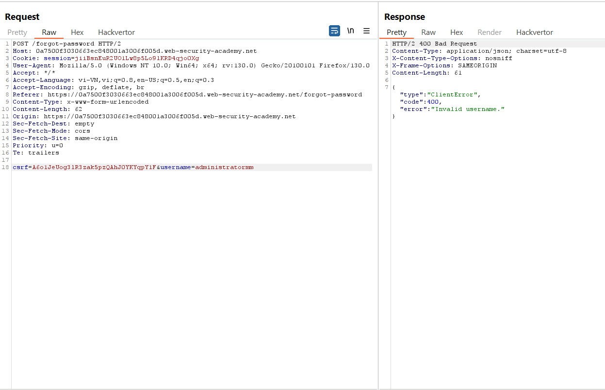

# Server-side parameter pollution
Một số hệ thống chứa các API nội bộ không thể truy cập trực tiếp từ internet. Ô nhiễm tham số phía máy chủ xảy ra khi một trang web nhúng thông tin đầu vào của người dùng trong yêu cầu phía máy chủ vào API nội bộ mà không được mã hóa đầy đủ. Điều này có nghĩa là kẻ tấn công có thể thao túng hoặc chèn các tham số, điều này có thể cho phép chúng thực hiện các hành vi sau:
- Ghi đè các tham số hiện có.
- Sửa đổi hành vi ứng dụng.
- Truy cập dữ liệu trái phép.

Bạn có thể kiểm tra bất kỳ thông tin đầu vào nào của người dùng để tìm bất kỳ loại ô nhiễm tham số nào. Ví dụ: các tham số truy vấn, trường biểu mẫu, tiêu đề và tham số đường dẫn URL đều có thể dễ bị tấn công.\


**Lưu ý:** Lỗ hổng này đôi khi được gọi là `ô nhiễm tham số HTTP`. Tuy nhiên, thuật ngữ này cũng được dùng để chỉ kỹ thuật vượt tường lửa ứng dụng web (WAF). Để tránh nhầm lẫn, trong chủ đề này chúng tôi sẽ chỉ đề cập đến ô nhiễm tham số phía máy chủ.\
Ngoài ra, mặc dù có tên tương tự nhưng lớp lỗ hổng này có rất ít điểm chung với ô nhiễm nguyên mẫu phía máy chủ.

## Testing for server-side parameter pollution in the query string
Để kiểm tra mức độ ô nhiễm tham số phía máy chủ trong chuỗi truy vấn, hãy đặt các ký tự cú pháp truy vấn như `#`, `&` và `=` vào thông tin đầu vào của bạn và quan sát cách ứng dụng phản hồi.\
Hãy xem xét một ứng dụng dễ bị tấn công cho phép bạn tìm kiếm những người dùng khác dựa trên tên người dùng của họ. Khi bạn tìm kiếm một người dùng, trình duyệt của bạn sẽ đưa ra yêu cầu sau:\
`GET /userSearch?name=peter&back=/home`\
Để truy xuất thông tin người dùng, máy chủ truy vấn API nội bộ với yêu cầu sau:\
`GET /users/search?name=peter&publicProfile=true`

### Truncating query strings
Bạn có thể sử dụng ký tự `#` được mã hóa URL để cố gắng **cắt bớt yêu cầu phía máy chủ**. Để giúp bạn diễn giải phản hồi, bạn cũng có thể thêm một chuỗi sau ký tự `#`.\
Ví dụ: bạn có thể sửa đổi chuỗi truy vấn thành như sau:\
`GET /userSearch?name=peter%23foo&back=/home`\
Giao diện người dùng sẽ cố gắng truy cập URL sau:\
`GET /users/search?name=peter#foo&publicProfile=true`

**Note:** Điều cần thiết là bạn phải mã hóa URL ký tự ``#``. Nếu không, ứng dụng giao diện người dùng sẽ hiểu nó là mã định danh phân đoạn và nó sẽ không được chuyển tới API nội bộ.

Xem lại phản hồi để tìm manh mối về việc liệu truy vấn có bị cắt ngắn hay không. Ví dụ: nếu phản hồi trả về `peter` của người dùng thì truy vấn phía máy chủ có thể đã bị cắt bớt. Nếu thông báo lỗi `Invalid name` được trả về thì ứng dụng có thể đã coi `foo` như một phần của tên người dùng. Điều này cho thấy rằng yêu cầu phía máy chủ có thể chưa bị cắt bớt.\
Nếu bạn có thể cắt ngắn yêu cầu phía máy chủ, điều này sẽ loại bỏ yêu cầu đặt trường `publicProfile` thành `true`. Bạn có thể khai thác điều này để trả về hồ sơ người dùng không công khai.
### Injecting invalid parameters
Bạn có thể sử dụng ký tự `&` được mã hóa URL để cố gắng thêm tham số thứ hai vào yêu cầu phía máy chủ.\
Ví dụ: bạn có thể sửa đổi chuỗi truy vấn thành như sau:\
`GET /userSearch?name=peter%26foo=xyz&back=/home`\
Điều này dẫn đến yêu cầu phía máy chủ sau tới API nội bộ:\
`GET /users/search?name=peter&foo=xyz&publicProfile=true`

Xem lại phản hồi để tìm manh mối về cách phân tích cú pháp tham số bổ sung. Ví dụ: nếu phản hồi không thay đổi, điều này có thể cho biết rằng tham số đã được đưa vào thành công nhưng bị ứng dụng bỏ qua.
### Injecting valid parameters
Nếu bạn có thể sửa đổi chuỗi truy vấn, thì bạn có thể thử thêm tham số hợp lệ thứ hai vào yêu cầu phía máy chủ.\
Ví dụ: nếu bạn đã xác định được tham số `email`, bạn có thể thêm tham số đó vào chuỗi truy vấn như sau:\
`GET /userSearch?name=peter%26email=foo&back=/home`\
Điều này dẫn đến yêu cầu phía máy chủ sau tới API nội bộ:\
`GET /users/search?name=peter&email=foo&publicProfile=true`\
Xem lại phản hồi để tìm manh mối về cách phân tích cú pháp tham số bổ sung.
### Overriding existing parameters
Để xác nhận xem ứng dụng có dễ bị nhiễm tham số phía máy chủ hay không, bạn có thể thử ghi đè tham số ban đầu. Thực hiện việc này bằng cách thêm tham số thứ hai có cùng tên.\
Ví dụ: bạn có thể sửa đổi chuỗi truy vấn thành như sau:\
`GET /userSearch?name=peter%26name=carlos&back=/home`\
Điều này dẫn đến yêu cầu phía máy chủ sau tới API nội bộ:\
`GET /users/search?name=peter&name=carlos&publicProfile=true`\
API nội bộ diễn giải hai tham số tên. Tác động của điều này phụ thuộc vào cách ứng dụng xử lý tham số thứ hai. Điều này thay đổi tùy theo công nghệ web khác nhau. Ví dụ:\
- PHP chỉ phân tích tham số cuối cùng. Điều này sẽ dẫn đến việc người dùng tìm kiếm `carlos`.
- ASP.NET kết hợp cả hai tham số. Điều này sẽ dẫn đến việc người dùng tìm kiếm `peter`,`carlos`, điều này có thể dẫn đến thông báo lỗi `Invalid username`.
- Node.js/express chỉ phân tích tham số đầu tiên. Điều này sẽ dẫn đến việc người dùng tìm kiếm `peter` và đưa ra kết quả không thay đổi.

Nếu có thể ghi đè tham số ban đầu, bạn có thể tiến hành khai thác. Ví dụ: bạn có thể thêm `name=administrator` vào yêu cầu. Điều này có thể cho phép bạn đăng nhập với tư cách người dùng quản trị viên.

Ví dụ: https://portswigger.net/web-security/api-testing/server-side-parameter-pollution/lab-exploiting-server-side-parameter-pollution-in-query-string

Khi thay đổi `username` thì server trả về `Invalid username` từ đây ta có thể xác định tên admin là `administrator`:\


Sau đó ta sẽ cố gắng tìm thêm parameter bị giấu:
- Thêm `&x=y`:\

- Thêm `#`:\


Như vậy là có thể có parameter `field` đã bị cắt do dùng kí tự `#`.

Payload `&field=x#`:\


Điều này chứng tỏ ta đã có thể chèn `field` khi gửi request.

Chuyển đến intruder với payload list là `Server-side variable names`:\


Ta thấy có 2 value trả về 200 là `email` và `username`:\


Vậy ở đây ta hiểu nếu có parameter đó thì server sẽ trả về 200, quay lại `Proxy` ta thấy có file JS `forgotPassword.js`, đọc code ta thấy có parameter `reset-token`:\
\


Ta sẽ đưa vào `field` để xem kết quả:\


Bây giờ ta có thể request đến URL `/forgot-password?reset_token=123456789` để thay đổi mật khẩu:\

## Testing for server-side parameter pollution in REST paths
API RESTful có thể đặt tên và giá trị tham số trong đường dẫn URL, thay vì chuỗi truy vấn. Ví dụ: hãy xem xét đường dẫn sau:\
`/api/users/123`\
Đường dẫn URL có thể được chia nhỏ như sau:
- `/api` là the root API endpoint.
- `/users` đại diện cho một tài nguyên, trong trường hợp này là `users`
- `/123` đại diện cho một tham số, ở đây là mã định danh cho người dùng cụ thể.

Hãy xem xét một ứng dụng cho phép bạn chỉnh sửa hồ sơ người dùng dựa trên tên người dùng của họ. Yêu cầu được gửi đến điểm cuối sau:\
`GET /edit_profile.php?name=peter`\
Điều này dẫn đến yêu cầu phía máy chủ sau:\
`GET /api/private/users/peter`\
Kẻ tấn công có thể thao túng các tham số đường dẫn URL phía máy chủ để khai thác API. Để kiểm tra lỗ hổng này, hãy thêm trình tự truyền tải đường dẫn (`../`) để sửa đổi các tham số và quan sát cách ứng dụng phản hồi.\
Bạn có thể gửi `peter/../admin` được `mã hóa URL` làm giá trị của tham số `name`:\
`GET /edit_profile.php?name=peter%2f..%2fadmin`\
Điều này có thể dẫn đến yêu cầu phía máy chủ sau:\
`GET /api/private/users/peter/../admin`\
Nó có thể được phân giải thành:\ 
`/api/private/users/admin`

Ví dụ: https://portswigger.net/web-security/api-testing/server-side-parameter-pollution/lab-exploiting-server-side-parameter-pollution-in-rest-url

(Chưa làm)

## Testing for server-side parameter pollution in structured data formats
Kẻ tấn công có thể thao túng các tham số để khai thác lỗ hổng trong quá trình xử lý các định dạng dữ liệu có cấu trúc khác của máy chủ, chẳng hạn như JSON hoặc XML. Để kiểm tra điều này, hãy đưa dữ liệu có cấu trúc không mong muốn vào thông tin đầu vào của người dùng và xem máy chủ phản hồi như thế nào.\
Hãy xem xét một ứng dụng cho phép người dùng chỉnh sửa hồ sơ của họ, sau đó áp dụng các thay đổi của họ kèm theo yêu cầu đối với API phía máy chủ. Khi bạn chỉnh sửa tên của mình, trình duyệt của bạn sẽ đưa ra yêu cầu sau:
```
POST /myaccount
name=peter
```
Điều này dẫn đến yêu cầu phía máy chủ sau:\
```
PATCH /users/7312/update
{"name":"peter"}
```
Bạn có thể thử thêm tham số `access_level` vào yêu cầu như sau:
```
POST /myaccount
name=peter","access_level":"administrator
```
Nếu dữ liệu đầu vào của người dùng được thêm vào dữ liệu JSON phía máy chủ mà không được xác thực hoặc sàng lọc đầy đủ thì điều này sẽ dẫn đến yêu cầu phía máy chủ sau:
```
PATCH /users/7312/update
{name="peter","access_level":"administrator"}
```
Điều này có thể dẫn đến việc người dùng `peter` được cấp quyền truy cập quản trị viên.

Hãy xem xét một ví dụ tương tự, nhưng dữ liệu đầu vào của người dùng phía máy khách nằm trong dữ liệu JSON. Khi bạn chỉnh sửa tên của mình, trình duyệt của bạn sẽ đưa ra yêu cầu sau:
```
POST /myaccount
{"name": "peter"}
```
Điều này dẫn đến yêu cầu phía máy chủ sau:
```
PATCH /users/7312/update
{"name":"peter"}
```
Bạn có thể thử thêm tham số `access_level` vào yêu cầu như sau:
```
POST /myaccount
{"name": "peter\",\"access_level\":\"administrator"}
```
Nếu dữ liệu đầu vào của người dùng được giải mã, sau đó được thêm vào dữ liệu JSON phía máy chủ mà không được mã hóa đầy đủ, điều này sẽ dẫn đến yêu cầu phía máy chủ sau:
```
PATCH /users/7312/update
{"name":"peter","access_level":"administrator"}
```
Một lần nữa, điều này có thể dẫn đến việc người dùng `peter` được cấp quyền truy cập quản trị viên.

Việc chèn định dạng có cấu trúc cũng có thể xảy ra trong các phản hồi. Ví dụ: điều này có thể xảy ra nếu thông tin đầu vào của người dùng được lưu trữ an toàn trong cơ sở dữ liệu, sau đó được nhúng vào phản hồi JSON từ API phụ trợ mà không được mã hóa đầy đủ. Bạn thường có thể phát hiện và khai thác việc chèn định dạng có cấu trúc trong các phản hồi giống như cách bạn có thể thực hiện trong các yêu cầu.
