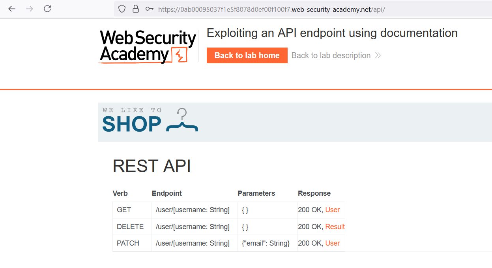
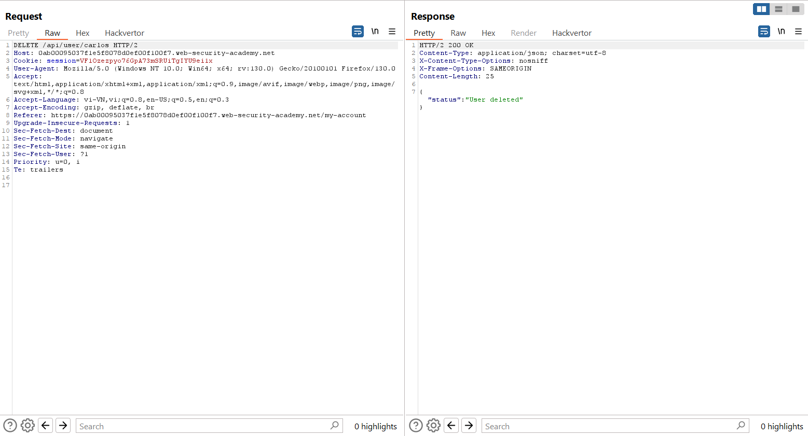
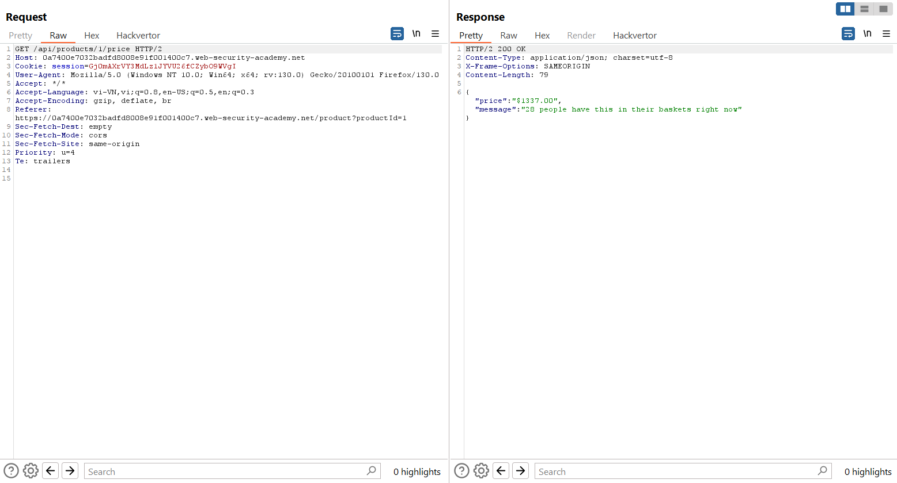
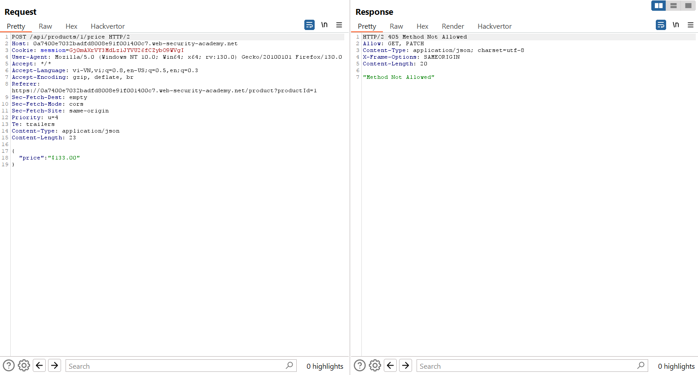
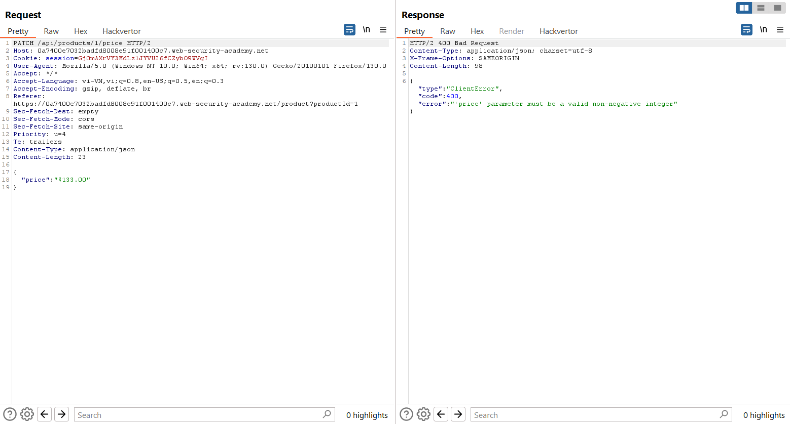
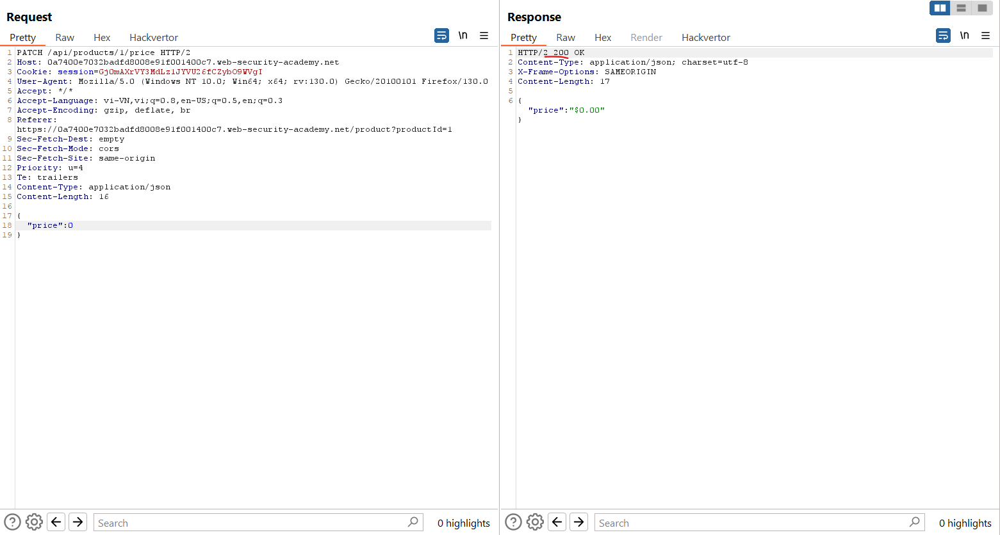
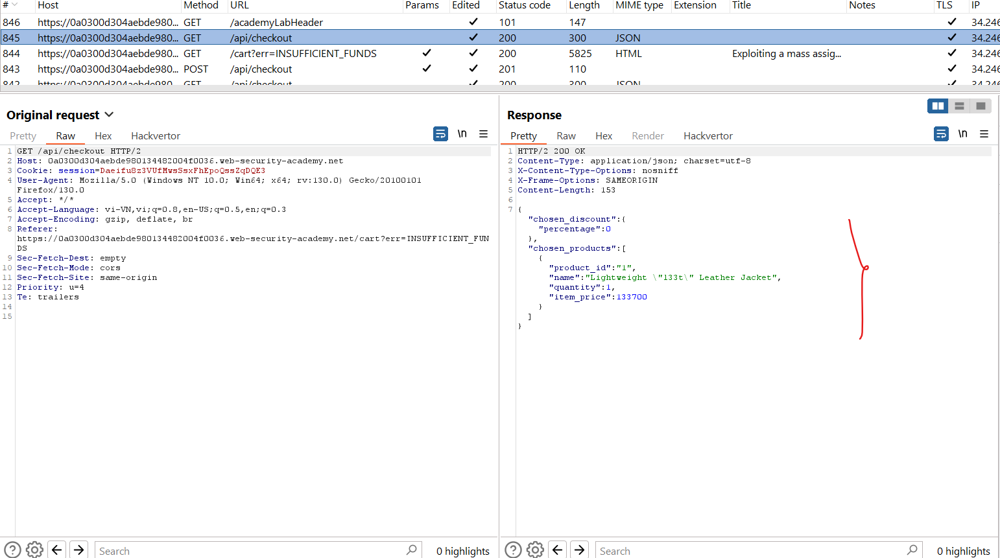
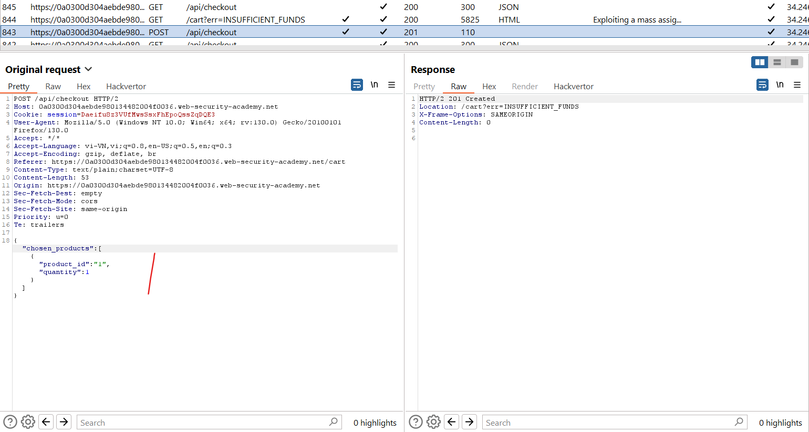
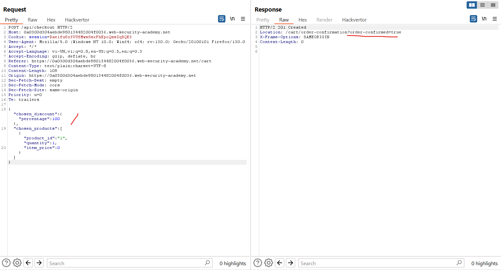

# API testing
API (Application Programming Interfaces) cho phép các hệ thống phần mềm và ứng dụng giao tiếp và chia sẻ dữ liệu. Kiểm tra API rất quan trọng vì các lỗ hổng trong API có thể làm suy yếu các khía cạnh cốt lõi về tính bảo mật, tính toàn vẹn và tính khả dụng của trang web.\
Tất cả các trang web động đều bao gồm các API, vì vậy các lỗ hổng web cổ điển `SQLi` có thể được phân loại là thử nghiệm API. Trong chủ đề này, chúng tôi sẽ hướng dẫn bạn cách kiểm tra các API không được giao diện người dùng trang web sử dụng đầy đủ, tập trung vào `API RESTful` và `JSON`. Chúng tôi cũng sẽ hướng dẫn bạn cách kiểm tra các lỗ hổng ô nhiễm thông số phía máy chủ có thể ảnh hưởng đến các API nội bộ.
## API recon
Để bắt đầu thử nghiệm API, trước tiên bạn cần tìm hiểu càng nhiều thông tin về API càng tốt để khám phá bề mặt tấn công của nó.\
Để bắt đầu, bạn nên xác định các `API endpoint`. Đây là những vị trí mà API nhận được yêu cầu về một tài nguyên cụ thể trên máy chủ của nó. Ví dụ: hãy xem xét yêu cầu `GET` sau:
```
GET /api/books HTTP/1.1
Host: example.com
```
API endpoint cho request này là `/api/books`. Điều này dẫn đến sự tương tác với API để truy xuất danh sách sách từ thư viện. Ví dụ: một điểm cuối API khác có thể là `/api/books/mystery`, sẽ truy xuất danh sách các cuốn sách bí ẩn.\
Khi bạn đã xác định được điểm cuối, bạn cần xác định cách tương tác với chúng. Điều này cho phép bạn tạo các yêu cầu HTTP hợp lệ để kiểm tra API. Ví dụ: bạn nên tìm hiểu thông tin về những điều sau:
- Dữ liệu đầu vào mà API xử lý, bao gồm cả tham số bắt buộc và tùy chọn.
- Các loại yêu cầu mà API chấp nhận, bao gồm các phương thức HTTP và định dạng phương tiện được hỗ trợ.
- Rate limit và cơ chế xác thực.
## API documentation
API thường được ghi lại để các nhà phát triển biết cách sử dụng và tích hợp với chúng.\
Tài liệu có thể ở cả dạng người đọc được và máy đọc được. Tài liệu mà con người có thể đọc được được thiết kế để các nhà phát triển hiểu cách sử dụng API. Nó có thể bao gồm các giải thích chi tiết, ví dụ và kịch bản sử dụng. Tài liệu có thể đọc được bằng máy được thiết kế để xử lý bằng phần mềm nhằm tự động hóa các tác vụ như tích hợp và xác thực API. Nó được viết ở các định dạng có cấu trúc như JSON hoặc XML.\
Tài liệu API thường được cung cấp công khai, đặc biệt nếu API dành cho các nhà phát triển bên ngoài sử dụng. Nếu đúng như vậy, hãy luôn bắt đầu quá trình điều tra của bạn bằng cách xem lại tài liệu.
### Discovering API documentation
Ngay cả khi tài liệu API không có sẵn công khai, bạn vẫn có thể truy cập tài liệu đó bằng cách duyệt qua các ứng dụng sử dụng API.\
Để thực hiện việc này, bạn có thể sử dụng Burp Scanner để thu thập dữ liệu API. Bạn cũng có thể duyệt ứng dụng theo cách thủ công bằng trình duyệt của Burp. Hãy tìm các điểm cuối có thể tham khảo tài liệu API, ví dụ:
- /api
- /swagger/index.html
- /openapi.json

Nếu bạn xác định điểm cuối cho tài nguyên, hãy đảm bảo điều tra đường dẫn cơ sở. Ví dụ: nếu bạn xác định điểm cuối tài nguyên `/api/swagger/v1/users/123` thì bạn nên điều tra các đường dẫn sau:
- /api/swagger/v1
- /api/swagger
- /api

Bạn cũng có thể sử dụng danh sách các đường dẫn phổ biến để tìm tài liệu bằng Intruder.

Ví dụ: https://portswigger.net/web-security/api-testing/lab-exploiting-api-endpoint-using-documentation

Từ trang api, ta biết có các endpoint:\


Từ đây ta có thể sử dụng để xóa user mà ko cần là admin:\


### Using machine-readable documentation
Bạn có thể sử dụng nhiều công cụ tự động để phân tích mọi tài liệu API mà máy có thể đọc được mà bạn tìm thấy. Bạn có thể sử dụng `Burp Scanner` để thu thập thông tin và kiểm tra tài liệu OpenAPI hoặc bất kỳ tài liệu nào khác ở định dạng JSON hoặc YAML. Bạn cũng có thể phân tích tài liệu OpenAPI bằng BApp `OpenAPI Parser`. Bạn cũng có thể sử dụng một công cụ chuyên dụng để kiểm tra các điểm cuối được ghi lại, chẳng hạn như `Postman` hoặc `SoapUI`.

## Identifying API endpoints
Bạn cũng có thể thu thập nhiều thông tin bằng cách duyệt các ứng dụng sử dụng API. Điều này thường đáng làm ngay cả khi bạn có quyền truy cập vào tài liệu API vì đôi khi tài liệu có thể không chính xác hoặc lỗi thời.\
Bạn có thể sử dụng Burp Scanner để thu thập dữ liệu ứng dụng, sau đó điều tra thủ công bề mặt tấn công thú vị bằng trình duyệt của Burp.\
Trong khi duyệt ứng dụng, hãy tìm các mẫu đề xuất điểm cuối API trong cấu trúc URL, chẳng hạn như `/api/`. Ngoài ra, hãy chú ý đến các tệp JavaScript. Chúng có thể chứa các tham chiếu đến điểm cuối API mà bạn chưa kích hoạt trực tiếp qua trình duyệt web. Máy quét Burp tự động trích xuất một số điểm cuối trong quá trình thu thập thông tin, nhưng để trích xuất nặng hơn, hãy sử dụng `JS Link Finder` BApp. Bạn cũng có thể xem lại các tệp JavaScript theo cách thủ công trong Burp.
### Interacting with API endpoints
Khi bạn đã xác định được điểm cuối API, hãy tương tác với chúng bằng cách sử dụng `Burp Repeater` và `Burp Intruder`. Điều này cho phép bạn quan sát hành vi của API và khám phá bề mặt tấn công bổ sung. Ví dụ: bạn có thể điều tra cách API phản hồi khi thay đổi phương thức HTTP và loại phương tiện.\
Khi bạn tương tác với các điểm cuối API, hãy xem xét kỹ các thông báo lỗi và các phản hồi khác. Đôi khi những thông tin này bao gồm thông tin mà bạn có thể sử dụng để xây dựng một yêu cầu HTTP hợp lệ.
### Identifying supported HTTP methods
Phương thức HTTP chỉ định hành động sẽ được thực hiện trên tài nguyên. Ví dụ:
- GET - Lấy dữ liệu từ một tài nguyên.
- PATCH - Áp dụng các thay đổi một phần cho tài nguyên.
- OPTIONS - Truy xuất thông tin về các loại phương thức yêu cầu có thể được sử dụng trên tài nguyên.

Điểm cuối API có thể hỗ trợ các phương thức HTTP khác nhau. Do đó, điều quan trọng là phải kiểm tra tất cả các phương pháp tiềm năng khi bạn điều tra các điểm cuối API. Điều này có thể cho phép bạn xác định chức năng điểm cuối bổ sung, mở ra nhiều bề mặt tấn công hơn.\
Ví dụ: điểm cuối `/api/tasks` có thể hỗ trợ các phương thức sau:
- GET /api/tasks - Truy xuất danh sách các nhiệm vụ.
- POST /api/tasks - Tạo một tác vụ mới.
- DELETE /api/tasks/1 - Xóa một tác vụ.

### Identifying supported content types
Điểm cuối API thường mong đợi dữ liệu ở một định dạng cụ thể. Do đó, chúng có thể hoạt động khác nhau tùy thuộc vào loại nội dung của dữ liệu được cung cấp trong yêu cầu. Việc thay đổi loại nội dung có thể cho phép bạn:
- Lỗi kích hoạt tiết lộ thông tin hữu ích.
- Bỏ qua hàng phòng thủ thiếu sót.
- Tận dụng sự khác biệt trong logic xử lý. Ví dụ: API có thể an toàn khi xử lý dữ liệu JSON nhưng dễ bị tấn công chèn ép khi xử lý XML.

Để thay đổi loại nội dung, hãy sửa đổi tiêu đề `Content-Type`, sau đó định dạng lại nội dung yêu cầu cho phù hợp. Bạn có thể sử dụng BApp trình chuyển đổi loại nội dung để tự động chuyển đổi dữ liệu được gửi trong các yêu cầu giữa XML và JSON.

Ví dụ: https://portswigger.net/web-security/api-testing/lab-exploiting-unused-api-endpoint

Ta thấy thông tin product được lấy từ 1 api:\


Thử các method khác:\
\


Từ đây ta đổi giá trị thành số nguyên:\



### Using Intruder to find hidden endpoints
Khi đã xác định được một số điểm cuối API ban đầu, bạn có thể sử dụng Intruder để khám phá các điểm cuối ẩn. Ví dụ: hãy xem xét một tình huống trong đó bạn đã xác định điểm cuối API sau để cập nhật thông tin người dùng:\
`PUT /api/user/update`\
Để xác định các điểm cuối ẩn, bạn có thể sử dụng Burp Intruder để tìm các tài nguyên khác có cùng cấu trúc. Ví dụ: bạn có thể thêm tải trọng vào vị trí `/update` của đường dẫn cùng với danh sách các chức năng phổ biến khác, chẳng hạn như `delete` và `add`.\
Khi tìm kiếm các điểm cuối ẩn, hãy sử dụng danh sách từ dựa trên các quy ước đặt tên API phổ biến và thuật ngữ ngành. Đảm bảo bạn cũng bao gồm các thuật ngữ có liên quan đến ứng dụng, dựa trên sự điều tra ban đầu của bạn.

## Finding hidden parameters
Khi thực hiện điều chỉnh API, bạn có thể tìm thấy các tham số không được liệt kê trong document mà API hỗ trợ. Bạn có thể thử sử dụng những thứ này để thay đổi hành vi của ứng dụng. Burp bao gồm nhiều công cụ có thể giúp bạn xác định các thông số ẩn:
- Burp Intruder cho phép bạn tự động khám phá các tham số ẩn, sử dụng danh sách từ gồm các tên tham số phổ biến để thay thế các tham số hiện có hoặc thêm tham số mới. Đảm bảo bạn cũng bao gồm các tên có liên quan đến ứng dụng, dựa trên lần điều tra ban đầu của bạn.
- Công cụ `Param miner` BApp cho phép bạn tự động đoán tới 65.536 tên thông số cho mỗi yêu cầu. Công cụ khai thác thông số tự động đoán các tên có liên quan đến ứng dụng, dựa trên thông tin lấy từ phạm vi.
- Công cụ `Content discovery` cho phép bạn khám phá nội dung không được liên kết từ nội dung hiển thị mà bạn có thể duyệt tới, bao gồm cả các thông số.
### Mass assignment vulnerabilities
Việc gán hàng loạt (còn được gọi là tự động liên kết) có thể vô tình tạo ra các tham số ẩn. Nó xảy ra khi khung phần mềm tự động liên kết các tham số yêu cầu với các trường trên đối tượng bên trong. Do đó, việc gán hàng loạt có thể dẫn đến các tham số hỗ trợ ứng dụng không bao giờ được nhà phát triển dự định xử lý.
#### Identifying hidden parameters
Vì phép gán hàng loạt tạo ra các tham số từ các trường đối tượng nên bạn thường có thể xác định các tham số ẩn này bằng cách kiểm tra thủ công các đối tượng được API trả về.\
Ví dụ: hãy xem xét yêu cầu `PATCH /api/users/`, cho phép người dùng cập nhật tên người dùng và email của họ, đồng thời bao gồm JSON sau:
```
{
    "username": "wiener",
    "email": "wiener@example.com",
}
```
Yêu cầu `GET /api/users/123` đồng thời trả về JSON sau:
```
{
    "id": 123,
    "name": "John Doe",
    "email": "john@example.com",
    "isAdmin": "false"
}
```
Điều này có thể chỉ ra rằng các tham số `id` và `isAdmin` ẩn được liên kết với đối tượng người dùng nội bộ, cùng với các tham số email và tên người dùng đã cập nhật.
#### Testing mass assignment vulnerabilities
Để kiểm tra xem bạn có thể sửa đổi giá trị tham số `isAdmin` được liệt kê hay không, hãy thêm nó vào yêu cầu `PATCH`:
```
{
    "username": "wiener",
    "email": "wiener@example.com",
    "isAdmin": false,
}
```
Ngoài ra, hãy gửi yêu cầu `PATCH` có giá trị tham số `isAdmin` không hợp lệ:
```
{
    "username": "wiener",
    "email": "wiener@example.com",
    "isAdmin": "foo",
}
```
Nếu ứng dụng hoạt động khác đi, điều này có thể gợi ý rằng giá trị không hợp lệ tác động đến logic truy vấn, nhưng giá trị hợp lệ thì không. Điều này có thể chỉ ra rằng người dùng có thể cập nhật thành công tham số này.\
Sau đó, bạn có thể gửi yêu cầu `PATCH` với giá trị tham số `isAdmin` được đặt thành `true` để thử và khai thác lỗ hổng:
```
{
    "username": "wiener",
    "email": "wiener@example.com",
    "isAdmin": true,
}
```
Nếu giá trị `isAdmin` trong yêu cầu được liên kết với đối tượng người dùng mà không được xác thực và sàng lọc đầy đủ, thì `wiener` người dùng có thể được cấp không chính xác các đặc quyền quản trị viên. Để xác định xem trường hợp này có xảy ra hay không, hãy duyệt ứng dụng dưới dạng `wiener` để xem liệu bạn có thể truy cập chức năng quản trị hay không.

Ví dụ: https://portswigger.net/web-security/api-testing/lab-exploiting-mass-assignment-vulnerability

\


Ta thấy ở đây POST đang dùng ít parameter hơn so với GET, có thể ta sẽ dùng được thêm 1 số tham số nữa.

Ta thêm tham số giảm giá và đặt nó là 100%:\


Xem thêm [Server-side parameter pollution](<Server-side parameter pollution.md>)

## Preventing vulnerabilities in APIs
Khi thiết kế API, hãy đảm bảo rằng bảo mật được cân nhắc ngay từ đầu. Đặc biệt, hãy đảm bảo rằng bạn:
- Bảo mật tài liệu hướng dẫn của bạn nếu bạn không muốn API của mình có thể truy cập công khai.
- Đảm bảo tài liệu của bạn được cập nhật để những người thử nghiệm hợp pháp có thể nhìn thấy đầy đủ bề mặt tấn công của API.
- Áp dụng danh sách cho phép các phương thức HTTP được phép.
- Xác thực rằng loại nội dung được mong đợi cho mỗi yêu cầu hoặc phản hồi.
- Sử dụng thông báo lỗi chung chung để tránh cung cấp thông tin có thể hữu ích cho kẻ tấn công.
- Sử dụng các biện pháp bảo vệ trên tất cả các phiên bản API của bạn, không chỉ phiên bản sản xuất hiện tại.

Để ngăn chặn lỗ hổng chuyển nhượng hàng loạt, hãy đưa các thuộc tính mà người dùng có thể cập nhật vào danh sách cho phép và đưa vào danh sách chặn các thuộc tính nhạy cảm mà người dùng không nên cập nhật.


