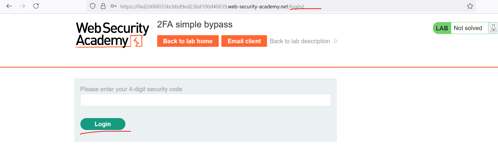
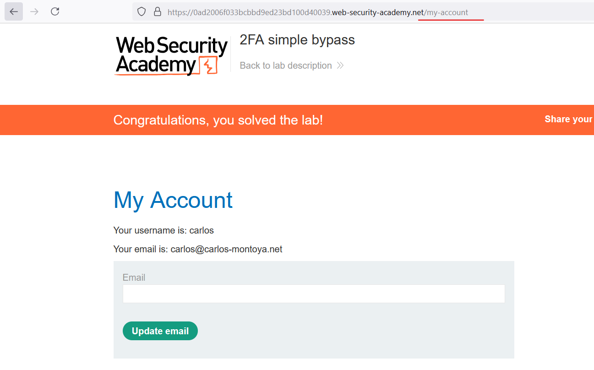
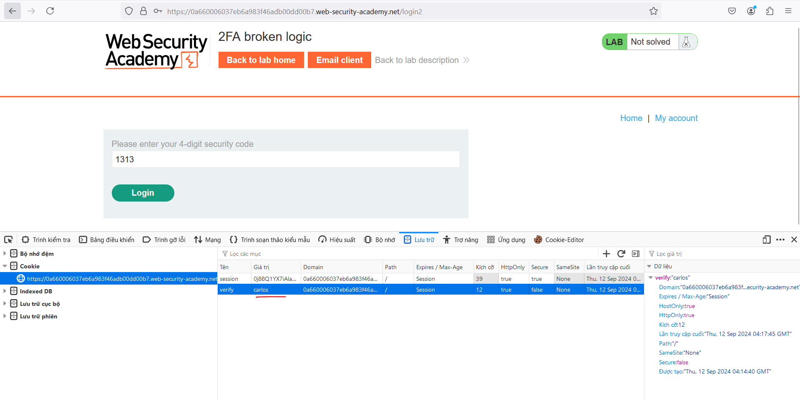
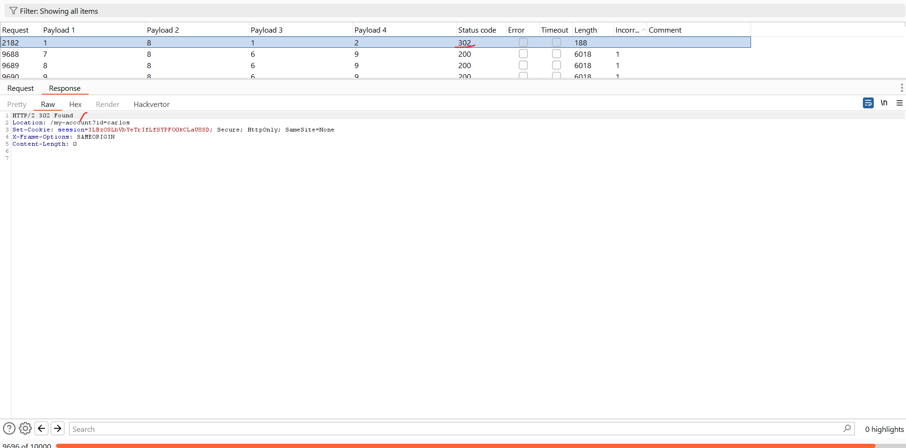
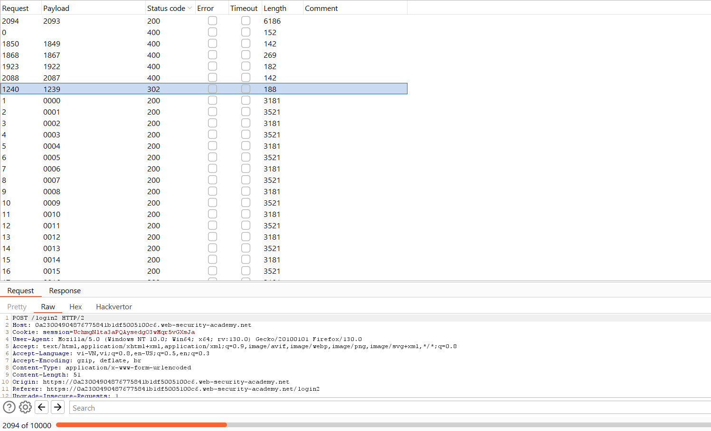

# Vulnerabilities in multi-factor authentication
Trong phần này, chúng ta sẽ xem xét một số lỗ hổng có thể xảy ra trong cơ chế xác thực đa yếu tố. Chúng tôi cũng đã cung cấp một số phòng thí nghiệm tương tác để chứng minh cách bạn có thể khai thác những lỗ hổng này trong xác thực đa yếu tố.\
Nhiều trang web chỉ dựa vào xác thực một yếu tố bằng mật khẩu để xác thực người dùng. Tuy nhiên, một số yêu cầu người dùng chứng minh danh tính của họ bằng nhiều yếu tố xác thực.\
Việc xác minh các yếu tố sinh trắc học là không thực tế đối với hầu hết các trang web. Tuy nhiên, ngày càng phổ biến việc thấy cả xác thực hai yếu tố bắt buộc và tùy chọn (2FA) dựa trên những gì bạn biết `(sth you know)` và những gì bạn có `(sth you have)`. Điều này thường yêu cầu người dùng nhập cả mật khẩu truyền thống và mã xác minh tạm thời từ thiết bị vật lý ngoài băng tần mà họ sở hữu.\
Mặc dù đôi khi kẻ tấn công có thể lấy được một yếu tố dựa trên kiến ​​thức duy nhất, chẳng hạn như mật khẩu, nhưng việc có thể đồng thời lấy được một yếu tố khác từ nguồn ngoài băng tần là ít có khả năng xảy ra hơn. Vì lý do này, xác thực hai yếu tố rõ ràng là an toàn hơn xác thực một yếu tố. Tuy nhiên, giống như bất kỳ biện pháp bảo mật nào, nó chỉ an toàn khi thực hiện nó. Xác thực hai yếu tố được triển khai kém có thể bị đánh bại hoặc thậm chí bị bỏ qua hoàn toàn, giống như xác thực một yếu tố có thể.
## Two-factor authentication tokens
Mã xác minh thường được người dùng đọc từ một loại thiết bị vật lý nào đó. Nhiều trang web có mức độ bảo mật cao hiện cung cấp cho người dùng một thiết bị chuyên dụng cho mục đích này, chẳng hạn như mã thông báo RSA hoặc thiết bị bàn phím mà bạn có thể sử dụng để truy cập ngân hàng trực tuyến hoặc máy tính xách tay làm việc của mình. **Ngoài mục đích được xây dựng nhằm mục đích bảo mật, các thiết bị chuyên dụng này còn có ưu điểm là tạo mã xác minh trực tiếp.** Các trang web cũng thường sử dụng ứng dụng dành riêng cho thiết bị di động, chẳng hạn như **Google Authenticator**, vì lý do tương tự.\
Mặt khác, một số trang web gửi mã xác minh tới điện thoại di động của người dùng dưới dạng tin nhắn văn bản. Mặc dù về mặt kỹ thuật, điều này vẫn đang xác minh yếu tố "thứ bạn có", nhưng nó có nguy cơ bị lạm dụng. Thứ nhất, mã được truyền qua SMS chứ không phải do chính thiết bị tạo ra. Điều này tạo ra khả năng mã bị chặn. Ngoài ra còn có nguy cơ hoán đổi SIM, theo đó kẻ tấn công gian lận lấy được thẻ SIM có số điện thoại của nạn nhân. Kẻ tấn công sau đó sẽ nhận được tất cả tin nhắn SMS được gửi cho nạn nhân, bao gồm cả tin nhắn chứa mã xác minh của họ.
## Bypassing two-factor authentication
Đôi khi, việc triển khai xác thực hai yếu tố có sai sót đến mức có thể bỏ qua hoàn toàn.\
Nếu người dùng được nhắc nhập mật khẩu lần đầu tiên, sau đó được nhắc nhập mã xác minh trên một trang riêng, thì người dùng thực sự đã ở trạng thái "`logged in`" trước khi họ nhập mã xác minh. Trong trường hợp này, bạn nên kiểm tra xem liệu bạn có thể trực tiếp chuyển sang trang "`logged-in only`" sau khi hoàn thành bước xác thực đầu tiên hay không. Đôi khi, bạn sẽ thấy rằng một trang web không thực sự kiểm tra xem bạn có hoàn thành bước thứ hai trước khi tải trang hay không.

Ví dụ: https://portswigger.net/web-security/authentication/multi-factor/lab-2fa-simple-bypass

Sau khi đăng nhập nó sẽ bắt mình nhập 4 kí tự gửi về mail: 


Nhưng thực sự ở đây đã ở trạng thái login rồi nên chỉ cần 1 link chuyển về `/my-account` là có thể thoát khỏi phần điền 4 kí tự này:


## Flawed two-factor verification logic
Đôi khi logic thiếu sót trong xác thực hai yếu tố có nghĩa là sau khi người dùng hoàn thành bước đăng nhập ban đầu, trang web không xác minh đầy đủ rằng chính người dùng đó đang hoàn thành bước thứ hai.\
Ví dụ người dùng đăng nhập bằng thông tin đăng nhập thông thường của họ ở bước đầu tiên như sau:
```
POST /login-steps/first HTTP/1.1
Host: vulnerable-website.com
...
username=carlos&password=qwerty
```
Sau đó, họ được chỉ định một cookie liên quan đến tài khoản của họ trước khi được chuyển sang bước thứ hai của quy trình đăng nhập:
```
HTTP/1.1 200 OK
Set-Cookie: account=carlos

GET /login-steps/second HTTP/1.1
Cookie: account=carlos
```
Khi gửi mã xác minh, yêu cầu sẽ sử dụng cookie này để xác định tài khoản nào người dùng đang cố truy cập:
```
POST /login-steps/second HTTP/1.1
Host: vulnerable-website.com
Cookie: account=carlos
...
verification-code=123456
```
Trong trường hợp này, kẻ tấn công có thể đăng nhập bằng thông tin đăng nhập của riêng họ nhưng sau đó thay đổi giá trị của cookie tài khoản thành bất kỳ tên người dùng tùy ý nào khi gửi mã xác minh.\
```
POST /login-steps/second HTTP/1.1
Host: vulnerable-website.com
Cookie: account=victim-user
...
verification-code=123456
```
Điều này cực kỳ nguy hiểm nếu kẻ tấn công sau đó có thể ép buộc mã xác minh vì nó sẽ cho phép họ đăng nhập vào tài khoản của người dùng tùy ý hoàn toàn dựa trên tên người dùng của họ. Họ thậm chí sẽ không bao giờ cần biết mật khẩu của người dùng.

Ví dụ: https://portswigger.net/web-security/authentication/multi-factor/lab-2fa-broken-logic

Ở bài này ta sẽ sửa cookie cần xác thực thành `Carlos` rồi brute-force mã code mfa đến khi đúng:\
Lưu ý cần gửi request: GET /login2 với cookie `Carlos` để nó sinh ra `mfa` trước khi brute-force:
\

## Brute-forcing 2FA verification codes
Cũng như mật khẩu, các trang web cần thực hiện các bước để ngăn chặn việc ép buộc mã xác minh 2FA bằng brute-force. Điều này đặc biệt quan trọng vì mã thường là số đơn giản có 4 hoặc 6 chữ số. Nếu không có sự bảo vệ mạnh mẽ đầy đủ thì việc bẻ khóa một mã như vậy là chuyện nhỏ.\
Một số trang web cố gắng ngăn chặn điều này bằng cách tự động đăng xuất người dùng nếu họ nhập một số mã xác minh không chính xác. Điều này không hiệu quả trong thực tế vì kẻ tấn công nâng cao thậm chí có thể tự động hóa quy trình gồm nhiều bước này bằng cách tạo macro cho Burp Intruder. Tiện ích mở rộng Turbo Intruder cũng có thể được sử dụng cho mục đích này.

Ví dụ: https://portswigger.net/web-security/authentication/multi-factor/lab-2fa-bypass-using-a-brute-force-attack

Cần thực hiện vài lần để ra kết quả, vì thời gian brute-force khá lâu nên có thể server sẽ đổi `mfa` đi:



