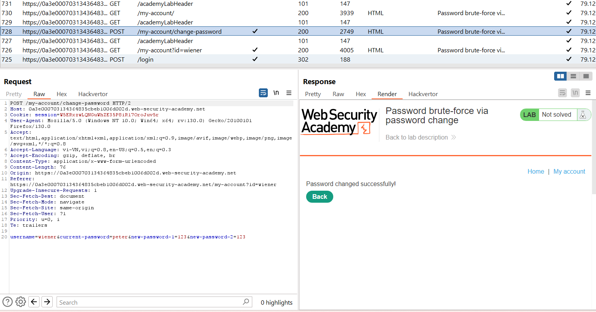

# Vulnerabilities in other authentication mechanisms
Ngoài chức năng đăng nhập cơ bản, các trang web thường cung cấp các tính năng bổ sung cho người dùng quản lý tài khoản như thay đổi hoặc đặt lại mật khẩu. Những cơ chế này có thể chứa lỗ hổng mà kẻ tấn công có thể khai thác. Vì vậy, việc bảo vệ các chức năng liên quan cũng quan trọng như bảo vệ trang đăng nhập chính.
## Keeping users logged in

Tính năng "**Remember me**" hoặc "**Keep me logged in**" thường được triển khai bằng cách tạo ra một **cookie "remember me"** lưu trữ mã token để duy trì đăng nhập. Lỗ hổng xảy ra khi cookie này được tạo dựa trên giá trị có thể đoán được như tên người dùng, thời gian hoặc mật khẩu băm. Kẻ tấn công có thể tạo tài khoản của riêng mình, phân tích cách cookie được tạo ra và sử dụng thông tin này để brute-force cookie của người dùng khác nhằm truy cập tài khoản của họ.

Ví dụ: https://portswigger.net/web-security/authentication/other-mechanisms/lab-brute-forcing-a-stay-logged-in-cookie

Khi đăng nhập với chế độ `stay-logged-in` chúng tạo ra 1 cookie để duy trì đăng nhập: 
\

Base64 decode thì ta được:

Nhận thấy độ dài đoạn hash sau `:` trùng với MD5 ta check thử thì thấy đáp án là `MD5(password) `

Từ đây ta brute-force cho `carlos` với cookie `stay-logged-in` dạng base64(carlos:MD5(password)):
\

Một lỗ hổng khác là sử dụng các kỹ thuật như **XSS** để đánh cắp cookie "remember me". Kẻ tấn công có thể suy ra cách tạo cookie và từ đó truy cập tài khoản của nạn nhân.

Ví dụ: https://portswigger.net/web-security/authentication/other-mechanisms/lab-offline-password-cracking

Ta thấy cookie để xác nhận và duy trì đăng nhập có dạng: `username:hash(password)` bây giờ ta sẽ đi đánh cắp cookie nạn nhân bằng XSS:\
``

Theo dõi log ta thấy: 

Predict đoạn hash: 

Bây giờ ta đã có thể đăng nhập với `carlos`.
## Resetting user passwords

Đặt lại mật khẩu là một tính năng nhạy cảm, và nếu không được triển khai đúng cách, có thể tạo ra lỗ hổng nghiêm trọng. Có nhiều cách mà chức năng này được triển khai với các mức độ an toàn khác nhau.

### Sending passwords by email

Một số trang web gửi mật khẩu mới qua email. Đây là cách tiếp cận nguy hiểm, vì email thường không an toàn và dễ bị chặn. Thay vào đó, tốt hơn là gửi một URL để đặt lại mật khẩu.

### Resetting passwords using a URL
Một phương pháp đặt lại mật khẩu mạnh mẽ hơn là gửi một URL duy nhất tới người dùng để đưa họ đến trang đặt lại mật khẩu. Việc triển khai phương pháp này kém an toàn hơn sử dụng URL có tham số dễ đoán để xác định tài khoản nào đang được đặt lại, ví dụ:\
`http://vulnerable-website.com/reset-password?user=victim-user`\
Trong ví dụ này, kẻ tấn công có thể thay đổi tham số `user` để chỉ bất kỳ tên người dùng nào mà chúng đã xác định. Sau đó, họ sẽ được đưa thẳng đến một trang nơi họ có thể đặt mật khẩu mới cho người dùng tùy ý này.\
Cách triển khai tốt hơn cho quy trình này là tạo mã thông báo có entropy cao, khó đoán và tạo URL đặt lại dựa trên đó. Trong trường hợp tốt nhất, URL này sẽ không cung cấp gợi ý nào về mật khẩu của người dùng nào đang được đặt lại.\
`http://vulnerable-website.com/reset-password?token=a0ba0d1cb3b63d13822572fcff1a241895d893f659164d4cc550b421ebdd48a8`\
Khi người dùng truy cập URL này, hệ thống sẽ kiểm tra xem token này có tồn tại ở back-end hay không và nếu có thì mật khẩu của người dùng nào sẽ được đặt lại. Token này sẽ hết hạn sau một khoảng thời gian ngắn và bị hủy ngay sau khi mật khẩu được đặt lại.\
Tuy nhiên, một số trang web không xác thực lại token khi biểu mẫu đặt lại được gửi. Trong trường hợp này, kẻ tấn công có thể chỉ cần truy cập vào biểu mẫu đặt lại từ tài khoản của chính chúng, xóa mã thông báo và tận dụng trang này để đặt lại mật khẩu của người dùng tùy ý.

ví dụ: https://portswigger.net/web-security/authentication/other-mechanisms/lab-password-reset-broken-logic

Reset password với username `wiener` sẽ có 1 mail gửi về, theo đường link trong mail ta sẽ đến được trang thay đổi mật khẩu:
`https://0ad600c804b2682381acac3300070011.web-security-academy.net/forgot-password?temp-forgot-password-token=u0rvp7w75mrk1h6ca5z025mg60lq1ixh`\
Chú ý đến đoạn `u0rvp7w75mrk1h6ca5z025mg60lq1ixh`, ta nghĩ đến việc đoán đoạn token này sẽ khác với mỗi user và cần xem nó có logic gì để sinh ra ko. Nhưng không đem lại kết quả, ta sẽ thử tiếp để thay đổi mật khẩu: 

Ở đây ta thấy, việc có cả username và password trong POST giúp ta có thể kiểm soát được, nhưng việc có token ngẫu nhiên kia là vấn đề, ta sẽ thử xóa đoạn token đó đi và chỉ để username và password xem sao:

Vẫn thành công, vậy giờ ta sẽ thử với `carlos`:
- Nhập quên mật khẩu với `carlos` để đảm bảo có link gửi về
- Sau đó gửi 1 POST password mới: 

Ok bây giờ đăng nhập `carlos` với password `123`

Nếu URL trong email đặt lại được tạo động thì điều này cũng có thể dễ bị nhiễm độc khi đặt lại mật khẩu. Trong trường hợp này, kẻ tấn công có thể đánh cắp token của người dùng khác và sử dụng nó để thay đổi mật khẩu của họ.

Ví dụ: https://portswigger.net/web-security/authentication/other-mechanisms/lab-password-reset-poisoning-via-middleware

Read more: https://portswigger.net/web-security/host-header/exploiting/password-reset-poisoning

Sau khi điền ở trang Forgot password thì người dùng sẽ nhận được mail:\

Trong mail sẽ có link có gắn thêm token, mục tiêu của ta là lấy được token của `carlos`, đi đến burp suite và chỉnh sửa lại request: 

Ta thêm phần `X-Forwarded-Host` để đánh lừa máy chủ rằng host này là nơi xuất phát:

## Changing user passwords
Thông thường, việc thay đổi mật khẩu bao gồm việc nhập mật khẩu hiện tại và sau đó là mật khẩu mới hai lần. Về cơ bản, các trang này dựa trên cùng một quy trình để kiểm tra xem tên người dùng và mật khẩu hiện tại có khớp với trang đăng nhập thông thường hay không. Do đó, các trang này có thể dễ bị tấn công bởi các kỹ thuật tương tự.\
Chức năng thay đổi mật khẩu có thể đặc biệt nguy hiểm nếu nó cho phép kẻ tấn công truy cập trực tiếp mà không cần đăng nhập với tư cách là người dùng nạn nhân. Ví dụ: nếu tên người dùng được cung cấp trong trường ẩn, kẻ tấn công có thể chỉnh sửa giá trị này trong yêu cầu nhắm mục tiêu người dùng tùy ý. Điều này có khả năng có thể bị khai thác để liệt kê tên người dùng và mật khẩu mạnh mẽ.

Ví dụ: https://portswigger.net/web-security/authentication/other-mechanisms/lab-password-brute-force-via-password-change

Ở bước change-password ta thấy nếu đổi username và brute-force mật khẩu cũ ta sẽ đổi được mật khẩu mới:\

Chú ý việc, nếu password ko đúng nó sẽ báo password sai, còn nếu password đúng nó sẽ kiểm tra xem 2 mật khẩu mới có khớp ko, vậy nên ta sẽ set 2 mật khẩu mới ko khớp nhau, vì thế khi mật khẩu cũ đúng thì nó sẽ báo lại là mật khẩu mới ko khớp: 

Vì bài này chỉ tìm mật khẩu của Carlos chứ ko phải cố gắng đăng nhập vào carlos nên ko được phép đổi mật khẩu, nếu ta để 2 mk mới trùng nhau thì dù đúng mk cũ nó cũng ko báo thành công!
