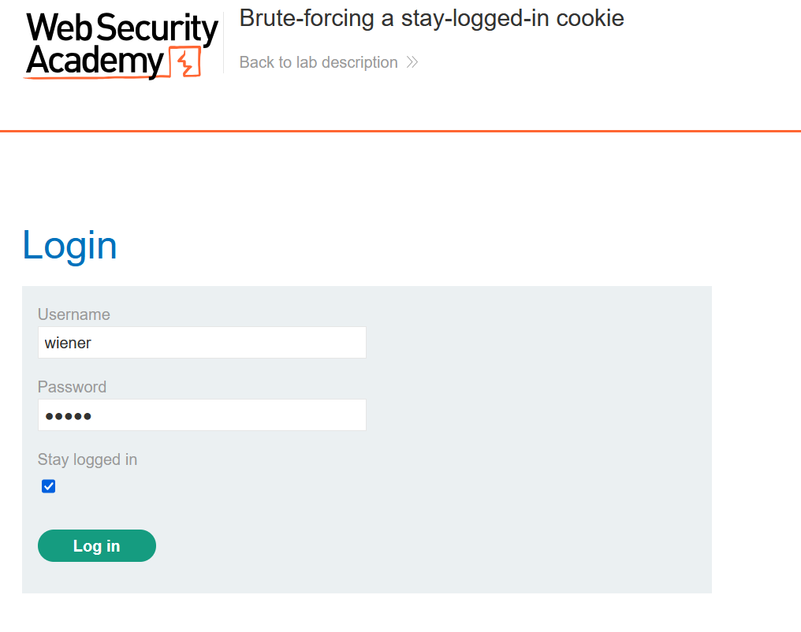

# Vulnerabilities in other authentication mechanisms
Ngoài chức năng đăng nhập cơ bản, hầu hết các trang web đều cung cấp chức năng bổ sung để cho phép người dùng quản lý tài khoản của họ. Ví dụ: người dùng thường có thể thay đổi mật khẩu hoặc đặt lại mật khẩu khi quên. Các cơ chế này cũng có thể tạo ra các lỗ hổng mà kẻ tấn công có thể khai thác.\
Các trang web thường cẩn thận để tránh các lỗ hổng phổ biến trong trang đăng nhập của họ. Nhưng thật dễ dàng để bỏ qua thực tế là bạn cần thực hiện các bước tương tự để đảm bảo rằng chức năng liên quan cũng mạnh mẽ như nhau. Điều này đặc biệt quan trọng trong trường hợp kẻ tấn công có thể tạo tài khoản của riêng mình và do đó có thể dễ dàng truy cập để nghiên cứu các trang bổ sung này.
## Keeping users logged in
Một tính năng phổ biến là tùy chọn duy trì trạng thái đăng nhập ngay cả sau khi đóng phiên trình duyệt. Đây thường là một hộp kiểm đơn giản được gắn nhãn như "**Remember me**" hoặc "**Keep me logged in**".\
Chức năng này thường được triển khai bằng cách tạo ra một loại mã token "remember me", sau đó được lưu trữ trong một cookie liên tục. Vì việc sở hữu cookie này một cách hiệu quả cho phép bạn bỏ qua toàn bộ quá trình đăng nhập, cách tốt nhất là không nên đoán cookie này. Tuy nhiên, một số trang web tạo cookie này dựa trên sự kết hợp có thể dự đoán được của các giá trị tĩnh, chẳng hạn như tên người dùng và dấu thời gian. Một số thậm chí còn sử dụng mật khẩu như một phần của cookie. Cách tiếp cận này đặc biệt nguy hiểm nếu kẻ tấn công có thể tạo tài khoản của riêng mình vì chúng có thể nghiên cứu cookie của riêng mình và có khả năng suy ra cách nó được tạo ra. Sau khi tìm ra công thức, họ có thể cố gắng ép buộc cookie của người dùng khác để có quyền truy cập vào tài khoản của họ.\
Một số trang web cho rằng nếu cookie được mã hóa theo cách nào đó thì sẽ không thể đoán được ngay cả khi nó sử dụng các giá trị tĩnh. Mặc dù điều này có thể đúng nếu được thực hiện chính xác, nhưng việc "mã hóa" cookie một cách ngây thơ bằng cách sử dụng mã hóa hai chiều đơn giản như Base64 không mang lại bất kỳ sự bảo vệ nào. Ngay cả việc sử dụng mã hóa thích hợp với hàm băm một chiều cũng không hoàn toàn chống đạn. Nếu kẻ tấn công có thể dễ dàng xác định thuật toán băm và không sử dụng muối, thì chúng có khả năng tấn công cookie bằng cách băm danh sách từ của chúng. Phương pháp này có thể được sử dụng để vượt qua giới hạn số lần đăng nhập nếu giới hạn tương tự không được áp dụng cho việc đoán cookie.

Ví dụ: https://portswigger.net/web-security/authentication/other-mechanisms/lab-brute-forcing-a-stay-logged-in-cookie

Khi đăng nhập với chế độ `stay-logged-in` chúng tạo ra 1 cookie để duy trì đăng nhập: 
\

Base64 decode thì ta được:

Nhận thấy độ dài đoạn hash sau `:` trùng với MD5 ta check thử thì thấy đáp án là `MD5(password) `

Từ đây ta brute-force cho `carlos` với cookie `stay-logged-in` dạng base64(carlos:MD5(password)):
\

Ngay cả khi kẻ tấn công không thể tạo tài khoản của riêng mình, chúng vẫn có thể khai thác lỗ hổng này. Bằng cách sử dụng các kỹ thuật thông thường, chẳng hạn như XSS, kẻ tấn công có thể đánh cắp cookie "remember me" của người dùng khác và suy ra cách tạo cookie từ đó. Nếu trang web được xây dựng bằng khung nguồn mở thì các chi tiết chính về cấu trúc cookie thậm chí có thể được ghi lại công khai.\
Trong một số trường hợp hiếm hoi, có thể lấy được mật khẩu thực của người dùng ở dạng văn bản rõ ràng từ cookie, ngay cả khi nó được băm. Các phiên bản băm của danh sách mật khẩu phổ biến có sẵn trực tuyến, vì vậy nếu mật khẩu của người dùng xuất hiện trong một trong các danh sách này, việc giải mã hàm băm đôi khi có thể đơn giản như chỉ cần dán hàm băm vào công cụ tìm kiếm. Điều này chứng tỏ tầm quan trọng của muối trong việc mã hóa hiệu quả.

Ví dụ: https://portswigger.net/web-security/authentication/other-mechanisms/lab-offline-password-cracking

Ta thấy cookie để xác nhận và duy trì đăng nhập có dạng: `username:hash(password)` bây giờ ta sẽ đi đánh cắp cookie nạn nhân bằng XSS:\
``

Theo dõi log ta thấy: 

Predict đoạn hash: 

Bây giờ ta đã có thể đăng nhập với `carlos`.
## Resetting user passwords
Trong thực tế, một số người dùng sẽ quên mật khẩu của họ, vì vậy thông thường sẽ có cách để họ đặt lại mật khẩu. Vì xác thực dựa trên mật khẩu thông thường rõ ràng là không thể thực hiện được trong trường hợp này nên các trang web phải dựa vào các phương pháp thay thế để đảm bảo rằng người dùng thực đang đặt lại mật khẩu của chính họ. Vì lý do này, chức năng đặt lại mật khẩu vốn rất nguy hiểm và cần phải được thực hiện một cách an toàn.\
Có một số cách khác nhau mà tính năng này thường được triển khai với mức độ dễ bị tổn thương khác nhau.
### Sending passwords by email
Cần phải nói rằng việc gửi cho người dùng mật khẩu hiện tại của họ sẽ không bao giờ thực hiện được nếu trang web xử lý mật khẩu một cách an toàn ngay từ đầu. Thay vào đó, một số trang web tạo mật khẩu mới và gửi mật khẩu này cho người dùng qua email.\
Nói chung, cần tránh gửi mật khẩu liên tục qua các kênh không an toàn. Trong trường hợp này, tính bảo mật dựa vào việc mật khẩu được tạo sẽ hết hạn sau **một khoảng thời gian rất ngắn hoặc người dùng thay đổi lại mật khẩu của họ ngay lập tức**. Mặt khác, cách tiếp cận này rất dễ bị tấn công bởi kẻ trung gian.\
Email thường không được coi là an toàn vì hộp thư đến vừa cố định vừa không thực sự được thiết kế để lưu trữ an toàn thông tin bí mật. Nhiều người dùng cũng tự động đồng bộ hóa hộp thư đến của họ giữa nhiều thiết bị trên các kênh không an toàn.

### Resetting passwords using a URL
Một phương pháp đặt lại mật khẩu mạnh mẽ hơn là gửi một URL duy nhất tới người dùng để đưa họ đến trang đặt lại mật khẩu. Việc triển khai phương pháp này kém an toàn hơn sử dụng URL có tham số dễ đoán để xác định tài khoản nào đang được đặt lại, ví dụ:\
`http://vulnerable-website.com/reset-password?user=victim-user`\
Trong ví dụ này, kẻ tấn công có thể thay đổi tham số `user` để chỉ bất kỳ tên người dùng nào mà chúng đã xác định. Sau đó, họ sẽ được đưa thẳng đến một trang nơi họ có thể đặt mật khẩu mới cho người dùng tùy ý này.\
Cách triển khai tốt hơn cho quy trình này là tạo mã thông báo có entropy cao, khó đoán và tạo URL đặt lại dựa trên đó. Trong trường hợp tốt nhất, URL này sẽ không cung cấp gợi ý nào về mật khẩu của người dùng nào đang được đặt lại.\
`http://vulnerable-website.com/reset-password?token=a0ba0d1cb3b63d13822572fcff1a241895d893f659164d4cc550b421ebdd48a8`\
Khi người dùng truy cập URL này, hệ thống sẽ kiểm tra xem token này có tồn tại ở back-end hay không và nếu có thì mật khẩu của người dùng nào sẽ được đặt lại. Token này sẽ hết hạn sau một khoảng thời gian ngắn và bị hủy ngay sau khi mật khẩu được đặt lại.\
Tuy nhiên, một số trang web không xác thực lại token khi biểu mẫu đặt lại được gửi. Trong trường hợp này, kẻ tấn công có thể chỉ cần truy cập vào biểu mẫu đặt lại từ tài khoản của chính chúng, xóa mã thông báo và tận dụng trang này để đặt lại mật khẩu của người dùng tùy ý.

ví dụ: https://portswigger.net/web-security/authentication/other-mechanisms/lab-password-reset-broken-logic

Reset password với username `wiener` sẽ có 1 mail gửi về, theo đường link trong mail ta sẽ đến được trang thay đổi mật khẩu:
`https://0ad600c804b2682381acac3300070011.web-security-academy.net/forgot-password?temp-forgot-password-token=u0rvp7w75mrk1h6ca5z025mg60lq1ixh`\
Chú ý đến đoạn `u0rvp7w75mrk1h6ca5z025mg60lq1ixh`, ta nghĩ đến việc đoán đoạn token này sẽ khác với mỗi user và cần xem nó có logic gì để sinh ra ko. Nhưng không đem lại kết quả, ta sẽ thử tiếp để thay đổi mật khẩu: 

Ở đây ta thấy, việc có cả username và password trong POST giúp ta có thể kiểm soát được, nhưng việc có token ngẫu nhiên kia là vấn đề, ta sẽ thử xóa đoạn token đó đi và chỉ để username và password xem sao:

Vẫn thành công, vậy giờ ta sẽ thử với `carlos`:
- Nhập quên mật khẩu với `carlos` để đảm bảo có link gửi về
- Sau đó gửi 1 POST password mới: 

Ok bây giờ đăng nhập `carlos` với password `123`

Nếu URL trong email đặt lại được tạo động thì điều này cũng có thể dễ bị nhiễm độc khi đặt lại mật khẩu. Trong trường hợp này, kẻ tấn công có thể đánh cắp token của người dùng khác và sử dụng nó để thay đổi mật khẩu của họ.

Ví dụ: https://portswigger.net/web-security/authentication/other-mechanisms/lab-password-reset-poisoning-via-middleware

Read more: https://portswigger.net/web-security/host-header/exploiting/password-reset-poisoning

Sau khi điền ở trang Forgot password thì người dùng sẽ nhận được mail:\

Trong mail sẽ có link có gắn thêm token, mục tiêu của ta là lấy được token của `carlos`, đi đến burp suite và chỉnh sửa lại request: 

Ta thêm phần `X-Forwarded-Host` để đánh lừa máy chủ rằng host này là nơi xuất phát:

## Changing user passwords
Thông thường, việc thay đổi mật khẩu bao gồm việc nhập mật khẩu hiện tại và sau đó là mật khẩu mới hai lần. Về cơ bản, các trang này dựa trên cùng một quy trình để kiểm tra xem tên người dùng và mật khẩu hiện tại có khớp với trang đăng nhập thông thường hay không. Do đó, các trang này có thể dễ bị tấn công bởi các kỹ thuật tương tự.\
Chức năng thay đổi mật khẩu có thể đặc biệt nguy hiểm nếu nó cho phép kẻ tấn công truy cập trực tiếp mà không cần đăng nhập với tư cách là người dùng nạn nhân. Ví dụ: nếu tên người dùng được cung cấp trong trường ẩn, kẻ tấn công có thể chỉnh sửa giá trị này trong yêu cầu nhắm mục tiêu người dùng tùy ý. Điều này có khả năng có thể bị khai thác để liệt kê tên người dùng và mật khẩu mạnh mẽ.

Ví dụ: https://portswigger.net/web-security/authentication/other-mechanisms/lab-password-brute-force-via-password-change

Ở bước change-password ta thấy nếu đổi username và brute-force mật khẩu cũ ta sẽ đổi được mật khẩu mới:\

Chú ý việc, nếu password ko đúng nó sẽ báo password sai, còn nếu password đúng nó sẽ kiểm tra xem 2 mật khẩu mới có khớp ko, vậy nên ta sẽ set 2 mật khẩu mới ko khớp nhau, vì thế khi mật khẩu cũ đúng thì nó sẽ báo lại là mật khẩu mới ko khớp: 

Vì bài này chỉ tìm mật khẩu của Carlos chứ ko phải cố gắng đăng nhập vào carlos nên ko được phép đổi mật khẩu, nếu ta để 2 mk mới trùng nhau thì dù đúng mk cũ nó cũng ko báo thành công!
