# Vulnerabilities in password-based login
Đối với các trang web áp dụng quy trình đăng nhập dựa trên mật khẩu, người dùng có thể tự đăng ký tài khoản hoặc được quản trị viên chỉ định một tài khoản. Tài khoản này được liên kết với một tên người dùng duy nhất và một mật khẩu bí mật mà người dùng nhập vào biểu mẫu đăng nhập để xác thực chính họ.\
Trong trường hợp này, việc họ biết mật khẩu bí mật được coi là bằng chứng đầy đủ về danh tính của người dùng. Điều này có nghĩa là tính bảo mật của trang web sẽ bị xâm phạm nếu kẻ tấn công có thể lấy được hoặc đoán thông tin đăng nhập của người dùng khác.\
Điều này có thể đạt được bằng nhiều cách. Các phần sau đây cho thấy cách kẻ tấn công có thể sử dụng các cuộc tấn công bạo lực và một số sai sót trong bảo vệ bạo lực. Bạn cũng sẽ tìm hiểu về các lỗ hổng trong xác thực cơ bản HTTP.

## Brute-force attacks
Tấn công brute-force là khi kẻ tấn công sử dụng hệ thống `thử và sai` để đoán thông tin đăng nhập hợp lệ của người dùng. Các cuộc tấn công này thường được tự động hóa bằng cách sử dụng danh sách từ gồm tên người dùng và mật khẩu. Việc tự động hóa quá trình này, đặc biệt là sử dụng các công cụ chuyên dụng, có khả năng cho phép kẻ tấn công thực hiện số lượng lớn các lần thử đăng nhập ở tốc độ cao.\
Brute-forcing không phải lúc nào cũng chỉ là trường hợp đoán tên người dùng và mật khẩu hoàn toàn ngẫu nhiên. Bằng cách sử dụng logic cơ bản hoặc kiến ​​thức có sẵn công khai, những kẻ tấn công có thể tinh chỉnh các cuộc tấn công brute-force để đưa ra những phỏng đoán có cơ sở hơn nhiều. Điều này làm tăng đáng kể hiệu quả của các cuộc tấn công như vậy. Các trang web dựa vào đăng nhập dựa trên mật khẩu làm phương pháp xác thực người dùng duy nhất có thể rất dễ bị tổn thương nếu không triển khai biện pháp bảo vệ chống brute-force đầy đủ.
### Brute-forcing usernames
Tên người dùng đặc biệt dễ đoán nếu chúng tuân theo một mẫu có thể nhận dạng được, chẳng hạn như địa chỉ email. Ví dụ: rất thường thấy thông tin đăng nhập doanh nghiệp ở định dạng `firstname.lastname@somecompany.com`. Tuy nhiên, ngay cả khi không có mẫu rõ ràng, đôi khi ngay cả những tài khoản có đặc quyền cao cũng được tạo bằng tên người dùng có thể dự đoán được, chẳng hạn như `admin` hoặc `administrator`.\
Trong quá trình kiểm tra, hãy kiểm tra xem trang web có tiết lộ công khai tên người dùng tiềm năng hay không. Ví dụ: bạn có thể truy cập hồ sơ người dùng mà không cần đăng nhập không? Ngay cả khi nội dung thực tế của hồ sơ bị ẩn, tên được sử dụng trong hồ sơ đôi khi giống với tên người dùng đăng nhập. Bạn cũng nên kiểm tra phản hồi HTTP để xem có địa chỉ email nào bị tiết lộ hay không. Đôi khi, phản hồi chứa địa chỉ email của người dùng có đặc quyền cao, chẳng hạn như quản trị viên hoặc bộ phận hỗ trợ CNTT.
### Brute-forcing passwords
Tương tự, mật khẩu có thể bị ép buộc một cách thô bạo, với độ khó thay đổi tùy theo độ mạnh của mật khẩu. Nhiều trang web áp dụng một số hình thức chính sách mật khẩu, buộc người dùng phải tạo mật khẩu có độ entropy cao, ít nhất về mặt lý thuyết, khó bị bẻ khóa hơn chỉ bằng cách sử dụng vũ lực. Điều này thường liên quan đến việc thực thi mật khẩu với:
- Số lượng ký tự tối thiểu
- Sự kết hợp giữa chữ thường và chữ hoa
- Ít nhất một ký tự đặc biệt

Tuy nhiên, mặc dù chỉ riêng máy tính thôi cũng khó có thể bẻ khóa mật khẩu có entropy cao, nhưng chúng ta có thể sử dụng kiến ​​thức cơ bản về hành vi của con người để khai thác các lỗ hổng mà người dùng vô tình đưa vào hệ thống này. Thay vì tạo một mật khẩu mạnh với sự kết hợp ngẫu nhiên của các ký tự, người dùng thường lấy một mật khẩu mà họ có thể nhớ và cố gắng đặt mật khẩu đó sao cho phù hợp với chính sách mật khẩu. Ví dụ: nếu mật khẩu của tôi không được phép, người dùng có thể thử một cái gì đó như Mypassword1! hoặc thay vào đó là Myp4$$w0rd.\
Trong trường hợp chính sách yêu cầu người dùng thay đổi mật khẩu thường xuyên, thông thường người dùng chỉ thực hiện những thay đổi nhỏ, có thể dự đoán được đối với mật khẩu ưa thích của họ. Ví dụ: Mypassword1! trở thành Mypassword1? hoặc Mypassword2!.\
Kiến thức về thông tin xác thực có thể có và các mẫu có thể dự đoán được có nghĩa là các cuộc tấn công vũ phu thường có thể phức tạp hơn nhiều và do đó hiệu quả hơn là chỉ lặp lại qua mọi tổ hợp ký tự có thể có.
### Username enumeration
Liệt kê tên người dùng là khi kẻ tấn công có thể quan sát các thay đổi trong hành vi của trang web để xác định xem tên người dùng nhất định có hợp lệ hay không.\
Việc liệt kê tên người dùng thường xảy ra trên trang đăng nhập, ví dụ: khi bạn nhập tên người dùng hợp lệ nhưng mật khẩu không chính xác hoặc trên biểu mẫu đăng ký khi bạn nhập tên người dùng đã được sử dụng. Điều này giúp giảm đáng kể thời gian và công sức cần thiết để ép buộc đăng nhập vì kẻ tấn công có thể nhanh chóng tạo ra một danh sách rút gọn các tên người dùng hợp lệ.\
Trong khi cố gắng ép buộc một trang đăng nhập, bạn nên đặc biệt chú ý đến bất kỳ sự khác biệt nào về:
- **Status code**: Trong một cuộc brute-force attack, mã trạng thái HTTP được trả về có thể **giống nhau đối với phần lớn** các dự đoán vì hầu hết chúng đều sai. Nếu dự đoán trả về một mã trạng thái khác thì đây là dấu hiệu rõ ràng rằng tên người dùng đã đúng. Cách tốt nhất là các trang web luôn trả về cùng một mã trạng thái bất kể kết quả ra sao, nhưng cách làm này không phải lúc nào cũng được tuân theo.
- **Error messages**: Đôi khi thông báo lỗi trả về khác nhau tùy thuộc vào việc cả tên người dùng VÀ mật khẩu đều sai hay chỉ mật khẩu sai. Cách tốt nhất là các trang web nên sử dụng thông báo chung, giống hệt nhau trong cả hai trường hợp, nhưng đôi khi có những lỗi đánh máy nhỏ. Chỉ cần một ký tự sai vị trí cũng khiến hai thông báo trở nên khác biệt, ngay cả trong trường hợp ký tự đó không hiển thị trên trang được hiển thị.
- **Response times**: Nếu hầu hết các yêu cầu được xử lý với thời gian phản hồi tương tự nhau thì bất kỳ yêu cầu nào khác với điều này đều cho thấy rằng có điều gì đó khác biệt đang xảy ra đằng sau hậu trường. Đây là một dấu hiệu khác cho thấy tên người dùng được đoán có thể đúng. Ví dụ: một trang web chỉ có thể kiểm tra xem mật khẩu có đúng hay không nếu tên người dùng hợp lệ. Bước bổ sung này có thể làm tăng nhẹ thời gian phản hồi. Điều này có thể tinh vi, nhưng kẻ tấn công có thể làm cho sự chậm trễ này trở nên rõ ràng hơn bằng cách nhập mật khẩu quá dài khiến trang web mất nhiều thời gian hơn để xử lý.

Ví dụ về response trả về khác nhau: https://portswigger.net/web-security/authentication/password-based/lab-username-enumeration-via-different-responses

Đăng nhập thử: \ 
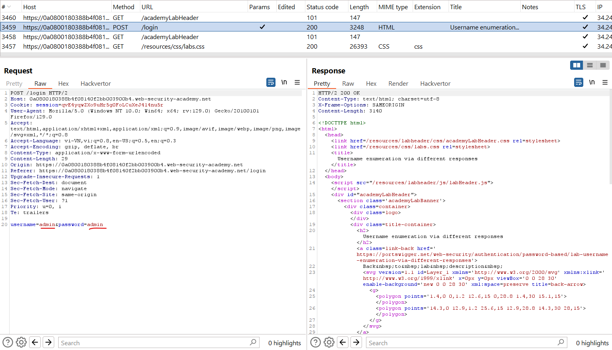

Đưa vào intruder và thêm các payload và tấn công ở `Cluster bomb`, để ý có 3 loại thông báo: 
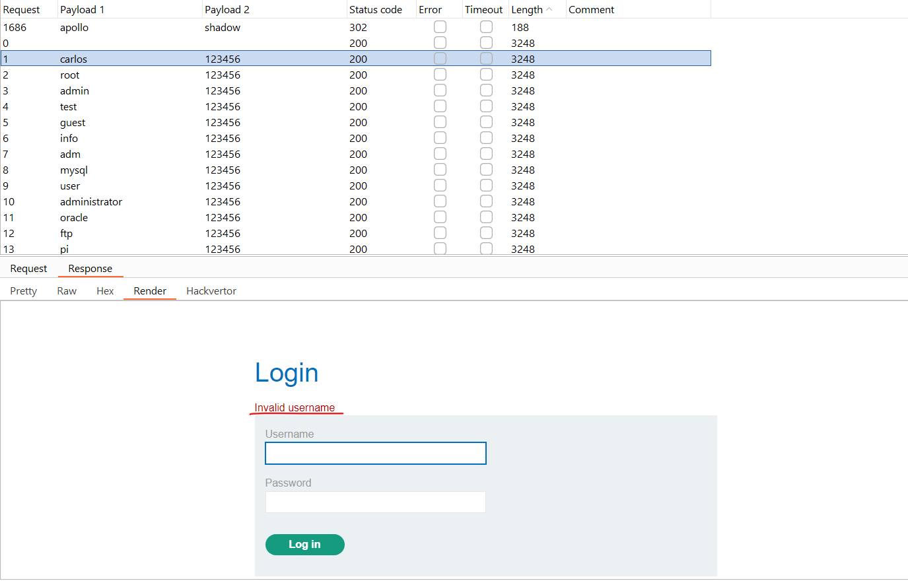\
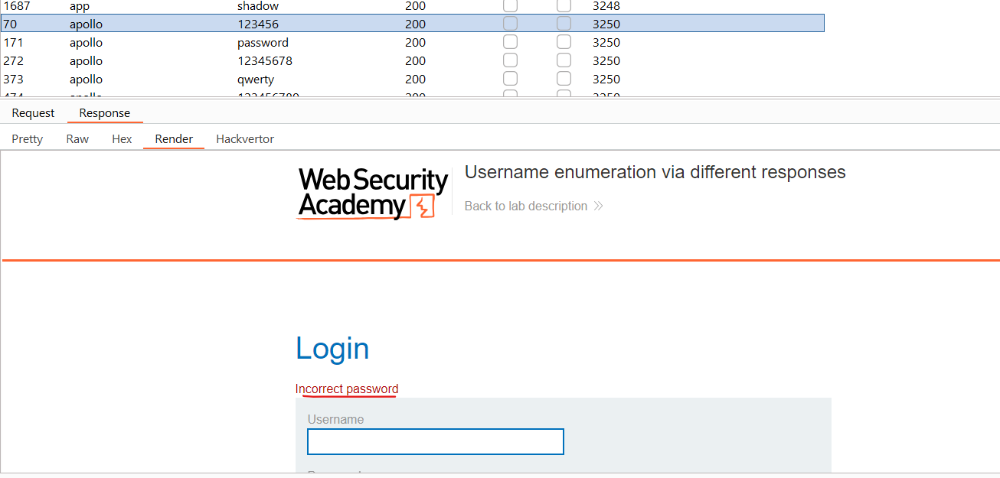\
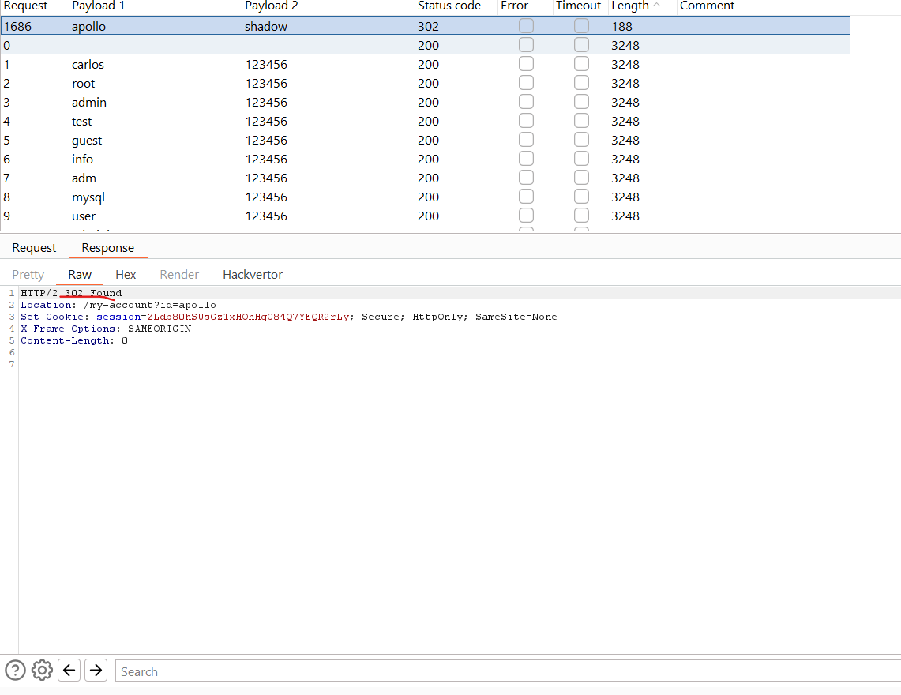\
Với `invalid username` cho ta biết username ko tồn tại, `password incorrect` ta biết được là đã đúng username và `302 Found` cho ta biết đã đúng username và password và tiếp tục chuyển hướng.\
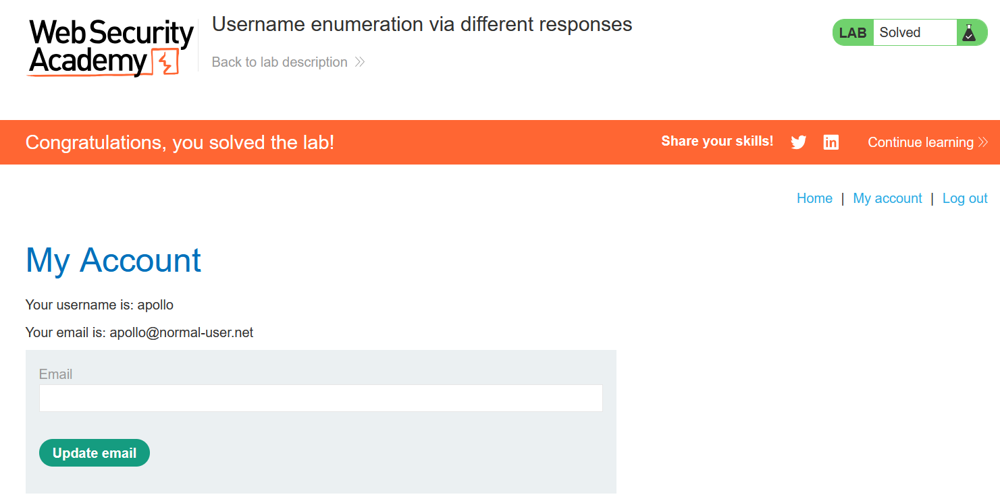

Ví dụ 2 về response trả về khác nhau: https://portswigger.net/web-security/authentication/password-based/lab-username-enumeration-via-subtly-different-responses

Đưa vào intruder tương tự cách trên: 
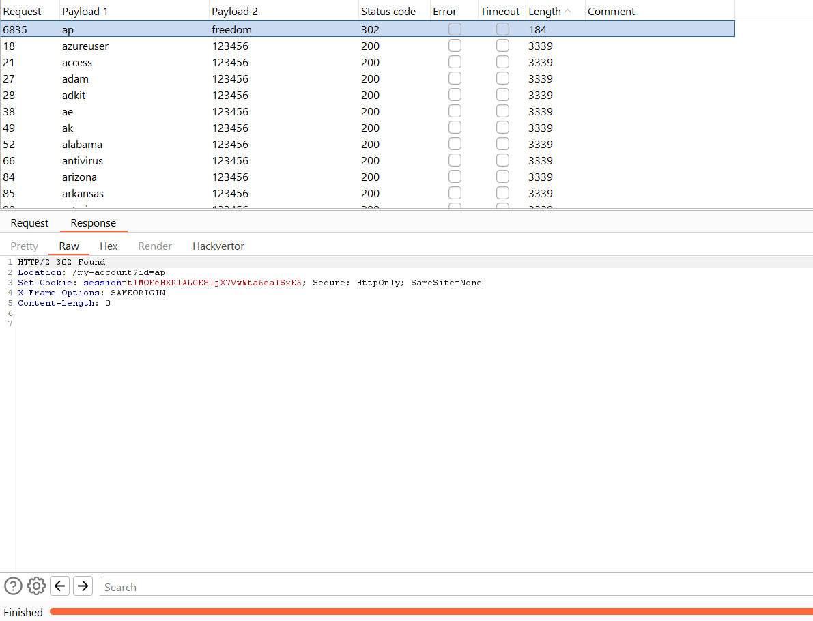

Ví dụ 3 yêu cầu quan sát thời gian: https://portswigger.net/web-security/authentication/password-based/lab-username-enumeration-via-response-timing

Ta để ý thấy khi nhập sai quá nhiều nó sẽ ko phản hồi chính xác nữa, phải đợi 30 phút: 
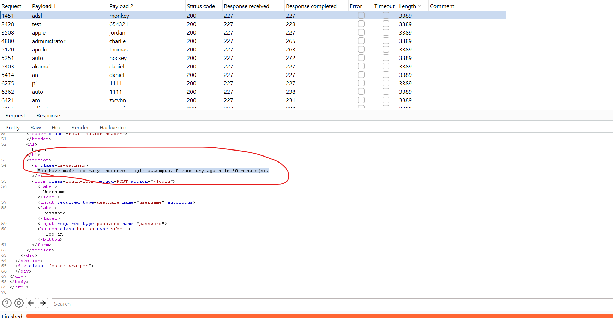

Thêm header `X-Forwarded-For` để điều chỉnh địa chỉ IP nhằm thoát khỏi việc bị ban: 
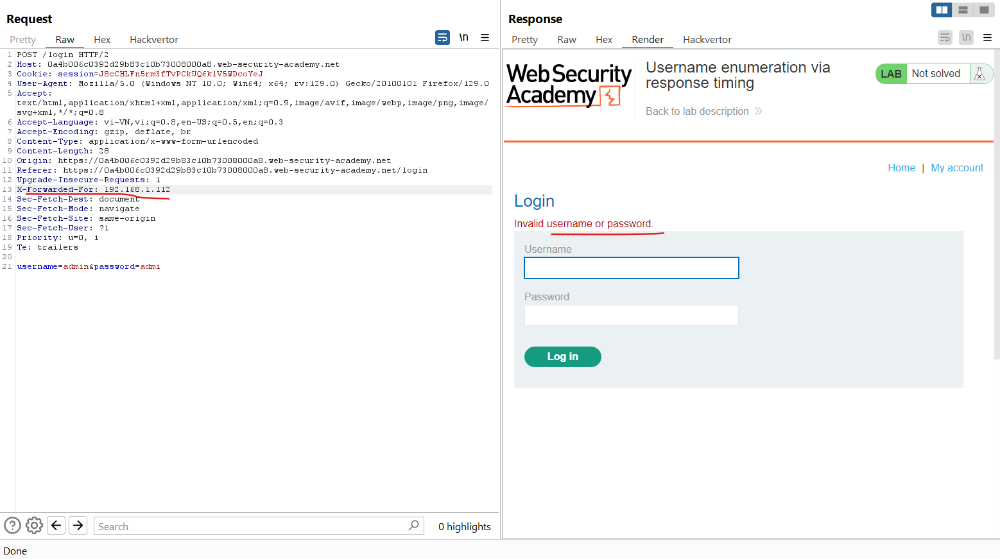

Sau khi thêm dòng trả về đã không còn là đợi 30 phút nữa. 

Vậy bây giờ để intruder ta sẽ cần phải thêm payload của `X-Forwarded-For`, ta sẽ brute-force IP và username trước:\
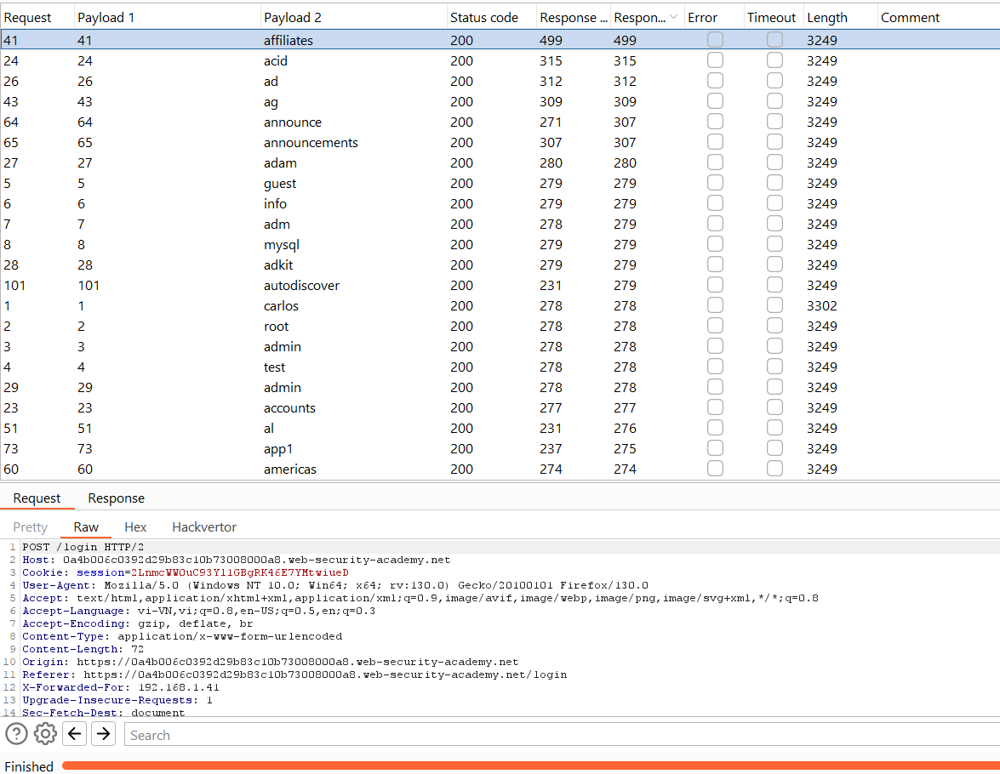\
Ta thấy ở đây có 1 username có thời gian phản hồi lâu hơn khá nhiều các username khác, thử lại 1 vài lần vẫn thế. 

Ta sẽ brute-force với username này và thêm payload IP và password: 
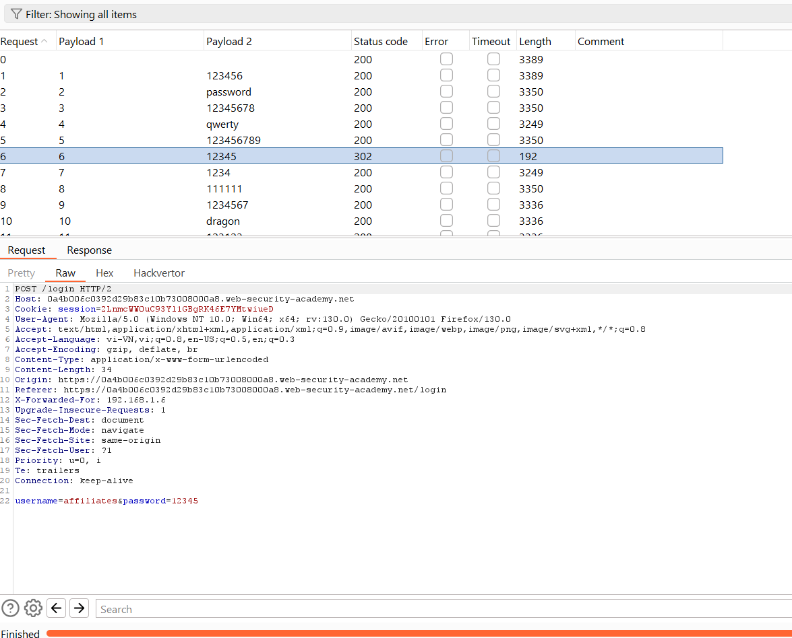

## Flawed brute-force protection
Rất có khả năng một cuộc tấn công brute-force sẽ liên quan đến nhiều lần đoán sai trước khi kẻ tấn công xâm phạm tài khoản thành công. Về mặt logic, protect tránh brute-force xoay quanh việc cố gắng làm cho việc tự động hóa quy trình trở nên phức tạp nhất có thể và làm chậm tốc độ mà kẻ tấn công có thể thử đăng nhập. Hai cách phổ biến nhất để ngăn chặn các cuộc tấn công brute-force là:
- Khóa tài khoản mà người dùng từ xa đang cố truy cập nếu họ đăng nhập thất bại quá nhiều lần
- Chặn địa chỉ IP của người dùng từ xa nếu họ thực hiện quá nhiều lần đăng nhập liên tiếp

Cả hai cách tiếp cận đều đưa ra mức độ bảo vệ khác nhau, nhưng không phải là không thể tránh khỏi, đặc biệt nếu được thực hiện bằng cách sử dụng logic sai sót.\
Ví dụ: đôi khi bạn có thể thấy rằng IP của mình bị chặn nếu bạn không đăng nhập quá nhiều lần. Trong một số triển khai, bộ đếm số lần thử không thành công sẽ được đặt lại nếu chủ sở hữu IP đăng nhập thành công. Điều này có nghĩa là kẻ tấn công chỉ cần đăng nhập vào tài khoản của chính họ sau mỗi vài lần thử để ngăn chặn việc đạt đến giới hạn này.\
Trong trường hợp này, chỉ cần bao gồm thông tin xác thực đăng nhập của riêng bạn đều đặn trong toàn bộ danh sách từ là đủ để khiến việc bảo vệ này gần như vô dụng.

Ví dụ: https://portswigger.net/web-security/authentication/password-based/lab-broken-bruteforce-protection-ip-block

Về bài này vẫn là chặn IP nhưng cơ chế khác, sau khi đăng nhập sai 3 lần thì sẽ bị block, đổi IP bằng `X-Forwarded-For` không còn sử dụng được. Nhưng do cứ mỗi lần đăng nhập thành công, bộ đếm sẽ trở lại là 0, có thể tiếp tục thử. 

Vậy nên ta sẽ dùng payload với `username` và `password` sẽ xem kẽ: `wiener:peter` mỗi 3 dòng. \
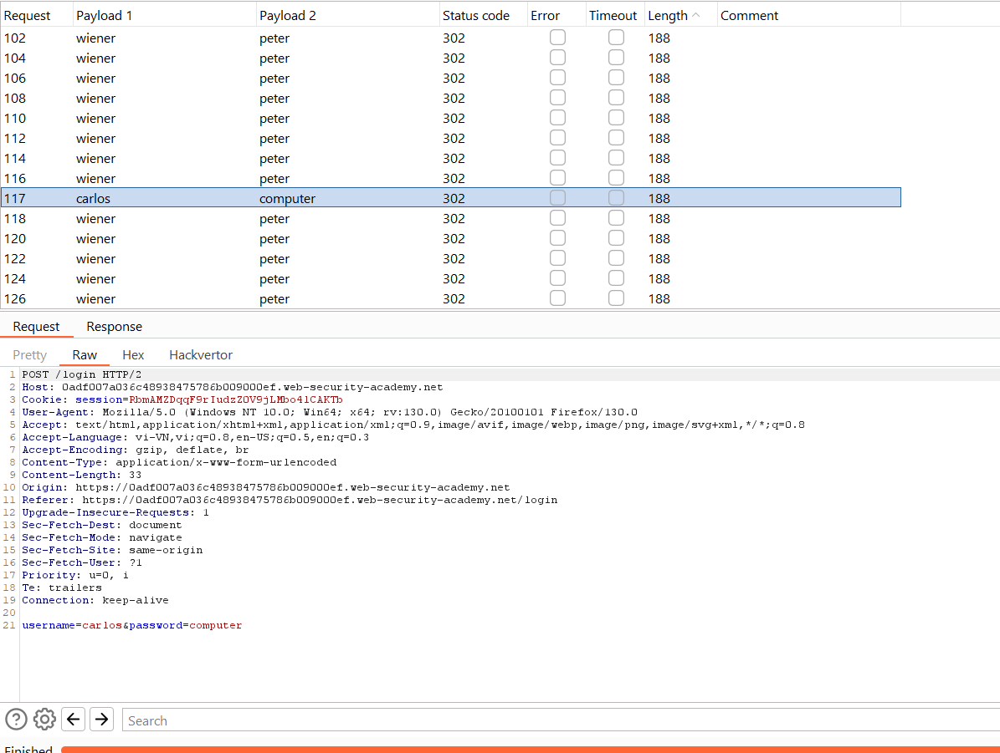

### Account locking
Một cách mà các trang web cố gắng ngăn chặn hành vi brute-force là khóa tài khoản nếu đáp ứng một số tiêu chí đáng ngờ nhất định, thường là một số lần đăng nhập không thành công. Cũng giống như các lỗi đăng nhập thông thường, phản hồi từ máy chủ cho biết tài khoản đã bị khóa cũng có thể giúp kẻ tấn công liệt kê tên người dùng.

Ví dụ: https://portswigger.net/web-security/authentication/password-based/lab-username-enumeration-via-account-lock

Attack như bình thường, ta nhận ra chỉ 1 username duy nhất bị lock do đăng nhập sai nhiều lần, ta xác định đây là username tồn tại:\
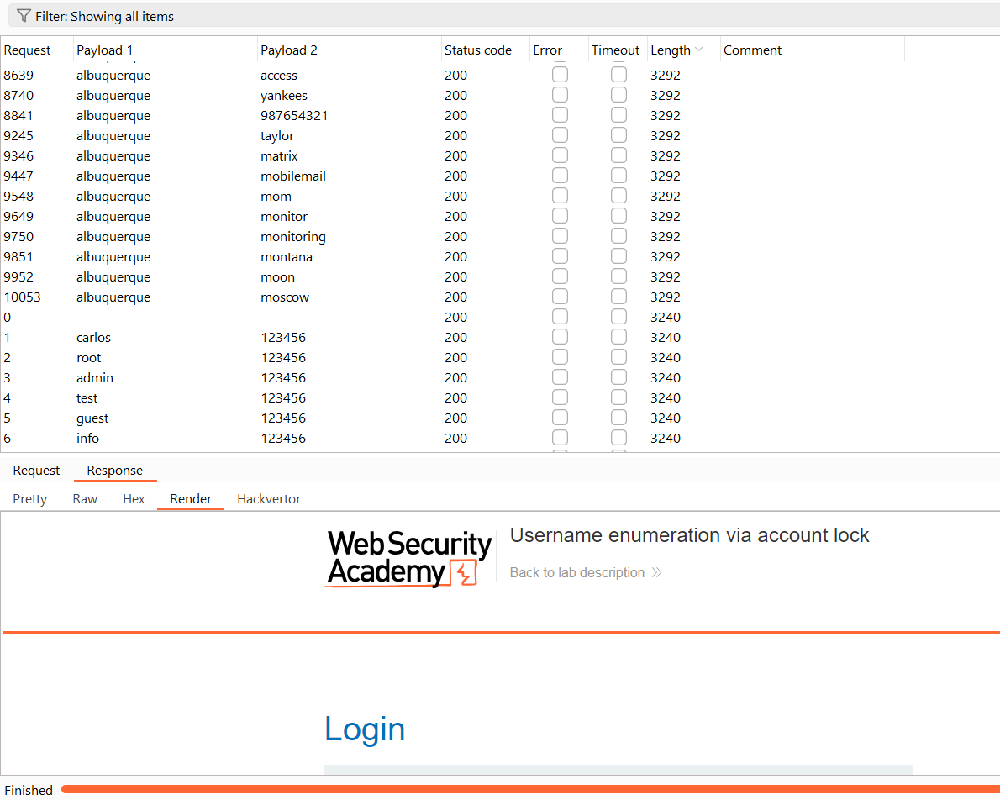
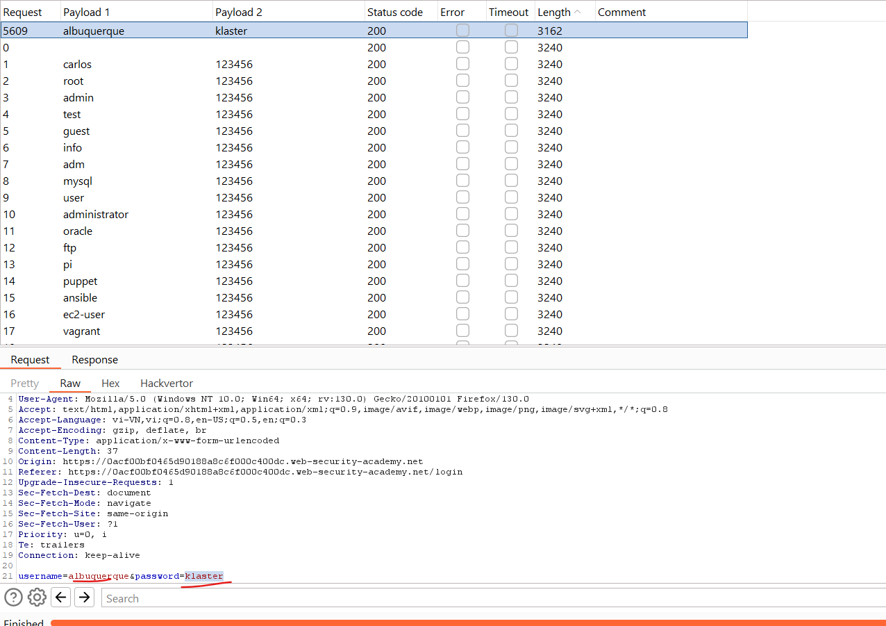

Khóa tài khoản cung cấp một mức độ bảo vệ nhất định chống lại hành vi ép buộc có chủ đích đối với một tài khoản cụ thể. Tuy nhiên, cách tiếp cận này không thể ngăn chặn thỏa đáng các cuộc tấn công BF trong đó kẻ tấn công chỉ cố gắng giành quyền truy cập vào bất kỳ tài khoản ngẫu nhiên nào mà chúng có thể.\
Phương pháp sau đây có thể được sử dụng để giải quyết loại bảo vệ này:
- Thiết lập danh sách tên người dùng ứng viên có khả năng hợp lệ. Điều này có thể thông qua việc liệt kê tên người dùng hoặc đơn giản dựa trên danh sách tên người dùng phổ biến.
- Quyết định một danh sách mật khẩu rút gọn rất nhỏ mà bạn nghĩ rằng ít nhất một người dùng có thể có. Điều quan trọng là số lượng mật khẩu bạn chọn không được vượt quá số lần đăng nhập được phép. Ví dụ: nếu bạn đã tính ra giới hạn đó là 3 lần thử, bạn cần chọn tối đa 3 lần đoán mật khẩu.
- Sử dụng một công cụ như Burp Intruder, thử từng mật khẩu đã chọn với từng tên người dùng dự kiến. Bằng cách này, bạn có thể cố gắng BF mọi tài khoản mà không kích hoạt khóa tài khoản. Bạn chỉ cần một người dùng sử dụng một trong ba mật khẩu để xâm phạm tài khoản.

Khóa tài khoản cũng không thể bảo vệ khỏi các cuộc tấn công nhồi thông tin xác thực. Điều này liên quan đến việc sử dụng một từ điển khổng lồ gồm các cặp `username:password`, bao gồm thông tin đăng nhập chính hãng bị đánh cắp trong các vụ vi phạm dữ liệu. Việc nhồi thông tin xác thực dựa trên thực tế là nhiều người sử dụng lại cùng một tên người dùng và mật khẩu trên nhiều trang web và do đó, có khả năng một số thông tin xác thực bị xâm phạm trong từ điển cũng hợp lệ trên trang web mục tiêu. Khóa tài khoản không bảo vệ chống lại việc nhồi thông tin xác thực vì mỗi tên người dùng chỉ được thử một lần. Việc nhồi thông tin xác thực đặc biệt nguy hiểm vì đôi khi nó có thể khiến kẻ tấn công xâm phạm nhiều tài khoản khác nhau chỉ bằng một cuộc tấn công tự động.

### User rate limiting
Một cách khác mà các trang web cố gắng ngăn chặn các cuộc tấn công brute-force là thông qua việc giới hạn lần đăng nhập. Trong trường hợp này, việc thực hiện quá nhiều yêu cầu đăng nhập trong một khoảng thời gian ngắn sẽ khiến địa chỉ IP của bạn bị chặn. Thông thường, IP chỉ có thể được bỏ chặn theo một trong các cách sau:
- Tự động sau một khoảng thời gian nhất định trôi qua
- Thủ công bởi quản trị viên
- Người dùng thực hiện thủ công sau khi hoàn tất CAPTCHA thành công

Giới hạn đăng nhập đôi khi được ưu tiên hơn là khóa tài khoản do ít bị liệt kê tên người dùng và tấn công từ chối dịch vụ hơn. Tuy nhiên, nó vẫn chưa hoàn toàn an toàn. Như chúng ta đã thấy trong ví dụ trong phòng thí nghiệm trước đó, có một số cách mà kẻ tấn công có thể thao túng IP rõ ràng của chúng để vượt qua khối.\
Vì giới hạn này dựa trên tốc độ yêu cầu HTTP được gửi từ địa chỉ IP của người dùng nên đôi khi bạn cũng có thể vượt qua biện pháp bảo vệ này nếu bạn có thể tìm ra cách đoán nhiều mật khẩu chỉ bằng một yêu cầu.

Ví dụ: https://portswigger.net/web-security/authentication/password-based/lab-broken-brute-force-protection-multiple-credentials-per-request

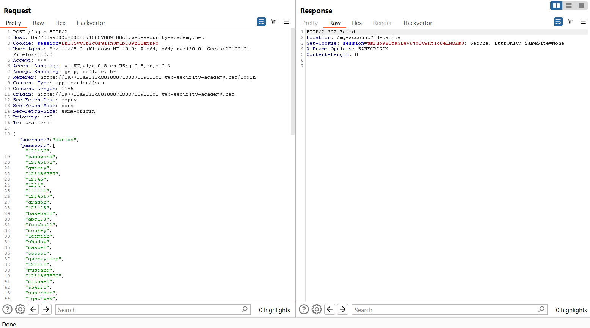

Loại bỏ dần ta có: \
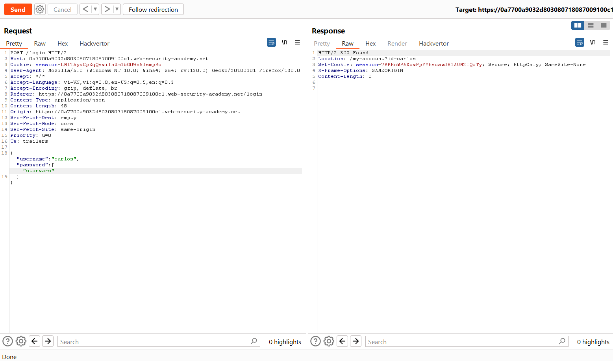

## HTTP basic authentication
Mặc dù khá cũ nhưng tính đơn giản và dễ triển khai của nó có nghĩa là đôi khi bạn có thể thấy xác thực cơ bản HTTP đang được sử dụng. Trong xác thực cơ bản HTTP, máy khách nhận được mã thông báo xác thực từ máy chủ, được tạo bằng cách nối tên người dùng và mật khẩu rồi mã hóa nó trong Base64. Mã thông báo này được trình duyệt lưu trữ và quản lý, trình duyệt này sẽ tự động thêm nó vào header `Authorization` của mọi yêu cầu tiếp theo như sau:\
`Authorization: Basic base64(username:password)`\
Vì một số lý do, đây thường không được coi là phương pháp xác thực an toàn. Thứ nhất, nó liên quan đến việc gửi liên tục thông tin đăng nhập của người dùng với mọi yêu cầu. Trừ khi trang web cũng triển khai HSTS, thông tin đăng nhập của người dùng có nguy cơ bị chiếm giữ trong một cuộc tấn công man-in-the-middle.\
Ngoài ra, việc triển khai xác thực cơ bản HTTP thường không hỗ trợ bảo vệ brute-force. Vì mã thông báo chỉ bao gồm các giá trị tĩnh nên điều này có thể khiến nó dễ bị tấn công brute-force.\
HTTP basic authentication cũng đặc biệt dễ bị tấn công bởi các hoạt động khai thác liên quan đến phiên, đặc biệt là CSRF, do bản thân nó không cung cấp biện pháp bảo vệ nào.\
Trong một số trường hợp, việc khai thác xác thực cơ bản HTTP dễ bị tấn công chỉ có thể cấp cho kẻ tấn công quyền truy cập vào một trang có vẻ không thú vị. Tuy nhiên, ngoài việc cung cấp thêm bề mặt tấn công, thông tin xác thực bị lộ theo cách này có thể được sử dụng lại trong các bối cảnh khác, bí mật hơn.