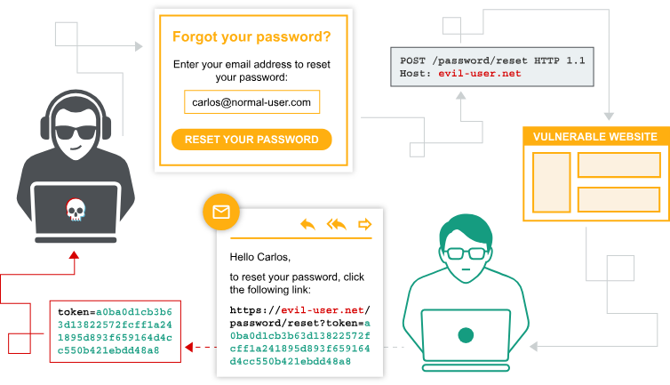

Link: https://portswigger.net/web-security/authentication

# Authentication vulnerabilities
Lỗ hổng xác thực có thể cho phép kẻ tấn công truy cập vào dữ liệu và chức năng nhạy cảm. Chúng cũng mở rộng bề mặt tấn công để khai thác thêm. Vì vậy, việc xác định và khai thác các lỗ hổng xác thực, cũng như cách vượt qua các biện pháp bảo vệ, là rất quan trọng.\
Trong phần này:\
- Các cơ chế xác thực phổ biến nhất được sử dụng bởi các trang web.
- Các lỗ hổng tiềm ẩn trong các cơ chế này.
- Lỗ hổng cố hữu trong các cơ chế xác thực khác nhau.
- Các lỗ hổng điển hình xuất hiện do việc triển khai không đúng cách.

## What is authentication?
Xác thực là quá trình xác minh danh tính của người dùng hoặc khách hàng.\
Có ba loại xác thực chính:
- **Biết** (`know`): mật khẩu, câu hỏi bảo mật.
- **Có** (`have`): điện thoại di động, mã thông báo bảo mật.
- **Là** (`are`): sinh trắc học, hành vi.

Cơ chế xác thực dựa trên một loạt công nghệ để xác minh một hoặc nhiều yếu tố này.
## What is the difference between authentication and authorization?
- **Authentication**: xác minh danh tính người dùng.
- **Authorization**: xác minh người dùng có được phép làm điều gì đó hay không.

Ví dụ: khi `Carlos123` đăng nhập thành công (xác thực), họ có thể hoặc không có quyền thực hiện các hành động nhất định (ủy quyền).
## Lỗ hổng xác thực phát sinh như thế nào?

Lỗ hổng xác thực thường do:
- Cơ chế xác thực yếu không đủ bảo vệ trước tấn công brute-force.
- Lỗi logic hoặc mã hóa kém trong quá trình triển khai, cho phép bỏ qua xác thực ("broken authentication").

## Tác động của xác thực dễ bị tổn thương là gì?
Kẻ tấn công có thể truy cập dữ liệu và chức năng nhạy cảm của tài khoản bị xâm phạm. Nếu tấn công vào tài khoản có quyền cao, như quản trị viên, kẻ tấn công có thể giành quyền kiểm soát toàn bộ ứng dụng và thậm chí cả hạ tầng nội bộ.
## Lỗ hổng trong cơ chế xác thực
Hệ thống xác thực có thể bao gồm nhiều cơ chế khác nhau, và mỗi cơ chế có thể xuất hiện lỗ hổng:
- [Lỗ hổng trong đăng nhập dựa trên mật khẩu](<Vulnerabilities in password-based login.md>)
- [Lỗ hổng trong xác thực đa yếu tố](<Vulnerabilities in multi-factor authentication.md>)
- [Lỗ hổng trong các cơ chế xác thực khác](<Vulnerabilities in other authentication mechanisms.md>)

## Lỗ hổng trong cơ chế xác thực của bên thứ ba
https://portswigger.net/web-security/oauth 

## Cách bảo mật cơ chế xác thực của bạn

### Take care with user credentials

- Không bao giờ gửi thông tin đăng nhập qua kết nối không được mã hóa.
- Thực thi HTTPS cho mọi yêu cầu đăng nhập và đảm bảo không có tên người dùng hay email bị rò rỉ qua phản hồi HTTP.
### Don't count on users for security

- Thực hiện chính sách mật khẩu hiệu quả. Ví dụ: sử dụng thư viện kiểm tra mật khẩu như `zxcvbn` của Dropbox để đánh giá độ mạnh của mật khẩu trong thời gian thực.
### Prevent username enumeration

- Sử dụng thông báo lỗi chung và giống nhau, đảm bảo mã trạng thái HTTP và thời gian phản hồi không phân biệt được giữa các tình huống đăng nhập thất bại.
### Implement robust brute-force protection

- Giới hạn tỷ lệ đăng nhập dựa trên IP và yêu cầu CAPTCHA sau một số lần thử đăng nhập nhất định.
### Triple-check your verification logic

- Kiểm tra kỹ mọi logic xác thực hoặc xác minh để loại bỏ lỗi logic, vì điều này có thể dẫn đến việc xâm phạm hoàn toàn bảo mật.
### Don't forget supplementary functionality

- Đảm bảo rằng các chức năng liên quan đến xác thực, như đặt lại hoặc thay đổi mật khẩu, cũng an toàn như chức năng đăng nhập chính.
### Implement proper multi-factor authentication
- Sử dụng xác thực đa yếu tố (2FA) với ứng dụng hoặc thiết bị chuyên dụng để tạo mã xác minh, thay vì chỉ dựa vào SMS, nhằm bảo vệ tốt hơn trước các tấn công như hoán đổi SIM.

