# Examples of business logic vulnerabilities
Các lỗ hổng logic nghiệp vụ tương đối cụ thể tùy theo bối cảnh mà chúng xảy ra. Tuy nhiên, mặc dù các trường hợp lỗi logic riêng lẻ rất khác nhau nhưng chúng có thể có nhiều điểm chung. Đặc biệt, chúng có thể được nhóm lại một cách lỏng lẻo dựa trên những lỗi ban đầu gây ra lỗ hổng bảo mật ngay từ đầu.\
Trong phần này, chúng ta sẽ xem xét các ví dụ về một số lỗi điển hình mà nhóm thiết kế và phát triển mắc phải, đồng thời chỉ cho bạn cách chúng có thể trực tiếp dẫn đến các lỗi logic kinh doanh. Cho dù bạn đang phát triển các ứng dụng của riêng mình hay kiểm tra các ứng dụng hiện có, bạn đều có thể rút ra bài học từ những ví dụ này và áp dụng tư duy phản biện tương tự cho các ứng dụng khác mà bạn gặp phải.\
Ví dụ về các lỗi logic bao gồm:
- Tin tưởng quá mức vào các biện pháp kiểm soát phía client
- Không xử lý được đầu vào bất thường
- Đưa ra các giả định sai lầm về hành vi của người dùng
- Lỗi dành riêng cho tên miền
- Cung cấp một oracle mã hóa
- Sự khác biệt của trình phân tích cú pháp địa chỉ email

## Tin tưởng quá mức vào các biện pháp kiểm soát phía client
Một giả định sai sót cơ bản là **người dùng sẽ chỉ tương tác với ứng dụng thông qua giao diện web được cung cấp**. Điều này đặc biệt nguy hiểm vì nó dẫn đến giả định thêm rằng việc xác thực phía máy khách sẽ ngăn người dùng cung cấp thông tin đầu vào độc hại. Tuy nhiên, kẻ tấn công có thể chỉ cần sử dụng các công cụ như Burp Proxy để giả mạo dữ liệu sau khi nó được trình duyệt gửi nhưng trước khi nó được chuyển vào logic phía máy chủ. Điều này làm cho các điều khiển phía máy khách trở nên vô dụng một cách hiệu quả.\
Việc chấp nhận dữ liệu theo mệnh giá mà không thực hiện kiểm tra tính toàn vẹn thích hợp và xác thực phía máy chủ có thể cho phép kẻ tấn công gây ra mọi loại thiệt hại với nỗ lực tương đối tối thiểu. Chính xác những gì họ có thể đạt được phụ thuộc vào chức năng và những gì nó đang làm với dữ liệu có thể kiểm soát được. Trong bối cảnh phù hợp, loại lỗ hổng này có thể gây ra hậu quả nghiêm trọng cho cả chức năng liên quan đến kinh doanh và tính bảo mật của chính trang web.

Ví dụ: https://portswigger.net/web-security/logic-flaws/examples/lab-logic-flaws-excessive-trust-in-client-side-controls

Hoặc ví dụ: https://portswigger.net/web-security/authentication/multi-factor/lab-2fa-broken-logic

## Không xử lý được đầu vào bất thường
Một mục đích của logic ứng dụng là hạn chế đầu vào của người dùng ở các giá trị tuân thủ các quy tắc nghiệp vụ. Ví dụ: ứng dụng có thể được thiết kế để chấp nhận các giá trị tùy ý của một loại dữ liệu nhất định, nhưng logic sẽ xác định liệu giá trị này có được chấp nhận từ góc độ doanh nghiệp hay không. Nhiều ứng dụng kết hợp các giới hạn số vào logic của chúng. Điều này có thể bao gồm các giới hạn được thiết kế để quản lý hàng tồn kho, áp dụng các hạn chế về ngân sách, kích hoạt các giai đoạn của chuỗi cung ứng, v.v.\
Hãy lấy ví dụ đơn giản về một cửa hàng trực tuyến. Khi đặt mua sản phẩm, người dùng thường ghi rõ số lượng muốn đặt. Mặc dù về mặt lý thuyết, bất kỳ số nguyên nào cũng là đầu vào hợp lệ, nhưng logic nghiệp vụ có thể ngăn người dùng đặt hàng nhiều đơn vị hơn số lượng hiện có trong kho.\
Để triển khai các quy tắc như thế này, nhà phát triển cần phải lường trước tất cả các tình huống có thể xảy ra và kết hợp các cách xử lý chúng vào logic ứng dụng. Nói cách khác, họ cần cho ứng dụng biết liệu nó có nên cho phép một đầu vào nhất định hay không và nó sẽ phản ứng như thế nào dựa trên các điều kiện khác nhau. Nếu không có logic rõ ràng để xử lý một trường hợp nhất định, điều này có thể dẫn đến hành vi không mong muốn và có khả năng bị khai thác.\
Ví dụ: kiểu dữ liệu số có thể chấp nhận giá trị âm. Tùy thuộc vào chức năng liên quan, việc logic nghiệp vụ cho phép điều này có thể không có ý nghĩa. Tuy nhiên, nếu ứng dụng không thực hiện xác thực đầy đủ phía máy chủ và từ chối thông tin đầu vào này, kẻ tấn công có thể chuyển giá trị âm và gây ra hành vi không mong muốn.\
Hãy xem xét việc chuyển tiền giữa hai tài khoản ngân hàng. Chức năng này gần như chắc chắn sẽ kiểm tra xem người gửi có đủ tiền hay không trước khi hoàn tất chuyển khoản:
```
$transferAmount = $_POST['amount'];
$currentBalance = $user->getBalance();

if ($transferAmount <= $currentBalance) {
    // Complete the transfer
} else {
    // Block the transfer: insufficient funds
}
```
Nhưng nếu logic không đủ ngăn người dùng cung cấp giá trị âm trong tham số `amount` thì kẻ tấn công có thể lợi dụng điều này để bỏ qua việc kiểm tra số dư và chuyển tiền theo hướng "sai". Nếu kẻ tấn công gửi `-$1000` vào tài khoản của nạn nhân, điều này có thể dẫn đến việc họ nhận được 1000 USD từ nạn nhân. Logic sẽ luôn đánh giá rằng -1000 nhỏ hơn số dư hiện tại và chấp thuận chuyển khoản.\
Những sai sót logic đơn giản như thế này có thể gây thiệt hại nghiêm trọng nếu chúng xảy ra đúng chức năng. Chúng cũng dễ bị bỏ sót trong quá trình phát triển và thử nghiệm, đặc biệt là khi những đầu vào như vậy có thể bị chặn bởi các điều khiển phía máy khách trên giao diện web.\
Khi kiểm tra một ứng dụng, bạn nên sử dụng các công cụ như Burp Proxy và Repeater **để thử gửi các giá trị khác thường**. Đặc biệt, hãy thử nhập vào trong phạm vi mà người dùng hợp pháp khó có thể nhập vào. Điều này bao gồm các đầu vào số cực kỳ cao hoặc cực kỳ thấp và các chuỗi dài bất thường cho các trường dựa trên văn bản. Bạn thậm chí có thể thử các loại dữ liệu không mong muốn. Bằng cách quan sát phản hồi của ứng dụng, bạn nên thử và trả lời các câu hỏi sau:
- Có bất kỳ giới hạn nào được áp dụng cho dữ liệu không?
- Điều gì xảy ra khi bạn đạt đến những giới hạn đó?
- Có bất kỳ chuyển đổi hoặc `chuẩn hóa` nào đang được thực hiện trên đầu vào của bạn không?

Điều này có thể làm lộ ra khả năng xác thực đầu vào yếu, cho phép bạn thao tác ứng dụng theo những cách khác thường. Hãy nhớ rằng nếu bạn tìm thấy một biểu mẫu trên trang web mục tiêu không thể xử lý dữ liệu đầu vào khác thường một cách an toàn thì có khả năng các biểu mẫu khác cũng sẽ gặp vấn đề tương tự.

Ví dụ: https://portswigger.net/web-security/logic-flaws/examples/lab-logic-flaws-high-level

chú ý đến khi xóa sản phẩm khỏi giỏ hàng, nó dùng request nhận giá trị là -1, nên ta có thể tùy ý để số sản phẩm trong cart là số âm

Mặt khác, giỏ hàng chỉ cần giá trị > 0, `ko cần số sản phầm > 0`, đây chính là lỗ hổng, là có thể thanh toán.

Nên ta sẽ cho giá trị làm sao để `âm những món hàng đó` + `món hàng cần mua` < `số tiền ta có`:


Ví dụ: https://portswigger.net/web-security/logic-flaws/examples/lab-logic-flaws-low-level

Ở ví dụ này, khi đặt 1 số lượng lớn, số tiền vượt quá số tiền mà dev set max, nó sẽ chuyển về bắt đầu từ âm, giống như đến 128 sẽ về -127. Vấn đề của ta là cần set số lượng sao cho < số tiền ta có.

Thêm nữa, ở bài này quantity max = 99 nên dùng intruder để gửi nhiều request:
\
\
Cuối cùng:\ 


Ví dụ: https://portswigger.net/web-security/logic-flaws/examples/lab-logic-flaws-inconsistent-handling-of-exceptional-input

Bài này cần vào path `/admin`, khi vào page này ta cần đăng nhập với tư cách của DontWannaCry mới có thể vào được. 

Để ý nếu đăng kí 1 email quá dài, web sẽ cắt đi và chỉ còn 1 email ngắn
\


Ta sẽ lợi dụng điều này để tạo 1 email dạng: 
`very-long-string@dontwannacry.com.YOUR-EMAIL-ID.web-security-academy.net` thì khi cắt đi sẽ còn lại `very-long-string@dontwannacry.com`

Với chiều dài sau khi cắt còn 200 kí tự, ta sẽ cần chọn `very-long-string` dài: 183 kí tự
```
gqylxrazmopqjktwfhbcnwuzdoyxketjrlmnpqfyswjxkzdbvhrmoytaekxqfubolipqgjnwveuzxahbdtcfkqyrszxjvplwqeqmtykzjfhgscbqvaxwzodtqjknpehylgptwmbxkasfoujzqvzyxlqtdnmbvrcayjifxgohkqnrwtdvjzplugvqexyfwcnokhxzjapmgqtrixzvbyoefpdlqswcznuxvjbhrgkqstomwz@@dontwannacry.com.exploit-0a1000b903d3c2e681105bc601fa005e.exploit-server.net
```


## Đưa ra các giả định sai lầm về hành vi của người dùng

Một trong những nguyên nhân cốt lõi phổ biến nhất gây ra lỗ hổng logic là đưa ra các giả định sai lầm về hành vi của người dùng. 

### Người dùng đáng tin cậy không phải lúc nào cũng đáng tin cậy
Các ứng dụng có thể có vẻ an toàn vì chúng thực hiện các biện pháp có vẻ mạnh mẽ để thực thi các quy tắc kinh doanh. Thật không may, một số ứng dụng đã mắc sai lầm khi cho rằng, sau khi vượt qua các biện pháp kiểm soát nghiêm ngặt này ngay từ đầu, người dùng và dữ liệu của họ có thể được tin cậy vô thời hạn. Điều này có thể dẫn đến việc thực thi tương đối lỏng lẻo các biện pháp kiểm soát tương tự kể từ thời điểm đó trở đi.\
Nếu các quy tắc kinh doanh và biện pháp bảo mật không được áp dụng nhất quán trong toàn bộ ứng dụng, điều này có thể dẫn đến những lỗ hổng nguy hiểm tiềm tàng có thể bị kẻ tấn công khai thác.

Ví dụ: https://portswigger.net/web-security/logic-flaws/examples/lab-logic-flaws-inconsistent-security-controls

Lổ hổng ở đây là khi đăng kí thành công, người dùng có thể đổi email tùy ý mà không còn cần xác nhận như bước đăng nhập, do đó ta có thể dễ dàng sử dụng mail của admin: 
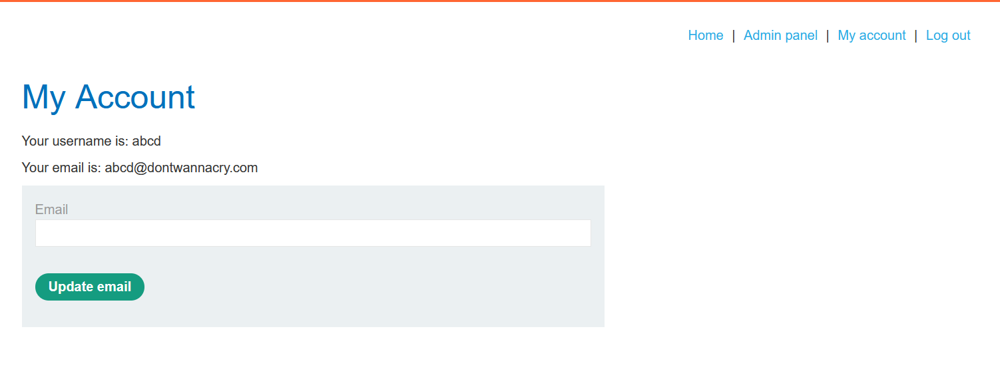

### Người dùng không phải lúc nào cũng cung cấp thông tin đầu vào bắt buộc
Một quan niệm sai lầm là người dùng sẽ luôn cung cấp giá trị cho các trường nhập bắt buộc. Trình duyệt có thể ngăn người dùng thông thường gửi biểu mẫu mà không cần đầu vào bắt buộc, nhưng như chúng tôi biết, những kẻ tấn công có thể giả mạo các tham số trong quá trình truyền tải. Điều này thậm chí còn mở rộng đến việc loại bỏ hoàn toàn các tham số.\
Đây là một vấn đề cụ thể trong trường hợp nhiều chức năng được triển khai trong cùng một tập lệnh phía máy chủ. Trong trường hợp này, sự hiện diện hay vắng mặt của một tham số cụ thể có thể xác định mã nào được thực thi. Việc xóa các giá trị tham số có thể cho phép kẻ tấn công truy cập vào các đường dẫn mã được cho là nằm ngoài tầm với.\
Khi dò tìm các lỗi logic, bạn nên thử lần lượt loại bỏ từng tham số và quan sát xem điều này có ảnh hưởng gì đến phản hồi. Bạn nên đảm bảo:
- Mỗi lần chỉ xóa một tham số để đảm bảo đạt được tất cả các đường dẫn mã có liên quan.
- Hãy thử xóa tên của tham số cũng như giá trị. Máy chủ thường sẽ xử lý cả hai trường hợp một cách khác nhau.
- Thực hiện theo các quy trình nhiều giai đoạn cho đến khi hoàn thành. Đôi khi việc giả mạo một tham số trong một bước sẽ ảnh hưởng đến một bước khác trong quy trình làm việc.

Điều này áp dụng cho cả tham số URL và POST, nhưng đừng quên kiểm tra cả cookie. Quá trình đơn giản này có thể tiết lộ một số hành vi kỳ lạ của ứng dụng có thể bị khai thác.

Ví dụ: https://portswigger.net/web-security/logic-flaws/examples/lab-logic-flaws-weak-isolation-on-dual-use-endpoint

Request bình thường yêu cầu `current-password` nhưng khi xóa đi thì vẫn có thể request thành công và đổi được mật khẩu mà ko cần password cũ:
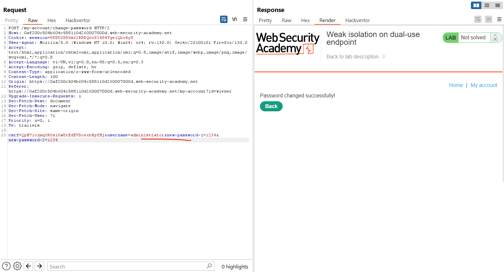

Ví dụ: https://portswigger.net/web-security/authentication/other-mechanisms/lab-password-reset-broken-logic

Ở bài này, khi thay đổi password sẽ có mail về và có token kèm theo link, nhưng khi xóa token này đi thì vẫn có thể request.

### Người dùng không phải lúc nào cũng làm theo trình tự đã định
Nhiều giao dịch dựa trên quy trình làm việc được xác định trước bao gồm một chuỗi các bước. Giao diện web thường sẽ hướng dẫn người dùng thực hiện quy trình này, đưa họ đến bước tiếp theo của quy trình làm việc mỗi khi họ hoàn thành bước hiện tại. Tuy nhiên, những kẻ tấn công không nhất thiết phải tuân theo trình tự đã định này. Việc không tính đến khả năng này có thể dẫn đến những sai sót nguy hiểm mà việc khai thác có thể tương đối đơn giản.\
Ví dụ: nhiều trang web triển khai xác thực hai yếu tố (2FA) yêu cầu người dùng đăng nhập trên một trang trước khi nhập mã xác minh trên một trang riêng. Giả sử rằng người dùng sẽ luôn tuân theo quy trình này cho đến khi hoàn thành và do đó, việc không xác minh rằng họ có làm như vậy hay không có thể cho phép kẻ tấn công bỏ qua hoàn toàn bước 2FA.

Ví dụ: https://portswigger.net/web-security/authentication/multi-factor/lab-2fa-simple-bypass

Việc đưa ra các giả định về chuỗi sự kiện có thể dẫn đến nhiều vấn đề ngay cả trong cùng một quy trình làm việc hoặc chức năng. Bằng cách sử dụng các công cụ như Burp Proxy và Repeater, khi kẻ tấn công đã nhìn thấy yêu cầu, chúng có thể phát lại yêu cầu đó theo ý muốn và sử dụng tính năng duyệt bắt buộc để thực hiện bất kỳ tương tác nào với máy chủ theo bất kỳ thứ tự nào chúng muốn. Điều này cho phép họ hoàn thành các hành động khác nhau trong khi ứng dụng ở trạng thái không mong muốn.\
Để xác định những loại sai sót này, bạn nên sử dụng tính năng duyệt bắt buộc để gửi yêu cầu theo trình tự ngoài ý muốn. Ví dụ: bạn có thể bỏ qua một số bước nhất định, truy cập một bước nhiều lần, quay lại các bước trước đó, v.v. Hãy lưu ý cách truy cập các bước khác nhau. Mặc dù bạn thường chỉ gửi yêu cầu `GET` hoặc `POST` tới một URL cụ thể nhưng đôi khi bạn có thể truy cập các bước bằng cách gửi các bộ tham số khác nhau tới cùng một URL. Giống như tất cả các lỗi logic, hãy cố gắng xác định những giả định mà các nhà phát triển đã đưa ra và bề mặt tấn công nằm ở đâu. Sau đó, bạn có thể tìm cách vi phạm những giả định này.\
Lưu ý rằng loại thử nghiệm này thường gây ra ngoại lệ vì các biến dự kiến ​​có giá trị null hoặc chưa được khởi tạo. Việc đến một địa điểm ở trạng thái được xác định một phần hoặc không nhất quán cũng có thể khiến ứng dụng phàn nàn. Trong trường hợp này, hãy đảm bảo chú ý đến mọi thông báo lỗi hoặc thông tin gỡ lỗi mà bạn gặp phải. Đây có thể là nguồn tiết lộ thông tin có giá trị, có thể giúp bạn tinh chỉnh cuộc tấn công của mình và hiểu các chi tiết chính về hành vi phía sau.

Ví dụ: https://portswigger.net/web-security/logic-flaws/examples/lab-logic-flaws-insufficient-workflow-validation

Khi mua hàng thành công, sau POST /cart/checkout thì sẽ có 1 request từ client:
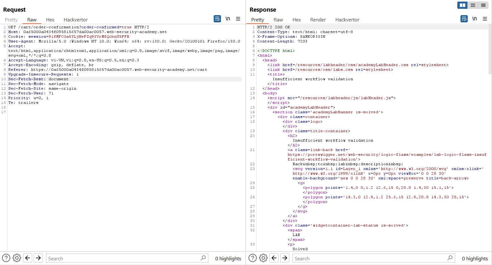

Ở đây ta có thể hiểu là 1 dạng thông báo đặt hàng thành công từ client. Bây giờ ta add món hàng cần mua vào và gửi lại request này để thông báo là đặt hàng thành công, và nó work.

Ví dụ: https://portswigger.net/web-security/logic-flaws/examples/lab-logic-flaws-authentication-bypass-via-flawed-state-machine

Ở bước chọn role, dùng intercept để drop nó, khi ko chọn role nó sẽ tự set mình là admin.

## Domain-specific flaws
Trong nhiều trường hợp, bạn sẽ gặp phải các lỗi logic cụ thể đối với lĩnh vực kinh doanh hoặc mục đích của trang web.\
**Chức năng giảm giá** của các cửa hàng trực tuyến là một phương pháp tấn công cổ điển khi tìm kiếm các lỗi logic. Đây có thể là một mỏ vàng tiềm năng cho kẻ tấn công, với đủ loại lỗi logic cơ bản xảy ra trong cách áp dụng giảm giá.\
Ví dụ: hãy xem xét một cửa hàng trực tuyến cung cấp giảm giá 10% cho các đơn hàng trên 1000 đô la. Điều này có thể dễ bị lạm dụng nếu logic kinh doanh không kiểm tra được liệu đơn hàng có bị thay đổi sau khi áp dụng chiết khấu hay không. Trong trường hợp này, kẻ tấn công có thể chỉ cần thêm các mặt hàng vào giỏ hàng của họ cho đến khi đạt ngưỡng 1000 USD, sau đó xóa những mặt hàng họ không muốn trước khi đặt hàng. Sau đó, họ sẽ nhận được chiết khấu cho đơn hàng của mình mặc dù đơn hàng đó không còn đáp ứng các tiêu chí đã định.\
Bạn nên đặc biệt chú ý đến mọi tình huống trong đó giá hoặc các giá trị nhạy cảm khác được điều chỉnh dựa trên tiêu chí được xác định bởi hành động của người dùng. Cố gắng hiểu ứng dụng sử dụng những thuật toán nào để thực hiện những điều chỉnh này và những điều chỉnh này được thực hiện vào thời điểm nào. Điều này thường liên quan đến việc thao túng ứng dụng để nó ở trạng thái mà các điều chỉnh được áp dụng không tương ứng với tiêu chí ban đầu mà nhà phát triển dự định.\
Để xác định những lỗ hổng này, bạn cần suy nghĩ cẩn thận về mục tiêu mà kẻ tấn công có thể có và cố gắng tìm những cách khác nhau để đạt được mục tiêu này bằng cách sử dụng chức năng được cung cấp. Điều này có thể yêu cầu một mức độ kiến ​​thức nhất định về lĩnh vực cụ thể để hiểu được điều gì có thể có lợi trong một bối cảnh nhất định. Để sử dụng một ví dụ đơn giản, bạn cần hiểu mạng xã hội để hiểu lợi ích của việc buộc một lượng lớn người dùng theo dõi bạn.\
Nếu không có kiến ​​thức về miền này, bạn có thể loại bỏ hành vi nguy hiểm vì đơn giản là bạn không nhận thức được tác động dây chuyền tiềm ẩn của nó. Tương tự như vậy, bạn có thể gặp khó khăn trong việc nối các dấu chấm và nhận thấy hai chức năng có thể được kết hợp theo cách có hại như thế nào. Để đơn giản, các ví dụ được sử dụng trong chủ đề này dành riêng cho một miền mà tất cả người dùng đã quen thuộc, cụ thể là cửa hàng trực tuyến. Tuy nhiên, cho dù bạn đang săn lỗi, thử nghiệm pentest hay thậm chí chỉ là một nhà phát triển đang cố gắng viết mã an toàn hơn, đôi khi bạn có thể gặp phải các ứng dụng từ các miền ít quen thuộc hơn. Trong trường hợp này, bạn nên đọc càng nhiều tài liệu càng tốt và nếu có, hãy nói chuyện với các chuyên gia về chủ đề trong lĩnh vực đó để hiểu rõ hơn về họ. Điều này nghe có vẻ tốn nhiều công sức nhưng miền càng khó hiểu thì càng có nhiều khả năng những người thử nghiệm khác đã bỏ sót nhiều lỗi.

Ví dụ: https://portswigger.net/web-security/logic-flaws/examples/lab-logic-flaws-flawed-enforcement-of-business-rules

Bài này ko cho phép add lại coupon nhưng nếu có 2 mã và add xen kẽ thì lại được, lỗi do chỉ kiểm tra với coupon gần nhất!
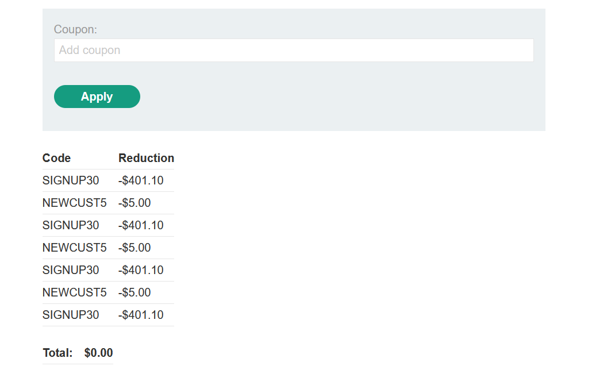

Ví dụ: https://portswigger.net/web-security/logic-flaws/examples/lab-logic-flaws-infinite-money

Bài này dùng mã giảm giá để mua redeem giá rẻ hơn và dùng redeem để nhận được số tiền mua sản phầm nên số tiền sẽ tăng lên, lỗi ở đây là mã giảm giá được dùng ko giới hạn nên ta sẽ lặp lại quá trình này để nhận nhiều tiền. 

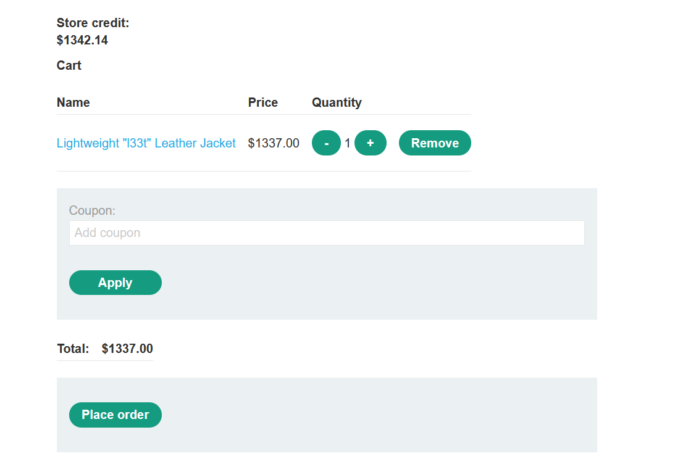

## Providing an encryption oracle
Các tình huống nguy hiểm có thể xảy ra khi dữ liệu đầu vào do người dùng kiểm soát được mã hóa và văn bản mã hóa thu được sau đó được cung cấp cho người dùng theo một cách nào đó. Loại đầu vào này đôi khi được gọi là "nhà tiên tri mã hóa". Kẻ tấn công có thể sử dụng đầu vào này để mã hóa dữ liệu tùy ý bằng thuật toán chính xác và khóa bất đối xứng.\
Điều này trở nên nguy hiểm khi có những đầu vào khác do người dùng kiểm soát trong ứng dụng dự kiến ​​​​dữ liệu được mã hóa bằng cùng một thuật toán. Trong trường hợp này, kẻ tấn công có thể sử dụng oracle mã hóa để tạo đầu vào được mã hóa hợp lệ, sau đó chuyển nó vào các chức năng nhạy cảm khác.\
Vấn đề này có thể trở nên phức tạp hơn nếu có một đầu vào khác do người dùng kiểm soát trên trang web cung cấp chức năng đảo ngược. Điều này sẽ cho phép kẻ tấn công giải mã dữ liệu khác để xác định cấu trúc dự kiến. Điều này giúp họ tiết kiệm một số công việc liên quan đến việc tạo dữ liệu độc hại nhưng không nhất thiết phải thực hiện khai thác thành công.\
Mức độ nghiêm trọng của oracle mã hóa phụ thuộc vào chức năng nào cũng sử dụng thuật toán tương tự như oracle.

Ví dụ: https://portswigger.net/web-security/logic-flaws/examples/lab-logic-flaws-authentication-bypass-via-encryption-oracle

(Chưa giải)
Khi thay có email sai định dạng nó sẽ báo về theo cookie `notification`, nhận thấy dạng của cookie này giống với dạng của cookie `stay-logged-in`, ta đưa giá trị của cookie `stay-logged-in` vào và xem được bản rõ:
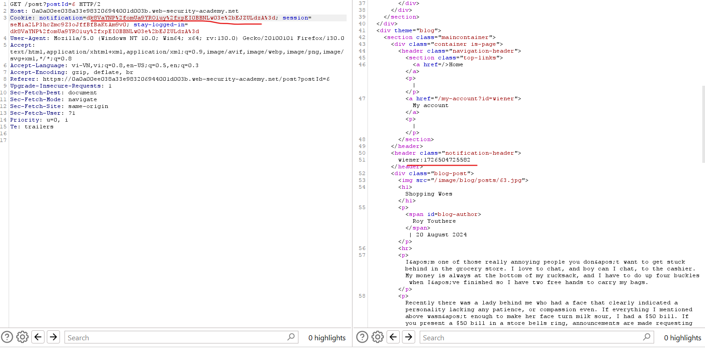

Bây giờ ta có: `wiener:1726504725582` ta sẽ thay thế thành `administrator:1726504725582` bằng request POST email trước đó: 
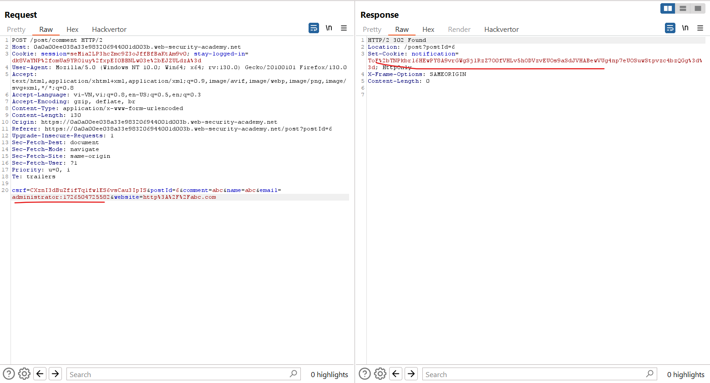

Nhưng khi đưa vào `notification` ta thấy nó xuất hiện thêm dòng: 
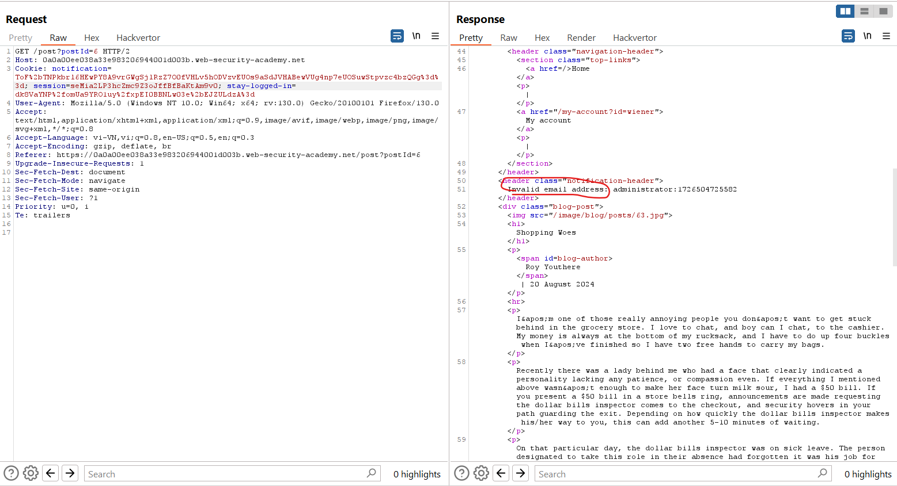

Bây giờ ta cần phải loại bỏ dòng này để chỉ lấy đoạn cookie mã hóa có dạng `administrator:1726504725582` thôi. 

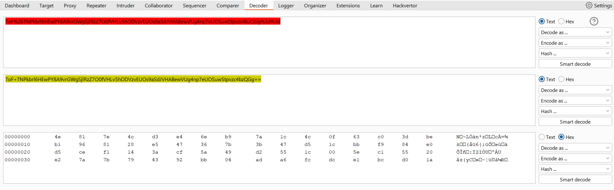

Ta biết là với base64 ta phải xóa đủ padding của nó, ở đây ta cứ thử 16, rồi 32,...sau khi xóa 32 bytes thì nó còn:
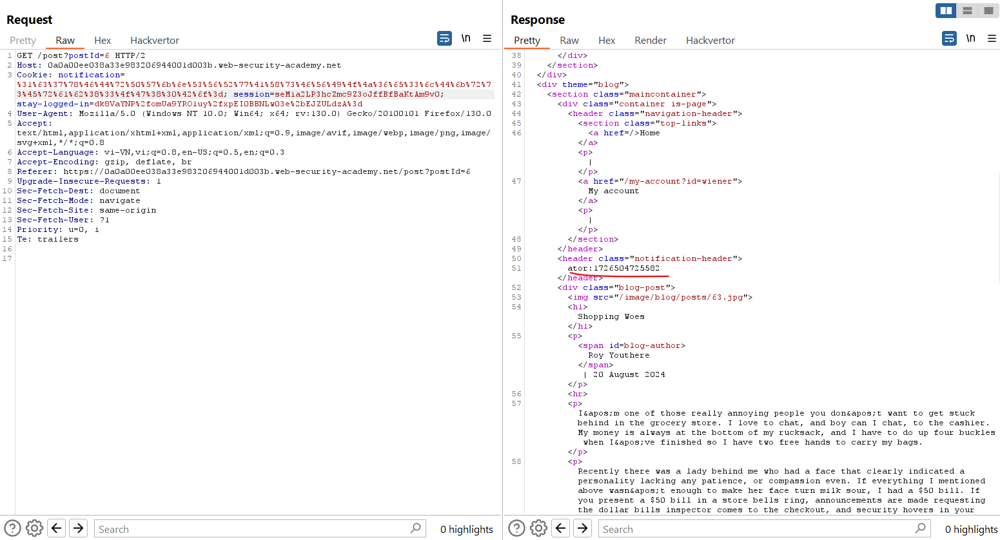

Vậy là còn thiếu `administr` ta `xxxxxxxxx` vào cho đủ để đoạn cookie ta cần nằm hẳn trong block khác: 
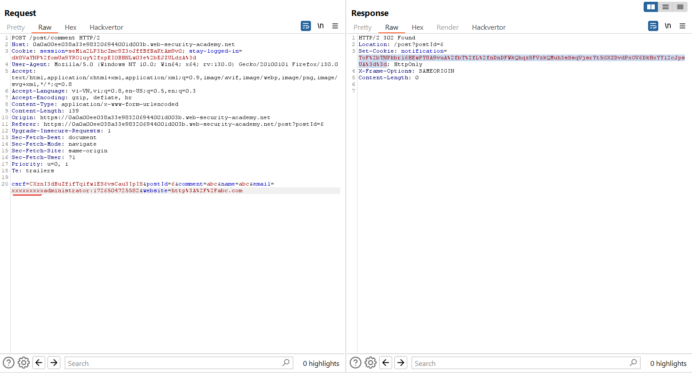

Sau đó decode base64 rồi xóa 32 bytes đầu ta được: 
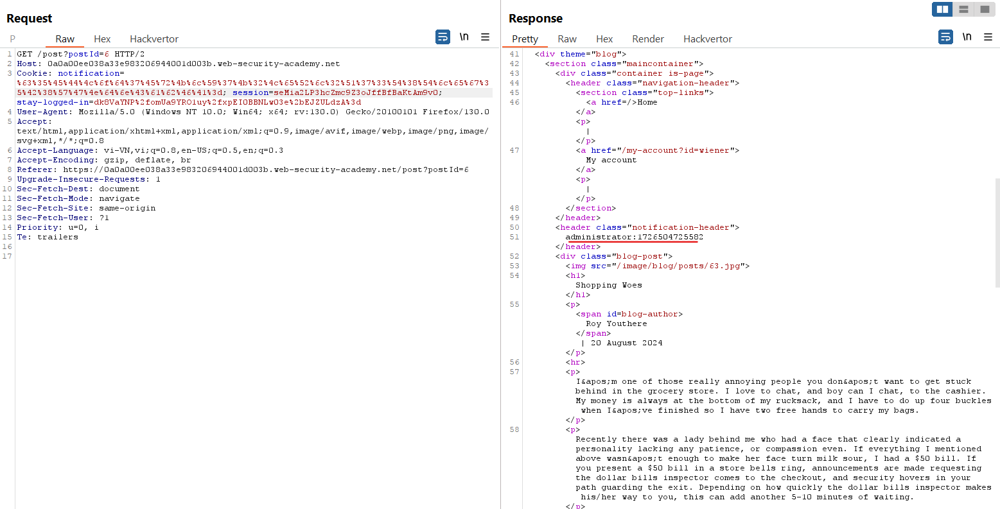

Vậy đây là đoạn cookie ta cần, bây giờ sử dụng cookie này thế nào `stay-logged-in`:
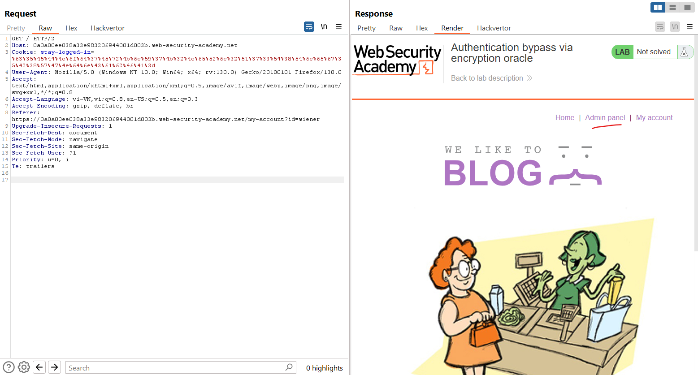

## Email address parser discrepancies
Một số trang web phân tích địa chỉ email để trích xuất tên miền và xác định chủ sở hữu email thuộc về tổ chức nào. Mặc dù quá trình này ban đầu có vẻ đơn giản nhưng thực tế nó rất phức tạp, ngay cả đối với các địa chỉ tuân thủ RFC hợp lệ.\
Sự khác biệt trong cách phân tích cú pháp địa chỉ email có thể làm suy yếu logic này. Những khác biệt này phát sinh khi các phần khác nhau của ứng dụng xử lý các địa chỉ email khác nhau.\
Kẻ tấn công có thể khai thác những khác biệt này bằng cách sử dụng kỹ thuật mã hóa để ngụy trang các phần của địa chỉ email. Điều này cho phép kẻ tấn công tạo các địa chỉ email vượt qua các bước kiểm tra xác thực ban đầu nhưng được diễn giải theo logic phân tích cú pháp của máy chủ.\
Tác động chính của sự khác biệt trong trình phân tích cú pháp địa chỉ email là hành vi truy cập trái phép. Những kẻ tấn công có thể đăng ký tài khoản bằng các địa chỉ email có vẻ hợp lệ từ các miền bị hạn chế. Điều này cho phép họ có quyền truy cập vào các khu vực nhạy cảm của ứng dụng, chẳng hạn như bảng quản trị hoặc các chức năng người dùng bị hạn chế.

Ví dụ: https://portswigger.net/web-security/logic-flaws/examples/lab-logic-flaws-bypassing-access-controls-using-email-address-parsing-discrepancies 

(Chưa giải)


