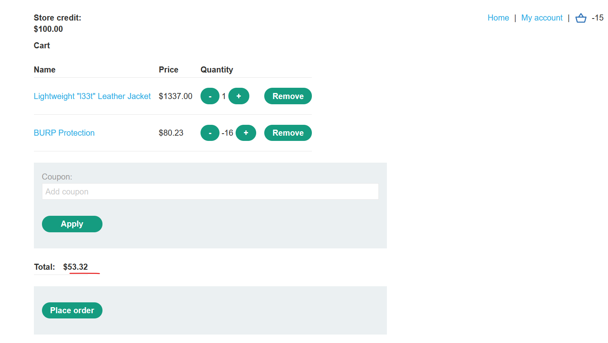
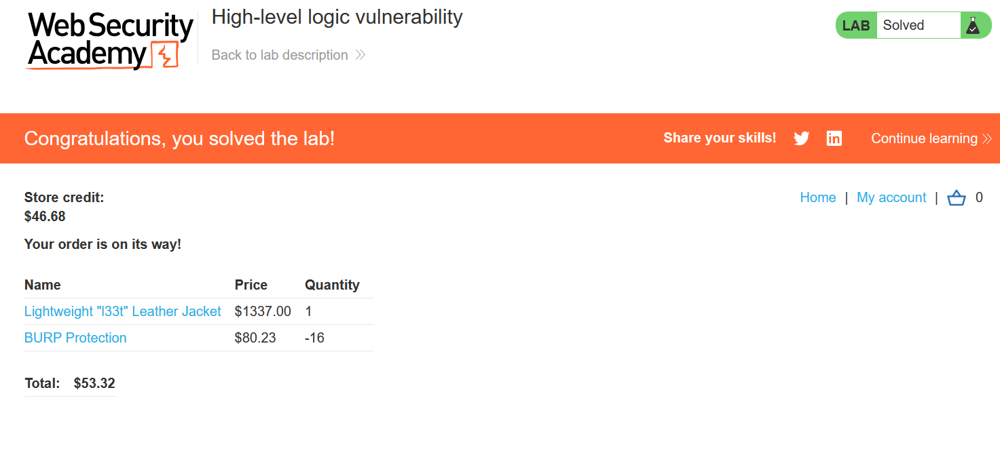
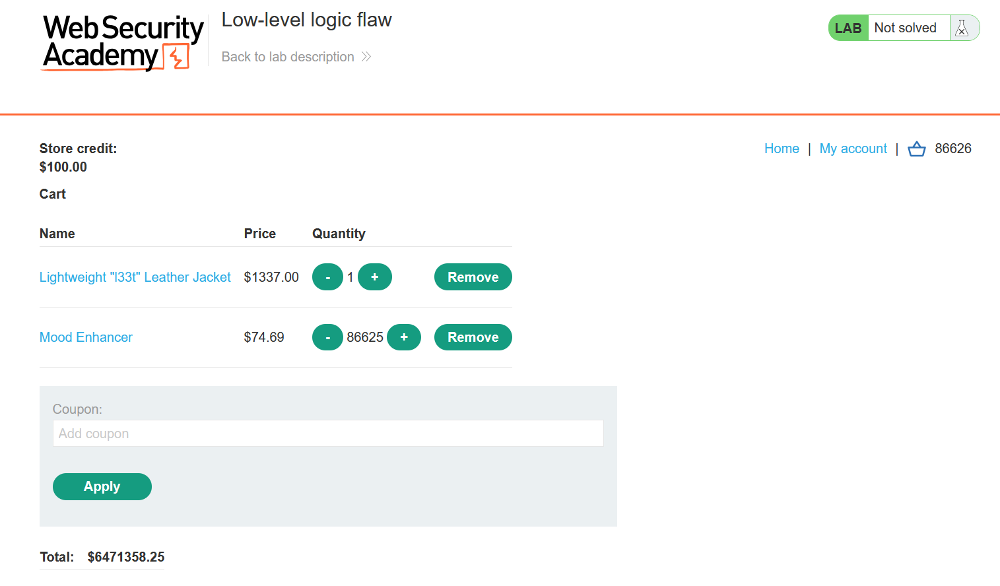
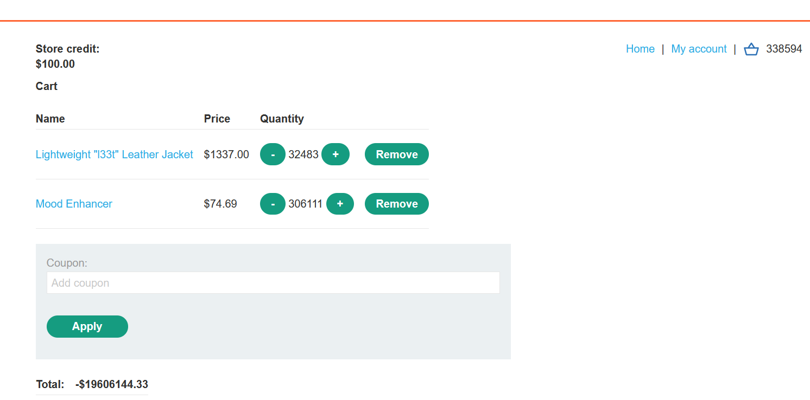
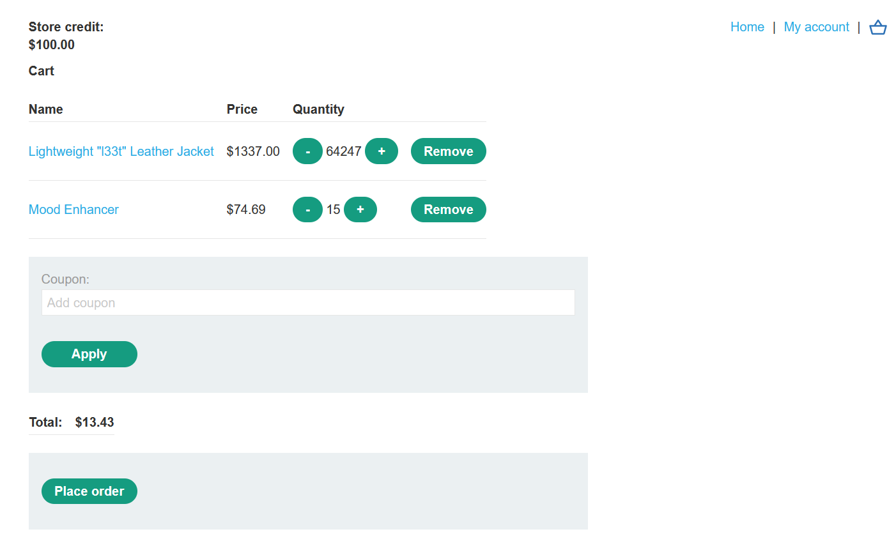
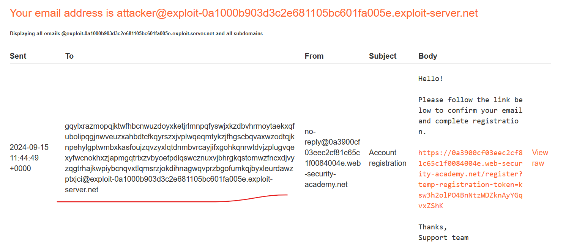
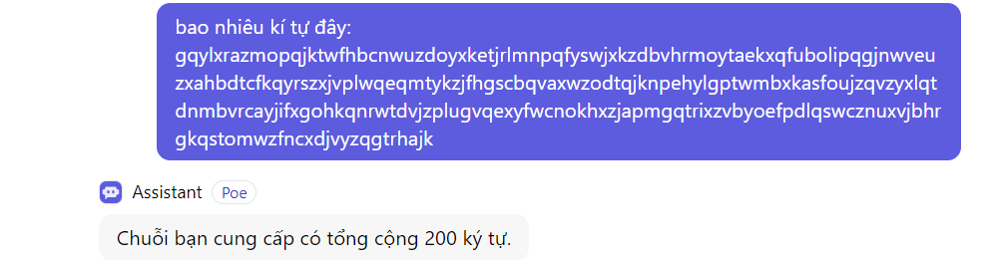
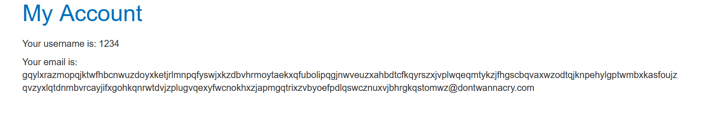

# Examples of business logic vulnerabilities
Các lỗ hổng logic nghiệp vụ tương đối cụ thể tùy theo bối cảnh mà chúng xảy ra. Tuy nhiên, mặc dù các trường hợp lỗi logic riêng lẻ rất khác nhau nhưng chúng có thể có nhiều điểm chung. Đặc biệt, chúng có thể được nhóm lại một cách lỏng lẻo dựa trên những lỗi ban đầu gây ra lỗ hổng bảo mật ngay từ đầu.\
Trong phần này, chúng ta sẽ xem xét các ví dụ về một số lỗi điển hình mà nhóm thiết kế và phát triển mắc phải, đồng thời chỉ cho bạn cách chúng có thể trực tiếp dẫn đến các lỗi logic kinh doanh. Cho dù bạn đang phát triển các ứng dụng của riêng mình hay kiểm tra các ứng dụng hiện có, bạn đều có thể rút ra bài học từ những ví dụ này và áp dụng tư duy phản biện tương tự cho các ứng dụng khác mà bạn gặp phải.\
Ví dụ về các lỗi logic bao gồm:
- Tin tưởng quá mức vào các biện pháp kiểm soát phía client
- Không xử lý được đầu vào bất thường
- Đưa ra các giả định sai lầm về hành vi của người dùng
- Lỗi dành riêng cho tên miền
- Cung cấp một oracle mã hóa
- Sự khác biệt của trình phân tích cú pháp địa chỉ email

## Tin tưởng quá mức vào các biện pháp kiểm soát phía client
Một giả định sai sót cơ bản là **người dùng sẽ chỉ tương tác với ứng dụng thông qua giao diện web được cung cấp**. Điều này đặc biệt nguy hiểm vì nó dẫn đến giả định thêm rằng việc xác thực phía máy khách sẽ ngăn người dùng cung cấp thông tin đầu vào độc hại. Tuy nhiên, kẻ tấn công có thể chỉ cần sử dụng các công cụ như Burp Proxy để giả mạo dữ liệu sau khi nó được trình duyệt gửi nhưng trước khi nó được chuyển vào logic phía máy chủ. Điều này làm cho các điều khiển phía máy khách trở nên vô dụng một cách hiệu quả.\
Việc chấp nhận dữ liệu theo mệnh giá mà không thực hiện kiểm tra tính toàn vẹn thích hợp và xác thực phía máy chủ có thể cho phép kẻ tấn công gây ra mọi loại thiệt hại với nỗ lực tương đối tối thiểu. Chính xác những gì họ có thể đạt được phụ thuộc vào chức năng và những gì nó đang làm với dữ liệu có thể kiểm soát được. Trong bối cảnh phù hợp, loại lỗ hổng này có thể gây ra hậu quả nghiêm trọng cho cả chức năng liên quan đến kinh doanh và tính bảo mật của chính trang web.

Ví dụ: https://portswigger.net/web-security/logic-flaws/examples/lab-logic-flaws-excessive-trust-in-client-side-controls

Hoặc ví dụ: https://portswigger.net/web-security/authentication/multi-factor/lab-2fa-broken-logic

## Không xử lý được đầu vào bất thường
Một mục đích của logic ứng dụng là hạn chế đầu vào của người dùng ở các giá trị tuân thủ các quy tắc nghiệp vụ. Ví dụ: ứng dụng có thể được thiết kế để chấp nhận các giá trị tùy ý của một loại dữ liệu nhất định, nhưng logic sẽ xác định liệu giá trị này có được chấp nhận từ góc độ doanh nghiệp hay không. Nhiều ứng dụng kết hợp các giới hạn số vào logic của chúng. Điều này có thể bao gồm các giới hạn được thiết kế để quản lý hàng tồn kho, áp dụng các hạn chế về ngân sách, kích hoạt các giai đoạn của chuỗi cung ứng, v.v.\
Hãy lấy ví dụ đơn giản về một cửa hàng trực tuyến. Khi đặt mua sản phẩm, người dùng thường ghi rõ số lượng muốn đặt. Mặc dù về mặt lý thuyết, bất kỳ số nguyên nào cũng là đầu vào hợp lệ, nhưng logic nghiệp vụ có thể ngăn người dùng đặt hàng nhiều đơn vị hơn số lượng hiện có trong kho.\
Để triển khai các quy tắc như thế này, nhà phát triển cần phải lường trước tất cả các tình huống có thể xảy ra và kết hợp các cách xử lý chúng vào logic ứng dụng. Nói cách khác, họ cần cho ứng dụng biết liệu nó có nên cho phép một đầu vào nhất định hay không và nó sẽ phản ứng như thế nào dựa trên các điều kiện khác nhau. Nếu không có logic rõ ràng để xử lý một trường hợp nhất định, điều này có thể dẫn đến hành vi không mong muốn và có khả năng bị khai thác.\
Ví dụ: kiểu dữ liệu số có thể chấp nhận giá trị âm. Tùy thuộc vào chức năng liên quan, việc logic nghiệp vụ cho phép điều này có thể không có ý nghĩa. Tuy nhiên, nếu ứng dụng không thực hiện xác thực đầy đủ phía máy chủ và từ chối thông tin đầu vào này, kẻ tấn công có thể chuyển giá trị âm và gây ra hành vi không mong muốn.\
Hãy xem xét việc chuyển tiền giữa hai tài khoản ngân hàng. Chức năng này gần như chắc chắn sẽ kiểm tra xem người gửi có đủ tiền hay không trước khi hoàn tất chuyển khoản:
```
$transferAmount = $_POST['amount'];
$currentBalance = $user->getBalance();

if ($transferAmount <= $currentBalance) {
    // Complete the transfer
} else {
    // Block the transfer: insufficient funds
}
```
Nhưng nếu logic không đủ ngăn người dùng cung cấp giá trị âm trong tham số `amount` thì kẻ tấn công có thể lợi dụng điều này để bỏ qua việc kiểm tra số dư và chuyển tiền theo hướng "sai". Nếu kẻ tấn công gửi `-$1000` vào tài khoản của nạn nhân, điều này có thể dẫn đến việc họ nhận được 1000 USD từ nạn nhân. Logic sẽ luôn đánh giá rằng -1000 nhỏ hơn số dư hiện tại và chấp thuận chuyển khoản.\
Những sai sót logic đơn giản như thế này có thể gây thiệt hại nghiêm trọng nếu chúng xảy ra đúng chức năng. Chúng cũng dễ bị bỏ sót trong quá trình phát triển và thử nghiệm, đặc biệt là khi những đầu vào như vậy có thể bị chặn bởi các điều khiển phía máy khách trên giao diện web.\
Khi kiểm tra một ứng dụng, bạn nên sử dụng các công cụ như Burp Proxy và Repeater **để thử gửi các giá trị khác thường**. Đặc biệt, hãy thử nhập vào trong phạm vi mà người dùng hợp pháp khó có thể nhập vào. Điều này bao gồm các đầu vào số cực kỳ cao hoặc cực kỳ thấp và các chuỗi dài bất thường cho các trường dựa trên văn bản. Bạn thậm chí có thể thử các loại dữ liệu không mong muốn. Bằng cách quan sát phản hồi của ứng dụng, bạn nên thử và trả lời các câu hỏi sau:
- Có bất kỳ giới hạn nào được áp dụng cho dữ liệu không?
- Điều gì xảy ra khi bạn đạt đến những giới hạn đó?
- Có bất kỳ chuyển đổi hoặc `chuẩn hóa` nào đang được thực hiện trên đầu vào của bạn không?

Điều này có thể làm lộ ra khả năng xác thực đầu vào yếu, cho phép bạn thao tác ứng dụng theo những cách khác thường. Hãy nhớ rằng nếu bạn tìm thấy một biểu mẫu trên trang web mục tiêu không thể xử lý dữ liệu đầu vào khác thường một cách an toàn thì có khả năng các biểu mẫu khác cũng sẽ gặp vấn đề tương tự.

Ví dụ: https://portswigger.net/web-security/logic-flaws/examples/lab-logic-flaws-high-level

chú ý đến khi xóa sản phẩm khỏi giỏ hàng, nó dùng request nhận giá trị là -1, nên ta có thể tùy ý để số sản phẩm trong cart là số âm

Mặt khác, giỏ hàng chỉ cần giá trị > 0, `ko cần số sản phầm > 0`, đây chính là lỗ hổng, là có thể thanh toán.

Nên ta sẽ cho giá trị làm sao để `âm những món hàng đó` + `món hàng cần mua` < `số tiền ta có`:



Ví dụ: https://portswigger.net/web-security/logic-flaws/examples/lab-logic-flaws-low-level

Ở ví dụ này, khi đặt 1 số lượng lớn, số tiền vượt quá số tiền mà dev set max, nó sẽ chuyển về bắt đầu từ âm, giống như đến 128 sẽ về -127. Vấn đề của ta là cần set số lượng sao cho < số tiền ta có.

Thêm nữa, ở bài này quantity max = 99 nên dùng intruder để gửi nhiều request:
\
\
Cuối cùng:\ 


Ví dụ: https://portswigger.net/web-security/logic-flaws/examples/lab-logic-flaws-inconsistent-handling-of-exceptional-input

Bài này cần vào path `/admin`, khi vào page này ta cần đăng nhập với tư cách của DontWannaCry mới có thể vào được. 

Để ý nếu đăng kí 1 email quá dài, web sẽ cắt đi và chỉ còn 1 email ngắn
\


Ta sẽ lợi dụng điều này để tạo 1 email dạng: 
`very-long-string@dontwannacry.com.YOUR-EMAIL-ID.web-security-academy.net` thì khi cắt đi sẽ còn lại `very-long-string@dontwannacry.com`

Với chiều dài sau khi cắt còn 200 kí tự, ta sẽ cần chọn `very-long-string` dài: 183 kí tự
```
gqylxrazmopqjktwfhbcnwuzdoyxketjrlmnpqfyswjxkzdbvhrmoytaekxqfubolipqgjnwveuzxahbdtcfkqyrszxjvplwqeqmtykzjfhgscbqvaxwzodtqjknpehylgptwmbxkasfoujzqvzyxlqtdnmbvrcayjifxgohkqnrwtdvjzplugvqexyfwcnokhxzjapmgqtrixzvbyoefpdlqswcznuxvjbhrgkqstomwz@@dontwannacry.com.exploit-0a1000b903d3c2e681105bc601fa005e.exploit-server.net
```


## Đưa ra các giả định sai lầm về hành vi của người dùng
Một trong những nguyên nhân cốt lõi phổ biến nhất gây ra lỗ hổng logic là đưa ra các giả định sai lầm về hành vi của người dùng. Điều này có thể dẫn đến một loạt vấn đề mà nhà phát triển chưa xem xét đến các tình huống nguy hiểm tiềm ẩn vi phạm các giả định này. Trong phần này, chúng tôi sẽ cung cấp một số ví dụ cảnh báo về các giả định phổ biến nên tránh và chứng minh chúng có thể dẫn đến những sai sót logic nguy hiểm như thế nào.
### Người dùng đáng tin cậy không phải lúc nào cũng đáng tin cậy
Các ứng dụng có thể có vẻ an toàn vì chúng thực hiện các biện pháp có vẻ mạnh mẽ để thực thi các quy tắc kinh doanh. Thật không may, một số ứng dụng đã mắc sai lầm khi cho rằng, sau khi vượt qua các biện pháp kiểm soát nghiêm ngặt này ngay từ đầu, người dùng và dữ liệu của họ có thể được tin cậy vô thời hạn. Điều này có thể dẫn đến việc thực thi tương đối lỏng lẻo các biện pháp kiểm soát tương tự kể từ thời điểm đó trở đi.\
Nếu các quy tắc kinh doanh và biện pháp bảo mật không được áp dụng nhất quán trong toàn bộ ứng dụng, điều này có thể dẫn đến những lỗ hổng nguy hiểm tiềm tàng có thể bị kẻ tấn công khai thác.

Ví dụ: https://portswigger.net/web-security/logic-flaws/examples/lab-logic-flaws-inconsistent-security-controls


