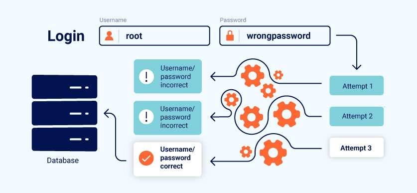

# Business logic vulnerabilities
Trong phần này, chúng tôi sẽ giới thiệu khái niệm về lỗ hổng logic nghiệp vụ và giải thích cách chúng có thể phát sinh do các giả định sai lầm về hành vi của người dùng. Chúng tôi sẽ thảo luận về tác động tiềm ẩn của các lỗi logic và hướng dẫn bạn cách khai thác chúng. Bạn cũng có thể thực hành những gì mình đã học bằng cách sử dụng phòng thí nghiệm tương tác của chúng tôi, dựa trên các lỗi thực tế mà chúng tôi đã gặp trong thực tế. Cuối cùng, chúng tôi sẽ cung cấp một số phương pháp chung tốt nhất để giúp bạn ngăn chặn các loại lỗi logic này phát sinh trong ứng dụng của riêng bạn.\

## What are business logic vulnerabilities?
Lỗ hổng business logic là **những sai sót trong thiết kế và triển khai** ứng dụng cho phép kẻ tấn công thực hiện hành vi ngoài ý muốn. Điều này có khả năng cho phép kẻ tấn công thao túng chức năng hợp pháp để đạt được mục tiêu độc hại. Những sai sót này thường là kết quả của việc không lường trước được các trạng thái ứng dụng bất thường có thể xảy ra và do đó không xử lý chúng một cách an toàn.\
**Lưu ý:** Trong ngữ cảnh này, thuật ngữ "business logic" chỉ đơn giản đề cập đến bộ quy tắc xác định cách ứng dụng hoạt động. Vì các quy tắc này không phải lúc nào cũng liên quan trực tiếp đến doanh nghiệp nên các lỗ hổng liên quan còn được gọi là "lỗ hổng logic ứng dụng" hoặc đơn giản là "lỗi logic".\
Các lỗ hổng logic thường không hiển thị đối với những người không tìm kiếm chúng một cách rõ ràng vì chúng thường không bị lộ ra khi sử dụng ứng dụng thông thường. Tuy nhiên, kẻ tấn công có thể khai thác các hành vi kỳ quặc bằng cách tương tác với ứng dụng theo những cách mà nhà phát triển không bao giờ có ý định.\
Các lỗ hổng trong logic có thể cho phép kẻ tấn công phá vỡ các quy tắc này. **Ví dụ: họ có thể hoàn tất giao dịch mà không cần thực hiện quy trình mua hàng dự kiến.** Trong các trường hợp khác, việc xác thực dữ liệu do người dùng cung cấp bị hỏng hoặc không tồn tại có thể cho phép người dùng thực hiện các thay đổi tùy ý đối với các giá trị quan trọng trong giao dịch hoặc gửi thông tin đầu vào vô nghĩa. Bằng cách chuyển các giá trị không mong muốn vào logic phía máy chủ, kẻ tấn công có thể khiến ứng dụng thực hiện điều gì đó mà nó không được phép làm.\
Các lỗ hổng dựa trên logic có thể cực kỳ đa dạng và thường chỉ dành riêng cho ứng dụng cũng như chức năng cụ thể của nó. Việc xác định chúng thường đòi hỏi một lượng kiến ​​thức nhất định của con người, chẳng hạn như sự hiểu biết về lĩnh vực kinh doanh hoặc mục tiêu mà kẻ tấn công có thể có trong một bối cảnh nhất định. Điều này khiến chúng khó bị phát hiện bằng cách sử dụng máy quét lỗ hổng tự động. Do đó, các lỗ hổng logic là mục tiêu tuyệt vời cho những người săn lỗi và người kiểm tra thủ công nói chung.

## How do business logic vulnerabilities arise?
Các lỗ hổng logic nghiệp vụ thường phát sinh do nhóm thiết kế và phát triển đưa ra các **giả định sai lầm về cách người dùng sẽ tương tác với ứng dụng**. Những giả định xấu này có thể dẫn đến việc xác thực đầu vào của người dùng không đầy đủ. Ví dụ: nếu nhà phát triển cho rằng người dùng sẽ chỉ truyền dữ liệu qua trình duyệt web thì ứng dụng có thể dựa hoàn toàn vào các biện pháp kiểm soát yếu kém phía máy khách để xác thực dữ liệu đầu vào. Những kẻ tấn công này có thể dễ dàng vượt qua chúng bằng cách sử dụng proxy chặn.\
Cuối cùng, điều này có nghĩa là khi kẻ tấn công đi chệch khỏi hành vi mong đợi của người dùng, ứng dụng sẽ không thực hiện các bước thích hợp để ngăn chặn điều này và sau đó không xử lý tình huống một cách an toàn.\
Các lỗi logic đặc biệt phổ biến trong các hệ thống quá phức tạp mà ngay cả bản thân nhóm phát triển cũng không hiểu hết. Để tránh các lỗi logic, các nhà phát triển cần hiểu toàn bộ ứng dụng. Điều này bao gồm việc nhận thức được cách các chức năng khác nhau có thể được kết hợp theo những cách không ngờ tới.\
Các nhà phát triển làm việc trên cơ sở mã lớn có thể không hiểu rõ về cách hoạt động của tất cả các lĩnh vực của ứng dụng. Ai đó làm việc trên một thành phần có thể đưa ra các giả định sai sót về cách hoạt động của thành phần khác và kết quả là vô tình gây ra các lỗi logic nghiêm trọng. Nếu các nhà phát triển không ghi lại rõ ràng bất kỳ giả định nào đang được đưa ra thì các loại lỗ hổng này rất dễ xâm nhập vào ứng dụng.
## What is the impact of business logic vulnerabilities?
Đôi khi, tác động của các lỗ hổng business logic có thể khá nhỏ. Đây là một phạm trù rộng và tác động rất khác nhau. Tuy nhiên, bất kỳ hành vi ngoài ý muốn nào cũng có thể dẫn đến các cuộc tấn công có mức độ nghiêm trọng cao nếu kẻ tấn công có thể thao túng ứng dụng đúng cách. Vì lý do này, logic kỳ quặc lý tưởng nhất là nên được sửa ngay cả khi bạn không thể tự mình tìm ra cách khai thác nó. Luôn có rủi ro mà người khác có thể làm được.\
Về cơ bản, tác động của bất kỳ lỗ hổng logic nào đều phụ thuộc vào chức năng liên quan đến nó. Ví dụ: nếu lỗ hổng nằm trong cơ chế xác thực, điều này có thể ảnh hưởng nghiêm trọng đến bảo mật tổng thể của bạn. Những kẻ tấn công có thể khai thác điều này để leo thang đặc quyền hoặc bỏ qua hoàn toàn xác thực, giành quyền truy cập vào dữ liệu và chức năng nhạy cảm. Điều này cũng làm lộ ra bề mặt tấn công gia tăng cho các hoạt động khai thác khác.\
Logic sai sót trong các giao dịch tài chính rõ ràng có thể dẫn đến tổn thất lớn cho doanh nghiệp do bị đánh cắp tiền, gian lận, v.v.\
Bạn cũng nên lưu ý rằng mặc dù các lỗi logic có thể không cho phép kẻ tấn công hưởng lợi trực tiếp nhưng chúng vẫn có thể cho phép một bên độc hại gây thiệt hại cho doanh nghiệp theo một cách nào đó.
## What are some examples of business logic vulnerabilities?
Cách tốt nhất để hiểu các lỗ hổng logic nghiệp vụ là xem xét các trường hợp thực tế và học hỏi từ những sai lầm đã mắc phải. Chúng tôi đã cung cấp các ví dụ cụ thể về nhiều lỗi logic phổ biến cũng như một số trang web dễ bị tấn công có chủ ý để bạn có thể tự mình thực hành khai thác các lỗ hổng này.

Đọc thêm: Ví dụ về lỗ hổng logic nghiệp vụ

