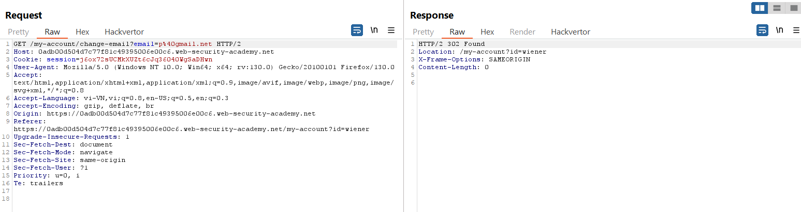
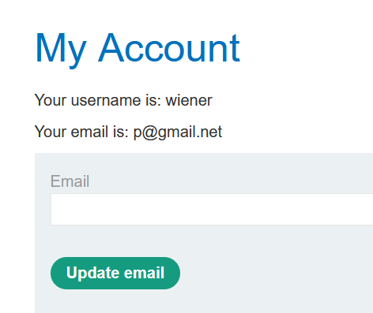
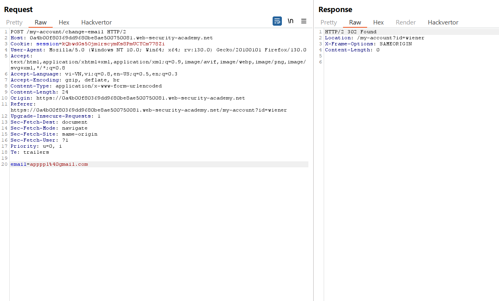

# CSRF lab

### 1. CSRF vulnerability with no defenses
https://portswigger.net/web-security/csrf/lab-no-defenses

Đăng nhập vào `wiener:peter` sau đó thay đổi email, do việc này không có csrf token cũng không có xác thực mật khẩu nên ta tạo form rồi gửi cho `carlos`

---

### 2. CSRF where token validation depends on request method
https://portswigger.net/web-security/csrf/bypassing-token-validation/lab-token-validation-depends-on-request-method

Context: ở đây khi dùng POST để đổi email thì cần có thêm `csrf` token, nhưng khi đổi sang GET thì không cần `csrf` token

Từ đây ta tạo csrf form để gửi đi. 

---

### 3. CSRF where token validation depends on token being present
https://portswigger.net/web-security/csrf/bypassing-token-validation/lab-token-validation-depends-on-token-being-present

Ở bài này việc xóa đi csrf token trong POST không ảnh hưởng đến kết quả.

Từ đây ta tạo payload.

