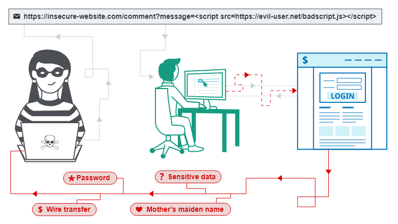

# Cross-site scripting
Trong phần này, chúng tôi sẽ giải thích tập lệnh chéo trang là gì, mô tả các loại lỗ hổng tập lệnh chéo trang khác nhau và trình bày cách tìm và ngăn chặn tập lệnh chéo trang.
## What is cross-site scripting (XSS)?
Cross-site scripting (còn được gọi là XSS) là một lỗ hổng bảo mật web cho phép kẻ tấn công xâm phạm các tương tác mà người dùng thực hiện với một ứng dụng dễ bị tấn công. Nó cho phép kẻ tấn công phá vỡ chính sách xuất xứ tương tự, được thiết kế để tách biệt các trang web khác nhau với nhau. Các lỗ hổng kịch bản chéo trang thường cho phép kẻ tấn công giả dạng người dùng nạn nhân, thực hiện bất kỳ hành động nào mà người dùng có thể thực hiện và truy cập bất kỳ dữ liệu nào của người dùng. Nếu người dùng nạn nhân có quyền truy cập đặc quyền vào ứng dụng thì kẻ tấn công có thể giành được toàn quyền kiểm soát tất cả chức năng và dữ liệu của ứng dụng.
## How does XSS work?
Cross-site scripting hoạt động bằng cách thao túng một trang web dễ bị tấn công để trả về JavaScript độc hại cho người dùng. Khi mã độc thực thi bên trong trình duyệt của nạn nhân, kẻ tấn công hoàn toàn có thể xâm phạm sự tương tác của họ với ứng dụng.\

## XSS proof of concept
Bạn có thể xác nhận hầu hết các loại lỗ hổng XSS bằng cách chèn một tải trọng khiến trình duyệt của bạn thực thi một số JavaScript tùy ý. Từ lâu, người ta thường sử dụng hàm `alert()` cho mục đích này vì nó ngắn, vô hại và khá khó bỏ sót khi được gọi thành công. Trên thực tế, bạn giải quyết phần lớn các phòng thí nghiệm XSS của chúng tôi bằng cách gọi `alert()` trong trình duyệt của nạn nhân được mô phỏng.\
Thật không may, sẽ có một chút trục trặc nếu bạn sử dụng Chrome. Từ phiên bản 92 trở đi (ngày 20 tháng 7 năm 2021), các cross-origin `iframe` bị ngăn gọi `alert()`. Vì chúng được sử dụng để xây dựng một số cuộc tấn công XSS nâng cao hơn nên đôi khi bạn sẽ cần sử dụng tải trọng PoC thay thế. Trong trường hợp này, chúng tôi khuyên dùng hàm `print()`. Nếu bạn muốn tìm hiểu thêm về thay đổi này và lý do chúng tôi thích `print()`, hãy xem bài đăng trên blog của chúng tôi về chủ đề này.\
Vì nạn nhân được mô phỏng trong phòng thí nghiệm của chúng tôi sử dụng Chrome nên chúng tôi đã sửa đổi các phòng thí nghiệm bị ảnh hưởng để chúng cũng có thể được giải quyết bằng cách sử dụng `print()`. Chúng tôi đã chỉ ra điều này trong hướng dẫn ở những nơi có liên quan.
## What are the types of XSS attacks?
Có ba loại tấn công XSS chính. Đây là:
- Reflected XSS, trong đó tập lệnh độc hại xuất phát từ yêu cầu HTTP hiện tại.
- Stored XSS, nơi tập lệnh độc hại đến từ cơ sở dữ liệu của trang web.
- DOM-based XSS, trong đó lỗ hổng tồn tại trong mã phía máy khách chứ không phải mã phía máy chủ.
## Reflected cross-site scripting
Reflected XSS là loại kịch bản chéo trang đơn giản nhất. Nó phát sinh khi một ứng dụng nhận được dữ liệu trong một yêu cầu HTTP và bao gồm dữ liệu đó trong phản hồi ngay lập tức theo cách không an toàn.\
Đây là một ví dụ đơn giản về lỗ hổng reflected XSS:
```
https://insecure-website.com/status?message=All+is+well.
<p>Status: All is well.</p>
```
Ứng dụng không thực hiện bất kỳ quá trình xử lý dữ liệu nào khác, vì vậy kẻ tấn công có thể dễ dàng thực hiện một cuộc tấn công như thế này:
```
https://insecure-website.com/status?message=<script>/*+Bad+stuff+here...+*/</script>
<p>Status: <script>/* Bad stuff here... */</script></p>
```
Nếu người dùng truy cập URL do kẻ tấn công tạo thì tập lệnh của kẻ tấn công sẽ thực thi trong trình duyệt của người dùng, trong bối cảnh phiên của người dùng đó với ứng dụng. Tại thời điểm đó, tập lệnh có thể thực hiện bất kỳ hành động nào và truy xuất bất kỳ dữ liệu nào mà người dùng có quyền truy cập.

Đọc thêm: Reflected cross-site scripting

