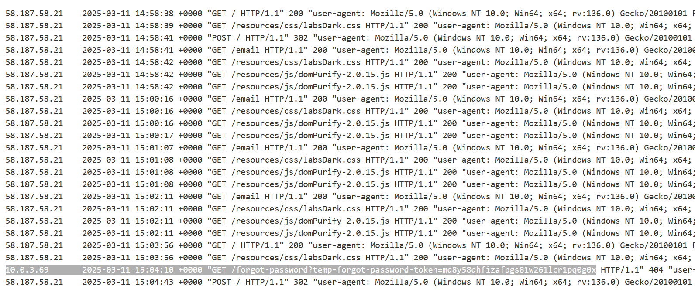

# How to identify and exploit HTTP Host header vulnerabilities

# How to test

## Thử sử dụng Host Header tùy ý

- Gửi một `Host` Header tùy ý hoặc không xác định (ví dụ: một domain không hợp lệ).

Kết quả khả thi:

- Truy cập được ứng dụng: Máy chủ có thể được cấu hình với một lựa chọn mặc định (`fallback`) cho các domain không xác định. Trong trường hợp này ta bắt đầu kiểm tra cách ứng dụng xử lý `Host` Header.

- Không truy cập được ứng dụng: Máy chủ hoặc cân bằng tải có thể không biết cách xử lý yêu cầu và trả về lỗi như `Invalid Host header`.

## Kiểm tra xác thực không an toàn (Flawed Validation)

Một số máy chủ sẽ cố gắng xác thực `Host` Header, ví dụ bằng cách kiểm tra xem Host có khớp với `SNI` trong `TLS` handshake hay không. Tuy nhiên, vẫn có thể khai thác nếu phát hiện lỗ hổng trong quy trình xác thực.

Các kỹ thuật khai thác:

- Thêm dữ liệu độc hại vào cổng (port): Nếu máy chủ chỉ kiểm tra tên miền mà bỏ qua phần cổng

```http
GET /example HTTP/1.1
Host: vulnerable-website.com:bad-stuff-here
```

- Sử dụng tên miền con hoặc tên miền tương tự: Đăng ký một domain kết thúc giống domain hợp lệ

```http
GET /example HTTP/1.1
Host: notvulnerable-website.com
```

- Sử dụng một subdomain ít bảo mật hơn:

```http
GET /example HTTP/1.1
Host: hacked-subdomain.vulnerable-website.com
```

## Gửi yêu cầu mơ hồ (Ambiguous Requests)

Các hệ thống xử lý `Host` Header có thể xử lý khác nhau, tạo ra sự không nhất quán giữa front-end và back-end. Có thể khai thác điều này bằng cách:

### Thêm nhiều `Host` Header:
- Gửi yêu cầu chứa 2 `Host` Header khác nhau:

```http
GET /example HTTP/1.1
Host: vulnerable-website.com
Host: bad-stuff-here
```

Nếu front-end ưu tiên header đầu tiên, nhưng back-end ưu tiên header cuối cùng, thì có thể sử dụng header đầu tiên để định tuyến đúng yêu cầu và header thứ hai để chèn payload độc hại.

### Cung cấp URL tuyệt đối:

Sử dụng URL tuyệt đối trong dòng yêu cầu và một `Host` Header khác:

```http
GET https://vulnerable-website.com/ HTTP/1.1
Host: bad-stuff-here
```

Sự không nhất quán giữa URL tuyệt đối và Host Header có thể bị khai thác.

### Thêm khoảng trắng (Line Wrapping):
Indent (thụt lề) một `Host` Header để tạo sự không rõ ràng:

```http
GET /example HTTP/1.1
    Host: bad-stuff-here
Host: vulnerable-website.com
```

Một số máy chủ có thể bỏ qua `Host` Header bị indent, trong khi back-end có thể ưu tiên `Host` Header này, cho phép chèn giá trị độc hại.

##  Inject Host Override Headers

Nếu không thể ghi đè `Host` Header, bạn có thể sử dụng các header như `X-Forwarded-Host` để chèn payload.

```http
GET /example HTTP/1.1
Host: vulnerable-website.com
X-Forwarded-Host: bad-stuff-here
```

Các header tương tự khác có thể khai thác:
- `X-Host`
- `X-Forwarded-Server`
- `X-HTTP-Host-Override`
- `Forwarded`

Mẹo: Sử dụng `Param Miner` extension trong Burp Suite để tự động tìm các header được hỗ trợ.

# How to exploit

## Password Reset Poisoning

`Password reset poisoning` là kỹ thuật mà kẻ tấn công lợi dụng lỗ hổng trên website để tạo liên kết reset mật khẩu trỏ đến một domain do kẻ tấn công kiểm soát. Từ đó, kẻ tấn công có thể đánh cắp token reset mật khẩu của người dùng và chiếm quyền truy cập tài khoản.

Cách thực hiện tấn công Password Reset Poisoning:

- Lợi dụng `Host` Header:

    Nếu liên kết reset mật khẩu được tạo dựa trên đầu vào có thể kiểm soát (như `Host` Header), kẻ tấn công có thể thực hiện các bước sau:

    - Kẻ tấn công nhập email của nạn nhân và gửi yêu cầu reset mật khẩu.
    - Trong quá trình gửi yêu cầu, kẻ tấn công chặn yêu cầu HTTP và sửa đổi `Host` Header để trỏ đến domain do họ kiểm soát, ví dụ: `evil-user.net`.

- Email reset mật khẩu:

    Website gửi email reset mật khẩu tới nạn nhân. Email này chứa token hợp lệ và liên kết reset mật khẩu, nhưng domain trong liên kết đã bị thay đổi: `https://evil-user.net/reset?token=0a1b2c3d4e5f6g7h8i9j`

- Đánh cắp token:

    Nếu nạn nhân nhấp vào liên kết hoặc nếu liên kết bị truy xuất bởi trình quét antivirus, token reset mật khẩu sẽ được gửi đến máy chủ của kẻ tấn công.

- Chiếm quyền tài khoản:

    - Kẻ tấn công sử dụng token bị đánh cắp để truy cập trang reset mật khẩu thật của website.

---

### Ví dụ: Basic password reset poisoning

https://portswigger.net/web-security/host-header/exploiting/password-reset-poisoning/lab-host-header-basic-password-reset-poisoning

Thử chức năng `forgot password` với username là `wiener` ta nhận được email đính kèm cùng url có token:


Bây giờ ta thao túng `Host`:


Phía client sẽ nhận được email có url lấy `Host` ta vừa inject làm domain:


Và khi victim click vào url này ta nhận được token ở máy chủ ta tháo túng

Từ đây ta lấy token của `carlos` bằng request:


Truy cập và đổi mật khẩu `carlos`

---

### Ví dụ: Password reset poisoning via middleware

https://portswigger.net/web-security/authentication/other-mechanisms/lab-password-reset-poisoning-via-middleware

Ở bài này ta tìm ra header `X-Forwarded-Host` để điều hướng phần url của email trả về:


Thay bằng `carlos`




---

### Ví dụ: Password reset poisoning via dangling markup

https://portswigger.net/web-security/host-header/exploiting/password-reset-poisoning/lab-host-header-password-reset-poisoning-via-dangling-markup

Thử tính năng `forgot password`:


Ở lab này, thay vì trả về token qua url thì back-end trả về password và url đến trang `login`, xem bản raw của mail này ta thấy có dùng HTML:


Tiêm header `Host`:


Có vẻ như `Host` yêu cầu bắt buộc là domain mặc định nhưng với port nhập tùy ý nó không phản hồi:


Nhưng ở mail client vẫn nhận được mail và khi xem raw của nó ta thấy:


Vậy ở đây ta sẽ lợi dụng để tiêm HTML tùy ý


Nhưng ở đây ta thấy nó không thể mang thêm password theo trên url, ta cần có thêm cách khai thác, với gợi ý là sẽ luôn có 1 con bot check url trong mail, ta sẽ thử:


Ta dùng 1 dấu `"` mà không có dấu đóng sau đó, điều này làm cho nó hiểu nhầm và url sẽ có thể bao gồm các kí tự sau đó


Dù mail gửi về sẽ gần như không có thẻ `<a>` nào nhưng vì được scan nên url vẫn được truy cập, ta có thể check trong log exploit server


Bây giờ chỉ việc thay bằng `Carlos` và lấy mật khẩu 

---

## Web Cache Poisoning thông qua Host Header
Mô tả: Khi Host Header được phản ánh trong mã HTML hoặc sử dụng trong các script (như nhập tệp JS), kẻ tấn công có thể sử dụng nó để tạo các phản hồi độc hại trong bộ nhớ đệm (cache).
Kỹ thuật:
Gửi một phản hồi chứa payload được phản ánh từ máy chủ.
Đảm bảo khóa bộ nhớ đệm (cache key) không thay đổi, để phản hồi độc hại này được cung cấp cho tất cả người dùng.

## Khai thác các lỗ hổng phía máy chủ (Classic Server-Side Vulnerabilities)

Kỹ thuật: Thử các kỹ thuật như SQL Injection thông qua Host Header.
Ví dụ: Nếu giá trị Host Header được truyền vào truy vấn SQL, điều này có thể dẫn đến lỗ hổng.

## Truy cập tính năng bị hạn chế (Bypassing Authentication)
Mô tả: Một số website có cơ chế kiểm soát truy cập lỗi, cho phép bạn vượt qua hạn chế bằng cách thay đổi Host Header. Điều này có thể mở ra bề mặt tấn công lớn hơn.

## Virtual Host Brute-Forcing
Mô tả: Nhiều công ty lưu trữ cả website công khai và nội bộ trên cùng một máy chủ.
Kỹ thuật:
Dùng Burp Intruder và danh sách các tên miền phụ để brute-force tên miền ảo (virtual host).
Nếu tên miền nội bộ không có bản ghi DNS công khai, bạn vẫn có thể truy cập nếu đoán đúng tên miền.

## Routing-based SSRF (Server-Side Request Forgery)
Mô tả: Tấn công này khai thác các thành phần trung gian (load balancer hoặc reverse proxy) được cấu hình không an toàn, cho phép Host Header không được xác thực định tuyến đến các hệ thống tùy ý.
Kỹ thuật:
Cung cấp domain độc hại (hoặc Burp Collaborator) trong Host Header để kiểm tra xem có thể định tuyến tới các hệ thống nội bộ hay không.
Sau khi xác nhận, sử dụng dải địa chỉ IP riêng (private IP ranges) để quét và truy cập các hệ thống nội bộ.

## Connection State Attacks
Mô tả: Một số máy chủ HTTP tái sử dụng kết nối cho nhiều yêu cầu nhưng chỉ thực hiện xác thực nghiêm ngặt trên yêu cầu đầu tiên.
Kỹ thuật:
Gửi một yêu cầu hợp lệ ban đầu để vượt qua xác thực, sau đó gửi yêu cầu độc hại trên cùng kết nối.

## SSRF qua Request Line bị lỗi (Malformed Request Line)
Mô tả: Proxy ngược (reverse proxy) có thể không kiểm tra đúng cách dòng yêu cầu, cho phép gửi yêu cầu không chuẩn.
Ví dụ: Yêu cầu bắt đầu bằng ký tự @ có thể dẫn đến định tuyến tới hệ thống nội bộ

```http
GET @private-intranet/example HTTP/1.1
```


