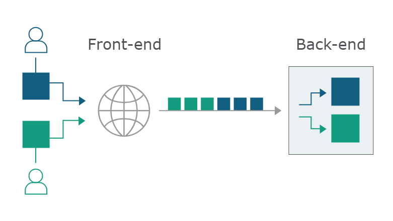
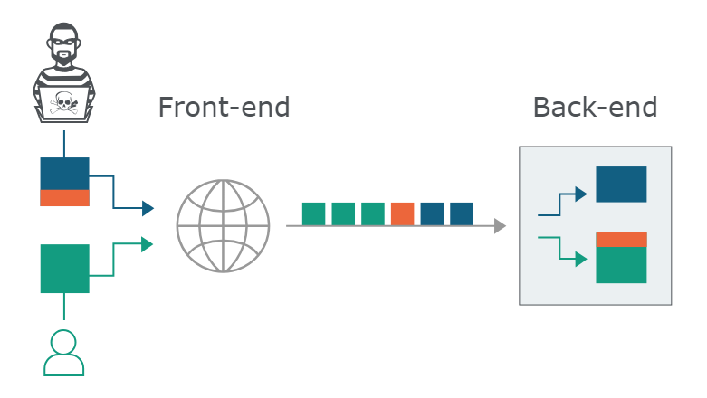
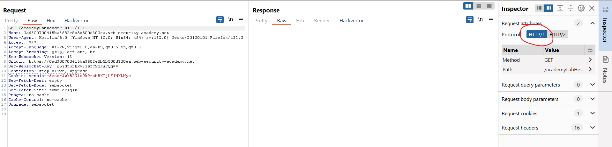
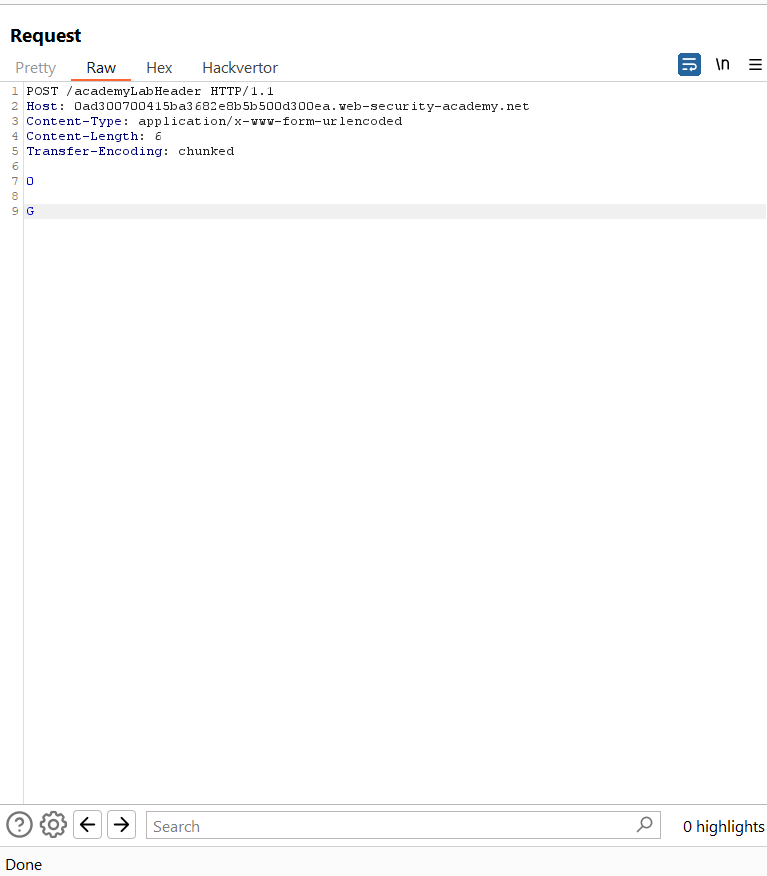
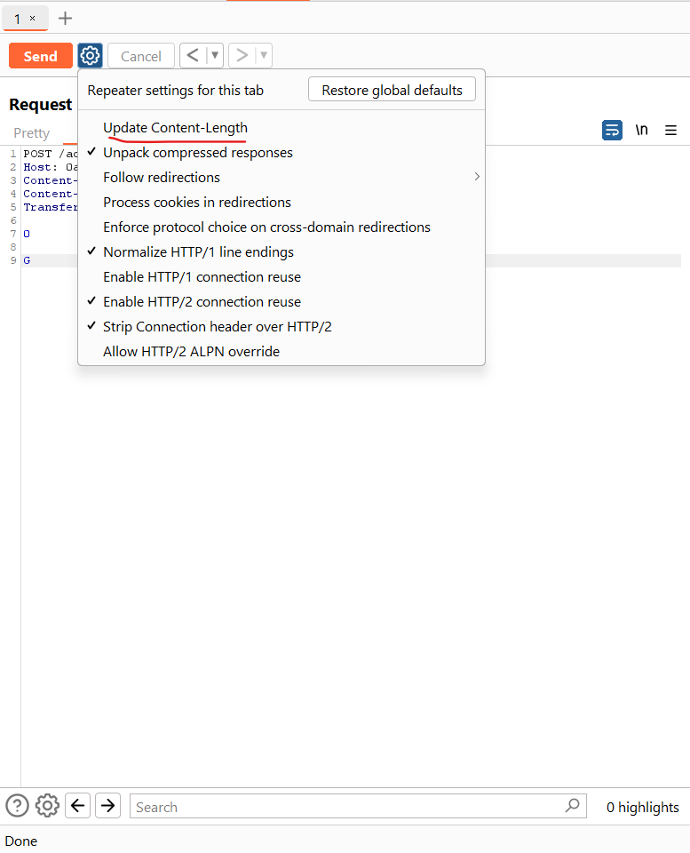
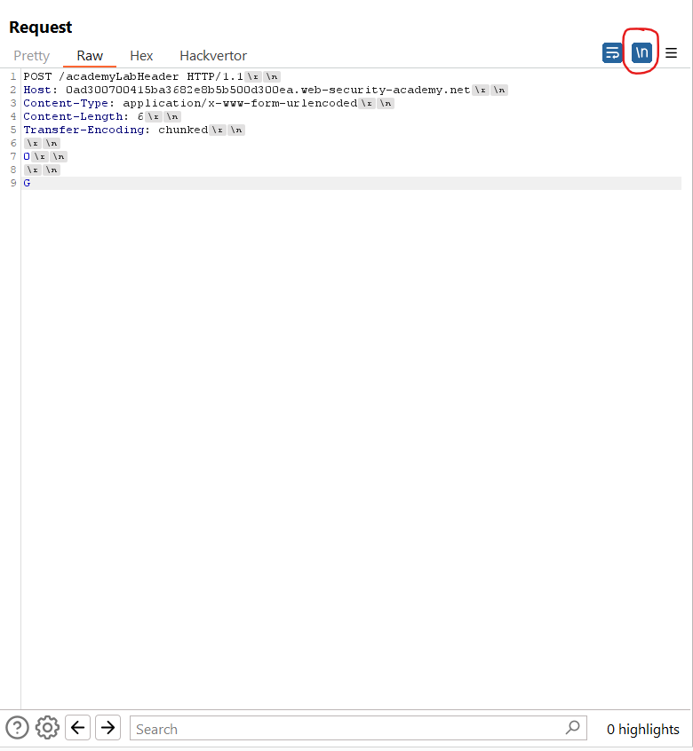
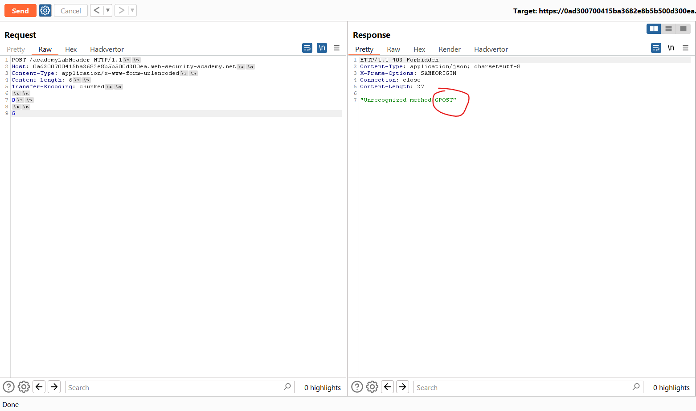
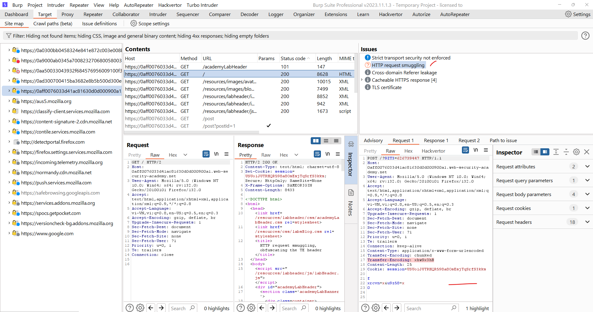

## HTTP request smuggling

## What is HTTP request smuggling?

HTTP request smuggling là một kỹ thuật can thiệp vào cách một trang web xử lý chuỗi các yêu cầu HTTP được nhận từ một hoặc nhiều người dùng.

## What happens in an HTTP request smuggling attack?
Các ứng dụng web ngày nay thường sử dụng nhiều HTTP server giữa người dùng và logic ứng dụng cuối cùng. Người dùng gửi các yêu cầu đến một front-end server (đôi khi được gọi là bộ cân bằng tải hoặc reverse proxy) và server chuyển tiếp các yêu cầu đến một hoặc nhiều máy chủ phía sau. 

Khi front-end server chuyển tiếp các yêu cầu HTTP đến back-end server, nó thường gửi nhiều yêu cầu qua cùng một kết nối mạng back-end, vì điều này hiệu quả hơn và cải thiện hiệu suất. Giao thức rất đơn giản; các yêu cầu HTTP được gửi tuần tự, và máy chủ nhận phải xác định điểm kết thúc của một yêu cầu và điểm bắt đầu của yêu cầu tiếp theo:\


Trong tình huống này, điều quan trọng là các hệ thống phía trước và phía sau phải đồng ý về ranh giới giữa các yêu cầu. Nếu không, kẻ tấn công có thể gửi một yêu cầu mơ hồ được hệ thống phía trước và phía sau hiểu khác nhau:\


Ở đây, kẻ tấn công khiến một phần yêu cầu từ phía trước của họ được máy chủ phía sau hiểu là phần đầu của yêu cầu tiếp theo. Yêu cầu này thực tế được ghép vào yêu cầu tiếp theo, từ đó có thể can thiệp vào cách ứng dụng xử lý yêu cầu đó. Đây là một cuộc tấn công giấu yêu cầu và có thể gây ra hậu quả nghiêm trọng.

## How do HTTP request smuggling vulnerabilities arise?
Hầu hết các lỗ hổng giấu yêu cầu HTTP phát sinh vì đặc tả `HTTP/1` cung cấp hai cách khác nhau để xác định nơi một yêu cầu kết thúc: header `Content-Length` và header `Transfer-Encoding`.

Header `Content-Length` rất đơn giản: nó chỉ rõ độ dài của phần thân thông điệp tính theo byte. Ví dụ:
```HTTP
POST /search HTTP/1.1
Host: normal-website.com
Content-Type: application/x-www-form-urlencoded
Content-Length: 11

q=smuggling
```

Header `Transfer-Encoding` có thể được sử dụng để chỉ rõ rằng phần thân thông điệp sử dụng mã hóa chunked. Điều này có nghĩa là phần thân thông điệp chứa một hoặc nhiều khối dữ liệu. Mỗi khối bao gồm kích thước khối tính theo byte (được biểu diễn dưới dạng thập lục phân), theo sau là một dòng mới, tiếp đó là nội dung khối. Thông điệp kết thúc bằng một khối có kích thước bằng không. Ví dụ:
```HTTP
POST /search HTTP/1.1
Host: normal-website.com
Content-Type: application/x-www-form-urlencoded
Transfer-Encoding: chunked

b
q=smuggling
0
```

Do đặc tả HTTP/1 cung cấp hai phương pháp khác nhau để chỉ rõ độ dài của các thông điệp HTTP, nên có thể một thông điệp sử dụng cả hai phương pháp cùng lúc, dẫn đến mâu thuẫn. Đặc tả cố gắng ngăn chặn vấn đề này bằng cách quy định rằng nếu cả header `Content-Length` và `Transfer-Encoding` đều có mặt, thì header `Content-Length` sẽ bị bỏ qua. Điều này có thể đủ để tránh mơ hồ khi chỉ có một máy chủ xử lý, nhưng không phải khi có từ hai máy chủ trở lên liên kết với nhau. Trong tình huống này, các vấn đề có thể phát sinh vì hai lý do:
- Một số máy chủ không hỗ trợ header `Transfer-Encoding` trong các yêu cầu.
- Một số máy chủ hỗ trợ header `Transfer-Encoding` có thể bị gây ra tình trạng không xử lý header này nếu nó bị làm mất đi theo một cách nào đó.

**Lưu ý** Các trang web sử dụng HTTP/2 từ đầu đến cuối tự nhiên miễn nhiễm với các cuộc tấn công giấu yêu cầu.

## How to perform an HTTP request smuggling attack

Các cuộc tấn công request smuggling cổ điển liên quan đến việc đưa cả header `Content-Length` và header `Transfer-Encoding` vào một yêu cầu `HTTP/1` và thao tác chúng sao cho máy chủ **phía trước** và máy chủ **phía sau** xử lý yêu cầu theo cách khác nhau. Cách chính xác để thực hiện việc này phụ thuộc vào hành vi của hai máy chủ:
- `CL.TE`: máy chủ phía trước sử dụng header `Content-Length`, còn máy chủ phía sau sử dụng header `Transfer-Encoding`.
- `TE.CL`: máy chủ phía trước sử dụng header `Transfer-Encoding`, còn máy chủ phía sau sử dụng header `Content-Length`.
- `TE.TE`: cả máy chủ phía trước và máy chủ phía sau đều hỗ trợ header `Transfer-Encoding`, nhưng một trong hai máy chủ có thể bị làm cho không xử lý header này nếu nó bị làm mờ theo cách nào đó.

## How to detect

[detect](detect.md)

### Lỗ hổng CL.TE
Trong trường hợp này, máy chủ phía trước sử dụng header `Content-Length`, còn máye chủ phía sau sử dụng hader `Transfer-Encoding`. Chúng ta có thể thực hiện một cuộc tấn công HTTP request smuggling đơn giản như sau:
```http
POST / HTTP/1.1
Host: vulnerable-website.com
Content-Length: 13
Transfer-Encoding: chunked

0

SMUGGLED
```
Máy chủ phía trước xử lý header `Content-Length` và xác định rằng phần thân yêu cầu dài 13 byte, cho đến hết từ `SMUGGLED`. Yêu cầu này được chuyển tiếp đến máy chủ phía sau.

Máy chủ phía sau xử lý header `Transfer-Encoding` và coi phần thân thông điệp là sử dụng mã hóa chunked. Nó xử lý khối đầu tiên, được chỉ định là có độ dài bằng 0, do đó được coi là kết thúc yêu cầu. Các byte tiếp theo, `SMUGGLED`, không được xử lý và máy chủ phía sau sẽ coi những byte này là **phần đầu của yêu cầu tiếp theo** trong chuỗi.

---
### 1. HTTP request smuggling, basic CL.TE vulnerability
https://portswigger.net/web-security/request-smuggling/lab-basic-cl-te

Yêu cầu: đánh lừa máy chủ gửi 1 request `GPOST`

Đổi về HTTP 1.1\


Chuyển request thành `POST`, xóa các header không cần thiết, thêm header `Transfer-encoding: chunked`:\


Tắt phần tự động update content length\


Bật chế độ xem các kí tự ngắt dòng để dễ hiểu hơn:\


Ở đây `\n` hay `\r` tính là 1 byte nên `Content-length` được tính là 6 (do bỏ qua 1 dòng trắng) nhưng với máy chủ phân giải `Transfer-encoding` thì sẽ tính khối `0` đầu tiên là kết thúc, nên nó hiểu `G` của request sau, và gộp với `POST` thành `GPOST` và nó phản hồi là không hiểu `GPOST`:\


---

### Lỗ hổng TE.CL 
Trong trường hợp này, máy chủ phía trước sử dụng header `Transfer-Encoding`, và máy chủ phía sau sử dụng header `Content-Length`.

Gửi request:
```http
POST / HTTP/1.1
Host: vulnerable-website.com
Content-Length: 3
Transfer-Encoding: chunked

8
SMUGGLED
0
```

Lưu ý:  cần bao gồm chuỗi kết thúc `\r\n\r\n` sau ký tự `0` cuối cùng

Máy chủ phía trước xử lý header `Transfer-Encoding` và coi phần thân của thông điệp là sử dụng mã hóa theo từng khối (chunked encoding). Nó xử lý khối đầu tiên có độ dài `8` byte, tính đến đầu dòng sau chữ `SMUGGLED`. Tiếp theo, nó xử lý khối thứ hai có độ dài là `0` byte, và coi đây là dấu hiệu kết thúc yêu cầu. Yêu cầu này sau đó được chuyển tiếp đến máy chủ phía sau.

Máy chủ phía sau xử lý header `Content-Length` và xác định rằng phần thân của yêu cầu có độ dài 3 byte, đến đầu dòng sau `8`. Các byte sau đó, bắt đầu từ `SMUGGLED`, không được xử lý và máy chủ phía sau sẽ coi chúng là phần đầu của yêu cầu tiếp theo trong chuỗi.

---

### 2. HTTP request smuggling, basic TE.CL vulnerability
https://portswigger.net/web-security/request-smuggling/lab-basic-te-cl

Yêu cầu: đánh lừa back-end xử lí request GPOST

Payload: 

```http
POST / HTTP/1.1
Host: 0a9000ab0345a700823270680058003e.web-security-academy.net
Content-Type: application/x-www-form-urlencoded
Content-Length: 4
Transfer-Encoding: chunked

5c
GPOST / HTTP/1.1
Content-Type: application/x-www-form-urlencoded
Content-Length: 15

x=1
0

```

Chú ý đến `/r/n/r/n` sau `0`

---

### Hành vi TE.TE: làm nhiễu header TE
Trong trường hợp này, cả máy chủ phía trước và phía sau đều hỗ trợ header `Transfer-Encoding`, nhưng có thể khiến một trong hai máy chủ không xử lý nó bằng cách làm nhiễu header này.

Có nhiều cách khác nhau để làm nhiễu header Transfer-Encoding. Ví dụ:
```http
Transfer-Encoding: xchunked

Transfer-Encoding : chunked

Transfer-Encoding: chunked
Transfer-Encoding: x

Transfer-Encoding:[tab]chunked

[space]Transfer-Encoding: chunked

X: X[\n]Transfer-Encoding: chunked

Transfer-Encoding
: chunked
```

Mỗi kỹ thuật trên đều có một sự thay đổi nhỏ so với đặc tả HTTP. Trong thực tế, mã thực hiện đặc tả giao thức hiếm khi tuân thủ tuyệt đối và các triển khai khác nhau thường sẽ chấp nhận các biến thể khác nhau so với đặc tả. Để tìm ra lỗ hổng TE.TE, cần phải xác định một biến thể của header `Transfer-Encoding sao` cho chỉ một trong hai máy chủ phía trước hoặc phía sau xử lý nó, trong khi máy chủ còn lại bỏ qua.

Tùy thuộc vào việc máy chủ phía trước hay phía sau có thể bị làm cho không xử lý header Transfer-Encoding bị làm nhiễu, phần còn lại của cuộc tấn công sẽ giống với các lỗ hổng CL.TE hoặc TE.CL đã được mô tả trước đó.

---

### 3. HTTP request smuggling, obfuscating the TE header
https://portswigger.net/web-security/request-smuggling/lab-obfuscating-te-header

Mục tiêu: đánh lừa back-end request `GPOST`

Dùng scan active của Burp ta thấy có phát hiện ra HTTP request smuggling:|


Dựa vào đó phát triển thêm payload: 
```http
POST / HTTP/1.1
Host: 0aff0076033d41ac81630d0d000900a1.web-security-academy.net
Content-Type: application/x-www-form-urlencoded
Transfer-Encoding: chunked
Transfer-Encoding: xhwSx3hB
Content-Length: 4

5c
GPOST / HTTP/1.1
Content-Type: application/x-www-form-urlencoded
Content-Length: 15

x=1
0

```


