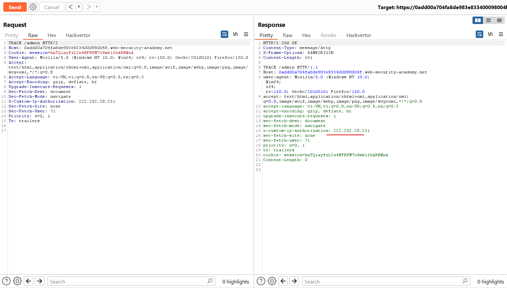

# How to find and exploit information disclosure vulnerabilities
Trong phần này, chúng tôi sẽ cung cấp lời khuyên thiết thực về một số kỹ thuật và công cụ mà bạn có thể sử dụng để giúp xác định việc tiết lộ thông tin trong nhiều bối cảnh khác nhau. Chúng tôi cũng đã cung cấp một số phòng thí nghiệm để bạn có thể thực hành trích xuất các loại thông tin khác nhau có thể được sử dụng như một phần của cuộc tấn công tiếp theo.
## How to test for information disclosure vulnerabilities
Nói chung, điều quan trọng là không phát triển "tầm nhìn đường hầm" trong quá trình thử nghiệm. Nói cách khác, bạn nên tránh tập trung quá hẹp vào một lỗ hổng cụ thể. Dữ liệu nhạy cảm có thể bị rò rỉ ở mọi nơi, vì vậy điều quan trọng là không bỏ lỡ bất kỳ điều gì có thể hữu ích sau này. Bạn sẽ thường tìm thấy dữ liệu nhạy cảm trong khi thử nghiệm thứ khác. Một kỹ năng quan trọng là có thể nhận ra thông tin thú vị bất cứ khi nào và bất cứ nơi nào bạn bắt gặp nó.\
Sau đây là một số ví dụ về các kỹ thuật và công cụ cấp cao mà bạn có thể sử dụng để giúp xác định các lỗ hổng tiết lộ thông tin trong quá trình thử nghiệm.

## Fuzzing
Nếu xác định được các tham số thú vị, bạn có thể thử gửi các loại dữ liệu không mong muốn và các chuỗi fuzz được tạo đặc biệt để xem điều này có tác dụng gì. Hãy chú ý thật kỹ; mặc dù các phản hồi đôi khi tiết lộ rõ ​​ràng những thông tin thú vị nhưng chúng cũng có thể gợi ý về hành vi của ứng dụng một cách tinh tế hơn. Ví dụ: đây có thể là một sự khác biệt nhỏ về thời gian xử lý yêu cầu. Ngay cả khi nội dung của thông báo lỗi không tiết lộ bất cứ điều gì, đôi khi việc gặp phải một trường hợp lỗi thay vì một trường hợp lỗi khác lại là thông tin hữu ích.\
Bạn có thể tự động hóa phần lớn quá trình này bằng cách sử dụng các công cụ như Burp Intruder. Điều này mang lại một số lợi ích. Đáng chú ý nhất, bạn có thể:
- Thêm vị trí tải trọng vào các tham số và sử dụng danh sách từ dựng sẵn gồm các chuỗi fuzz để kiểm tra liên tiếp một lượng lớn dữ liệu đầu vào khác nhau.
- Dễ dàng xác định sự khác biệt trong phản hồi bằng cách so sánh mã trạng thái HTTP, thời gian phản hồi, độ dài, v.v.
- Sử dụng quy tắc khớp `grep` để nhanh chóng xác định các lần xuất hiện của từ khóa, chẳng hạn như `error`, `invalid`, `SELECT`, `SQL`, v.v.
- Áp dụng quy tắc trích xuất grep để trích xuất và so sánh nội dung của các mục thú vị trong các phản hồi.

Bạn cũng có thể sử dụng tiện ích mở rộng `Logger++`, có sẵn từ cửa hàng `BApp`. Ngoài việc ghi nhật ký các yêu cầu và phản hồi từ tất cả các công cụ của Burp, nó cho phép bạn xác định các bộ lọc nâng cao để làm nổi bật các mục nhập thú vị. Đây chỉ là một trong nhiều tiện ích mở rộng Burp có thể giúp bạn tìm thấy bất kỳ dữ liệu nhạy cảm nào bị trang web rò rỉ.
## Using Burp Scanner
Người dùng Burp Suite Professional được hưởng lợi từ Burp Scanner. Điều này cung cấp các tính năng quét trực tiếp để kiểm tra các mục trong khi bạn duyệt hoặc bạn có thể lên lịch quét tự động để thu thập thông tin và kiểm tra trang web mục tiêu thay mặt bạn. Cả hai phương pháp này sẽ tự động gắn cờ nhiều lỗ hổng tiết lộ thông tin cho bạn. Ví dụ: Burp Scanner sẽ cảnh báo bạn nếu nó tìm thấy thông tin nhạy cảm như khóa riêng, địa chỉ email và số thẻ tín dụng trong phản hồi. Nó cũng sẽ xác định mọi tập tin sao lưu, danh sách thư mục, v.v.
## Using Burp's engagement tools
Burp cung cấp một số công cụ tương tác mà bạn có thể sử dụng để tìm thông tin thú vị trên trang web mục tiêu một cách dễ dàng hơn. Bạn có thể truy cập các công cụ tương tác từ menu ngữ cảnh - chỉ cần nhấp chuột phải vào bất kỳ thông báo HTTP, mục nhập Burp Proxy hoặc mục nào trong sơ đồ trang web và đi tới "Engagement tools".\
Các công cụ sau đây đặc biệt hữu ích trong bối cảnh này.
### Search
Bạn có thể sử dụng công cụ này để tìm kiếm bất kỳ biểu thức nào trong mục đã chọn. Bạn có thể tinh chỉnh kết quả bằng nhiều tùy chọn tìm kiếm nâng cao khác nhau, chẳng hạn như tìm kiếm biểu thức chính quy hoặc tìm kiếm phủ định. Điều này rất hữu ích để nhanh chóng tìm thấy sự xuất hiện (hoặc vắng mặt) của các từ khóa quan tâm cụ thể.
### Find comments
Bạn có thể sử dụng công cụ này để nhanh chóng trích xuất mọi nhận xét của nhà phát triển được tìm thấy trong mục đã chọn. Nó cũng cung cấp các tab để truy cập ngay vào chu trình yêu cầu/phản hồi HTTP trong đó mỗi nhận xét được tìm thấy.
### Discover content
Bạn có thể sử dụng công cụ này để xác định nội dung và chức năng bổ sung không được liên kết với nội dung hiển thị của trang web. Điều này có thể hữu ích cho việc tìm kiếm các thư mục và tệp bổ sung không nhất thiết phải tự động xuất hiện trong sơ đồ trang web.
## Engineering informative responses
Thông báo lỗi chi tiết đôi khi có thể tiết lộ thông tin thú vị trong khi bạn thực hiện quy trình kiểm tra thông thường của mình. Tuy nhiên, bằng cách nghiên cứu cách các thông báo lỗi thay đổi theo dữ liệu đầu vào của bạn, bạn có thể tiến thêm một bước này. Trong một số trường hợp, bạn sẽ có thể thao tác với trang web để trích xuất dữ liệu tùy ý thông qua thông báo lỗi.\
Có rất nhiều phương pháp để thực hiện việc này tùy thuộc vào tình huống cụ thể mà bạn gặp phải. Một ví dụ phổ biến là làm cho logic ứng dụng thực hiện một hành động không hợp lệ đối với một mục dữ liệu cụ thể. Ví dụ: việc gửi một giá trị tham số không hợp lệ có thể dẫn đến phản hồi theo dõi ngăn xếp hoặc gỡ lỗi có chứa các chi tiết thú vị. Đôi khi, bạn có thể khiến thông báo lỗi tiết lộ giá trị của dữ liệu bạn mong muốn trong phản hồi.
## Common sources of information disclosure
Việc tiết lộ thông tin có thể xảy ra trong nhiều bối cảnh khác nhau trong một trang web. Sau đây là một số ví dụ phổ biến về những nơi bạn có thể xem xét liệu thông tin nhạy cảm có bị lộ hay không.
### Files for web crawlers
Nhiều trang web cung cấp các tệp tại `/robots.txt` và `/sitemap.xml` để giúp trình thu thập thông tin điều hướng trang web của họ. Trong số những thứ khác, những tệp này thường liệt kê các thư mục cụ thể mà trình thu thập thông tin nên bỏ qua, chẳng hạn vì chúng có thể chứa thông tin nhạy cảm.\
Vì những tệp này thường không được liên kết từ bên trong trang web nên chúng có thể không xuất hiện ngay trên Burp's sitemap. Tuy nhiên, bạn nên thử điều hướng đến `/robots.txt` hoặc `/sitemap.xml` theo cách thủ công để xem liệu bạn có tìm thấy điều gì hữu ích không.
###  Directory listings
Máy chủ web có thể được cấu hình để tự động liệt kê nội dung của các thư mục không có trang chỉ mục. Điều này có thể hỗ trợ kẻ tấn công bằng cách cho phép chúng nhanh chóng xác định các tài nguyên trên một đường dẫn nhất định và trực tiếp tiến hành phân tích và tấn công các tài nguyên đó. Nó đặc biệt làm tăng khả năng hiển thị các tệp nhạy cảm trong thư mục mà người dùng không thể truy cập được, chẳng hạn như các tệp tạm thời và các kết xuất lỗi.\
Bản thân `Directory listings` không hẳn là một lỗ hổng bảo mật. Tuy nhiên, nếu trang web thực hiện kiểm soát truy cập không thích hợp thì việc rò rỉ sự tồn tại và vị trí của các tài nguyên nhạy cảm theo cách này rõ ràng là một vấn đề.
### Developer comments
Trong quá trình phát triển, các comment HTML nội tuyến đôi khi được thêm vào phần đánh dấu. Những comment này thường bị loại bỏ trước khi các thay đổi được triển khai vào môi trường sản xuất. Tuy nhiên, các comment đôi khi có thể bị quên, bị bỏ sót hoặc thậm chí bị cố ý để lại do ai đó không nhận thức đầy đủ về các tác động bảo mật. Mặc dù những comment này không hiển thị trên trang được hiển thị nhưng chúng có thể dễ dàng được truy cập bằng Burp hoặc thậm chí là các công cụ dành cho nhà phát triển tích hợp trong trình duyệt.\
Đôi khi, những bình luận này chứa thông tin hữu ích cho kẻ tấn công. Ví dụ: chúng có thể gợi ý về sự tồn tại của các thư mục ẩn hoặc cung cấp manh mối về logic ứng dụng.
### Error messages
Một trong những nguyên nhân phổ biến nhất của việc tiết lộ thông tin là các thông báo lỗi dài dòng. Theo nguyên tắc chung, bạn nên chú ý đến tất cả các thông báo lỗi gặp phải trong quá trình kiểm tra.\
Nội dung của thông báo lỗi có thể tiết lộ thông tin về loại dữ liệu hoặc đầu vào nào được mong đợi từ một tham số nhất định. Điều này có thể giúp bạn thu hẹp cuộc tấn công bằng cách xác định các tham số có thể khai thác được. Nó thậm chí có thể giúp bạn tránh lãng phí thời gian khi cố gắng đưa vào những tải trọng không hiệu quả.\
Thông báo lỗi chi tiết cũng có thể cung cấp thông tin về các công nghệ khác nhau đang được trang web sử dụng. Ví dụ: họ có thể đặt tên rõ ràng cho công cụ tạo mẫu, loại cơ sở dữ liệu hoặc máy chủ mà trang web đang sử dụng, cùng với số phiên bản của nó. Thông tin này có thể hữu ích vì bạn có thể dễ dàng tìm kiếm bất kỳ tài liệu khai thác nào có thể tồn tại cho phiên bản này. Tương tự, bạn có thể kiểm tra xem có bất kỳ lỗi cấu hình phổ biến hoặc cài đặt mặc định nguy hiểm nào mà bạn có thể khai thác hay không. Một số trong số này có thể được nêu bật trong tài liệu chính thức.\
Bạn cũng có thể phát hiện ra rằng trang web đang sử dụng một số loại khung nguồn mở. Trong trường hợp này, bạn có thể nghiên cứu mã nguồn có sẵn công khai, đây là nguồn tài nguyên vô giá để xây dựng các khai thác của riêng bạn.\
Sự khác biệt giữa các thông báo lỗi cũng có thể tiết lộ hành vi ứng dụng khác nhau đang diễn ra phía sau. Quan sát sự khác biệt trong thông báo lỗi là một khía cạnh quan trọng của nhiều kỹ thuật, chẳng hạn như chèn SQL, liệt kê tên người dùng, v.v.

Ví dụ: https://portswigger.net/web-security/information-disclosure/exploiting/lab-infoleak-in-error-messages

Ta chỉ việc chèn `"` vào sau parameter để tạo ra lỗi. 
### Debugging data
Vì mục đích gỡ lỗi, nhiều trang web tạo thông báo lỗi tùy chỉnh và nhật ký chứa lượng lớn thông tin về hành vi của ứng dụng. Mặc dù thông tin này hữu ích trong quá trình phát triển nhưng nó cũng cực kỳ hữu ích đối với kẻ tấn công nếu nó bị rò rỉ trong môi trường sản xuất.\
Thông báo gỡ lỗi đôi khi có thể chứa thông tin quan trọng để phát triển một cuộc tấn công, bao gồm:
- Giá trị của các biến phiên chính có thể được thao tác thông qua đầu vào của người dùng
- Hostnames và credentials for back-end components
- File and directory names on the server
- Keys used to encrypt data transmitted via the client

Thông tin gỡ lỗi đôi khi có thể được ghi vào một tệp riêng biệt. Nếu kẻ tấn công có thể truy cập vào tệp này, nó có thể đóng vai trò là tài liệu tham khảo hữu ích để hiểu trạng thái thời gian chạy của ứng dụng. Nó cũng có thể cung cấp một số manh mối về cách họ có thể cung cấp đầu vào thủ công để thao tác trạng thái ứng dụng và kiểm soát thông tin nhận được.

Ví dụ: https://portswigger.net/web-security/information-disclosure/exploiting/lab-infoleak-on-debug-page

Dùng Scan của Burp Suite:\ 

### User account pages
Về bản chất, hồ sơ hoặc trang tài khoản của người dùng thường chứa thông tin nhạy cảm, chẳng hạn như địa chỉ email, số điện thoại, khóa API, v.v. Vì người dùng thường chỉ có quyền truy cập vào trang tài khoản của riêng họ nên bản thân điều này không phải là lỗ hổng. Tuy nhiên, một số trang web có lỗi logic có khả năng cho phép kẻ tấn công lợi dụng các trang này để xem dữ liệu của người dùng khác.\
Ví dụ: hãy xem xét một trang web xác định trang tài khoản của người dùng nào sẽ tải dựa trên thông số `user`.\
`GET /user/personal-info?user=carlos`\
Hầu hết các trang web sẽ thực hiện các bước để ngăn chặn kẻ tấn công chỉ cần thay đổi thông số này để truy cập các trang tài khoản của người dùng tùy ý. Tuy nhiên, đôi khi logic để tải các mục dữ liệu riêng lẻ không mạnh mẽ bằng.\
Kẻ tấn công có thể không tải được toàn bộ trang tài khoản của người dùng khác, nhưng logic để tìm nạp và hiển thị địa chỉ email đã đăng ký của người dùng, chẳng hạn, có thể không kiểm tra xem tham số `user` có khớp với người dùng hiện đang đăng nhập hay không. Trong trường hợp này, chỉ cần thay đổi tham số `user` sẽ cho phép kẻ tấn công hiển thị địa chỉ email của người dùng tùy ý trên trang tài khoản của chính họ.\
Chúng tôi sẽ xem xét các loại lỗ hổng này chi tiết hơn khi đề cập đến các lỗ hổng kiểm soát truy cập và IDOR.

### Source code disclosure via backup files
Việc có được quyền truy cập mã nguồn giúp kẻ tấn công hiểu được hành vi của ứng dụng và xây dựng các cuộc tấn công có mức độ nghiêm trọng cao dễ dàng hơn nhiều. Dữ liệu nhạy cảm đôi khi thậm chí còn được mã hóa cứng trong mã nguồn. Các ví dụ điển hình về điều này bao gồm khóa API và thông tin xác thực để truy cập các component.\
Nếu bạn có thể xác định rằng một công nghệ nguồn mở cụ thể đang được sử dụng thì điều này sẽ mang lại khả năng truy cập dễ dàng vào một lượng mã nguồn hạn chế.\
Đôi khi, thậm chí có thể khiến trang web bị lộ mã nguồn của chính nó. Khi lập sơ đồ một trang web, bạn có thể thấy rằng một số tệp mã nguồn được tham chiếu rõ ràng. Thật không may, việc yêu cầu chúng thường không tiết lộ mã. Khi máy chủ xử lý các tệp có phần mở rộng cụ thể, chẳng hạn như .php, nó thường sẽ thực thi mã, thay vì chỉ gửi mã đó đến máy khách dưới dạng văn bản. Tuy nhiên, trong một số trường hợp, bạn có thể lừa một trang web trả lại nội dung của tệp. Ví dụ: trình soạn thảo văn bản thường tạo các tệp sao lưu tạm thời trong khi tệp gốc đang được chỉnh sửa. Các tệp tạm thời này thường được biểu thị theo một cách nào đó, chẳng hạn như bằng cách thêm dấu ngã (~) vào tên tệp hoặc thêm phần mở rộng tệp khác. Việc yêu cầu tệp mã bằng phần mở rộng tệp sao lưu đôi khi có thể cho phép bạn đọc nội dung của tệp trong phản hồi.

Ví dụ: https://portswigger.net/web-security/information-disclosure/exploiting/lab-infoleak-via-backup-files

\

Khi kẻ tấn công có quyền truy cập vào mã nguồn, đây có thể là một bước tiến lớn hướng tới việc có thể xác định và khai thác các lỗ hổng bổ sung mà gần như không thể thực hiện được. Một ví dụ như vậy là quá trình deserialize không an toàn. Chúng ta sẽ xem xét lỗ hổng này sau trong một chủ đề chuyên dụng.
### Information disclosure due to insecure configuration
Các trang web đôi khi dễ bị tổn thương do cấu hình không đúng. Điều này đặc biệt phổ biến do việc sử dụng rộng rãi các công nghệ của bên thứ ba, với vô số tùy chọn cấu hình mà những người triển khai chúng không nhất thiết phải hiểu rõ.\
Trong các trường hợp khác, nhà phát triển có thể quên tắt các tùy chọn gỡ lỗi khác nhau trong môi trường sản xuất. Ví dụ: phương pháp HTTP `TRACE` được thiết kế cho mục đích chẩn đoán. Nếu được bật, máy chủ web sẽ phản hồi các yêu cầu sử dụng phương pháp `TRACE` bằng cách lặp lại phản hồi chính xác yêu cầu đã nhận được. Hành vi này thường vô hại nhưng đôi khi dẫn đến tiết lộ thông tin, chẳng hạn như tên của tiêu đề xác thực nội bộ có thể được thêm vào yêu cầu của proxy ngược.

Ví dụ: https://portswigger.net/web-security/information-disclosure/exploiting/lab-infoleak-authentication-bypass

\

### Version control history
Hầu như tất cả các trang web đều được phát triển bằng cách sử dụng một số dạng hệ thống kiểm soát phiên bản, chẳng hạn như Git. Theo mặc định, dự án Git lưu trữ tất cả dữ liệu kiểm soát phiên bản của nó trong thư mục có tên `.git`. Đôi khi, các trang web hiển thị thư mục này trong môi trường sản xuất. Trong trường hợp này, bạn có thể truy cập nó bằng cách duyệt đến `/.git`.\
Mặc dù việc duyệt thủ công cấu trúc và nội dung tệp thô thường là không thực tế, nhưng có nhiều phương pháp khác nhau để tải xuống toàn bộ thư mục `.git`. Sau đó, bạn có thể mở nó bằng cách cài đặt Git cục bộ để có quyền truy cập vào lịch sử kiểm soát phiên bản của trang web. Điều này có thể bao gồm nhật ký chứa các thay đổi đã cam kết và thông tin thú vị khác.\
Điều này có thể không cung cấp cho bạn quyền truy cập vào mã nguồn đầy đủ, nhưng so sánh sự khác biệt sẽ cho phép bạn đọc các đoạn mã nhỏ. Giống như bất kỳ mã nguồn nào, bạn cũng có thể thấy dữ liệu nhạy cảm được mã hóa cứng trong một số dòng đã thay đổi.

Ví dụ: https://portswigger.net/web-security/information-disclosure/exploiting/lab-infoleak-in-version-control-history

