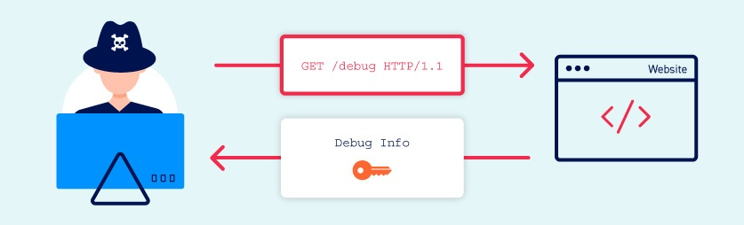

# Information disclosure vulnerabilities
Trong phần này, chúng tôi sẽ giải thích những điều cơ bản về lỗ hổng tiết lộ thông tin và mô tả cách bạn có thể tìm và khai thác chúng. Chúng tôi cũng sẽ cung cấp một số hướng dẫn về cách bạn có thể ngăn chặn các lỗ hổng tiết lộ thông tin trên trang web của riêng mình.\
\
Học cách tìm và khai thác thông tin tiết lộ là một kỹ năng quan trọng đối với bất kỳ người thử nghiệm nào. Bạn có thể gặp phải nó thường xuyên và khi bạn biết cách khai thác nó một cách hiệu quả, nó có thể giúp bạn cải thiện hiệu quả kiểm tra và cho phép bạn tìm thêm các lỗi có mức độ nghiêm trọng cao.

## What is information disclosure?
`Information disclosure` hay còn gọi là rò rỉ thông tin là việc một trang web vô tình tiết lộ thông tin nhạy cảm cho người dùng. Tùy thuộc vào ngữ cảnh, các trang web có thể rò rỉ tất cả các loại thông tin cho kẻ tấn công tiềm năng, bao gồm:
- Dữ liệu về những người dùng khác, chẳng hạn như tên người dùng hoặc thông tin tài chính
- Dữ liệu thương mại hoặc kinh doanh nhạy cảm
- Chi tiết kỹ thuật về trang web và cơ sở hạ tầng của nó

Sự nguy hiểm của việc rò rỉ dữ liệu nhạy cảm của người dùng hoặc doanh nghiệp là khá rõ ràng, nhưng việc tiết lộ thông tin kỹ thuật đôi khi cũng có thể nghiêm trọng. Mặc dù một số thông tin này sẽ được sử dụng hạn chế nhưng nó có thể là điểm khởi đầu để lộ ra một bề mặt tấn công bổ sung, có thể chứa các lỗ hổng thú vị khác. Kiến thức mà bạn có thể thu thập thậm chí có thể cung cấp mảnh ghép còn thiếu khi cố gắng xây dựng các cuộc tấn công phức tạp, có mức độ nghiêm trọng cao.\
Đôi khi, thông tin nhạy cảm có thể bị rò rỉ một cách bất cẩn tới những người dùng chỉ duyệt trang web theo cách thông thường. Tuy nhiên, thông thường hơn, kẻ tấn công cần khơi gợi việc tiết lộ thông tin bằng cách tương tác với trang web theo những cách không mong muốn hoặc độc hại. Sau đó, họ sẽ nghiên cứu cẩn thận các phản hồi của trang web để thử và xác định hành vi thú vị.

### Examples of information disclosure
Một số ví dụ cơ bản về rò rỉ thông tin như sau:
- Tiết lộ tên của các thư mục ẩn, cấu trúc và nội dung của chúng thông qua tệp robots.txt hoặc danh sách thư mục
- Cung cấp quyền truy cập vào các tệp mã nguồn thông qua các bản sao lưu tạm thời (backup)
- Đề cập rõ ràng đến tên bảng hoặc cột cơ sở dữ liệu trong thông báo lỗi
- Tiết lộ thông tin có độ nhạy cảm cao một cách không cần thiết, chẳng hạn như chi tiết thẻ tín dụng
- Khóa API mã hóa cứng, địa chỉ IP, thông tin xác thực cơ sở dữ liệu, v.v. trong mã nguồn
- Gợi ý sự tồn tại hay vắng mặt của tài nguyên, tên người dùng, v.v. thông qua những khác biệt nhỏ trong hành vi ứng dụng

Trong chủ đề này, bạn sẽ học cách tìm và khai thác một số ví dụ này và hơn thế nữa.

## How do information disclosure vulnerabilities arise?
Các lỗ hổng tiết lộ thông tin có thể phát sinh theo vô số cách khác nhau, nhưng chúng có thể được phân loại rộng rãi như sau:
- **Không xóa được nội dung nội bộ khỏi nội dung công khai.** Ví dụ: nhận xét của nhà phát triển trong đánh dấu đôi khi được hiển thị cho người dùng trong môi trường sản xuất.
- **Cấu hình không an toàn của trang web và các công nghệ liên quan.** Ví dụ: việc không tắt các tính năng chẩn đoán và gỡ lỗi đôi khi có thể cung cấp cho kẻ tấn công những công cụ hữu ích để giúp chúng lấy được thông tin nhạy cảm. Cấu hình mặc định cũng có thể khiến các trang web dễ bị tấn công, chẳng hạn như bằng cách hiển thị các thông báo lỗi quá chi tiết.
- **Thiết kế và hành vi thiếu sót của ứng dụng.** Ví dụ: nếu một trang web trả về các phản hồi riêng biệt khi xảy ra các trạng thái lỗi khác nhau, điều này cũng có thể cho phép kẻ tấn công liệt kê dữ liệu nhạy cảm, chẳng hạn như thông tin xác thực người dùng hợp lệ.

## What is the impact of information disclosure vulnerabilities?
Các lỗ hổng tiết lộ thông tin có thể có cả tác động trực tiếp và gián tiếp tùy thuộc vào mục đích của trang web và do đó, kẻ tấn công có thể lấy được thông tin gì. Trong một số trường hợp, chỉ riêng hành động tiết lộ thông tin nhạy cảm cũng có thể có tác động lớn đến các bên bị ảnh hưởng. Ví dụ: một cửa hàng trực tuyến làm rò rỉ thông tin thẻ tín dụng của khách hàng có thể gây ra hậu quả nghiêm trọng.\
Mặt khác, việc rò rỉ thông tin kỹ thuật, chẳng hạn như cấu trúc thư mục hoặc khuôn khổ của bên thứ ba nào đang được sử dụng, có thể có ít hoặc không có tác động trực tiếp. Tuy nhiên, nếu rơi vào tay kẻ xấu, đây có thể là thông tin quan trọng cần thiết để thực hiện bất kỳ hoạt động khai thác nào khác. Mức độ nghiêm trọng trong trường hợp này phụ thuộc vào những gì kẻ tấn công có thể làm với thông tin này.

### Cách đánh giá mức độ nghiêm trọng của lỗ hổng tiết lộ thông tin
Mặc dù tác động cuối cùng có thể rất nghiêm trọng nhưng chỉ trong những trường hợp cụ thể, việc tiết lộ thông tin mới là vấn đề có mức độ nghiêm trọng cao. Trong quá trình thử nghiệm, việc tiết lộ thông tin kỹ thuật nói riêng thường chỉ được quan tâm nếu bạn có thể chứng minh được cách kẻ tấn công có thể làm điều gì đó có hại với thông tin đó.\
Ví dụ: thông tin về một trang web đang sử dụng một phiên bản khung cụ thể sẽ bị hạn chế sử dụng nếu phiên bản đó được vá đầy đủ. Tuy nhiên, thông tin này trở nên quan trọng khi trang web đang sử dụng phiên bản cũ có chứa lỗ hổng đã biết. Trong trường hợp này, việc thực hiện một cuộc tấn công tàn khốc có thể đơn giản như áp dụng một cách khai thác được ghi chép công khai.\
Điều quan trọng là phải thực hiện ý thức chung khi bạn phát hiện ra rằng thông tin có thể nhạy cảm đang bị rò rỉ. Có thể các chi tiết kỹ thuật nhỏ có thể được phát hiện bằng nhiều cách trên nhiều trang web mà bạn kiểm tra. Do đó, trọng tâm chính của bạn phải là tác động và khả năng khai thác của thông tin bị rò rỉ, chứ không chỉ là sự hiện diện của việc tiết lộ thông tin như một vấn đề độc lập. Ngoại lệ rõ ràng đối với trường hợp này là khi thông tin bị rò rỉ quá nhạy cảm đến mức nó cần được chú ý theo đúng nghĩa của nó.
## Exploiting information disclosure
Chúng tôi đã tổng hợp một số lời khuyên thiết thực hơn để giúp bạn xác định và khai thác các loại lỗ hổng này. Bạn cũng có thể thực hành những kỹ thuật này bằng cách sử dụng phòng thí nghiệm tương tác của chúng tôi.

Đọc thêm [Cách tìm và khai thác lỗ hổng lộ thông tin](<How to find and exploit information disclosure vulnerabilities.md>)

## How to prevent information disclosure vulnerabilities
Việc ngăn chặn hoàn toàn việc tiết lộ thông tin là một việc khó khăn do có rất nhiều cách có thể xảy ra. Tuy nhiên, có một số phương pháp chung tốt nhất mà bạn có thể làm theo để giảm thiểu nguy cơ các loại lỗ hổng này xâm nhập vào trang web của riêng bạn.
- Đảm bảo rằng mọi người tham gia sản xuất trang web đều nhận thức đầy đủ về thông tin nào được coi là nhạy cảm. Đôi khi những thông tin tưởng chừng như vô hại lại có thể hữu ích với kẻ tấn công hơn nhiều so với những gì mọi người nhận ra. Việc nêu bật những mối nguy hiểm này có thể giúp đảm bảo rằng thông tin nhạy cảm nói chung được tổ chức của bạn xử lý an toàn hơn.
- Kiểm tra mọi mã để biết khả năng tiết lộ thông tin như một phần của quy trình xây dựng hoặc QA của bạn. Việc tự động hóa một số tác vụ liên quan sẽ tương đối dễ dàng, chẳng hạn như loại bỏ nhận xét của nhà phát triển.
- Sử dụng thông báo lỗi chung chung càng nhiều càng tốt. Đừng cung cấp cho kẻ tấn công manh mối về hành vi ứng dụng một cách không cần thiết.
- Kiểm tra kỹ xem mọi tính năng gỡ lỗi hoặc chẩn đoán có bị tắt trong môi trường sản xuất hay không.
- Đảm bảo bạn hiểu đầy đủ các cài đặt cấu hình và ý nghĩa bảo mật của bất kỳ công nghệ bên thứ ba nào mà bạn triển khai. Dành thời gian để điều tra và tắt mọi tính năng và cài đặt mà bạn không thực sự cần.

