# JWT
## 1. JWT authentication bypass via unverified signature
https://portswigger.net/web-security/jwt/lab-jwt-authentication-bypass-via-unverified-signature

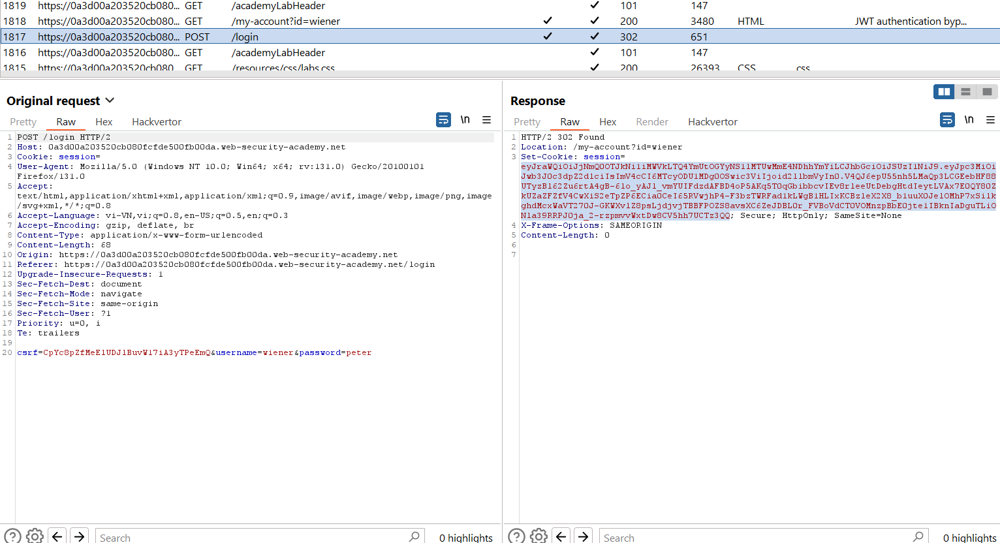

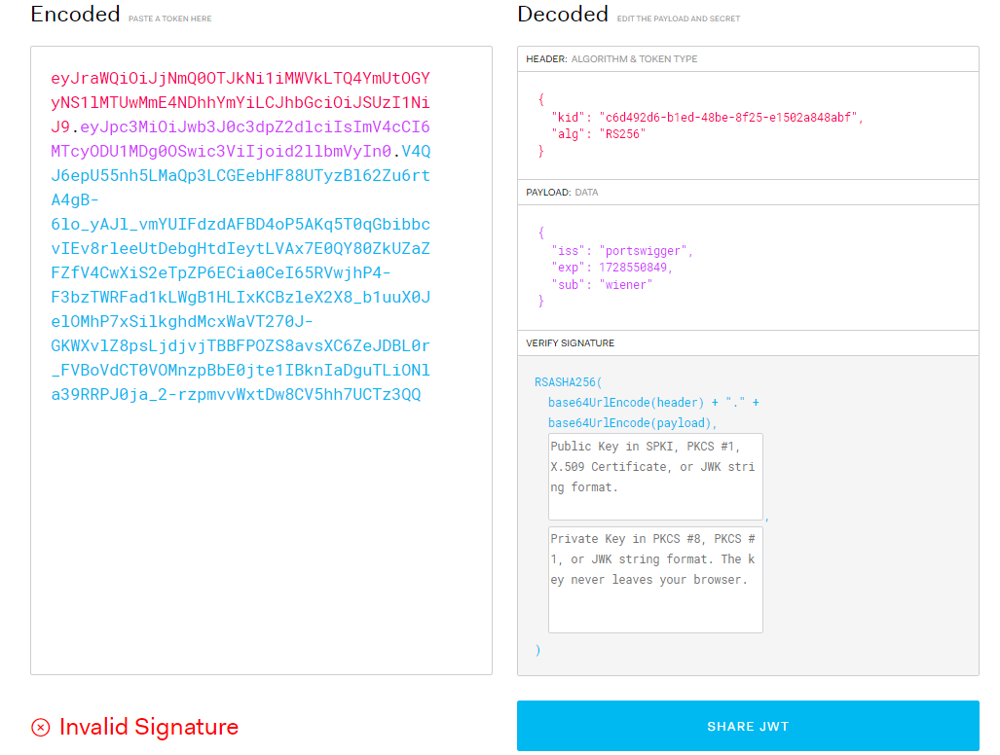

Context: Không kiểm tra phần chữ kí

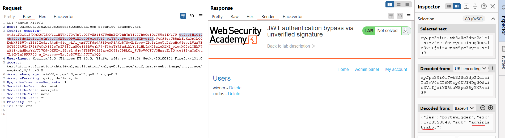

---

## 2. JWT authentication bypass via flawed signature verification
https://portswigger.net/web-security/jwt/lab-jwt-authentication-bypass-via-flawed-signature-verification

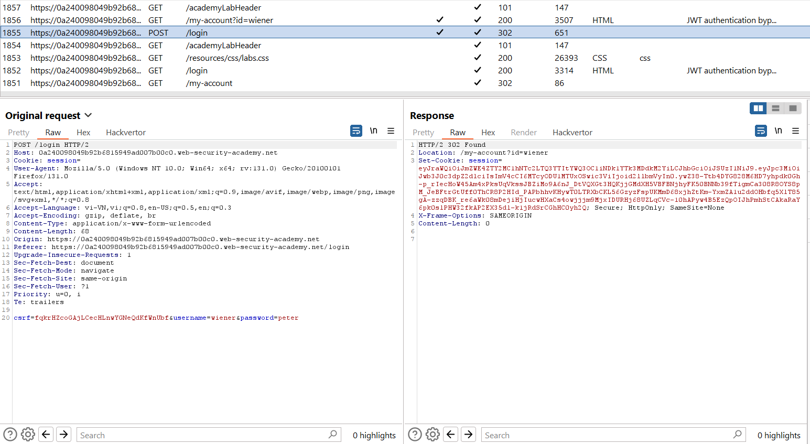

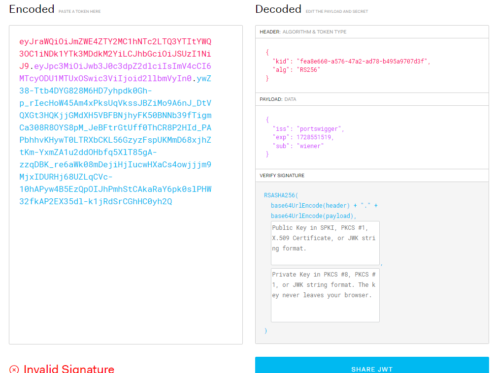

Thay đổi `alg` thành `none`:\
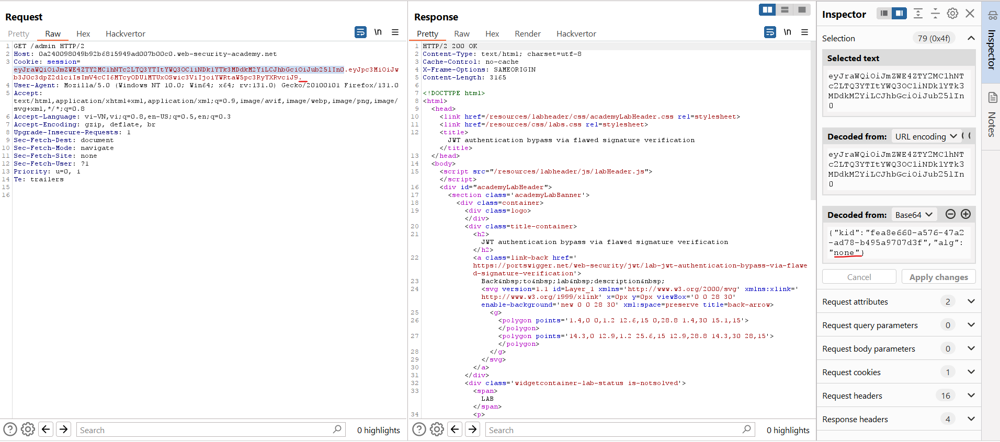

---

## 3. JWT authentication bypass via weak signing key
https://portswigger.net/web-security/jwt/lab-jwt-authentication-bypass-via-weak-signing-key

Context: Secret key dễ đoán 

Brute-force: `hashcat -a 0 -m 16500 <YOUR-JWT> /path/to/jwt.secrets.list`

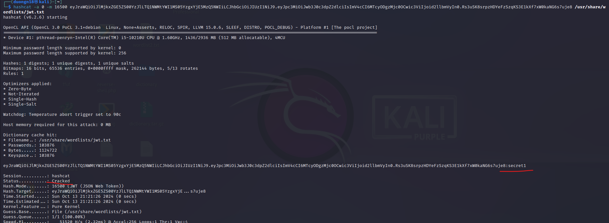


---
### JWT header 
JWT ngoài `alg` là tiêu đề bắt buộc thì còn có 1 số tiêu đề cần quan tâm như: 
- jwk (Khóa Web JSON) - Cung cấp một đối tượng JSON nhúng đại diện cho **khóa**.
- jku (URL Bộ Khóa Web JSON) - Cung cấp một **URL** từ đó máy chủ có thể lấy bộ khóa chứa khóa chính xác.
- kid (ID Khóa) - Cung cấp một ID mà các máy chủ có thể sử dụng để xác định khóa chính xác trong trường hợp có nhiều khóa để chọn. Tùy thuộc vào định dạng của khóa, tham số này có thể có một tham số kid tương ứng.

### Tiêm JWT (tự ký) qua tham số jwk
Đặc tả JSON Web Signature (JWS) mô tả một tham số tiêu đề jwk tùy chọn, mà các máy chủ có thể sử dụng để nhúng khóa công khai của họ trực tiếp vào trong mã thông báo dưới định dạng JWK.

Ví dụ: 
```json
{
    "kid": "ed2Nf8sb-sD6ng0-scs5390g-fFD8sfxG",
    "typ": "JWT",
    "alg": "RS256",
    "jwk": {
        "kty": "RSA",
        "e": "AQAB",
        "kid": "ed2Nf8sb-sD6ng0-scs5390g-fFD8sfxG",
        "n": "yy1wpYmffgXBxhAUJzHHocCuJolwDqql75ZWuCQ_cb33K2vh9m"
    }
}
```
Lý tưởng nhất, các máy chủ chỉ nên sử dụng một danh sách trắng giới hạn các khóa công khai để xác minh chữ ký JWT. Tuy nhiên, các máy chủ bị cấu hình sai đôi khi sử dụng bất kỳ khóa nào được nhúng trong tham số `jwk`

khai thác hành vi này bằng cách ký một JWT đã chỉnh sửa bằng khóa riêng RSA của bạn, sau đó nhúng khóa công khai tương ứng vào tiêu đề jwk

---

## 4. JWT authentication bypass via jwk header injection
https://portswigger.net/web-security/jwt/lab-jwt-authentication-bypass-via-jwk-header-injection

Sau khi đăng nhập thì thử truy cập vào `/admin` nhưng không cho phép do check JWT không hợp lệ.

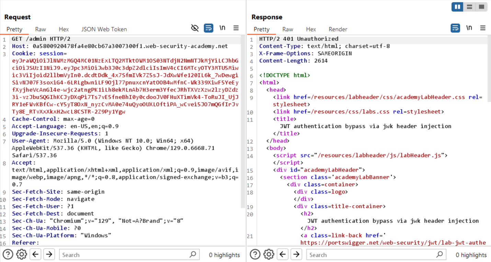

Vào `JWT editor` chọn `New RSA Key`: \
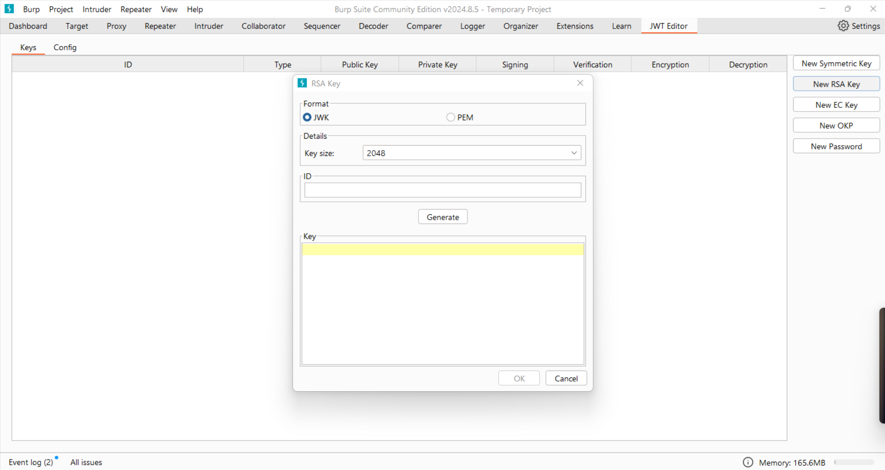

Chọn `Generate` sau đó chọn OK để save:
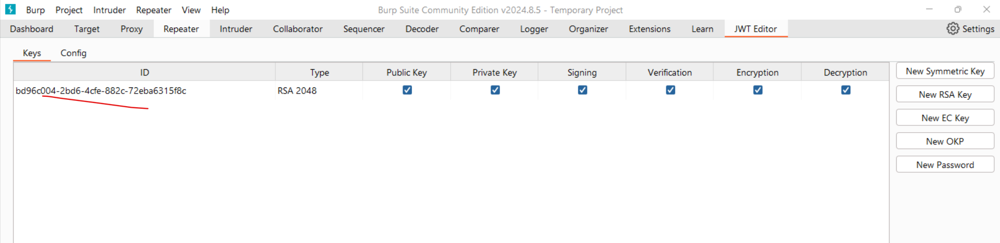

Vào lại Repeater và vào JSON Web Token tab:\
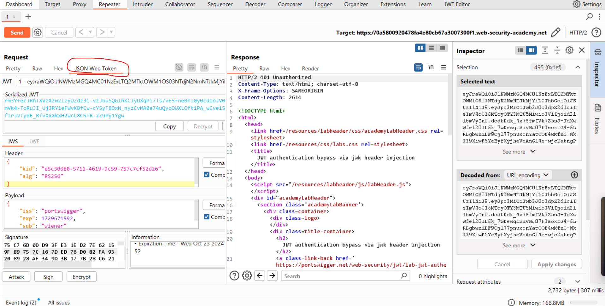

Sửa `sub` thành `administrator`:\


Chọn `Attack` và chọn `Embedded JWK` để thêm khóa vừa tạo:\
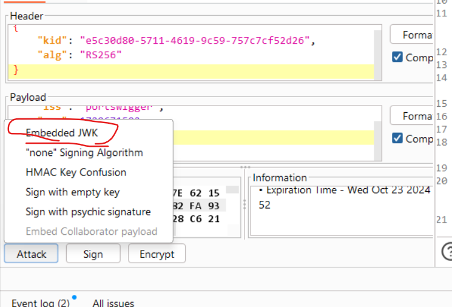

Chọn khóa vừa tạo và OK để nhúng vào JSON.

Send lại mã đã trả về 200OK:\
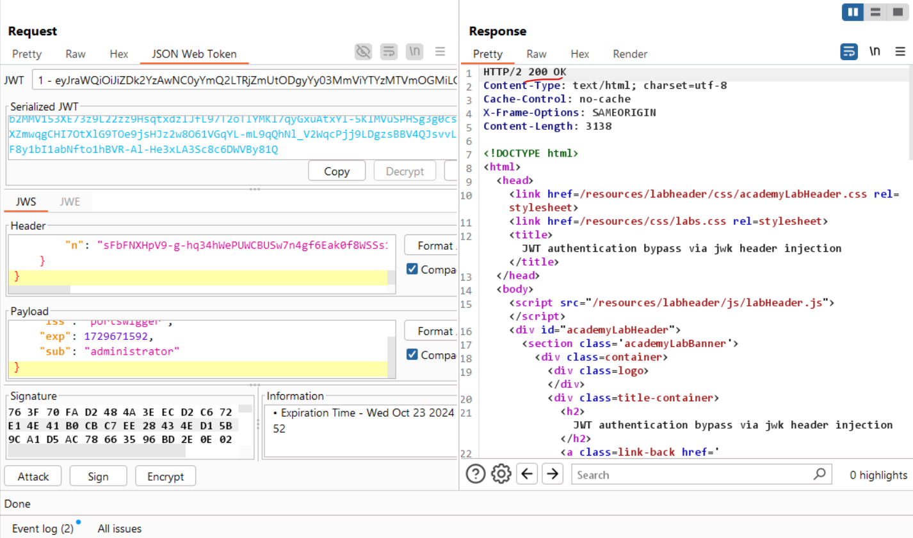

---

### Tiêm JWT tự ký thông qua tham số `jku`
Thay vì nhúng khóa công khai trực tiếp bằng cách sử dụng tham số tiêu đề `jwk`, một số máy chủ cho phép bạn sử dụng tham số tiêu đề jku (URL Bộ Khóa Web JSON) để tham chiếu một Bộ JWK chứa khóa. Khi xác minh chữ ký, máy chủ sẽ lấy khóa liên quan từ URL này.

Bộ JWK Một Bộ JWK là một đối tượng JSON chứa một mảng các JWK đại diện cho các khóa khác nhau. Dưới đây là một ví dụ:
```json
{
    "keys": [
        {
            "kty": "RSA",
            "e": "AQAB",
            "kid": "75d0ef47-af89-47a9-9061-7c02a610d5ab",
            "n": "o-yy1wpYmffgXBxhAUJzHHocCuJolwDqql75ZWuCQ_cb33K2vh9mk6GPM9gNN4Y_qTVX67WhsN3JvaFYw-fhvsWQ"
        },
        {
            "kty": "RSA",
            "e": "AQAB",
            "kid": "d8fDFo-fS9-faS14a9-ASf99sa-7c1Ad5abA",
            "n": "fc3f-yy1wpYmffgXBxhAUJzHql79gNNQ_cb33HocCuJolwDqmk6GPM4Y_qTVX67WhsN3JvaFYw-dfg6DH-asAScw"
        }
    ]
}
```
Các Bộ JWK như thế này đôi khi được công khai tại các endpoint chuẩn, ví dụ như `/.well-known/jwks.json`

---
## 5. JWT authentication bypass via jku header injection
https://portswigger.net/web-security/jwt/lab-jwt-authentication-bypass-via-jku-header-injection

Copy JWK (khóa công khai) vào body server exploit:\
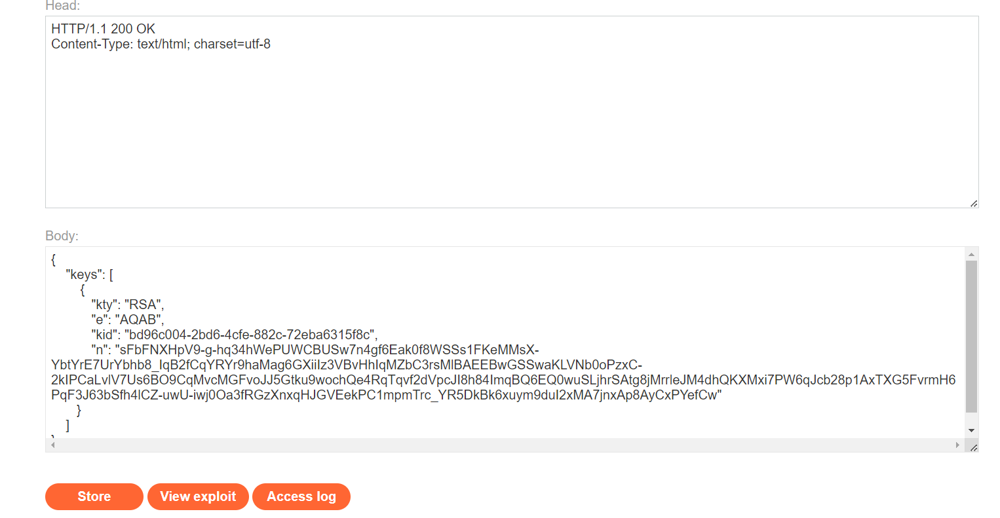

Thay đổi `kid` ở jwt bằng `kid` khóa vừa paste vào server exploit:\
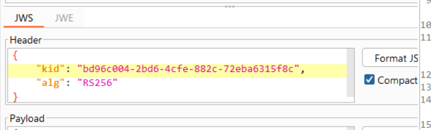

Thêm header `jku` trỏ đển URL có key:\
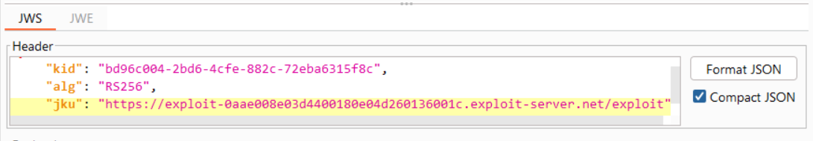

Thay `sub` bằng `administrator`

Chọn `Sign` và chọn khóa mà mình vừa tải về server exploit:\
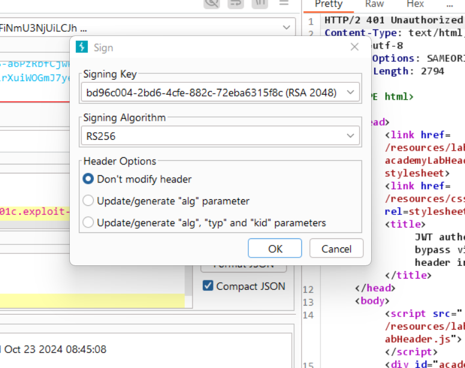

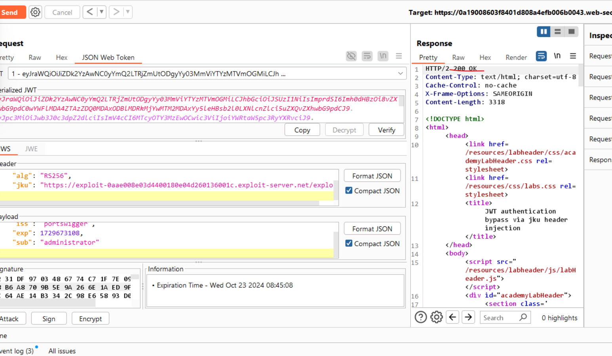

---
### Tiêm JWT (tự ký) thông qua tham số kid
Các máy chủ có thể sử dụng nhiều khóa mã hóa khác nhau để ký các loại dữ liệu khác nhau, không chỉ JWT. Vì lý do này, tiêu đề của JWT có thể chứa tham số `kid` (ID Khóa), giúp máy chủ xác định khóa nào để sử dụng khi xác minh chữ ký.

Các khóa xác minh thường được lưu trữ dưới dạng Bộ JWK. Trong trường hợp này, máy chủ có thể đơn giản tìm JWK với `kid` giống với mã thông báo. **Tuy nhiên, đặc tả JWS không định nghĩa cấu trúc cụ thể cho ID này** - nó chỉ là một chuỗi tùy ý mà nhà phát triển lựa chọn. Ví dụ, họ có thể sử dụng tham số `kid` để trỏ đến một **mục cụ thể** trong cơ sở dữ liệu, hoặc thậm chí là tên của **một tệp tin**.

Nếu tham số này dễ bị tấn công **directory traversal**, kẻ tấn công có thể buộc máy chủ sử dụng một tệp tin tùy ý từ hệ thống tệp của nó làm khóa xác minh.

Ví dụ: 
```json
{
    "kid": "../../path/to/file",
    "typ": "JWT",
    "alg": "HS256",
    "k": "asGsADas3421-dfh9DGN-AFDFDbasfd8-anfjkvc"
}
```
Điều này đặc biệt nguy hiểm nếu máy chủ cũng hỗ trợ JWT được ký bằng **thuật toán đối xứng**. Trong trường hợp này, kẻ tấn công có thể trỏ tham số `kid` đến một tệp tĩnh, có thể dự đoán, sau đó ký JWT bằng một khóa bí mật khớp với nội dung của tệp này.

Về mặt lý thuyết, bạn có thể thực hiện điều này với bất kỳ tệp tin nào, nhưng một trong những phương pháp đơn giản nhất là sử dụng `/dev/null`, có mặt trên hầu hết các hệ thống Linux. Vì đây là một tệp rỗng, việc đọc nó sẽ trả về một chuỗi trống. Do đó, việc ký mã thông báo với chuỗi trống sẽ tạo ra một chữ ký hợp lệ.

Ngoài ra, nếu máy chủ lưu trữ các khóa xác minh của nó trong cơ sở dữ liệu, tham số tiêu đề kid cũng là một vector tiềm năng cho các cuộc tấn công SQL injection.

---
## 6. JWT authentication bypass via kid header path traversal
https://portswigger.net/web-security/jwt/lab-jwt-authentication-bypass-via-kid-header-path-traversal

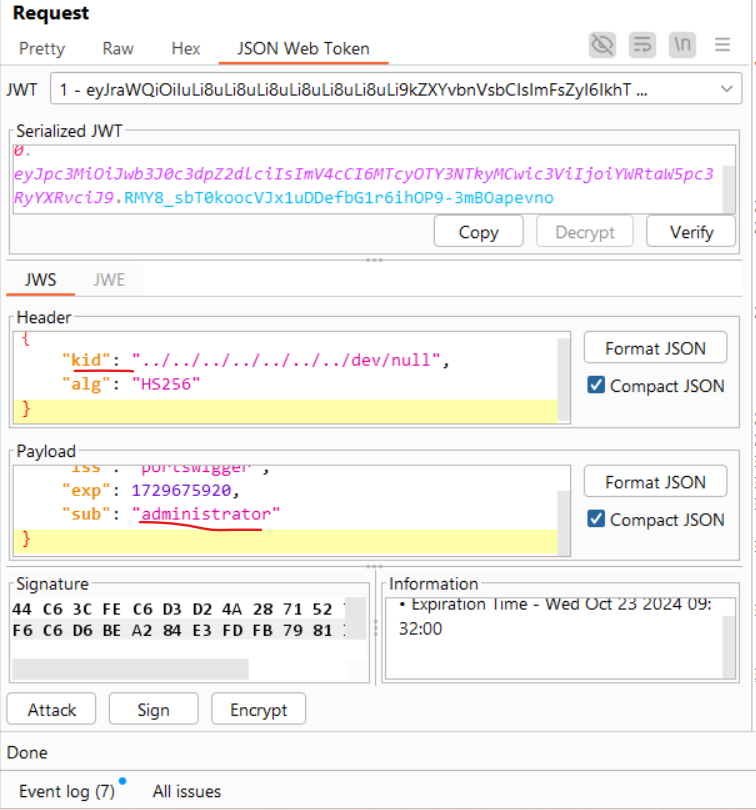

Chọn `Attack` chọn `sign with empty key` vì file `/dev/null` là 1 file rỗng

---

# JWT algorithm confusion


## How to prevent 
- Sử dụng thư viện JWT cập nhật và an toàn
- Xác minh chữ ký mạnh mẽ
- Hạn chế danh sách máy chủ được phép cho tiêu đề `jku`
- Bảo vệ chống tấn công xuyên thư mục và SQL injection qua tham số `kid`


