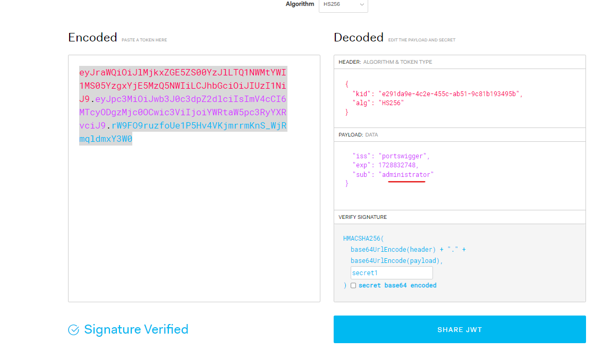

# JWT
## 1. JWT authentication bypass via unverified signature
https://portswigger.net/web-security/jwt/lab-jwt-authentication-bypass-via-unverified-signature

Context: Không kiểm tra phần chữ kí

---

## 2. JWT authentication bypass via flawed signature verification
https://portswigger.net/web-security/jwt/lab-jwt-authentication-bypass-via-flawed-signature-verification

Thay đổi `alg` thành `none`:\

---

## 3. JWT authentication bypass via weak signing key
https://portswigger.net/web-security/jwt/lab-jwt-authentication-bypass-via-weak-signing-key

Context: Secret key dễ đoán 

Brute-force: `hashcat -a 0 -m 16500 <YOUR-JWT> /path/to/jwt.secrets.list`

---

## 4. JWT authentication bypass via jwk header injection
https://portswigger.net/web-security/jwt/lab-jwt-authentication-bypass-via-jwk-header-injection

