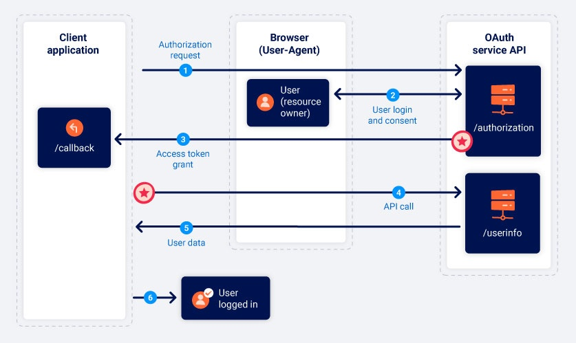

# OAuth grant types
Trong phần này, chúng tôi sẽ trình bày những điều cơ bản về hai loại cấp phép OAuth phổ biến nhất
# What is an OAuth grant type?
**OAuth grant type** là phương thức xác định trình tự các bước cụ thể trong quá trình OAuth.

Có một số grant types khác nhau, mỗi loại có mức độ phức tạp và yêu cầu bảo mật khác nhau. Chúng ta sẽ tập trung vào "**authorization code**" và "**implicit**" grant types, vì đây là hai loại phổ biến nhất.

# Authorization code grant type


## 1. Authorization request
Authorization request là bước đầu tiên trong quy trình cấp phép OAuth, trong đó ứng dụng khách gửi yêu cầu đến endpoint `/authorization` của dịch vụ OAuth, yêu cầu quyền truy cập vào dữ liệu người dùng. Endpoint có thể khác nhau tùy nhà cung cấp, nhưng thông thường bạn có thể nhận diện nó dựa trên các tham số được sử dụng trong yêu cầu.

Ví dụ: 
```http
GET /authorization?client_id=12345&redirect_uri=https://client-app.com/callback&response_type=code&scope=openid%20profile&state=ae13d489bd00e3c24 HTTP/1.1
Host: oauth-authorization-server.com
```
Yêu cầu này bao gồm các tham số quan trọng sau:

- **client_id**: Bắt buộc, chứa định danh duy nhất của ứng dụng khách, được tạo ra khi ứng dụng đăng ký với dịch vụ OAuth.
- **redirect_uri**: URI nơi trình duyệt của người dùng sẽ được chuyển hướng khi mã ủy quyền (authorization code) được gửi về cho ứng dụng khách. Đây cũng được gọi là "callback URI". Nhiều cuộc tấn công OAuth khai thác các lỗ hổng trong việc xác thực tham số này.
- **response_type**: Xác định loại phản hồi mà ứng dụng khách mong đợi, từ đó xác định quy trình nào sẽ được khởi tạo. Với loại cấp phép authorization code, giá trị phải là code.
- **scope**: Chỉ định phần dữ liệu nào của người dùng mà ứng dụng khách muốn truy cập. Các scope có thể là tùy chỉnh do nhà cung cấp OAuth quy định hoặc là các scope chuẩn hóa theo OpenID Connect.
- **state**: Lưu trữ một giá trị duy nhất và không thể đoán trước được, liên quan đến phiên làm việc hiện tại của ứng dụng khách. Dịch vụ OAuth phải trả lại giá trị này cùng với mã ủy quyền để đảm bảo rằng yêu cầu đến endpoint `/callback` là từ cùng một người đã khởi tạo quy trình OAuth. Điều này hoạt động như một token chống CSRF.

## 2. User login and consent
Khi máy chủ ủy quyền nhận được yêu cầu ban đầu, nó sẽ chuyển hướng người dùng đến một trang đăng nhập, nơi họ sẽ được yêu cầu đăng nhập vào tài khoản của mình với nhà cung cấp OAuth, chẳng hạn như tài khoản mạng xã hội.

Sau khi đăng nhập, người dùng sẽ được trình bày một danh sách dữ liệu mà ứng dụng khách muốn truy cập, dựa trên các scope đã được định nghĩa trong yêu cầu ủy quyền. Người dùng có thể chọn đồng ý hoặc không đồng ý với quyền truy cập này.

Điều quan trọng cần lưu ý là, một khi người dùng đã phê duyệt một scope nhất định cho một ứng dụng khách, bước này sẽ được hoàn tất tự động miễn là người dùng vẫn còn phiên làm việc hợp lệ với dịch vụ OAuth. Nói cách khác, lần đầu tiên người dùng chọn "Đăng nhập bằng tài khoản mạng xã hội", họ sẽ cần đăng nhập thủ công và cho phép quyền truy cập. Tuy nhiên, nếu họ quay lại ứng dụng khách sau đó, họ thường có thể đăng nhập lại chỉ với một cú nhấp chuột.
## 3. Authorization code grant - Cấp phép mã ủy quyền
Nếu người dùng đồng ý với quyền truy cập đã yêu cầu, trình duyệt của họ sẽ được chuyển hướng đến endpoint `/callback` đã được chỉ định trong tham số `redirect_uri` của yêu cầu ủy quyền. Yêu cầu GET kết quả sẽ chứa mã ủy quyền dưới dạng một tham số truy vấn. Tùy thuộc vào cấu hình, nó cũng có thể gửi tham số `state` với cùng giá trị như trong yêu cầu ủy quyền.

```http
GET /callback?code=a1b2c3d4e5f6g7h8&state=ae13d489bd00e3c24 HTTP/1.1
Host: client-app.com
```

## 4. Access token request
Khi ứng dụng khách nhận được `authorization code`, nó cần phải trao đổi mã này để nhận `access token`. Để làm điều này, nó gửi một yêu cầu POST từ máy chủ đến endpoint `/token` của dịch vụ OAuth. Tất cả các giao tiếp từ thời điểm này trở đi diễn ra trong một kênh an toàn và do đó, thường không thể bị quan sát hoặc kiểm soát bởi kẻ tấn công.

```http
POST /token HTTP/1.1
Host: oauth-authorization-server.com

client_id=12345&client_secret=SECRET&redirect_uri=https://client-app.com/callback&grant_type=authorization_code&code=a1b2c3d4e5f6g7h8
```
Ngoài `client_id` và `authorization code` bạn sẽ thấy các tham số mới sau:

- `client_secret`: Ứng dụng khách phải xác thực bản thân bằng cách bao gồm khóa bí mật mà nó được chỉ định khi đăng ký với dịch vụ OAuth.

- `grant_type`: Được sử dụng để đảm bảo endpoint mới biết loại ủy quyền mà ứng dụng khách muốn sử dụng. Trong trường hợp này, nó nên được đặt thành `authorization_code`.

## 5. Access token grant - Cấp phát mã truy cập
Dịch vụ OAuth sẽ xác thực yêu cầu mã truy cập. Nếu tất cả các thông tin là hợp lệ và khớp với yêu cầu, máy chủ sẽ phản hồi bằng cách cấp cho ứng dụng khách một mã truy cập với phạm vi (scope) đã được yêu cầu.

Phản hồi thường sẽ có dạng như sau:
```json
{
    "access_token": "z0y9x8w7v6u5",
    "token_type": "Bearer",
    "expires_in": 3600,
    "scope": "openid profile",
    …
}
```
## 6. API call
Khi ứng dụng khách đã có mã truy cập, nó có thể truy vấn dữ liệu của người dùng từ máy chủ tài nguyên. Để làm điều này, ứng dụng khách thực hiện một lời gọi API tới điểm cuối `/userinfo` của dịch vụ OAuth. Mã truy cập được gửi kèm trong phần tiêu đề `Authorization: Bearer` để chứng minh rằng ứng dụng khách có quyền truy cập vào dữ liệu này.

Ví dụ: 
```http
GET /userinfo HTTP/1.1
Host: oauth-resource-server.com
Authorization: Bearer z0y9x8w7v6u5
```
## 7. Resource grant
Máy chủ tài nguyên sẽ xác minh tính hợp lệ của mã truy cập và kiểm tra xem mã này có thuộc về ứng dụng khách hiện tại hay không. Nếu hợp lệ, máy chủ sẽ phản hồi bằng cách gửi tài nguyên đã yêu cầu, tức là dữ liệu người dùng, dựa trên phạm vi của mã truy cập.

Ví dụ: 
```json
{
    "username": "carlos",
    "email": "carlos@carlos-montoya.net",
    …
}
```
Ứng dụng khách cuối cùng có thể sử dụng dữ liệu này cho mục đích ban đầu. Trong trường hợp xác thực OAuth, dữ liệu thường được dùng làm ID để cấp cho người dùng một phiên đăng nhập đã xác thực, giúp họ đăng nhập thành công.
# Implicit grant type



## 1. Authorization request
Luồng implicit bắt đầu tương tự như luồng authorization code. Sự khác biệt chính là tham số `response_type` phải được đặt thành `token`.
```http
GET /authorization?client_id=12345&redirect_uri=https://client-app.com/callback&response_type=token&scope=openid%20profile&state=ae13d489bd00e3c24 HTTP/1.1
Host: oauth-authorization-server.com
```

## 2. User login and consent - Đăng nhập và cấp quyền của người dùng
Người dùng đăng nhập và quyết định có đồng ý với các quyền đã yêu cầu hay không. Quy trình này giống hệt như trong luồng authorization code.

## 3. Access token grant - Cấp phát access token
Nếu người dùng đồng ý với quyền truy cập, dịch vụ OAuth sẽ chuyển hướng trình duyệt của họ đến `redirect_uri` được chỉ định trong yêu cầu ủy quyền. Thay vì gửi mã ủy quyền, nó sẽ gửi `access token` và các thông tin khác dưới dạng fragment của URL.
```http
GET /callback#access_token=z0y9x8w7v6u5&token_type=Bearer&expires_in=5000&scope=openid%20profile&state=ae13d489bd00e3c24 HTTP/1.1
Host: client-app.com
```
Vì mã thông báo truy cập được gửi trong một đoạn URL, nó không bao giờ được gửi trực tiếp đến ứng dụng khách. Thay vào đó, ứng dụng khách phải sử dụng một tập lệnh phù hợp để trích xuất đoạn và lưu trữ nó
## 4. API call
Sau khi ứng dụng khách trích xuất thành công mã truy cập từ fragment URL, nó có thể sử dụng mã này để thực hiện các cuộc gọi API đến điểm `/userinfo` của dịch vụ OAuth. Không giống như luồng mã ủy quyền, điều này cũng diễn ra qua trình duyệt.
```http
GET /userinfo HTTP/1.1
Host: oauth-resource-server.com
Authorization: Bearer z0y9x8w7v6u5
```
## 5. Resource grant 
Máy chủ tài nguyên xác thực mã truy cập và nếu hợp lệ, sẽ gửi lại dữ liệu người dùng dựa trên phạm vi mã truy cập.
```json
{
    "username":"carlos",
    "email":"carlos@carlos-montoya.net"
}
```


