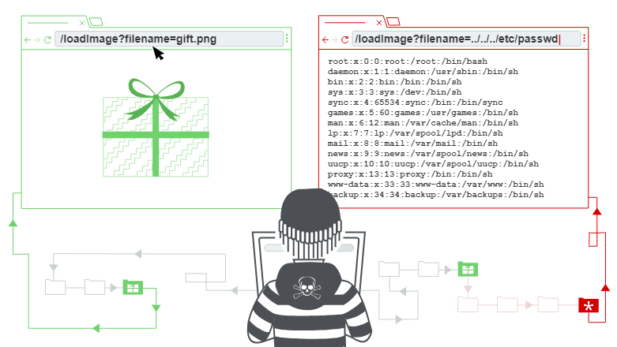
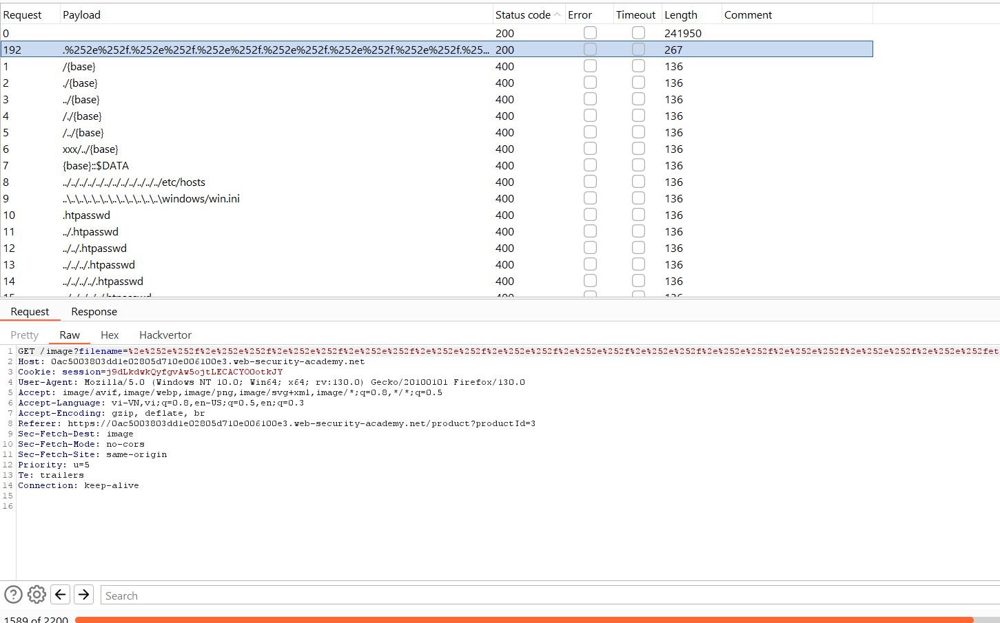
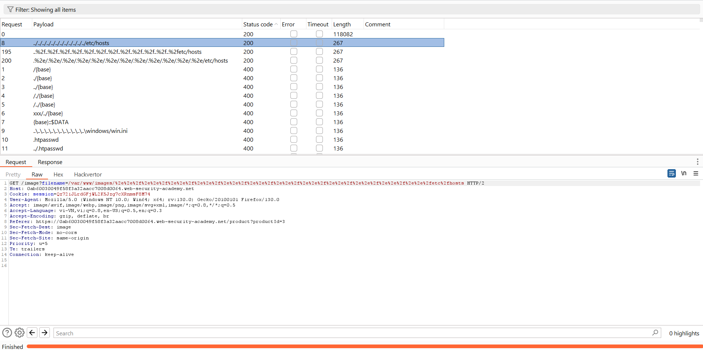
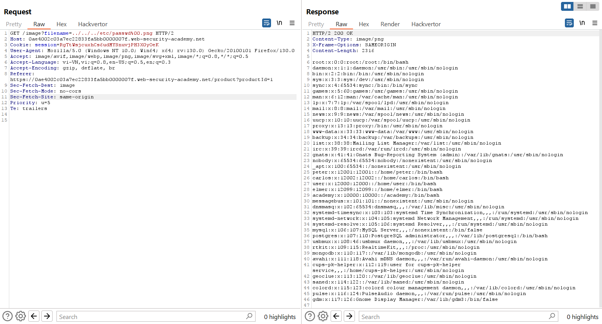

# Path traversal
Trong phần này, chúng tôi giải thích:
- Path traversal là gì
- Cách thực hiện các cuộc tấn công path traversal và vượt qua các chướng ngại vật thông thường.
- cách ngăn ngừa path traversal vulnerabilities.


## What is path traversal?
Path traversal còn được gọi là truyền tải thư mục. Những lỗ hổng này cho phép kẻ tấn công đọc các tệp tùy ý trên máy chủ đang chạy ứng dụng. Điều này có thể bao gồm:
- Application code and data.
- Credentials for back-end systems.
- Các tập tin hệ điều hành nhạy cảm.

Trong một số trường hợp, kẻ tấn công có thể ghi vào các tệp tùy ý trên máy chủ, cho phép chúng sửa đổi dữ liệu hoặc hành vi của ứng dụng và cuối cùng chiếm toàn quyền kiểm soát máy chủ.

## Đọc các tập tin tùy ý thông qua truyền tải đường dẫn
Hãy tưởng tượng một ứng dụng mua sắm hiển thị hình ảnh các mặt hàng được rao bán. Điều này có thể tải hình ảnh bằng HTML sau:\
``\
URL `loadImage` lấy tham số `filename` và trả về nội dung của tệp được chỉ định. Các tập tin hình ảnh được lưu trữ trên đĩa ở vị trí `/var/www/images/`. Để trả về một hình ảnh, ứng dụng sẽ thêm tên tệp được yêu cầu vào thư mục cơ sở này và sử dụng API hệ thống tệp để đọc nội dung của tệp. Nói cách khác, ứng dụng đọc từ đường dẫn tệp sau:\
`/var/www/images/218.png`\
Ứng dụng này không thực hiện biện pháp phòng vệ nào trước các cuộc tấn công truyền tải đường dẫn. Do đó, kẻ tấn công có thể yêu cầu URL sau để truy xuất tệp `/etc/passwd` từ hệ thống tệp của máy chủ:\
`https://insecure-website.com/loadImage?filename=../../../etc/passwd`\
Điều này khiến ứng dụng đọc từ đường dẫn tệp sau:\
`/var/www/images/../../../etc/passwd`\
Chuỗi `../` hợp lệ trong đường dẫn tệp và có nghĩa là tăng lên một cấp trong cấu trúc thư mục. Ba chuỗi `../` liên tiếp tăng dần từ `/var/www/images/` đến thư mục gốc của hệ thống tệp và do đó, tệp thực sự được đọc là: `/etc/passwd`\
Trên các hệ điều hành dựa trên Unix, đây là tệp tiêu chuẩn chứa thông tin chi tiết về người dùng đã đăng ký trên máy chủ, nhưng kẻ tấn công có thể truy xuất các tệp tùy ý khác bằng kỹ thuật tương tự.\
Trên Windows, cả `../` và `..\` đều là các chuỗi truyền tải thư mục hợp lệ. Sau đây là ví dụ về một cuộc tấn công tương đương nhằm vào máy chủ chạy Windows:\
`https://insecure-website.com/loadImage?filename=..\..\..\windows\win.ini`

Ví dụ: https://portswigger.net/web-security/file-path-traversal/lab-simple

Bài này cần vào burp suite để có thể xem các request image đi kèm request chính, và chèn payload vào request này!

## Những trở ngại chung khi khai thác các lỗ hổng path traversal
Nhiều ứng dụng đặt đầu vào của người dùng vào đường dẫn tệp sẽ triển khai các biện pháp bảo vệ chống lại các cuộc tấn công path traversal. Những điều này thường có thể được bỏ qua.\
Nếu một ứng dụng loại bỏ hoặc chặn các chuỗi truyền tải (`../`) thư mục khỏi tên tệp do người dùng cung cấp, thì ứng dụng đó có thể vượt qua hệ thống phòng thủ bằng nhiều kỹ thuật khác nhau.\
Bạn có thể sử dụng **đường dẫn tuyệt đối** từ thư mục gốc của hệ thống tệp, chẳng hạn như `filename=/etc/passwd`, để tham chiếu trực tiếp đến tệp mà không cần sử dụng bất kỳ `../` nào.

Ví dụ: https://portswigger.net/web-security/file-path-traversal/lab-absolute-path-bypass

Bạn có thể sử dụng các chuỗi truyền tải lồng nhau, chẳng hạn như `....//` hoặc `....\/`. Chúng trở lại các trình tự truyền tải đơn giản khi trình tự bên trong bị loại bỏ.

Ví dụ: https://portswigger.net/web-security/file-path-traversal/lab-sequences-stripped-non-recursively

Trong một số ngữ cảnh, chẳng hạn như trong đường dẫn URL hoặc tham số tên tệp của yêu cầu nhiều phần/dữ liệu biểu mẫu, máy chủ web có thể loại bỏ mọi `../` trước khi chuyển dữ liệu đầu vào của bạn đến ứng dụng. Đôi khi, bạn có thể bỏ qua kiểu dọn dẹp này bằng cách mã hóa URL hoặc thậm chí mã hóa URL kép, các ký tự `../.` Điều này dẫn đến `%2e%2e%2f` và `%252e%252e%252f` tương ứng. Các mã hóa không chuẩn khác nhau, chẳng hạn như `..%c0%af` hoặc `..%ef%bc%8f`, cũng có thể hoạt động.

Ví dụ: https://portswigger.net/web-security/file-path-traversal/lab-superfluous-url-decode

Payload: `%252e%252e%252f%252e%252e%252f%252e%252e%252fetc%2fpasswd`

Đưa vào intruder và add payload fuzz path traversal: 


Một ứng dụng có thể yêu cầu tên tệp do người dùng cung cấp để bắt đầu bằng thư mục cơ sở dự kiến, chẳng hạn như `/var/www/images`. Trong trường hợp này, có thể bao gồm thư mục cơ sở cần thiết theo sau là các trình tự duyệt phù hợp. Ví dụ: filename=`/var/www/images/../../../etc/passwd`.

Position: `/image?filename=/var/www/images/§6.jpg§`


Ứng dụng có thể yêu cầu tên tệp do người dùng cung cấp phải **kết thúc bằng phần mở rộng tệp dự kiến**, chẳng hạn như `.png`. Trong trường hợp này, có thể sử dụng `null byte` để chấm dứt hiệu quả đường dẫn tệp trước phần mở rộng được yêu cầu. Ví dụ: `filename=../../../etc/passwd%00.png`.

Ví dụ: https://portswigger.net/web-security/file-path-traversal/lab-validate-file-extension-null-byte-bypass

Payload: `../../../etc/passwd%00.png`


## How to prevent a path traversal attack
Cách hiệu quả nhất để ngăn chặn các lỗ hổng truyền tải đường dẫn là tránh chuyển hoàn toàn dữ liệu đầu vào do người dùng cung cấp tới API hệ thống tệp. Nhiều chức năng ứng dụng thực hiện việc này có thể được viết lại để cung cấp hành vi tương tự theo cách an toàn hơn.\
Nếu bạn không thể tránh chuyển đầu vào do người dùng cung cấp tới API hệ thống tệp, chúng tôi khuyên bạn nên sử dụng hai lớp bảo vệ để ngăn chặn các cuộc tấn công:
- Xác thực đầu vào của người dùng trước khi xử lý nó. Lý tưởng nhất là so sánh thông tin đầu vào của người dùng với **danh sách trắng** các giá trị được phép. Nếu không thể, hãy xác minh rằng dữ liệu đầu vào chỉ chứa nội dung được phép, chẳng hạn như chỉ các ký tự chữ và số.
- Sau khi xác thực đầu vào được cung cấp, hãy thêm đầu vào vào thư mục cơ sở và sử dụng API hệ thống tệp nền tảng để **chuẩn hóa đường dẫn**. Xác minh rằng đường dẫn chuẩn hóa bắt đầu bằng thư mục cơ sở dự kiến.

Dưới đây là ví dụ về một số mã Java đơn giản để xác thực đường dẫn chuẩn của tệp dựa trên đầu vào của người dùng:
```
File file = new File(BASE_DIRECTORY, userInput);
if (file.getCanonicalPath().startsWith(BASE_DIRECTORY)) {
    // process file
}
```


