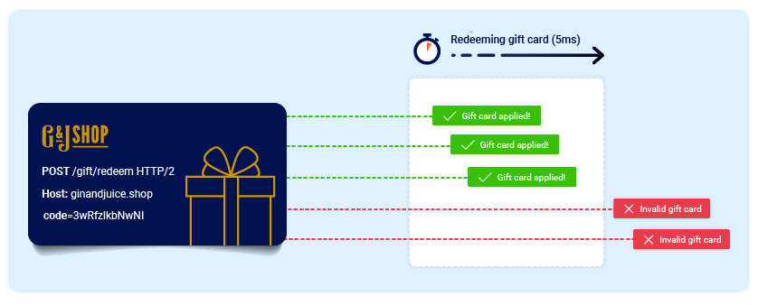
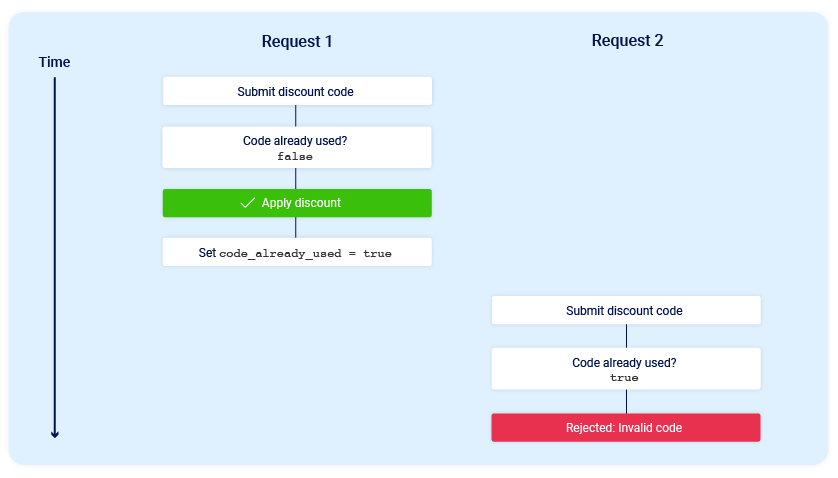
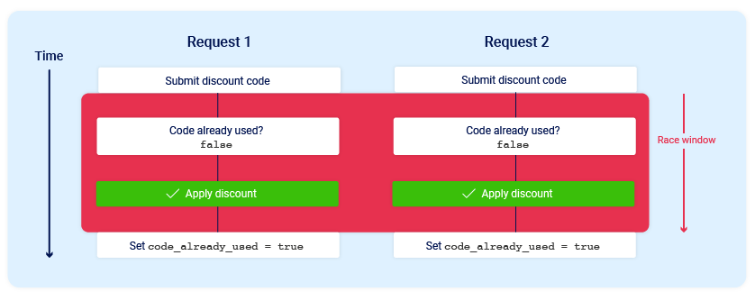
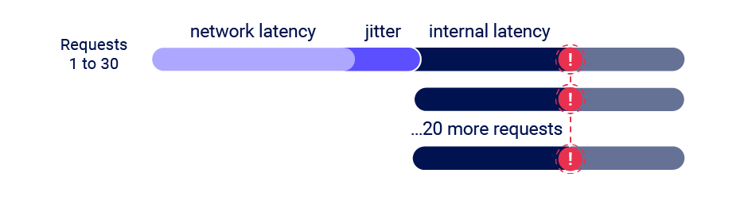
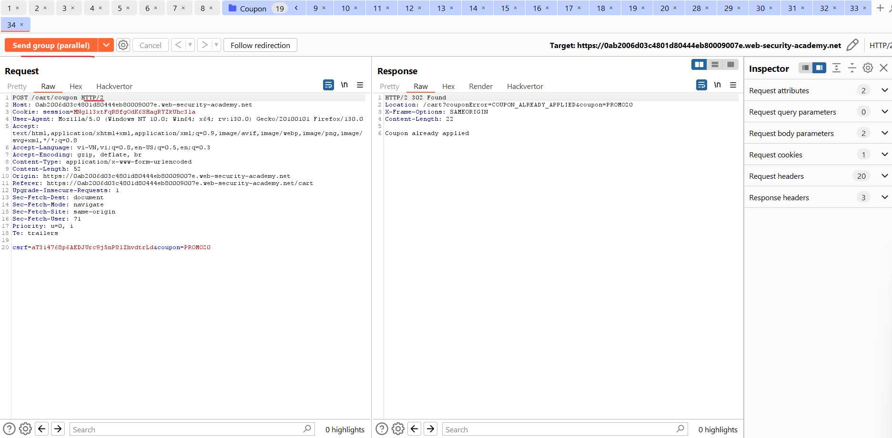
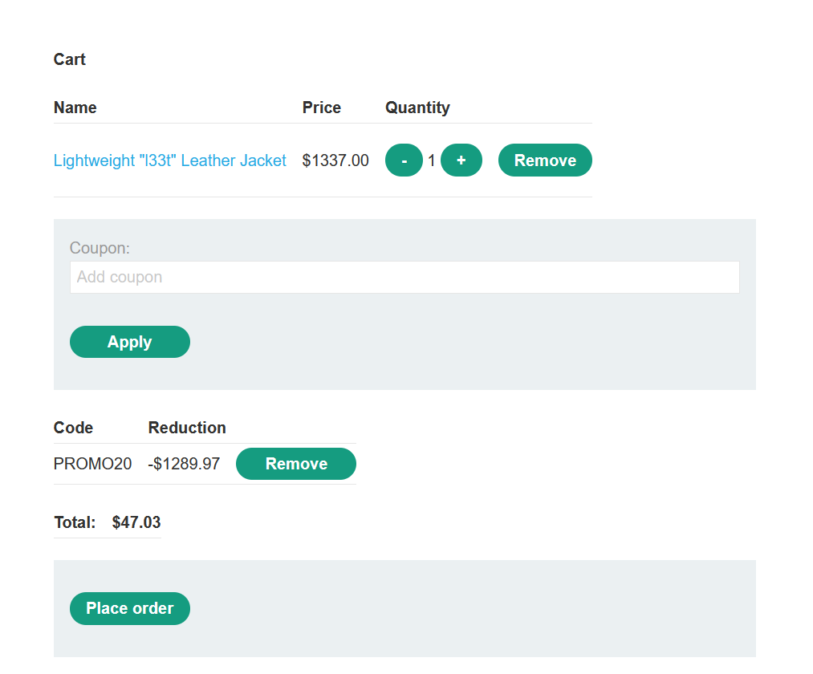
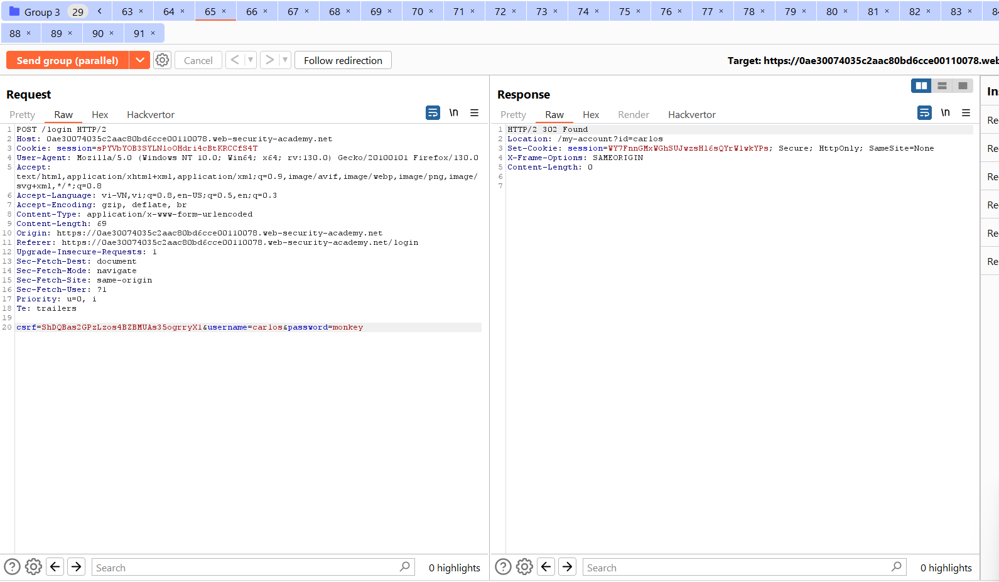

# Race conditions
Race condition là một loại lỗ hổng phổ biến có liên quan chặt chẽ đến các lỗi logic nghiệp vụ. Chúng xảy ra khi các trang web **xử lý nhiều yêu cầu đồng thời** mà không có biện pháp bảo vệ thích hợp. Điều này có thể dẫn đến nhiều luồng riêng biệt tương tác với cùng một dữ liệu cùng một lúc, dẫn đến "collision" gây ra hành vi ngoài ý muốn trong ứng dụng. Cuộc tấn công theo race condition sử dụng các yêu cầu được tính thời gian cẩn thận để gây ra xung đột có chủ ý và khai thác hành vi ngoài ý muốn này cho mục đích xấu.\
\
Khoảng thời gian có thể xảy ra va chạm được gọi là "race window". Ví dụ: đây có thể là một phần giây giữa hai lần tương tác với cơ sở dữ liệu.\
Giống như các lỗi logic khác, tác động của tình trạng tương tranh phụ thuộc rất nhiều vào ứng dụng và chức năng cụ thể mà nó xảy ra.\
Trong phần này, bạn sẽ tìm hiểu cách xác định và khai thác các loại race condition. Chúng tôi sẽ hướng dẫn bạn cách công cụ tích hợp của Burp Suite có thể giúp bạn vượt qua những thách thức khi thực hiện các cuộc tấn công cổ điển, cùng với phương pháp đã được thử nghiệm và kiểm tra cho phép bạn phát hiện các loại race condition mới trong các quy trình nhiều bước ẩn. Những điều này vượt xa giới hạn vượt quá giới hạn mà bạn có thể đã quen thuộc.
## Limit overrun race conditions
Loại race condition phổ biến nhất cho phép bạn vượt quá một số loại giới hạn do logic nghiệp vụ của ứng dụng áp đặt.\
Ví dụ: hãy xem xét một cửa hàng trực tuyến cho phép bạn nhập mã khuyến mại khi thanh toán để được giảm giá một lần cho đơn hàng của bạn. Để áp dụng giảm giá này, ứng dụng có thể thực hiện các bước sau:
1. Kiểm tra xem bạn chưa sử dụng mã này chưa.
2. Áp dụng chiết khấu cho tổng đơn hàng.
3. Cập nhật bản ghi trong cơ sở dữ liệu để phản ánh thực tế là bạn hiện đã sử dụng mã này.

Nếu sau này bạn cố gắng sử dụng lại mã này thì các bước kiểm tra ban đầu được thực hiện khi bắt đầu quá trình sẽ ngăn bạn thực hiện việc này:\
\
Bây giờ hãy xem xét điều gì sẽ xảy ra nếu người dùng chưa bao giờ áp dụng mã giảm giá này cố gắng áp dụng nó hai lần gần như cùng một lúc:\

Như bạn có thể thấy, ứng dụng chuyển tiếp qua trạng thái phụ tạm thời; nghĩa là trạng thái nó đi vào và sau đó thoát ra lần nữa trước khi quá trình xử lý yêu cầu hoàn tất. Trong trường hợp này, trạng thái phụ bắt đầu khi máy chủ bắt đầu xử lý yêu cầu đầu tiên và kết thúc khi cập nhật cơ sở dữ liệu để cho biết rằng bạn đã sử dụng mã này. Điều này mở ra một khoảng thời gian race nhỏ trong đó bạn có thể liên tục yêu cầu giảm giá bao nhiêu lần tùy thích.\
Có nhiều biến thể của kiểu tấn công này, bao gồm:
- Đổi thẻ quà tặng nhiều lần
- Đánh giá một sản phẩm nhiều lần
- Rút hoặc chuyển tiền mặt vượt quá số dư tài khoản của bạn
- Sử dụng lại một CAPTCHA
- Bỏ qua giới hạn tốc độ brute-force

**Vượt quá giới hạn** là một loại lỗi phụ của cái gọi là lỗi "thời gian kiểm tra đến thời điểm sử dụng" (time-of-check to time-of-use -- TOCTOU). Ở phần sau của chủ đề này, chúng ta sẽ xem xét một số ví dụ về các lỗ hổng race condition không thuộc một trong hai loại này.

### Phát hiện và khai thác các điều kiện vượt quá giới hạn với Burp Repeater
Quá trình phát hiện và khai thác các điều kiện vượt quá giới hạn tương đối đơn giản. Ở cấp độ cao, tất cả những gì bạn cần làm là:
- Xác định điểm cuối sử dụng một lần hoặc điểm cuối rate-limit có một số loại tác động bảo mật hoặc mục đích hữu ích khác.
- Đưa ra nhiều yêu cầu liên tiếp tới điểm cuối này để xem liệu bạn có thể vượt quá limit này hay không.

Thử thách chính là tính thời gian thực hiện các yêu cầu sao cho có ít nhất hai race window thẳng hàng, gây ra xung đột. Cửa sổ này thường chỉ có mili giây và thậm chí có thể ngắn hơn.\
Ngay cả khi bạn gửi tất cả các yêu cầu cùng một lúc, trên thực tế, có nhiều yếu tố bên ngoài không thể kiểm soát và không thể đoán trước khác nhau ảnh hưởng đến thời điểm máy chủ xử lý từng yêu cầu và theo thứ tự nào.\
\
Burp Suite 2023.9 ​​bổ sung các khả năng mới mạnh mẽ cho `Burp Repeater` cho phép bạn dễ dàng gửi một nhóm yêu cầu song song theo cách giúp giảm đáng kể tác động của một trong những yếu tố này, cụ thể là hiện tượng giật mạng. Burp tự động điều chỉnh kỹ thuật mà nó sử dụng cho phù hợp với phiên bản HTTP được máy chủ hỗ trợ:
- Đối với HTTP/1, nó sử dụng kỹ thuật đồng bộ hóa byte cuối cùng cổ điển.
- Đối với HTTP/2, nó sử dụng kỹ thuật tấn công một gói, lần đầu tiên được PortSwigger Research trình diễn tại Black Hat USA 2023.

Cuộc tấn công gói đơn cho phép bạn vô hiệu hóa hoàn toàn nhiễu từ hiện tượng giật mạng bằng cách sử dụng một gói TCP duy nhất để hoàn thành đồng thời 20-30 yêu cầu.\
\
Mặc dù bạn thường có thể chỉ sử dụng hai yêu cầu để kích hoạt hoạt động khai thác, nhưng việc gửi một số lượng lớn yêu cầu như thế này sẽ giúp giảm thiểu độ trễ nội bộ, còn được gọi là jitter phía máy chủ. Điều này đặc biệt hữu ích trong giai đoạn khám phá ban đầu. Chúng tôi sẽ đề cập đến phương pháp này chi tiết hơn.

Ví dụ: https://portswigger.net/web-security/race-conditions/lab-race-conditions-limit-overrun

Ở bài này ta sẽ gửi nhiều request coupon cùng 1 thời điểm, ta sẽ nhóm các request giống nhau lại thành 1 group và request cả group đó, do đây là HTTP2 nên ta dùng chế độ `parallel`:\
\


### Phát hiện và khai thác tình trạng vượt giới hạn với Turbo Intruder
Ngoài việc cung cấp hỗ trợ riêng cho cuộc tấn công gói đơn trong Burp Repeater, chúng tôi cũng đã cải tiến tiện ích mở rộng Turbo Intruder để hỗ trợ kỹ thuật này. Bạn có thể tải xuống phiên bản mới nhất từ ​​BApp Store.\
Turbo Intruder yêu cầu trình độ thông thạo Python nhưng phù hợp với các cuộc tấn công phức tạp hơn, chẳng hạn như các cuộc tấn công yêu cầu thử lại nhiều lần, thời gian yêu cầu so le hoặc số lượng yêu cầu cực lớn.\
Để sử dụng cuộc tấn công gói đơn trong Turbo Intruder:
- Đảm bảo rằng mục tiêu hỗ trợ HTTP/2. Cuộc tấn công gói đơn không tương thích với HTTP/1.
- Đặt tùy chọn cấu hình `engine=Engine.BURP2` và `concurrentConnections=1` cho công cụ yêu cầu.
- Khi xếp hàng các yêu cầu của bạn, hãy nhóm chúng bằng cách gán chúng cho một cổng được đặt tên bằng cách sử dụng đối số cổng cho phương thức `engine.queue()`.
- Để gửi tất cả các yêu cầu trong một nhóm nhất định, hãy mở cổng tương ứng bằng phương thức `engine.openGate()`.
```python
def queueRequests(target, wordlists):
    engine = RequestEngine(endpoint=target.endpoint,
                            concurrentConnections=1,
                            engine=Engine.BURP2
                            )
    
    # queue 20 requests in gate '1'
    for i in range(20):
        engine.queue(target.req, gate='1')
    
    # send all requests in gate '1' in parallel
    engine.openGate('1')
```
Để biết thêm chi tiết, hãy xem mẫu `race-single-packet-Attack.py` được cung cấp trong thư mục ví dụ mặc định của Turbo Intruder.

Ví dụ: https://portswigger.net/web-security/race-conditions/lab-race-conditions-bypassing-rate-limits

Cách 1 làm theo bài trước, password phải thay bằng cơm, sau đó tìm phản hồi 302 bằng cơm:\


Cách 2 dùng Turbo Intruder:\


