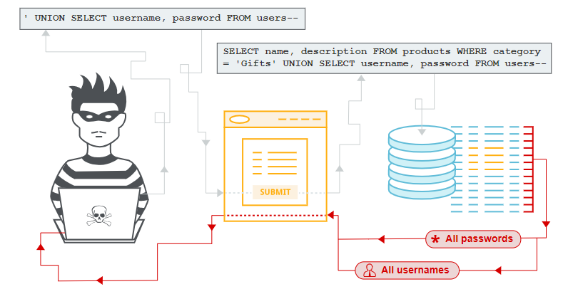

Link: https://portswigger.net/web-security/sql-injection

# SQL INJECTION
Trong post này chúng ta sẽ tìm hiểu: 
- SQL injection là gì? (SQLi)
- Cách tìm và khai thác các loại lỗ hổng SQLi khác nhau
- Cách ngăn chặn SQLi

## SQL injection là gì? (SQLi)
SQL injection (SQLi) là một lỗ hổng bảo mật web cho phép kẻ tấn công can thiệp vào các truy vấn mà ứng dụng thực hiện đối với cơ sở dữ liệu của nó. Điều này có thể cho phép kẻ tấn công xem dữ liệu mà thông thường chúng không thể truy xuất được. Điều này có thể bao gồm dữ liệu thuộc về người dùng khác hoặc bất kỳ dữ liệu nào khác mà ứng dụng có thể truy cập. Trong nhiều trường hợp, kẻ tấn công có thể sửa đổi hoặc xóa dữ liệu này, gây ra những thay đổi liên tục đối với nội dung hoặc hành vi của ứng dụng.
Trong một số trường hợp, kẻ tấn công có thể nâng cấp cuộc tấn công SQL SQL để xâm phạm máy chủ cơ bản hoặc cơ sở hạ tầng phụ trợ khác. Nó cũng có thể cho phép họ thực hiện các cuộc tấn công từ chối dịch vụ.

## Tác động của một cuộc tấn công tiêm nhiễm SQL thành công là gì?

Một cuộc tấn công SQLi thành công có thể dẫn đến truy cập trái phép vào dữ liệu nhạy cảm, chẳng hạn như:
- Passwords
- Chi tiết credit card
- Thông tin cá nhân của người dùng

## Cách phát hiện lỗ hổng SQLi

Bạn có thể phát hiện SQLi theo cách thủ công bằng cách sử dụng một bộ thử nghiệm có hệ thống đối với mọi input trong ứng dụng. Để làm điều này, bạn thường sẽ submit:

- Ký tự trích dẫn đơn `'` và tìm kiếm lỗi hoặc các điểm bất thường khác.

- Một số cú pháp dành riêng cho SQL đánh giá giá trị cơ sở (gốc) của điểm nhập và một số thông tin khác, đồng thời tìm kiếm sự khác biệt mang tính hệ thống trong các phản hồi của ứng dụng.

- Các điều kiện Boolean như OR 1=1 và OR 1=2, đồng thời tìm kiếm sự khác biệt trong phản hồi của ứng dụng.
- Tải trọng được thiết kế để kích hoạt độ trễ thời gian khi được thực thi trong truy vấn SQL và tìm kiếm sự khác biệt về thời gian cần thiết để phản hồi.
- Tải trọng OAST được thiết kế để kích hoạt tương tác mạng ngoài băng tần khi được thực thi trong truy vấn SQL và giám sát mọi tương tác phát sinh.

Ngoài ra, bạn có thể tìm thấy phần lớn các lỗ hổng SQL SQL một cách nhanh chóng và đáng tin cậy bằng cách sử dụng Burp Scanner.

## Inject SQL vào các phần khác nhau của truy vấn
Hầu hết các lỗ hổng SQL xảy ra trong mệnh đề `WHERE` của truy vấn `SELECT`. Hầu hết những người thử nghiệm có kinh nghiệm đều quen thuộc với kiểu chèn SQL này.\
Tuy nhiên, lỗ hổng chèn SQL có thể xảy ra ở bất kỳ vị trí nào trong truy vấn và trong các loại truy vấn khác nhau. Một số vị trí phổ biến khác phát sinh việc tiêm SQL là:
- Trong câu lệnh `UPDATE`, trong các giá trị được cập nhật hoặc mệnh đề `WHERE`.
- Trong câu lệnh `INSERT`, bên trong các giá trị được chèn.
- Trong câu lệnh `SELECT`, trong tên bảng hoặc cột.
- Trong câu lệnh `SELECT`, trong mệnh đề `ORDER BY`.
## SQL injection examples
Có rất nhiều lỗ hổng, cuộc tấn công và kỹ thuật SQLi xảy ra trong các tình huống khác nhau. Một số ví dụ về SQLi phổ biến bao gồm:
- Truy xuất dữ liệu ẩn, nơi bạn có thể sửa đổi truy vấn SQL để trả về kết quả bổ sung.
- Phá vỡ logic ứng dụng, trong đó bạn có thể thay đổi một truy vấn để can thiệp vào logic của ứng dụng.
- Các cuộc tấn công UNION, nơi bạn có thể truy xuất dữ liệu từ các bảng cơ sở dữ liệu khác nhau.
- Blind SQLi, trong đó kết quả của truy vấn bạn kiểm soát không được trả về trong phản hồi của ứng dụng.

## Retrieving hidden data
Hãy tưởng tượng một ứng dụng mua sắm hiển thị các sản phẩm theo các danh mục khác nhau. Khi người dùng nhấp vào danh mục Gifts, trình duyệt của họ sẽ yêu cầu URL:\
`https://insecure-website.com/products?category=Gifts`\
Điều này khiến ứng dụng tạo truy vấn SQL để truy xuất thông tin chi tiết về các sản phẩm có liên quan từ cơ sở dữ liệu:\
`SELECT * FROM products WHERE category = 'Gifts' AND released = 1`\
Truy vấn SQL này yêu cầu cơ sở dữ liệu trả về:
- all details (*)
- from the `products` table
- where the `category` is `Gifts`
- and `released` is `1`.

Hạn chế `released = 1` đang được sử dụng để ẩn các sản phẩm chưa được phát hành. Chúng ta có thể giả sử đối với các sản phẩm chưa được phát hành, `released = 0`\
Ứng dụng không triển khai bất kỳ biện pháp phòng vệ nào trước các cuộc tấn công tiêm nhiễm SQL. Điều này có nghĩa là kẻ tấn công có thể xây dựng cuộc tấn công sau, ví dụ:\
`https://insecure-website.com/products?category=Gifts'--`\
Điều này dẫn đến truy vấn SQL:\
`SELECT * FROM products WHERE category = 'Gifts'--' AND released = 1`\
Điều quan trọng cần lưu ý rằng `--` là một comment trong SQL. Điều này có nghĩa là phần còn lại của truy vấn được hiểu là một comment, loại bỏ nó một cách hiệu quả. Trong ví dụ này, điều này có nghĩa là truy vấn không còn bao gồm `AND released = 1`. Kết quả là tất cả các sản phẩm đều được hiển thị, bao gồm cả những sản phẩm chưa được phát hành.\
Bạn có thể sử dụng một cuộc tấn công tương tự để khiến ứng dụng hiển thị tất cả các sản phẩm trong bất kỳ danh mục nào, bao gồm cả những danh mục mà chúng không biết:\
`https://insecure-website.com/products?category=Gifts'+OR+1=1--`\
Điều này dẫn đến truy vấn SQL:\
`SELECT * FROM products WHERE category = 'Gifts' OR 1=1--' AND released = 1`\
Truy vấn đã sửa đổi trả về tất cả các mục trong đó `category` là `Gifts` hoặc `1` bằng `1`. Vì `1=1` luôn đúng nên truy vấn trả về tất cả các mục.

**Note**: Hãy cẩn thận khi đưa điều kiện `OR 1=1` vào truy vấn SQL. Ngay cả khi nó có vẻ vô hại trong bối cảnh bạn đang đưa vào, thông thường các ứng dụng sẽ sử dụng dữ liệu từ một yêu cầu trong nhiều truy vấn khác nhau. Ví dụ: nếu điều kiện của bạn đạt đến câu lệnh `UPDATE` hoặc `DELETE`, điều đó có thể dẫn đến việc vô tình mất dữ liệu.

Ví dụ: https://portswigger.net/web-security/sql-injection/lab-retrieve-hidden-data 

## Subverting application logic (Phá vỡ logic ứng dụng)

