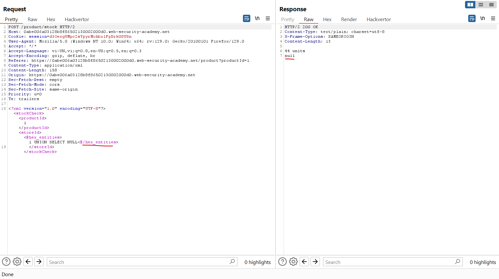

Link: https://portswigger.net/web-security/sql-injection

# SQL INJECTION
Trong post này chúng ta sẽ tìm hiểu: 
- SQL injection là gì? (SQLi)
- Cách tìm và khai thác các loại lỗ hổng SQLi khác nhau
- Cách ngăn chặn SQLi

## SQL injection là gì? (SQLi)
SQL injection (SQLi) là một lỗ hổng bảo mật web cho phép kẻ tấn công can thiệp vào các truy vấn mà ứng dụng thực hiện đối với cơ sở dữ liệu của nó. Điều này có thể cho phép kẻ tấn công xem dữ liệu mà thông thường chúng không thể truy xuất được. Điều này có thể bao gồm dữ liệu thuộc về người dùng khác hoặc bất kỳ dữ liệu nào khác mà ứng dụng có thể truy cập. Trong nhiều trường hợp, kẻ tấn công có thể sửa đổi hoặc xóa dữ liệu này, gây ra những thay đổi liên tục đối với nội dung hoặc hành vi của ứng dụng.
Trong một số trường hợp, kẻ tấn công có thể nâng cấp cuộc tấn công SQL SQL để xâm phạm máy chủ cơ bản hoặc cơ sở hạ tầng phụ trợ khác. Nó cũng có thể cho phép họ thực hiện các cuộc tấn công từ chối dịch vụ.

## Tác động của một cuộc tấn công tiêm nhiễm SQL thành công là gì?

Một cuộc tấn công SQLi thành công có thể dẫn đến truy cập trái phép vào dữ liệu nhạy cảm, chẳng hạn như:
- Passwords
- Chi tiết credit card
- Thông tin cá nhân của người dùng

## Cách phát hiện lỗ hổng SQLi

Bạn có thể phát hiện SQLi theo cách thủ công bằng cách sử dụng một bộ thử nghiệm có hệ thống đối với mọi input trong ứng dụng. Để làm điều này, bạn thường sẽ submit:

- Ký tự trích dẫn đơn `'` và tìm kiếm lỗi hoặc các điểm bất thường khác.

- Một số cú pháp dành riêng cho SQL đánh giá giá trị cơ sở (gốc) của điểm nhập và một số thông tin khác, đồng thời tìm kiếm sự khác biệt mang tính hệ thống trong các phản hồi của ứng dụng.

- Các điều kiện Boolean như OR 1=1 và OR 1=2, đồng thời tìm kiếm sự khác biệt trong phản hồi của ứng dụng.
- Tải trọng được thiết kế để kích hoạt độ trễ thời gian khi được thực thi trong truy vấn SQL và tìm kiếm sự khác biệt về thời gian cần thiết để phản hồi.
- Tải trọng OAST được thiết kế để kích hoạt tương tác mạng ngoài băng tần khi được thực thi trong truy vấn SQL và giám sát mọi tương tác phát sinh.

Ngoài ra, bạn có thể tìm thấy phần lớn các lỗ hổng SQL SQL một cách nhanh chóng và đáng tin cậy bằng cách sử dụng Burp Scanner.

### Inject SQL vào các phần khác nhau của truy vấn
Hầu hết các lỗ hổng SQL xảy ra trong mệnh đề `WHERE` của truy vấn `SELECT`. Hầu hết những người thử nghiệm có kinh nghiệm đều quen thuộc với kiểu chèn SQL này.\
Tuy nhiên, lỗ hổng chèn SQL có thể xảy ra ở bất kỳ vị trí nào trong truy vấn và trong các loại truy vấn khác nhau. Một số vị trí phổ biến khác phát sinh việc tiêm SQL là:
- Trong câu lệnh `UPDATE`, trong các giá trị được cập nhật hoặc mệnh đề `WHERE`.
- Trong câu lệnh `INSERT`, bên trong các giá trị được chèn.
- Trong câu lệnh `SELECT`, trong tên bảng hoặc cột.
- Trong câu lệnh `SELECT`, trong mệnh đề `ORDER BY`.
## SQL injection examples
Có rất nhiều lỗ hổng, cuộc tấn công và kỹ thuật SQLi xảy ra trong các tình huống khác nhau. Một số ví dụ về SQLi phổ biến bao gồm:
- Truy xuất dữ liệu ẩn, nơi bạn có thể sửa đổi truy vấn SQL để trả về kết quả bổ sung.
- Phá vỡ logic ứng dụng, trong đó bạn có thể thay đổi một truy vấn để can thiệp vào logic của ứng dụng.
- Các cuộc tấn công UNION, nơi bạn có thể truy xuất dữ liệu từ các bảng cơ sở dữ liệu khác nhau.
- Blind SQLi, trong đó kết quả của truy vấn bạn kiểm soát không được trả về trong phản hồi của ứng dụng.

## Retrieving hidden data
Hãy tưởng tượng một ứng dụng mua sắm hiển thị các sản phẩm theo các danh mục khác nhau. Khi người dùng nhấp vào danh mục Gifts, trình duyệt của họ sẽ yêu cầu URL:\
`https://insecure-website.com/products?category=Gifts`\
Điều này khiến ứng dụng tạo truy vấn SQL để truy xuất thông tin chi tiết về các sản phẩm có liên quan từ cơ sở dữ liệu:\
`SELECT * FROM products WHERE category = 'Gifts' AND released = 1`\
Truy vấn SQL này yêu cầu cơ sở dữ liệu trả về:
- all details (*)
- from the `products` table
- where the `category` is `Gifts`
- and `released` is `1`.

Hạn chế `released = 1` đang được sử dụng để ẩn các sản phẩm chưa được phát hành. Chúng ta có thể giả sử đối với các sản phẩm chưa được phát hành, `released = 0`\
Ứng dụng không triển khai bất kỳ biện pháp phòng vệ nào trước các cuộc tấn công tiêm nhiễm SQL. Điều này có nghĩa là kẻ tấn công có thể xây dựng cuộc tấn công sau, ví dụ:\
`https://insecure-website.com/products?category=Gifts'--`\
Điều này dẫn đến truy vấn SQL:\
`SELECT * FROM products WHERE category = 'Gifts'--' AND released = 1`\
Điều quan trọng cần lưu ý rằng `--` là một comment trong SQL. Điều này có nghĩa là phần còn lại của truy vấn được hiểu là một comment, loại bỏ nó một cách hiệu quả. Trong ví dụ này, điều này có nghĩa là truy vấn không còn bao gồm `AND released = 1`. Kết quả là tất cả các sản phẩm đều được hiển thị, bao gồm cả những sản phẩm chưa được phát hành.\
Bạn có thể sử dụng một cuộc tấn công tương tự để khiến ứng dụng hiển thị tất cả các sản phẩm trong bất kỳ danh mục nào, bao gồm cả những danh mục mà chúng không biết:\
`https://insecure-website.com/products?category=Gifts'+OR+1=1--`\
Điều này dẫn đến truy vấn SQL:\
`SELECT * FROM products WHERE category = 'Gifts' OR 1=1--' AND released = 1`\
Truy vấn đã sửa đổi trả về tất cả các mục trong đó `category` là `Gifts` hoặc `1` bằng `1`. Vì `1=1` luôn đúng nên truy vấn trả về tất cả các mục.

**Note**: Hãy cẩn thận khi đưa điều kiện `OR 1=1` vào truy vấn SQL. Ngay cả khi nó có vẻ vô hại trong bối cảnh bạn đang đưa vào, thông thường các ứng dụng sẽ sử dụng dữ liệu từ một yêu cầu trong nhiều truy vấn khác nhau. Ví dụ: nếu điều kiện của bạn đạt đến câu lệnh `UPDATE` hoặc `DELETE`, điều đó có thể dẫn đến việc vô tình mất dữ liệu.

Ví dụ: https://portswigger.net/web-security/sql-injection/lab-retrieve-hidden-data 

## Subverting application logic (Phá vỡ logic ứng dụng)
Hãy tưởng tượng một ứng dụng cho phép người dùng đăng nhập bằng username và password. Nếu người dùng gửi username `wiener` và password `bluecheese`, ứng dụng sẽ kiểm tra thông tin đăng nhập bằng cách thực hiện truy vấn SQL sau:\
`SELECT * FROM users WHERE username = 'wiener' AND password = 'bluecheese'`\
Nếu truy vấn trả về thông tin chi tiết của người dùng thì đăng nhập thành công. Nếu không, nó sẽ bị từ chối.\
Trong trường hợp này, kẻ tấn công có thể đăng nhập với tư cách bất kỳ người dùng nào mà không cần mật khẩu. Họ có thể thực hiện việc này bằng cách sử dụng chuỗi comment SQL `--` để xóa việc kiểm tra `password` khỏi mệnh đề `WHERE` của truy vấn. Ví dụ: gửi tên người dùng `administrator'--` và mật khẩu trống sẽ dẫn đến truy vấn sau:\
`SELECT * FROM users WHERE username = 'administrator'--' AND password = ''`\
Truy vấn này trả về người dùng có `username` là `administrator` và đăng nhập thành công với tư cách là người dùng đó.

Ví dụ: https://portswigger.net/web-security/sql-injection/lab-login-bypass

## Retrieving data from other database tables (Lấy dữ liệu từ bảng cơ sở dữ liệu khác)
Trong trường hợp ứng dụng phản hồi bằng kết quả của truy vấn SQL, kẻ tấn công có thể sử dụng lỗ hổng chèn SQL để lấy dữ liệu từ các bảng khác trong cơ sở dữ liệu. Bạn có thể sử dụng từ khóa `UNION` để thực hiện truy vấn `SELECT` bổ sung và nối kết quả vào truy vấn ban đầu. Ví dụ: nếu một ứng dụng thực hiện truy vấn sau có chứa `Gifts` đầu vào của người dùng:\
`SELECT name, description FROM products WHERE category = 'Gifts'`\
Kẻ tấn công có thể gửi đầu vào:\
`' UNION SELECT username, password FROM users--`\
Điều này khiến ứng dụng trả về tất cả username và password cùng với name và descriptions sản phẩm.

Đọc về: [UNION ATTACK](<UNION attack.md>)

## Blind SQL injection vulnerabilities
Nhiều trường hợp SQLi là những lỗ hổng không nhìn thấy được (Không có response trả về). Điều này có nghĩa là ứng dụng không trả về kết quả của truy vấn SQL hoặc chi tiết về bất kỳ lỗi cơ sở dữ liệu nào trong phản hồi của nó. Các lỗ hổng ẩn vẫn có thể bị khai thác để truy cập dữ liệu trái phép, nhưng các kỹ thuật liên quan thường phức tạp và khó thực hiện hơn.

Các kỹ thuật sau đây có thể được sử dụng để khai thác lỗ hổng chèn SQL mù, tùy thuộc vào bản chất của lỗ hổng và cơ sở dữ liệu liên quan:
- Bạn có thể thay đổi logic của truy vấn để kích hoạt sự khác biệt có thể phát hiện được trong phản hồi của ứng dụng tùy thuộc vào mức độ thực tế của một điều kiện. Điều này có thể liên quan đến việc đưa một điều kiện mới vào logic Boolean nào đó hoặc gây ra một lỗi có điều kiện, chẳng hạn như lỗi chia cho 0.
- Bạn có thể kích hoạt có `điều kiện độ trễ thời gian` trong quá trình xử lý truy vấn. Điều này cho phép bạn suy ra sự thật của điều kiện dựa trên thời gian mà ứng dụng cần để phản hồi.
- Bạn có thể kích hoạt tương tác mạng ngoài băng tần bằng cách sử dụng kỹ thuật `OAST`. Kỹ thuật này cực kỳ mạnh mẽ và hoạt động trong những tình huống mà các kỹ thuật khác không làm được. Thông thường, bạn có thể lọc trực tiếp dữ liệu qua kênh ngoài băng tần. Ví dụ: bạn có thể đặt dữ liệu vào tra cứu DNS cho miền mà bạn kiểm soát.

Đọc về: [Blind SQL](<Blind SQL injection.md>)

Cheat-sheet: `https://portswigger.net/web-security/sql-injection/cheat-sheet`

## Second-order SQL injection
SQL injection bậc nhất xảy ra khi ứng dụng xử lý **thông tin đầu vào** của người dùng từ một yêu cầu HTTP và kết hợp đầu vào đó vào **truy vấn SQL** theo cách không an toàn.\
Việc chèn SQL bậc hai xảy ra khi ứng dụng lấy **đầu vào** của người dùng từ một yêu cầu HTTP và **lưu trữ nó** để sử dụng trong tương lai. Điều này thường được thực hiện bằng cách đặt dữ liệu đầu vào vào cơ sở dữ liệu, nhưng không có lỗ hổng nào xảy ra tại điểm lưu trữ dữ liệu. Sau đó, khi xử lý một yêu cầu HTTP khác, ứng dụng sẽ truy xuất dữ liệu được lưu trữ và kết hợp nó vào truy vấn SQL theo cách không an toàn. Vì lý do này, việc tiêm SQL bậc hai còn được gọi là việc **tiêm SQL được lưu trữ**.\


Việc chèn SQL bậc hai thường xảy ra trong các tình huống mà các nhà phát triển nhận thức được các lỗ hổng chèn SQL và do đó xử lý một cách an toàn vị trí đầu vào ban đầu vào cơ sở dữ liệu. Khi dữ liệu được xử lý sau đó, nó được coi là an toàn vì trước đó nó đã được đưa vào cơ sở dữ liệu một cách an toàn. Tại thời điểm này, dữ liệu được xử lý theo cách không an toàn vì nhà phát triển đã nhầm tưởng rằng nó đáng tin cậy.

## Examining the database
Một số tính năng cốt lõi của ngôn ngữ SQL được triển khai theo cùng một cách trên các nền tảng cơ sở dữ liệu phổ biến và rất nhiều cách phát hiện và khai thác các lỗ hổng chèn SQL hoạt động giống hệt nhau trên các loại cơ sở dữ liệu khác nhau.\
Tuy nhiên, cũng có nhiều điểm khác biệt giữa các cơ sở dữ liệu thông thường. Điều này có nghĩa là một số kỹ thuật phát hiện và khai thác tính năng chèn SQL hoạt động khác nhau trên các nền tảng khác nhau. Ví dụ:
- Cú pháp nối chuỗi.
- Comment
- Batched (or stacked) queries.
- Platform-specific APIs.
- Error messages.

Sau khi bạn xác định được lỗ hổng chèn SQL, việc thu thập thông tin về cơ sở dữ liệu thường rất hữu ích. Thông tin này có thể giúp bạn khai thác lỗ hổng.\
Bạn có thể truy vấn chi tiết phiên bản cho cơ sở dữ liệu. Các phương pháp khác nhau hoạt động với các loại cơ sở dữ liệu khác nhau. Điều này có nghĩa là nếu bạn tìm thấy một phương thức cụ thể hoạt động, bạn có thể suy ra loại cơ sở dữ liệu. Ví dụ: trên Oracle bạn có thể thực thi:\
`SELECT * FROM v$version`\
Bạn cũng có thể xác định những bảng cơ sở dữ liệu nào tồn tại và các cột chứa trong đó. Ví dụ: trên hầu hết các cơ sở dữ liệu, bạn có thể thực hiện truy vấn sau để liệt kê các bảng:\
`SELECT * FROM information_schema.tables`

Đọc thêm: https://portswigger.net/web-security/sql-injection/examining-the-database

## SQL injection in different contexts
Trong các bài thực hành trước, bạn đã sử dụng chuỗi truy vấn để chèn payload SQL độc hại vào. Tuy nhiên, bạn có thể thực hiện các cuộc tấn công tiêm nhiễm SQL bằng cách sử dụng bất kỳ đầu vào có thể kiểm soát nào được ứng dụng xử lý dưới dạng truy vấn SQL. Ví dụ: một số trang web lấy dữ liệu đầu vào ở định dạng JSON hoặc XML và sử dụng dữ liệu này để truy vấn cơ sở dữ liệu.\
Các định dạng khác nhau này có thể cung cấp những cách khác nhau để bạn làm xáo trộn các cuộc tấn công bị chặn do WAF và các cơ chế phòng thủ khác. Việc triển khai yếu thường tìm kiếm các từ khóa chèn SQL phổ biến trong yêu cầu, vì vậy bạn có thể bỏ qua các bộ lọc này bằng cách mã hóa hoặc thoát các ký tự trong các từ khóa bị cấm. Ví dụ: nội dung SQL dựa trên XML sau đây sử dụng chuỗi thoát XML để mã hóa ký tự `S` trong `SELECT`:
```
<stockCheck>
    <productId>123</productId>
    <storeId>999 &#x53;ELECT * FROM information_schema.tables</storeId>
</stockCheck>
```
Điều này sẽ được giải mã phía máy chủ trước khi được chuyển tới trình thông dịch SQL.

Ví dụ: https://portswigger.net/web-security/sql-injection/lab-sql-injection-with-filter-bypass-via-xml-encoding


Khi sửa nó đã trả về kết quả khác, ta đoán là nó đã cộng `1+1` ở đó:\


Khi tiêm câu lệnh SQL thì nó báo về `Attack detected` thì khả năng là có thể tiêm SQL nhưng bị phát hiện:


Đối với XML ta có thể dùng `hex_entities` để bypass được WAF: 


Bây giờ sẽ lấy password: 


## How to prevent SQL injection
Bạn có thể ngăn hầu hết các trường hợp chèn SQL bằng cách sử dụng các truy vấn được `tham số hóa` thay vì `nối chuỗi` trong truy vấn. Các truy vấn được tham số hóa này còn được gọi là "các câu lệnh được chuẩn bị sẵn".\
Đoạn mã sau dễ bị tấn công bởi SQLi vì đầu vào của người dùng được nối trực tiếp vào truy vấn:
```
String query = "SELECT * FROM products WHERE category = '"+ input + "'";
Statement statement = connection.createStatement();
ResultSet resultSet = statement.executeQuery(query);
```
Bạn có thể viết lại mã này theo cách ngăn không cho dữ liệu đầu vào của người dùng can thiệp vào cấu trúc truy vấn:
```
PreparedStatement statement = connection.prepareStatement("SELECT * FROM products WHERE category = ?");
statement.setString(1, input);
ResultSet resultSet = statement.executeQuery();
```
Bạn có thể sử dụng các truy vấn được tham số hóa cho mọi tình huống trong đó dữ liệu đầu vào không đáng tin cậy xuất hiện dưới dạng dữ liệu trong truy vấn, bao gồm mệnh đề `WHERE` và các giá trị trong câu lệnh `INSERT` hoặc `UPDATE`. Chúng không thể được sử dụng để xử lý dữ liệu đầu vào không đáng tin cậy trong các phần khác của truy vấn, chẳng hạn như tên bảng hoặc cột hoặc mệnh đề `ORDER BY`. Chức năng ứng dụng đặt dữ liệu không đáng tin cậy vào các phần này của truy vấn cần phải thực hiện một cách tiếp cận khác, chẳng hạn như:
- Danh sách trắng các giá trị đầu vào được phép.
- Sử dụng logic khác nhau để cung cấp hành vi cần thiết.

Để truy vấn được tham số hóa có hiệu quả trong việc ngăn chặn việc chèn SQL, chuỗi được sử dụng trong truy vấn phải luôn là hằng số được mã hóa cứng. Nó không bao giờ được chứa bất kỳ dữ liệu biến đổi nào từ bất kỳ nguồn gốc nào. Đừng quyết định theo từng trường hợp xem một mục dữ liệu có đáng tin cậy hay không và tiếp tục sử dụng nối chuỗi trong truy vấn đối với các trường hợp được coi là an toàn. Bạn rất dễ mắc sai lầm về nguồn gốc của dữ liệu hoặc về những thay đổi trong mã khác làm hỏng dữ liệu đáng tin cậy.


