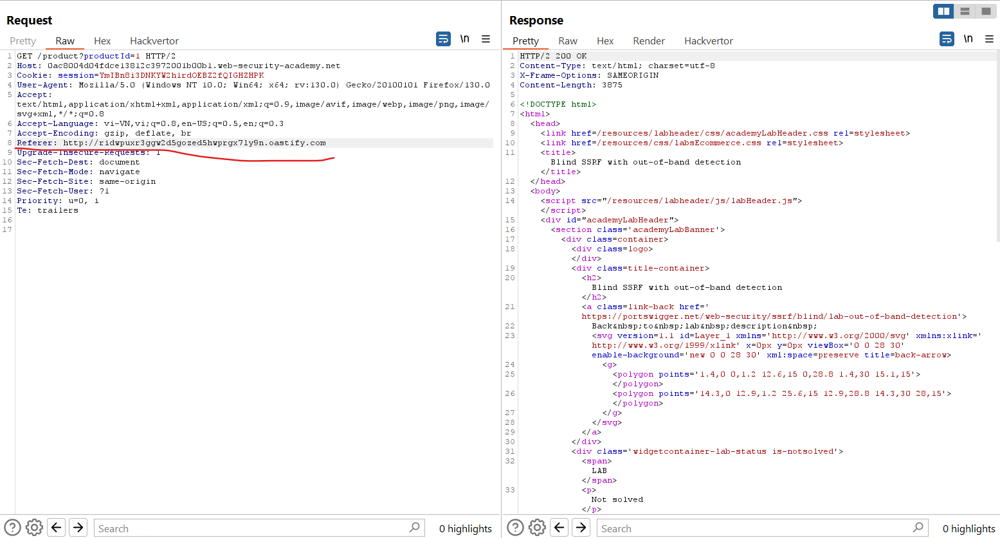
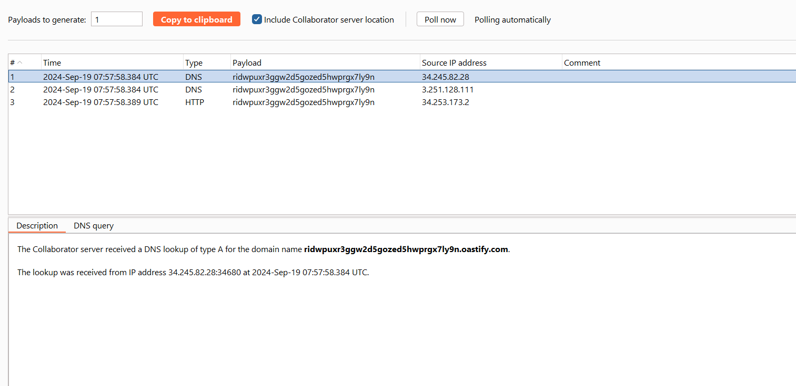

# Blind SSRF vulnerabilities
Trong phần này, chúng tôi sẽ giải thích giả mạo yêu cầu mù phía máy chủ là gì, mô tả một số ví dụ SSRF mù phổ biến cũng như giải thích cách tìm và khai thác các lỗ hổng SSRF mù.
## What is blind SSRF?
Lỗ hổng SSRF mù phát sinh khi một ứng dụng có thể được tạo ra để đưa ra yêu cầu HTTP back-end tới một URL được cung cấp, nhưng phản hồi từ yêu cầu back-end không được trả về trong phản hồi front-end của ứng dụng.
## What is the impact of blind SSRF vulnerabilities?
Tác động của các lỗ hổng SSRF mù thường thấp hơn so với các lỗ hổng SSRF được thông báo đầy đủ do tính chất một chiều của chúng. Chúng không thể bị khai thác một cách tầm thường để lấy dữ liệu nhạy cảm từ các hệ thống phụ trợ, mặc dù trong một số trường hợp, chúng có thể bị khai thác để thực thi mã hoàn toàn từ xa.
## How to find and exploit blind SSRF vulnerabilities
Cách đáng tin cậy nhất để phát hiện các lỗ hổng SSRF mù là sử dụng các kỹ thuật ngoài băng tần (OAST). Điều này liên quan đến việc cố gắng kích hoạt yêu cầu HTTP tới hệ thống bên ngoài mà bạn kiểm soát và giám sát các tương tác mạng với hệ thống đó.\
Cách dễ nhất và hiệu quả nhất để sử dụng các kỹ thuật ngoài băng tần là sử dụng `Burp Collaborator`. Bạn có thể sử dụng `Burp Collaborator` để tạo các tên miền duy nhất, gửi chúng dưới dạng tải trọng đến ứng dụng và theo dõi mọi tương tác với các miền đó. Nếu một yêu cầu HTTP đến được quan sát thấy đến từ ứng dụng thì nó dễ bị tấn công bởi SSRF.

Thông thường khi kiểm tra các lỗ hổng SSRF sẽ quan sát thấy quá trình tra cứu DNS cho miền Collaborator được cung cấp nhưng không có yêu cầu HTTP tiếp theo. Điều này thường xảy ra do ứng dụng đã cố gắng thực hiện yêu cầu HTTP tới miền, khiến quá trình tra cứu DNS ban đầu xảy ra, nhưng yêu cầu HTTP thực tế đã bị chặn bởi tính năng lọc cấp mạng. Việc cơ sở hạ tầng cho phép lưu lượng DNS gửi đi là điều tương đối phổ biến, vì điều này cần thiết cho rất nhiều mục đích nhưng lại chặn các kết nối HTTP đến các đích không mong muốn.

Ví dụ: https://portswigger.net/web-security/ssrf/blind/lab-out-of-band-detection

\

Việc chỉ xác định một lỗ hổng SSRF mù có thể kích hoạt các yêu cầu HTTP ngoài băng tần tự nó không cung cấp lộ trình dẫn đến khả năng khai thác. Vì bạn không thể xem phản hồi từ yêu cầu phía sau nên không thể sử dụng hành vi này để khám phá nội dung trên các hệ thống mà máy chủ ứng dụng có thể tiếp cận. Tuy nhiên, nó vẫn có thể được tận dụng để thăm dò các lỗ hổng khác trên chính máy chủ hoặc trên các hệ thống phụ trợ khác. Bạn có thể quét một cách mù quáng không gian địa chỉ IP nội bộ, gửi các tải trọng được thiết kế để phát hiện các lỗ hổng phổ biến. Nếu các tải trọng đó cũng sử dụng các kỹ thuật ngoài băng tần mù, thì bạn có thể phát hiện ra lỗ hổng nghiêm trọng trên máy chủ nội bộ chưa được vá.

Ví dụ: https://portswigger.net/web-security/ssrf/blind/lab-shellshock-exploitation
(chưa làm)

Một cách khác để khai thác các lỗ hổng SSRF mù là khiến ứng dụng kết nối với hệ thống dưới sự kiểm soát của kẻ tấn công và trả về các phản hồi độc hại cho máy khách HTTP tạo kết nối. Nếu bạn có thể khai thác lỗ hổng nghiêm trọng phía máy khách trong quá trình triển khai HTTP của máy chủ, thì bạn có thể thực thi mã từ xa trong cơ sở hạ tầng ứng dụng.

