# Web cache deception
Web cache deception là một lỗ hổng cho phép kẻ tấn công lừa bộ đệm web lưu trữ nội dung động, nhạy cảm. Nguyên nhân là do sự khác biệt giữa cách máy chủ bộ đệm và máy chủ gốc xử lý các yêu cầu.

Trong một cuộc tấn công lừa đảo bộ đệm web, kẻ tấn công thuyết phục nạn nhân truy cập một URL độc hại, khiến trình duyệt của nạn nhân đưa ra yêu cầu không an toàn về nội dung nhạy cảm. Bộ đệm hiểu sai đây là yêu cầu về tài nguyên tĩnh và lưu trữ phản hồi. Sau đó, kẻ tấn công có thể yêu cầu cùng một URL để truy cập phản hồi được lưu trong bộ nhớ đệm, giành quyền truy cập trái phép vào thông tin cá nhân.


**Lưu ý** Điều quan trọng là phải phân biệt hành vi lừa đảo trong bộ nhớ đệm web với việc đầu độc bộ nhớ đệm web. Mặc dù cả hai đều khai thác cơ chế bộ nhớ đệm nhưng chúng thực hiện theo những cách khác nhau:
- Web cache poisoning thao túng các **cache keys** để đưa nội dung độc hại vào phản hồi được lưu trong bộ nhớ đệm, sau đó phản hồi này sẽ được cung cấp cho những người dùng khác.
- Web cache deception khai thác các quy tắc bộ đệm để lừa bộ đệm lưu trữ nội dung nhạy cảm hoặc riêng tư mà kẻ tấn công sau đó có thể truy cập.

## Web caches
Web caches là một hệ thống nằm giữa máy chủ gốc và người dùng. Khi khách hàng yêu cầu tài nguyên tĩnh, trước tiên yêu cầu sẽ được chuyển đến Cache. Nếu bộ đệm không chứa bản sao của tài nguyên (được gọi là thiếu bộ đệm), yêu cầu sẽ được chuyển tiếp đến máy chủ gốc để xử lý và phản hồi yêu cầu. Phản hồi sau đó sẽ được gửi đến bộ đệm trước khi gửi cho người dùng. Bộ đệm sử dụng một bộ quy tắc được cấu hình sẵn để xác định xem có lưu trữ phản hồi hay không.\
Khi một yêu cầu đối với cùng một tài nguyên tĩnh được thực hiện trong tương lai, bộ đệm sẽ phân phát bản sao phản hồi được lưu trữ trực tiếp cho người dùng (được gọi là lần truy cập bộ đệm).\


Bộ nhớ đệm đã trở thành một khía cạnh phổ biến và quan trọng trong việc phân phối nội dung web, đặc biệt với việc sử dụng rộng rãi Mạng phân phối nội dung (Content Delivery Networks - CDN), sử dụng bộ nhớ đệm để lưu trữ bản sao nội dung trên các máy chủ phân tán trên toàn thế giới. CDN tăng tốc độ phân phối bằng cách cung cấp nội dung từ máy chủ gần người dùng nhất, giảm thời gian tải bằng cách giảm thiểu khoảng cách di chuyển dữ liệu.
### Cache keys
Khi bộ đệm nhận được yêu cầu HTTP, nó phải quyết định xem có phản hồi nào được lưu trong bộ nhớ đệm mà nó có thể phục vụ trực tiếp hay không hoặc liệu nó có phải chuyển tiếp yêu cầu đến máy chủ gốc hay không. Bộ đệm đưa ra quyết định này bằng cách tạo '**cache key**' từ các thành phần của yêu cầu HTTP. Thông thường, điều này bao gồm đường dẫn URL và tham số truy vấn, nhưng nó cũng có thể bao gồm nhiều thành phần khác như header và loại nội dung.

Nếu **cache key** của yêu cầu đến khớp với khóa của yêu cầu trước đó thì bộ đệm sẽ coi chúng là tương đương và cung cấp bản sao của phản hồi được lưu trong bộ nhớ đệm.

### Cache rules

Cache rules xác định **những gì có thể được lưu vào bộ đệm** và **trong bao lâu**. Cache rules thường được thiết lập để lưu trữ tài nguyên tĩnh, thường không thay đổi thường xuyên và được sử dụng lại trên nhiều trang. Nội dung động không được lưu vào bộ nhớ đệm vì có nhiều khả năng chứa thông tin nhạy cảm, đảm bảo người dùng nhận được dữ liệu mới nhất trực tiếp từ máy chủ.

Các cuộc tấn công lừa đảo bộ đệm web khai thác cách áp dụng các quy tắc bộ đệm, vì vậy điều quan trọng là phải biết về một số loại quy tắc khác nhau, đặc biệt là các quy tắc dựa trên các chuỗi được xác định trong đường dẫn URL của yêu cầu. Ví dụ:
- Quy tắc mở rộng tệp tĩnh - Các quy tắc này khớp với phần mở rộng tệp của tài nguyên được yêu cầu, ví dụ: `.css` cho biểu định kiểu hoặc `.js` cho tệp JavaScript.
- Quy tắc thư mục tĩnh - Các quy tắc này khớp với tất cả các đường dẫn URL bắt đầu bằng tiền tố cụ thể. Chúng thường được sử dụng để nhắm mục tiêu các thư mục cụ thể chỉ chứa tài nguyên tĩnh, ví dụ `/static` hoặc `/assets`
- Quy tắc tên tệp - Các quy tắc này khớp tên tệp cụ thể với các tệp mục tiêu được yêu cầu phổ biến cho hoạt động web và hiếm khi thay đổi, chẳng hạn như `robots.txt` và `favicon.ico`

Bộ nhớ đệm cũng có thể triển khai các quy tắc tùy chỉnh dựa trên các tiêu chí khác, chẳng hạn như tham số URL hoặc phân tích động.

## Constructing a web cache deception attack
Nói chung, việc xây dựng một cuộc tấn công lừa đảo bộ đệm web cơ bản bao gồm các bước sau:
- Xác định endpoint mục tiêu trả về phản hồi động chứa thông tin nhạy cảm. Xem lại phản hồi trong Burp vì một số thông tin nhạy cảm có thể không hiển thị trên trang được hiển thị. Tập trung vào các điểm cuối hỗ trợ các phương thức `GET`, `HEAD` hoặc `OPTIONS` vì các yêu cầu thay đổi trạng thái của máy chủ gốc thường không được lưu vào bộ đệm.
- Xác định sự khác biệt trong cách bộ đệm và máy chủ gốc phân tích đường dẫn URL. Đây có thể là sự khác biệt trong cách họ:
    - Ánh xạ URL tới tài nguyên.
    - Ký tự phân cách quy trình.
    - Bình thường hóa đường dẫn.
- Tạo một URL độc hại sử dụng sự khác biệt để đánh lừa bộ đệm lưu trữ phản hồi động. Khi nạn nhân truy cập URL, phản hồi của họ sẽ được lưu trong bộ đệm. Khi sử dụng Burp, bạn có thể gửi yêu cầu tới cùng một URL để tìm nạp phản hồi được lưu trong bộ nhớ đệm chứa dữ liệu của nạn nhân. Tránh thực hiện việc này trực tiếp trong trình duyệt vì một số ứng dụng chuyển hướng người dùng mà không có phiên hoặc làm mất hiệu lực dữ liệu cục bộ, điều này có thể che giấu lỗ hổng.

### Detecting cached responses
Trong quá trình thử nghiệm, điều quan trọng là bạn có thể xác định được các phản hồi được lưu trong bộ nhớ đệm. Để làm như vậy, hãy xem tiêu đề phản hồi và thời gian phản hồi.\
Các tiêu đề phản hồi khác nhau có thể cho biết rằng nó đã được lưu vào bộ nhớ đệm. Ví dụ:
- Tiêu đề `X-Cache` cung cấp thông tin về việc liệu phản hồi có được cung cấp từ bộ đệm hay không. Các giá trị điển hình bao gồm:
    - `X-Cache: hit` - Phản hồi được cung cấp từ Cache.
    - `X-Cache: miss` - Cache không chứa phản hồi cho khóa của yêu cầu nên nó đã được tìm nạp từ máy chủ gốc. Trong hầu hết các trường hợp, phản hồi sau đó sẽ được lưu vào bộ nhớ đệm. Để xác nhận điều này, hãy gửi lại yêu cầu để xem liệu giá trị có cập nhật hay không.
    - `X-Cache: dynamic` - Máy chủ gốc tự động tạo nội dung. Nói chung điều này có nghĩa là phản hồi **không phù hợp để lưu vào cache**.
    - `X-Cache: refresh` - Nội dung được lưu trong Cache đã lỗi thời và cần được làm mới hoặc xác thực lại.
- Tiêu đề `Cache-Control` có thể bao gồm một lệnh cho biết bộ nhớ đệm, như `pulic` với `max-age` cao hơn `0`. Lưu ý rằng điều này chỉ gợi ý rằng tài nguyên có thể lưu vào bộ đệm. Nó không phải lúc nào cũng biểu thị bộ đệm, vì bộ đệm đôi khi có thể ghi đè tiêu đề này.

Nếu bạn nhận thấy sự khác biệt lớn về thời gian phản hồi cho cùng một yêu cầu, điều này cũng có thể cho thấy rằng bộ nhớ đệm cung cấp phản hồi nhanh hơn.
## Exploiting static extension cache rules
Quy tắc bộ đệm thường nhắm mục tiêu các tài nguyên tĩnh bằng cách khớp các phần mở rộng tệp phổ biến như `.css` hoặc `.js`. Đây là hành vi mặc định trong hầu hết các CDN.\
Nếu có sự khác biệt về cách bộ đệm và máy chủ gốc ánh xạ đường dẫn URL tới tài nguyên hoặc sử dụng dấu phân cách, kẻ tấn công có thể tạo yêu cầu đối với tài nguyên động có tiện ích mở rộng tĩnh bị máy chủ gốc bỏ qua nhưng được bộ đệm xem .
### Path mapping discrepancies
Ánh xạ đường dẫn URL là quá trình liên kết đường dẫn URL với tài nguyên trên máy chủ, chẳng hạn như tệp, tập lệnh hoặc thực thi lệnh. Có nhiều kiểu ánh xạ khác nhau được sử dụng bởi các khung và công nghệ khác nhau. Hai kiểu phổ biến là ánh xạ URL truyền thống và ánh xạ URL RESTful.\
Ánh xạ URL truyền thống biểu thị đường dẫn trực tiếp đến tài nguyên nằm trên hệ thống tệp. Đây là một ví dụ điển hình:\
`http://example.com/path/in/filesystem/resource.html`
- `http://example.com` trỏ đến máy chủ.
- `/path/in/filesystem/` đại diện cho đường dẫn thư mục trong hệ thống tệp của máy chủ.
- `resource.html` là tệp cụ thể đang được truy cập.

Ngược lại, các URL kiểu REST không khớp trực tiếp với cấu trúc tệp vật lý. Họ trừu tượng hóa các đường dẫn tệp thành các phần logic của API:\
`http://example.com/path/resource/param1/param2`
- `http://example.com` trỏ đến máy chủ.
- `/path/resource/` là điểm cuối đại diện cho tài nguyên.
- `param1` và `param2` là các tham số đường dẫn được máy chủ sử dụng để xử lý yêu cầu.

Sự khác biệt trong cách bộ đệm và máy chủ gốc ánh xạ đường dẫn URL tới tài nguyên có thể dẫn đến lỗ hổng đánh lừa bộ đệm web. Hãy xem xét ví dụ sau:\
`http://example.com/user/123/profile/wcd.css`
- Máy chủ gốc sử dụng ánh xạ URL kiểu REST có thể hiểu đây là yêu cầu cho điểm cuối `/user/123/profile` và trả về thông tin hồ sơ cho người dùng `123`, bỏ qua `wcd.css` như một tham số không quan trọng.
- Bộ nhớ đệm sử dụng ánh xạ URL truyền thống có thể xem đây là yêu cầu đối với tệp có tên `wcd.css` nằm trong thư mục `/profile` bên dưới `/user/123`. Nó diễn giải đường dẫn URL là `/user/123/profile/wcd.css`. Nếu bộ nhớ đệm được định cấu hình để lưu trữ phản hồi cho các yêu cầu có đường dẫn kết thúc bằng `.css`, thì nó sẽ lưu vào bộ nhớ đệm và cung cấp thông tin hồ sơ như thể đó là một tệp `CSS`.
### Exploiting path mapping discrepancies
Để kiểm tra cách máy chủ gốc ánh xạ đường dẫn URL tới tài nguyên, hãy thêm một đoạn đường dẫn tùy ý vào URL của điểm cuối mục tiêu của bạn. Nếu phản hồi vẫn chứa dữ liệu nhạy cảm giống như phản hồi cơ sở, điều đó cho biết máy chủ gốc trừu tượng hóa đường dẫn URL và bỏ qua phân đoạn được thêm vào. Ví dụ: đây là trường hợp nếu sửa đổi `/api/orders/123` thành `/api/orders/123/foo` vẫn trả về thông tin đơn hàng.\
Để kiểm tra cách bộ đệm ánh xạ đường dẫn URL tới tài nguyên, bạn cần sửa đổi đường dẫn để cố gắng khớp quy tắc bộ đệm bằng cách thêm tiện ích mở rộng tĩnh. Ví dụ: cập nhật `/api/orders/123/foo` thành `/api/orders/123/foo.js`. Nếu phản hồi được lưu vào bộ nhớ đệm, điều này cho biết:
- Bộ đệm đó diễn giải đường dẫn URL đầy đủ với phần mở rộng tĩnh.
- Rằng có một quy tắc bộ đệm để lưu trữ phản hồi cho các yêu cầu kết thúc bằng `.js`

Bộ nhớ đệm có thể có các quy tắc dựa trên các tiện ích mở rộng tĩnh cụ thể. Hãy thử nhiều tiện ích mở rộng, bao gồm `.css`, `.ico` và `.exe`.\
Sau đó, bạn có thể tạo một URL trả về phản hồi động được lưu trữ trong bộ đệm. Lưu ý rằng cuộc tấn công này được giới hạn ở điểm cuối cụ thể mà bạn đã thử nghiệm, vì máy chủ gốc thường có các quy tắc trừu tượng khác nhau cho các điểm cuối khác nhau.

---

### Ví dụ: Exploiting path mapping for web cache deception

Ví dụ: https://portswigger.net/web-security/web-cache-deception/lab-wcd-exploiting-path-mapping

Đăng nhập với account `wiener:peter` sau đó vào `/my-account`

Thêm path `abc.js` request `/my-account/abc.js` ta thấy nó vẫn phản hồi như bình thường.

Từ đó ta suy ra server chỉ phân tích đến `/my-account` thôi

Mặt khác, ta thấy response có `X-Cache: miss` 

Gửi lại request ta thấy có `X-Cache: hit` chứng tỏ nó đã được lấy từ cache

Từ đây ta xây dựng kịch bản: gửi 1 đoạn url cho victim truy cập vào `/my-account/aaa.css` đợi victim truy cập vào, sau đó mình request vào `/my-account/aaa.css` trong vòng 30s sau đó thì sẽ lấy được API của victim

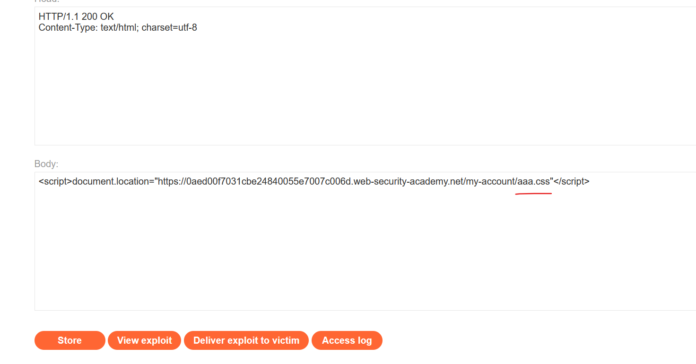

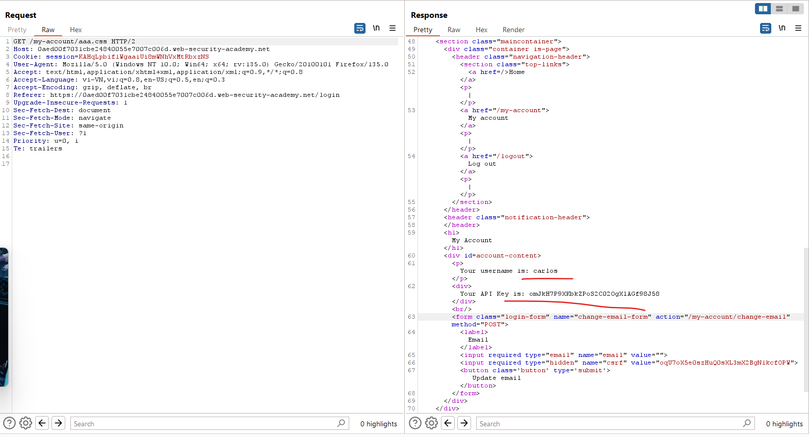


---

### Delimiter discrepancies - Không đồng nhất về dấu phân cách
Dấu phân cách xác định các ranh giới giữa các phần tử khác nhau trong URL. Việc sử dụng các ký tự và chuỗi làm dấu phân cách thường được chuẩn hóa. Ví dụ, dấu `?` thường được sử dụng để tách đường dẫn URL khỏi chuỗi truy vấn. Tuy nhiên, vì RFC của URI khá linh hoạt, sự khác biệt vẫn xảy ra giữa các framework hoặc công nghệ khác nhau.

Sự không đồng nhất trong cách mà máy chủ cache và máy chủ gốc sử dụng các ký tự và chuỗi làm dấu phân cách có thể dẫn đến các lỗ hổng lừa đảo bộ nhớ cache (web cache deception). Hãy xem ví dụ sau: `/profile;foo.css`:

- Framework Java Spring sử dụng ký tự `;` để thêm các tham số gọi là biến ma trận (matrix variables). Do đó, một máy chủ gốc sử dụng Java Spring sẽ coi `;` là dấu phân cách, cắt đường dẫn sau `/profile` và trả về thông tin hồ sơ.

- Hầu hết các framework khác không sử dụng `;` làm dấu phân cách. Do đó, một bộ nhớ cache không sử dụng Java Spring có thể hiểu `;` và mọi thứ sau nó như một phần của đường dẫn. Nếu bộ nhớ cache có quy tắc lưu trữ phản hồi cho các yêu cầu kết thúc bằng `.css`, nó có thể lưu và phục vụ thông tin hồ sơ như thể đó là một tệp CSS.

Điều này cũng đúng với các ký tự khác được sử dụng không nhất quán giữa các framework hoặc công nghệ. Hãy xem các yêu cầu sau đến một máy chủ gốc chạy framework `Ruby on Rails`, nơi sử dụng dấu `.` làm dấu phân cách để chỉ định định dạng phản hồi:

- `/profile` – Yêu cầu này được xử lý bởi bộ định dạng HTML mặc định, trả về thông tin hồ sơ người dùng.
- `/profile.css` – Yêu cầu này được nhận diện là phần mở rộng CSS. Không có bộ định dạng CSS, vì vậy yêu cầu này không được chấp nhận và trả về lỗi.
- `/profile.ico` – Yêu cầu này sử dụng phần mở rộng `.ico`, không được Ruby on Rails nhận diện. Bộ định dạng HTML mặc định xử lý yêu cầu và trả về thông tin hồ sơ người dùng. Trong tình huống này, nếu bộ nhớ cache được cấu hình để lưu trữ phản hồi cho các yêu cầu kết thúc bằng `.ico`, nó sẽ lưu và phục vụ thông tin hồ sơ như thể đó là một tệp tĩnh.

Các ký tự mã hóa cũng có thể được sử dụng làm dấu phân cách. Ví dụ, hãy xem yêu cầu `/profile%00foo.js`:

- Máy chủ OpenLiteSpeed sử dụng ký tự `null` đã mã hóa `%00` làm dấu phân cách. Do đó, một máy chủ gốc sử dụng OpenLiteSpeed sẽ hiểu đường dẫn là `/profile`.
- Hầu hết các framework khác sẽ trả về lỗi nếu `%00` xuất hiện trong URL. Tuy nhiên, nếu bộ nhớ cache sử dụng `Akamai` hoặc `Fastly`, nó sẽ hiểu `%00` và mọi thứ sau đó như là một phần của đường dẫn.

### Lợi dụng sự không đồng nhất về dấu phân cách

Bạn có thể lợi dụng sự không đồng nhất về dấu phân cách để thêm một phần mở rộng tĩnh vào đường dẫn mà **bộ nhớ cache thấy**, nhưng **máy chủ gốc không thấy**. Để làm điều này, bạn cần xác định một ký tự được sử dụng làm dấu phân cách bởi **máy chủ gốc nhưng không phải bộ nhớ cache**.

Đầu tiên, hãy tìm các ký tự được sử dụng làm dấu phân cách bởi máy chủ gốc. Bắt đầu quá trình này bằng cách thêm một chuỗi tùy ý vào URL của điểm cuối mục tiêu. Ví dụ, sửa đổi `/settings/users/list` thành `/settings/users/listaaa`. Bạn sẽ sử dụng phản hồi này làm tham chiếu khi bắt đầu thử nghiệm các ký tự dấu phân cách.

Lưu ý: Nếu phản hồi giống với phản hồi gốc, điều này có thể chỉ ra rằng yêu cầu đang được chuyển hướng. Bạn sẽ cần chọn một điểm cuối khác để thử nghiệm.

Tiếp theo, hãy thêm một ký tự dấu phân cách có thể có giữa đường dẫn gốc và chuỗi tùy ý, ví dụ, `/settings/users/list;aaa`:

- Nếu phản hồi giống với phản hồi gốc, điều này cho thấy ký tự `;` được sử dụng làm dấu phân cách và máy chủ gốc hiểu đường dẫn là `/settings/users/list`.

- Nếu phản hồi giống với phản hồi cho đường dẫn với chuỗi tùy ý, điều này cho thấy ký tự `;` không được sử dụng làm dấu phân cách và máy chủ gốc hiểu đường dẫn là `/settings/users/list;aaa`.

Sau khi xác định các dấu phân cách được sử dụng bởi máy chủ gốc, hãy thử nghiệm xem chúng có được bộ nhớ cache sử dụng hay không. Để làm điều này, hãy thêm một phần mở rộng tĩnh vào cuối đường dẫn. Nếu phản hồi được lưu vào cache, điều này chỉ ra rằng:

- Bộ nhớ cache không sử dụng dấu phân cách và hiểu toàn bộ đường dẫn URL với phần mở rộng tĩnh.
- Có một quy tắc bộ nhớ cache lưu trữ phản hồi cho các yêu cầu kết thúc bằng `.js`.

Hãy chắc chắn thử tất cả các ký tự ASCII và một loạt các phần mở rộng phổ biến, bao gồm `.css`, `.ico`, và `.exe`.

Bạn có thể xây dựng một cuộc tấn công khai thác quy tắc bộ nhớ cache cho phần mở rộng tĩnh. Ví dụ, xem payload `/settings/users/list;aaa.js`. Máy chủ gốc sử dụng `;` làm dấu phân cách:

- Bộ nhớ cache hiểu đường dẫn là: `/settings/users/list;aaa.js`
- Máy chủ gốc hiểu đường dẫn là: `/settings/users/list`

Máy chủ gốc trả về thông tin hồ sơ động, được lưu trữ trong bộ nhớ cache.

Vì dấu phân cách thường được sử dụng đồng nhất trong mỗi máy chủ, bạn có thể thường xuyên sử dụng cuộc tấn công này trên nhiều điểm cuối khác nhau.

Lưu ý: Một số ký tự dấu phân cách có thể được trình duyệt của nạn nhân xử lý trước khi chuyển tiếp yêu cầu đến bộ nhớ cache. Điều này có nghĩa là một số dấu phân cách không thể được sử dụng trong cuộc tấn công. Ví dụ, trình duyệt mã hóa các ký tự như `{`, `}`, `<`, và `>`, và sử dụng `#` để cắt ngắn đường dẫn.

Nếu bộ nhớ cache hoặc máy chủ gốc giải mã các ký tự này, có thể sử dụng phiên bản mã hóa trong một cuộc tấn công.

---

### Ví dụ:Exploiting path delimiters for web cache deception

https://portswigger.net/web-security/web-cache-deception/lab-wcd-exploiting-path-delimiters

Đăng nhập vào `wiener`, thử tìm các kí tự phân cách:

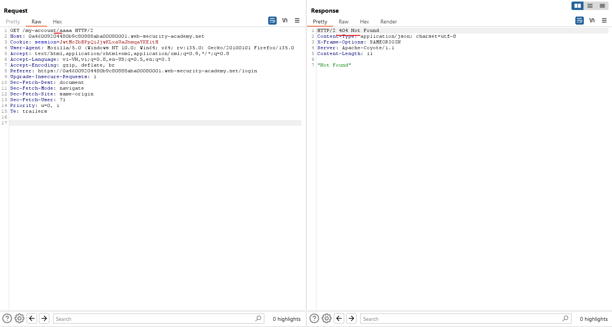

Chạy intruder:

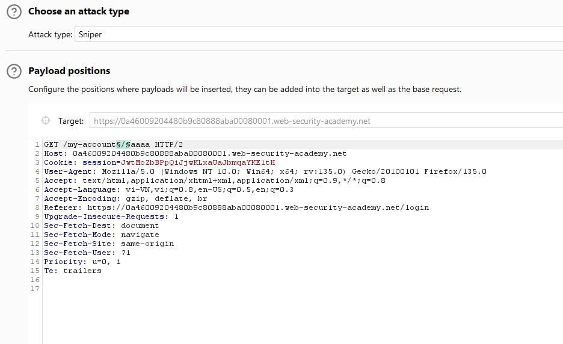

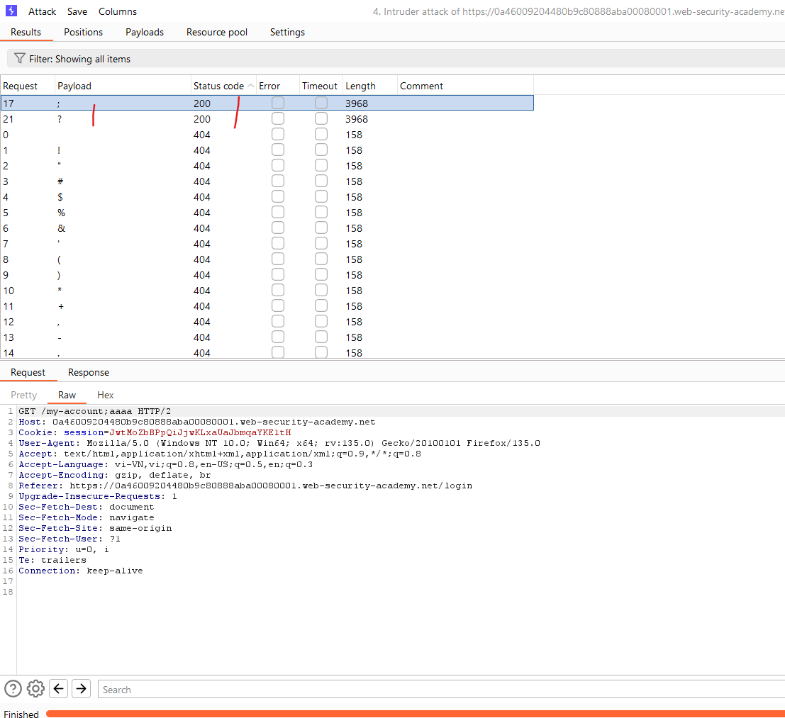

Bây giờ tìm tiếp extention file mà cache sẽ lưu lại:

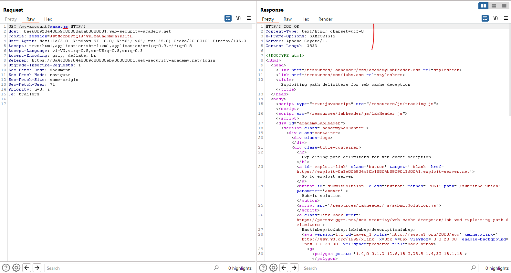

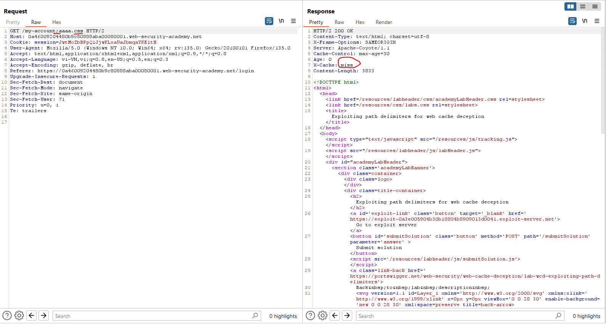

Tạo payload để gửi cho victim:

```js
<script>
    document.location='https://0a46009204480b9c80888aba00080001.web-security-academy.net/my-account;aaaa.css';
</script>
```

Gửi cho victim và request để lấy cache:

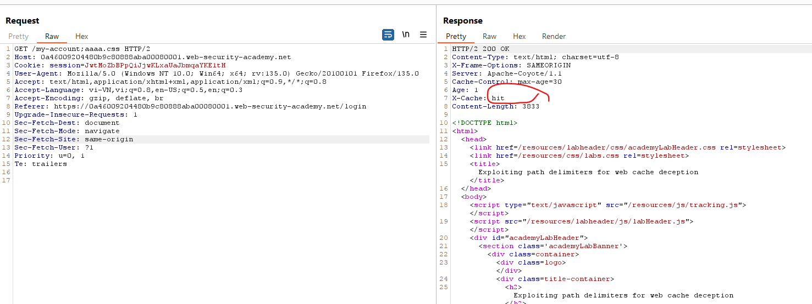

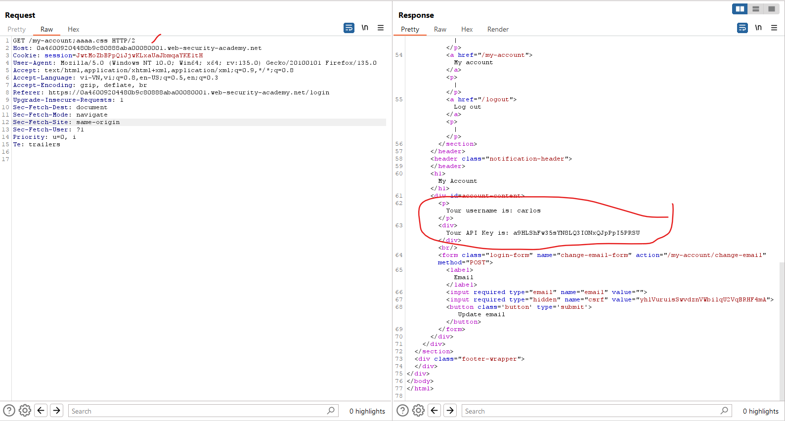

---

### Delimiter decoding discrepancies

Đôi khi, các trang web cần gửi dữ liệu trong URL có chứa các ký tự có ý nghĩa đặc biệt trong URL, chẳng hạn như dấu phân cách. Để đảm bảo các ký tự này được hiểu là dữ liệu, chúng thường được mã hóa. Tuy nhiên, một số trình phân tích giải mã một số ký tự nhất định trước khi xử lý URL. Nếu một ký tự phân cách được giải mã, thì nó có thể được coi là một ký tự phân cách, cắt bớt đường dẫn URL.

*Sự khác biệt trong cách giải mã các ký tự phân cách của bộ nhớ đệm và máy chủ gốc có thể dẫn đến sự khác biệt trong cách chúng diễn giải đường dẫn URL*, ngay cả khi cả hai đều sử dụng cùng một ký tự làm ký tự phân cách. Hãy xem xét ví dụ `/profile%23wcd.css`, sử dụng ký tự `#` được mã hóa theo URL:

- Máy chủ gốc giải mã `%23` thành `#`. Nó sử dụng `#` làm dấu phân cách, do đó nó diễn giải đường dẫn là `/profile` và trả về thông tin hồ sơ.

- Bộ nhớ đệm cũng sử dụng ký tự `#` làm dấu phân cách, nhưng không giải mã `%23`. Nó diễn giải đường dẫn là `/profile%23wcd.css`. Nếu có quy tắc bộ nhớ đệm cho phần mở rộng `.css`, nó sẽ lưu trữ phản hồi.

Ngoài ra, một số máy chủ bộ nhớ đệm có thể giải mã URL và sau đó chuyển tiếp yêu cầu với các ký tự đã giải mã. Những máy chủ khác trước tiên áp dụng các quy tắc bộ nhớ đệm dựa trên URL đã mã hóa, sau đó giải mã URL và chuyển tiếp đến máy chủ tiếp theo. Những hành vi này cũng có thể dẫn đến sự khác biệt trong cách bộ nhớ đệm và máy chủ gốc diễn giải đường dẫn URL. Hãy xem xét ví dụ `/myaccount%3fwcd.css`:

- Máy chủ bộ đệm áp dụng các quy tắc bộ đệm dựa trên đường dẫn được mã hóa `/myaccount%3fwcd.css` và quyết định lưu trữ phản hồi vì có một quy tắc bộ đệm cho phần mở rộng `.css`. Sau đó giải mã `%3f` thành `?` và chuyển tiếp yêu cầu đã viết lại đến máy chủ gốc.
- Máy chủ gốc nhận được yêu cầu `/myaccount?wcd.css`. Nó sử dụng ký tự `?` làm dấu phân cách, do đó nó diễn giải đường dẫn là `/myaccount`.

### Exploiting delimiter decoding discrepancies

Bạn có thể khai thác sự khác biệt về decoding bằng cách sử dụng bộ phân cách được mã hóa để thêm phần mở rộng tĩnh vào đường dẫn mà bộ đệm nhìn thấy nhưng máy chủ gốc thì không.

Sử dụng cùng phương pháp thử nghiệm mà bạn đã dùng để xác định và khai thác sự khác biệt về dấu phân cách, nhưng sử dụng một phạm vi ký tự được mã hóa. Đảm bảo rằng bạn cũng kiểm tra các ký tự không in được đã mã hóa, đặc biệt là `%00`, `%0A` và `%09`. Nếu các ký tự này được giải mã, chúng cũng có thể cắt bớt đường dẫn URL.

## Exploiting static directory cache rules

Các máy chủ web thường lưu trữ các tài nguyên tĩnh trong các thư mục cụ thể. Quy tắc bộ nhớ đệm thường nhắm mục tiêu vào các thư mục này bằng cách khớp với các tiền tố đường dẫn URL cụ thể, như `/static`, `/assets`, `/scripts` hoặc `/images`. Các quy tắc này cũng có thể dễ bị lừa bởi bộ nhớ đệm web.

### Normalization discrepancies (Sự khác biệt về chuẩn hóa)

Chuẩn hóa bao gồm việc chuyển đổi nhiều biểu diễn khác nhau của đường dẫn URL thành định dạng chuẩn. Đôi khi bao gồm giải mã các ký tự được mã hóa và phân giải các phân đoạn chấm, nhưng điều này thay đổi đáng kể tùy theo trình phân tích cú pháp.

Sự khác biệt trong cách bộ nhớ đệm và máy chủ gốc chuẩn hóa URL có thể cho phép kẻ tấn công xây dựng một tải trọng đường dẫn được diễn giải khác nhau bởi mỗi trình phân tích cú pháp. Hãy xem xét ví dụ `/static/..%2fprofile`:

- Máy chủ gốc giải mã các ký tự gạch chéo và phân giải các đoạn chấm sẽ chuẩn hóa đường dẫn đến `/profile` và trả về thông tin hồ sơ.

- Bộ nhớ đệm không giải quyết được các phân đoạn chấm hoặc giải mã dấu gạch chéo sẽ diễn giải đường dẫn là `/static/..%2fprofile`. Nếu bộ nhớ đệm lưu trữ phản hồi cho các yêu cầu có tiền tố `/static`, nó sẽ lưu vào bộ nhớ đệm và phục vụ thông tin hồ sơ.

Như được thể hiện trong ví dụ trên, mỗi phân đoạn chấm trong chuỗi duyệt đường dẫn cần được mã hóa. Nếu không, trình duyệt của nạn nhân sẽ giải quyết nó trước khi chuyển tiếp yêu cầu đến bộ nhớ đệm. Do đó, sự khác biệt về chuẩn hóa có thể khai thác được yêu cầu bộ nhớ đệm hoặc máy chủ gốc phải giải mã các ký tự trong chuỗi đường dẫn cũng như phân giải các phân đoạn chấm.

### Detecting normalization by the origin server (Phát hiện chuẩn hóa bởi máy chủ gốc)

Để kiểm tra cách máy chủ gốc chuẩn hóa đường dẫn URL, hãy gửi yêu cầu đến tài nguyên không lưu trong bộ nhớ đệm với trình tự duyệt đường dẫn và thư mục tùy ý ở đầu đường dẫn. Để chọn một tài nguyên không thể lưu trữ đệm, hãy tìm một phương thức không phải là idempotent như POST. Ví dụ, sửa đổi `/profile` thành `/aaa/..%2fprofile`:

- Nếu phản hồi khớp với phản hồi cơ sở và trả về thông tin hồ sơ, điều này cho biết đường dẫn đã được diễn giải là `/profile`. Máy chủ gốc giải mã dấu gạch chéo và giải quyết phân đoạn chấm.

- Nếu phản hồi không khớp với phản hồi cơ sở, ví dụ trả về thông báo lỗi 404, điều này cho biết đường dẫn đã được diễn giải là `/aaa/..%2fprofile`. Máy chủ gốc không giải mã dấu gạch chéo hoặc giải quyết dấu chấm.

Note: Khi kiểm tra chuẩn hóa, hãy bắt đầu bằng cách chỉ mã hóa dấu gạch chéo thứ hai trong phân đoạn chấm. Điều này quan trọng vì một số CDN khớp với dấu gạch chéo theo sau tiền tố thư mục tĩnh.\
Bạn cũng có thể thử mã hóa toàn bộ chuỗi đường dẫn hoặc mã hóa dấu chấm thay vì dấu gạch chéo. Điều này đôi khi có thể ảnh hưởng đến việc trình phân tích cú pháp có giải mã chuỗi hay không.

### Detecting normalization by the cache server (Phát hiện chuẩn hóa bởi bộ nhớ đệm)

Bạn có thể sử dụng một số phương pháp khác nhau để kiểm tra cách bộ nhớ đệm chuẩn hóa đường dẫn. Bắt đầu bằng cách xác định các thư mục tĩnh tiềm năng. Trong `Proxy > HTTP History`, hãy tìm các yêu cầu có tiền tố thư mục tĩnh chung và phản hồi được lưu trong bộ nhớ đệm. Tập trung vào các tài nguyên tĩnh bằng cách thiết lập bộ lọc lịch sử HTTP để chỉ hiển thị các tin nhắn có phản hồi 2xx và loại tập lệnh, hình ảnh và CSS MIME.

Sau đó, bạn có thể chọn một yêu cầu có phản hồi được lưu trong bộ nhớ đệm và gửi lại yêu cầu với trình tự duyệt đường dẫn và một thư mục tùy ý ở đầu đường dẫn tĩnh. Chọn một yêu cầu có phản hồi chứa bằng chứng được lưu trong bộ nhớ đệm. Ví dụ: `/aaa/..%2fassets/js/stockCheck.js`:

- Nếu phản hồi không còn được lưu trong bộ nhớ đệm, điều này cho biết bộ nhớ đệm không chuẩn hóa đường dẫn trước khi ánh xạ đến điểm cuối. Điều này cho thấy có một quy tắc bộ nhớ đệm dựa trên tiền tố `/assets`.

- Nếu phản hồi vẫn được lưu trong bộ nhớ đệm, điều này có thể chỉ ra rằng bộ nhớ đệm đã chuẩn hóa đường dẫn đến `/assets/js/stockCheck.js`.

Bạn cũng có thể thêm một chuỗi duyệt đường dẫn sau tiền tố thư mục. Ví dụ, sửa đổi `/assets/js/stockCheck.js` thành `/assets/..%2fjs/stockCheck.js`:

- Nếu phản hồi không còn được lưu trong bộ nhớ đệm, điều này cho biết bộ nhớ đệm giải mã dấu gạch chéo và giải quyết phân đoạn chấm trong quá trình chuẩn hóa, diễn giải đường dẫn là `/js/stockCheck.js`. Điều này cho thấy có một quy tắc bộ nhớ đệm dựa trên tiền tố `/assets`.

- Nếu phản hồi vẫn được lưu trong bộ nhớ đệm, điều này có thể chỉ ra rằng bộ nhớ đệm chưa giải mã dấu gạch chéo hoặc phân giải đoạn chấm, diễn giải đường dẫn là `/assets/..%2fjs/stockCheck.js`.

Lưu ý rằng trong cả hai trường hợp, phản hồi có thể được lưu vào bộ nhớ đệm do một quy tắc bộ nhớ đệm khác, chẳng hạn như quy tắc dựa trên phần mở rộng tệp. Để xác nhận quy tắc bộ nhớ đệm dựa trên thư mục tĩnh, hãy thay thế đường dẫn sau tiền tố thư mục bằng một chuỗi tùy ý. Ví dụ: `/assets/aaa`. Nếu phản hồi vẫn được lưu trong bộ nhớ đệm, điều này xác nhận quy tắc bộ nhớ đệm dựa trên tiền tố `/assets`. Lưu ý rằng nếu phản hồi không có vẻ như được lưu trong bộ nhớ đệm, điều này không nhất thiết loại trừ quy tắc bộ nhớ đệm thư mục tĩnh vì đôi khi phản hồi 404 không được lưu trong bộ nhớ đệm.

Note: Có thể bạn sẽ không thể xác định chắc chắn liệu bộ nhớ đệm có giải mã các phân đoạn chấm và giải mã đường dẫn URL hay không nếu không thử khai thác lỗ hổng.

### Exploiting normalization by the origin server

Nếu máy chủ gốc giải quyết được các phân đoạn chấm được mã hóa nhưng bộ nhớ đệm thì không, bạn có thể thử khai thác sự khác biệt này bằng cách xây dựng một tải trọng theo cấu trúc sau:

```
/<static-directory-prefix>/..%2f<dynamic-path>
```

Ví dụ, hãy xem xét tải trọng `/assets/..%2fprofile`:

- Bộ nhớ đệm diễn giải đường dẫn như sau: `/assets/..%2fprofile`
- Máy chủ gốc diễn giải đường dẫn như sau: `/profile`

Máy chủ gốc trả về thông tin cấu hình động được lưu trữ trong bộ nhớ đệm.

--- 

### Ví dụ: Exploiting origin server normalization for web cache deception

https://portswigger.net/web-security/web-cache-deception/lab-wcd-exploiting-origin-server-normalization

Tìm tài nguyên tĩnh được lưu vào cache:

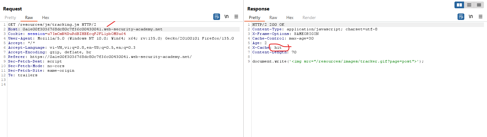

Xác định lưu vào cache theo quy tắc là `resource/`

Thử với `../` để xem máy chủ có phân giải ko


Ở đây chứng minh được nó đã phân giải để về `/my-account`

Tìm kí tự phân tách

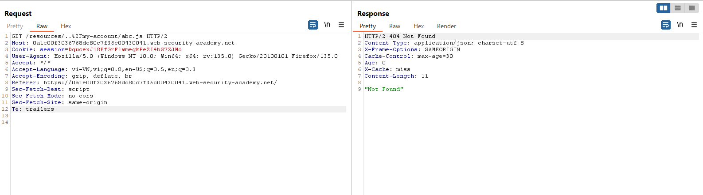

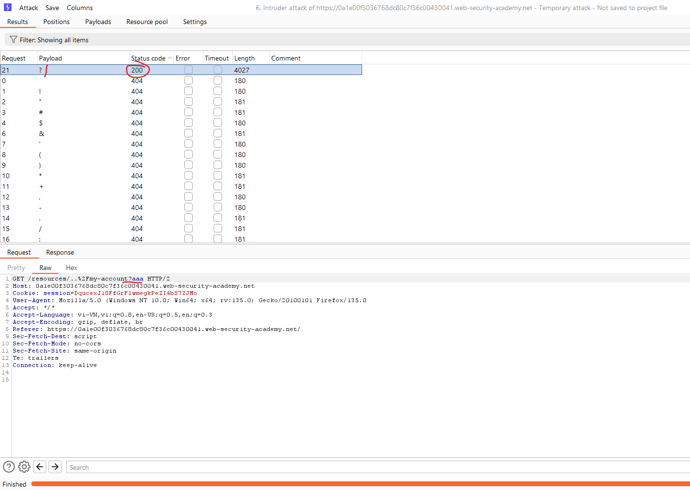

Vậy ở đây URl cuối dạng:

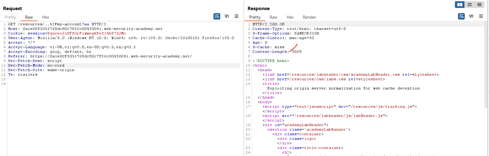

```js
<script>
document.location='https://0a1e00f3036768dc80c7f36c00430041.web-security-academy.net/resources/..%2Fmy-account?aa';
</script>
```

Gửi cho victim và request lại url để nhận cache:

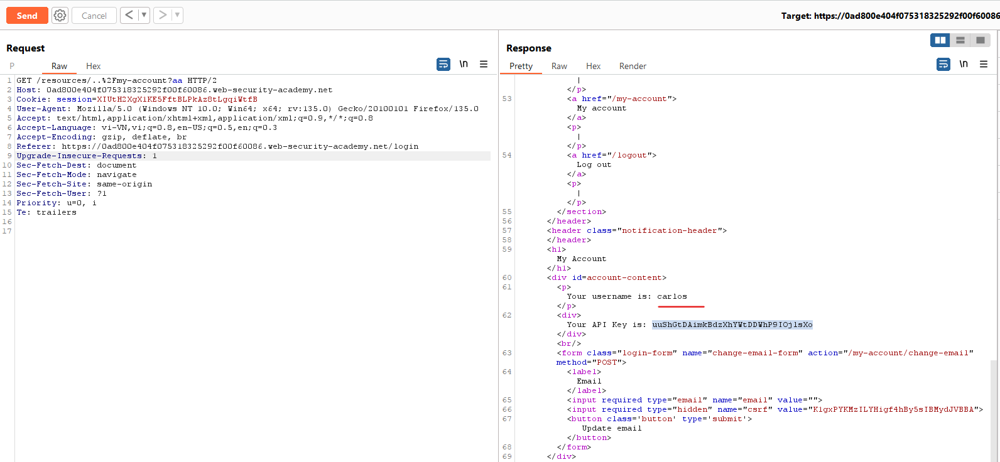

---

### Exploiting normalization by the cache server

Nếu máy chủ bộ nhớ đệm giải quyết được các phân đoạn chấm được mã hóa nhưng máy chủ gốc thì không, bạn có thể thử khai thác sự khác biệt này bằng cách xây dựng một tải trọng theo cấu trúc sau:

```
/<dynamic-path>%2f%2e%2e%2f<static-directory-prefix>
```

Note: Khi khai thác chuẩn hóa của máy chủ bộ nhớ đệm, hãy mã hóa tất cả các ký tự trong chuỗi đường dẫn. Việc sử dụng các ký tự được mã hóa giúp tránh hành vi không mong muốn khi sử dụng dấu phân cách và không cần phải có dấu gạch chéo chưa mã hóa theo sau tiền tố thư mục tĩnh vì bộ nhớ đệm sẽ xử lý việc giải mã.

Trong tình huống này, chỉ riêng việc duyệt đường dẫn là không đủ để khai thác. Ví dụ, hãy xem xét cách bộ nhớ đệm và máy chủ gốc diễn giải tải trọng `/profile%2f%2e%2e%2fstatic`:

- Bộ nhớ đệm diễn giải đường dẫn như sau: `/static`
- Máy chủ gốc diễn giải đường dẫn như sau: `/profile%2f%2e%2e%2fstatic`

Máy chủ gốc có thể sẽ trả về thông báo lỗi thay vì thông tin hồ sơ.

Để khai thác sự khác biệt này, bạn cũng cần xác định một dấu phân cách được máy chủ gốc sử dụng nhưng không phải bộ đệm. Kiểm tra các dấu phân cách có thể bằng cách thêm chúng vào tải trọng sau đường dẫn động:

- Nếu máy chủ gốc sử dụng dấu phân cách, nó sẽ cắt bớt đường dẫn URL và trả về thông tin động.
- Nếu bộ nhớ đệm không sử dụng dấu phân cách, nó sẽ giải quyết đường dẫn và lưu trữ phản hồi.

Ví dụ, hãy xem xét payload `/profile;%2f%2e%2e%2fstatic`. Máy chủ gốc sử dụng `;` làm dấu phân cách:

- Bộ nhớ đệm diễn giải đường dẫn như sau: `/static`
- Máy chủ gốc diễn giải đường dẫn như sau: `/profile`

Máy chủ gốc trả về thông tin hồ sơ động được lưu trữ trong bộ nhớ đệm. Do đó, bạn có thể sử dụng tải trọng này để khai thác.

---

### Ví dụ: Exploiting cache server normalization for web cache deception

https://portswigger.net/web-security/web-cache-deception/lab-wcd-exploiting-cache-server-normalization

Tìm kí tự phân tách:

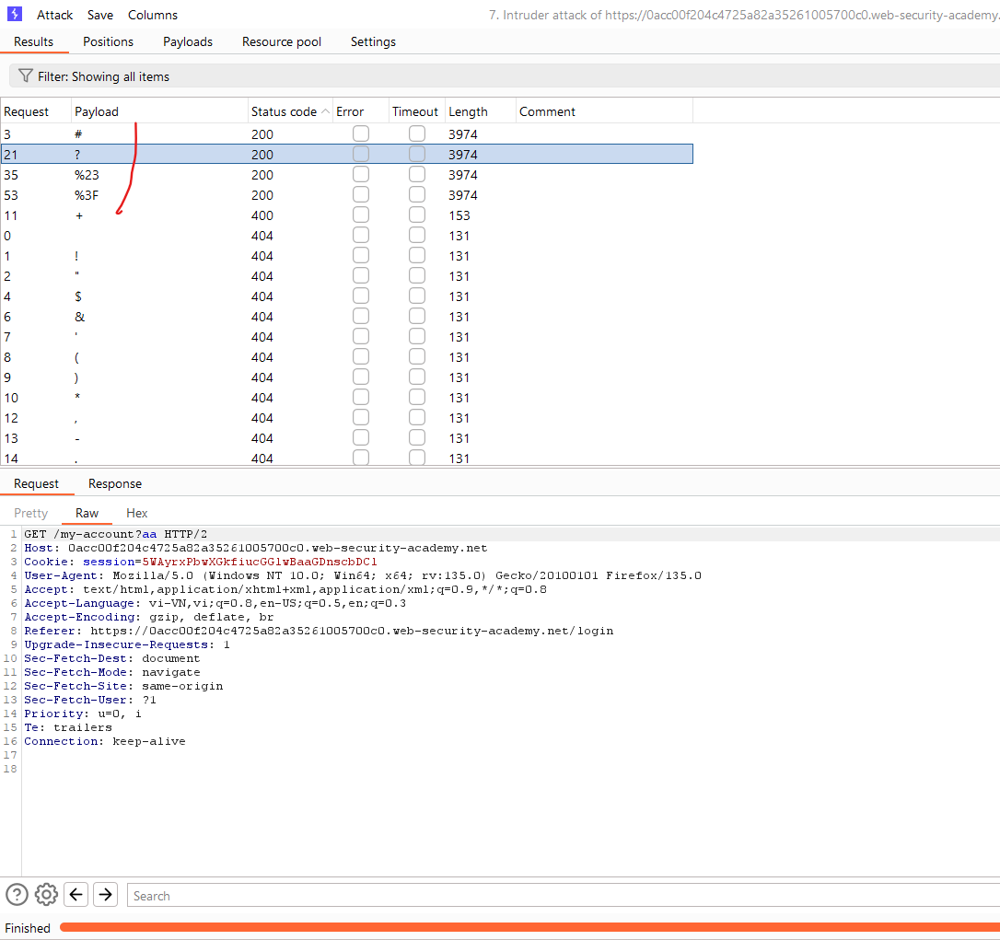

Thử kí tự `../` ta thấy máy chủ cuối trả về 404 chứng tỏ nó không phân giải ra nhưng nếu dùng cho `aa/../resources` thì nó sẽ hiểu vì nó phân giải được `../` và tìm đến `/resources` được lưu tĩnh trong cache vì trả về `miss`

Từ đây với request: `https://0acc00f204c4725a82a35261005700c0.web-security-academy.net/my-account%23%2f%2e%2e%2fresources?abc`


Ta thấy máy chủ cuối sẽ hiểu và trả về `/my-account` vì sau đó có kí tự phân tách

Còn cache hiểu đây là `/resources` nên sẽ lưu vào cache

---

## Exploiting file name cache rules (Quy tắc tên tệp)

Một số tệp như `robots.txt`, `index.html` và `favicon.ico` là những tệp phổ biến được tìm thấy trên máy chủ web. Chúng thường được lưu vào bộ nhớ đệm do ít thay đổi. Quy tắc bộ nhớ đệm nhắm mục tiêu vào các tệp này bằng cách khớp với chuỗi tên tệp chính xác.

Để xác định xem có quy tắc bộ nhớ đệm tên tệp hay không, hãy gửi yêu cầu GET cho một tệp có thể và xem phản hồi có được lưu vào bộ nhớ đệm hay không.

### Detecting normalization discrepancies (Phát hiện sự khác biệt)

Để kiểm tra cách bộ nhớ đệm chuẩn hóa đường dẫn URL, hãy gửi yêu cầu với trình tự duyệt đường dẫn và thư mục tùy ý trước tên tệp. Ví dụ: `/aaa%2f%2e%2e%2findex.html`:

- Nếu phản hồi được lưu vào bộ nhớ đệm, điều này cho biết bộ nhớ đệm sẽ chuẩn hóa đường dẫn đến `/index.html`.

- Nếu phản hồi không được lưu vào bộ nhớ đệm, điều này cho biết bộ nhớ đệm không giải mã dấu gạch chéo và phân giải đoạn chấm, diễn giải đường dẫn là `/profile%2f%2e%2e%2findex.html`.

### Exploiting normalization discrepancies (Khai thác)

Vì phản hồi chỉ được lưu vào bộ nhớ đệm nếu yêu cầu khớp với tên tệp chính xác, nên bạn chỉ có thể khai thác sự khác biệt khi máy chủ bộ nhớ đệm giải quyết các phân đoạn chấm được mã hóa, nhưng máy chủ gốc thì không. Sử dụng cùng phương pháp như đối với quy tắc bộ đệm thư mục tĩnh - chỉ cần thay thế tiền tố thư mục tĩnh bằng tên tệp.

---

### Ví dụ: Exploiting exact-match cache rules for web cache deception

https://portswigger.net/web-security/web-cache-deception/lab-wcd-exploiting-exact-match-cache-rules

Path `/robots.txt` được lưu vào cache:

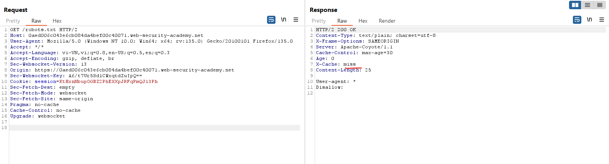

Thử với `aa/../robots.txt` nhận 200 nhưng vẫn có `miss` chứng tỏ máy chủ gốc ko phân giải nhưng cache vẫn nhận đây là tệp tĩnh:

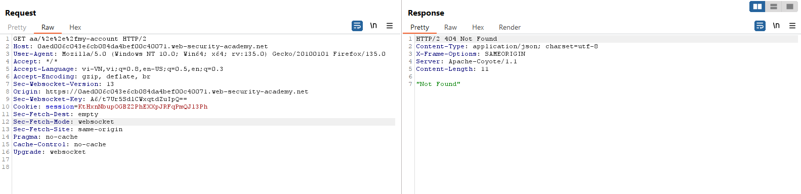


Tìm kí tự phân tách: dùng intruder như cũ ta tìm được `?` và `;`

Dùng với đường dẫn `/my-account?%2f%2e%2e%2frobots.txt` và `/my-account;%2f%2e%2e%2frobots.txt` ta đều nhận được mã 200 và nhận thấy khi dùng với `;` sẽ trả về được lưu trong cache còn `?` thì không:

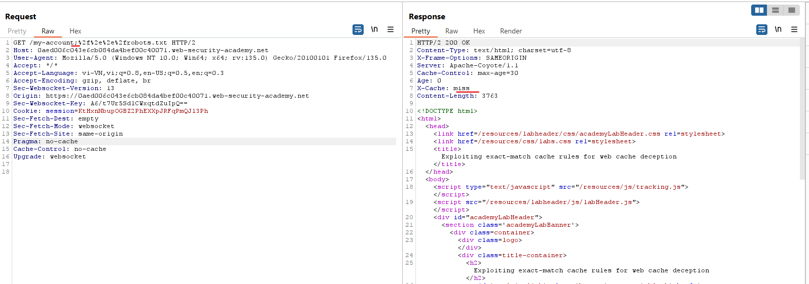

Dùng để ăn cắp token của admin:

`<script>document.location="https://YOUR-LAB-ID.web-security-academy.net/my-account;%2f%2e%2e%2frobots.txt?wcd"</script>`

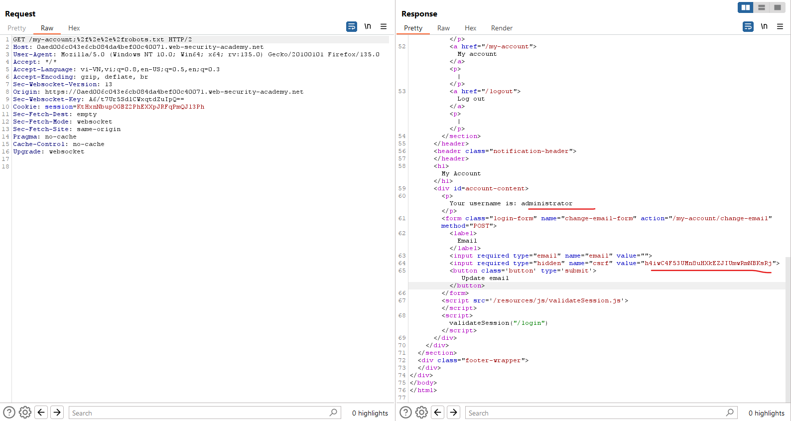

Tạo payload csrf:

```html
<html>
  <!-- CSRF PoC - generated by Burp Suite Professional -->
  <body>
    <form action="https://0aed006c043e6cb084da4bef00c40071.web-security-academy.net/my-account/change-email" method="POST">
      <input type="hidden" name="email" value="abc11111d&#64;gmail&#46;net" />  <!--cần 1 mail mới chưa sử dụng-->
      <input type="hidden" name="csrf" value="h4iwC4F53UMn8uHXkEZJIUmwRmNBKsRj" /> <!--của admin-->
      <input type="submit" value="Submit request" />
    </form>
    <script>
      history.pushState('', '', '/');
      document.forms[0].submit();
    </script>
  </body>
</html>
```

---

# Preventing web cache deception vulnerabilities

Bạn có thể thực hiện một số bước sau để ngăn chặn lỗ hổng lừa đảo bộ nhớ đệm web:

- Luôn sử dụng tiêu đề `Cache-Control` để đánh dấu các tài nguyên động, thiết lập bằng chỉ thị `no-store` và `private`.
- Cấu hình cài đặt CDN của bạn để các quy tắc lưu trữ đệm không ghi đè lên tiêu đề `Cache-Control`.
- Kích hoạt mọi biện pháp bảo vệ mà CDN của bạn có để chống lại các cuộc tấn công lừa đảo bộ nhớ đệm web. Nhiều CDN cho phép bạn đặt quy tắc bộ nhớ đệm để xác minh rằng `Content-Type` phản hồi khớp với phần mở rộng tệp URL của yêu cầu. Ví dụ: Cache Deception Armor của Cloudflare.
- Xác minh rằng không có bất kỳ sự khác biệt nào giữa cách máy chủ gốc và bộ nhớ đệm diễn giải đường dẫn URL.


