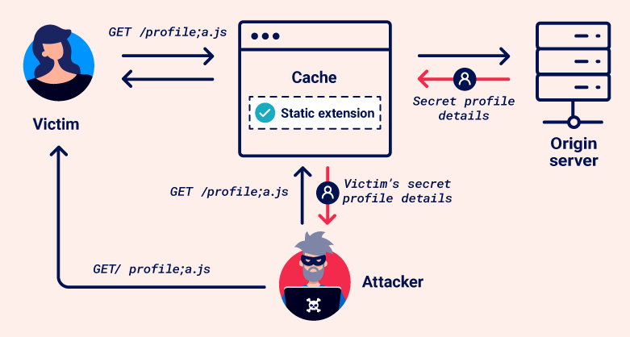

# Web cache deception
Web cache deception là một lỗ hổng cho phép kẻ tấn công lừa bộ đệm web lưu trữ nội dung động, nhạy cảm. Nguyên nhân là do sự khác biệt giữa cách máy chủ bộ đệm và máy chủ gốc xử lý các yêu cầu.\
Trong một cuộc tấn công lừa đảo bộ đệm web, kẻ tấn công thuyết phục nạn nhân truy cập một URL độc hại, khiến trình duyệt của nạn nhân đưa ra yêu cầu không an toàn về nội dung nhạy cảm. Bộ đệm hiểu sai đây là yêu cầu về tài nguyên tĩnh và lưu trữ phản hồi. Sau đó, kẻ tấn công có thể yêu cầu cùng một URL để truy cập phản hồi được lưu trong bộ nhớ đệm, giành quyền truy cập trái phép vào thông tin cá nhân.\

**Lưu ý** Điều quan trọng là phải phân biệt hành vi lừa đảo trong bộ nhớ đệm web với việc đầu độc bộ nhớ đệm web. Mặc dù cả hai đều khai thác cơ chế bộ nhớ đệm nhưng chúng thực hiện theo những cách khác nhau:
- Web cache poisoning thao túng các cache keys để đưa nội dung độc hại vào phản hồi được lưu trong bộ nhớ đệm, sau đó phản hồi này sẽ được cung cấp cho những người dùng khác.
- Web cache deception khai thác các quy tắc bộ đệm để lừa bộ đệm lưu trữ nội dung nhạy cảm hoặc riêng tư mà kẻ tấn công sau đó có thể truy cập.

## Web caches
Web caches là một hệ thống nằm giữa máy chủ gốc và người dùng. Khi khách hàng yêu cầu tài nguyên tĩnh, trước tiên yêu cầu sẽ được chuyển đến bộ nhớ đệm. Nếu bộ đệm không chứa bản sao của tài nguyên (được gọi là thiếu bộ đệm), yêu cầu sẽ được chuyển tiếp đến máy chủ gốc để xử lý và phản hồi yêu cầu. Phản hồi sau đó sẽ được gửi đến bộ đệm trước khi gửi cho người dùng. Bộ đệm sử dụng một bộ quy tắc được cấu hình sẵn để xác định xem có lưu trữ phản hồi hay không.\
Khi một yêu cầu đối với cùng một tài nguyên tĩnh được thực hiện trong tương lai, bộ đệm sẽ phân phát bản sao phản hồi được lưu trữ trực tiếp cho người dùng (được gọi là lần truy cập bộ đệm).\

Bộ nhớ đệm đã trở thành một khía cạnh phổ biến và quan trọng trong việc phân phối nội dung web, đặc biệt với việc sử dụng rộng rãi Mạng phân phối nội dung (Content Delivery Networks - CDN), sử dụng bộ nhớ đệm để lưu trữ bản sao nội dung trên các máy chủ phân tán trên toàn thế giới. CDN tăng tốc độ phân phối bằng cách cung cấp nội dung từ máy chủ gần người dùng nhất, giảm thời gian tải bằng cách giảm thiểu khoảng cách di chuyển dữ liệu.
### Cache keys
Khi bộ đệm nhận được yêu cầu HTTP, nó phải quyết định xem có phản hồi nào được lưu trong bộ nhớ đệm mà nó có thể phục vụ trực tiếp hay không hoặc liệu nó có phải chuyển tiếp yêu cầu đến máy chủ gốc hay không. Bộ đệm đưa ra quyết định này bằng cách tạo 'cache key' từ các thành phần của yêu cầu HTTP. Thông thường, điều này bao gồm đường dẫn URL và tham số truy vấn, nhưng nó cũng có thể bao gồm nhiều thành phần khác như tiêu đề và loại nội dung.\
Nếu cache key của yêu cầu đến khớp với khóa của yêu cầu trước đó thì bộ đệm sẽ coi chúng là tương đương và cung cấp bản sao của phản hồi được lưu trong bộ nhớ đệm.
### Cache rules
Cache rules xác định **những gì có thể được lưu vào bộ đệm** và **trong bao lâu**. Cache rules thường được thiết lập để lưu trữ tài nguyên tĩnh, thường không thay đổi thường xuyên và được sử dụng lại trên nhiều trang. Nội dung động không được lưu vào bộ nhớ đệm vì có nhiều khả năng chứa thông tin nhạy cảm, đảm bảo người dùng nhận được dữ liệu mới nhất trực tiếp từ máy chủ.\
Các cuộc tấn công lừa đảo bộ đệm web khai thác cách áp dụng các quy tắc bộ đệm, vì vậy điều quan trọng là phải biết về một số loại quy tắc khác nhau, đặc biệt là các quy tắc dựa trên các chuỗi được xác định trong đường dẫn URL của yêu cầu. Ví dụ:
- Quy tắc mở rộng tệp tĩnh - Các quy tắc này khớp với phần mở rộng tệp của tài nguyên được yêu cầu, ví dụ: `.css` cho biểu định kiểu hoặc `.js` cho tệp JavaScript.
- Quy tắc thư mục tĩnh - Các quy tắc này khớp với tất cả các đường dẫn URL bắt đầu bằng tiền tố cụ thể. Chúng thường được sử dụng để nhắm mục tiêu các thư mục cụ thể chỉ chứa tài nguyên tĩnh, ví dụ `/static` hoặc `/assets`
- Quy tắc tên tệp - Các quy tắc này khớp tên tệp cụ thể với các tệp mục tiêu được yêu cầu phổ biến cho hoạt động web và hiếm khi thay đổi, chẳng hạn như `robots.txt` và `favicon.ico`

Bộ nhớ đệm cũng có thể triển khai các quy tắc tùy chỉnh dựa trên các tiêu chí khác, chẳng hạn như tham số URL hoặc phân tích động.

## Constructing a web cache deception attack
Nói chung, việc xây dựng một cuộc tấn công lừa đảo bộ đệm web cơ bản bao gồm các bước sau:
- Xác định endpoint mục tiêu trả về phản hồi động chứa thông tin nhạy cảm. Xem lại phản hồi trong Burp vì một số thông tin nhạy cảm có thể không hiển thị trên trang được hiển thị. Tập trung vào các điểm cuối hỗ trợ các phương thức `GET`, `HEAD` hoặc `OPTIONS` vì các yêu cầu thay đổi trạng thái của máy chủ gốc thường không được lưu vào bộ đệm.
- Xác định sự khác biệt trong cách bộ đệm và máy chủ gốc phân tích đường dẫn URL. Đây có thể là sự khác biệt trong cách họ:
    - Ánh xạ URL tới tài nguyên.
    - Ký tự phân cách quy trình.
    - Bình thường hóa đường dẫn.
- Tạo một URL độc hại sử dụng sự khác biệt để đánh lừa bộ đệm lưu trữ phản hồi động. Khi nạn nhân truy cập URL, phản hồi của họ sẽ được lưu trong bộ đệm. Khi sử dụng Burp, bạn có thể gửi yêu cầu tới cùng một URL để tìm nạp phản hồi được lưu trong bộ nhớ đệm chứa dữ liệu của nạn nhân. Tránh thực hiện việc này trực tiếp trong trình duyệt vì một số ứng dụng chuyển hướng người dùng mà không có phiên hoặc làm mất hiệu lực dữ liệu cục bộ, điều này có thể che giấu lỗ hổng.

Chúng ta sẽ khám phá một số cách tiếp cận khác nhau để xây dựng một cuộc tấn công lừa đảo bộ đệm web.
### Using a cache buster
Trong khi kiểm tra sự khác biệt và thực hiện khai thác lừa đảo bộ đệm web, hãy đảm bảo rằng mỗi yêu cầu bạn gửi có một khóa bộ đệm khác nhau. Nếu không, bạn có thể nhận được các phản hồi được lưu trong bộ nhớ đệm, điều này sẽ ảnh hưởng đến kết quả kiểm tra của bạn.\
Vì cả đường dẫn URL và mọi tham số truy vấn thường được bao gồm trong khóa bộ nhớ đệm nên bạn có thể thay đổi khóa bằng cách thêm chuỗi truy vấn vào đường dẫn và thay đổi chuỗi đó mỗi lần bạn gửi yêu cầu. Tự động hóa quá trình này bằng cách sử dụng tiện ích mở rộng` Param Miner`.Để thực hiện việc này, sau khi bạn đã cài đặt tiện ích mở rộng, hãy nhấp vào menu the top-level **Param miner** > **Settings**, sau đó chọn **Add dynamic cachebuster**. Burp hiện thêm một chuỗi truy vấn duy nhất vào mọi yêu cầu bạn thực hiện. Bạn có thể xem các chuỗi truy vấn đã thêm trong tab `Logger`.
### Detecting cached responses
Trong quá trình thử nghiệm, điều quan trọng là bạn có thể xác định được các phản hồi được lưu trong bộ nhớ đệm. Để làm như vậy, hãy xem tiêu đề phản hồi và thời gian phản hồi.\
Các tiêu đề phản hồi khác nhau có thể cho biết rằng nó đã được lưu vào bộ nhớ đệm. Ví dụ:
- Tiêu đề `X-Cache` cung cấp thông tin về việc liệu phản hồi có được cung cấp từ bộ đệm hay không. Các giá trị điển hình bao gồm:
    - `X-Cache: hit` - Phản hồi được cung cấp từ bộ đệm.
    - `X-Cache: miss` - Bộ đệm không chứa phản hồi cho khóa của yêu cầu nên nó đã được tìm nạp từ máy chủ gốc. Trong hầu hết các trường hợp, phản hồi sau đó sẽ được lưu vào bộ nhớ đệm. Để xác nhận điều này, hãy gửi lại yêu cầu để xem liệu giá trị có cập nhật hay không.
    - `X-Cache: dynamic` - Máy chủ gốc tự động tạo nội dung. Nói chung điều này có nghĩa là phản hồi không phù hợp để lưu vào bộ nhớ đệm.
    - `X-Cache: refresh` - Nội dung được lưu trong bộ nhớ đệm đã lỗi thời và cần được làm mới hoặc xác thực lại.
- Tiêu đề `Cache-Control` có thể bao gồm một lệnh cho biết bộ nhớ đệm, như `pulic` với `max-age` cao hơn `0`. Lưu ý rằng điều này chỉ gợi ý rằng tài nguyên có thể lưu vào bộ đệm. Nó không phải lúc nào cũng biểu thị bộ đệm, vì bộ đệm đôi khi có thể ghi đè tiêu đề này.

Nếu bạn nhận thấy sự khác biệt lớn về thời gian phản hồi cho cùng một yêu cầu, điều này cũng có thể cho thấy rằng bộ nhớ đệm cung cấp phản hồi nhanh hơn.
## Exploiting static extension cache rules
Quy tắc bộ đệm thường nhắm mục tiêu các tài nguyên tĩnh bằng cách khớp các phần mở rộng tệp phổ biến như `.css` hoặc `.js`. Đây là hành vi mặc định trong hầu hết các CDN.\
Nếu có sự khác biệt về cách bộ đệm và máy chủ gốc ánh xạ đường dẫn URL tới tài nguyên hoặc sử dụng dấu phân cách, kẻ tấn công có thể tạo yêu cầu đối với tài nguyên động có tiện ích mở rộng tĩnh bị máy chủ gốc bỏ qua nhưng được bộ đệm xem .
### Path mapping discrepancies
Ánh xạ đường dẫn URL là quá trình liên kết đường dẫn URL với tài nguyên trên máy chủ, chẳng hạn như tệp, tập lệnh hoặc thực thi lệnh. Có nhiều kiểu ánh xạ khác nhau được sử dụng bởi các khung và công nghệ khác nhau. Hai kiểu phổ biến là ánh xạ URL truyền thống và ánh xạ URL RESTful.\
Ánh xạ URL truyền thống biểu thị đường dẫn trực tiếp đến tài nguyên nằm trên hệ thống tệp. Đây là một ví dụ điển hình:\
`http://example.com/path/in/filesystem/resource.html`\
- `http://example.com` trỏ đến máy chủ.
- `/path/in/filesystem/` đại diện cho đường dẫn thư mục trong hệ thống tệp của máy chủ.
- `resource.html` là tệp cụ thể đang được truy cập.

Ngược lại, các URL kiểu REST không khớp trực tiếp với cấu trúc tệp vật lý. Họ trừu tượng hóa các đường dẫn tệp thành các phần logic của API:\
`http://example.com/path/resource/param1/param2`\
- `http://example.com` trỏ đến máy chủ.
- `/path/resource/` là điểm cuối đại diện cho tài nguyên.
- `param1` và `param2` là các tham số đường dẫn được máy chủ sử dụng để xử lý yêu cầu.

Sự khác biệt trong cách bộ đệm và máy chủ gốc ánh xạ đường dẫn URL tới tài nguyên có thể dẫn đến lỗ hổng đánh lừa bộ đệm web. Hãy xem xét ví dụ sau:\
`http://example.com/user/123/profile/wcd.css`\
- Máy chủ gốc sử dụng ánh xạ URL kiểu REST có thể hiểu đây là yêu cầu cho điểm cuối `/user/123/profile` và trả về thông tin hồ sơ cho người dùng `123`, bỏ qua `wcd.css` như một tham số không quan trọng.
- Bộ nhớ đệm sử dụng ánh xạ URL truyền thống có thể xem đây là yêu cầu đối với tệp có tên `wcd.css` nằm trong thư mục `/profile` bên dưới `/user/123`. Nó diễn giải đường dẫn URL là `/user/123/profile/wcd.css`. Nếu bộ nhớ đệm được định cấu hình để lưu trữ phản hồi cho các yêu cầu có đường dẫn kết thúc bằng `.css`, thì nó sẽ lưu vào bộ nhớ đệm và cung cấp thông tin hồ sơ như thể đó là một tệp `CSS`.
### Exploiting path mapping discrepancies
Để kiểm tra cách máy chủ gốc ánh xạ đường dẫn URL tới tài nguyên, hãy thêm một đoạn đường dẫn tùy ý vào URL của điểm cuối mục tiêu của bạn. Nếu phản hồi vẫn chứa dữ liệu nhạy cảm giống như phản hồi cơ sở, điều đó cho biết máy chủ gốc trừu tượng hóa đường dẫn URL và bỏ qua phân đoạn được thêm vào. Ví dụ: đây là trường hợp nếu sửa đổi `/api/orders/123` thành `/api/orders/123/foo` vẫn trả về thông tin đơn hàng.\
Để kiểm tra cách bộ đệm ánh xạ đường dẫn URL tới tài nguyên, bạn cần sửa đổi đường dẫn để cố gắng khớp quy tắc bộ đệm bằng cách thêm tiện ích mở rộng tĩnh. Ví dụ: cập nhật `/api/orders/123/foo` thành `/api/orders/123/foo.js`. Nếu phản hồi được lưu vào bộ nhớ đệm, điều này cho biết:
- Bộ đệm đó diễn giải đường dẫn URL đầy đủ với phần mở rộng tĩnh.
- Rằng có một quy tắc bộ đệm để lưu trữ phản hồi cho các yêu cầu kết thúc bằng `.js`

