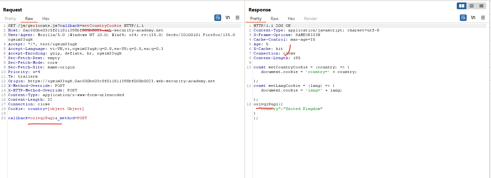

# Exploiting cache implementation flaws

Một số hệ thống cache bỏ qua các tham số nhất định trong URL hoặc header (như query string). Hacker có thể tận dụng điều này để chèn payload độc hại.

# Cache key flaws

Các trang web lấy hầu hết dữ liệu đầu vào từ URL và chuỗi truy vấn. Do đó, đây là bề mặt tấn công được sử dụng rộng rãi cho nhiều kỹ thuật hack khác nhau. 

Tuy nhiên, vì request thường là một phần để đánh giá lưu vào cache nên các đầu vào này theo truyền thống không được coi là phù hợp để đầu độc bộ đệm. Bất kỳ dữ liệu nào được đưa vào thông qua các key input sẽ hoạt động như cache buster, nghĩa là mục bộ đệm bị nhiễm độc của bạn gần như chắc chắn sẽ không bao giờ được cung cấp cho bất kỳ người dùng nào khác.

Một số cache thực hiện "biến đổi" dữ liệu trước khi lưu:

- Bỏ qua query string.
- Loại bỏ tham số cụ thể.
- Chuẩn hóa dữ liệu.

Những thay đổi này có thể dẫn đến sự khác biệt giữa dữ liệu trong cache và dữ liệu mà ứng dụng xử lý, tạo cơ hội cho hacker.

# Cache probing methodology (Thăm dò cache)

Phương pháp thăm dò lỗi trên bộ nhớ đệm có đôi chút khác biệt so với phương pháp đầu độc bộ nhớ đệm web cổ điển. Các kỹ thuật này dựa vào các lỗi trong việc triển khai và cấu hình cụ thể của bộ nhớ đệm, có thể thay đổi đáng kể tùy theo từng trang web. Điều này có nghĩa là bạn cần hiểu sâu hơn về bộ nhớ đệm mục tiêu và hành vi của nó.

Trong phần này, chúng ta sẽ phác thảo phương pháp cấp cao để thăm dò bộ nhớ đệm nhằm hiểu hành vi của nó và xác định mọi lỗi tiềm ẩn. Sau đó, chúng tôi sẽ cung cấp một số ví dụ cụ thể hơn về các lỗ hổng khóa bộ nhớ đệm phổ biến và cách bạn có thể khai thác chúng.

Phương pháp này bao gồm các bước sau:
- Xác định một bộ nhớ đệm oracle phù hợp
- Xử lý chìa khóa thăm dò
- Xác định một gadget có thể khai thác

## Identify a suitable cache oracle

Bước đầu tiên là xác định "cache oracle" phù hợp mà bạn có thể sử dụng để thử nghiệm. Cache oracle chỉ đơn giản là một trang hoặc endpoint cung cấp phản hồi về hành vi của cache. Điều này cần phải được lưu trong bộ nhớ đệm và phải chỉ ra theo một cách nào đó liệu bạn đã nhận được phản hồi được lưu trong bộ nhớ đệm hay phản hồi trực tiếp từ máy chủ. Phản hồi này có thể có nhiều dạng khác nhau, chẳng hạn như:

- Tiêu đề HTTP cho bạn biết rõ ràng liệu bạn có bị truy cập bộ nhớ đệm hay không
- Những thay đổi có thể quan sát được đối với nội dung động
- Thời gian phản hồi khác biệt

Trong điều kiện lý tưởng, bộ nhớ đệm cũng sẽ phản ánh toàn bộ URL và ít nhất một tham số truy vấn trong phản hồi. Điều này sẽ giúp dễ dàng nhận thấy sự khác biệt khi phân tích cú pháp giữa bộ nhớ đệm và ứng dụng, điều này sẽ hữu ích cho việc xây dựng các khai thác khác nhau sau này.

Nếu bạn có thể xác định rằng một bộ nhớ đệm của bên thứ ba cụ thể đang được sử dụng, bạn cũng có thể tham khảo tài liệu tương ứng. Tài liệu này có thể chứa thông tin về cách xây dựng khóa bộ nhớ đệm mặc định. Bạn thậm chí có thể tình cờ tìm thấy một số mẹo và thủ thuật hữu ích, chẳng hạn như các tính năng cho phép bạn xem trực tiếp khóa bộ nhớ đệm. Ví dụ, các trang web dựa trên Akamai có thể hỗ trợ tiêu đề `Pragma: akamai-x-get-cache-key`, mà bạn có thể sử dụng để hiển thị khóa bộ nhớ đệm trong tiêu đề phản hồi:

```http
GET /?param=1 HTTP/1.1
Host: innocent-website.com
Pragma: akamai-x-get-cache-key

HTTP/1.1 200 OK
X-Cache-Key: innocent-website.com/?param=1
```

## Probe key handling

Bước tiếp theo là điều tra xem bộ nhớ đệm có thực hiện bất kỳ xử lý bổ sung nào cho dữ liệu đầu vào của bạn khi tạo khóa bộ nhớ đệm hay không. Bạn đang tìm kiếm một bề mặt tấn công bổ sung ẩn bên trong các thành phần có vẻ như được khóa.

Bạn nên xem xét cụ thể bất kỳ chuyển đổi nào đang diễn ra. Có bất kỳ thứ gì bị loại trừ khỏi thành phần có khóa khi nó được thêm vào khóa bộ nhớ đệm không? Các ví dụ phổ biến là loại trừ các tham số truy vấn cụ thể hoặc thậm chí toàn bộ chuỗi truy vấn và xóa cổng khỏi tiêu đề `Host`.

Nếu bạn đủ may mắn để có quyền truy cập trực tiếp vào khóa bộ nhớ đệm, bạn có thể dễ dàng so sánh khóa sau khi đưa vào nhiều dữ liệu đầu vào khác nhau. Nếu không, bạn có thể sử dụng hiểu biết của mình về oracle bộ nhớ đệm để suy ra liệu bạn có nhận được phản hồi được lưu trong bộ nhớ đệm đúng hay không. Đối với mỗi trường hợp bạn muốn kiểm tra, bạn gửi hai yêu cầu tương tự và so sánh các phản hồi.

Giả sử rằng bộ nhớ đệm oracle giả định của chúng ta là trang chủ của trang web mục tiêu. Bộ nhớ đệm này tự động chuyển hướng người dùng đến một trang cụ thể theo vùng. Bộ nhớ đệm này sử dụng tiêu đề `Host` để tạo tiêu đề `Location` một cách động trong phản hồi:

```http
GET / HTTP/1.1
Host: vulnerable-website.com

HTTP/1.1 302 Moved Permanently
Location: https://vulnerable-website.com/en
Cache-Status: miss
```

Để kiểm tra xem cổng có bị loại trừ khỏi khóa bộ đệm hay không, trước tiên chúng ta cần yêu cầu một cổng tùy ý và đảm bảo rằng chúng ta nhận được phản hồi mới từ máy chủ phản ánh thông tin đầu vào này:

```http
GET / HTTP/1.1
Host: vulnerable-website.com:1337

HTTP/1.1 302 Moved Permanently
Location: https://vulnerable-website.com:1337/en
Cache-Status: miss
```

Tiếp theo, chúng ta sẽ gửi một yêu cầu khác, nhưng lần này chúng ta sẽ không chỉ định cổng:

```http
GET / HTTP/1.1
Host: vulnerable-website.com

HTTP/1.1 302 Moved Permanently
Location: https://vulnerable-website.com:1337/en
Cache-Status: hit
```

Như bạn có thể thấy, chúng tôi đã được phục vụ phản hồi được lưu trong bộ nhớ đệm mặc dù tiêu đề `Host` trong yêu cầu không chỉ định cổng. Điều này chứng tỏ cổng đang bị loại trừ khỏi khóa bộ nhớ đệm. Điều quan trọng là tiêu đề đầy đủ vẫn được truyền vào mã ứng dụng và phản ánh trong phản hồi.

Tóm lại, mặc dù tiêu đề `Host` có khóa, cách nó được bộ đệm chuyển đổi cho phép chúng ta truyền tải dữ liệu vào ứng dụng trong khi vẫn giữ nguyên khóa bộ đệm "bình thường" sẽ được ánh xạ tới các yêu cầu của người dùng khác. Kiểu hành vi này chính là khái niệm then chốt đằng sau mọi hành vi khai thác mà chúng ta sẽ thảo luận trong phần này.

Bạn có thể sử dụng cách tiếp cận tương tự để điều tra bất kỳ quá trình xử lý nào khác của dữ liệu đầu vào của bạn bằng bộ nhớ đệm. Dữ liệu đầu vào của bạn có được chuẩn hóa theo bất kỳ cách nào không? Dữ liệu đầu vào của bạn được lưu trữ như thế nào? Bạn có nhận thấy bất thường nào không? Chúng tôi sẽ đề cập đến cách trả lời những câu hỏi này sau bằng các ví dụ cụ thể.

## Identify an exploitable gadget

Bây giờ, bạn đã hiểu khá rõ về cách bộ nhớ đệm của trang web mục tiêu hoạt động và có thể tìm thấy một số lỗi thú vị trong cách xây dựng khóa bộ nhớ đệm. Bước cuối cùng là xác định một gadget phù hợp mà bạn có thể liên kết với lỗ hổng khóa bộ nhớ đệm này. Đây là một kỹ năng quan trọng vì mức độ nghiêm trọng của bất kỳ cuộc tấn công đầu độc bộ nhớ đệm web nào đều phụ thuộc rất nhiều vào gadget mà bạn có thể khai thác.

Những gadget này thường là các lỗ hổng bảo mật cổ điển ở phía máy khách, chẳng hạn như XSS phản ánh và chuyển hướng mở. Bằng cách kết hợp những điều này với việc đầu độc bộ nhớ đệm web, bạn có thể tăng mức độ nghiêm trọng của các cuộc tấn công này lên đáng kể, biến lỗ hổng phản ánh thành lỗ hổng được lưu trữ. Thay vì phải dụ nạn nhân truy cập vào một URL được thiết kế đặc biệt, phần mềm độc hại của bạn sẽ tự động được gửi đến bất kỳ ai truy cập vào URL thông thường, hoàn toàn hợp pháp.

Có lẽ thú vị hơn nữa là các kỹ thuật này cho phép bạn khai thác một số lỗ hổng chưa được phân loại thường bị coi là "không thể khai thác" và không được vá. Điều này bao gồm việc sử dụng nội dung động trong các tệp tài nguyên và khai thác yêu cầu không đúng định dạng mà trình duyệt sẽ không bao giờ gửi.

# Exploiting cache key flaws

Bây giờ bạn đã quen với phương pháp cấp cao, hãy cùng xem xét một số lỗi khóa bộ nhớ đệm điển hình và cách bạn có thể khai thác chúng. Chúng tôi sẽ đề cập đến:

## Unkeyed port

Tiêu đề `Host` thường là một phần của khóa bộ đệm và do đó, ban đầu có vẻ không phải là ứng cử viên thích hợp để đưa bất kỳ loại tải trọng nào. Tuy nhiên, một số hệ thống bộ đệm sẽ phân tích tiêu đề và loại trừ cổng khỏi khóa bộ đệm.

Trong trường hợp này, bạn có thể sử dụng tiêu đề này để đầu độc bộ nhớ đệm web. Ví dụ, hãy xem xét trường hợp chúng ta đã thấy trước đó, trong đó URL chuyển hướng được tạo động dựa trên tiêu đề `Host`. Điều này có thể cho phép bạn xây dựng một cuộc tấn công từ chối dịch vụ chỉ bằng cách thêm một cổng tùy ý vào yêu cầu. Tất cả người dùng duyệt đến trang chủ sẽ được chuyển hướng đến một cổng dud, về cơ bản là hạ gục trang chủ cho đến khi bộ nhớ đệm hết hạn.

Kiểu tấn công này có thể leo thang hơn nữa nếu trang web cho phép bạn chỉ định một cổng không phải số. Ví dụ, bạn có thể sử dụng điều này để chèn một tải trọng XSS.

## Unkeyed query string

Giống như tiêu đề `Host`, dòng yêu cầu thường được khóa. Tuy nhiên, một trong những chuyển đổi khóa bộ nhớ đệm phổ biến nhất là loại trừ toàn bộ chuỗi truy vấn.

### Detecting an unkeyed query string

Nếu phản hồi cho bạn biết rõ ràng bạn có bị ảnh hưởng bởi bộ nhớ đệm hay không thì quá trình chuyển đổi này khá dễ phát hiện - nhưng nếu không thì sao? Điều này có tác dụng phụ là làm cho các trang động xuất hiện như thể chúng hoàn toàn tĩnh vì khó có thể biết liệu bạn đang giao tiếp với bộ nhớ đệm hay máy chủ.

Để xác định một trang động, thông thường bạn sẽ quan sát cách thay đổi giá trị tham số ảnh hưởng đến phản hồi như thế nào. Nhưng nếu chuỗi truy vấn không có khóa, hầu hết thời gian bạn vẫn sẽ nhận được một cú đánh vào bộ nhớ đệm và do đó phản hồi không thay đổi, bất kể bất kỳ tham số nào bạn thêm vào. Rõ ràng, điều này cũng làm cho các tham số truy vấn cache-buster cổ điển trở nên thừa thãi.

May mắn thay, có những cách thay thế để thêm cache buster, chẳng hạn như thêm nó vào một tiêu đề có khóa mà không ảnh hưởng đến hành vi của ứng dụng. Một số ví dụ điển hình bao gồm:

```http
Accept-Encoding: gzip, deflate, cachebuster
Accept: */*, text/cachebuster
Cookie: cachebuster=1
Origin: https://cachebuster.vulnerable-website.com
```

Nếu bạn sử dụng Param Miner, bạn cũng có thể chọn các tùy chọn "Add static/dynamic cache buster" và "Include cache busters in headers". Sau đó, nó sẽ tự động thêm bộ đệm phá khóa vào các tiêu đề có khóa chung trong bất kỳ yêu cầu nào bạn gửi bằng công cụ kiểm tra thủ công của Burp.

Một cách tiếp cận khác là xem liệu có bất kỳ sự khác biệt nào giữa cách bộ nhớ đệm và phần phụ trợ chuẩn hóa đường dẫn của yêu cầu hay không. Vì đường dẫn gần như chắc chắn sẽ có khóa, đôi khi bạn có thể lợi dụng điều này để đưa ra các yêu cầu có khóa khác nhau nhưng vẫn đến cùng một điểm cuối. Ví dụ, các mục sau đây có thể được lưu trữ riêng biệt nhưng được coi là tương đương với `GET /` ở phía sau:

Apache: `GET //`
Nginx: `GET /%2F`
PHP: `GET /index.php/xyz`
.NET `GET /(A(xyz)/`

Sự chuyển đổi này đôi khi có thể che giấu những lỗ hổng XSS dễ thấy. Nếu người kiểm tra xâm nhập hoặc máy quét tự động chỉ nhận được phản hồi được lưu trong bộ nhớ đệm mà không nhận ra, có thể sẽ xuất hiện như thể không có lỗi XSS nào được phản ánh trên trang.

### Exploiting an unkeyed query string

Việc loại trừ chuỗi truy vấn khỏi khóa bộ đệm thực sự có thể khiến các lỗ hổng XSS phản ánh này trở nên nghiêm trọng hơn.

Thông thường, một cuộc tấn công như vậy sẽ dựa vào việc dụ nạn nhân truy cập vào một URL được tạo ra một cách độc hại. Tuy nhiên, việc đầu độc bộ nhớ đệm thông qua chuỗi truy vấn không có khóa sẽ khiến dữ liệu được phục vụ cho người dùng truy cập vào một URL hoàn toàn bình thường. Điều này có khả năng tác động đến nhiều nạn nhân hơn mà không cần sự tương tác thêm từ kẻ tấn công.

---

### Ví dụ: Web cache poisoning via an unkeyed query string

https://portswigger.net/web-security/web-cache-poisoning/exploiting-implementation-flaws/lab-web-cache-poisoning-unkeyed-query

Khi gửi query và nhận được response đã lưu vào cache:


Và khi thêm query thì ta thấy nó vẫn lấy cache cũ để response:


Điều này chứng tỏ query không ảnh hưởng đến cache


Ngoài ra nó còn được phản ảnh trong response

Và khi thay bằng query: `/?evil='/><script>alert(1)</script>`


Ta thấy nó được thêm vào js và có thể thực thi js

---

## Unkeyed query parameters

Một số trang web sẽ chỉ lưu vào cache nếu parameter được khai báo. Các tham số UTM như `utm_content` là những ứng cử viên tốt để kiểm tra trong quá trình thử nghiệm.

Các tham số đã bị loại khỏi khóa bộ đệm khó có thể có tác động đáng kể đến phản hồi. Có khả năng là sẽ không có gadget hữu ích nào chấp nhận dữ liệu đầu vào từ các tham số này. Tuy nhiên, một số trang xử lý toàn bộ URL theo cách dễ bị tấn công, khiến có thể khai thác các tham số tùy ý.

---

### Ví dụ: Web cache poisoning via an unkeyed query parameter

https://portswigger.net/web-security/web-cache-poisoning/exploiting-implementation-flaws/lab-web-cache-poisoning-unkeyed-param

Chạy `Param miner` ta nhận được param ẩn:


Từ đây ta có thể inject vào param này:


---

## Cache parameter cloaking

Nếu bộ nhớ đệm bỏ qua một tham số vô hại khỏi khóa bộ nhớ đệm và bạn không thể tìm thấy bất kỳ gadget nào có thể khai thác dựa trên URL đầy đủ, bạn có thể nghĩ rằng mình đã đến ngõ cụt. Tuy nhiên, đây thực sự là nơi mọi thứ có thể trở nên thú vị.

Nếu bạn có thể tìm ra cách bộ nhớ đệm phân tích cú pháp URL để xác định và loại bỏ các tham số không mong muốn, bạn có thể tìm thấy một số điểm kỳ lạ thú vị. Điều đặc biệt quan tâm là bất kỳ sự khác biệt nào về phân tích cú pháp giữa bộ nhớ đệm và ứng dụng. Điều này có khả năng cho phép bạn lén đưa các tham số tùy ý vào logic ứng dụng bằng cách "che giấu" chúng trong một tham số bị loại trừ.

Ví dụ, tiêu chuẩn thực tế là một tham số sẽ được đặt trước dấu chấm hỏi (`?`) nếu đó là tham số đầu tiên trong chuỗi truy vấn hoặc dấu (`&`). Một số thuật toán phân tích cú pháp viết kém sẽ coi bất kỳ dấu `?` nào là phần bắt đầu của một tham số mới, bất kể đó có phải là tham số đầu tiên hay không.

Giả sử thuật toán loại trừ tham số khỏi khóa bộ nhớ đệm hoạt động theo cách này, nhưng thuật toán của máy chủ chỉ chấp nhận dấu `?` đầu tiên làm dấu phân cách. Hãy xem xét yêu cầu sau:

`GET /?example=123?excluded_param=bad-stuff-here`

Trong trường hợp này, bộ nhớ đệm sẽ xác định hai tham số và loại trừ tham số thứ hai khỏi khóa bộ nhớ đệm. Tuy nhiên, máy chủ không chấp nhận ký tự `?` thứ hai làm dấu phân cách mà chỉ nhìn thấy một tham số, `example`, có giá trị là toàn bộ phần còn lại của chuỗi truy vấn, bao gồm cả dữ liệu của chúng ta. Nếu giá trị của `example` được truyền vào một tiện ích hữu ích, chúng ta đã đưa thành công dữ liệu của mình vào mà không ảnh hưởng đến khóa bộ nhớ đệm.

### Exploiting parameter parsing quirks (Khai thác các điểm kì quặc)

Các vấn đề che giấu tham số tương tự có thể phát sinh trong trường hợp ngược lại, khi đó back-end xác định các tham số riêng biệt mà bộ đệm không xác định được. Ví dụ, khuôn khổ Ruby on Rails coi cả dấu (`&`) và dấu chấm phẩy (`;`) là dấu phân cách. Khi sử dụng kết hợp với bộ nhớ đệm không cho phép điều này, bạn có thể khai thác một điểm yếu khác để ghi đè giá trị của tham số có khóa trong logic ứng dụng.

Hãy xem xét yêu cầu sau:

`GET /?keyed_param=abc&excluded_param=123;keyed_param=bad-stuff-here`

Như tên gọi gợi ý, `keyed_param` được bao gồm trong khóa bộ nhớ đệm, nhưng `excluded_param` thì không. Nhiều bộ nhớ đệm sẽ chỉ diễn giải điều này thành hai tham số, được phân cách bằng dấu `&`:

- `keyed_param`=abc
- `excluded_param`=123;keyed_param=bad-stuff-here

Sau khi thuật toán phân tích cú pháp xóa `excluded_param`, khóa bộ nhớ đệm sẽ chỉ chứa `keyed_param=abc`. Tuy nhiên, ở phía sau, Ruby on Rails nhìn thấy dấu chấm phẩy (`;`) và chia chuỗi truy vấn thành ba tham số riêng biệt:

- `keyed_param=abc`
- `excluded_param=123`
- `keyed_param=bad-stuff-here`

Nhưng bây giờ có một `keyed_param` trùng lặp. Đây là nơi mà quirk thứ hai phát huy tác dụng. Nếu có các tham số trùng lặp, mỗi tham số có giá trị khác nhau, Ruby on Rails sẽ ưu tiên cho lần xuất hiện cuối cùng. Kết quả cuối cùng là khóa bộ nhớ đệm chứa một giá trị tham số mong đợi, vô hại, cho phép phản hồi được lưu trong bộ nhớ đệm được phục vụ bình thường cho những người dùng khác. Tuy nhiên, ở phía sau, cùng một tham số có giá trị hoàn toàn khác, đó là tải trọng được tiêm của chúng ta. Giá trị thứ hai này sẽ được truyền vào tiện ích và phản ánh trong phản hồi bị đầu độc.

Lỗ hổng này có thể đặc biệt nguy hiểm nếu nó cho phép bạn kiểm soát một hàm sẽ được thực thi. Ví dụ, nếu một trang web sử dụng JSONP để thực hiện yêu cầu liên miền, yêu cầu này thường sẽ chứa tham số `callback` để thực thi một hàm nhất định trên dữ liệu được trả về:

`GET /jsonp?callback=innocentFunction`

Trong trường hợp này, bạn có thể sử dụng các kỹ thuật này để ghi đè hàm gọi lại dự kiến ​​và thực thi JavaScript tùy ý thay thế.

---

### Ví dụ: Parameter cloaking

https://portswigger.net/web-security/web-cache-poisoning/exploiting-implementation-flaws/lab-web-cache-poisoning-param-cloaking

Tìm param ẩn bằng `param miner`: `utm_content`

Cloaking cache và back-end bằng query: `?callback=setCountryCookie&utm_content=foo;callback=alert(1)`


---

### Exploiting fat GET support

Trong một số trường hợp, phương thức HTTP có thể không phải khóa. Điều này có thể cho phép bạn đầu độc bộ nhớ đệm bằng yêu cầu `POST` chứa tải trọng độc hại trong phần body. Tải trọng của bạn sau đó thậm chí sẽ được phục vụ để phản hồi yêu cầu GET của người dùng. Mặc dù kịch bản này khá hiếm, nhưng đôi khi bạn có thể đạt được hiệu ứng tương tự bằng cách chỉ cần thêm nội dung vào yêu cầu `GET` để tạo ra yêu cầu `GET` "fat":

```http
GET /?param=innocent HTTP/1.1
…
param=bad-stuff-here
```

Trong trường hợp này, khóa bộ đệm sẽ dựa trên dòng yêu cầu, nhưng giá trị phía máy chủ của tham số sẽ được lấy từ phần thân.

Điều này chỉ khả thi nếu trang web chấp nhận các yêu cầu GET có nội dung, nhưng vẫn có giải pháp thay thế tiềm năng. Đôi khi bạn có thể khuyến khích xử lý "fat GET" bằng cách ghi đè phương thức HTTP, ví dụ:

```http
GET /?param=innocent HTTP/1.1
Host: innocent-website.com
X-HTTP-Method-Override: POST
…
param=bad-stuff-here
```

Miễn là tiêu đề `X-HTTP-Method-Override` không có khóa, bạn có thể gửi yêu cầu giả `POST` trong khi vẫn giữ nguyên khóa bộ đệm `GET` lấy từ dòng yêu cầu.

---

### Ví dụ: Web cache poisoning via a fat GET request

https://portswigger.net/web-security/web-cache-poisoning/exploiting-implementation-flaws/lab-web-cache-poisoning-fat-get

Tương tự chạy `param miner` ta được chuẩn đoán bài này có thể dùng fat GET:


Với bài này, cache buster là query nên query phải đúng:



Ta thấy nó đang được dùng giá trị ở phần body để xử lí hàm trong khi query vẫn đúng khi truy cập `/` và load `GET /js/geolocate.js?callback=setCountryCookie`

Thay bằng `alert()`:


Truy cập giống như khi vào home và được tải lại:


---

### Exploiting dynamic content in resource imports

Các tệp tài nguyên được import thường là tĩnh nhưng một số phản ánh đầu vào từ chuỗi truy vấn. Điều này phần lớn được coi là vô hại vì trình duyệt hiếm khi thực thi các tệp này khi xem trực tiếp và kẻ tấn công không thể kiểm soát các URL được sử dụng để tải các tài nguyên phụ của trang. Tuy nhiên, bằng cách kết hợp điều này với việc đầu độc bộ nhớ đệm web, đôi khi bạn có thể đưa nội dung vào tệp tài nguyên.

Ví dụ, hãy xem xét một trang phản ánh chuỗi truy vấn hiện tại trong câu lệnh nhập:

```http
GET /style.css?excluded_param=123);@import… HTTP/1.1

HTTP/1.1 200 OK
…
@import url(/site/home/index.part1.8a6715a2.css?excluded_param=123);@import…
```

Bạn có thể khai thác hành vi này để chèn mã CSS độc hại nhằm đánh cắp thông tin nhạy cảm từ bất kỳ trang nào nhập `/style.css`. 

Nếu trang nhập tệp CSS không chỉ định loại tài liệu, bạn thậm chí có thể khai thác các tệp CSS tĩnh. Với cấu hình phù hợp, trình duyệt sẽ chỉ cần tìm kiếm tài liệu để tìm CSS rồi thực thi. Điều này có nghĩa là đôi khi bạn có thể làm hỏng các tệp CSS tĩnh bằng cách kích hoạt lỗi máy chủ phản ánh tham số truy vấn bị loại trừ:

```http
GET /style.css?excluded_param=alert(1)%0A{}*{color:red;} HTTP/1.1

HTTP/1.1 200 OK
Content-Type: text/html
…
This request was blocked due to…alert(1){}*{color:red;}
```

## Normalized cache keys

Bất kỳ chuẩn hóa nào được áp dụng cho khóa bộ nhớ đệm cũng có thể dẫn đến hành vi khai thác được. Trên thực tế, đôi khi nó có thể kích hoạt một số khai thác mà nếu không thì gần như không thể thực hiện được.

Ví dụ, khi bạn tìm thấy XSS reflected trong một param, thông thường nó không thể khai thác được trong thực tế. Điều này là do các trình duyệt hiện đại thường mã hóa URL các ký tự cần thiết khi gửi yêu cầu và máy chủ không giải mã chúng. Phản hồi mà nạn nhân nhận được chỉ chứa một chuỗi URL được mã hóa vô hại.

Một số triển khai bộ nhớ đệm chuẩn hóa đầu vào có khóa khi thêm nó vào khóa bộ nhớ đệm. Trong trường hợp này, cả hai yêu cầu sau sẽ có cùng khóa:

```http
GET /example?param="><test>
GET /example?param=%22%3e%3ctest%3e
```

Hành vi này có thể cho phép bạn khai thác các lỗ hổng XSS "không thể khai thác" này. Nếu bạn gửi yêu cầu độc hại bằng Burp Repeater, bạn có thể đầu độc bộ nhớ đệm bằng tải trọng XSS chưa được mã hóa. Khi nạn nhân truy cập URL độc hại, dữ liệu vẫn sẽ được mã hóa URL bởi trình duyệt của họ; tuy nhiên, sau khi URL được bộ đệm chuẩn hóa, nó sẽ có cùng khóa bộ đệm với phản hồi chứa dữ liệu chưa được mã hóa của bạn.

Kết quả là, bộ nhớ đệm sẽ phục vụ phản hồi bị đầu độc và tải trọng sẽ được thực thi ở phía máy khách. Bạn chỉ cần đảm bảo rằng bộ nhớ đệm bị đầu độc khi nạn nhân truy cập URL.

---

### Ví dụ: URL normalization

https://portswigger.net/web-security/web-cache-poisoning/exploiting-implementation-flaws/lab-web-cache-poisoning-normalization

Bài này ta sẽ hiểu: Khi ta dùng 1 đoạn url được phản ánh, dù nếu truy cập trực tiếp thì nó ko xảy ra XSS, nhưng nếu dùng Burp Repeater thì nó có lưu tạm vào cache `miss` và khi truy cập bằng url encode của url đó thì nó vẫn xét là có cùng khóa nên phản hồi lại url cũ mà ko xét đến việc nội dung đó có tồn tại ko như khi truy cập về back-end:


---

## Cache key injection

Đôi khi bạn sẽ phát hiện ra lỗ hổng phía máy khách trong header có khóa. Đây cũng là một vấn đề "không thể khai thác" cổ điển đôi khi có thể bị khai thác bằng cách sử dụng đầu độc bộ nhớ đệm.

Các thành phần có khóa thường được bó lại với nhau thành một chuỗi để tạo thành khóa bộ đệm. Nếu bộ đệm không thực hiện thoát đúng các ký tự phân cách giữa các thành phần, bạn có thể khai thác hành vi này để tạo hai yêu cầu khác nhau có cùng khóa bộ đệm.

Ví dụ sau sử dụng dấu gạch dưới kép để phân định các thành phần khác nhau trong khóa bộ nhớ đệm và không thoát khỏi chúng. Bạn có thể khai thác điều này bằng cách đầu độc bộ nhớ đệm trước tiên bằng một yêu cầu chứa tải trọng của bạn trong tiêu đề có khóa tương ứng:

```http
GET /path?param=123 HTTP/1.1
Origin: '-alert(1)-'__

HTTP/1.1 200 OK
X-Cache-Key: /path?param=123__Origin='-alert(1)-'__

<script>…'-alert(1)-'…</script>
```

Sau đó, nếu bạn dụ người dùng nạn nhân truy cập vào URL sau, họ sẽ nhận được phản hồi bị nhiễm độc:


