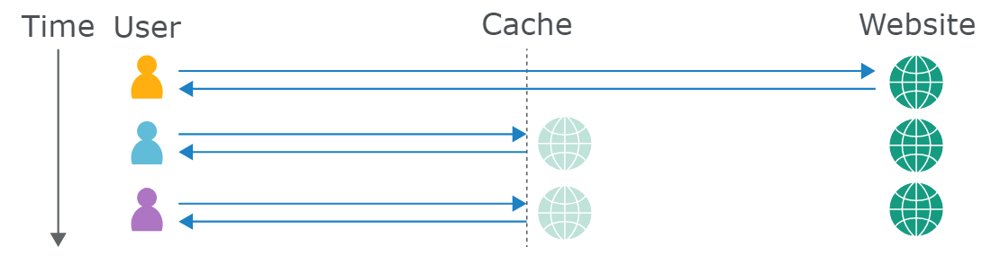
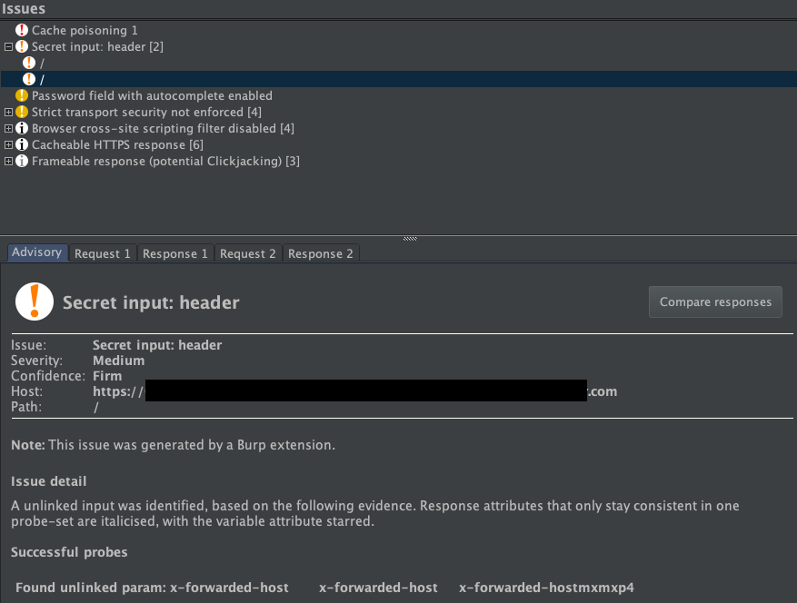
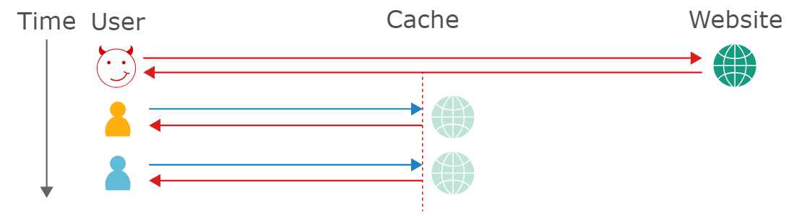

# Web cache poisoning

Phần này nói về web cache poisoning là gì và những hành vi nào có thể dẫn đến lỗ hổng web cache poisoning.

# What is web cache poisoning?

`Web cache poisoning` là một kỹ thuật tiên tiến trong đó kẻ tấn công khai thác hành vi của máy chủ web và bộ đệm để gửi phản hồi HTTP có hại đến những người dùng khác.

Về cơ bản, `Web cache poisoning` bao gồm hai giai đoạn. Đầu tiên, kẻ tấn công phải tìm cách để gây ra phản hồi từ máy chủ phụ trợ vô tình chứa một số loại tải trọng nguy hiểm. Khi thành công, họ cần đảm bảo rằng phản hồi của họ được lưu vào bộ nhớ đệm và sau đó gửi đến các nạn nhân dự định.

Bộ nhớ đệm web bị nhiễm độc có khả năng trở thành phương tiện tàn phá để phát tán nhiều cuộc tấn công khác nhau, khai thác các lỗ hổng như XSS, chèn JavaScript, chuyển hướng mở, v.v.

## How does a web cache work?

Để hiểu cách thức phát sinh lỗ hổng Web cache poisoning, điều quan trọng là phải hiểu cơ bản về cách thức hoạt động của bộ nhớ đệm web.

Nếu máy chủ phải gửi phản hồi mới cho từng yêu cầu HTTP riêng biệt, điều này có thể khiến máy chủ quá tải, dẫn đến sự cố về độ trễ và trải nghiệm người dùng kém, đặc biệt là trong những thời điểm bận rộn. Lưu trữ đệm chủ yếu là một phương tiện để giảm thiểu những vấn đề như vậy.

Bộ nhớ đệm nằm giữa máy chủ và người dùng, nơi lưu trữ (bộ nhớ đệm) các phản hồi cho các yêu cầu cụ thể, thường trong một khoảng thời gian cố định. Nếu người dùng khác gửi một yêu cầu tương đương, bộ nhớ đệm chỉ cần phục vụ một bản sao của phản hồi được lưu trong bộ nhớ đệm trực tiếp cho người dùng mà không cần bất kỳ tương tác nào từ phía phụ trợ. Điều này làm giảm đáng kể tải cho máy chủ bằng cách giảm số lượng yêu cầu trùng lặp phải xử lý.

### Cache keys

Khi bộ nhớ đệm nhận được yêu cầu HTTP, trước tiên nó phải xác định xem có phản hồi được lưu trong bộ nhớ đệm mà nó có thể phục vụ trực tiếp hay không, hay phải chuyển tiếp yêu cầu để máy chủ phụ trợ xử lý. Bộ nhớ đệm xác định các yêu cầu tương đương bằng cách so sánh một tập hợp con được xác định trước của các thành phần yêu cầu, được gọi chung là "Cache key". Thông thường, khóa này sẽ chứa dòng yêu cầu và tiêu đề `Host`. Các thành phần của yêu cầu không được bao gồm trong khóa bộ đệm được gọi là "unkeyed".

Nếu cache key của yêu cầu đến khớp với khóa của yêu cầu trước đó, thì bộ nhớ đệm coi chúng là tương đương. Do đó, nó sẽ phục vụ một bản sao của phản hồi được lưu trong bộ nhớ đệm được tạo cho yêu cầu ban đầu. Điều này áp dụng cho tất cả các yêu cầu tiếp theo có khóa bộ nhớ đệm khớp, cho đến khi phản hồi được lưu trong bộ nhớ đệm hết hạn.

Quan trọng là các thành phần khác của yêu cầu bị bộ nhớ đệm bỏ qua hoàn toàn. Chúng ta sẽ khám phá tác động của hành vi này chi tiết hơn sau.

# What is the impact of a web cache poisoning attack?

Tác động của việc đầu độc bộ nhớ đệm web phụ thuộc rất nhiều vào hai yếu tố chính:

- **Kẻ tấn công có thể lấy được chính xác những gì từ bộ nhớ đệm**\
Vì bộ nhớ đệm bị nhiễm độc dễ phát tán hơn một cuộc tấn công độc lập nên tác động của việc nhiễm độc bộ nhớ đệm web có liên quan chặt chẽ đến mức độ nguy hại của tải trọng được đưa vào. Giống như hầu hết các loại tấn công khác, tấn công đầu độc bộ nhớ đệm web cũng có thể được sử dụng kết hợp với các cuộc tấn công khác để tăng cường tác động tiềm ẩn hơn nữa.

- **Lượng truy cập vào trang bị ảnh hưởng**\
Phản hồi bị đầu độc sẽ chỉ được phục vụ cho người dùng truy cập trang bị ảnh hưởng trong khi bộ nhớ đệm bị đầu độc. Do đó, tác động có thể từ không tồn tại đến rất lớn tùy thuộc vào việc trang đó có phổ biến hay không. Ví dụ, nếu kẻ tấn công có thể đầu độc phản hồi được lưu trong bộ nhớ đệm trên trang chủ của một trang web lớn, cuộc tấn công có thể ảnh hưởng đến hàng nghìn người dùng mà không cần bất kỳ tương tác nào sau đó từ kẻ tấn công.

Lưu ý rằng thời lượng của mục nhập bộ nhớ đệm không nhất thiết ảnh hưởng đến tác động của việc đầu độc bộ nhớ đệm web. Một cuộc tấn công thường có thể được lập trình theo cách đầu độc lại bộ nhớ đệm vô thời hạn.

# Constructing a web cache poisoning attack

Nói chung, việc xây dựng một cuộc tấn công đầu độc bộ nhớ đệm web cơ bản bao gồm các bước sau:

## Identify and evaluate unkeyed inputs

Bất kỳ cuộc tấn công đầu độc bộ nhớ đệm web nào cũng dựa vào việc thao túng các đầu vào không có khóa, chẳng hạn như tiêu đề. Bộ nhớ đệm web sẽ bỏ qua các đầu vào không có khóa khi quyết định có nên cung cấp phản hồi được lưu trong bộ nhớ đệm cho người dùng hay không. Hành vi này có nghĩa là bạn có thể sử dụng chúng để đưa dữ liệu của mình vào và tạo ra phản hồi "bị nhiễm độc", nếu được lưu vào bộ nhớ đệm, phản hồi này sẽ được phục vụ cho tất cả người dùng có yêu cầu có khóa bộ nhớ đệm trùng khớp. Do đó, bước đầu tiên khi thực hiện cuộc tấn công đầu độc bộ đệm web là xác định các đầu vào không có khóa được máy chủ hỗ trợ.

Bạn có thể xác định các đầu vào không có khóa theo cách thủ công bằng cách thêm các đầu vào ngẫu nhiên vào yêu cầu và quan sát xem chúng có ảnh hưởng đến phản hồi hay không. Điều này có thể rõ ràng, chẳng hạn như phản ánh trực tiếp đầu vào trong phản hồi hoặc kích hoạt một phản hồi hoàn toàn khác. Tuy nhiên, đôi khi các hiệu ứng lại tinh tế hơn và cần một chút công việc thám tử để tìm ra. Bạn có thể sử dụng các công cụ như `Burp Comparer` để so sánh phản hồi có và không có dữ liệu đầu vào được đưa vào, nhưng việc này vẫn đòi hỏi khá nhiều công sức thủ công.

### Param Miner

May mắn thay, bạn có thể tự động hóa quy trình xác định các đầu vào không có khóa bằng cách thêm tiện ích mở rộng `Param Miner` vào Burp từ cửa hàng BApp. Để sử dụng `Param Miner`, bạn chỉ cần nhấp chuột phải vào yêu cầu mà bạn muốn điều tra và nhấp vào `Guess headers`. Sau đó, `Param Miner` chạy ở chế độ nền, gửi các yêu cầu chứa các dữ liệu đầu vào khác nhau từ danh sách tiêu đề tích hợp sẵn mở rộng của nó. Nếu một yêu cầu chứa một trong các đầu vào được tiêm vào có tác động đến phản hồi, Param Miner sẽ ghi lại điều này trong Burp, trong ngăn "Issues" nếu bạn đang sử dụng Burp Suite Professional, hoặc trong tab "Output" của tiện ích mở rộng ("Extensions" > "Installed" > "Param Miner" > "Output") nếu bạn đang sử dụng Burp Suite Community Edition.

Ví dụ, trong ảnh chụp màn hình sau, Param Miner tìm thấy tiêu đề `X-Forwarded-Host` không có khóa trên trang chủ của trang web:

Caution: Khi kiểm tra các dữ liệu đầu vào không có khóa trên một trang web trực tiếp, có nguy cơ vô tình khiến bộ nhớ đệm phục vụ phản hồi do bạn tạo cho người dùng thực. Do đó, điều quan trọng là phải đảm bảo rằng tất cả các yêu cầu của bạn đều có khóa bộ nhớ đệm duy nhất để chúng chỉ được phục vụ cho bạn. Để thực hiện việc này, bạn có thể thêm thủ công cache buster (chẳng hạn như tham số duy nhất) vào dòng yêu cầu mỗi khi bạn thực hiện yêu cầu. Ngoài ra, nếu bạn đang sử dụng Param Miner, có các tùy chọn để tự động thêm cache buster vào mọi yêu cầu.

## Elicit a harmful response from the back-end server (Gây ra phản hồi có hại từ back-end)

Sau khi bạn đã xác định được đầu vào không có khóa, bước tiếp theo là đánh giá chính xác cách trang web xử lý đầu vào đó. Hiểu được điều này là điều cần thiết để có thể tạo ra phản hồi có hại thành công. Nếu dữ liệu đầu vào được phản ánh trong phản hồi từ máy chủ mà không được khử trùng đúng cách hoặc được sử dụng để tạo dữ liệu khác một cách động thì đây chính là điểm xâm nhập tiềm ẩn cho việc đầu độc bộ đệm web.

## Get the response cached

Việc điều chỉnh các đầu vào để tạo ra phản hồi có hại chỉ là một nửa chặng đường, nhưng sẽ không đạt được nhiều hiệu quả trừ khi bạn có thể lưu phản hồi vào bộ nhớ đệm, điều này đôi khi có thể rất khó khăn. 

Phản hồi có được lưu vào bộ nhớ đệm hay không có thể phụ thuộc vào nhiều yếu tố, chẳng hạn như phần mở rộng tệp, loại nội dung, route, mã trạng thái và tiêu đề phản hồi. Có lẽ bạn sẽ cần dành chút thời gian để thử nghiệm các yêu cầu trên các trang khác nhau và nghiên cứu cách bộ nhớ đệm hoạt động. Khi bạn tìm ra cách lưu trữ phản hồi có chứa dữ liệu đầu vào độc hại, bạn đã sẵn sàng cung cấp thông tin khai thác cho các nạn nhân tiềm năng.

# Exploiting web cache poisoning vulnerabilities

Quá trình cơ bản này có thể được sử dụng để khám phá và khai thác nhiều lỗ hổng đầu độc bộ nhớ đệm web khác nhau.

Trong một số trường hợp, lỗ hổng đầu độc bộ nhớ đệm web phát sinh do lỗi chung trong thiết kế bộ nhớ đệm. Những lần khác, cách bộ nhớ đệm được triển khai bởi một trang web cụ thể có thể gây ra những điểm kỳ quặc bất ngờ có thể bị khai thác.

# How to prevent web cache poisoning vulnerabilities

