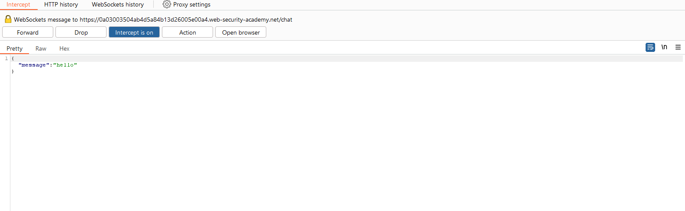

# Testing for WebSockets security vulnerabilities

Trong phần này, chúng tôi sẽ giải thích cách thao tác các kết nối và tin nhắn WebSocket, mô tả các loại lỗ hổng bảo mật có thể phát sinh với WebSocket và đưa ra một số ví dụ về cách khai thác lỗ hổng WebSocket.

## WebSockets

WebSockets được sử dụng rộng rãi trong các ứng dụng web hiện đại. Chúng được khởi tạo qua HTTP và cung cấp các kết nối lâu dài với giao tiếp không đồng bộ theo cả hai hướng. 

WebSockets được sử dụng cho mọi mục đích, bao gồm thực hiện hành động của người dùng và truyền thông tin nhạy cảm. Hầu như bất kỳ lỗ hổng bảo mật web nào phát sinh với HTTP thông thường cũng có thể phát sinh liên quan đến giao tiếp WebSockets.

## Manipulating WebSocket traffic

Việc tìm lỗ hổng bảo mật WebSockets thường liên quan đến việc thao túng chúng theo những cách mà ứng dụng không ngờ tới. Bạn có thể thực hiện việc này bằng Burp Suite.

### Intercepting and modifying WebSocket messages

Bạn có thể sử dụng Burp Proxy để chặn và sửa đổi tin nhắn WebSocket như sau:

- Open Burp's browser.
- Duyệt đến chức năng ứng dụng sử dụng WebSockets. Bạn có thể xác định WebSockets đang được sử dụng bằng cách sử dụng ứng dụng và tìm kiếm các mục xuất hiện trong tab lịch sử WebSockets trong Burp Proxy.
- Trong tab Intercept của Burp Proxy, hãy đảm bảo rằng tính năng chặn đã được bật.
- Khi tin nhắn WebSocket được gửi từ trình duyệt hoặc máy chủ, tin nhắn đó sẽ được hiển thị trong tab `Intercept` để bạn xem hoặc sửa đổi. Nhấn nút `Forward` để chuyển tiếp tin nhắn.

### Replaying and generating new WebSocket messages

Ngoài việc chặn và sửa đổi tin nhắn WebSocket ngay lập tức, có thể phát lại từng tin nhắn và tạo tin nhắn mới. Bạn có thể thực hiện việc này bằng Burp Repeater:

- Trong Burp Proxy, hãy chọn một tin nhắn trong lịch sử WebSockets hoặc trong tab Intercept và chọn `Send to Repeater` từ menu.
- Trong Burp Repeater, giờ đây bạn có thể chỉnh sửa tin nhắn đã chọn và gửi đi nhiều lần.
- Bạn có thể nhập tin nhắn mới và gửi theo bất kỳ hướng nào, tới máy khách hoặc máy chủ.
- Trong bảng `History` trong Burp Repeater, bạn có thể xem lịch sử các tin nhắn đã được truyền qua kết nối WebSocket. Điều này bao gồm các tin nhắn bạn đã tạo trong Burp Repeater cũng như bất kỳ tin nhắn nào được tạo bởi trình duyệt hoặc máy chủ thông qua cùng một kết nối.
- Nếu bạn muốn chỉnh sửa và gửi lại bất kỳ tin nhắn nào trong bảng lịch sử, bạn có thể thực hiện bằng cách chọn tin nhắn và chọn `Edit and resend` từ menu.

### Manipulating WebSocket connections

Ngoài việc thao tác các thông điệp WebSocket, đôi khi cần phải thao tác bắt tay WebSocket để thiết lập kết nối.

Có nhiều tình huống khác nhau mà việc thao tác bắt tay WebSocket có thể cần thiết:
- Nó có thể giúp bạn tiếp cận được nhiều bề mặt tấn công hơn.
- Một số cuộc tấn công có thể khiến kết nối của bạn bị mất nên bạn cần thiết lập kết nối mới.
- Token hoặc dữ liệu khác trong yêu cầu bắt tay ban đầu có thể đã cũ và cần được cập nhật.

Bạn có thể thao tác bắt tay WebSocket bằng Burp Repeater:
- Gửi tin nhắn WebSocket đến Burp Repeater
- Trong Burp Repeater, hãy nhấp vào biểu tượng bút chì bên cạnh URL WebSocket. Thao tác này sẽ mở ra một trình hướng dẫn cho phép bạn kết nối với một WebSocket đã kết nối hiện có, sao chép một WebSocket đã kết nối hoặc kết nối lại với một WebSocket đã ngắt kết nối.
- Nếu bạn chọn sao chép WebSocket đã kết nối hoặc kết nối lại với WebSocket đã ngắt kết nối, thì trình hướng dẫn sẽ hiển thị đầy đủ thông tin chi tiết về yêu cầu bắt tay WebSocket, bạn có thể chỉnh sửa thông tin này nếu cần trước khi thực hiện bắt tay.
- Khi bạn nhấp vào `Connect`, Burp sẽ cố gắng thực hiện bắt tay đã cấu hình và hiển thị kết quả. Nếu kết nối WebSocket mới được thiết lập thành công, bạn có thể sử dụng kết nối này để gửi tin nhắn mới trong Burp Repeater.

## WebSockets security vulnerabilities

Về nguyên tắc, hầu như bất kỳ lỗ hổng bảo mật web nào cũng có thể phát sinh liên quan đến WebSockets:

- Dữ liệu do người dùng cung cấp được truyền đến máy chủ có thể được xử lý theo những cách không an toàn, dẫn đến các lỗ hổng như `SQL injection` hoặc `XML external entity injection`.
- Một số lỗ hổng bảo mật ẩn thông qua WebSockets chỉ có thể phát hiện được bằng các kỹ thuật ngoài băng tần (OAST).
- Nếu dữ liệu do kẻ tấn công kiểm soát được truyền qua WebSockets tới những người dùng ứng dụng khác thì có thể dẫn đến XSS hoặc các lỗ hổng khác ở phía máy khách.

### Manipulating WebSocket messages to exploit vulnerabilities

Phần lớn các lỗ hổng dựa trên đầu vào ảnh hưởng đến WebSocket có thể được tìm thấy và khai thác bằng cách thay đổi nội dung của tin nhắn WebSocket.

Ví dụ, giả sử một ứng dụng trò chuyện sử dụng WebSockets để gửi tin nhắn trò chuyện giữa trình duyệt và máy chủ. Khi người dùng nhập tin nhắn trò chuyện, một tin nhắn WebSocket như sau sẽ được gửi đến máy chủ:\
`{"message":"Hello Carlos"}`

Nội dung của tin nhắn được truyền (một lần nữa thông qua WebSockets) đến một người dùng trò chuyện khác và được hiển thị trên trình duyệt của người dùng như sau:\
`<td>Hello Carlos</td>`

Trong tình huống này, nếu không có biện pháp xử lý đầu vào hoặc phòng thủ nào khác đang được áp dụng, kẻ tấn công có thể thực hiện cuộc tấn công XSS để chứng minh khái niệm bằng cách gửi thông báo WebSocket sau:\
`{"message":""}`

---

### Ví dụ: Manipulating WebSocket messages to exploit vulnerabilities

https://portswigger.net/web-security/websockets/lab-manipulating-messages-to-exploit-vulnerabilities

Vào tính năng Live Chat:

Ta thử inject vào 1 đoạn js nhưng không thấy phản ứng gì đặc biệt:

Quan sát đoạn text được gửi qua websocket ta thấy nó đã bị encode:

Dùng burp ta can thiệp trực tiếp để đoạn text inject ko bị thay đổi khi gửi cho server:

---

## Thao túng việc WebSocket handshake để khai thác 

Một số lỗ hổng WebSockets chỉ có thể được tìm thấy và khai thác bằng cách thao túng bắt tay WebSocket. Các lỗ hổng này có xu hướng liên quan đến các lỗi thiết kế, chẳng hạn như:
- Không tin tưởng vào tiêu đề HTTP để thực hiện các quyết định bảo mật, chẳng hạn như tiêu đề `X-Forwarded-For`.
- Lỗi trong cơ chế xử lý phiên, vì bối cảnh phiên mà tin nhắn WebSocket được xử lý thường được xác định bởi bối cảnh phiên của tin nhắn bắt tay.
- Bề mặt tấn công được giới thiệu thông qua các tiêu đề HTTP tùy chỉnh được ứng dụng sử dụng.

---

### Ví dụ: Manipulating the WebSocket handshake to exploit vulnerabilities

https://portswigger.net/web-security/websockets/lab-manipulating-handshake-to-exploit-vulnerabilities

Vào khung chat

Bật intercept và nhắn 1 tin nhắn trong khung chat để bắt gói tin:

Chuyển message sang repeater và tắt intercept:

Inject 1 đoạn XSS, kết quả là bị ngắt kết nối, khi xem phản hồi ta thấy nó thông báo IP nằm trong black-list:

Thay đổi IP bằng `X-Forwarded-For` và reconnect lại thành công

Cuối cùng gửi 1 đoạn XSS và thấy rằng nó đã phản hồi:

 
---

## How to secure a WebSocket connection

